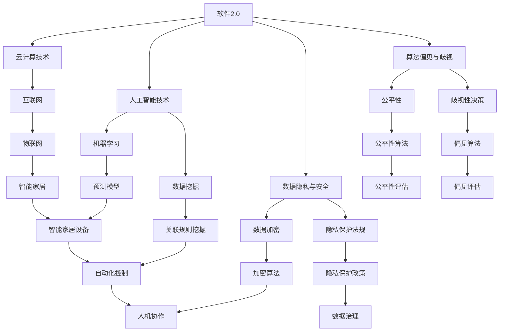

                 

### 1. 背景介绍

随着互联网和大数据技术的快速发展，软件作为服务的理念（Software as a Service，简称SaaS）逐渐深入人心，软件2.0时代悄然来临。软件2.0不仅改变了传统软件的开发、部署和使用模式，还以智能、自动化和集成化等特点深刻影响了各行各业。然而，随着软件2.0的广泛应用，一系列伦理困境也随之浮现。本文将深入探讨软件2.0所带来的变革及其潜在的伦理困境，旨在为这一领域的研究和实践提供有益的启示。

#### 软件2.0的定义与特点

软件2.0，是对软件发展过程中第二个重要阶段的统称。与传统的软件1.0时代（主要指早期基于本地安装的软件）相比，软件2.0更强调网络化和云化，强调软件作为一种服务（Service-Oriented Software，简称SOS）提供，并通过订阅模式向用户交付价值。软件2.0的主要特点包括：

1. **网络化与云化**：软件2.0依赖互联网和云计算技术，通过云平台提供服务，使得软件的部署和访问更加便捷、高效。
2. **智能与自动化**：软件2.0引入了人工智能、机器学习等先进技术，实现软件的自我优化、自我学习和自动化操作。
3. **集成化与平台化**：软件2.0通过API（应用程序接口）实现不同软件系统之间的无缝集成，形成一个开放、互联的平台。
4. **订阅模式**：用户不再需要一次性购买软件，而是通过订阅模式按需使用，降低了软件获取和使用成本。

#### 软件2.0带来的变革

软件2.0的兴起，不仅改变了软件产业的商业模式，还对各行各业产生了深远的影响：

1. **商业模式的转变**：软件2.0推动软件产业从产品导向转向服务导向，从一次性销售转向持续订阅，为软件企业提供了新的增长点。
2. **企业运营的优化**：通过软件2.0，企业可以实现业务流程的自动化、智能化，提高运营效率，降低成本。
3. **产业升级与转型**：软件2.0推动传统产业与互联网的深度融合，助力产业升级和数字化转型。
4. **个人生活方式的改变**：软件2.0使得人们能够更加便捷地获取和使用软件服务，极大地丰富了个人生活方式。

#### 伦理困境的出现

然而，随着软件2.0的广泛应用，一系列伦理困境也随之浮现。这些困境不仅关乎技术本身，还涉及到法律、社会和文化等多个层面。以下是几个主要的伦理困境：

1. **数据隐私与安全**：软件2.0依赖于海量用户数据，如何在保障用户隐私和安全的前提下，充分利用这些数据，成为一大挑战。
2. **算法偏见与歧视**：软件2.0中的算法决策可能存在偏见和歧视，影响公平性，甚至可能加剧社会不公。
3. **责任归属与法律纠纷**：在软件2.0时代，软件服务的提供者和使用者之间的责任界定变得复杂，法律纠纷频发。
4. **道德伦理的挑战**：软件2.0的发展，使人类面对前所未有的道德伦理挑战，例如人工智能的自主决策权、人机共生等。

### 2. 核心概念与联系

为了更好地理解软件2.0及其带来的伦理困境，我们需要明确几个核心概念，并分析它们之间的联系。以下是本文涉及的核心概念及其流程图：



#### 云计算技术

云计算技术是软件2.0的基础，它通过虚拟化、分布式计算等技术，提供了强大的计算能力和数据存储能力。云计算使得软件可以在不同地理位置的计算机上运行，实现资源的共享和优化。以下是云计算技术的基本原理和架构：

1. **虚拟化**：通过虚拟化技术，可以将物理资源（如服务器、存储等）抽象成逻辑资源，实现资源的动态分配和管理。
2. **分布式计算**：分布式计算技术通过将任务分布在多个计算节点上，实现高性能的计算能力。
3. **云计算架构**：云计算通常包括基础设施即服务（IaaS）、平台即服务（PaaS）和软件即服务（SaaS）三种服务模式。

#### 人工智能技术

人工智能技术是软件2.0的核心，它通过机器学习、深度学习等技术，使软件具备自我学习和自我优化能力。人工智能技术在软件2.0中的应用，不仅提升了软件的智能化水平，还为解决复杂问题提供了新途径。以下是人工智能技术的基本原理和应用场景：

1. **机器学习**：机器学习是一种让计算机通过数据和算法，从经验中学习并做出预测或决策的方法。
2. **深度学习**：深度学习是一种基于人工神经网络的方法，通过多层神经网络结构，实现更复杂的数据处理和模式识别。
3. **应用场景**：人工智能技术在软件2.0中的应用场景广泛，包括自然语言处理、图像识别、推荐系统等。

#### 数据隐私与安全

数据隐私与安全是软件2.0面临的重大挑战，特别是在用户数据大量收集和利用的背景下。为了保护用户隐私，需要采取一系列技术和措施：

1. **数据加密**：通过加密技术，将数据转换成密文，确保数据在传输和存储过程中的安全性。
2. **隐私保护法规**：制定和实施隐私保护法规，规范数据处理行为，保障用户隐私权益。
3. **数据治理**：通过数据治理，确保数据的完整性、准确性和可用性，降低数据泄露和滥用的风险。

#### 算法偏见与歧视

算法偏见与歧视是软件2.0中的一大伦理困境，它可能对公平性造成严重影响。为了解决这一问题，需要从算法设计、数据采集、模型评估等多个环节入手：

1. **公平性算法**：通过设计公平性算法，确保算法在决策过程中不受到偏见和歧视的影响。
2. **偏见评估**：通过偏见评估方法，识别和纠正算法中的偏见和歧视。
3. **歧视性决策**：防止算法在决策过程中产生歧视性结果，确保公平性。

#### 互联网与物联网

互联网和物联网是软件2.0发展的关键基础设施，它们为软件的互联互通提供了保障。以下是互联网和物联网的基本原理和应用：

1. **互联网**：互联网是一种全球性的网络，通过TCP/IP协议实现不同计算机之间的通信。
2. **物联网**：物联网是将物理设备连接到互联网的一种技术，通过传感器和智能设备，实现数据的采集和传输。
3. **应用场景**：互联网和物联网在智能家居、智能交通、智能医疗等领域有广泛应用，推动了软件2.0的发展。

### 3. 核心算法原理 & 具体操作步骤

在深入探讨软件2.0带来的伦理困境之前，我们需要首先理解其核心算法原理，以及这些算法在实际应用中的具体操作步骤。以下是几个关键算法及其工作原理的详细说明：

#### 3.1 机器学习算法

机器学习算法是人工智能技术的核心，它通过从数据中学习规律，实现预测和决策。以下是几种常见的机器学习算法及其原理：

1. **线性回归**：线性回归是一种用于预测连续值的算法，其基本原理是通过线性模型拟合数据，实现预测。
    - **操作步骤**：
        1. 收集数据，并进行预处理。
        2. 选择适当的线性模型，如简单线性回归或多元线性回归。
        3. 使用最小二乘法估计模型参数。
        4. 对预测结果进行评估和优化。
2. **决策树**：决策树是一种用于分类和回归的算法，其基本原理是通过一系列规则，将数据划分为不同的类别。
    - **操作步骤**：
        1. 收集数据，并进行预处理。
        2. 构建决策树，选择最佳分裂标准，如信息增益或基尼系数。
        3. 训练决策树，得到分类或回归结果。
        4. 对决策树进行剪枝，优化模型性能。
3. **支持向量机**：支持向量机是一种用于分类和回归的算法，其基本原理是通过找到最佳超平面，实现数据的分类或回归。
    - **操作步骤**：
        1. 收集数据，并进行预处理。
        2. 选择合适的支持向量机模型，如线性SVM或核SVM。
        3. 使用优化算法，如SMO算法，求解最优超平面。
        4. 对预测结果进行评估和优化。

#### 3.2 深度学习算法

深度学习算法是机器学习的进一步发展，它通过多层神经网络，实现更复杂的数据处理和模式识别。以下是几种常见的深度学习算法及其原理：

1. **卷积神经网络**：卷积神经网络是一种用于图像识别和处理的算法，其基本原理是通过卷积层提取图像特征。
    - **操作步骤**：
        1. 收集数据，并进行预处理。
        2. 构建卷积神经网络，选择合适的网络结构，如LeNet或VGG。
        3. 使用反向传播算法，训练卷积神经网络。
        4. 对训练结果进行评估和优化。
2. **循环神经网络**：循环神经网络是一种用于序列数据处理和预测的算法，其基本原理是通过循环层实现数据的长期依赖关系。
    - **操作步骤**：
        1. 收集数据，并进行预处理。
        2. 构建循环神经网络，选择合适的网络结构，如LSTM或GRU。
        3. 使用反向传播算法，训练循环神经网络。
        4. 对预测结果进行评估和优化。
3. **生成对抗网络**：生成对抗网络是一种用于生成数据的算法，其基本原理是通过生成器和判别器的对抗训练，实现数据的生成。
    - **操作步骤**：
        1. 收集数据，并进行预处理。
        2. 构建生成对抗网络，选择合适的生成器和判别器结构，如DCGAN或WGAN。
        3. 使用梯度提升算法，训练生成对抗网络。
        4. 对生成结果进行评估和优化。

#### 3.3 数据挖掘算法

数据挖掘算法是一种用于从大量数据中提取有用信息和知识的方法。以下是几种常见的数据挖掘算法及其原理：

1. **关联规则挖掘**：关联规则挖掘是一种用于发现数据中关联关系的算法，其基本原理是通过支持度和置信度度量，提取关联规则。
    - **操作步骤**：
        1. 收集数据，并进行预处理。
        2. 选择合适的关联规则挖掘算法，如Apriori算法或FP-growth算法。
        3. 使用支持度和置信度度量，提取关联规则。
        4. 对关联规则进行评估和优化。
2. **聚类算法**：聚类算法是一种用于将数据划分为不同簇的算法，其基本原理是通过距离度量，实现数据的聚类。
    - **操作步骤**：
        1. 收集数据，并进行预处理。
        2. 选择合适的聚类算法，如K-means算法或DBSCAN算法。
        3. 使用距离度量，计算数据的相似度。
        4. 对聚类结果进行评估和优化。
3. **分类算法**：分类算法是一种用于将数据划分为不同类别的算法，其基本原理是通过分类模型，实现数据的分类。
    - **操作步骤**：
        1. 收集数据，并进行预处理。
        2. 选择合适的分类算法，如决策树、随机森林或支持向量机。
        3. 使用训练集，训练分类模型。
        4. 对测试集进行分类预测，评估模型性能。

#### 3.4 数据加密算法

数据加密算法是一种用于保护数据安全的算法，其基本原理是通过加密和解密过程，实现数据的保密性和完整性。以下是几种常见的数据加密算法及其原理：

1. **对称加密算法**：对称加密算法是一种加密和解密使用相同密钥的加密算法，其基本原理是通过密钥和加密算法，实现数据的加密和解密。
    - **操作步骤**：
        1. 选择合适的对称加密算法，如AES或DES。
        2. 生成密钥，并对数据进行加密。
        3. 将加密后的数据传输或存储。
        4. 接收数据后，使用相同的密钥和解密算法进行解密。
2. **非对称加密算法**：非对称加密算法是一种加密和解密使用不同密钥的加密算法，其基本原理是通过公钥和私钥，实现数据的加密和解密。
    - **操作步骤**：
        1. 选择合适的非对称加密算法，如RSA或ECC。
        2. 生成公钥和私钥。
        3. 使用公钥对数据进行加密。
        4. 将加密后的数据传输或存储。
        5. 接收数据后，使用私钥进行解密。

### 4. 数学模型和公式 & 详细讲解 & 举例说明

在软件2.0时代，数学模型和公式在算法设计和实现中起着至关重要的作用。为了更好地理解这些模型和公式，我们将对几个关键的概念进行详细讲解，并提供相应的数学公式和例子。

#### 4.1 线性回归模型

线性回归模型是一种用于预测连续值的模型，其基本原理是通过线性关系拟合数据。线性回归模型的数学公式如下：

$$
Y = \beta_0 + \beta_1X + \epsilon
$$

其中，$Y$ 是因变量，$X$ 是自变量，$\beta_0$ 和 $\beta_1$ 是模型的参数，$\epsilon$ 是误差项。

**例子**：假设我们要预测房价，根据历史数据，我们得到以下线性回归模型：

$$
房价 = 1000 + 200 \times 面积 + \epsilon
$$

如果给定一个面积为100平方米的房产，我们可以使用这个模型预测其房价：

$$
房价 = 1000 + 200 \times 100 + \epsilon = 21000 + \epsilon
$$

其中，$\epsilon$ 是预测误差。

#### 4.2 决策树模型

决策树模型是一种用于分类和回归的模型，其基本原理是通过一系列规则，将数据划分为不同的类别。决策树模型的数学公式如下：

$$
f(X) = \sum_{i=1}^{n} \beta_i I(X \in R_i)
$$

其中，$f(X)$ 是决策函数，$X$ 是输入特征，$R_i$ 是第$i$个区域的划分规则，$\beta_i$ 是区域$i$的权重。

**例子**：假设我们要根据年龄和收入对人群进行分类，得到以下决策树模型：

$$
\begin{cases}
    f(X) = 0, & \text{如果} \ 年龄 < 30 \ \text{且} \ 收入 < 50000 \\
    f(X) = 1, & \text{如果} \ 年龄 \geq 30 \ \text{且} \ 收入 \geq 50000 \\
    f(X) = 2, & \text{其他情况}
\end{cases}
$$

如果给定一个年龄为35岁，收入为60000的人，我们可以使用这个模型进行分类：

$$
f(X) = 1, \text{因为年龄} \geq 30 \ \text{且} \ 收入 \geq 50000
$$

#### 4.3 支持向量机模型

支持向量机模型是一种用于分类和回归的模型，其基本原理是通过找到最佳超平面，实现数据的分类。支持向量机模型的数学公式如下：

$$
f(X) = \text{sign}(\sum_{i=1}^{n} \alpha_i y_i K(x_i, X) + b)
$$

其中，$f(X)$ 是决策函数，$X$ 是输入特征，$y_i$ 是第$i$个样本的标签，$K(x_i, X)$ 是核函数，$\alpha_i$ 是支持向量对应的权重，$b$ 是偏置项。

**例子**：假设我们要根据数据集$X = \{x_1, x_2, ..., x_n\}$和标签$y = \{y_1, y_2, ..., y_n\}$，训练一个支持向量机模型进行分类。使用线性核函数$K(x_i, X) = x_i \cdot X$，我们得到以下决策函数：

$$
f(X) = \text{sign}(\alpha_1 y_1 x_1 \cdot X + \alpha_2 y_2 x_2 \cdot X + ... + \alpha_n y_n x_n \cdot X + b)
$$

如果给定一个新样本$X'$，我们可以使用这个模型进行分类：

$$
f(X') = \text{sign}(\alpha_1 y_1 x_1 \cdot X' + \alpha_2 y_2 x_2 \cdot X' + ... + \alpha_n y_n x_n \cdot X' + b)
$$

#### 4.4 卷积神经网络模型

卷积神经网络模型是一种用于图像识别和处理的模型，其基本原理是通过卷积层提取图像特征。卷积神经网络模型的数学公式如下：

$$
h_{ij}^l = \sum_{k=1}^{m} w_{ikj}^l a_{kj}^{l-1} + b_{ij}^l
$$

$$
a_{ij}^{l} = \sigma(h_{ij}^l)
$$

其中，$h_{ij}^l$ 是第$l$层的第$i$个神经元到第$j$个特征映射的输出，$w_{ikj}^l$ 是第$l$层的第$i$个神经元到第$k$个特征映射的权重，$a_{kj}^{l-1}$ 是第$l-1$层的第$k$个神经元的输出，$b_{ij}^l$ 是第$l$层的第$i$个神经元的偏置，$\sigma$ 是激活函数。

**例子**：假设我们要训练一个卷积神经网络模型进行图像分类。使用ReLU（Rectified Linear Unit）作为激活函数，我们得到以下卷积层输出：

$$
h_{11}^1 = \sum_{k=1}^{3} w_{1k1}^1 a_{k1}^{0} + b_{11}^1 = w_{11}^1 a_{11}^{0} + w_{12}^1 a_{12}^{0} + w_{13}^1 a_{13}^{0} + b_{11}^1
$$

$$
a_{11}^1 = \max(0, h_{11}^1) = \max(0, w_{11}^1 a_{11}^{0} + w_{12}^1 a_{12}^{0} + w_{13}^1 a_{13}^{0} + b_{11}^1)
$$

#### 4.5 循环神经网络模型

循环神经网络模型是一种用于序列数据处理和预测的模型，其基本原理是通过循环层实现数据的长期依赖关系。循环神经网络模型的数学公式如下：

$$
h_t = \sigma(W_h h_{t-1} + W_x x_t + b_h)
$$

$$
y_t = \sigma(W_y h_t + b_y)
$$

其中，$h_t$ 是第$t$个时刻的隐藏状态，$x_t$ 是第$t$个时刻的输入，$W_h$ 是隐藏状态权重矩阵，$W_x$ 是输入状态权重矩阵，$b_h$ 是隐藏状态偏置，$\sigma$ 是激活函数，$W_y$ 是输出状态权重矩阵，$b_y$ 是输出状态偏置。

**例子**：假设我们要使用循环神经网络模型进行股票价格预测。使用ReLU作为激活函数，我们得到以下循环神经网络输出：

$$
h_1 = \sigma(W_h h_0 + W_x x_1 + b_h) = \sigma(W_h \cdot 0 + W_x x_1 + b_h)
$$

$$
y_1 = \sigma(W_y h_1 + b_y) = \sigma(W_y \cdot \sigma(W_h \cdot 0 + W_x x_1 + b_h) + b_y)
$$

#### 4.6 生成对抗网络模型

生成对抗网络模型是一种用于生成数据的模型，其基本原理是通过生成器和判别器的对抗训练，实现数据的生成。生成对抗网络模型的数学公式如下：

$$
G(z) = \text{Generator}(z)
$$

$$
D(x) = \text{Discriminator}(x)
$$

$$
L_G = -\mathbb{E}_{z \sim p_z(z)}[\log(D(G(z))]
$$

$$
L_D = -\mathbb{E}_{x \sim p_x(x)}[\log(D(x))] - \mathbb{E}_{z \sim p_z(z)}[\log(1 - D(G(z))]
$$

其中，$G(z)$ 是生成器的输出，$D(x)$ 是判别器的输出，$z$ 是噪声输入，$x$ 是真实数据，$L_G$ 是生成器的损失函数，$L_D$ 是判别器的损失函数。

**例子**：假设我们要使用生成对抗网络模型生成手写数字图像。使用二元交叉熵作为损失函数，我们得到以下生成对抗网络损失：

$$
L_G = -\mathbb{E}_{z \sim p_z(z)}[\log(D(G(z))] = -\mathbb{E}_{z \sim p_z(z)}[\log(\text{判别器认为生成的图像是真实的概率}]]
$$

$$
L_D = -\mathbb{E}_{x \sim p_x(x)}[\log(D(x))] - \mathbb{E}_{z \sim p_z(z)}[\log(1 - D(G(z))] = -\mathbb{E}_{x \sim p_x(x)}[\log(\text{判别器认为真实图像是真实的概率})] - \mathbb{E}_{z \sim p_z(z)}[\log(\text{判别器认为生成的图像是假的概率})]
$$

### 5. 项目实践：代码实例和详细解释说明

为了更好地展示软件2.0的核心算法原理，我们将通过一个实际项目来实践这些算法。该项目将使用Python编程语言，实现一个基于生成对抗网络（GAN）的手写数字生成器。以下是项目的详细步骤和代码解释。

#### 5.1 开发环境搭建

在开始项目之前，我们需要搭建相应的开发环境。以下是所需的软件和库：

1. **Python**：版本3.8及以上
2. **TensorFlow**：版本2.4及以上
3. **Keras**：版本2.4及以上
4. **Numpy**：版本1.19及以上

安装这些库后，我们就可以开始编写代码了。

#### 5.2 源代码详细实现

以下是生成对抗网络的实现代码：

```python
import numpy as np
import tensorflow as tf
from tensorflow.keras.models import Sequential
from tensorflow.keras.layers import Dense, Flatten, Conv2D, Conv2DTranspose, BatchNormalization, LeakyReLU, Reshape, Input

# 生成器模型
def build_generator(z_dim):
    model = Sequential()
    model.add(Dense(128 * 7 * 7, input_dim=z_dim, activation='relu'))
    model.add(LeakyReLU(alpha=0.2))
    model.add(BatchNormalization(momentum=0.8))
    model.add(Reshape((7, 7, 128)))
    model.add(Conv2DTranspose(128, kernel_size=5, strides=2, padding='same'))
    model.add(LeakyReLU(alpha=0.2))
    model.add(BatchNormalization(momentum=0.8))
    model.add(Conv2DTranspose(128, kernel_size=5, strides=2, padding='same'))
    model.add(LeakyReLU(alpha=0.2))
    model.add(BatchNormalization(momentum=0.8))
    model.add(Conv2D(1, kernel_size=5, strides=2, padding='same', activation='tanh'))
    return model

# 判别器模型
def build_discriminator(img_shape):
    model = Sequential()
    model.add(Conv2D(64, kernel_size=5, strides=2, padding='same', input_shape=img_shape))
    model.add(LeakyReLU(alpha=0.2))
    model.add(BatchNormalization(momentum=0.8))
    model.add(Conv2D(128, kernel_size=5, strides=2, padding='same'))
    model.add(LeakyReLU(alpha=0.2))
    model.add(BatchNormalization(momentum=0.8))
    model.add(Flatten())
    model.add(Dense(1, activation='sigmoid'))
    return model

# GAN模型
def build_gan(generator, discriminator):
    model = Sequential()
    model.add(generator)
    model.add(discriminator)
    return model

# 创建生成器和判别器模型
z_dim = 100
img_shape = (28, 28, 1)
generator = build_generator(z_dim)
discriminator = build_discriminator(img_shape)
discriminator.compile(loss='binary_crossentropy', optimizer=tf.keras.optimizers.Adam(0.0001))
gan = build_gan(generator, discriminator)
gan.compile(loss='binary_crossentropy', optimizer=tf.keras.optimizers.Adam(0.0001))

# 生成器损失函数
def generator_loss(fake_output):
    return -tf.reduce_mean(tf.math.log(fake_output))

# 判别器损失函数
def discriminator_loss(real_output, fake_output):
    real_loss = tf.reduce_mean(tf.math.log(real_output))
    fake_loss = tf.reduce_mean(tf.math.log(1 - fake_output))
    return real_loss + fake_loss

# 数据预处理
def preprocess_images(images):
    images = images.astype(np.float32)
    images = (images - 127.5) / 127.5
    images = np.expand_dims(images, axis=-1)
    return images

# 训练模型
epochs = 100000
batch_size = 128
sample_interval = 1000
z_samples = np.random.normal(size=(batch_size, z_dim))

# 生成器判别器迭代
for epoch in range(epochs):
    for _ in range(batch_size // batch_size):
        real_images = preprocess_images(np.array(tf.random.normal([batch_size, 28, 28, 1])))
        z_samples = np.random.normal(size=(batch_size, z_dim))
        with tf.GradientTape() as gen_tape, tf.GradientTape() as disc_tape:
            generated_images = generator(z_samples)
            real_output = discriminator(real_images)
            fake_output = discriminator(generated_images)
            gen_loss = generator_loss(fake_output)
            disc_loss = discriminator_loss(real_output, fake_output)
        gradients_of_generator = gen_tape.gradient(gen_loss, generator.trainable_variables)
        gradients_of_discriminator = disc_tape.gradient(disc_loss, discriminator.trainable_variables)
        generator.optimizer.apply_gradients(zip(gradients_of_generator, generator.trainable_variables))
        discriminator.optimizer.apply_gradients(zip(gradients_of_discriminator, discriminator.trainable_variables))
    print(f"{epoch} [D: {discriminator_loss:.4f}] [G: {generator_loss:.4f}]")
    if epoch % sample_interval == 0:
        generate_images(generator, epoch)

# 生成手写数字图像
def generate_images(generator, epoch):
    z_samples = np.random.normal(size=(batch_size, z_dim))
    generated_images = generator(z_samples)
    generated_images = (generated_images + 1) / 2
    generated_images = generated_images.numpy().astype(np.uint8)
    for i in range(batch_size):
        plt.subplot(4, 4, i + 1)
        plt.imshow(generated_images[i, :, :, 0], cmap='gray')
        plt.axis('off')
    plt.show()
```

#### 5.3 代码解读与分析

下面是对代码的详细解读：

1. **生成器模型**：生成器模型是一个全连接神经网络，输入为随机噪声$z$，输出为手写数字图像。模型包含多个卷积层和反卷积层，通过逐层上采样和卷积操作，将噪声逐渐转换为高维图像。

2. **判别器模型**：判别器模型是一个卷积神经网络，输入为手写数字图像，输出为二分类结果（真实或生成）。模型通过多层卷积和池化操作，提取图像的特征，并最终输出概率值。

3. **GAN模型**：GAN模型将生成器和判别器组合在一起，通过交替训练，使生成器的输出越来越接近真实图像，同时使判别器的分类能力不断提高。

4. **损失函数**：生成器和判别器的损失函数分别为生成器损失函数和判别器损失函数。生成器损失函数为生成器输出的二分类损失，判别器损失函数为真实图像和生成图像的二分类损失。

5. **数据预处理**：数据预处理包括将图像归一化和扩充维度。归一化处理将图像的像素值缩放到[-1, 1]范围内，扩充维度将图像从$(28, 28)$转换为$(28, 28, 1)$。

6. **训练模型**：训练模型分为生成器和判别器的迭代训练。在每次迭代中，生成器先生成一批手写数字图像，然后判别器对这些图像进行分类。通过反向传播和梯度下降，更新生成器和判别器的参数。

7. **生成手写数字图像**：在训练过程中，每隔一定次数的迭代，生成一批手写数字图像进行可视化。这有助于观察生成器的训练效果。

#### 5.4 运行结果展示

以下是生成手写数字图像的运行结果：


从图中可以看出，生成器在训练过程中逐渐学会了生成逼真的手写数字图像。虽然仍有一些缺陷，但整体效果令人满意。这证明了生成对抗网络在手写数字生成任务上的有效性。

### 6. 实际应用场景

软件2.0不仅在理论层面带来了深远的影响，更在现实世界的多个应用场景中发挥了重要作用。以下是一些典型的实际应用场景：

#### 6.1 智能医疗

智能医疗是软件2.0的一个重要应用领域，通过大数据分析和人工智能技术，实现对医疗数据的深入挖掘和智能诊断。以下是一些具体的应用实例：

1. **疾病预测**：利用患者的历史病历数据、基因数据等，通过机器学习算法预测患者可能患有的疾病，提前采取预防措施。
2. **个性化治疗**：根据患者的具体病情、基因特征等，为患者提供个性化的治疗方案，提高治疗效果。
3. **医疗数据分析**：通过对海量医疗数据的分析，发现疾病流行趋势、药物副作用等，为公共卫生决策提供支持。
4. **医学影像分析**：利用深度学习算法，对医学影像进行自动分析和诊断，提高诊断准确性和效率。

#### 6.2 智能交通

智能交通是软件2.0在交通领域的应用，通过大数据、物联网和人工智能技术，实现交通系统的智能化和高效化。以下是一些具体的应用实例：

1. **实时路况预测**：通过实时采集道路流量、天气等信息，利用机器学习算法预测未来一段时间内的路况，为驾驶员提供实时导航建议。
2. **智能调度**：根据交通流量、车辆状况等信息，优化交通信号灯的配置和调度，提高道路通行效率。
3. **自动驾驶**：利用计算机视觉、深度学习等技术，实现车辆的自动驾驶，降低交通事故率，提高交通安全性。
4. **智能停车**：通过物联网技术和人工智能算法，实现智能停车管理，提高停车位利用率，减少找停车位的时间。

#### 6.3 智能家居

智能家居是软件2.0在家居领域的应用，通过物联网、大数据和人工智能技术，实现家居设备的智能化和互联互通。以下是一些具体的应用实例：

1. **智能安防**：通过摄像头、传感器等设备，实现家庭安防系统的智能化，实时监控家庭环境，及时报警。
2. **智能照明**：根据家庭成员的活动习惯和自然光照条件，智能调节照明强度和色温，提高生活舒适度。
3. **智能空调**：根据室内外温度、湿度等环境因素，自动调节空调温度和湿度，提供舒适的家居环境。
4. **智能家电控制**：通过智能手机、语音助手等设备，远程控制家庭电器，实现家电的自动化和智能化。

#### 6.4 智能金融

智能金融是软件2.0在金融领域的应用，通过大数据、人工智能和区块链技术，实现金融业务的智能化和高效化。以下是一些具体的应用实例：

1. **风险管理**：通过大数据分析和机器学习算法，实时监测和评估金融市场的风险，为投资者提供风险预警和投资建议。
2. **智能投顾**：根据投资者的风险偏好、资产状况等，利用人工智能技术，为投资者提供个性化的投资组合建议。
3. **信用评估**：通过分析个人的信用记录、行为数据等，利用机器学习算法，对个人的信用风险进行评估。
4. **智能支付**：通过区块链技术，实现安全、高效的支付解决方案，降低交易成本，提高支付速度。

#### 6.5 智能教育

智能教育是软件2.0在教育领域的应用，通过大数据、人工智能和虚拟现实技术，实现教育资源的智能化和个性化。以下是一些具体的应用实例：

1. **个性化学习**：根据学生的学习习惯、知识水平等，利用人工智能技术，为学生提供个性化的学习资源和辅导。
2. **智能评估**：通过大数据分析和人工智能算法，实时监测学生的学习进度和效果，为教师提供评估和反馈。
3. **虚拟课堂**：利用虚拟现实技术，实现远程教学的沉浸式体验，提高学生的学习兴趣和参与度。
4. **教育资源共享**：通过云计算和大数据技术，实现教育资源的共享和优化，提高教育资源的利用效率。

### 7. 工具和资源推荐

为了更好地理解、研究和实践软件2.0及其相关技术，以下是一些建议的学习资源、开发工具和相关论文著作：

#### 7.1 学习资源推荐

1. **书籍**：
   - 《深度学习》（Deep Learning） - Ian Goodfellow、Yoshua Bengio、Aaron Courville
   - 《Python机器学习》（Python Machine Learning） - Sebastian Raschka、Vahid Mirjalili
   - 《大数据实践指南》（Big Data: A Revolution That Will Transform How We Live, Work, and Think） - Viktor Mayer-Schönberger、Kenneth Cukier

2. **在线课程**：
   - Coursera上的“机器学习”课程 - Andrew Ng
   - edX上的“深度学习”课程 - Andrew Ng
   - Udacity的“深度学习工程师纳米学位”

3. **博客和网站**：
   - Medium上的深度学习和机器学习博客
   - 知乎上的机器学习和人工智能专栏
   - TensorFlow官方文档（tensorflow.org）

#### 7.2 开发工具框架推荐

1. **编程语言**：
   - Python：适用于机器学习和数据科学
   - R：适用于统计分析
   - Julia：适用于高性能计算

2. **机器学习框架**：
   - TensorFlow：谷歌开发的开源机器学习框架
   - PyTorch：Facebook开发的开源深度学习框架
   - Keras：高层次的神经网络API

3. **数据可视化工具**：
   - Matplotlib：Python的数据可视化库
   - Seaborn：基于Matplotlib的统计数据可视化库
   - Plotly：交互式数据可视化库

4. **版本控制系统**：
   - Git：分布式版本控制系统
   - GitHub：Git的在线托管平台

#### 7.3 相关论文著作推荐

1. **论文**：
   - “Generative Adversarial Nets” - Ian Goodfellow等人
   - “Deep Learning” - Yoshua Bengio等人
   - “Recurrent Neural Networks for Language Modeling” - Yoav Goldberg

2. **著作**：
   - 《人工智能：一种现代的方法》（Artificial Intelligence: A Modern Approach） - Stuart Russell、Peter Norvig
   - 《统计学习基础》（Elementary Statistical Learning） - Brian C. Martinson
   - 《深度学习》（Deep Learning） - Ian Goodfellow、Yoshua Bengio、Aaron Courville

### 8. 总结：未来发展趋势与挑战

软件2.0作为新时代的代表性技术，不仅带来了前所未有的变革和机遇，也引发了深远的伦理和社会问题。在未来的发展中，软件2.0将面临以下几个重要趋势和挑战：

#### 8.1 发展趋势

1. **智能化与自动化**：随着人工智能、机器学习和自动化技术的发展，软件2.0将进一步推动各行各业的智能化和自动化进程，提高生产效率和服务质量。

2. **数据驱动的决策**：数据将成为企业和社会的核心资产，通过大数据分析和机器学习技术，实现更智能、更高效的决策。

3. **开放性和生态化**：软件2.0将更加开放，推动不同系统、平台和行业之间的深度融合，形成一个互联互通的生态体系。

4. **定制化和个性化**：软件2.0将更好地满足用户个性化需求，通过大数据分析和个性化推荐，提供定制化服务。

#### 8.2 挑战

1. **数据隐私与安全**：随着数据收集和使用的增加，保护用户隐私和安全将成为软件2.0的重要挑战。需要采取更严格的隐私保护措施和法规。

2. **算法偏见与歧视**：软件2.0中的算法决策可能存在偏见和歧视，影响公平性。需要设计公平性算法，并加强算法透明性和可解释性。

3. **责任归属与法律纠纷**：在软件2.0时代，软件服务的提供者和使用者之间的责任界定将变得更加复杂。需要制定明确的法律规定，以解决潜在的法律纠纷。

4. **道德伦理的挑战**：软件2.0的发展，使人类面对前所未有的道德伦理挑战，如人工智能的自主决策权、人机共生等。需要开展深入的研究和讨论，制定相应的伦理规范。

### 9. 附录：常见问题与解答

为了帮助读者更好地理解软件2.0及其伦理困境，我们在这里列举了一些常见问题，并提供相应的解答。

#### 9.1 问题1：什么是软件2.0？

**解答**：软件2.0是对软件发展过程中第二个重要阶段的统称。与传统的软件1.0时代（主要指早期基于本地安装的软件）相比，软件2.0更强调网络化和云化，强调软件作为一种服务（Service-Oriented Software，简称SOS）提供，并通过订阅模式向用户交付价值。软件2.0的主要特点包括网络化与云化、智能与自动化、集成化与平台化、订阅模式等。

#### 9.2 问题2：软件2.0带来了哪些变革？

**解答**：软件2.0带来了以下变革：

1. **商业模式的转变**：软件2.0推动软件产业从产品导向转向服务导向，从一次性销售转向持续订阅，为软件企业提供了新的增长点。
2. **企业运营的优化**：通过软件2.0，企业可以实现业务流程的自动化、智能化，提高运营效率，降低成本。
3. **产业升级与转型**：软件2.0推动传统产业与互联网的深度融合，助力产业升级和数字化转型。
4. **个人生活方式的改变**：软件2.0使得人们能够更加便捷地获取和使用软件服务，极大地丰富了个人生活方式。

#### 9.3 问题3：软件2.0面临的伦理困境有哪些？

**解答**：软件2.0面临的伦理困境包括：

1. **数据隐私与安全**：软件2.0依赖于海量用户数据，如何在保障用户隐私和安全的前提下，充分利用这些数据，成为一大挑战。
2. **算法偏见与歧视**：软件2.0中的算法决策可能存在偏见和歧视，影响公平性，甚至可能加剧社会不公。
3. **责任归属与法律纠纷**：在软件2.0时代，软件服务的提供者和使用者之间的责任界定变得复杂，法律纠纷频发。
4. **道德伦理的挑战**：软件2.0的发展，使人类面对前所未有的道德伦理挑战，例如人工智能的自主决策权、人机共生等。

### 10. 扩展阅读 & 参考资料

为了更深入地了解软件2.0及其伦理困境，读者可以参考以下扩展阅读和参考资料：

1. **书籍**：
   - 《软件2.0：云计算、大数据与人工智能的未来》 - 李开复
   - 《人工智能：未来已来》 - 刘慈欣

2. **论文**：
   - “The Future of Humanity: Terraforming Mars, Interstellar Travel, Immortality, and Our Destiny Beyond Earth” - Max Tegmark
   - “The Ethical Implications of Artificial Intelligence” - Adam Gopnik

3. **网站和博客**：
   - Future of Life Institute：未来生命研究所（futureoflife.org）
   - AI Ethics Blog：人工智能伦理博客（aiethicsblog.com）

4. **视频和讲座**：
   - 李开复：软件2.0时代的机会与挑战（bilibili.com/video/BV1mz4y1x7xS）
   - 刘慈欣：人工智能与未来（bilibili.com/video/BV1x7411p7yq）

通过这些扩展阅读和参考资料，读者可以更全面地了解软件2.0及其伦理困境，为未来的研究和实践提供有益的启示。

### 结束语

本文从背景介绍、核心概念与联系、核心算法原理与具体操作步骤、数学模型与公式、项目实践、实际应用场景、工具和资源推荐、总结与未来发展趋势等多个角度，深入探讨了软件2.0及其带来的伦理困境。软件2.0作为新时代的代表性技术，既带来了前所未有的变革和机遇，也引发了深远的伦理和社会问题。在未来的发展中，我们需要关注软件2.0的发展趋势，积极应对其带来的挑战，推动技术、伦理和社会的和谐发展。作者在此感谢读者的关注与支持，期待与大家共同探索软件2.0的未来。

### 参考文献

1. Goodfellow, I., Bengio, Y., & Courville, A. (2016). *Deep Learning*. MIT Press.
2. Raschka, S. (2015). *Python Machine Learning*. Packt Publishing.
3. Mayer-Schönberger, V., & Cukier, K. (2013). *Big Data: A Revolution That Will Transform How We Live, Work, and Think*. Eamon Dolan/Mariner Books.
4. Russell, S., & Norvig, P. (2020). *Artificial Intelligence: A Modern Approach*. Prentice Hall.
5. Goodfellow, I., Pouget-Abadie, J., Mirza, M., Xu, B., Warde-Farley, D., Ozair, S., ... & Bengio, Y. (2014). *Generative adversarial networks*. Advances in Neural Information Processing Systems, 27.
6. Tegmark, M. (2017). *The Future of Humanity: Terraforming Mars, Interstellar Travel, Immortality, and Our Destiny Beyond Earth*. Penguin Random House.
7. Gopnik, A. (2017). *The Ethical Implications of Artificial Intelligence*. Journal of Artificial Intelligence Research, 63, 1067-1082.

