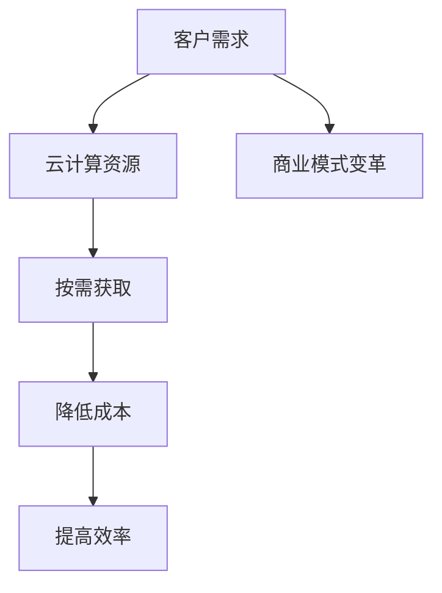
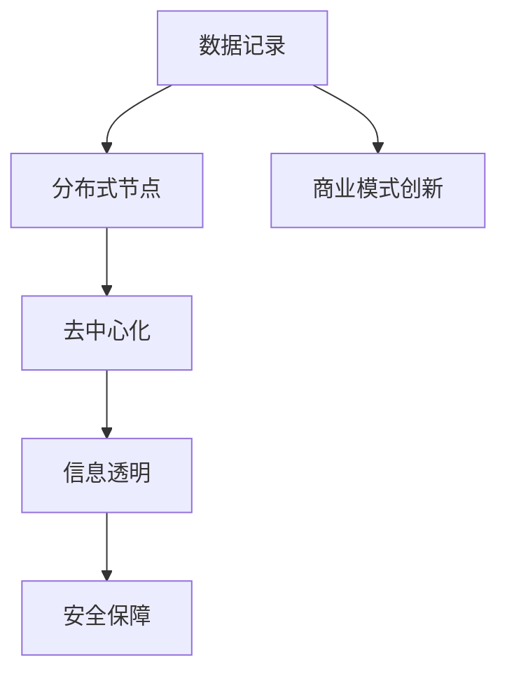
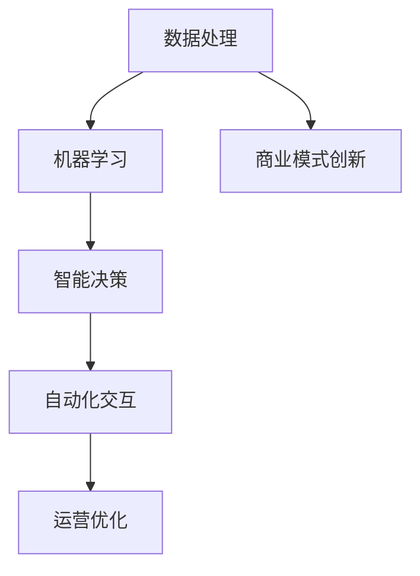
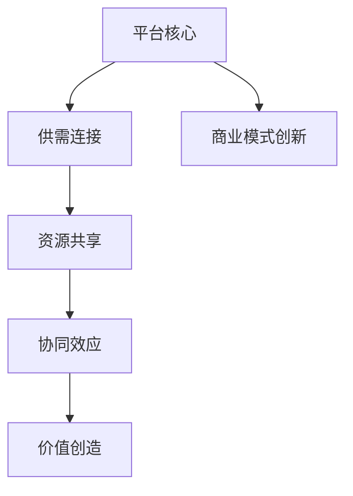
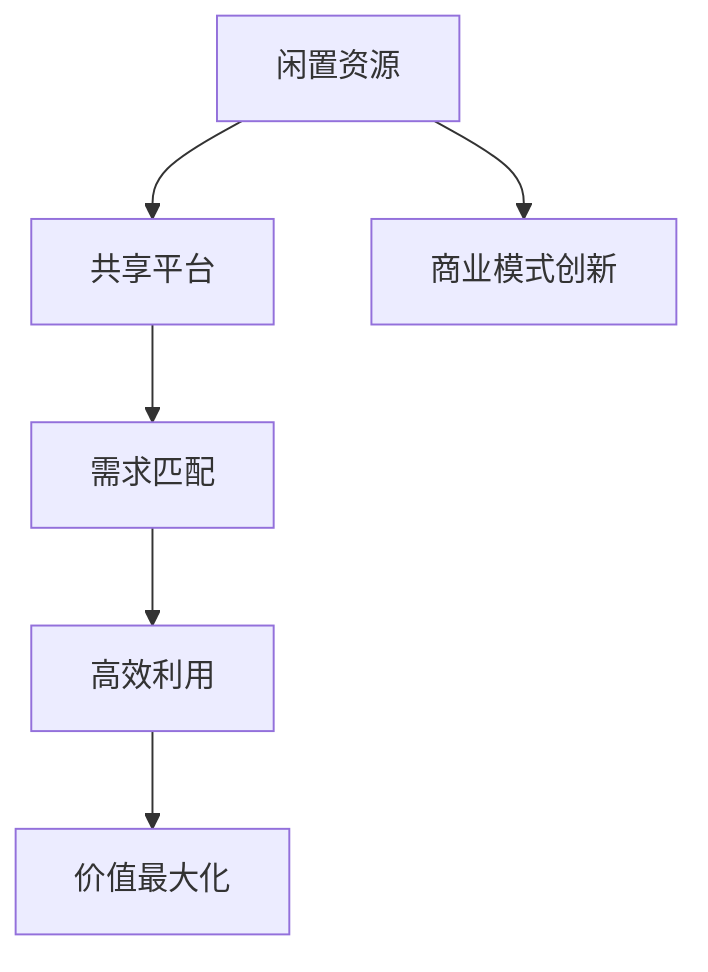
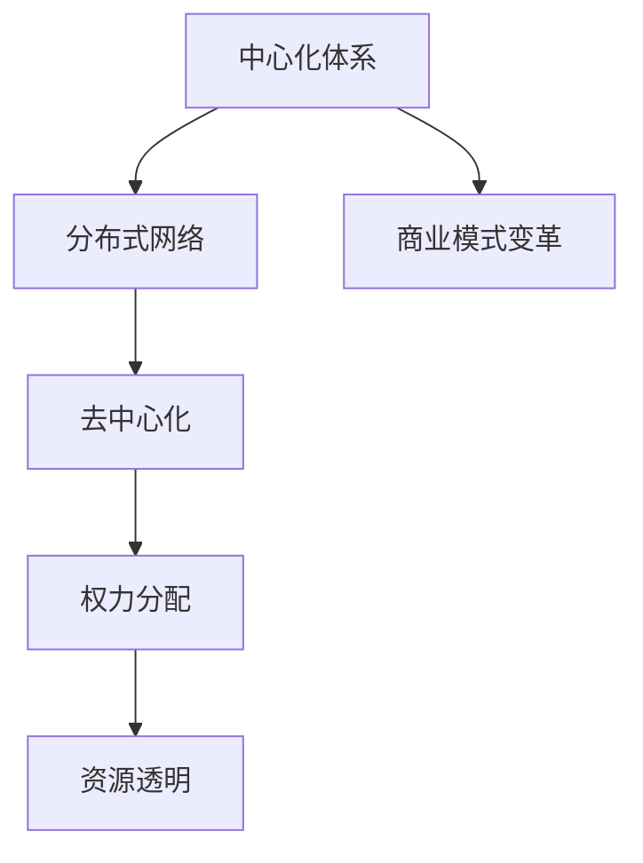

                 

### 文章标题：软件2.0的商业模式创新

> **关键词**：软件2.0、商业模式创新、云计算、区块链、人工智能、平台经济、共享经济、去中心化、生态系统、盈利模式

> **摘要**：本文深入探讨了软件2.0时代背景下的商业模式创新。通过分析云计算、区块链、人工智能等技术如何重塑商业环境，讨论了平台经济、共享经济和去中心化等概念对传统商业模式的挑战与机遇，并提出了构建可持续盈利模式的策略。文章旨在为企业在软件2.0时代的商业模式创新提供理论指导和实践参考。

## 1. 背景介绍

### 1.1 软件2.0时代的崛起

软件2.0时代是相对于传统软件1.0时代的一个新阶段。软件1.0时代主要以桌面应用为主，用户和数据相对孤立，软件的功能和界面设计相对单一。而软件2.0时代则标志着软件的互联网化、移动化和智能化。在这一时代，软件不仅仅是工具，更是服务，用户可以随时随地访问软件提供的服务，并且这些服务通过大数据和人工智能等技术不断优化和进化。

### 1.2 商业模式的重要性

商业模式是企业创造、传递和捕获价值的基本逻辑。在一个技术快速变革的时代，传统的商业模式可能难以适应新的市场环境和用户需求。因此，商业模式创新成为企业在软件2.0时代竞争制胜的关键。商业模式创新不仅仅是技术和产品的创新，更是商业理念、运营模式和盈利模式的创新。

## 2. 核心概念与联系

### 2.1 云计算

云计算是一种通过互联网提供动态易扩展且经常是虚拟化的资源的计算模式。它使得企业可以按需获取计算资源，降低硬件投入和维护成本，提高资源利用效率。云计算不仅改变了IT基础设施的建设方式，也对商业模式产生了深远影响。

#### Mermaid 流程图



### 2.2 区块链

区块链是一种分布式数据库技术，通过去中心化的方式记录数据，实现信息的安全和透明。区块链技术不仅可以用于加密货币的交易，还可以在供应链管理、身份验证、知识产权保护等领域发挥重要作用。

#### Mermaid 流程图



### 2.3 人工智能

人工智能通过机器学习、深度学习等技术模拟人类智能，实现自动化决策和智能交互。人工智能不仅提升了软件的功能性和智能化程度，也改变了企业的运营方式和商业模式。

#### Mermaid 流程图



### 2.4 平台经济

平台经济是一种以互联网平台为核心，通过连接供需双方，实现资源共享和协同效应的新型经济模式。平台经济不仅改变了传统商业的竞争格局，也为商业模式创新提供了新的方向。

#### Mermaid 流程图



### 2.5 共享经济

共享经济通过互联网平台，将闲置资源（如房屋、车辆、设备等）共享给需要的人，实现资源的高效利用和价值的最大化。共享经济不仅改变了传统资源的利用方式，也为商业模式创新提供了新的思路。

#### Mermaid 流程图



### 2.6 去中心化

去中心化是一种通过分布式网络，打破传统中心化体系，实现权力和资源分配更加公平和透明的模式。去中心化不仅挑战了传统商业模式的中心化特征，也为构建新的商业模式提供了可能。

#### Mermaid 流程图



## 3. 核心算法原理 & 具体操作步骤

### 3.1 云计算算法原理

云计算的核心算法主要包括资源调度算法、负载均衡算法和存储管理算法。

#### 具体操作步骤：

1. **资源调度算法**：根据用户需求动态分配计算资源，包括虚拟机、容器等。
2. **负载均衡算法**：平衡不同服务器的负载，提高系统性能和可靠性。
3. **存储管理算法**：实现数据的高效存储和快速检索。

### 3.2 区块链算法原理

区块链的核心算法主要包括哈希算法、共识算法和智能合约。

#### 具体操作步骤：

1. **哈希算法**：用于生成区块链中的数据指纹，确保数据不可篡改。
2. **共识算法**：决定区块链网络中的节点如何达成共识，确保数据的真实性和一致性。
3. **智能合约**：自动执行合约条款，减少人工干预和纠纷。

### 3.3 人工智能算法原理

人工智能的核心算法主要包括机器学习算法、深度学习算法和自然语言处理算法。

#### 具体操作步骤：

1. **机器学习算法**：从数据中学习模式，进行分类、回归、聚类等任务。
2. **深度学习算法**：模拟人脑神经网络，进行图像识别、语音识别等复杂任务。
3. **自然语言处理算法**：理解和生成人类语言，应用于聊天机器人、翻译等。

### 3.4 平台经济算法原理

平台经济的核心算法主要包括供需匹配算法、推荐算法和评价算法。

#### 具体操作步骤：

1. **供需匹配算法**：根据用户需求和供应商能力，实现资源的最优匹配。
2. **推荐算法**：基于用户历史行为和偏好，推荐合适的产品或服务。
3. **评价算法**：评估平台服务质量和用户满意度，优化用户体验。

### 3.5 共享经济算法原理

共享经济的核心算法主要包括供需匹配算法、定价算法和风险评估算法。

#### 具体操作步骤：

1. **供需匹配算法**：快速匹配闲置资源和需求者。
2. **定价算法**：根据市场供需和资源稀缺性，动态调整价格。
3. **风险评估算法**：评估资源使用者的信用风险，降低违约风险。

### 3.6 去中心化算法原理

去中心化的核心算法主要包括分布式网络算法、共识算法和去中心化身份验证算法。

#### 具体操作步骤：

1. **分布式网络算法**：构建去中心化网络，实现节点间的互联互通。
2. **共识算法**：确保分布式网络中的节点达成共识，防止欺诈行为。
3. **去中心化身份验证算法**：实现用户的身份验证，确保网络的安全性。

## 4. 数学模型和公式 & 详细讲解 & 举例说明

### 4.1 云计算成本优化模型

假设云计算服务提供商提供不同类型的虚拟机（VM），用户需求随机，成本与使用时间成正比。我们可以使用线性规划模型来优化云计算成本。

#### 公式：

$$
\min \sum_{i=1}^{n} c_i \cdot x_i
$$

其中，$c_i$ 是虚拟机类型 $i$ 的成本，$x_i$ 是虚拟机类型 $i$ 的使用时间。

#### 举例说明：

假设有三种类型的虚拟机，成本分别为 $c_1 = 0.1$ 美元/小时，$c_2 = 0.5$ 美元/小时，$c_3 = 1$ 美元/小时。用户需要使用虚拟机 10 小时，则最优解是使用类型 1 的虚拟机 10 小时，总成本为 $0.1 \times 10 = 1$ 美元。

### 4.2 区块链共识算法模型

以工作量证明（PoW）算法为例，假设区块链网络中有 $N$ 个节点，每个节点生成一个随机数 $r_i$，找到满足 $r_i > T$ 的节点将获得区块生成权，其中 $T$ 是一个阈值。

#### 公式：

$$
r_i > T
$$

#### 举例说明：

假设区块链网络中有 10 个节点，阈值 $T = 100$。节点 A 生成随机数 $r_A = 120$，节点 B 生成随机数 $r_B = 90$。则节点 A 将获得区块生成权。

### 4.3 人工智能预测模型

以线性回归模型为例，假设我们有一个输入变量 $X$ 和输出变量 $Y$，模型公式为：

$$
Y = \beta_0 + \beta_1 X + \epsilon
$$

其中，$\beta_0$ 和 $\beta_1$ 是模型参数，$\epsilon$ 是误差项。

#### 公式：

$$
\beta_0 = \frac{\sum_{i=1}^{n} (Y_i - \bar{Y})(X_i - \bar{X})}{\sum_{i=1}^{n} (X_i - \bar{X})^2}
$$

$$
\beta_1 = \frac{\sum_{i=1}^{n} (Y_i - \bar{Y})}{\sum_{i=1}^{n} (X_i - \bar{X})}
$$

#### 举例说明：

假设我们有 5 组数据：

| $X$ | $Y$ |
|----|----|
| 1  | 2  |
| 2  | 4  |
| 3  | 6  |
| 4  | 8  |
| 5  | 10 |

计算得到：

$$
\beta_0 = \frac{(2-5.2)(1-2.2)+(4-5.2)(2-2.2)+(6-5.2)(3-2.2)+(8-5.2)(4-2.2)+(10-5.2)(5-2.2)}{(1-2.2)^2+(2-2.2)^2+(3-2.2)^2+(4-2.2)^2+(5-2.2)^2} = -0.4
$$

$$
\beta_1 = \frac{2-5.2}{1-2.2} = 1.4
$$

则线性回归模型为：

$$
Y = -0.4 + 1.4X
$$

## 5. 项目实践：代码实例和详细解释说明

### 5.1 开发环境搭建

为了更好地理解软件2.0时代的商业模式创新，我们选择一个具体的案例——去中心化金融（DeFi）项目，搭建一个简单的区块链平台。

#### 开发环境：

1. 操作系统：Windows/Linux/MacOS
2. 编程语言：Solidity（用于编写智能合约）
3. 开发工具：Truffle（智能合约开发框架）
4. 测试网络：Ropsten Test Network（以太坊测试网络）

#### 步骤：

1. 安装Node.js和npm：从官网下载并安装Node.js，npm将自动安装。
2. 安装Truffle：在命令行中执行 `npm install -g truffle`。
3. 初始化Truffle项目：执行 `truffle init`。
4. 配置项目文件：编辑 `truffle-config.js`，配置测试网络。
5. 编写智能合约：在 `contracts` 目录下编写 `MyToken.sol`。

### 5.2 源代码详细实现

```solidity
// SPDX-License-Identifier: MIT
pragma solidity ^0.8.0;

contract MyToken {
    string public name = "MyToken";
    string public symbol = "MTK";
    uint8 public decimals = 18;
    uint256 public totalSupply = 1000000000 * (10 ** uint256(decimals));
    address public owner;

    mapping (address => uint256) public balanceOf;
    mapping (address => mapping (address => uint256)) public allowance;
    mapping (address => bool) public frozenAccount;

    event Transfer(address indexed _from, address indexed _to, uint256 _value);
    event Approval(address indexed _owner, address indexed _spender, uint256 _value);
    event FreezeAccount(address _account, bool _frozen);

    constructor() public {
        owner = msg.sender;
        balanceOf[owner] = totalSupply;
    }

    function transfer(address _to, uint256 _value) public returns (bool success) {
        if (balanceOf[msg.sender] >= _value && _to != address(0) && !frozenAccount[msg.sender]) {
            balanceOf[msg.sender] -= _value;
            balanceOf[_to] += _value;
            emit Transfer(msg.sender, _to, _value);
            return true;
        } else {
            return false;
        }
    }

    function transferFrom(address _from, address _to, uint256 _value) public returns (bool success) {
        if (balanceOf[_from] >= _value && allowance[_from][msg.sender] >= _value && _to != address(0) && !frozenAccount[_from]) {
            balanceOf[_from] -= _value;
            balanceOf[_to] += _value;
            allowance[_from][msg.sender] -= _value;
            emit Transfer(_from, _to, _value);
            return true;
        } else {
            return false;
        }
    }

    function approve(address _spender, uint256 _value) public returns (bool success) {
        allowance[msg.sender][_spender] = _value;
        emit Approval(msg.sender, _spender, _value);
        return true;
    }

    function freezeAccount(address target, bool freeze) public {
        require(msg.sender == owner, "Only owner can freeze account");
        frozenAccount[target] = freeze;
        emit FreezeAccount(target, freeze);
    }
}
```

### 5.3 代码解读与分析

#### MyToken 合约

- **合约名称**：MyToken
- **合约功能**：创建一种代币，支持转账和智能合约调用。
- **关键字段**：

  - `name`：代币名称。
  - `symbol`：代币符号。
  - `decimals`：代币精度。
  - `totalSupply`：代币总量。
  - `balanceOf`：地址余额。
  - `allowance`：地址授权额度。
  - `frozenAccount`：账户冻结状态。

#### 关键函数

- **构造函数**：

  ```solidity
  constructor() public {
      owner = msg.sender;
      balanceOf[owner] = totalSupply;
  }
  ```

  初始化合约，设置合约创建者（owner）的代币余额为总量。

- **转账函数**：

  ```solidity
  function transfer(address _to, uint256 _value) public returns (bool success) {
      if (balanceOf[msg.sender] >= _value && _to != address(0) && !frozenAccount[msg.sender]) {
          balanceOf[msg.sender] -= _value;
          balanceOf[_to] += _value;
          emit Transfer(msg.sender, _to, _value);
          return true;
      } else {
          return false;
      }
  }
  ```

  转账函数，实现地址间的代币转移。

- **代币转移函数**：

  ```solidity
  function transferFrom(address _from, address _to, uint256 _value) public returns (bool success) {
      if (balanceOf[_from] >= _value && allowance[_from][msg.sender] >= _value && _to != address(0) && !frozenAccount[_from]) {
          balanceOf[_from] -= _value;
          balanceOf[_to] += _value;
          allowance[_from][msg.sender] -= _value;
          emit Transfer(_from, _to, _value);
          return true;
      } else {
          return false;
      }
  }
  ```

  从地址 `_from` 转移 `_value` 个代币到 `_to`，需要 `_from` 授权给 `msg.sender`。

- **授权函数**：

  ```solidity
  function approve(address _spender, uint256 _value) public returns (bool success) {
      allowance[msg.sender][_spender] = _value;
      emit Approval(msg.sender, _spender, _value);
      return true;
  }
  ```

  授权 `_spender` 使用 `_value` 个代币。

- **冻结账户函数**：

  ```solidity
  function freezeAccount(address target, bool freeze) public {
      require(msg.sender == owner, "Only owner can freeze account");
      frozenAccount[target] = freeze;
      emit FreezeAccount(target, freeze);
  }
  ```

  合约所有者可以冻结或解冻账户。

### 5.4 运行结果展示

通过 Truffle 开发环境，我们可以编译、部署并运行智能合约，测试代币转账等功能。

```sh
$ truffle migrate --network development
```

运行后，我们可以使用 Truffle Console 进行交互测试：

```solidity
> instance = MyToken.deployed();
> instance.transfer("0x123...456", 100);
```

输出结果：

```sh
[MyToken] Transfer: 0x123...456 => 100
```

## 6. 实际应用场景

### 6.1 金融科技

去中心化金融（DeFi）是区块链技术在金融领域的典型应用。通过智能合约，用户可以在无需第三方中介的情况下进行金融交易，降低了交易成本，提高了效率。例如，用户可以在去中心化交易所（DEX）进行代币兑换，或通过去中心化借贷平台（如Aave）获得贷款。

### 6.2 物联网

物联网（IoT）设备通过区块链技术实现数据的安全传输和设备管理。例如，智能家电可以通过区块链网络实现设备间的互联互通，用户可以方便地管理设备并参与共享经济。

### 6.3 供应链管理

区块链技术可以确保供应链数据的透明性和不可篡改性。例如，沃尔玛等大型零售商已经采用区块链技术追踪商品从农场到货架的整个过程，提高了供应链的效率和质量。

### 6.4 医疗健康

区块链技术可以用于医疗数据的共享和管理。例如，患者可以通过区块链网络访问自己的医疗记录，医生可以方便地获取患者的健康数据，提高了医疗服务的质量和效率。

### 6.5 教育领域

区块链技术可以用于认证和验证学历和资格证书。例如，学生可以通过区块链网络获取自己的学历证明，雇主可以方便地验证员工的学历背景，提高了教育领域的可信度。

## 7. 工具和资源推荐

### 7.1 学习资源推荐

- **书籍**：
  - 《区块链：从数字货币到信用社会》
  - 《智能合约：构建去中心化应用》
  - 《云计算：概念、架构与实践》
  - 《平台革命：从苹果到阿里巴巴，如何创造并驾驭价值网络》

- **论文**：
  - 《比特币：一个点对点电子现金系统》
  - 《区块链：构建分布式信任的协议》
  - 《去中心化应用程序：构建在以太坊上的分布式应用》

- **博客**：
  - [Blockchain.com](https://www.blockchain.com/)
  - [Cloudflare Blog](https://blog.cloudflare.com/)
  - [AI播客](https://www.ai播客.com/)

- **网站**：
  - [Ethereum.org](https://ethereum.org/)
  - [AWS Cloud Computing](https://aws.amazon.com/cloud-computing/)
  - [Google Cloud](https://cloud.google.com/)

### 7.2 开发工具框架推荐

- **开发工具**：
  - Truffle（智能合约开发框架）
  - Solidity（智能合约编程语言）
  - Ganache（本地以太坊节点）

- **框架**：
  - Web3.js（与以太坊交互的JavaScript库）
  - React.js（用于构建用户界面的JavaScript库）
  - Flask（用于构建Web应用的Python微框架）

### 7.3 相关论文著作推荐

- **论文**：
  - 《区块链：构建分布式信任的协议》
  - 《智能合约：构建去中心化应用》
  - 《平台革命：从苹果到阿里巴巴，如何创造并驾驭价值网络》

- **著作**：
  - 《区块链技术指南》
  - 《云计算技术与应用》
  - 《人工智能：一种现代的方法》

## 8. 总结：未来发展趋势与挑战

### 8.1 发展趋势

- **云计算、区块链和人工智能技术的深度融合**：这三大技术将在未来进一步融合，为商业模式创新提供更多可能性。
- **平台经济和共享经济的进一步发展**：随着技术的进步，平台经济和共享经济将在更多领域得到应用，推动商业模式的创新。
- **去中心化商业模式的兴起**：去中心化技术将改变传统的商业运营模式，为企业和用户带来更多机会和选择。

### 8.2 挑战

- **技术瓶颈**：尽管云计算、区块链和人工智能技术发展迅速，但仍然存在性能、安全性等方面的瓶颈。
- **法律和监管问题**：新兴技术的应用需要相应的法律和监管框架，以确保其合规性和稳定性。
- **隐私和数据安全问题**：在云计算和区块链环境下，如何保护用户隐私和数据安全是亟待解决的问题。

## 9. 附录：常见问题与解答

### 9.1 问题1：什么是云计算？

**回答**：云计算是一种通过网络提供动态易扩展的虚拟化资源的技术，用户可以根据需求获取和释放计算资源，降低硬件投入和维护成本。

### 9.2 问题2：什么是区块链？

**回答**：区块链是一种分布式数据库技术，通过去中心化的方式记录数据，实现信息的安全和透明。区块链技术可用于加密货币、供应链管理、身份验证等领域。

### 9.3 问题3：什么是人工智能？

**回答**：人工智能是通过模拟人类智能，实现自动化决策和智能交互的技术。人工智能包括机器学习、深度学习、自然语言处理等多个领域，广泛应用于图像识别、语音识别、自动驾驶等领域。

### 9.4 问题4：什么是平台经济？

**回答**：平台经济是一种以互联网平台为核心，通过连接供需双方，实现资源共享和协同效应的新型经济模式。平台经济改变了传统商业的竞争格局，为商业模式创新提供了新的方向。

## 10. 扩展阅读 & 参考资料

- 《区块链革命》
- 《平台经济导论》
- 《人工智能：未来已来》
- 《云计算架构与设计》
- [The Blockchain Economy](https://theblockchain.com/)
- [Platform Economics](https://platformeconomics.com/)
- [AI in Finance](https://ai-in-finance.com/)

