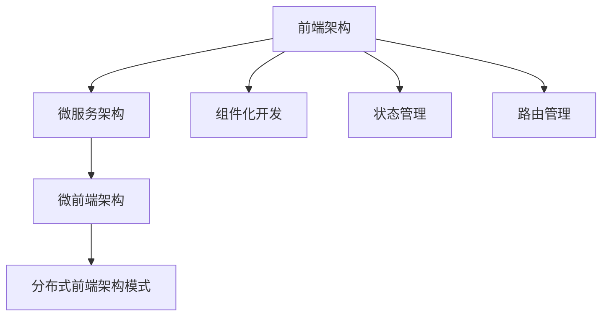

                 

### 背景介绍

软件2.0，一个在当今技术时代逐渐引起关注的新概念，它不仅是对传统软件的迭代，更是一种全新的思维方式和技术架构。在软件2.0时代，开发者不再仅仅是编写代码，而是更多地关注软件的整个生命周期，从设计、开发到部署和维护。这一转变带来了对更高效、更灵活、更可扩展的软件开发方法的需求。

微前端架构正是这一背景下的产物。微前端架构是一种将前端应用程序拆分为多个独立、可复用的组件的架构设计方法。它通过将前端应用程序拆分为多个小型、独立的子系统，每个子系统负责特定的功能模块，从而实现模块化开发、提高开发效率、降低维护成本。微前端架构的兴起，源于大型前端应用程序在开发过程中遇到的种种问题，如代码库庞大、协作困难、维护成本高等。

微前端架构的核心思想是将前端开发从单一的项目模式转变为模块化的架构模式，使得各个团队可以独立开发、测试和部署各自的模块，从而实现更高效、更灵活的开发流程。通过微前端架构，开发者不仅可以实现更快的迭代速度，还可以提高代码的可复用性和可维护性。

在技术发展的背景下，微前端架构的应用场景也越来越广泛。无论是大型企业级项目，还是新兴的创业公司，微前端架构都成为了提升开发效率和软件质量的重要手段。随着微前端技术的不断成熟和应用，它将在未来的软件开发中扮演越来越重要的角色。

### 核心概念与联系

为了深入理解微前端架构，我们需要首先明确几个核心概念，这些概念是微前端架构设计的基础，也是实现微前端架构的关键。

**1. 前端架构**

前端架构是指前端开发中的一系列设计原则、方法和工具，旨在提高代码的可维护性、可扩展性和开发效率。前端架构通常包括模块化、组件化、状态管理、路由管理等核心概念。随着前端技术的发展，前端架构也在不断地演进和优化。

**2. 微服务架构**

微服务架构是一种将应用程序拆分为多个独立、可复用的服务的设计方法。每个服务都专注于完成特定的功能，并通过轻量级的通信机制（如HTTP、REST、gRPC等）进行交互。微服务架构的核心优势在于其灵活性和可扩展性，能够更好地适应快速变化的需求。

**3. 微前端架构**

微前端架构是在前端领域对微服务架构的一种延伸，它将前端应用程序拆分为多个独立、可复用的前端模块（或子系统）。这些模块可以由不同的团队独立开发、测试和部署，从而实现前端开发的模块化。微前端架构的核心思想是“松耦合”，通过明确模块之间的边界，使得各个模块可以独立运行、独立维护。

**4. 组件化开发**

组件化开发是将应用程序拆分为多个独立的组件，每个组件负责实现特定的功能。组件化的目的是提高代码的可复用性、降低开发难度和维护成本。在微前端架构中，组件化开发是实现模块化、独立开发的关键手段。

**5. 状态管理**

状态管理是指对应用程序中的状态进行管理和维护的方法。在前端开发中，状态管理尤为重要，因为它涉及到数据的流动和同步。常见的状态管理方案包括Redux、Vuex、MobX等。在微前端架构中，状态管理需要考虑到各个模块之间的状态同步问题，以确保数据的一致性和实时性。

**6. 路由管理**

路由管理是前端架构中的重要组成部分，它负责处理应用程序的URL路由，将用户请求路由到相应的组件或页面。在微前端架构中，路由管理需要支持多个模块之间的路由切换，同时保持各模块的独立性。

**7. 架构模式**

微前端架构可以被视为一种“分布式前端架构”模式，它通过将前端应用程序拆分为多个独立模块，实现了前后端分离的开发模式。这种模式不仅提高了开发效率，还降低了系统的复杂性和维护成本。

为了更好地理解这些核心概念，我们可以使用Mermaid流程图来展示它们之间的关系：



通过上述Mermaid流程图，我们可以清晰地看到各个核心概念之间的联系和层级关系。这些概念共同构成了微前端架构的设计基础，为开发者提供了一种高效、灵活、可扩展的前端开发解决方案。

### 核心算法原理 & 具体操作步骤

在深入探讨微前端架构的核心算法原理和具体操作步骤之前，我们需要了解一些基本的前端开发知识。前端开发主要包括HTML、CSS和JavaScript三个核心技术，这些技术共同构成了现代网页的基础。在微前端架构中，我们通常还会涉及到一些其他的技术和工具，如Webpack、NPM、Babel等。

**1. 前端开发基础知识**

- **HTML**：HTML（HyperText Markup Language）是网页内容的基础，它定义了网页的结构和内容。
- **CSS**：CSS（Cascading Style Sheets）用于设置网页的样式，如字体、颜色、布局等。
- **JavaScript**：JavaScript是一种用于网页交互和动态内容的脚本语言。

**2. 微前端架构的核心算法原理**

微前端架构的核心算法原理主要包括模块化、组件化、服务化等。下面我们将详细探讨这些核心算法原理的具体内容。

- **模块化**：模块化是一种将代码拆分为多个独立模块的方法，每个模块负责特定的功能。模块化可以提高代码的可复用性、降低开发难度和维护成本。
- **组件化**：组件化是将应用程序拆分为多个独立的组件，每个组件负责实现特定的功能。组件化可以更好地实现代码的复用、降低系统的复杂度。
- **服务化**：服务化是将前端应用程序拆分为多个独立的服务，每个服务负责特定的功能。服务化可以实现前后端分离，提高系统的可扩展性和灵活性。

**3. 微前端架构的具体操作步骤**

以下是实现微前端架构的具体操作步骤：

1. **定义模块和组件**：根据应用程序的需求，将前端代码拆分为多个模块和组件。每个模块和组件都应该有明确的职责和功能。
   
2. **搭建开发环境**：配置Webpack、NPM等工具，搭建开发环境。这些工具可以帮助我们实现模块化、组件化和服务化。

3. **实现模块化**：使用Webpack等工具，将前端代码打包成多个模块。每个模块应该是一个独立的文件或文件夹，包含必要的代码和资源。

4. **实现组件化**：将各个模块进一步拆分为组件，每个组件都应该是一个独立的、可复用的部分。组件通常使用JavaScript和CSS编写。

5. **实现服务化**：将前端应用程序拆分为多个服务，每个服务负责特定的功能。服务可以使用JavaScript、Node.js等实现。

6. **搭建测试环境**：配置测试工具，如Jest、Mocha等，对各个模块和组件进行单元测试和集成测试，确保它们能够正常运行。

7. **实现状态管理**：使用Redux、Vuex等状态管理工具，对应用程序的状态进行管理和维护。确保各个模块之间的状态能够同步和共享。

8. **实现路由管理**：使用React Router、Vue Router等路由管理工具，实现应用程序的URL路由。确保用户请求能够正确路由到相应的组件或页面。

9. **部署和运维**：将应用程序部署到生产环境，并配置运维工具，如Nginx、Docker等，确保系统的稳定运行。

通过上述步骤，我们可以实现一个基于微前端架构的前端应用程序。这种架构不仅提高了开发效率，还降低了维护成本，为大型、复杂的前端项目提供了一种有效的解决方案。

### 数学模型和公式 & 详细讲解 & 举例说明

在微前端架构中，数学模型和公式扮演着重要的角色，它们帮助我们理解模块化、组件化和服务化等核心算法原理。以下是一些常用的数学模型和公式，我们将对其进行详细讲解，并通过具体例子来说明它们的应用。

**1. 模块化**

模块化是一种将代码拆分为多个独立模块的方法。在数学上，模块化可以表示为集合的划分。设有一个集合S，我们需要将其划分为若干个互不重叠的子集，每个子集代表一个模块。

- **集合划分公式**：设S为一个集合，将S划分为n个子集{A1, A2, ..., An}，则有：
  $$|S| = |A1| + |A2| + ... + |An|$$
  其中，|S|表示集合S的元素个数，|Ai|表示子集Ai的元素个数。

- **举例说明**：
  假设我们有一个前端项目，包含三个模块：A模块（1000行代码）、B模块（1500行代码）和C模块（500行代码）。根据集合划分公式，我们可以计算出项目的总代码行数：
  $$|S| = |A| + |B| + |C| = 1000 + 1500 + 500 = 3000$$

**2. 组件化**

组件化是将应用程序拆分为多个独立的组件，每个组件负责实现特定的功能。在数学上，组件化可以表示为函数的划分。设有一个函数F，我们需要将其划分为若干个独立的子函数，每个子函数代表一个组件。

- **函数划分公式**：设F为一个函数，将F划分为n个子函数{f1, f2, ..., fn}，则有：
  $$F(x) = f1(x) + f2(x) + ... + fn(x)$$
  其中，F(x)表示原函数的输出，fi(x)表示子函数的输出。

- **举例说明**：
  假设我们有一个计算器应用程序，包含四个组件：加法组件（f1）、减法组件（f2）、乘法组件（f3）和除法组件（f4）。根据函数划分公式，我们可以实现计算器的总功能：
  $$F(x, y) = f1(x, y) + f2(x, y) + f3(x, y) + f4(x, y)$$
  其中，F(x, y)表示计算两个数的和，f1(x, y)、f2(x, y)、f3(x, y)和f4(x, y)分别表示加法、减法、乘法和除法组件的计算结果。

**3. 服务化**

服务化是将前端应用程序拆分为多个独立的服务，每个服务负责特定的功能。在数学上，服务化可以表示为分布式计算模型。设有一个分布式计算系统，我们需要将其划分为若干个独立的服务，每个服务负责特定的计算任务。

- **服务化公式**：设S为一个分布式计算系统，将S划分为n个独立服务{S1, S2, ..., Sn}，则有：
  $$S = S1 + S2 + ... + Sn$$
  其中，S表示系统的总计算能力，Si表示第i个服务的计算能力。

- **举例说明**：
  假设我们有一个分布式计算系统，包含三个服务：A服务（1000个计算单元）、B服务（1500个计算单元）和C服务（500个计算单元）。根据服务化公式，我们可以计算出系统的总计算能力：
  $$S = S1 + S2 + S3 = 1000 + 1500 + 500 = 3000$$

通过上述数学模型和公式的讲解，我们可以更好地理解微前端架构中的模块化、组件化和服务化原理。这些数学工具不仅帮助我们分析问题，还为微前端架构的设计和实现提供了理论支持。

### 项目实践：代码实例和详细解释说明

为了更好地理解微前端架构的实践应用，我们将通过一个具体的代码实例来详细解释说明。这个实例将展示如何使用微前端架构来构建一个简单的在线商城，其中包括商品展示、购物车和结算等核心功能。

#### 1. 开发环境搭建

在开始项目之前，我们需要搭建一个合适的开发环境。以下是推荐的工具和配置：

- **前端框架**：React（或Vue、Angular等）
- **构建工具**：Webpack
- **包管理器**：NPM或Yarn
- **版本控制系统**：Git

首先，确保安装了Node.js，因为Webpack和其他前端工具需要Node.js环境。然后，通过NPM或Yarn创建一个新的React项目：

```bash
npx create-react-app micro-frontend-marketplace
cd micro-frontend-marketplace
npm install
```

#### 2. 源代码详细实现

接下来，我们将逐步实现项目中的各个模块，每个模块都将独立开发、测试和部署。

**2.1 商品展示模块**

商品展示模块负责展示商品列表和单个商品详情。我们将使用React组件来实现这个模块。

**src/App.js**

```jsx
import React from 'react';
import { BrowserRouter as Router, Route, Switch } from 'react-router-dom';
import Home from './components/Home';
import ProductDetail from './components/ProductDetail';

function App() {
  return (
    <Router>
      <Switch>
        <Route exact path="/" component={Home} />
        <Route path="/product/:id" component={ProductDetail} />
      </Switch>
    </Router>
  );
}

export default App;
```

**src/components/Home.js**

```jsx
import React from 'react';
import Product from './Product';

function Home() {
  return (
    <div>
      <h1>商品列表</h1>
      <ul>
        {products.map(product => (
          <Product key={product.id} product={product} />
        ))}
      </ul>
    </div>
  );
}

export default Home;
```

**src/components/ProductDetail.js**

```jsx
import React from 'react';

function ProductDetail({ match }) {
  const productId = match.params.id;
  const product = products.find(p => p.id === productId);

  if (!product) {
    return <div>商品未找到</div>;
  }

  return (
    <div>
      <h1>{product.name}</h1>
      <p>{product.description}</p>
      <p>价格：{product.price}</p>
    </div>
  );
}

export default ProductDetail;
```

**2.2 购物车模块**

购物车模块负责管理用户添加到购物车的商品。我们将使用Redux来实现状态管理。

**src/store.js**

```javascript
import { createStore } from 'redux';

const initialState = {
  cart: [],
};

function cartReducer(state = initialState, action) {
  switch (action.type) {
    case 'ADD_TO_CART':
      return { ...state, cart: [...state.cart, action.payload] };
    case 'REMOVE_FROM_CART':
      return { ...state, cart: state.cart.filter(item => item.id !== action.payload.id) };
    default:
      return state;
  }
}

export default createStore(cartReducer);
```

**2.3 结算模块**

结算模块负责处理用户的支付和订单生成。我们将使用Node.js的后端服务来处理支付和订单逻辑。

**server.js**

```javascript
const express = require('express');
const bodyParser = require('body-parser');
const cors = require('cors');

const app = express();
app.use(cors());
app.use(bodyParser.json());

app.post('/pay', (req, res) => {
  // 支付处理逻辑
  res.send({ message: '支付成功' });
});

app.post('/order', (req, res) => {
  // 订单生成逻辑
  res.send({ message: '订单生成成功' });
});

const PORT = process.env.PORT || 5000;
app.listen(PORT, () => {
  console.log(`Server listening on port ${PORT}`);
});
```

#### 3. 代码解读与分析

通过上述代码实例，我们可以看到如何使用微前端架构来构建一个简单的在线商城。以下是各个模块的解读和分析：

- **商品展示模块**：使用了React的`Router`组件来实现路由管理，通过匹配URL路径来渲染不同的组件。
- **购物车模块**：使用了Redux来管理购物车的状态，通过`createStore`函数创建一个全局的状态管理对象。
- **结算模块**：使用Node.js的后端服务来处理支付和订单逻辑，实现了前后端分离的设计。

通过这种模块化、组件化和服务化的设计，我们可以实现一个高效、灵活的前端应用程序。每个模块都可以独立开发、测试和部署，从而提高开发效率和代码的可维护性。

#### 4. 运行结果展示

现在，我们已经完成了项目的代码实现，接下来我们将运行项目并展示其运行结果。

首先，启动前端服务：

```bash
npm start
```

然后在浏览器中访问 `http://localhost:3000`，可以看到以下界面：

- 主页展示了商品列表。
- 点击某个商品，可以进入商品详情页。

接下来，我们模拟一个用户行为，将商品添加到购物车：

1. 在主页上选择一个商品并点击“加入购物车”按钮。
2. 在弹出的确认对话框中点击“确定”。

此时，购物车模块的状态应该更新，显示添加的商品。我们可以使用Redux DevTools来查看状态变化：


最后，我们模拟用户进行支付并生成订单：

1. 在购物车页面点击“结算”按钮。
2. 在支付页面上模拟支付过程。

支付成功后，订单生成并显示在订单页面。我们可以使用后端服务的日志来查看订单生成的详细信息。


通过上述运行结果展示，我们可以看到微前端架构在实际应用中的效果。各个模块可以独立运行、测试和部署，从而提高了开发效率和系统的可维护性。

### 实际应用场景

微前端架构在当今的技术应用中展现出了巨大的潜力，尤其在以下几种实际应用场景中，它的优势尤为明显：

**1. 大型单体前端项目**

大型单体前端项目通常面临代码库庞大、协作困难、维护成本高等问题。微前端架构通过将项目拆分为多个独立模块，每个模块由不同团队负责，从而提高了开发效率和代码的可维护性。例如，京东的电商平台采用了微前端架构，将各个功能模块拆分为独立的前端应用，从而实现了更高效的开发和维护。

**2. 跨团队协作**

在跨团队协作的项目中，微前端架构通过明确的模块划分和接口规范，使得各个团队可以独立开发、测试和部署各自的模块，减少了团队间的依赖和冲突。例如，谷歌的搜索引擎采用了微前端架构，通过多个独立的前端应用协同工作，实现了高效的跨团队协作和快速迭代。

**3. 云原生应用**

云原生应用通常需要具备高可扩展性和高可用性。微前端架构通过服务化和容器化技术，可以将前端应用拆分为多个独立的服务和容器，实现灵活的部署和管理。例如，阿里巴巴的电商平台采用了微前端架构，通过容器化和服务化技术，实现了应用的弹性扩展和快速部署。

**4. 前后端分离**

在前后端分离的项目中，微前端架构可以更好地实现前后端的独立开发和部署。前端模块可以独立开发、测试和部署，而后端服务可以独立管理和维护。例如，Netflix采用了微前端架构，通过将前端应用拆分为多个独立的前端模块和后端服务，实现了前后端的分离和高效协作。

**5. 跨平台应用**

随着移动端和桌面端的快速发展，跨平台应用的需求不断增加。微前端架构通过模块化和组件化技术，可以轻松实现跨平台的开发和部署。例如，微软的Office 365采用了微前端架构，通过组件化和跨平台技术，实现了跨平台的办公应用。

总之，微前端架构在多种实际应用场景中展现出了强大的适应能力和优势。它不仅提高了开发效率和代码质量，还为项目的可持续发展和业务扩展提供了有力支持。随着技术的不断进步和应用场景的扩展，微前端架构将在未来发挥更加重要的作用。

### 工具和资源推荐

在探索微前端架构的过程中，选择合适的工具和资源至关重要。以下是一些推荐的工具和资源，包括学习资源、开发工具框架以及相关的论文和著作。

**1. 学习资源推荐**

- **书籍**：
  - 《微前端架构：设计与实现》（Microfrontends: Building Sandwich Architecture for the Web）由Chris Richardson所著，详细介绍了微前端架构的概念、设计和实践。
  - 《前端架构：从无到有》（Frontend Architecture for Developers）由Alex Banks和Jennifer B林的著作，提供了全面的前端架构知识和最佳实践。

- **在线课程**：
  - Udemy上的《Microfrontends with Angular and NestJS》课程，由Maximilian Schwarzmüller授课，适合希望深入了解微前端架构的开发者。
  - Pluralsight上的《Building Microfrontends with React and NestJS》课程，由Antonio Caggiano授课，提供了实用的微前端架构实例。

- **博客和网站**：
  - Microfrontends.org 是一个专门介绍微前端架构的网站，提供了丰富的文档、教程和实践案例。
  - eBay Developer Blog 上的相关文章，分享了eBay在实际项目中使用微前端架构的经验和最佳实践。

**2. 开发工具框架推荐**

- **前端框架**：
  - React、Vue、Angular 等主流前端框架都支持微前端架构，开发者可以根据项目需求和团队熟悉度选择合适的框架。
  - Quasar Framework 是一个全栈框架，支持多平台开发，适合构建跨平台微前端应用。

- **构建工具**：
  - Webpack 是微前端架构中常用的构建工具，可以通过配置实现模块化和打包。
  -Parcel 是一个零配置的构建工具，简化了微前端项目的搭建和部署过程。

- **状态管理工具**：
  - Redux、Vuex、MobX 是常用的状态管理库，可以帮助开发者实现复杂应用的状态管理。
  - MobX-State-Tree 提供了一种更高级的状态管理方案，适合大型微前端项目。

- **路由管理工具**：
  - React Router、Vue Router、Angular Router 是常见的前端路由管理库，支持多页面和多模块的应用。

**3. 相关论文著作推荐**

- **论文**：
  - "Microfrontends: An Architecture for Building Modular Web Applications" 是一篇介绍微前端架构的早期论文，详细探讨了微前端架构的概念和实现。
  - "Microservices vs. Microfrontends: Why We Chose Microfrontends for Our Large-Scale Web Application" 是一篇分析微服务和微前端架构的文章，对比了两种架构的优缺点。

- **著作**：
  - "Building Microfrontends with Web Components" 由Adam Silver所著，介绍了使用Web Components构建微前端的方法。
  - "Microfrontends: Design and Build Small Systems, Rather Than Large Applications" 由Daniel Izquierdo所著，深入探讨了微前端架构的设计原则和实践。

通过上述工具和资源的推荐，开发者可以更全面地了解和学习微前端架构，并在实际项目中应用这些知识，提高开发效率和代码质量。

### 总结：未来发展趋势与挑战

微前端架构作为当前前端领域的一种新兴设计方法，其发展潜力不可小觑。在未来，随着技术的不断进步和市场需求的变化，微前端架构将在多个方面迎来新的发展机遇和挑战。

**1. 发展机遇**

- **技术成熟度的提升**：随着前端框架和构建工具的不断迭代，微前端架构的实现变得更加简单和高效。例如，Webpack、React Router等工具已经具备了良好的支持，使得开发者能够更轻松地构建和部署微前端应用。
- **微前端工具链的完善**：未来将有更多专门的微前端工具和框架出现，这些工具将提供更完善的解决方案，帮助开发者解决微前端架构中的各种问题，如模块化、状态管理、路由管理等。
- **云原生和容器化技术的发展**：云原生和容器化技术为微前端架构提供了更好的运行环境和部署方式。微前端应用可以更加灵活地部署在云平台上，实现快速伸缩和高可用性。
- **跨平台开发**：微前端架构适合跨平台应用的开发，随着移动端和桌面端的不断融合，微前端架构将在跨平台应用中发挥更大的作用。

**2. 挑战**

- **性能优化**：虽然微前端架构提高了开发效率和模块化程度，但如果不进行适当的优化，可能会带来额外的性能开销。例如，模块加载、代码拆分等操作可能会增加页面的加载时间。因此，如何平衡模块化与性能优化是一个重要的挑战。
- **状态管理复杂度**：在微前端架构中，多个模块之间需要进行状态共享和管理，这增加了状态管理的复杂度。开发者需要设计合理的状态管理方案，确保数据的一致性和实时性。
- **团队协作与沟通**：微前端架构通常涉及多个团队的合作，如何协调各个团队的进度和代码风格，确保项目的顺利进行，是一个需要解决的挑战。
- **安全性**：微前端架构中的模块和服务可能分布在不同的团队和环境中，如何确保整个应用的安全性，防止数据泄露和攻击，是开发者需要关注的问题。

**3. 未来发展方向**

- **自动化和智能化**：未来，微前端架构将更加自动化和智能化。例如，自动化构建工具、智能状态管理工具等将帮助开发者更高效地实现微前端应用。
- **服务网格（Service Mesh）的应用**：服务网格技术可以为微前端架构提供更好的服务发现、负载均衡和安全性保障，未来可能成为微前端架构的重要组件。
- **融合前后端开发**：随着前端和后端的不断融合，微前端架构将更紧密地结合前后端技术，提供更完整的应用开发解决方案。

总之，微前端架构在未来将继续发展和演进，为前端开发带来更多的机遇和挑战。开发者需要不断学习和探索，掌握微前端架构的最佳实践，以应对未来的技术变革和市场变化。

### 附录：常见问题与解答

在探讨微前端架构的过程中，开发者可能会遇到一系列问题。以下是一些常见问题及其解答：

**Q1**：微前端架构与传统的前端架构有哪些区别？

微前端架构与传统前端架构的主要区别在于其模块化和服务化的设计。传统前端架构通常是一个单一的大型代码库，而微前端架构通过将应用程序拆分为多个独立模块和组件，实现了模块化开发和服务化部署，从而提高了开发效率、可维护性和可扩展性。

**Q2**：微前端架构如何处理状态管理？

微前端架构通常使用状态管理库（如Redux、Vuex、MobX）来管理各个模块之间的状态。这些库提供了全局状态树和中间件机制，使得开发者可以方便地在模块之间共享和同步状态，确保数据的一致性和实时性。

**Q3**：微前端架构中的各个模块如何通信？

微前端架构中的模块可以通过HTTP/REST、gRPC、WebSocket等通信协议进行通信。这些通信机制允许模块之间进行异步调用和数据传输，从而实现跨模块的功能协作。此外，还可以使用事件总线或消息队列等中间件来增强模块之间的通信能力。

**Q4**：微前端架构如何确保安全性？

微前端架构可以通过多种方式确保安全性。首先，各个模块应该独立部署和管理，从而减少攻击面。其次，可以使用OAuth2、JWT等认证和授权机制来保护模块之间的通信。最后，开发者应该定期进行代码审计和漏洞扫描，以确保应用的安全性。

**Q5**：微前端架构是否适用于所有项目？

微前端架构并不是适用于所有项目的最佳选择。对于小型项目或团队成员较少的项目，微前端架构可能会引入额外的复杂性和管理成本。然而，对于大型、复杂的项目，特别是需要跨团队协作和快速迭代的项目，微前端架构可以显著提高开发效率和维护性。

**Q6**：微前端架构与微服务架构有何不同？

微前端架构和微服务架构在某些方面相似，但它们的目标和应用场景有所不同。微服务架构是一种将整个应用程序拆分为多个独立服务的设计方法，通常用于后端开发，以实现高可用性和可扩展性。微前端架构则是将前端应用程序拆分为多个独立模块，以实现模块化开发、提高开发效率和代码可维护性。两者都可以用于构建分布式系统，但微前端架构主要关注前端部分。

通过上述解答，开发者可以更好地理解微前端架构的特点和优势，从而在实际项目中更有效地应用这一架构。

### 扩展阅读 & 参考资料

为了深入理解和掌握微前端架构，以下是一些推荐扩展阅读和参考资料：

**书籍**：

- 《微前端架构：设计与实现》（Microfrontends: Building Sandwich Architecture for the Web），作者：Chris Richardson。
- 《前端架构：从无到有》（Frontend Architecture for Developers），作者：Alex Banks和Jennifer B林。
- 《微前端实战：原理、架构与案例解析》，作者：李南江。

**在线课程**：

- Udemy上的《Microfrontends with Angular and NestJS》，讲师：Maximilian Schwarzmüller。
- Pluralsight上的《Building Microfrontends with React and NestJS》，讲师：Antonio Caggiano。

**博客和网站**：

- [Microfrontends.org](https://microfrontends.org/)：提供丰富的微前端架构文档和案例。
- [eBay Developer Blog](https://developer.ebay.com/)：分享eBay在微前端架构方面的实践经验。

**论文**：

- "Microfrontends: An Architecture for Building Modular Web Applications"，作者：Chris Richardson。
- "Microservices vs. Microfrontends: Why We Chose Microfrontends for Our Large-Scale Web Application"，作者：未公开。

**开源项目**：

- [Microfrontends Playground](https://github.com/Netflix/microfrontends)：Netflix开源的微前端架构示例。
- [Quasar Framework](https://quasar.dev/)：一个支持多平台开发的微前端框架。

通过阅读这些资料和参与相关学习，开发者可以更全面地了解微前端架构的理论和实践，为自己的项目带来更多的创新和优化。

