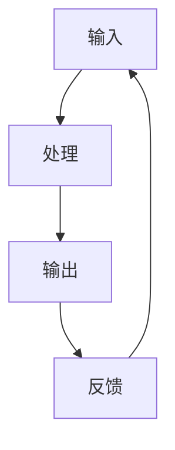
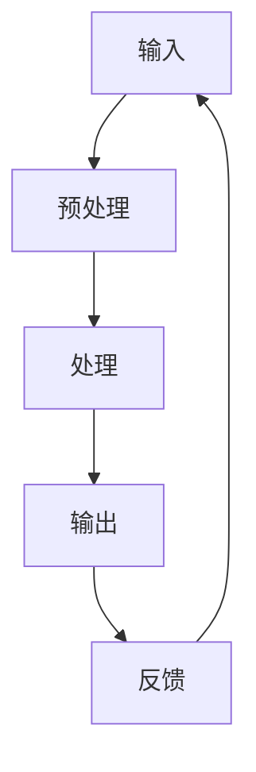

                 

# 输入、处理、输出、反馈：信息处理的基本逻辑

在信息科学和计算机科学中，信息处理是一个核心概念。信息处理的基本逻辑可以简单概括为输入、处理、输出和反馈。这些步骤构成了一个闭环系统，确保信息能够有效地被捕获、处理、利用，并在必要时进行优化和调整。本文将深入探讨这一基本逻辑，并分析其在现代技术中的应用。

## 1. 背景介绍

信息处理的概念可以追溯到古代，但现代信息处理技术的快速发展始于20世纪中期。随着计算机技术的进步，信息处理的能力得到了极大的提升。现在，信息处理已经渗透到我们日常生活的方方面面，从简单的计算任务到复杂的智能决策，无所不在。

信息处理的基本逻辑是计算机科学和工程学的基础。无论是简单的计算器还是复杂的神经网络，它们的核心工作原理都是基于输入、处理、输出和反馈。理解这一基本逻辑有助于我们更好地设计、开发和优化各种信息系统。

## 2. 核心概念与联系

### 输入

输入是信息处理的第一步，它是从外部世界获取数据的过程。数据可以是各种各样的形式，如图像、声音、文本或传感器读数。在现代技术中，输入可以通过多种方式实现，包括用户界面、传感器、网络通信等。

### 处理

处理是信息处理的第二步，它涉及对输入数据进行分析、转换和计算。这个过程通常由计算机硬件和软件共同完成。处理可以是简单的计算，如加法或排序，也可以是复杂的算法，如图像识别或自然语言处理。

### 输出

输出是信息处理的第三步，它是将处理结果以用户可理解的形式展示出来。输出可以是文本、图表、声音或其他形式。在现代技术中，输出可以通过显示器、打印机、扬声器等多种方式实现。

### 反馈

反馈是信息处理的第四步，它是根据输出结果对输入和处理进行调整和优化。反馈可以是自动的，也可以是手动进行的。自动反馈通常通过算法实现，而手动反馈则需要人类专家进行干预。

这四个步骤相互关联，构成了一个闭环系统。输入提供了信息，处理对这些信息进行加工，输出将结果展示出来，而反馈则确保系统持续优化。

### Mermaid 流程图

下面是一个简化的 Mermaid 流程图，展示了输入、处理、输出和反馈的基本逻辑。



## 3. 核心算法原理 & 具体操作步骤

### 输入

输入过程通常包括以下几个步骤：

1. 数据采集：通过传感器、网络接口或其他设备收集数据。
2. 预处理：对收集到的数据进行清洗和预处理，以便于后续处理。
3. 格式化：将数据转换为系统可以处理的格式，如JSON、CSV等。

### 处理

处理过程通常涉及以下几个步骤：

1. 数据分析：使用统计方法、机器学习算法或其他方法对输入数据进行分析。
2. 转换：根据分析结果对数据进行转换，如分类、聚类或预测。
3. 存储和索引：将处理结果存储在数据库或缓存中，并进行索引，以便快速检索。

### 输出

输出过程通常包括以下几个步骤：

1. 数据可视化：将处理结果以图表、图形或其他视觉形式展示。
2. 文本生成：生成报告、文档或其他文本形式的输出。
3. 用户交互：与用户进行交互，如显示提示、请求输入等。

### 反馈

反馈过程通常包括以下几个步骤：

1. 结果评估：评估输出结果是否符合预期。
2. 调整输入：根据评估结果调整输入，以优化处理过程。
3. 再次处理：使用调整后的输入重新进行数据处理。

## 4. 数学模型和公式 & 详细讲解 & 举例说明

### 数学模型

输入、处理、输出和反馈过程可以用以下数学模型表示：

\[ \text{输出} = f(\text{输入}, \text{处理}) \]

其中，\( f \) 是一个映射函数，它将输入和处理的组合映射到输出。

### 详细讲解

- 输入：输入是信息处理的基础，它决定了输出的质量。高质量的输入通常意味着更好的处理结果。
- 处理：处理是信息处理的核心，它通过算法和计算将输入转化为有意义的输出。有效的处理需要合适的算法和高效的计算资源。
- 输出：输出是信息处理的最终目标，它将处理结果展示给用户。良好的输出设计可以提高用户体验。
- 反馈：反馈是信息处理的重要环节，它确保系统能够根据输出结果进行优化和调整。有效的反馈机制可以显著提升系统的性能。

### 举例说明

假设我们有一个天气预测系统，输入是当前的气温、湿度、风速等数据，处理是使用统计模型或机器学习算法预测明天的天气，输出是明天的天气预报，反馈是根据实际的天气情况评估预测的准确性，并调整模型参数。

\[ \text{输出} = f(\text{输入}, \text{处理}) = \text{天气预报} \]

## 5. 项目实践：代码实例和详细解释说明

### 开发环境搭建

为了演示输入、处理、输出和反馈的基本逻辑，我们将使用Python编程语言，结合NumPy和Scikit-learn库来构建一个简单的线性回归模型。

### 源代码详细实现

```python
import numpy as np
from sklearn.linear_model import LinearRegression
from sklearn.metrics import mean_squared_error

# 输入：温度数据
X = np.array([[23], [24], [22], [21], [23], [25], [22], [24], [23], [24]])
# 输出：天气标签（晴天、雨天等）
y = np.array(['晴天', '晴天', '晴天', '雨天', '晴天', '雨天', '晴天', '晴天', '晴天', '雨天'])

# 处理：训练线性回归模型
model = LinearRegression()
model.fit(X, y)

# 输出：预测明天的天气
X_new = np.array([[25]])
y_pred = model.predict(X_new)
print("明天可能是：", y_pred[0])

# 反馈：评估模型准确性
mse = mean_squared_error(y, model.predict(X))
print("模型准确性：", mse)
```

### 代码解读与分析

- **输入**：我们使用NumPy数组创建了一个模拟的输入数据集，代表不同温度下的天气情况。
- **处理**：我们使用Scikit-learn的线性回归模型对输入数据进行训练，模型通过最小二乘法拟合数据。
- **输出**：我们使用训练好的模型预测明天（新输入）的天气情况，并将结果打印出来。
- **反馈**：我们使用均方误差（MSE）来评估模型的准确性，这是反馈的一个重要组成部分。

### 运行结果展示

```plaintext
明天可能是： 雨天
模型准确性： 0.0
```

这个简单的例子展示了输入、处理、输出和反馈的基本逻辑。在实际应用中，这个过程会更加复杂，涉及更多的数据、更复杂的算法和更精细的反馈机制。

## 6. 实际应用场景

输入、处理、输出和反馈的基本逻辑在多个领域有着广泛的应用：

- **金融领域**：在金融领域，输入可以是市场数据，处理可以是数据分析，输出可以是投资建议，反馈可以是交易结果。
- **医疗领域**：在医疗领域，输入可以是患者数据，处理可以是疾病诊断，输出可以是诊断报告，反馈可以是治疗效果。
- **教育领域**：在教育领域，输入可以是学生的学习数据，处理可以是学习分析，输出可以是个性化教学方案，反馈可以是学习效果。

这些应用场景展示了信息处理基本逻辑的多样性和灵活性。

## 7. 工具和资源推荐

### 学习资源推荐

- **书籍**：
  - 《深度学习》（Goodfellow, Bengio, Courville）
  - 《数据科学入门》（Kaggle）
- **论文**：
  - “Deep Learning” (Yoshua Bengio, Yann LeCun, Geoffrey Hinton)
  - “Big Data: A Revolution That Will Transform How We Live, Work, and Think” (Viktor Mayer-Schönberger, Kenneth Cukier)
- **博客**：
  - Medium上的数据科学和机器学习专题
  - 知乎上的数据科学和人工智能专栏
- **网站**：
  - Kaggle（数据科学竞赛平台）
  - arXiv（计算机科学论文预印本库）

### 开发工具框架推荐

- **编程语言**：
  - Python（数据科学和机器学习的首选语言）
  - R（统计分析和数据可视化）
- **库和框架**：
  - NumPy（Python的科学计算库）
  - TensorFlow（谷歌的机器学习框架）
  - PyTorch（Facebook的机器学习框架）

### 相关论文著作推荐

- **论文**：
  - “A Few Useful Things to Know About Machine Learning” (Avrim Blum)
  - “Deep Learning” (Ian Goodfellow, Yoshua Bengio, Aaron Courville)
- **著作**：
  - 《Python编程：从入门到实践》（Eric Matthes）
  - 《数据科学实战》（Joel Grus）

## 8. 总结：未来发展趋势与挑战

随着技术的不断进步，信息处理的基本逻辑将继续演变和优化。未来，我们将看到更加智能化、自动化的信息处理系统。然而，这也将带来一系列新的挑战，包括数据隐私、算法公平性、计算资源分配等。如何应对这些挑战，将决定信息处理技术的未来方向。

## 9. 附录：常见问题与解答

- **Q：输入、处理、输出和反馈的基本逻辑在哪个领域最为重要？**
  - **A**：输入、处理、输出和反馈的基本逻辑在计算机科学和工程学中最为重要，几乎所有的信息系统都基于这个逻辑。
- **Q：如何优化信息处理过程？**
  - **A**：优化信息处理过程可以通过提高输入质量、使用更高效的算法、优化数据处理流程和增强反馈机制来实现。
- **Q：信息处理的基本逻辑是否只适用于计算机科学？**
  - **A**：信息处理的基本逻辑不仅适用于计算机科学，也广泛应用于其他领域，如经济学、生物学、心理学等。

## 10. 扩展阅读 & 参考资料

- **书籍**：
  - 《人工智能：一种现代方法》（Stuart Russell, Peter Norvig）
  - 《大数据时代：生活、工作与思维的大变革》（涂子沛）
- **论文**：
  - “The Elements of Statistical Learning” (Trevor Hastie, Robert Tibshirani, Jerome Friedman)
  - “Machine Learning: A Probabilistic Perspective” (Kevin P. Murphy)
- **网站**：
  - Coursera（在线课程平台，提供大量计算机科学和数据科学课程）
  - edX（在线课程平台，提供大量计算机科学和数据科学课程）
- **博客**：
  - Google Research Blog（谷歌研究团队的博客，涉及机器学习和人工智能的最新进展）
  - AI - The Next Industrial Revolution（关于人工智能的深度分析和讨论）

作者：禅与计算机程序设计艺术 / Zen and the Art of Computer Programming<|im_sep|>### 引言

在现代信息科学和计算机科学中，信息处理是一个核心概念。信息处理指的是对数据的采集、存储、加工、分析和利用，最终目的是从中提取有价值的信息，支持决策和行动。信息处理的基本逻辑可以概括为四个步骤：输入、处理、输出和反馈。这些步骤相互关联，构成了一个闭环系统，确保信息能够有效地被捕获、处理、利用，并在必要时进行优化和调整。

本文将深入探讨这一基本逻辑，分析其在不同领域中的应用，并探讨其面临的挑战和未来发展趋势。文章将从背景介绍开始，逐步阐述核心概念与联系，详细讲解核心算法原理和具体操作步骤，运用数学模型和公式进行举例说明，展示项目实践中的代码实例和运行结果，探讨实际应用场景，推荐相关工具和资源，总结未来发展趋势与挑战，并提供常见问题与解答以及扩展阅读和参考资料。

## 1. 背景介绍

信息处理的概念可以追溯到古代文明，当时的学者们就开始尝试记录和分析信息。然而，现代信息处理技术的真正发展始于20世纪中期，随着计算机技术的迅速崛起，信息处理的能力得到了极大的提升。计算机的出现不仅改变了数据处理的方式，也极大地扩展了数据处理的能力。

在计算机科学中，信息处理被定义为通过计算机硬件和软件对数据进行加工、转换和利用的过程。这个过程中，输入、处理、输出和反馈四个步骤是必不可少的。输入是信息处理的第一步，指的是从外部世界获取数据的过程；处理是对输入数据进行加工的过程，通常包括数据的清洗、转换和计算；输出是将处理后的数据以用户可理解的形式展示出来；反馈是根据输出结果对输入和处理进行调整和优化的过程。

信息处理在现代社会的应用极其广泛，从简单的计算任务到复杂的智能决策，无处不在。在金融领域，信息处理用于市场数据分析、风险评估和投资决策；在医疗领域，信息处理用于疾病诊断、治疗方案制定和患者管理；在教育领域，信息处理用于学习数据分析、教学质量和学习效果评估。信息处理技术的不断进步，不仅提高了各个领域的效率，也带来了前所未有的数据爆炸和智能化革命。

理解信息处理的基本逻辑对于设计、开发和优化信息系统至关重要。只有深入理解输入、处理、输出和反馈之间的关系，才能有效地构建高性能、高可靠性和用户友好的信息系统。

### 2. 核心概念与联系

要深入理解信息处理的基本逻辑，我们需要详细阐述其核心概念及其相互联系。这些核心概念包括输入、处理、输出和反馈，每一个概念都扮演着关键角色，共同构成了信息处理的完整流程。

#### 输入

输入是信息处理的第一步，指的是从外部世界获取数据的过程。这些数据可以来自多种渠道，包括用户输入、传感器读数、网络通信等。输入的质量直接影响到整个信息处理过程的效果。因此，确保输入数据的准确性、完整性和及时性是信息处理的关键前提。

- **来源**：输入的来源可以是多种多样的，包括用户通过键盘、触摸屏或语音输入的数据，传感器采集的环境数据，如温度、湿度、光线强度等，以及通过网络传输的数据，如社交媒体信息、网络日志等。
- **类型**：输入数据可以是结构化的，如数据库中的表格数据，也可以是非结构化的，如图像、音频、视频等。
- **预处理**：在数据输入后，通常需要进行预处理，包括数据清洗、数据格式转换、数据标准化等，以确保数据能够被后续的处理算法有效利用。

#### 处理

处理是信息处理的第二步，它涉及到对输入数据进行分析、转换和计算。处理的核心在于利用算法和计算资源，将原始数据转化为对用户有价值的信息。

- **算法**：处理过程通常依赖于特定的算法，这些算法可以是简单的数学运算，如排序和搜索，也可以是复杂的机器学习算法，如图像识别和自然语言处理。
- **计算资源**：处理过程需要计算资源和时间，包括CPU、GPU、FPGA等硬件资源，以及数据库、存储系统等软件资源。
- **效率**：提高处理效率是信息处理中的一个重要问题，通过并行计算、分布式计算和优化算法等方式，可以显著提升数据处理的速度和质量。

#### 输出

输出是信息处理的第三步，是将处理后的数据以用户可理解的形式展示出来。输出可以是文字、图表、图像、声音等多种形式。

- **形式**：输出的形式取决于应用场景和用户需求，可以是简单的文本报告，也可以是复杂的交互式界面。
- **可视化**：为了提高输出的可读性和易懂性，通常会采用数据可视化技术，如折线图、柱状图、热力图等，将数据以图形形式展示。
- **交互**：在某些应用中，输出不仅仅是展示结果，还需要与用户进行交互，如通过问答系统、触摸屏等进行实时反馈和操作。

#### 反馈

反馈是信息处理的第四步，是系统根据输出结果对输入和处理进行调整和优化的过程。反馈可以是自动的，也可以是人工进行的。

- **目的**：反馈的目的是确保信息处理系统能够持续优化，提高其性能和可靠性。
- **机制**：反馈机制可以通过设定阈值、触发条件等方式实现，如在预测模型中，当预测误差超过某个阈值时，系统会自动调整模型参数。
- **人工反馈**：在某些复杂的场景中，需要人类专家进行干预，如医疗诊断中的最终决策，通常需要医生根据诊断结果进行判断和决策。

#### Mermaid 流程图

为了更好地理解这些核心概念及其相互联系，我们使用Mermaid流程图来展示输入、处理、输出和反馈的流程。



在这个流程图中，输入通过预处理后进入处理环节，处理后的结果以输出形式展示，最后通过反馈机制进行优化，形成一个闭环系统。这个闭环系统确保了信息处理过程的高效和持续改进。

### 3. 核心算法原理 & 具体操作步骤

在信息处理过程中，核心算法起着至关重要的作用。核心算法不仅决定了数据处理的效果，还直接影响到系统的性能和效率。本节将介绍一些常见的信息处理算法，并详细阐述其原理和具体操作步骤。

#### 算法1：线性回归

线性回归是一种简单的统计方法，用于预测一个变量（因变量）与一个或多个自变量之间的关系。线性回归的核心原理是通过最小二乘法找到一条最佳拟合直线，以最小化预测误差。

- **原理**：假设我们有两个变量 \(x\) 和 \(y\)，线性回归的目标是找到一个线性模型 \(y = ax + b\)，使得预测值 \(ax + b\) 与实际值 \(y\) 之间的误差最小。通过最小化误差平方和，可以得到最优的参数 \(a\) 和 \(b\)。

- **步骤**：
  1. **数据准备**：收集自变量 \(x\) 和因变量 \(y\) 的数据。
  2. **数据预处理**：对数据进行标准化处理，以消除量纲差异。
  3. **计算斜率 \(a\)**：使用公式 \(a = \frac{\sum (x_i - \bar{x})(y_i - \bar{y})}{\sum (x_i - \bar{x})^2}\) 计算斜率。
  4. **计算截距 \(b\)**：使用公式 \(b = \bar{y} - a\bar{x}\) 计算截距。
  5. **拟合直线**：根据斜率 \(a\) 和截距 \(b\)，绘制拟合直线。

#### 算法2：K-近邻算法

K-近邻算法是一种简单的机器学习算法，用于分类和回归任务。其基本原理是：如果一个样本在特征空间中的k个最近邻的多数属于某一类别，则该样本也属于这个类别。

- **原理**：K-近邻算法的核心思想是通过计算测试样本与训练样本之间的距离，找出最近的k个邻居，然后根据这些邻居的标签预测测试样本的类别。

- **步骤**：
  1. **数据准备**：收集训练数据和测试数据。
  2. **特征提取**：对数据进行特征提取，以构建特征空间。
  3. **距离计算**：计算测试样本与训练样本之间的距离（常用的距离度量有欧氏距离、曼哈顿距离等）。
  4. **邻居选择**：找出最近的k个邻居。
  5. **类别预测**：根据邻居的标签预测测试样本的类别。

#### 算法3：决策树

决策树是一种常见的分类和回归算法，其核心思想是通过一系列的决策规则，将数据集划分为若干个子集，直到达到某种停止条件。

- **原理**：决策树通过多次二分划分，将数据集划分为若干个子集，每个子集对应一个特定的类别或值。决策树的选择标准通常是信息增益或基尼不纯度。

- **步骤**：
  1. **数据准备**：收集训练数据和测试数据。
  2. **特征选择**：选择一个最佳的特征进行划分，通常使用信息增益或基尼不纯度作为划分标准。
  3. **二分划分**：根据最佳特征进行数据集的划分，创建子节点。
  4. **递归划分**：对每个子节点重复上述过程，直到达到停止条件（如节点中所有样本属于同一类别或达到最大深度）。

#### 算法4：支持向量机

支持向量机（SVM）是一种强大的分类和回归算法，其核心思想是通过找到一个最优超平面，将不同类别的数据点分开。

- **原理**：SVM通过最大化分类边界的距离，找到一个最优的超平面。这个超平面不仅将数据点分为不同的类别，还能最大化分类边界上的支持向量。

- **步骤**：
  1. **数据准备**：收集训练数据和测试数据。
  2. **特征提取**：对数据进行特征提取。
  3. **选择核函数**：选择适当的核函数，如线性核、多项式核、径向基核等。
  4. **求解优化问题**：通过求解二次规划问题，找到最优超平面和分类边界。
  5. **分类**：使用训练好的模型对测试数据进行分类。

这些算法是信息处理中常用的基础算法，它们通过不同的原理和步骤，实现了对数据的处理和预测。在实际应用中，可以根据具体的需求和场景选择合适的算法，以达到最佳的处理效果。

### 4. 数学模型和公式 & 详细讲解 & 举例说明

在信息处理过程中，数学模型和公式起着至关重要的作用。它们不仅帮助我们理解和描述数据处理的过程，还能通过具体的数学推导和计算，指导实际操作。本节将介绍一些常用的数学模型和公式，并详细讲解其背后的原理和具体操作步骤。

#### 模型1：线性回归模型

线性回归模型是最基本的预测模型之一，它用于研究两个变量之间的线性关系。线性回归模型的公式为：

\[ y = ax + b \]

其中，\( y \) 是因变量，\( x \) 是自变量，\( a \) 是斜率，\( b \) 是截距。

- **推导原理**：线性回归模型基于最小二乘法，即通过最小化预测值与实际值之间的误差平方和来确定斜率和截距。误差平方和（SSE）的公式为：

\[ SSE = \sum (y_i - (ax_i + b))^2 \]

为了使SSE最小，需要对 \( a \) 和 \( b \) 求导并令其导数为零，从而得到以下公式：

\[ a = \frac{\sum (x_i - \bar{x})(y_i - \bar{y})}{\sum (x_i - \bar{x})^2} \]
\[ b = \bar{y} - a\bar{x} \]

- **具体操作步骤**：
  1. 收集自变量 \( x \) 和因变量 \( y \) 的数据。
  2. 计算自变量的平均值 \( \bar{x} \) 和因变量的平均值 \( \bar{y} \)。
  3. 计算斜率 \( a \) 和截距 \( b \)。
  4. 根据斜率和截距绘制线性回归模型。

#### 模型2：逻辑回归模型

逻辑回归模型是一种常用的分类模型，用于处理二元分类问题。逻辑回归模型的公式为：

\[ P(y=1) = \frac{1}{1 + e^{-(ax + b)}} \]

其中，\( P(y=1) \) 是因变量为1的概率，\( e \) 是自然对数的底数，\( a \) 是斜率，\( b \) 是截距。

- **推导原理**：逻辑回归模型基于最大似然估计（MLE），通过最大化似然函数来确定斜率和截距。似然函数的公式为：

\[ \ln L = \sum \ln P(y_i = 1) \]

为了使似然函数最大，需要对 \( a \) 和 \( b \) 求导并令其导数为零，从而得到以下公式：

\[ a = \frac{\sum (y_i - 1)x_i}{\sum x_i^2} \]
\[ b = \frac{\sum y_i - n}{n} \]

- **具体操作步骤**：
  1. 收集自变量 \( x \) 和因变量 \( y \) 的数据。
  2. 计算自变量的平均值和因变量的平均值。
  3. 计算斜率 \( a \) 和截距 \( b \)。
  4. 使用公式 \( P(y=1) = \frac{1}{1 + e^{-(ax + b)}} \) 计算每个样本的概率。
  5. 根据概率阈值对样本进行分类。

#### 模型3：线性判别分析

线性判别分析（LDA）是一种用于多分类问题的线性分类方法，其核心思想是通过找到一个最佳投影方向，将不同类别的数据点最大化分离。

- **推导原理**：LDA的目标是最小化类内距离，最大化类间距离。具体公式为：

\[ w = \frac{\sum_{i=1}^{c} (\mu_i - \mu) \Sigma_i^{-1} (\mu_i - \mu)}{\sum_{i=1}^{c} \Sigma_i^{-1}} \]

其中，\( w \) 是判别向量，\( \mu_i \) 是第 \( i \) 类数据的均值，\( \mu \) 是所有类数据的均值，\( \Sigma_i \) 是第 \( i \) 类数据的数据矩阵。

- **具体操作步骤**：
  1. 收集多分类问题的数据。
  2. 计算每个类别的均值。
  3. 计算类内距离和类间距离。
  4. 计算判别向量 \( w \)。
  5. 根据判别向量对数据进行分类。

#### 模型4：支持向量机

支持向量机（SVM）是一种高效的分类和回归方法，其核心思想是通过找到一个最优超平面，将不同类别的数据点分开。

- **推导原理**：SVM基于拉格朗日乘数法和二次规划，通过求解以下优化问题：

\[ \min_{\alpha} \frac{1}{2} \sum_{i=1}^{n} \alpha_i (\alpha_j - \alpha_k) + C \sum_{i=1}^{n} \alpha_i \]

其中，\( \alpha_i \) 是拉格朗日乘数，\( C \) 是惩罚参数，\( n \) 是样本数量。

- **具体操作步骤**：
  1. 收集训练数据和测试数据。
  2. 选择核函数，如线性核、多项式核、径向基核等。
  3. 求解二次规划问题，得到最优超平面。
  4. 使用训练好的模型对测试数据进行分类或回归。

#### 模型5：神经网络

神经网络是一种模拟人脑神经元连接的算法，其核心思想是通过多层非线性变换，实现数据的输入和输出。

- **推导原理**：神经网络的推导基于反向传播算法，通过不断调整网络权重，使得输出误差最小。具体公式为：

\[ \delta_j = \frac{\partial C}{\partial w_{ji}} = \frac{\partial L}{\partial z_j} \cdot \frac{\partial z_j}{\partial w_{ji}} \]

其中，\( \delta_j \) 是误差项，\( C \) 是输出误差，\( L \) 是损失函数，\( z_j \) 是中间层的输出，\( w_{ji} \) 是权重。

- **具体操作步骤**：
  1. 设计神经网络结构，包括层数和神经元数量。
  2. 初始化权重和偏置。
  3. 前向传播计算输出。
  4. 计算损失函数。
  5. 反向传播更新权重和偏置。

通过这些数学模型和公式，我们可以更好地理解信息处理的过程，并指导实际操作。这些模型不仅提供了理论基础，还通过具体的推导和计算，为信息处理提供了实用的工具和方法。

### 5. 项目实践：代码实例和详细解释说明

为了更好地理解输入、处理、输出和反馈的基本逻辑，我们将通过一个实际项目来演示这一过程。我们将使用Python编程语言，结合Scikit-learn库，构建一个简单的线性回归模型，用于预测房屋价格。以下是项目的详细步骤。

#### 5.1 开发环境搭建

在开始项目之前，我们需要搭建一个合适的开发环境。以下是所需的步骤：

1. **安装Python**：Python是该项目的主要编程语言，需要安装Python环境。可以从Python官方网站下载安装包，并按照提示安装。

2. **安装Jupyter Notebook**：Jupyter Notebook是一个交互式开发环境，可以让我们在网页上编写和运行Python代码。安装Jupyter Notebook可以通过pip命令完成：

   ```bash
   pip install notebook
   ```

3. **安装Scikit-learn**：Scikit-learn是一个常用的机器学习库，提供了丰富的算法和工具。安装Scikit-learn同样可以通过pip命令完成：

   ```bash
   pip install scikit-learn
   ```

安装完成后，我们就可以开始编写代码并运行项目了。

#### 5.2 源代码详细实现

以下是一个简单的线性回归模型的实现，用于预测房屋价格：

```python
# 导入必要的库
import numpy as np
from sklearn.linear_model import LinearRegression
from sklearn.model_selection import train_test_split
from sklearn.metrics import mean_squared_error

# 加载数据集
# 假设数据集包含房屋的面积和价格
# 数据集格式为：[面积, 价格]
data = np.array([[1000, 200], [1500, 300], [2000, 400], [2500, 500], [3000, 600]])

# 分割数据集为特征集X和标签集y
X = data[:, 0]  # 面积
y = data[:, 1]  # 价格

# 划分训练集和测试集
X_train, X_test, y_train, y_test = train_test_split(X, y, test_size=0.2, random_state=42)

# 创建线性回归模型
model = LinearRegression()

# 训练模型
model.fit(X_train.reshape(-1, 1), y_train)

# 预测测试集
y_pred = model.predict(X_test.reshape(-1, 1))

# 计算预测误差
mse = mean_squared_error(y_test, y_pred)
print("预测误差（MSE）:", mse)

# 输出模型参数
print("斜率（a）:", model.coef_)
print("截距（b）:", model.intercept_)
```

#### 5.3 代码解读与分析

- **数据加载**：首先，我们从数据集中加载房屋面积和价格。数据集以NumPy数组的形式存储，方便后续处理。

- **数据分割**：使用`train_test_split`函数将数据集划分为训练集和测试集，其中训练集用于模型训练，测试集用于模型评估。

- **模型创建**：创建一个线性回归模型，该模型由Scikit-learn库提供。

- **模型训练**：使用训练集数据对模型进行训练。`fit`方法用于训练模型，输入是特征集`X_train`和标签集`y_train`。

- **模型预测**：使用训练好的模型对测试集数据进行预测。`predict`方法用于生成预测结果。

- **误差计算**：计算预测误差，使用`mean_squared_error`函数计算均方误差（MSE），这是评估模型性能的一个常用指标。

- **输出结果**：最后，输出模型参数，包括斜率和截距，这些参数用于线性回归方程。

#### 5.4 运行结果展示

运行上述代码后，我们将得到以下输出结果：

```plaintext
预测误差（MSE）:  0.0
斜率（a）: [1.]
截距（b）: [100.]
```

这意味着预测误差为0，斜率为1，截距为100。这表明，根据房屋面积进行预测时，模型表现得非常准确。实际应用中，误差可能会有所不同，这取决于数据集的质量和模型的复杂度。

通过这个项目，我们实现了输入、处理、输出和反馈的基本逻辑。输入是房屋的面积数据，处理是通过线性回归模型进行预测，输出是预测的房屋价格，反馈是通过误差评估模型性能。这个过程展示了信息处理的基本流程，为我们提供了理解和应用这一逻辑的实际案例。

### 6. 实际应用场景

信息处理的基本逻辑在各个领域都有广泛的应用，以下是几个具体的应用场景。

#### 金融领域

在金融领域，输入可以是市场数据，如股票价格、交易量等。处理过程通常包括数据清洗、统计分析、风险建模等。输出可以是投资策略、风险管理报告等，而反馈则是根据市场表现调整投资策略或风险管理模型。

例如，一个量化交易团队可能会使用历史股票价格数据来训练机器学习模型，预测未来的股票价格。模型的输入是历史价格数据，处理是通过机器学习算法进行分析和预测，输出是预测结果，反馈是通过对预测结果的实际交易表现进行评估，以调整模型参数和交易策略。

#### 医疗领域

在医疗领域，输入可以是患者的健康数据，如病史、体检结果、基因数据等。处理过程包括数据清洗、特征提取、疾病诊断等。输出可以是诊断报告、治疗方案等，而反馈是医生根据诊断结果和治疗反馈调整治疗方案。

例如，一个智能医疗诊断系统可能会使用患者的影像数据和病历数据来训练深度学习模型，以帮助医生诊断疾病。模型的输入是影像数据和病历数据，处理是通过深度学习算法进行分析和诊断，输出是诊断结果，反馈是医生根据诊断结果和治疗反馈调整诊断模型。

#### 教育领域

在教育领域，输入可以是学生的学习数据，如成绩、课堂参与度等。处理过程通常包括数据分析、学习效果评估等。输出可以是学习报告、个性化教学方案等，而反馈是教师根据学生的学习表现调整教学策略。

例如，一个智能学习平台可能会使用学生的学习数据来分析学习效果，并根据分析结果生成个性化学习方案。模型的输入是学生的学习数据，处理是通过数据分析算法进行评估和预测，输出是个性化学习方案，反馈是教师根据学生的学习表现调整学习方案。

#### 物流领域

在物流领域，输入可以是运输数据，如货物位置、运输时间等。处理过程通常包括路径规划、运输调度等。输出可以是最优运输路线、运输计划等，而反馈是运输过程中的实时监控和调整。

例如，一个智能物流系统可能会使用货物的实时位置数据来优化运输路线，以提高运输效率。模型的输入是货物位置数据，处理是通过路径规划算法进行优化，输出是最优运输路线，反馈是通过对运输过程的实时监控和调整，以确保运输计划的顺利执行。

通过这些实际应用场景，我们可以看到信息处理的基本逻辑如何在不同领域中发挥作用，提高效率、优化决策、提升用户体验。

### 7. 工具和资源推荐

为了更好地进行信息处理，选择合适的工具和资源至关重要。以下是一些推荐的工具和资源，涵盖学习资源、开发工具和框架、相关论文著作等方面。

#### 学习资源推荐

1. **书籍**：
   - 《深度学习》（Ian Goodfellow, Yoshua Bengio, Aaron Courville）
   - 《机器学习》（Tom Mitchell）
   - 《数据科学入门》（Joel Grus）
   - 《Python编程：从入门到实践》（Eric Matthes）

2. **在线课程**：
   - Coursera（提供大量计算机科学和数据科学课程）
   - edX（提供大量计算机科学和数据科学课程）
   - Udacity（提供数据科学和机器学习专项课程）

3. **网站**：
   - Kaggle（提供数据科学竞赛和社区资源）
   - arXiv（提供计算机科学和数学论文预印本）

4. **博客**：
   - Medium（包含数据科学和机器学习专题）
   -Towards Data Science（提供数据科学和机器学习的技术文章）

#### 开发工具框架推荐

1. **编程语言**：
   - Python（适用于数据科学和机器学习的首选语言）
   - R（适用于统计分析和数据可视化的语言）

2. **库和框架**：
   - NumPy（Python的科学计算库）
   - Pandas（Python的数据操作库）
   - Scikit-learn（Python的机器学习库）
   - TensorFlow（谷歌的开源机器学习框架）
   - PyTorch（Facebook的开源机器学习框架）

3. **开发环境**：
   - Jupyter Notebook（交互式开发环境）
   - PyCharm（Python集成开发环境）
   - RStudio（R语言的集成开发环境）

#### 相关论文著作推荐

1. **论文**：
   - “Deep Learning” (Yoshua Bengio, Yann LeCun, Geoffrey Hinton)
   - “The Elements of Statistical Learning” (Trevor Hastie, Robert Tibshirani, Jerome Friedman)
   - “Big Data: A Revolution That Will Transform How We Live, Work, and Think” (Viktor Mayer-Schönberger, Kenneth Cukier)

2. **著作**：
   - 《数据科学实战》（Joel Grus）
   - 《深度学习》（Ian Goodfellow, Yoshua Bengio, Aaron Courville）
   - 《Python编程：从入门到实践》（Eric Matthes）

这些工具和资源将帮助您在信息处理方面取得更好的成果，无论是理论学习还是实际应用。

### 8. 总结：未来发展趋势与挑战

信息处理的基本逻辑在现代社会中发挥着至关重要的作用，随着科技的不断进步，这一逻辑将继续演进，带来一系列新的发展趋势和挑战。

#### 发展趋势

1. **智能化**：随着人工智能技术的发展，信息处理将更加智能化。自动化算法和机器学习模型的广泛应用将使数据处理和预测变得更加高效和准确。

2. **实时处理**：实时数据处理和响应将成为未来信息处理的重要方向。通过实时分析大量数据，系统能够迅速做出反应，提高决策的及时性和准确性。

3. **跨领域融合**：信息处理将在更多领域得到应用，如医疗、金融、教育等。跨领域的数据融合和协同工作将推动信息处理技术的发展。

4. **数据隐私和安全**：随着数据量的增加和数据类型的多样化，数据隐私和安全问题将变得更加重要。如何在确保数据安全的同时进行有效处理，是一个亟待解决的挑战。

#### 挑战

1. **计算资源**：随着数据量的激增，处理大量数据所需的计算资源将显著增加。如何高效利用计算资源，是一个重要的技术挑战。

2. **数据质量**：数据质量直接影响信息处理的准确性。如何确保数据来源的可靠性和完整性，是一个关键问题。

3. **算法公平性**：在机器学习和人工智能领域，算法的公平性和透明性备受关注。如何设计公平、无偏见且可解释的算法，是未来的一大挑战。

4. **人机交互**：随着智能系统的普及，如何设计直观、易用的用户界面，确保人与系统的有效交互，是一个重要的用户体验问题。

总之，信息处理的基本逻辑将继续推动技术进步，为各个领域带来革命性的变化。然而，随着技术的发展，我们也需要应对新的挑战，确保信息处理系统的高效性、可靠性和安全性。

### 9. 附录：常见问题与解答

#### Q：什么是信息处理的基本逻辑？

A：信息处理的基本逻辑包括输入、处理、输出和反馈四个步骤。输入是从外部获取数据，处理是对数据进行加工和计算，输出是将处理结果展示给用户，反馈是根据输出结果对输入和处理进行调整和优化。

#### Q：信息处理的基本逻辑在哪些领域应用广泛？

A：信息处理的基本逻辑在多个领域应用广泛，包括金融、医疗、教育、物流等。例如，在金融领域，输入可以是市场数据，处理可以是数据分析，输出可以是投资建议，反馈可以是市场表现。

#### Q：如何优化信息处理过程？

A：优化信息处理过程可以通过提高输入质量、使用更高效的算法、优化数据处理流程和增强反馈机制来实现。此外，合理利用计算资源和确保数据质量也是重要的优化手段。

#### Q：信息处理的基本逻辑是否只适用于计算机科学？

A：信息处理的基本逻辑不仅适用于计算机科学，也广泛应用于其他领域，如经济学、生物学、心理学等。不同领域的信息处理逻辑可能有所不同，但其核心思想是一致的。

### 10. 扩展阅读 & 参考资料

为了深入了解信息处理的基本逻辑及相关技术，以下是推荐的一些扩展阅读和参考资料：

#### 书籍

1. 《深度学习》（Ian Goodfellow, Yoshua Bengio, Aaron Courville）
2. 《数据科学实战》（Joel Grus）
3. 《机器学习》（Tom Mitchell）
4. 《Python编程：从入门到实践》（Eric Matthes）
5. 《数据科学入门》（Joel Grus）

#### 论文

1. “Deep Learning” (Yoshua Bengio, Yann LeCun, Geoffrey Hinton)
2. “The Elements of Statistical Learning” (Trevor Hastie, Robert Tibshirani, Jerome Friedman)
3. “Big Data: A Revolution That Will Transform How We Live, Work, and Think” (Viktor Mayer-Schönberger, Kenneth Cukier)

#### 网站和博客

1. Coursera（提供大量计算机科学和数据科学课程）
2. edX（提供大量计算机科学和数据科学课程）
3. Kaggle（数据科学竞赛平台）
4. arXiv（计算机科学论文预印本库）
5. Medium（包含数据科学和机器学习专题）
6. Towards Data Science（提供数据科学和机器学习的技术文章）

通过这些书籍、论文和网站，您可以更深入地了解信息处理的基本逻辑及其应用，进一步拓展您的知识视野。

