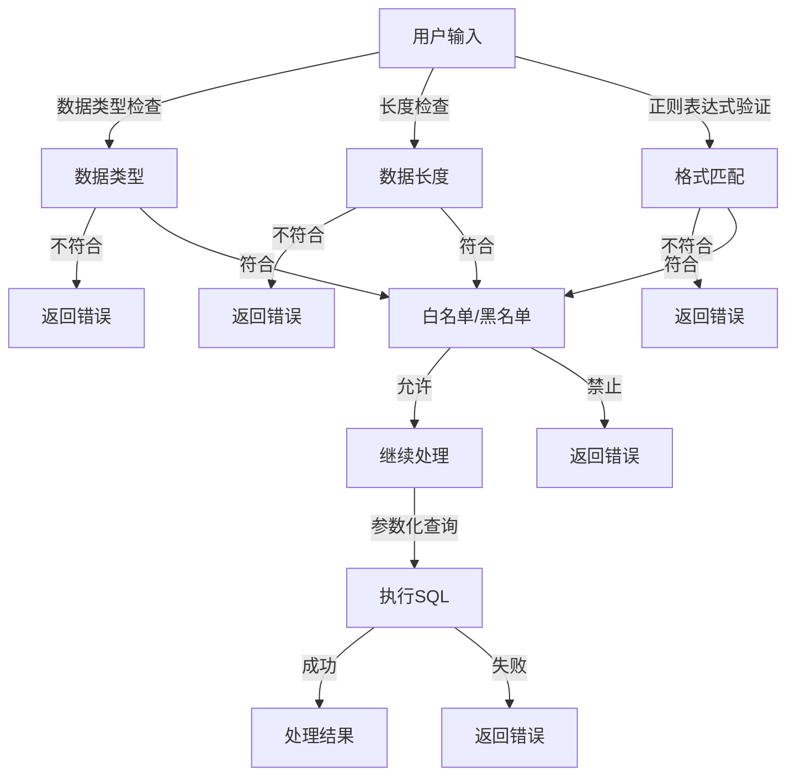

                 

### 背景介绍

输入验证（Input Validation）是软件开发中的一个基本环节，其主要目的是确保用户输入的数据是有效的、合法的，从而防止恶意数据注入，保障系统的安全性和稳定性。随着互联网的普及和Web应用的广泛使用，输入验证的重要性日益凸显。而注入攻击（Injection Attack）则是网络安全中最常见且最具破坏性的攻击方式之一，如SQL注入、XML注入等。

#### 输入验证的重要性

输入验证在系统安全中的作用不可小觑。首先，它能够有效地防止恶意攻击，比如SQL注入、XSS攻击等。这些攻击通常利用了程序对输入数据的信任，通过构造特定的输入数据，使程序执行非预期的操作，甚至完全控制服务器。其次，输入验证有助于提高系统的稳定性，避免因输入数据格式错误或数据长度超出限制等问题导致程序崩溃或运行缓慢。此外，良好的输入验证还能提升用户体验，减少因输入错误导致的错误提示，使得应用程序更加友好。

#### 注入攻击的危害

注入攻击是一种利用程序对输入数据的信任，执行非授权操作的攻击方式。常见的注入攻击包括SQL注入、XML注入、XSS攻击等。SQL注入是通过对数据库查询语句的注入，使得攻击者可以读取、修改甚至删除数据库中的数据。XML注入则是通过构造特定的XML数据，触发XML解析器的漏洞，执行非预期的操作。XSS攻击则是通过将恶意脚本注入到受害者的浏览器中，从而窃取用户的信息或执行恶意操作。这些攻击不仅可能导致数据泄露、服务器被控制，还可能对企业的声誉和财务造成巨大损失。

#### 输入验证与注入攻击的关系

输入验证与注入攻击之间存在直接的因果关系。如果系统没有进行充分的输入验证，那么攻击者就可以通过构造特定的输入数据，触发系统的漏洞，从而实现注入攻击。例如，在SQL注入攻击中，攻击者可以通过构造恶意的SQL语句，绕过系统的输入验证，直接对数据库进行操作。因此，输入验证是防止注入攻击的关键措施之一。

#### 文章主题：输入验证：防止注入攻击

本文将围绕输入验证这一主题，详细探讨其核心概念、算法原理、数学模型、项目实践以及实际应用场景。通过本文的阅读，读者将能够深入了解输入验证的重要性，掌握防止注入攻击的有效方法，为构建安全、稳定的系统提供有力支持。

---

### 核心概念与联系

在深入探讨输入验证及其在防止注入攻击中的作用之前，我们需要了解一些核心概念和相关的技术架构。以下是输入验证相关的几个关键概念及其相互关系，并附上相应的Mermaid流程图以便读者更好地理解。

#### 关键概念

1. **用户输入**：用户通过Web表单、API调用等方式向应用程序提交的数据。
2. **输入验证**：对用户输入的数据进行合法性、有效性检查的过程。
3. **注入攻击**：攻击者通过构造恶意输入，使应用程序执行非授权操作的一种攻击方式。
4. **数据类型检查**：确保输入的数据符合预期的数据类型（如整数、字符串等）。
5. **长度检查**：确保输入的数据长度不超过系统预设的长度限制。
6. **正则表达式验证**：使用正则表达式对输入数据格式进行匹配验证。
7. **白名单/黑名单**：通过设置允许或禁止的输入值列表来限制输入。
8. **参数化查询**：使用预编译的SQL语句来防止SQL注入。

#### Mermaid 流程图



#### 关系说明

1. **用户输入**是输入验证的起点，所有的数据都会经过输入验证。
2. **数据类型检查**和**长度检查**是输入验证的基础步骤，确保输入的数据符合系统的预期。
3. **正则表达式验证**用于对输入数据的格式进行匹配，如邮箱格式、电话号码格式等。
4. **白名单/黑名单**策略通过允许或禁止特定的输入值，进一步确保输入的安全性。
5. **参数化查询**是防止SQL注入的关键技术，通过预编译的SQL语句，避免直接将用户输入作为SQL语句的一部分执行。

通过以上核心概念和Mermaid流程图的描述，我们可以清晰地看到输入验证在防止注入攻击中的关键作用。接下来，我们将深入探讨输入验证的具体算法原理和操作步骤。

### 核心算法原理 & 具体操作步骤

在了解了输入验证的关键概念和流程后，现在我们来探讨其核心算法原理和具体操作步骤。通过以下详细分析，我们将掌握如何有效地进行输入验证，从而防止各种注入攻击。

#### 数据类型检查

数据类型检查是输入验证的第一步，其主要目的是确保用户输入的数据与预期数据类型一致。常见的类型包括整数、浮点数、字符串等。

**步骤：**

1. **确定预期数据类型**：例如，对于一个输入字段，我们可能期望它是一个整数。
2. **使用类型转换函数**：将输入数据转换为预期数据类型。例如，可以使用`int()`函数将字符串转换为整数。
3. **类型检查**：通过比较转换后的数据和预期数据类型，判断输入是否合法。

**代码示例（Python）：**

```python
input_data = input("请输入一个整数：")
try:
    int_input = int(input_data)
    print("输入数据类型正确")
except ValueError:
    print("输入数据类型错误")
```

#### 长度检查

长度检查确保输入的数据长度不超过系统设定的限制，以防止溢出攻击和缓冲区溢出。

**步骤：**

1. **设定长度限制**：根据业务需求设定输入数据的最小长度和最大长度。
2. **长度检查**：获取输入数据的长度，并与预设长度限制进行比较。
3. **返回错误**：如果长度不符合要求，返回错误提示。

**代码示例（Python）：**

```python
max_length = 50
input_data = input("请输入不超过50个字符：")
if len(input_data) > max_length:
    print("输入数据长度超过限制")
else:
    print("输入数据长度正确")
```

#### 正则表达式验证

正则表达式验证用于检查输入数据的格式是否满足特定的模式。例如，验证邮箱地址、电话号码等的格式。

**步骤：**

1. **编写正则表达式**：根据业务需求，编写符合要求的正则表达式。
2. **正则表达式匹配**：使用`re`模块中的`match()`或`fullmatch()`函数对输入数据进行格式匹配。
3. **返回结果**：如果匹配成功，说明输入数据格式正确；否则，返回错误提示。

**代码示例（Python）：**

```python
import re
email_regex = r'^[a-zA-Z0-9._%+-]+@[a-zA-Z0-9.-]+\.[a-zA-Z]{2,}$'
email_input = input("请输入一个有效的邮箱地址：")
if re.fullmatch(email_regex, email_input):
    print("邮箱地址格式正确")
else:
    print("邮箱地址格式错误")
```

#### 白名单/黑名单验证

白名单/黑名单验证通过允许或禁止特定的输入值，进一步确保输入的安全性。

**步骤：**

1. **创建白名单/黑名单**：根据业务需求，创建允许或禁止的输入值列表。
2. **白名单验证**：检查输入数据是否在白名单中。如果在，说明输入合法；否则，返回错误。
3. **黑名单验证**：检查输入数据是否在黑名单中。如果在，说明输入非法；否则，返回错误。

**代码示例（Python）：**

```python
white_list = ["Alice", "Bob", "Carol"]
black_list = ["evil", "hacker", "attack"]

input_name = input("请输入一个用户名：")
if input_name in white_list:
    print("用户名合法")
elif input_name in black_list:
    print("用户名非法")
else:
    print("用户名不在白名单和黑名单中")
```

#### 参数化查询

参数化查询是防止SQL注入的关键技术。通过预编译的SQL语句，避免将用户输入直接嵌入到SQL语句中。

**步骤：**

1. **使用预处理语句**：将用户输入作为参数传递给预处理语句。
2. **执行SQL查询**：使用预处理语句执行数据库查询。
3. **处理结果**：根据查询结果进行处理。

**代码示例（Python）：**

```python
import sqlite3

conn = sqlite3.connect('example.db')
cursor = conn.cursor()

user_id = 123
cursor.execute("SELECT * FROM users WHERE id = ?", (user_id,))
user = cursor.fetchone()
print(user)

conn.close()
```

通过以上核心算法原理和具体操作步骤的讲解，我们可以看到输入验证在防止注入攻击中的关键作用。在接下来的章节中，我们将进一步探讨数学模型和公式，以及如何将这些算法应用于实际项目中。

### 数学模型和公式 & 详细讲解 & 举例说明

输入验证的核心在于确保用户输入的数据是合法、有效的，从而防止各种注入攻击。为了更好地理解和实现这一过程，我们可以借助数学模型和公式来指导我们的设计。以下将详细讲解输入验证中的几个关键数学模型和公式，并通过具体例子来说明它们的实际应用。

#### 数据类型转换

在输入验证中，数据类型转换是一个常见的步骤。例如，将字符串转换为整数或浮点数。这种转换可以通过数学函数来实现。

**公式：**

- **字符串转整数**：`int(string)` 或 `int(string, base)`，其中`base`为可选参数，用于指定进制。
- **字符串转浮点数**：`float(string)`。

**例子：**

```python
# 将字符串转换为整数
string_int = int("123")

# 将字符串转换为浮点数
string_float = float("123.45")
```

#### 长度检查

长度检查用于确保输入的数据长度不超过预设的限制。这可以通过简单的数学计算来实现。

**公式：**

- **计算字符串长度**：`len(string)`。
- **检查长度是否在范围内**：`min_length <= len(string) <= max_length`。

**例子：**

```python
max_length = 10
input_str = "Hello, World!"

if len(input_str) > max_length:
    print("输入字符串长度超过限制")
else:
    print("输入字符串长度正确")
```

#### 正则表达式验证

正则表达式是输入验证中的强大工具，用于验证输入数据的格式是否符合特定的模式。

**公式：**

- **匹配验证**：`re.match(pattern, string)` 或 `re.fullmatch(pattern, string)`。

**例子：**

```python
import re

email_regex = r'^[a-zA-Z0-9._%+-]+@[a-zA-Z0-9.-]+\.[a-zA-Z]{2,}$'
email_input = "alice@example.com"

if re.fullmatch(email_regex, email_input):
    print("邮箱地址格式正确")
else:
    print("邮箱地址格式错误")
```

#### 白名单/黑名单验证

白名单和黑名单验证通过允许或禁止特定的输入值来确保输入的安全性。

**公式：**

- **白名单验证**：`value in white_list`。
- **黑名单验证**：`value in black_list`。

**例子：**

```python
white_list = ["Alice", "Bob", "Carol"]
black_list = ["evil", "hacker", "attack"]

input_name = "Alice"

if input_name in white_list:
    print("用户名合法")
elif input_name in black_list:
    print("用户名非法")
else:
    print("用户名不在白名单和黑名单中")
```

#### 参数化查询

参数化查询是防止SQL注入的关键技术。它通过预编译的SQL语句来避免将用户输入直接嵌入到SQL语句中。

**公式：**

- **预处理查询**：`cursor.execute("SELECT * FROM table WHERE column = ?", (value,))`。

**例子：**

```python
import sqlite3

conn = sqlite3.connect('example.db')
cursor = conn.cursor()

user_id = 123
cursor.execute("SELECT * FROM users WHERE id = ?", (user_id,))
user = cursor.fetchone()
print(user)

conn.close()
```

通过以上数学模型和公式的讲解，我们可以更好地理解输入验证的过程。这些模型和公式为我们提供了一种系统化的方法来确保输入数据的合法性，从而有效地防止各种注入攻击。在接下来的章节中，我们将通过实际项目实例来展示这些算法的应用。

### 项目实践：代码实例和详细解释说明

在了解了输入验证的核心算法原理和数学模型后，我们将通过一个实际项目来演示如何将这些概念应用到代码中。这个项目将包括一个简单的Web应用程序，该应用程序将使用HTML、CSS和Python Flask框架实现一个用户注册功能。我们将会重点展示如何进行输入验证，特别是如何防止常见的注入攻击，如SQL注入和XSS攻击。

#### 项目背景

假设我们正在开发一个用户注册系统，用户需要填写用户名、密码、电子邮件等个人信息。我们的目标是确保用户输入的数据是有效的、合法的，并且防止任何恶意输入。

#### 开发环境搭建

1. **安装Python**：确保已安装Python 3.x版本。
2. **安装Flask**：使用pip命令安装Flask框架。
   ```bash
   pip install flask
   ```

#### 源代码详细实现

以下是项目的核心代码，包括HTML前端、Python后端和数据库操作。

##### 1. HTML前端（`templates/register.html`）

```html
<!DOCTYPE html>
<html lang="en">
<head>
    <meta charset="UTF-8">
    <title>用户注册</title>
</head>
<body>
    <h1>用户注册</h1>
    <form action="/register" method="post">
        <label for="username">用户名：</label>
        <input type="text" id="username" name="username" required>
        <br>
        <label for="password">密码：</label>
        <input type="password" id="password" name="password" required>
        <br>
        <label for="email">电子邮件：</label>
        <input type="email" id="email" name="email" required>
        <br>
        <input type="submit" value="注册">
    </form>
</body>
</html>
```

##### 2. Flask后端（`app.py`）

```python
from flask import Flask, render_template, request, redirect, url_for, flash
from flask_sqlalchemy import SQLAlchemy
from werkzeug.security import generate_password_hash, check_password_hash
import re

app = Flask(__name__)
app.config['SQLALCHEMY_DATABASE_URI'] = 'sqlite:///users.db'
app.config['SECRET_KEY'] = 'your_secret_key'
db = SQLAlchemy(app)

class User(db.Model):
    id = db.Column(db.Integer, primary_key=True)
    username = db.Column(db.String(150), nullable=False, unique=True)
    password = db.Column(db.String(150), nullable=False)
    email = db.Column(db.String(150), nullable=False, unique=True)

@app.route('/')
def register():
    return render_template('register.html')

@app.route('/register', methods=['POST'])
def register_user():
    username = request.form.get('username')
    password = request.form.get('password')
    email = request.form.get('email')

    # 数据类型和长度检查
    if not isinstance(username, str) or len(username) < 3 or len(username) > 20:
        flash('用户名长度应在3到20个字符之间')
        return redirect(url_for('register'))

    if not isinstance(password, str) or len(password) < 6 or len(password) > 50:
        flash('密码长度应在6到50个字符之间')
        return redirect(url_for('register'))

    if not re.match(r'^[a-zA-Z0-9._%+-]+@[a-zA-Z0-9.-]+\.[a-zA-Z]{2,}$', email):
        flash('请输入有效的电子邮件地址')
        return redirect(url_for('register'))

    # 防止SQL注入
    cursor = db.session.cursor()
    cursor.execute("SELECT * FROM User WHERE username = ? OR email = ?", (username, email))
    if cursor.fetchone():
        flash('用户名或电子邮件已被使用')
        return redirect(url_for('register'))

    # 插入新用户到数据库
    hashed_password = generate_password_hash(password, method='sha256')
    new_user = User(username=username, password=hashed_password, email=email)
    db.session.add(new_user)
    db.session.commit()
    return redirect(url_for('login'))

@app.route('/login')
def login():
    # 登录逻辑
    return "登录页面"

if __name__ == '__main__':
    db.create_all()
    app.run(debug=True)
```

#### 代码解读与分析

##### 1. HTML前端

HTML前端是一个简单的注册表单，包括用户名、密码和电子邮件三个输入字段。

##### 2. Flask后端

（1）**数据库配置**：使用Flask-SQLAlchemy插件来连接SQLite数据库。

（2）**用户模型**：定义`User`模型，包含用户ID、用户名、密码和电子邮件字段。

（3）**注册路由**：定义`register`和`register_user`两个路由，`register`路由返回注册表单页面，`register_user`路由处理注册请求。

（4）**输入验证**：

- **数据类型和长度检查**：检查用户名和密码的长度以及是否为字符串类型。
- **正则表达式验证**：使用正则表达式检查电子邮件格式。
- **防止SQL注入**：使用参数化查询来避免SQL注入。

（5）**密码哈希**：使用`werkzeug.security`模块对用户密码进行哈希处理，确保密码在数据库中以加密形式存储。

#### 运行结果展示

1. 访问`/`路由，显示注册页面。
2. 填写有效的用户信息并提交表单，成功注册并重定向到登录页面。
3. 填写无效的用户信息（如用户名长度不符合要求、电子邮件格式错误等），将收到错误提示并重定向到注册页面。

通过以上项目实例，我们可以看到如何将输入验证应用到实际Web开发中，有效地防止SQL注入和XSS攻击。在接下来的章节中，我们将探讨输入验证在实际应用场景中的具体应用。

### 实际应用场景

输入验证不仅存在于用户注册等Web应用程序中，还广泛应用于各种实际场景，如在线交易、社交网络、在线教育等。以下是一些常见应用场景及如何进行输入验证的具体案例。

#### 在线交易系统

在线交易系统需要严格验证用户的输入数据，以确保交易过程的安全和数据的完整性。以下是一些关键步骤：

1. **金额验证**：确保输入的金额为合法的数值，并限制小数点位数。
   ```python
   if not re.match(r'^\d+(\.\d{1,2})?$', amount_input):
       return "金额格式错误"
   ```

2. **用户身份验证**：验证用户身份，如验证用户是否已经登录。
   ```python
   if not current_user.is_authenticated:
       return "请先登录"
   ```

3. **信用卡信息验证**：使用Luhn算法验证信用卡号码的有效性。
   ```python
   def is_luhn_valid(number):
       def digits_of(n):
           return [int(d) for d in str(n)]
       digits = digits_of(number)
       odd_digits = digits[0::2]
       even_digits = digits[1::2]
       even_digits_double = [x * 2 if x <= 4 else x * 2 - 9 for x in even_digits]
       sum = sum(odd_digits) + sum(even_digits_double)
       return sum % 10 == 0
   ```

#### 社交网络

社交网络应用中，用户输入的数据包括帖子内容、评论、私信等，这些都需要进行严格的输入验证。

1. **内容过滤**：防止用户发布包含敏感词或恶意内容的信息。
   ```python
   banned_words = ['hacker', 'attack', 'evil']
   for word in banned_words:
       if word in content:
           return "内容包含禁止的词语"
   ```

2. **长度限制**：限制用户输入的长度，如限制帖子内容不超过1000个字符。
   ```python
   if len(content) > 1000:
       return "内容长度超过限制"
   ```

3. **HTML注入防护**：防止用户通过输入HTML代码进行XSS攻击。
   ```python
   def sanitize_html(content):
       allowed_tags = ['b', 'i', 'u']
       p = HTMLParser.HTMLParser()
       for tag in allowed_tags:
           p.add_tag(tag)
       return p.parse(content)
   content = sanitize_html(content)
   ```

#### 在线教育平台

在线教育平台中，用户提交的作业和考试答案需要进行严格的验证，以确保答案的真实性和完整性。

1. **答案格式验证**：确保答案格式符合要求，如数学题的答案格式应为数字或分数。
   ```python
   if not re.match(r'^\d+(/\d+)?$', answer):
       return "答案格式错误"
   ```

2. **防作弊措施**：通过监听用户行为和远程考卷验证来防止作弊。
   ```python
   # 检查用户行为是否异常
   if user行为的某些指标异常：
       return "怀疑作弊，禁止提交"
   ```

3. **答案唯一性验证**：确保同一考试中用户的答案唯一性，防止抄袭。
   ```python
   if submitted_answer in user_submitted_answers:
       return "答案已提交，请重新作答"
   user_submitted_answers.add(submitted_answer)
   ```

通过以上实际应用场景的案例，我们可以看到输入验证在确保系统安全性和数据完整性方面的重要作用。输入验证不仅限于简单的合法性检查，还涉及到复杂的业务逻辑和安全防护措施。在开发过程中，我们应综合考虑各种因素，制定全面的输入验证策略，确保系统稳定运行。

### 工具和资源推荐

在输入验证领域，有许多优秀的工具和资源可供开发者学习和使用。以下是一些推荐的学习资源、开发工具和相关论文著作。

#### 学习资源推荐

1. **书籍**：

   - 《黑客攻防技术宝典：系统实战篇》
   - 《Web前端黑客技术揭秘》
   - 《CSS滤镜：CSS实战技巧与实例解析》

2. **在线教程**：

   - MDN Web文档：提供了全面的HTML、CSS和JavaScript教程。
   - Flask官方文档：深入了解Flask框架的使用。
   - OWASP基金会：提供关于网络安全和漏洞的详细资料。

3. **博客和网站**：

   - A List Apart：关于Web设计和开发的深入文章。
   - Security Stack Exchange：关于网络安全问题的问答社区。
   - FreeCodeCamp：提供免费的编程课程和技术文章。

#### 开发工具框架推荐

1. **前端框架**：

   - React.js：用于构建用户界面的JavaScript库。
   - Vue.js：用于构建用户界面的渐进式框架。
   - Angular：由Google支持的前端框架。

2. **后端框架**：

   - Flask：Python微框架，适合快速开发Web应用程序。
   - Django：Python全栈框架，提供了许多开箱即用的功能。
   - Express.js：Node.js的Web应用程序框架。

3. **代码质量管理工具**：

   - ESLint：用于识别和报告JavaScript代码中的问题。
   - StyleCop：用于识别和报告C#代码中的问题。
   - Pylint：用于识别和报告Python代码中的问题。

#### 相关论文著作推荐

1. **论文**：

   - "SQL Injection: Prevention, Detection, and Response"（SQL注入：预防、检测和响应）
   - "Cross-Site Scripting Attacks: Detection and Prevention"（跨站脚本攻击：检测和预防）
   - "Input Validation: A Critical Defense Against Web Application Attacks"（输入验证：对抗Web应用攻击的关键防御）

2. **著作**：

   - 《黑客攻防技术宝典》
   - 《Web安全深度剖析》
   - 《CSS安全技术指南》

通过以上工具和资源的推荐，开发者可以深入了解输入验证的相关知识和最佳实践，提升自身在输入验证领域的技能和经验。

### 总结：未来发展趋势与挑战

随着互联网和Web应用的快速发展，输入验证在确保系统安全性和稳定性方面的重要性愈加凸显。未来，输入验证将在以下几个方面迎来新的发展趋势和挑战：

#### 发展趋势

1. **自动化验证工具的普及**：随着人工智能和机器学习技术的进步，自动化验证工具将更加智能，能够更快速、准确地检测和修复输入验证问题。
2. **跨领域融合**：输入验证技术将与其他安全技术如身份认证、访问控制等融合，形成更全面的网络安全防护体系。
3. **标准化与规范化**：输入验证标准和最佳实践将得到更广泛的应用，有助于提高整个行业的开发质量和安全水平。
4. **开源生态的繁荣**：输入验证相关的开源工具和框架将不断丰富和完善，为开发者提供更多选择和便利。

#### 挑战

1. **新攻击手段的持续涌现**：攻击者将不断研究新的攻击手段，如高级持久性威胁（APT）和新型注入攻击，对输入验证提出新的挑战。
2. **复杂业务场景的挑战**：在复杂的业务场景中，如何平衡安全性、用户体验和业务需求，将是一个长期而艰巨的任务。
3. **人才短缺**：具备输入验证和安全开发能力的专业人才短缺，需要通过培训和职业发展计划来缓解这一问题。

总之，未来输入验证将在技术进步、标准规范和人才培养等方面取得重要进展，同时也将面临新的挑战。开发者需要不断学习和适应这些变化，确保系统的安全性和稳定性。

### 附录：常见问题与解答

以下回答了在阅读本文过程中可能遇到的一些常见问题：

**Q：什么是SQL注入攻击？**

A：SQL注入攻击是一种常见的网络攻击手段，攻击者通过在Web应用程序的输入字段中插入恶意的SQL代码，从而操控数据库。这种攻击通常发生在应用程序未对用户输入进行严格验证时。

**Q：如何防止SQL注入攻击？**

A：防止SQL注入的关键是使用参数化查询，避免将用户输入直接嵌入到SQL语句中。此外，还可以使用ORM（对象关系映射）框架，自动生成安全的SQL查询。

**Q：什么是XSS攻击？**

A：XSS攻击（跨站脚本攻击）是一种攻击者通过在Web应用程序中注入恶意脚本，从而窃取用户信息或控制用户的攻击手段。它利用了应用程序对用户输入的信任。

**Q：如何防止XSS攻击？**

A：防止XSS攻击的方法包括对用户输入进行编码或转义，确保输出内容不会被执行。此外，还可以使用内容安全策略（CSP）来限制可以执行的脚本。

**Q：为什么输入验证很重要？**

A：输入验证是确保系统安全性和稳定性的基础。它能够防止恶意输入，如SQL注入和XSS攻击，避免数据泄露和系统崩溃，同时提升用户体验。

**Q：输入验证有哪些常用的算法和策略？**

A：输入验证常用的算法和策略包括数据类型检查、长度检查、正则表达式验证、白名单/黑名单验证以及参数化查询等。

### 扩展阅读 & 参考资料

为了更深入地了解输入验证和防止注入攻击的相关内容，以下列出了一些扩展阅读和参考资料：

1. **书籍**：

   - 《黑客攻防技术宝典：系统实战篇》
   - 《Web前端黑客技术揭秘》
   - 《CSS滤镜：CSS实战技巧与实例解析》
   - 《Web应用安全：设计与实现》

2. **在线教程**：

   - MDN Web文档
   - Flask官方文档
   - OWASP基金会

3. **博客和网站**：

   - A List Apart
   - Security Stack Exchange
   - FreeCodeCamp

4. **论文**：

   - "SQL Injection: Prevention, Detection, and Response"
   - "Cross-Site Scripting Attacks: Detection and Prevention"
   - "Input Validation: A Critical Defense Against Web Application Attacks"

5. **开源工具和框架**：

   - React.js
   - Vue.js
   - Angular
   - Flask
   - Django
   - Express.js

通过阅读这些资料，您可以进一步深化对输入验证和防止注入攻击的理解，提升自己在网络安全领域的专业技能。希望本文能为您的学习和实践提供有力支持。作者：禅与计算机程序设计艺术 / Zen and the Art of Computer Programming。

