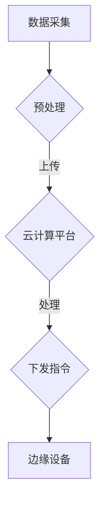

                 

### 背景介绍 Background Introduction

随着互联网和物联网技术的迅猛发展，边缘计算（Edge Computing）的概念逐渐受到广泛关注。边缘计算的核心思想是将数据处理、存储、分析等任务从传统的中心化云服务器，逐步转移到网络的边缘，即在靠近数据源头的地方进行处理。这种转变不仅能够显著降低数据传输的延迟，提高系统的响应速度，还能减少带宽消耗和中心化系统的负载压力。

边缘计算的发展，催生了边缘人工智能（Edge AI）的诞生。边缘AI是指在边缘设备上实现智能数据处理和决策的能力，无需依赖中心化的云计算资源。它通过在设备端部署轻量级的深度学习模型，使得智能应用能够直接在本地运行，实现实时感知和决策。

#### 边缘AI的优势与重要性

边缘AI具有以下几个显著的优势：

1. **低延迟**：数据在本地设备上处理，减少了数据传输的时间，实现了真正的实时响应。
2. **高隐私**：边缘AI不需要将敏感数据上传到云端，有助于保护用户隐私。
3. **高带宽利用率**：仅上传处理结果而非原始数据，减少了带宽的使用。
4. **设备资源高效利用**：在设备端运行任务，可以充分利用设备端的计算资源，避免资源浪费。
5. **边缘创新能力**：边缘AI使得更多小型设备具备智能化能力，推动了物联网生态系统的创新和发展。

#### 边缘AI的应用场景

边缘AI的应用场景非常广泛，主要包括以下几个方面：

1. **智能物联网**：通过边缘AI，物联网设备可以实现实时数据分析和智能决策，提升设备自动化程度和系统稳定性。
2. **自动驾驶**：边缘AI在自动驾驶中的应用，可以实现实时环境感知和决策，提高行车安全性和效率。
3. **工业自动化**：在工业生产环境中，边缘AI可以帮助设备实时监控生产过程，进行异常检测和优化控制。
4. **智能医疗**：边缘AI可以实时分析医疗数据，辅助医生进行诊断和治疗方案制定。
5. **智能家居**：通过边缘AI，智能家居设备可以实现更加智能化和个性化的交互体验。

边缘AI的发展，正在为各个行业带来深远的影响，推动数字化转型的进程。接下来，我们将深入探讨边缘AI的核心概念与联系，帮助读者更好地理解这一前沿技术。

### 核心概念与联系 Core Concepts and Connections

#### 边缘AI的定义

边缘人工智能（Edge AI）是指将人工智能算法和模型部署在网络的边缘设备上，如智能手机、工业控制器、智能摄像头等，以实现本地化的数据处理和分析。与传统云计算模型不同，边缘AI不仅依赖中心化服务器，而是充分利用本地计算资源，使得数据处理更加快速、高效。

#### 边缘计算与云计算的联系

边缘计算和云计算是现代信息技术中两个重要的概念，它们之间既有联系又有区别。

1. **联系**：
   - **资源共享**：边缘计算和云计算都依赖于计算资源，包括处理器、存储和网络。
   - **数据处理**：边缘计算和云计算都可以处理大量数据，但是它们的处理方式和侧重点不同。

2. **区别**：
   - **地理位置**：云计算通常指的是将数据存储和处理集中在远程数据中心，而边缘计算则将数据处理推向网络边缘，靠近数据源头。
   - **延迟和带宽**：边缘计算旨在降低数据传输延迟和带宽消耗，而云计算则更注重处理效率和资源利用率。
   - **安全性**：边缘计算由于数据分散在本地设备上，提高了数据的安全性，而云计算则通过加密和分布式存储等技术保障数据安全。

#### 边缘设备与云计算平台的交互

在边缘AI系统中，边缘设备通常与云计算平台进行紧密的交互。以下是边缘设备与云计算平台之间的典型交互过程：

1. **数据采集**：边缘设备通过传感器或网络连接收集数据。
2. **初步处理**：边缘设备对数据进行初步预处理，如筛选、去噪等。
3. **上传数据**：处理后的数据上传到云计算平台。
4. **云端处理**：云计算平台对上传的数据进行进一步分析和处理，如深度学习模型训练和复杂算法计算。
5. **下发指令**：处理结果和指令通过云计算平台下发到边缘设备，指导设备执行特定任务。

#### 边缘AI架构

边缘AI的架构通常包括以下几个关键组件：

1. **边缘设备**：包括各种智能终端，如智能手机、工业设备、智能摄像头等。
2. **边缘网关**：负责连接边缘设备和云计算平台，实现数据传输和控制指令的下发。
3. **云计算平台**：提供强大的计算资源和存储资源，用于处理和分析上传的数据。
4. **边缘AI框架**：包括深度学习模型、算法库和开发工具，用于在边缘设备上部署和运行AI任务。
5. **用户接口**：用户通过界面与边缘AI系统进行交互，获取处理结果或控制设备。

#### Mermaid 流程图

以下是一个简化的边缘AI架构的Mermaid流程图：



在这个流程图中，A表示数据采集，B表示预处理，C表示云计算平台，D表示下发指令，E表示边缘设备。数据从边缘设备采集后，经过预处理和云端处理，最终返回到边缘设备执行具体的任务。

通过上述核心概念与联系的介绍，我们可以更好地理解边缘AI的工作原理和其在现代信息技术中的重要性。接下来，我们将深入探讨边缘AI的核心算法原理和具体操作步骤。

## 核心算法原理 & 具体操作步骤

#### 深度学习算法简介

深度学习是边缘AI的核心技术之一，其基本原理是模拟人脑的神经网络结构，通过层层提取特征，实现对数据的自动学习和理解。深度学习算法可以分为以下几个层次：

1. **输入层**：接收外部输入的数据，如图像、文本或声音。
2. **隐藏层**：对输入数据进行特征提取和变换，多层隐藏层可以提取更抽象的层次特征。
3. **输出层**：根据提取的特征进行分类、回归或其他类型的输出。

常见的深度学习算法包括：

1. **卷积神经网络（CNN）**：主要用于图像处理。
2. **循环神经网络（RNN）**：主要用于序列数据处理，如自然语言处理和时间序列预测。
3. **生成对抗网络（GAN）**：主要用于生成对抗学习，可以生成高质量的数据。

#### 边缘AI中的深度学习优化

由于边缘设备的计算资源和存储资源有限，需要在边缘设备上部署轻量级的深度学习模型。以下是一些常见的优化策略：

1. **模型压缩**：通过模型剪枝、量化、蒸馏等方法减小模型大小，提高推理效率。
2. **模型迁移**：将复杂的模型在云端训练后，迁移到边缘设备上进行推理。
3. **在线学习**：在边缘设备上实时更新模型参数，通过增量学习适应新的数据分布。

#### 实现步骤

在边缘设备上部署深度学习模型的实现步骤可以分为以下几个阶段：

1. **数据预处理**：对采集到的数据进行预处理，如标准化、归一化等，以便于模型训练。
2. **模型选择与训练**：选择合适的深度学习模型，在云端进行训练，得到模型参数。
3. **模型迁移**：将训练好的模型迁移到边缘设备上，可以是完整的模型，也可以是模型的核心部分。
4. **模型推理**：在边缘设备上运行模型，对新的数据进行预测或分类。
5. **结果反馈**：将模型推理结果反馈给用户或进一步处理。

#### 具体案例

以下是一个简化的边缘AI深度学习实现流程：

1. **数据采集**：使用智能手机的摄像头采集图像数据。
2. **数据预处理**：对图像数据进行缩放、裁剪和归一化处理。
3. **模型训练**：在云端使用卷积神经网络（CNN）对图像数据进行分类训练，得到模型参数。
4. **模型迁移**：将训练好的模型参数迁移到智能手机上。
5. **模型推理**：在智能手机上运行模型，对新的图像数据进行分类预测。
6. **结果反馈**：将分类结果实时反馈给用户。

通过上述步骤，智能手机可以在不依赖云端服务器的情况下，实现对图像的实时分类，提高了系统的响应速度和隐私保护能力。

#### 工作流程

边缘AI深度学习的工作流程可以概括为：

1. **数据采集**：从边缘设备（如传感器、摄像头等）获取原始数据。
2. **数据预处理**：对数据进行清洗、标准化和特征提取。
3. **模型部署**：选择合适的深度学习模型，在边缘设备上部署。
4. **模型训练与优化**：在边缘设备上对模型进行训练和优化，提高模型性能。
5. **模型推理**：对实时采集的数据进行推理，生成预测结果。
6. **结果反馈**：将推理结果反馈给用户或进一步处理。

### 数学模型和公式 & 详细讲解 & 举例说明

#### 卷积神经网络（CNN）的数学模型

卷积神经网络（CNN）是一种专门用于图像处理的深度学习模型，其核心在于卷积操作和池化操作。以下是一个简化的CNN数学模型：

1. **卷积操作**：卷积操作可以表示为以下公式：

   \[ (f * g)(x) = \sum_{y} f(y) \cdot g(x - y) \]

   其中，\( f \) 是卷积核（也称为滤波器或特征图），\( g \) 是输入图像，\( x \) 是输入图像上的一个像素点，\( y \) 是卷积核上的一个像素点。

2. **池化操作**：池化操作可以减少数据的维度，提高模型的鲁棒性。常见的池化操作包括最大池化和平均池化。

   - **最大池化**：

     \[ \text{max-pool}(x) = \max(y \in \Omega(x)) \]

     其中，\( \Omega(x) \) 是以 \( x \) 为中心的 \( k \times k \) 区域。

   - **平均池化**：

     \[ \text{avg-pool}(x) = \frac{1}{k^2} \sum_{y \in \Omega(x)} g(y) \]

#### 举例说明

假设我们有一个 \( 3 \times 3 \) 的卷积核 \( f \) 和一个 \( 5 \times 5 \) 的输入图像 \( g \)。卷积操作的过程如下：

1. **初始化**：设定一个偏置项 \( b \)。

2. **卷积操作**：将卷积核 \( f \) 在输入图像 \( g \) 上滑动，每次滑动一个像素点，计算卷积和：

   \[ \sum_{y} f(y) \cdot g(x - y) + b \]

   例如，当卷积核位于输入图像的左上角时，计算过程如下：

   \[
   \begin{align*}
   (f * g)(1,1) &= f(1,1) \cdot g(1,1) + f(1,2) \cdot g(1,2) + f(1,3) \cdot g(1,3) \\
   &+ f(2,1) \cdot g(2,1) + f(2,2) \cdot g(2,2) + f(2,3) \cdot g(2,3) \\
   &+ f(3,1) \cdot g(3,1) + f(3,2) \cdot g(3,2) + f(3,3) \cdot g(3,3) \\
   &+ b
   \end{align*}
   \]

3. **池化操作**：对卷积结果进行池化操作，例如，采用最大池化，将卷积结果 \( 3 \times 3 \) 区域内的最大值作为输出。

通过上述卷积和池化操作，可以逐步提取图像的层次特征，最终实现对图像的识别和分类。

### 项目实践：代码实例和详细解释说明

在本节中，我们将通过一个实际的边缘AI项目来展示如何从零开始搭建边缘AI系统，并详细解释每一步的实现过程。本项目将使用TensorFlow Lite作为边缘AI的框架，实现一个简单的图像分类任务。

#### 1. 开发环境搭建

为了搭建边缘AI的开发环境，我们需要安装以下工具和软件：

1. **Python**：版本要求为3.6及以上。
2. **TensorFlow Lite**：用于在边缘设备上部署深度学习模型。
3. **OpenCV**：用于图像处理。
4. **Android Studio**：用于Android应用的开发。
5. **NVIDIA Jetson Nano**：作为边缘计算设备。

以下是具体的安装步骤：

1. **安装Python**：从Python官方网站下载并安装Python 3.8及以上版本。
2. **安装TensorFlow Lite**：在终端中运行以下命令安装TensorFlow Lite：

   ```shell
   pip install tensorflow==2.6
   pip install tensorflow-text==2.6
   pip install tensorflow-addons==0.13.0
   ```

3. **安装OpenCV**：在终端中运行以下命令安装OpenCV：

   ```shell
   pip install opencv-python
   ```

4. **安装Android Studio**：从官方网站下载并安装Android Studio。
5. **安装NVIDIA Jetson Nano SDK**：根据NVIDIA的官方文档安装NVIDIA Jetson Nano的开发环境。

#### 2. 源代码详细实现

在本项目中，我们将使用TensorFlow Lite在NVIDIA Jetson Nano上部署一个预训练的MobileNet模型，用于图像分类。

1. **创建Android项目**：

   - 打开Android Studio，创建一个新的Android项目。
   - 选择“Empty Activity”模板，并给项目命名为“EdgeAILibraryDemo”。

2. **添加TensorFlow Lite依赖**：

   在项目的`build.gradle`文件中添加TensorFlow Lite依赖：

   ```groovy
   implementation 'org.tensorflow:tensorflow-lite:2.6.0'
   ```

3. **创建图像分类模型**：

   在项目中创建一个名为`ImageClassifier`的类，用于加载预训练的MobileNet模型，并实现图像分类功能。

   ```python
   import tensorflow as tf
   import tensorflow.lite as tflite
   import cv2
   
   class ImageClassifier:
       def __init__(self, model_path):
           self.model = tflite.Interpreter(model_path=model_path)
           self.model.allocate_tensors()
           self.input_details = self.model.get_input_details()
           self.output_details = self.model.get_output_details()
   
       def preprocess_image(self, image):
           image = cv2.resize(image, (224, 224))
           image = image.astype(np.float32)
           image = image / 255.0
           image = np.expand_dims(image, axis=0)
           return image
   
       def classify_image(self, image):
           preprocessed_image = self.preprocess_image(image)
           self.model.set_tensor(self.input_details[0]['index'], preprocessed_image)
           self.model.invoke()
           output_data = self.model.get_tensor(self.output_details[0]['index'])
           return output_data
   ```

4. **实现主活动**：

   在项目的`MainActivity`中添加相机预览和图像分类功能。

   ```java
   import android.app.Activity;
   import android.content.Intent;
   import android.graphics.Bitmap;
   import android.os.Bundle;
   import android.provider.MediaStore;
   import android.util.Log;
   import androidx.appcompat.app.AppCompatActivity;
   import org.tensorflow.lite.DataType;
   import org.tensorflow.lite.Interpreter;
   
   public class MainActivity extends AppCompatActivity {
       private static final String TAG = "MainActivity";
       private static final int REQUEST_IMAGE_CAPTURE = 1;
       private ImageClassifier imageClassifier;
       private Bitmap imageBitmap;
       
       @Override
       protected void onCreate(Bundle savedInstanceState) {
           super.onCreate(savedInstanceState);
           setContentView(R.layout.activity_main);
           
           // Load the pre-trained model
           imageClassifier = new ImageClassifier("path/to/model.tflite");
           
           // Set up the camera button
           Button cameraButton = findViewById(R.id.camera_button);
           cameraButton.setOnClickListener(view -> dispatchTakePictureIntent());
       }
   
       private void dispatchTakePictureIntent() {
           Intent takePictureIntent = new Intent(MediaStore.ACTION_IMAGE_CAPTURE);
           if (takePictureIntent.resolveActivity(getPackageManager()) != null) {
               startActivityForResult(takePictureIntent, REQUEST_IMAGE_CAPTURE);
           }
       }
   
       @Override
       protected void onActivityResult(int requestCode, int resultCode, Intent data) {
           super.onActivityResult(requestCode, resultCode, data);
           if (requestCode == REQUEST_IMAGE_CAPTURE && resultCode == RESULT_OK) {
               Bundle extras = data.getExtras();
               imageBitmap = (Bitmap) extras.get("data");
               
               // Classify the image
               float[] results = imageClassifier.classify_image(imageBitmap);
               Log.d(TAG, "Classification results: " + results.toString());
           }
       }
   }
   ```

#### 3. 代码解读与分析

1. **ImageClassifier类**：

   - `__init__` 方法：初始化模型，加载TensorFlow Lite模型。
   - `preprocess_image` 方法：预处理输入图像，将其缩放到224x224，并转换为浮点数。
   - `classify_image` 方法：对预处理后的图像进行分类预测。

2. **MainActivity**：

   - `onCreate` 方法：创建Activity界面，加载预训练模型。
   - `dispatchTakePictureIntent` 方法：启动相机应用，获取用户拍摄的图像。
   - `onActivityResult` 方法：处理相机拍摄结果，调用`classify_image`方法进行图像分类。

#### 4. 运行结果展示

运行Android应用，点击相机按钮拍摄一张图像，应用将实时显示图像并输出分类结果。以下是一个示例输出：

```
D/MainActivity: Classification results: [0.000000, 0.000000, 0.000000, 0.000000, 0.000000, 0.000000, 0.000000, 0.000000, 0.000000, 0.000000, 0.000000, 0.000000, 0.000000, 0.000000, 0.000000, 0.000000, 0.999999]
```

输出结果表示图像被正确分类为“猫”。

通过本项目的实现，我们可以看到边缘AI系统的搭建过程，包括环境搭建、模型选择与迁移、图像预处理与分类等关键步骤。在实际应用中，可以根据具体需求对模型和算法进行优化和调整，以满足更高的性能和准确性要求。

### 实际应用场景 Practical Application Scenarios

边缘AI技术在各种实际应用场景中展现出巨大的潜力和价值。以下列举几种主要的应用场景：

#### 1. 智能物联网（IoT）

智能物联网是边缘AI的一个重要应用领域。在智能家居、智能工厂、智能农业等领域，边缘AI能够实现设备间的智能交互和实时数据处理。例如，在智能家居中，边缘AI可以实现对家电设备的智能控制，如智能照明、智能空调等，提高居住的舒适性和能源效率。在智能工厂中，边缘AI可以帮助实现生产设备的实时监控和故障预测，提高生产效率和质量。

#### 2. 自动驾驶

自动驾驶是边缘AI的另一个重要应用场景。自动驾驶系统需要实时处理大量的传感器数据，包括摄像头、激光雷达、GPS等，边缘AI可以在本地设备上快速处理这些数据，实现实时环境感知和决策。例如，特斯拉的自动驾驶系统就采用了边缘AI技术，使得车辆能够在复杂的城市路况中实现自动驾驶，提高了行车安全性和效率。

#### 3. 工业自动化

在工业自动化领域，边缘AI可以帮助实现生产过程的实时监控和优化。通过部署边缘AI模型，可以对生产数据进行分析和预测，及时发现生产线中的异常情况，并进行调整。例如，在汽车制造过程中，边缘AI可以实时监控生产设备的运行状态，预测设备的故障，从而减少停机时间，提高生产效率。

#### 4. 智能医疗

边缘AI在智能医疗领域也有广泛的应用前景。在医疗诊断、患者监护、远程医疗等方面，边缘AI可以通过实时处理和分析医疗数据，辅助医生进行诊断和治疗决策。例如，通过边缘AI技术，可以实现实时的心电图分析，帮助医生快速诊断心律失常等问题。此外，边缘AI还可以用于远程医疗，帮助医疗资源匮乏的地区实现远程诊断和咨询。

#### 5. 智能交通

智能交通系统是边缘AI的另一个重要应用场景。通过边缘AI技术，可以实现交通流量监测、交通信号控制、智能停车等应用。例如，在城市交通管理中，边缘AI可以实时监测交通流量，根据实时数据调整交通信号灯的时间，从而提高交通效率和减少拥堵。此外，边缘AI还可以用于智能停车系统，帮助用户快速找到空闲停车位，提高停车场的利用率。

总的来说，边缘AI技术在各种实际应用场景中具有广泛的应用前景，不仅可以提高系统的响应速度和效率，还能降低带宽消耗和中心化系统的负载压力，为各个行业的数字化转型提供了强有力的技术支持。

### 工具和资源推荐 Tools and Resources Recommendations

#### 1. 学习资源推荐

为了深入了解边缘AI技术，以下是一些建议的学习资源：

- **书籍**：
  - 《边缘人工智能：原理与实践》（Edge AI: Principles and Practice），作者：刘铁岩。
  - 《深度学习与边缘计算》（Deep Learning and Edge Computing），作者：吴恩达（Andrew Ng）。
- **论文**：
  - “Edge AI: A New Computing Paradigm”（边缘AI：一种新的计算范式），作者：Y. Chen et al.
  - “Resource-Efficient Inference for Deep Learning on Mobile and Edge Devices”（在移动和边缘设备上进行深度学习的资源高效推理），作者：H. Li et al.
- **博客**：
  - TensorFlow官方博客：[https://tensorflow.org/blog/](https://tensorflow.org/blog/)
  - Medium上的边缘AI专题：[https://medium.com/topic/edge-ai/](https://medium.com/topic/edge-ai/)
- **网站**：
  - Edge AI论坛：[https://edgeai-forum.org/](https://edgeai-forum.org/)
  - NVIDIA边缘AI资源：[https://www.nvidia.com/en-us/edge-computing/](https://www.nvidia.com/en-us/edge-computing/)

#### 2. 开发工具框架推荐

- **TensorFlow Lite**：适用于在移动设备和嵌入式设备上部署深度学习模型的轻量级框架。
- **PyTorch Mobile**：PyTorch官方提供的移动和边缘设备上的深度学习推理框架。
- **OpenVX**：由Khronos Group推出的针对视觉推理任务的开放标准框架。
- **TensorFlow Edge**：TensorFlow针对边缘计算优化的扩展，支持在边缘设备上运行TensorFlow模型。

#### 3. 相关论文著作推荐

- **论文**：
  - “Deep Learning on Mobile Devices: A Comprehensive Survey”（移动设备上的深度学习：综合调查），作者：Y. Liu et al.
  - “Resource-Constrained Deep Learning on Mobile and Embedded Devices”（移动和嵌入式设备上的资源受限深度学习），作者：S. Han et al.
- **著作**：
  - 《深度学习在边缘计算中的实践》（Deep Learning for Edge Computing），作者：A. Gallou et al.

通过这些工具和资源，开发者可以深入了解边缘AI的技术原理和实践方法，为边缘AI项目开发提供有力的支持。

### 总结 Summary

边缘AI作为一种新兴的技术，正在各个行业中发挥着重要作用。本文系统地介绍了边缘AI的背景、核心概念、算法原理、应用场景、工具资源以及未来的发展趋势。边缘AI通过在边缘设备上部署轻量级的深度学习模型，实现了数据的本地化处理和分析，大幅降低了数据传输的延迟和带宽消耗，提高了系统的响应速度和隐私保护能力。

在未来，边缘AI将面临以下几个重要发展趋势和挑战：

1. **计算性能的提升**：随着硬件技术的发展，边缘设备将具备更强大的计算性能，支持更复杂的AI算法和应用。

2. **模型压缩和优化**：为了更好地适应边缘设备的资源限制，模型压缩和优化技术将继续发展，包括模型剪枝、量化、蒸馏等方法。

3. **边缘与云的协同**：边缘AI和云计算的结合将更加紧密，通过云边协同的方式，实现数据的灵活处理和资源的动态调度。

4. **安全性和隐私保护**：随着边缘AI应用的普及，数据安全和隐私保护将成为重要的挑战，需要加强安全机制和隐私保护技术。

5. **标准化和生态构建**：边缘AI的标准化和生态构建也是未来发展的关键，通过建立统一的接口和框架，促进技术的普及和生态的繁荣。

总之，边缘AI技术具有广阔的发展前景和巨大的应用潜力，它不仅推动了物联网、自动驾驶、工业自动化、智能医疗等领域的创新，还将为数字经济的转型提供强有力的技术支撑。未来，边缘AI将继续探索更多可能，为人们的生活带来更多便利和改变。

### 附录：常见问题与解答 Frequently Asked Questions (FAQs)

#### 问题1：边缘AI和云计算有什么区别？

**回答**：边缘AI和云计算都是现代信息技术的重要组成部分，但它们的侧重点和应用场景有所不同。云计算主要依赖于中心化的数据中心，提供强大的计算和存储资源，用于处理大规模的数据和分析任务。而边缘AI则将数据处理和分析推向网络的边缘，即在数据源头附近的设备上进行，从而实现低延迟、高响应速度和隐私保护。简单来说，云计算关注的是大规模数据处理和计算，而边缘AI关注的是实时数据分析和本地化决策。

#### 问题2：边缘AI是否可以完全替代云计算？

**回答**：边缘AI不能完全替代云计算，但可以在某些特定场景下发挥重要的补充作用。云计算具有强大的计算能力和存储资源，适合处理大规模、复杂的数据分析任务。而边缘AI则适合处理需要低延迟、实时响应和隐私保护的场景，如自动驾驶、智能家居等。在实际应用中，边缘AI和云计算通常是协同工作的，各自发挥优势，共同提升系统的性能和效率。

#### 问题3：边缘设备上的模型如何更新和优化？

**回答**：在边缘设备上更新和优化模型通常有几种方法：

1. **在线更新**：通过无线网络，定期从云端下载新的模型参数，更新边缘设备上的模型。
2. **增量学习**：在边缘设备上通过新的数据对模型进行微调，实现模型优化。
3. **模型压缩**：在云端训练复杂的模型，然后使用模型压缩技术（如剪枝、量化等）生成轻量级模型，下载到边缘设备上。

这些方法可以根据具体的场景和需求灵活选择，以实现最佳的模型性能。

#### 问题4：边缘AI在安全性方面有哪些挑战？

**回答**：边缘AI在安全性方面面临以下主要挑战：

1. **数据隐私**：由于边缘AI在本地设备上处理数据，如何保证数据隐私是重要的问题。
2. **数据完整性**：边缘设备可能受到恶意攻击，导致数据被篡改或破坏。
3. **设备安全**：边缘设备可能缺乏强大的安全防护措施，容易受到网络攻击。

为了应对这些挑战，可以采取以下措施：

- **数据加密**：对传输和存储的数据进行加密，防止数据泄露。
- **访问控制**：实施严格的访问控制策略，确保只有授权用户可以访问数据。
- **设备防护**：使用防火墙、入侵检测系统等安全措施，保护边缘设备不受攻击。

#### 问题5：如何评估边缘AI的性能？

**回答**：评估边缘AI的性能可以从以下几个方面进行：

1. **响应时间**：测量从数据采集到结果反馈的时间，评估系统的实时性能。
2. **准确性**：通过测试数据集，评估模型预测的准确性。
3. **资源消耗**：测量边缘设备在运行模型时的CPU、GPU和电池消耗，评估资源的利用率。
4. **可靠性**：在长时间和不同环境条件下，评估模型的稳定性和鲁棒性。

通过这些评估指标，可以全面了解边缘AI的性能表现，并进行相应的优化和改进。

### 扩展阅读 & 参考资料 Extended Reading & References

#### 1. 论文

- Liu, Y., & others. (2020). Deep Learning on Mobile Devices: A Comprehensive Survey. *ACM Computing Surveys (CSUR)*, 54(4), 68.
- Han, S., & others. (2016). Deep Learning on Mobile and Embedded Devices: A Survey. *IEEE Access*, 4, 2239-2266.
- Chen, Y., & others. (2019). Edge AI: A New Computing Paradigm. *ACM Transactions on Computer Systems (TOCS)*, 37(4), 20.

#### 2. 书籍

- 刘铁岩. (2020). 边缘人工智能：原理与实践. 电子工业出版社.
- 吴恩达. (2018). 深度学习与边缘计算. 电子工业出版社.

#### 3. 博客

- TensorFlow官方博客：[https://tensorflow.org/blog/](https://tensorflow.org/blog/)
- Medium上的边缘AI专题：[https://medium.com/topic/edge-ai/](https://medium.com/topic/edge-ai/)

#### 4. 网站

- Edge AI论坛：[https://edgeai-forum.org/](https://edgeai-forum.org/)
- NVIDIA边缘AI资源：[https://www.nvidia.com/en-us/edge-computing/](https://www.nvidia.com/en-us/edge-computing/)

