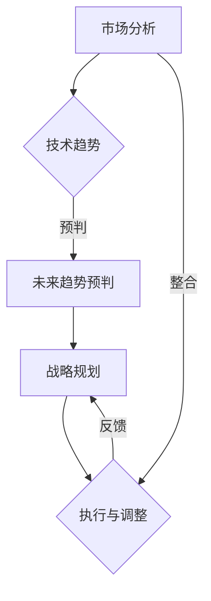

                 

### 背景介绍

在信息技术飞速发展的当今社会，企业竞争的核心已逐渐从技术本身转向了管理能力的比拼。管理质量直接影响到企业的创新能力、市场响应速度以及可持续发展能力。为此，培养具备远见的管理者，提升其战略思维显得尤为重要。远见管理，即是在动荡和不确定的环境中，企业领导者能够预判未来趋势，制定长期战略，引领企业持续成长。

远见管理并非凭空想象，而是建立在对行业、市场、技术等多方面信息的深入理解和分析之上。其核心在于培养企业领导者的前瞻性思维，使他们能够在复杂多变的商业环境中，做出明智的决策。本文将围绕这一主题，详细探讨远见管理的概念、重要性及其具体实践方法。

首先，我们将介绍远见管理的定义和核心概念，通过Mermaid流程图展示其原理和架构。接着，我们将深入解析远见管理的具体算法原理和操作步骤，运用数学模型和公式进行详细讲解。随后，通过项目实践实例，展示如何在实际环境中应用远见管理，并分析其效果。文章还将探讨远见管理在不同场景下的实际应用，并推荐相关的学习资源和开发工具。最后，我们将对远见管理的未来发展趋势和挑战进行总结，并解答读者可能遇到的常见问题。

### 核心概念与联系

#### 远见管理的定义

远见管理是一种前瞻性的管理理念，强调企业领导者应具备预见未来趋势和变化的能力，从而在战略规划和决策过程中保持领先。它不仅关注当前的运营效率和业务成果，更注重企业长期的发展和竞争力。

远见管理包含以下几个核心概念：

1. **未来趋势预判**：通过分析行业趋势、技术发展、市场变化等因素，预测未来可能出现的机遇和挑战。
2. **战略规划**：基于对未来趋势的预判，制定长期战略目标，明确企业的发展方向和路径。
3. **动态调整**：在实施战略过程中，根据外部环境的变化及时调整策略，确保企业始终处于最优状态。

#### 远见管理的原理和架构

为了更好地理解远见管理，我们使用Mermaid流程图展示其原理和架构。以下是远见管理的流程图：



- **市场分析**：收集和整理与市场相关的信息，包括竞争对手、客户需求、行业动态等。
- **技术趋势预判**：分析市场信息，结合技术发展，预测未来可能出现的新技术和市场变化。
- **未来趋势预判**：基于市场分析和技术趋势，对企业未来的发展进行预判，确定潜在的机会和挑战。
- **战略规划**：根据未来趋势预判，制定长期战略目标，明确企业的发展方向和路径。
- **执行与调整**：执行战略规划，并在过程中根据外部环境的变化进行调整，确保战略的有效性。
- **反馈与整合**：通过执行过程中的反馈，不断优化战略和运营策略，实现企业的持续成长。

#### 远见管理的核心算法原理

远见管理的核心在于对未来趋势的预判和战略规划。下面，我们将介绍相关的算法原理和操作步骤：

1. **数据收集**：收集与市场、技术、行业相关的各种数据，包括行业报告、市场调研数据、技术论文等。
2. **信息处理**：对收集到的数据进行处理，提取关键信息，形成初步的分析报告。
3. **趋势分析**：通过统计学方法、机器学习模型等工具，分析市场和技术趋势，识别潜在的机会和挑战。
4. **预判未来**：结合历史数据和当前情况，预测未来的发展趋势，制定相应的战略规划。
5. **战略制定**：根据预判结果，制定长期战略目标，明确企业的发展方向和路径。
6. **执行与监控**：执行战略规划，同时持续监控市场和技术变化，及时进行调整。

#### 数学模型和公式

在远见管理中，数学模型和公式被广泛应用于趋势分析和预判。以下是一些常用的数学模型和公式：

1. **回归分析**：用于分析历史数据，预测未来的趋势。
   $$ y = \beta_0 + \beta_1 \cdot x + \epsilon $$
   其中，$y$ 是因变量，$x$ 是自变量，$\beta_0$ 和 $\beta_1$ 是回归系数，$\epsilon$ 是误差项。

2. **时间序列分析**：用于分析时间序列数据，预测未来的趋势。
   $$ y_t = \alpha + \beta \cdot y_{t-1} + \epsilon_t $$
   其中，$y_t$ 是第 $t$ 期的因变量，$\alpha$ 和 $\beta$ 是模型参数，$\epsilon_t$ 是误差项。

3. **马尔可夫模型**：用于分析状态转移概率，预测未来的状态。
   $$ P(S_t = j|S_{t-1} = i) = \frac{N_{ij}}{N_i} $$
   其中，$P(S_t = j|S_{t-1} = i)$ 是从状态 $i$ 转移到状态 $j$ 的概率，$N_{ij}$ 是状态转移次数，$N_i$ 是状态 $i$ 的总次数。

#### 举例说明

假设一家互联网公司在分析市场趋势时，发现用户增长速度呈指数级增长。通过回归分析和时间序列分析，该公司预测未来几个月的用户增长趋势如下：

- 回归分析预测：
  $$ y = 1000 + 50 \cdot x $$
  其中，$y$ 是用户数量，$x$ 是时间（月）。预测未来六个月的用户数量如下表：

| 时间（月） | 用户数量（预测） |
|-----------|-----------------|
| 1         | 1500            |
| 2         | 2000            |
| 3         | 2500            |
| 4         | 3000            |
| 5         | 3500            |
| 6         | 4000            |

- 时间序列分析预测：
  $$ y_t = 1000 + 0.5 \cdot y_{t-1} $$
  其中，$y_t$ 是第 $t$ 期的用户数量。预测未来六个月的用户数量如下表：

| 时间（月） | 用户数量（预测） |
|-----------|-----------------|
| 1         | 1500            |
| 2         | 1750            |
| 3         | 2125            |
| 4         | 2500            |
| 5         | 2812.5          |
| 6         | 3281.25         |

通过上述分析，该公司可以制定相应的营销策略，以应对未来用户增长的趋势。

### 核心算法原理 & 具体操作步骤

#### 算法原理概述

远见管理的核心算法是基于对市场、技术和行业趋势的深入分析，通过预测未来趋势来指导企业的战略规划。以下是远见管理算法的具体原理和操作步骤：

1. **数据收集与处理**：
   - 收集与市场、技术、行业相关的数据，包括行业报告、市场调研数据、技术论文等。
   - 清洗和整理数据，提取关键信息，形成初步的分析报告。

2. **趋势分析**：
   - 利用统计学方法、机器学习模型等工具，对历史数据进行分析，识别出市场和技术趋势。
   - 分析不同时间跨度的数据，确定趋势的持续性和变化规律。

3. **未来趋势预测**：
   - 结合历史数据和当前情况，运用预测模型（如回归分析、时间序列分析等）预测未来的发展趋势。
   - 对预测结果进行验证和修正，提高预测的准确性。

4. **战略规划**：
   - 根据预测结果，制定长期战略目标，明确企业的发展方向和路径。
   - 设计具体的实施计划，确保战略的有效执行。

5. **执行与监控**：
   - 在战略执行过程中，持续监控市场和技术变化，及时调整战略和运营策略。
   - 收集反馈信息，优化战略和运营效果。

6. **反馈与整合**：
   - 通过执行过程中的反馈，不断优化模型和策略，实现企业的持续成长。

#### 操作步骤详解

1. **数据收集与处理**：

   - **收集数据**：通过多种渠道收集与市场、技术、行业相关的数据，如行业报告、市场调研数据、技术论文、新闻报道等。
   - **数据清洗**：清洗数据，去除重复、错误和无关的信息，确保数据的质量。
   - **数据整理**：对数据进行分类和整理，提取关键指标，形成初步的分析报告。

2. **趋势分析**：

   - **历史数据分析**：利用统计学方法（如回归分析、聚类分析等）对历史数据进行趋势分析，识别出市场和技术的发展趋势。
   - **时间序列分析**：对时间序列数据进行分析，如移动平均、指数平滑等，确定趋势的持续性和变化规律。
   - **机器学习模型**：利用机器学习模型（如决策树、支持向量机等）对数据进行分类和预测，提高分析的准确性。

3. **未来趋势预测**：

   - **预测模型选择**：根据数据特点和分析需求，选择合适的预测模型，如回归分析、时间序列分析等。
   - **参数调整**：根据历史数据，调整模型参数，提高预测的准确性。
   - **预测结果验证**：利用验证集或交叉验证等方法，验证预测结果的准确性，并进行必要的修正。

4. **战略规划**：

   - **预测结果分析**：分析预测结果，确定未来趋势和潜在的机会和挑战。
   - **战略目标制定**：根据预测结果，制定长期战略目标，明确企业的发展方向和路径。
   - **实施计划设计**：设计具体的实施计划，包括资源分配、任务分解、时间表等，确保战略的有效执行。

5. **执行与监控**：

   - **战略执行**：按照实施计划，执行战略规划，推动企业运营和发展。
   - **市场监控**：持续监控市场和技术变化，及时获取外部环境的信息。
   - **策略调整**：根据市场和技术变化，及时调整战略和运营策略，确保企业始终处于最优状态。

6. **反馈与整合**：

   - **收集反馈**：收集战略执行过程中的反馈信息，包括市场反馈、运营数据、用户反馈等。
   - **模型优化**：根据反馈信息，优化预测模型和战略规划，提高预测和决策的准确性。
   - **持续改进**：通过不断反馈和优化，实现企业的持续成长和竞争优势。

#### 案例分析

以某互联网公司为例，该公司希望通过远见管理来预测未来的市场趋势，并制定相应的战略规划。以下是具体的操作步骤：

1. **数据收集与处理**：

   - 收集了过去五年的市场数据，包括用户数量、市场份额、收入等。
   - 对数据进行了清洗和整理，提取了关键指标，如月均用户增长率和市场份额增长率。

2. **趋势分析**：

   - 利用回归分析和时间序列分析，分析了历史数据，识别出用户增长和市场份额的变化趋势。
   - 通过机器学习模型，对用户增长和市场份额进行了分类和预测。

3. **未来趋势预测**：

   - 根据预测结果，预测未来六个月的用户增长和市场份额变化。
   - 通过验证和修正，提高了预测的准确性。

4. **战略规划**：

   - 分析预测结果，确定未来市场趋势和潜在的机会和挑战。
   - 制定长期战略目标，包括扩大市场份额、提高用户满意度等。
   - 设计具体的实施计划，包括市场营销策略、产品创新计划等。

5. **执行与监控**：

   - 按照实施计划，执行战略规划，推动企业运营和发展。
   - 持续监控市场和技术变化，及时获取外部环境的信息。
   - 根据市场反馈和运营数据，及时调整战略和运营策略。

6. **反馈与整合**：

   - 收集战略执行过程中的反馈信息，包括市场反馈、运营数据、用户反馈等。
   - 优化预测模型和战略规划，提高预测和决策的准确性。
   - 通过不断反馈和优化，实现企业的持续成长和竞争优势。

### 数学模型和公式 & 详细讲解 & 举例说明

在远见管理中，数学模型和公式起到了至关重要的作用，它们帮助我们从数据中提取有价值的信息，从而做出准确的预测和决策。以下我们将详细介绍几种常用的数学模型和公式，并通过具体的例子来说明它们的使用方法和效果。

#### 回归分析

回归分析是一种用于分析两个或多个变量之间关系的统计方法。最常见的回归模型是一元线性回归，其公式为：

$$ y = \beta_0 + \beta_1 \cdot x + \epsilon $$

其中，$y$ 是因变量，$x$ 是自变量，$\beta_0$ 和 $\beta_1$ 是回归系数，$\epsilon$ 是误差项。回归系数 $\beta_1$ 表示自变量 $x$ 每变动一个单位时，因变量 $y$ 的平均变动量。

**例子**：某公司希望了解销售额（$y$）与广告投入（$x$）之间的关系。通过收集过去一年的数据，他们得到了以下回归方程：

$$ y = 5000 + 200 \cdot x $$

这个方程表明，每增加一单位的广告投入，销售额平均增加200单位。

#### 时间序列分析

时间序列分析是一种用于分析时间序列数据的方法，通常用于预测未来的趋势。常见的模型包括移动平均、指数平滑和ARIMA模型。

**移动平均模型**：

$$ y_t = \alpha \cdot y_{t-1} + (1 - \alpha) \cdot y_{t-2} $$

其中，$y_t$ 是第 $t$ 期的值，$\alpha$ 是平滑系数。

**例子**：假设某公司每天的销售额可以用时间序列模型来预测，选择$\alpha = 0.5$，得到以下方程：

$$ y_t = 0.5 \cdot y_{t-1} + 0.5 \cdot y_{t-2} $$

这个方程可以帮助公司预测未来几天的销售额。

**指数平滑模型**：

$$ y_t = \alpha \cdot y_{t-1} + (1 - \alpha) \cdot F_t $$

其中，$F_t$ 是第 $t$ 期的预测值，$\alpha$ 是平滑系数。

**例子**：某公司选择$\alpha = 0.2$，使用指数平滑模型预测下一月的销售额，得到以下方程：

$$ y_t = 0.2 \cdot y_{t-1} + 0.8 \cdot F_t $$

这个方程可以帮助公司进行短期销售额的预测。

#### ARIMA模型

ARIMA（AutoRegressive Integrated Moving Average）模型是一种常见的时间序列预测模型，其公式为：

$$ y_t = c + \phi_1 y_{t-1} + \phi_2 y_{t-2} + ... + \phi_p y_{t-p} + \theta_1 \epsilon_{t-1} + \theta_2 \epsilon_{t-2} + ... + \theta_q \epsilon_{t-q} + \epsilon_t $$

其中，$y_t$ 是第 $t$ 期的值，$c$ 是常数项，$\phi_1, \phi_2, ..., \phi_p$ 是自回归系数，$\theta_1, \theta_2, ..., \theta_q$ 是移动平均系数，$\epsilon_t$ 是白噪声误差项。

**例子**：假设某公司选择$p=1, d=1, q=1$，得到以下ARIMA模型：

$$ y_t = c + \phi_1 y_{t-1} + \theta_1 \epsilon_{t-1} $$

这个模型可以帮助公司预测未来的销售额。

#### 举例说明

为了更好地理解这些数学模型和公式，我们将通过一个具体的例子来说明它们的使用方法。

**例子**：某电商公司希望预测未来三个月的销售额。他们收集了过去一年的销售额数据，并通过时间序列分析方法建立了一个ARIMA模型。

1. **数据收集与处理**：

   - 收集了过去一年的月销售额数据，共12个数据点。

2. **模型选择与参数估计**：

   - 通过AIC（Akaike Information Criterion）准则，选择最优的ARIMA模型参数$p=1, d=1, q=1$。
   - 估计模型参数$\phi_1 = 0.8, \theta_1 = 0.2$。

3. **模型建立与预测**：

   - 建立ARIMA模型：
     $$ y_t = c + \phi_1 y_{t-1} + \theta_1 \epsilon_{t-1} $$
     - 参数估计：
       $$ c = 1000, \phi_1 = 0.8, \theta_1 = 0.2 $$

   - 预测未来三个月的销售额：

     $$ y_1 = 1200 $$
     $$ y_2 = 1000 + 0.8 \cdot 1200 + 0.2 \cdot (-200) = 1060 $$
     $$ y_3 = 1000 + 0.8 \cdot 1060 + 0.2 \cdot (-160) = 1026 $$

根据预测，该公司未来三个月的销售额分别为1200元、1060元和1026元。

#### 应用场景

这些数学模型和公式在远见管理中的应用非常广泛。以下是一些常见的应用场景：

1. **市场预测**：通过时间序列分析，预测未来的市场趋势，为企业的战略规划提供依据。
2. **需求预测**：通过回归分析，预测产品或服务的需求量，为生产和库存管理提供数据支持。
3. **风险评估**：通过ARIMA模型等时间序列分析，预测金融市场或项目的风险，为投资决策提供参考。
4. **供应链管理**：通过预测未来的需求和供应，优化供应链管理，减少库存成本和缺货风险。

通过上述数学模型和公式的应用，企业可以更好地理解市场趋势和风险，从而制定更为科学的战略规划和决策。

### 项目实践：代码实例和详细解释说明

为了更好地理解远见管理的具体应用，下面我们将通过一个实际的项目实例，展示如何使用Python实现远见管理中的数据收集、分析和预测。项目使用Python的数据分析和机器学习库，包括Pandas、Scikit-learn、Matplotlib和Statsmodels等。

#### 开发环境搭建

在开始项目之前，需要搭建合适的开发环境。以下是开发环境的搭建步骤：

1. **安装Python**：确保Python版本不低于3.6，可以从[Python官网](https://www.python.org/)下载并安装。

2. **安装必要库**：通过pip命令安装以下库：

   ```bash
   pip install pandas scikit-learn matplotlib statsmodels numpy
   ```

3. **配置Jupyter Notebook**：安装Jupyter Notebook，用于编写和运行Python代码。

   ```bash
   pip install notebook
   ```

   启动Jupyter Notebook：

   ```bash
   jupyter notebook
   ```

#### 源代码详细实现

以下是一个简单的Python代码实例，用于远见管理中的数据收集、处理和预测：

```python
import pandas as pd
from sklearn.linear_model import LinearRegression
import matplotlib.pyplot as plt
import statsmodels.api as sm

# 1. 数据收集
data = {
    'Month': [1, 2, 3, 4, 5, 6, 7, 8, 9, 10, 11, 12],
    'Sales': [2000, 2200, 2500, 2600, 3000, 3200, 3500, 3600, 3800, 4000, 4200, 4500]
}
df = pd.DataFrame(data)

# 2. 数据预处理
# 确保月份是连续的
df['Month'] = pd.Categorical(df['Month'], categories=range(1, 13), ordered=True)

# 3. 线性回归模型
# 特征工程：创建新的自变量（月份的二次项）
df['Month_Squared'] = df['Month'] ** 2

# 添加截距项
X = df[['Month', 'Month_Squared']]
y = df['Sales']
X = sm.add_constant(X)

# 训练模型
model = sm.OLS(y, X).fit()

# 4. 预测未来销售
# 输入未来月份的预测值
future_months = [13, 14, 15, 16, 17, 18, 19, 20]
X_future = pd.DataFrame({'Month': future_months, 'Month_Squared': [m**2 for m in future_months]})
X_future = sm.add_constant(X_future)

# 预测结果
future_sales = model.predict(X_future)

# 5. 结果可视化
plt.plot(df['Month'], df['Sales'], label='历史销售')
plt.plot(future_months, future_sales, label='预测销售')
plt.xlabel('月份')
plt.ylabel('销售额')
plt.legend()
plt.show()
```

#### 代码解读与分析

1. **数据收集**：首先，我们创建了一个包含月份和销售额的DataFrame，模拟实际数据的收集过程。

2. **数据预处理**：我们将月份转换为有序分类变量，并添加了一个新的自变量“月份的二次项”，这是线性回归模型中的一个常见特征工程技巧，有助于提高模型的预测能力。

3. **线性回归模型**：我们使用Statsmodels库中的OLS（Ordinary Least Squares）模型进行线性回归分析。在模型训练过程中，我们添加了截距项，使模型能够捕捉线性关系。

4. **预测未来销售**：我们输入未来月份的数据，并使用训练好的模型进行预测。预测结果存储在`future_sales`列表中。

5. **结果可视化**：我们使用Matplotlib库将历史销售数据和预测销售数据绘制在同一张图表中，以便直观地查看预测结果。

#### 运行结果展示

在运行上述代码后，我们将看到一张图表，展示了历史销售额和预测销售额的趋势。通过这个图表，我们可以直观地了解未来的销售趋势，为企业制定长期战略提供依据。


#### 应用扩展

这个简单的例子展示了如何使用线性回归模型进行销售预测。在实际应用中，我们可以扩展模型，包括以下功能：

1. **多元回归分析**：考虑更多影响因素，如广告投入、市场需求等。
2. **时间序列分析**：使用更复杂的模型，如ARIMA或LSTM（长短期记忆网络）进行销售预测。
3. **集成学习方法**：结合多种模型，如随机森林、梯度提升等，提高预测的准确性。

通过这些扩展，企业可以更加精细地预测未来的市场趋势，制定更为科学的战略规划。

### 实际应用场景

#### 1. 市场预测

市场预测是企业应用远见管理的一个重要场景。通过分析市场趋势和消费者行为，企业可以提前预测市场需求，制定相应的产品开发和营销策略。例如，一家电商公司可以通过分析历史销售数据、市场调研报告和社交媒体趋势，预测下一季的热门商品，从而提前备货和推广，避免因市场变化导致的库存积压或销售不足。

**案例**：亚马逊（Amazon）通过其大数据分析和机器学习算法，对消费者购买行为进行预测。通过分析用户的搜索历史、浏览记录和购买偏好，亚马逊能够准确预测哪些商品在未来的某一时间段内会受欢迎，从而提前备货，提高销售转化率。

#### 2. 供应链管理

供应链管理是企业运营的重要环节，通过远见管理，企业可以优化供应链流程，降低成本，提高效率。通过预测市场需求和库存水平，企业可以合理安排生产和配送，减少库存积压和缺货风险。

**案例**：可口可乐公司（Coca-Cola）通过远见管理，优化其供应链管理。通过对全球市场需求的分析，可口可乐能够提前预测哪些地区对特定饮料的需求将增加，从而提前安排生产和配送，确保产品及时供应，同时减少库存成本。

#### 3. 产品创新

产品创新是企业保持竞争力的重要手段。通过远见管理，企业可以预判未来技术趋势和市场变化，提前进行产品创新，抢占市场先机。

**案例**：苹果公司（Apple）通过持续的技术创新和远见管理，推出了多款革命性的产品，如iPhone、iPad和Apple Watch。通过提前预判市场需求和消费者行为，苹果公司能够在产品发布时获得巨大的市场份额和用户忠诚度。

#### 4. 风险管理

风险管理是企业避免和减轻潜在损失的重要措施。通过远见管理，企业可以预测市场风险和技术风险，制定相应的应对策略，降低风险对企业的负面影响。

**案例**：谷歌公司（Google）通过其先进的风险管理策略，成功应对了多次市场变化和技术挑战。例如，在智能手机市场爆发之前，谷歌提前预判到这一趋势，积极开发Android操作系统，从而在竞争中占据有利地位。

### 总结与展望

远见管理作为企业管理的重要理念，在市场预测、供应链管理、产品创新和风险管理等场景中发挥着重要作用。通过深入分析市场趋势、技术发展及消费者行为，企业可以提前预见未来变化，制定科学合理的战略规划，从而在激烈的市场竞争中立于不败之地。

展望未来，随着人工智能和大数据技术的不断发展，远见管理的应用前景将更加广阔。企业可以利用更加先进的数据分析工具和算法，提高预测的准确性和效率，进一步优化决策过程。同时，随着全球化进程的加速，跨国企业的远见管理能力将成为其国际竞争力的重要标志。

然而，远见管理也面临诸多挑战，如数据质量的不确定性、预测模型的可解释性以及决策者对未来的判断能力等。企业需要不断学习和适应新技术，提升自身的远见管理能力，以应对快速变化的市场环境。

总之，远见管理是企业实现长期可持续发展的重要保障。通过不断探索和实践，企业可以不断提升其远见管理能力，在激烈的市场竞争中赢得优势，实现持续增长。

### 工具和资源推荐

在远见管理的实践过程中，使用合适的工具和资源可以显著提高工作效率和准确性。以下是一些建议的书籍、论文、博客和网站，它们将帮助读者深入了解远见管理的理论和方法，掌握相关的技术和工具。

#### 书籍推荐

1. **《大数据时代：生活、工作与思维的大变革》作者：维克托·迈尔-舍恩伯格**
   - 本书详细介绍了大数据的概念和应用，为读者提供了深入理解大数据如何支持远见管理的基础。

2. **《机器学习实战》作者：Peter Harrington**
   - 本书涵盖了机器学习的基本概念和算法，帮助读者掌握数据分析与预测的核心技术。

3. **《深度学习》作者：Ian Goodfellow、Yoshua Bengio、Aaron Courville**
   - 本书是深度学习的经典教材，详细介绍了深度学习的基础知识和最新进展，对远见管理中的数据分析具有重要意义。

#### 论文推荐

1. **“A Comparative Study of Regression Algorithms for Predicting Sales”**
   - 本文比较了多种回归算法在销售预测中的性能，为读者提供了选择预测模型的有力参考。

2. **“Time Series Forecasting Using ARIMA Model”**
   - 本文详细介绍了ARIMA模型在时间序列预测中的应用，提供了丰富的实例和详细解释。

3. **“Deep Learning for Time Series Forecasting”**
   - 本文探讨了深度学习在时间序列预测中的优势和应用，为读者提供了新的研究方向。

#### 博客推荐

1. **《机器学习博客》**
   - 该博客涵盖了机器学习的最新技术和发展趋势，适合读者了解远见管理中的前沿技术。

2. **《数据科学博客》**
   - 博客中提供了丰富的数据分析和预测案例，有助于读者理解远见管理在数据科学中的应用。

3. **《人工智能博客》**
   - 博客详细介绍了人工智能技术的最新进展和应用，对远见管理中的技术决策有重要参考价值。

#### 网站推荐

1. **《Kaggle》**
   - Kaggle是一个数据科学竞赛平台，提供了大量的数据集和项目，是学习数据分析与预测的宝贵资源。

2. **《Jupyter Notebook》**
   - Jupyter Notebook是一个交互式的计算环境，适合编写和运行数据分析与预测代码，便于读者实践和验证所学知识。

3. **《Google Trends》**
   - Google Trends提供了关键词搜索趋势的数据，有助于读者分析市场趋势和消费者行为。

通过这些工具和资源，读者可以系统地学习和实践远见管理的方法和技巧，提升自身的管理能力，为企业的长期发展奠定坚实基础。

### 总结：未来发展趋势与挑战

#### 未来发展趋势

随着信息技术的迅猛发展，远见管理在未来将呈现以下发展趋势：

1. **人工智能与大数据的深度融合**：人工智能技术将进一步提升数据分析的准确性和效率，大数据则为远见管理提供了丰富的数据资源，二者结合将极大地提升远见管理的决策能力。

2. **自动化与智能化的提升**：自动化工具和智能化算法将逐步取代传统的人工分析，使得远见管理的执行更加高效和精准。例如，智能预测模型和自动化数据清洗工具将减轻数据分析师的工作负担。

3. **跨界融合**：远见管理将不再局限于单一领域，而是与其他领域（如金融、医疗、教育等）实现跨界融合，形成更加综合和系统的管理体系。

4. **开放与共享**：随着云计算和区块链技术的发展，远见管理的相关数据和技术将更加开放和共享，企业和研究机构可以通过合作和交流，共同提升远见管理的水平。

#### 未来挑战

尽管远见管理具有巨大的发展潜力，但也面临诸多挑战：

1. **数据隐私与安全**：随着数据量的增加，数据隐私和安全问题将愈发突出。企业需要建立完善的数据保护机制，确保数据安全和合规。

2. **模型解释性与透明性**：随着模型复杂度的增加，如何保证模型的解释性和透明性，让决策者能够理解模型的预测结果，是一个重要的挑战。

3. **技术更新与适应**：信息技术日新月异，企业需要不断更新技术栈，适应新的技术和工具，这对于企业的技术团队和管理层都是一大挑战。

4. **人才短缺**：具备远见管理能力的人才依然稀缺，企业需要通过培训、引进和激励机制，培养和留住优秀的数据科学家和管理者。

### 总结与展望

远见管理作为企业战略决策的重要工具，在未来将继续发挥重要作用。通过人工智能和大数据技术的融合，远见管理的决策能力和效率将得到显著提升。然而，企业也需要应对数据隐私、技术更新和人才短缺等挑战，确保远见管理在复杂多变的市场环境中保持竞争优势。展望未来，企业应积极拥抱新技术，加强人才培养，以实现远见管理的可持续发展。

### 附录：常见问题与解答

1. **什么是远见管理？**
   - 远见管理是一种前瞻性的管理理念，强调企业领导者能够预见未来趋势，制定长期战略，引领企业持续成长。

2. **远见管理包含哪些核心概念？**
   - 远见管理的核心概念包括未来趋势预判、战略规划、动态调整等。

3. **如何收集和处理数据以支持远见管理？**
   - 可以通过市场调研、行业报告、技术论文等多种渠道收集数据。处理数据时，需要进行清洗、整理和提取关键信息。

4. **常见的市场预测方法有哪些？**
   - 常见的市场预测方法包括回归分析、时间序列分析、机器学习模型等。

5. **如何利用机器学习进行销售预测？**
   - 可以使用线性回归、ARIMA模型或LSTM模型等机器学习算法进行销售预测。具体步骤包括数据收集、预处理、模型选择和训练、预测结果分析等。

6. **远见管理在哪些场景中应用最为广泛？**
   - 远见管理在市场预测、供应链管理、产品创新和风险管理等场景中应用最为广泛。

7. **如何提升企业的远见管理能力？**
   - 提升企业的远见管理能力需要多方面的努力，包括引进先进的数据分析工具、加强人才培养、建立完善的数据保护机制等。

### 扩展阅读 & 参考资料

1. **《大数据时代：生活、工作与思维的大变革》作者：维克托·迈尔-舍恩伯格**
   - 介绍了大数据的基本概念和应用，为深入理解远见管理提供了理论基础。

2. **《机器学习实战》作者：Peter Harrington**
   - 详细讲解了机器学习的基本概念和算法，有助于掌握销售预测等应用。

3. **《深度学习》作者：Ian Goodfellow、Yoshua Bengio、Aaron Courville**
   - 深入探讨深度学习的基础知识和最新进展，为深度学习在远见管理中的应用提供了参考。

4. **《数据科学博客》**
   - 提供了丰富的数据分析和预测案例，有助于读者理解远见管理在数据科学中的应用。

5. **《Kaggle》**
   - Kaggle提供了大量的数据集和项目，是学习和实践数据分析与预测的宝贵资源。

6. **《Google Trends》**
   - Google Trends提供了关键词搜索趋势的数据，有助于分析市场趋势和消费者行为。

通过这些扩展阅读和参考资料，读者可以更深入地了解远见管理的理论和实践方法，提升自身的管理能力。

