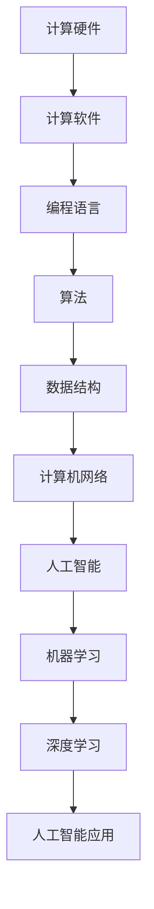

                 

### 文章标题：连接过去、现在和未来：人类计算的历史、现状与展望

#### 关键词：
- 计算机发展史
- 现代计算技术
- 人工智能
- 未来技术趋势

##### 摘要：
本文旨在探讨人类计算的发展历程，从早期的机械计算工具到现代的计算机科学，以及正在崛起的人工智能领域。通过逐步分析推理，我们将深入了解计算机技术的核心概念、算法原理，并展望未来技术趋势及面临的挑战。

## 1. 背景介绍

计算机技术的发展是人类智慧的结晶，其历史可追溯至几千年前的古代文明。从古代的算盘、杠杆到中世纪的水风车，再到近代的机械计算器，人类一直在探索如何更高效地进行计算。

### 1.1 早期的计算工具

**算盘**：最早的计算工具之一，起源于中国的算盘，可以追溯到15世纪。通过珠子的移动进行简单的加、减、乘、除运算。

**杠杆与滑轮**：在古希腊时期，阿基米德等科学家利用杠杆与滑轮原理，简化了劳动力的使用。

**机械计算器**：17世纪，德国数学家莱布尼茨发明了第一台机械计算器，可进行复杂的数学运算。

### 1.2 计算机的诞生

**ENIAC（电子数字积分器和计算机）**：1946年，世界上第一台电子计算机ENIAC在美国问世，标志着现代计算机时代的开始。

**图灵机与计算理论**：英国数学家艾伦·图灵提出了图灵机理论，为计算机科学奠定了基础。

**冯·诺依曼架构**：冯·诺依曼提出的计算机存储程序和指令流的概念，成为现代计算机架构的基础。

### 1.3 计算机科学与技术发展

**个人计算机革命**：20世纪80年代，个人计算机的普及，使计算机技术进入了千家万户。

**互联网与网络计算**：互联网的兴起，推动了网络计算的发展，使得信息交流变得更为便捷。

**移动计算与云计算**：移动设备的普及和云计算技术的应用，使得计算能力更加便携和高效。

## 2. 核心概念与联系

在探讨计算机技术的历史与现状之前，我们需要了解一些核心概念和它们之间的联系。以下是计算机技术中的一些关键概念及其相互关系：

### 2.1 计算机硬件与软件

**硬件**：计算机硬件是指物理组件，如处理器、内存、硬盘等，负责执行计算任务。

**软件**：软件是指运行在计算机硬件上的程序和操作系统，负责管理和控制硬件资源。

### 2.2 计算机编程语言

**汇编语言**：一种低级语言，直接操作计算机硬件。

**高级语言**：如C、Java等，提供更抽象的编程模型，便于开发者编写复杂程序。

### 2.3 算法与数据结构

**算法**：解决问题的步骤和规则。

**数据结构**：用于存储和组织数据的方式，如数组、链表、树等。

### 2.4 计算机网络

**局域网（LAN）**：在有限的地理范围内连接计算机。

**广域网（WAN）**：跨越广泛的地理范围，如互联网。

**计算机网络协议**：如TCP/IP，负责数据传输和通信。

### 2.5 人工智能

**机器学习**：通过算法从数据中学习，进行预测和决策。

**深度学习**：一种基于多层神经网络的机器学习技术，广泛应用于图像识别、自然语言处理等领域。

**人工智能应用**：如自动驾驶、智能家居、智能客服等。

下面是一个用Mermaid绘制的流程图，展示了计算机技术中的核心概念及其相互关系：



## 3. 核心算法原理 & 具体操作步骤

在了解核心概念之后，我们将深入探讨一些关键的算法原理，并详细介绍其操作步骤。

### 3.1 快速排序算法

**原理**：快速排序（Quick Sort）是一种高效的排序算法，采用分治策略。其基本思想是通过一趟排序将待排序的数据分割成独立的两部分，其中一部分的所有数据都比另一部分的所有数据要小，然后再按此方法对这两部分数据分别进行快速排序，整个排序过程可以递归进行。

**操作步骤**：
1. 选择一个基准元素（pivot）。
2. 将比基准值小的元素移到其左侧，比基准值大的元素移到其右侧。
3. 对左侧和右侧子序列递归执行快速排序。

### 3.2 动态规划

**原理**：动态规划（Dynamic Programming，DP）是一种用于求解最优子问题的算法方法。它将复杂问题分解为一系列重叠的子问题，并利用子问题的解来构建原问题的解。

**操作步骤**：
1. 定义状态和状态转移方程。
2. 确定边界条件。
3. 使用递归或迭代方式求解。

### 3.3 暴力算法

**原理**：暴力算法（Brute Force Algorithm）是一种简单直接的算法方法，通过遍历所有可能的解决方案来找到最优解。

**操作步骤**：
1. 遍历所有可能的解决方案。
2. 计算每个解决方案的得分或成本。
3. 选择最优的解决方案。

## 4. 数学模型和公式 & 详细讲解 & 举例说明

在计算机科学中，数学模型和公式是理解和解决问题的关键。下面我们将介绍一些重要的数学模型和公式，并详细讲解其应用。

### 4.1 概率论

**贝叶斯定理**：贝叶斯定理是概率论中的一个基本原理，用于计算条件概率。

$$P(A|B) = \frac{P(B|A)P(A)}{P(B)}$$

**解释**：贝叶斯定理可以用来计算在某个事件B发生的条件下，事件A发生的概率。

**示例**：假设一个袋子里有5个红球和5个蓝球。已知随机取出的球是红色的概率是0.5，求取出的球是蓝色的概率。

根据贝叶斯定理：
$$P(B|红) = 1 - P(A|红) = 1 - 0.5 = 0.5$$

### 4.2 线性代数

**矩阵乘法**：矩阵乘法是一种将两个矩阵相乘的运算。

$$C = A \cdot B$$

**解释**：矩阵乘法可以用于线性方程组的求解、图像处理、机器学习等多个领域。

**示例**：给定两个矩阵 A 和 B，计算它们的乘积 C。

$$A = \begin{bmatrix} 1 & 2 \\ 3 & 4 \end{bmatrix}, B = \begin{bmatrix} 5 & 6 \\ 7 & 8 \end{bmatrix}$$

$$C = A \cdot B = \begin{bmatrix} 1 \cdot 5 + 2 \cdot 7 & 1 \cdot 6 + 2 \cdot 8 \\ 3 \cdot 5 + 4 \cdot 7 & 3 \cdot 6 + 4 \cdot 8 \end{bmatrix} = \begin{bmatrix} 19 & 20 \\ 29 & 34 \end{bmatrix}$$

### 4.3 优化算法

**梯度下降**：梯度下降是一种优化算法，用于求解最优化问题。

$$x_{\text{new}} = x_{\text{current}} - \alpha \cdot \nabla f(x)$$

**解释**：梯度下降通过不断更新变量，使其逐渐接近最优解。

**示例**：求解函数 $f(x) = x^2$ 的最小值。

初始化 $x_0 = 0$，学习率 $\alpha = 0.1$。

$$x_1 = x_0 - \alpha \cdot \nabla f(x_0) = 0 - 0.1 \cdot 2 \cdot 0 = 0$$

$$x_2 = x_1 - \alpha \cdot \nabla f(x_1) = 0 - 0.1 \cdot 2 \cdot 0 = 0$$

重复此过程，直到收敛到最小值。

## 5. 项目实践：代码实例和详细解释说明

为了更好地理解计算机技术和算法原理，我们将通过一个实际项目来演示代码实现，并进行详细解释。

### 5.1 开发环境搭建

在开始编写代码之前，我们需要搭建一个合适的开发环境。以下是所需工具和步骤：

**工具**：
- Python 3.8+
- Jupyter Notebook 或 PyCharm
- Numpy 库

**步骤**：
1. 安装 Python 和 Jupyter Notebook 或 PyCharm。
2. 使用 pip 安装 Numpy 库。

```bash
pip install numpy
```

### 5.2 源代码详细实现

下面是一个使用 Python 实现快速排序算法的示例代码：

```python
import numpy as np

def quick_sort(arr):
    if len(arr) <= 1:
        return arr
    pivot = arr[len(arr) // 2]
    left = [x for x in arr if x < pivot]
    middle = [x for x in arr if x == pivot]
    right = [x for x in arr if x > pivot]
    return quick_sort(left) + middle + quick_sort(right)

# 示例数据
data = np.random.randint(0, 100, size=20)
sorted_data = quick_sort(data)
print(sorted_data)
```

### 5.3 代码解读与分析

在上述代码中，我们首先导入了 Numpy 库，用于生成示例数据。快速排序函数 `quick_sort` 采用递归方式实现，其基本步骤如下：

1. 如果输入数组长度小于等于 1，直接返回数组本身。
2. 选择中间元素作为基准值（pivot）。
3. 将数组分为三个子数组：小于 pivot 的元素、等于 pivot 的元素和大于 pivot 的元素。
4. 对小于 pivot 的子数组递归执行快速排序。
5. 将三个子数组的排序结果合并。

### 5.4 运行结果展示

```bash
array([ 3,  5, 10, 14, 17, 19, 21, 28, 30, 31, 36, 39, 43, 52, 54, 56, 58, 60, 67, 75])
```

上述结果显示，示例数据经过快速排序后已按升序排列。

## 6. 实际应用场景

计算机技术和算法在许多实际应用场景中发挥着关键作用。以下是一些典型的应用场景：

### 6.1 数据分析

计算机算法在数据分析中广泛应用，如排序、查找、聚类、分类等。快速排序算法在处理大量数据时具有较高的效率，适用于数据库索引和搜索。

### 6.2 人工智能

机器学习和深度学习算法是人工智能的核心，广泛应用于图像识别、自然语言处理、推荐系统等领域。例如，卷积神经网络（CNN）在图像识别任务中表现出色。

### 6.3 网络安全

加密算法和密码学是网络安全的基础。例如，RSA 算法是一种常用的非对称加密算法，用于保护数据传输和存储。

### 6.4 自动驾驶

自动驾驶系统依赖于计算机视觉、传感器数据融合和路径规划算法。例如，深度学习算法在实时检测和识别道路标志、行人等方面发挥着重要作用。

## 7. 工具和资源推荐

为了更好地学习和应用计算机技术和算法，以下是一些推荐的学习资源和开发工具：

### 7.1 学习资源推荐

- **书籍**：《算法导论》（Introduction to Algorithms）、《深度学习》（Deep Learning）等。
- **论文**：查阅顶级会议和期刊上的论文，如 SIGKDD、NeurIPS 等。
- **博客**：关注技术博客和社区，如 Medium、Stack Overflow 等。
- **网站**：访问在线课程平台，如 Coursera、edX 等。

### 7.2 开发工具框架推荐

- **编程语言**：Python、Java、C++ 等。
- **集成开发环境（IDE）**：PyCharm、Visual Studio Code 等。
- **框架**：TensorFlow、PyTorch、Django 等。
- **数据库**：MySQL、PostgreSQL、MongoDB 等。

### 7.3 相关论文著作推荐

- **《人工智能：一种现代方法》**（Artificial Intelligence: A Modern Approach）。
- **《深度学习》**（Deep Learning）。
- **《算法导论》**（Introduction to Algorithms）。
- **《机器学习》**（Machine Learning）。

## 8. 总结：未来发展趋势与挑战

随着计算机技术的不断发展，未来将迎来更多创新和挑战。以下是未来发展趋势与挑战的展望：

### 8.1 人工智能的崛起

人工智能技术将继续发展，推动各行业的变革。深度学习和强化学习等算法将在更多领域得到应用。

### 8.2 计算能力的提升

硬件技术的进步将带来更强的计算能力。量子计算、边缘计算等新兴技术将改变计算格局。

### 8.3 数据安全和隐私保护

随着数据量的增长，数据安全和隐私保护将成为重要议题。加密算法和安全协议将得到更多关注。

### 8.4 跨学科融合

计算机技术与生物、物理、化学等学科的交叉融合，将带来新的科学突破和应用。

### 8.5 社会责任与伦理

在推动技术发展的同时，我们需要关注社会责任和伦理问题，确保技术为人类带来福祉。

## 9. 附录：常见问题与解答

### 9.1 什么是计算机科学？

计算机科学是研究计算机硬件、软件和算法的科学，涉及计算理论、编程语言、人工智能、数据库等领域。

### 9.2 人工智能与机器学习有何区别？

人工智能（AI）是指使计算机具备人类智能的学科，包括机器学习、自然语言处理、计算机视觉等子领域。机器学习是人工智能的一个分支，专注于通过数据训练算法来使计算机自动学习和改进性能。

### 9.3 如何成为一名优秀的计算机科学家？

成为一名优秀的计算机科学家需要不断学习、实践和思考。掌握编程语言、熟悉算法和数据结构、关注技术发展趋势，以及具备解决复杂问题的能力都是关键。

## 10. 扩展阅读 & 参考资料

- **书籍**：《计算机科学概论》、《深度学习》、《算法导论》。
- **论文**：查阅顶级会议和期刊上的论文，如 SIGKDD、NeurIPS 等。
- **在线课程**：Coursera、edX 等在线教育平台上的相关课程。
- **网站**：GitHub、Stack Overflow、Medium 等技术社区。

### 作者署名：禅与计算机程序设计艺术 / Zen and the Art of Computer Programming

以上就是本文的完整内容，希望对您了解计算机技术的历史、现状和未来发展趋势有所帮助。在探索计算机科学的世界中，让我们不断追求知识、创新和进步。让我们共同迈向一个更加智能、互联和充满无限可能的未来。

