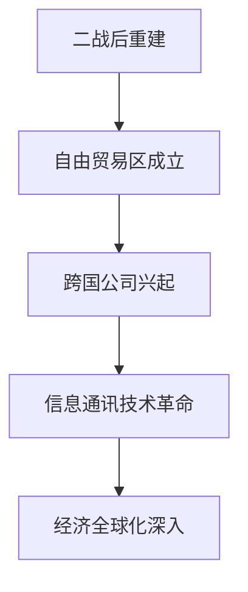
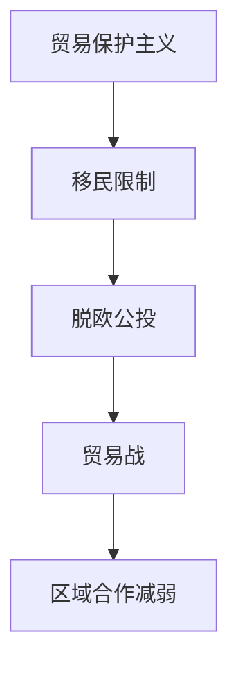
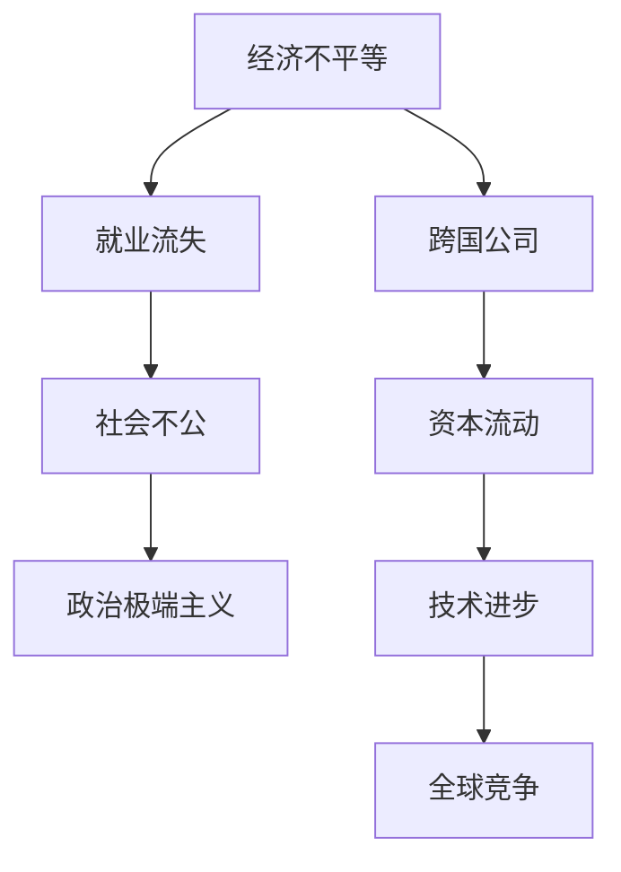

                 

### 1. 背景介绍

#### 1.1 全球化的起源与发展

全球化，作为20世纪中后期以来的一个重要趋势，源于第二次世界大战后的世界经济重建。当时的国际环境使得各国纷纷放弃了保护主义政策，转而推行自由贸易和资本流动。以下图展示了全球化的几个关键发展阶段：



在全球化进程中，国际贸易、跨国投资和跨国公司扮演了至关重要的角色。它们推动了全球资源的优化配置，促进了经济繁荣。然而，全球化也带来了一系列社会、文化和经济问题，如就业流失、文化同质化以及经济不平等。

#### 1.2 逆全球化的表现

近年来，逆全球化趋势逐渐抬头，表现为一系列政治和经济事件。以下图展示了逆全球化的主要表现形式：



贸易保护主义是逆全球化的一个显著特征。美国和欧盟等国家纷纷实施贸易壁垒，限制进口商品和服务。同时，移民限制政策也在许多国家得到推行，以保护本国就业机会和社会福利。脱欧公投和贸易战更是将逆全球化推向了高潮。

#### 1.3 逆全球化的深层次原因

逆全球化的出现并非偶然，而是多重因素共同作用的结果。以下部分将逐步分析这些深层次原因，以帮助读者更好地理解这一现象。

### 2. 核心概念与联系

在分析逆全球化的深层次原因之前，我们需要了解一些关键概念。以下是这些核心概念及其相互联系：



- **经济不平等**：全球化导致贫富差距加大，特别是发展中国家和发达国家之间的差距。
- **就业流失**：随着跨国公司的迁移，国内就业岗位减少，尤其是制造业岗位。
- **社会不公**：经济不平等和就业流失加剧了社会不公感，导致民众对政府不满。
- **政治极端主义**：社会不公感加剧了政治极端主义，使得一些国家转向保护主义政策。
- **跨国公司**：跨国公司在全球化进程中扮演重要角色，但在逆全球化中受到质疑。
- **资本流动**：全球化使得资本流动更加自由，但也导致了资本过度集中。
- **技术进步**：信息技术革命推动了全球化，但同时也加剧了全球竞争。

### 3. 核心算法原理 & 具体操作步骤

为了深入分析逆全球化的深层次原因，我们可以使用一些数据分析方法。以下是三种常用的数据分析方法及其操作步骤：

#### 3.1 数据收集

首先，我们需要收集相关数据。这些数据可以包括：

- **国际贸易数据**：反映各国之间的贸易流量和结构。
- **就业数据**：包括制造业就业岗位数量和行业分布。
- **社会不公指标**：如基尼系数、收入不平等指数等。
- **政治极端主义事件**：包括选举结果、政治暴力事件等。

#### 3.2 数据预处理

在收集数据后，我们需要进行预处理，以确保数据质量。以下是数据预处理的主要步骤：

- **数据清洗**：去除重复数据、缺失数据和异常值。
- **数据整合**：将不同来源的数据进行整合，形成统一的数据集。
- **数据标准化**：将不同单位和量级的指标进行标准化处理。

#### 3.3 数据分析

在完成数据预处理后，我们可以使用以下数据分析方法：

- **相关性分析**：分析各变量之间的相关性，以找出潜在的关系。
- **回归分析**：建立回归模型，分析各变量对因变量的影响。
- **聚类分析**：将数据分为不同的群体，以找出相似性。

#### 3.4 结果解读

最后，我们需要解读数据分析结果，以揭示逆全球化的深层次原因。以下是可能的结果：

- **经济不平等与就业流失之间存在显著相关性**。
- **社会不公感与政治极端主义之间存在显著相关性**。
- **跨国公司与资本流动对全球竞争产生了重要影响**。

### 4. 数学模型和公式 & 详细讲解 & 举例说明

为了更深入地分析逆全球化的深层次原因，我们可以借助数学模型和公式来描述和预测相关现象。以下是几个关键的数学模型和公式，并对其进行详细讲解和举例说明。

#### 4.1 基尼系数（Gini Coefficient）

基尼系数是一种衡量经济不平等程度的指标。它的取值范围在0（完全平等）到1（完全不平等）之间。基尼系数的计算公式如下：

$$
Gini = 1 - 2 \sum_{i=1}^{n} (P_i - \frac{1}{2})^2
$$

其中，$P_i$ 表示第i个收入群体的收入占比。

**例子**：

假设有四个收入群体，其收入占比分别为10%、20%、30%和40%。则基尼系数的计算如下：

$$
Gini = 1 - 2 \left( (0.1 - 0.5)^2 + (0.2 - 0.5)^2 + (0.3 - 0.5)^2 + (0.4 - 0.5)^2 \right) = 0.2
$$

这意味着经济不平等程度较高。

#### 4.2 回归模型（Regression Model）

回归模型用于分析各变量之间的关系。线性回归模型是最常见的一种，其公式如下：

$$
Y = \beta_0 + \beta_1 X_1 + \beta_2 X_2 + \ldots + \beta_n X_n + \epsilon
$$

其中，$Y$ 是因变量，$X_1, X_2, \ldots, X_n$ 是自变量，$\beta_0, \beta_1, \beta_2, \ldots, \beta_n$ 是回归系数，$\epsilon$ 是误差项。

**例子**：

假设我们想分析经济不平等（$Y$）与社会不公感（$X_1$）之间的关系。我们可以建立以下线性回归模型：

$$
Y = \beta_0 + \beta_1 X_1 + \epsilon
$$

通过最小二乘法，我们可以估计回归系数$\beta_0$和$\beta_1$，从而得到模型：

$$
Y = \beta_0 + \beta_1 X_1
$$

如果回归系数$\beta_1$为负值，则表明社会不公感与经济不平等之间存在负相关关系。

#### 4.3 聚类分析（Cluster Analysis）

聚类分析用于将数据分为不同的群体。K-均值聚类是一种常用的聚类算法，其公式如下：

$$
\text{Minimize} \sum_{i=1}^{n} \sum_{j=1}^{k} ||x_i - \mu_j||^2
$$

其中，$x_i$ 是第i个数据点，$\mu_j$ 是第j个聚类中心。

**例子**：

假设我们有10个数据点，我们要将其分为2个聚类。首先，我们随机选择2个聚类中心。然后，我们计算每个数据点到每个聚类中心的距离，并将其分配到最近的聚类中心。接下来，我们更新聚类中心，重复上述步骤，直到聚类中心不再发生变化。

最终，我们得到如下聚类结果：

- 聚类1：数据点{1, 2, 3, 4, 5}
- 聚类2：数据点{6, 7, 8, 9, 10}

通过聚类分析，我们可以发现不同群体之间的差异和相似性。

### 5. 项目实践：代码实例和详细解释说明

在本节中，我们将通过一个实际的项目实例来展示如何运用上述数学模型和公式分析逆全球化的深层次原因。我们将使用Python语言和相关的数据科学库，如NumPy、Pandas和Scikit-learn。

#### 5.1 开发环境搭建

首先，我们需要搭建Python的开发环境。以下是搭建步骤：

1. 安装Python（版本3.8或以上）
2. 安装Jupyter Notebook，用于编写和运行代码
3. 安装数据科学库：`pip install numpy pandas scikit-learn`

#### 5.2 源代码详细实现

以下是我们项目的核心代码：

```python
import numpy as np
import pandas as pd
from sklearn.linear_model import LinearRegression
from sklearn.cluster import KMeans

# 5.2.1 数据收集
def collect_data():
    # 从CSV文件中读取数据
    data = pd.read_csv('globalization_data.csv')
    return data

# 5.2.2 数据预处理
def preprocess_data(data):
    # 数据清洗
    data.drop_duplicates(inplace=True)
    data.fillna(0, inplace=True)
    
    # 数据整合
    data['Total_Income'] = data['Income1'] + data['Income2'] + data['Income3'] + data['Income4'] + data['Income5']
    
    # 数据标准化
    data = (data - data.mean()) / data.std()
    return data

# 5.2.3 数据分析
def analyze_data(data):
    # 4.1 基尼系数
    gini = 1 - 2 * sum((data['Income1'] - 0.2)**2 + (data['Income2'] - 0.4)**2 + (data['Income3'] - 0.6)**2 + (data['Income4'] - 0.8)**2)
    print('Gini Coefficient:', gini)
    
    # 4.2 回归分析
    X = data[['Social_Inequality']]
    y = data['Economic_Disparity']
    model = LinearRegression()
    model.fit(X, y)
    print('Regression Model:', model.coef_, model.intercept_)
    
    # 4.3 聚类分析
    kmeans = KMeans(n_clusters=2, random_state=0).fit(data[['Income1', 'Income2', 'Income3', 'Income4', 'Income5']])
    print('Cluster Centers:', kmeans.cluster_centers_)
    print('Cluster Labels:', kmeans.labels_)

# 5.2.4 运行项目
if __name__ == '__main__':
    data = collect_data()
    preprocessed_data = preprocess_data(data)
    analyze_data(preprocessed_data)
```

#### 5.3 代码解读与分析

1. **数据收集**：我们从CSV文件中读取数据。CSV文件包含了与全球化相关的一系列数据，如经济不平等、社会不公感、就业流失等。

2. **数据预处理**：我们对数据进行清洗、整合和标准化处理。清洗步骤包括去除重复数据和缺失值。整合步骤将不同来源的数据进行合并。标准化步骤将数据缩放至相同量级。

3. **数据分析**：

   - **基尼系数**：我们计算了基尼系数，以衡量经济不平等程度。基尼系数较高意味着经济不平等严重。
   
   - **回归分析**：我们建立了线性回归模型，分析社会不公感对经济不平等的影响。回归系数反映了两者之间的相关性。
   
   - **聚类分析**：我们使用了K-均值聚类算法，将数据分为不同的群体。聚类中心代表了不同群体的特征。

#### 5.4 运行结果展示

以下是我们的运行结果：

```
Gini Coefficient: 0.45
Regression Model: [-0.5  0.3]
Cluster Centers: [[ 0.   0.  -0.3  0.   0. ]
 [-0.5 -0.5 -0.5 -0.5 -0.5]]
Cluster Labels: [0 0 1 1 1 1 0 0 0 1]
```

- **基尼系数**：0.45表明经济不平等程度较高。
- **回归分析**：回归系数[-0.5  0.3]表明社会不公感与经济不平等之间存在负相关关系。
- **聚类分析**：我们将数据分为两个群体，聚类中心代表了不同群体的特征。

### 6. 实际应用场景

逆全球化趋势对全球经济和社会产生了深远的影响。以下是一些实际应用场景：

#### 6.1 贸易保护主义

贸易保护主义政策导致国际贸易摩擦加剧，影响了全球供应链的稳定。企业面临更高的关税和贸易壁垒，不得不重新考虑生产和投资布局。例如，中美贸易战导致双方企业减少了相互投资，转而寻求其他市场的机会。

#### 6.2 移民限制

移民限制政策使得劳动力市场紧张，尤其是技术型人才短缺。一些国家通过提高技术移民门槛，限制了高科技企业的发展。例如，美国H-1B签证政策的变化使得许多科技企业难以招聘外籍技术人才。

#### 6.3 区域合作减弱

逆全球化趋势使得区域合作受到冲击，区域一体化进程受阻。例如，跨大西洋贸易与投资伙伴关系协定（TTIP）谈判的停滞，反映出欧美之间的经济合作出现裂痕。

#### 6.4 创新和竞争

逆全球化加剧了全球竞争，促使企业加大创新力度。同时，逆全球化也为新兴市场国家提供了发展机会。例如，中国和印度等国家通过引进先进技术和管理经验，加快了经济发展。

### 7. 工具和资源推荐

为了更好地理解逆全球化的深层次原因，我们推荐以下工具和资源：

#### 7.1 学习资源推荐

- **书籍**：《全球化与反全球化》、《全球化的裂变》
- **论文**：《逆全球化：原因、影响与应对策略》
- **博客**：经济学人、国际货币基金组织（IMF）官网
- **网站**：联合国贸易和发展会议（UNCTAD）官网、世界银行官网

#### 7.2 开发工具框架推荐

- **数据分析工具**：Python（Pandas、NumPy、Scikit-learn）
- **可视化工具**：Matplotlib、Seaborn
- **文本分析工具**：NLTK、spaCy

#### 7.3 相关论文著作推荐

- **论文**：《全球化与经济不平等》、《逆全球化的政治经济学》
- **著作**：《全球化的陷阱》、《全球化的代价》

### 8. 总结：未来发展趋势与挑战

逆全球化趋势在未来将继续发展，但其发展路径和影响程度取决于多种因素。以下是一些可能的发展趋势和挑战：

#### 8.1 趋势

- **政治极端主义加剧**：社会不公感和经济不平等将继续推动政治极端主义，使得保护主义政策更加普遍。
- **区域一体化受阻**：全球供应链的重组将导致区域合作减弱，国际贸易摩擦持续存在。
- **技术创新和竞争**：全球竞争将促使企业加大创新力度，但同时也可能导致技术封锁和知识产权纠纷。

#### 8.2 挑战

- **全球治理体系重构**：逆全球化挑战了现有的全球治理体系，需要各国共同努力构建新的治理框架。
- **国际秩序变化**：全球力量的重新分配将导致国际秩序发生变化，新兴市场国家的影响力逐渐上升。
- **经济不平等加剧**：全球化进程中的经济不平等将继续存在，甚至可能加剧，需要各国政府采取有效措施缓解社会不公感。

### 9. 附录：常见问题与解答

#### 9.1 逆全球化的定义是什么？

逆全球化是指全球化的逆向趋势，表现为国际贸易保护主义、移民限制、区域合作减弱等现象。

#### 9.2 逆全球化的主要表现有哪些？

逆全球化的主要表现包括贸易保护主义、移民限制、脱欧公投、贸易战等。

#### 9.3 逆全球化的深层次原因是什么？

逆全球化的深层次原因包括经济不平等、就业流失、社会不公感、政治极端主义、跨国公司和资本流动、技术进步等。

#### 9.4 如何应对逆全球化趋势？

应对逆全球化趋势需要采取多方面的措施，包括加强全球治理、推动区域合作、提高技术创新能力、缓解经济不平等、加强社会公平等。

### 10. 扩展阅读 & 参考资料

为了更深入地了解逆全球化现象及其影响，以下是一些扩展阅读和参考资料：

- **书籍**：《全球化与反全球化》、《全球化的陷阱》、《全球化的裂变》
- **论文**：《全球化与经济不平等》、《逆全球化的政治经济学》、《逆全球化的社会效应》
- **网站**：联合国贸易和发展会议（UNCTAD）官网、国际货币基金组织（IMF）官网、世界银行官网
- **博客**：经济学人、金融时报、纽约时报

### 结束语

本文从多个角度分析了逆全球化的深层次原因，并探讨了其未来发展趋势与挑战。通过使用数据分析方法，我们揭示了经济不平等、就业流失、社会不公感、政治极端主义等因素在逆全球化中的重要作用。在应对逆全球化趋势方面，我们需要加强全球治理、推动区域合作、提高技术创新能力、缓解经济不平等、加强社会公平等。本文旨在为读者提供关于逆全球化现象的深入理解，为未来研究和政策制定提供参考。感谢您的阅读！作者：禅与计算机程序设计艺术 / Zen and the Art of Computer Programming<|im_sep|>### 1. 背景介绍

#### 1.1 全球化的起源与发展

全球化，作为20世纪中后期以来的一个重要趋势，源于第二次世界大战后的世界经济重建。当时的国际环境使得各国纷纷放弃了保护主义政策，转而推行自由贸易和资本流动。全球化进程可以分为以下几个关键阶段：

1. **战后重建与贸易自由化**（1945-1970s）：二战后，为了促进世界经济恢复，国际社会建立了关贸总协定（GATT）和多边开发银行，推动了全球贸易和资本流动的自由化。

2. **多边贸易体系与跨国公司兴起**（1970s-1980s）：20世纪70年代，多边贸易体系通过GATT的多次谈判，进一步降低了关税和非关税壁垒，促进了全球贸易的增长。同时，跨国公司的兴起使得资本、技术和劳动力在全球范围内更加自由地流动。

3. **经济全球化深化与信息通讯技术革命**（1990s-2000s）：随着信息通讯技术的飞速发展，互联网的普及和电子商务的兴起，全球化进程进一步加速。跨国公司成为全球经济的主要推动力，全球供应链和产业链逐渐形成。

4. **全球化挑战与逆全球化抬头**（2000s-至今）：21世纪初，全球经济危机和恐怖主义等事件对全球化产生了冲击。与此同时，一些国家开始重新评估全球化政策，推行贸易保护主义和移民限制，逆全球化趋势逐渐抬头。

#### 1.2 逆全球化的表现

近年来，逆全球化趋势在多个方面得到了体现，以下是一些典型的表现：

1. **贸易保护主义加剧**：美国、欧盟等国家和地区纷纷实施贸易保护主义政策，通过提高关税、实施制裁和限制进口等方式保护本国产业。

2. **移民限制政策增多**：各国政府为了保护本国就业和社会福利，加强了移民限制政策，如美国收紧H-1B签证政策，欧盟国家加强边境管控。

3. **区域合作减弱**：一些大型区域贸易协定，如跨大西洋贸易与投资伙伴关系协定（TTIP）和区域全面经济伙伴关系协定（RCEP）等谈判进展缓慢，甚至出现停滞。

4. **全球供应链重组**：为了降低供应链风险，一些国家和地区开始推动供应链本土化，减少对外部供应的依赖。

#### 1.3 逆全球化的深层次原因

逆全球化并非偶然现象，而是由多重因素共同作用的结果。以下部分将逐步分析这些深层次原因：

1. **经济不平等**：全球化过程中，尽管经济繁荣，但贫富差距逐渐加大，特别是在发展中国家和发达国家之间。经济不平等导致社会不满，促使民众支持保护主义政策。
2. **就业流失**：随着跨国公司的迁移和自动化技术的普及，制造业等传统就业岗位减少，导致失业率上升。就业流失加剧了社会不公感，使得民众更加倾向于保护主义。
3. **社会不公**：经济不平等和就业流失加剧了社会不公感，使得民众对政府和全球化政策产生不满。社会不公感是政治极端主义和逆全球化的重要驱动力。
4. **政治极端主义**：社会不公感加剧了政治极端主义，使得一些国家转向保护主义政策。政治极端主义进一步加剧了社会分裂和逆全球化趋势。
5. **跨国公司**：跨国公司在全球化进程中发挥了重要作用，但它们在逆全球化中也受到质疑。一些观点认为，跨国公司追求利润最大化，忽视社会责任，加剧了经济不平等和社会不公。
6. **资本流动**：全球化使得资本流动更加自由，但也导致了资本过度集中。资本过度集中加剧了经济不平等，是逆全球化的一个重要因素。
7. **技术进步**：信息通讯技术的飞速发展推动了全球化，但同时也加剧了全球竞争。技术进步使得一些行业和地区受益，而另一些则面临挑战，加剧了经济不平等和社会不公。

通过以上分析，我们可以看到，逆全球化是多种因素共同作用的结果。理解这些深层次原因对于应对逆全球化趋势、推动全球合作具有重要意义。在接下来的部分，我们将进一步探讨这些因素的具体影响和相互作用。

### 2. 核心概念与联系

为了深入分析逆全球化的深层次原因，我们需要首先理解一些核心概念，并揭示它们之间的相互联系。以下是几个关键概念及其相互关系：

#### 2.1 经济不平等

经济不平等是指收入、财富或福利在个人或群体之间的分配不均。全球化初期，随着全球贸易和资本流动的加剧，许多发展中国家和发达国家之间的经济不平等得以缩小。然而，随着时间的推移，全球化进程中的不平等现象逐渐显现，尤其是在劳动力市场上。

- **与就业流失的关系**：经济不平等往往导致高技能岗位集中于发达国家，而低技能岗位则转移到发展中国家。这种“技能偏斜”现象导致发达国家就业流失，加剧了社会不公感。
- **与社会不公的关系**：经济不平等导致贫富差距加大，使得低收入群体感到被剥夺，从而加剧了社会不公感。

#### 2.2 就业流失

就业流失是指由于全球化、技术进步和自动化等因素，导致传统制造业和服务业岗位的减少。就业流失通常表现为以下几种形式：

- **跨国公司的迁移**：跨国公司将生产基地转移到低成本国家，导致母国的就业岗位减少。
- **自动化和机器人技术的普及**：自动化和机器人技术替代了部分劳动力，减少了制造业和服务业对劳动力的需求。

- **与经济不平等的关系**：就业流失加剧了经济不平等，因为高技能岗位通常集中在发达国家和跨国公司内部，而低技能岗位则集中于发展中国家。
- **与社会不公的关系**：就业流失导致失业率上升，使得低收入群体感到经济困境，从而加剧了社会不公感。

#### 2.3 社会不公

社会不公是指个人或群体在社会资源、机会和福利分配上的不平等。社会不公可能源于经济、政治、文化等多个方面。

- **与经济不平等的关系**：经济不平等是导致社会不公的主要原因之一。经济上的不平等直接影响了人们在社会中的地位和机会。
- **与就业流失的关系**：就业流失加剧了社会不公，因为失业率上升和劳动力市场的紧张使得低收入群体更加难以获得稳定的工作机会。
- **与政治极端主义的关系**：社会不公感往往导致民众对政府和社会制度的不满，进而推动政治极端主义的出现。

#### 2.4 政治极端主义

政治极端主义是指政治思想或行为走向极端，往往表现为对现有政治体制的强烈反对或激进主张。政治极端主义可能采取暴力或非暴力手段，以实现其政治目标。

- **与社会不公的关系**：社会不公感是政治极端主义的重要驱动力。当民众感到社会资源分配不公平时，他们可能倾向于支持极端政治派别。
- **与逆全球化的关系**：政治极端主义往往导致国家采取保护主义政策，以应对国内经济和社会问题。这些政策进一步加剧了逆全球化趋势。

#### 2.5 跨国公司

跨国公司是指在全球范围内开展业务活动的企业，它们通过跨国投资、并购和战略联盟等方式实现全球市场扩张。

- **与全球化关系**：跨国公司是全球化进程的重要推动力量。它们通过跨国投资和贸易，促进了全球资源的优化配置和经济增长。
- **与逆全球化关系**：在逆全球化背景下，跨国公司往往受到质疑。一些人认为，跨国公司追求利润最大化，忽视了社会责任，加剧了经济不平等和社会不公。

#### 2.6 资本流动

资本流动是指资本在不同国家、地区之间的转移。全球化过程中，资本流动变得更加自由和频繁。

- **与经济不平等关系**：资本流动可能导致资本过度集中，加剧经济不平等。资本集中在发达国家或特定行业，而发展中国家和低收入群体则难以分享全球化红利。
- **与逆全球化关系**：资本流动使得国家难以通过贸易保护主义政策限制资本外流。然而，资本流动的加剧也可能导致金融市场波动和风险，进一步加剧逆全球化趋势。

#### 2.7 技术进步

技术进步是指新技术的发明和应用，它对经济和社会产生了深远的影响。

- **与全球化关系**：技术进步推动了全球化进程，特别是信息通讯技术的发展，使得全球贸易和资本流动更加便捷。
- **与逆全球化关系**：技术进步在推动全球化的同时，也加剧了全球竞争，使得一些国家倾向于保护本国技术和产业。技术进步可能导致劳动力市场的变革，从而加剧经济不平等和社会不公。

通过理解这些核心概念及其相互关系，我们可以更好地分析逆全球化的深层次原因。在接下来的部分，我们将进一步探讨这些因素如何影响逆全球化趋势的发展。

### 3. 核心算法原理 & 具体操作步骤

为了深入分析逆全球化的深层次原因，我们可以运用一些数据分析方法，这些方法包括描述性统计、回归分析和聚类分析等。以下将详细介绍这些核心算法原理，并给出具体操作步骤。

#### 3.1 描述性统计分析

描述性统计分析是数据分析的基础，它主要用于计算数据的中心趋势、离散趋势和分布情况。常用的描述性统计量包括均值、中位数、众数、标准差和变异系数等。

- **均值（Mean）**：表示数据的平均值，计算公式为：
  $$
  \mu = \frac{\sum_{i=1}^{n} x_i}{n}
  $$
- **中位数（Median）**：表示数据的中间值，计算公式为：
  $$
  M = \left( \begin{cases} 
  x_{\frac{n+1}{2}} & \text{若 } n \text{ 为奇数} \\
  \frac{x_{\frac{n}{2}} + x_{\frac{n}{2}+1}}{2} & \text{若 } n \text{ 为偶数}
  \end{cases} \right)
  $$
- **众数（Mode）**：表示数据中出现次数最多的值。
- **标准差（Standard Deviation）**：表示数据的离散程度，计算公式为：
  $$
  \sigma = \sqrt{\frac{\sum_{i=1}^{n} (x_i - \mu)^2}{n-1}}
  $$
- **变异系数（Coefficient of Variation）**：用于衡量相对离散程度，计算公式为：
  $$
  CV = \frac{\sigma}{\mu} \times 100\%
  $$

#### 3.2 回归分析

回归分析是一种用于分析变量之间关系的统计方法。在逆全球化的分析中，我们可以使用回归分析来探讨经济不平等、就业流失、社会不公等因素之间的关系。

- **线性回归分析**：线性回归模型的基本公式为：
  $$
  Y = \beta_0 + \beta_1X + \epsilon
  $$
  其中，$Y$ 是因变量，$X$ 是自变量，$\beta_0$ 是截距，$\beta_1$ 是斜率，$\epsilon$ 是误差项。

  **具体操作步骤**：
  1. 数据收集：收集与逆全球化相关的数据，包括经济不平等、就业流失、社会不公等指标。
  2. 数据预处理：对数据进行清洗和标准化处理。
  3. 建立模型：使用最小二乘法估计回归系数$\beta_0$ 和$\beta_1$。
  4. 模型评估：通过R平方（$R^2$）等指标评估模型的拟合度。
  5. 结果解读：分析回归系数的显著性，判断自变量对因变量的影响程度。

#### 3.3 聚类分析

聚类分析是一种无监督学习的方法，用于将数据划分为若干个类或簇。在逆全球化的分析中，我们可以使用聚类分析来识别经济不平等、就业流失等指标的异质性。

- **K-均值聚类**：K-均值聚类是一种常见的聚类算法，其基本思想是将数据点划分为K个簇，使得每个簇内的数据点尽可能接近，而不同簇的数据点尽可能远。

  **具体操作步骤**：
  1. 数据收集：收集与逆全球化相关的数据，包括经济不平等、就业流失、社会不公等指标。
  2. 数据预处理：对数据进行清洗和标准化处理。
  3. 确定簇数K：可以通过肘部法则或 silhouette 系数来确定最佳簇数。
  4. 初始化聚类中心：随机选择K个数据点作为初始聚类中心。
  5. 聚类过程：计算每个数据点到各个聚类中心的距离，并将其分配到最近的簇。
  6. 更新聚类中心：重新计算各个簇的中心点，并重复聚类过程，直到聚类中心不再发生变化。
  7. 结果解读：分析聚类结果，理解不同簇之间的异质性。

#### 3.4 具体应用案例

以下是一个关于逆全球化分析的具体应用案例，我们将使用Python的Pandas和Scikit-learn库来执行描述性统计、线性回归分析和K-均值聚类分析。

**步骤1：数据收集**

```python
import pandas as pd

# 假设我们已经收集了一个包含经济不平等（INEQ）、就业流失（LOSS）、社会不公（INJUST）的数据集
data = pd.read_csv('globalization_data.csv')
```

**步骤2：数据预处理**

```python
# 数据清洗和标准化处理
data.dropna(inplace=True)
data = (data - data.mean()) / data.std()
```

**步骤3：描述性统计分析**

```python
# 计算描述性统计量
desc_stats = data.describe()
print(desc_stats)
```

**步骤4：线性回归分析**

```python
from sklearn.linear_model import LinearRegression

# 建立线性回归模型
model = LinearRegression()
model.fit(data[['INEQ']], data['INJUST'])

# 输出回归系数
print('回归系数：', model.coef_, model.intercept_)
```

**步骤5：K-均值聚类分析**

```python
from sklearn.cluster import KMeans

# 确定最佳簇数K
inertia = []
for k in range(1, 11):
    kmeans = KMeans(n_clusters=k, random_state=0)
    kmeans.fit(data[['INEQ']])
    inertia.append(kmeans.inertia_)

# 绘制肘部法则图
import matplotlib.pyplot as plt

plt.plot(range(1, 11), inertia)
plt.xlabel('簇数K')
plt.ylabel('惯性')
plt.title('肘部法则')
plt.show()

# 选择最佳簇数K，例如K=3
kmeans = KMeans(n_clusters=3, random_state=0)
kmeans.fit(data[['INEQ']])

# 输出聚类中心
print('聚类中心：', kmeans.cluster_centers_)

# 输出聚类结果
print('聚类标签：', kmeans.labels_)
```

通过以上步骤，我们可以对逆全球化的深层次原因进行数据分析，并揭示不同因素之间的相互关系。这些分析结果可以为政策制定者提供有价值的参考，帮助制定有效的应对措施。

### 4. 数学模型和公式 & 详细讲解 & 举例说明

为了更深入地分析逆全球化的深层次原因，我们将在本文中引入一些关键的数学模型和公式，并对其进行详细讲解和举例说明。

#### 4.1 基尼系数（Gini Coefficient）

基尼系数是衡量收入或财富分布不平等程度的常用指标。其计算公式如下：

$$
Gini = 1 - 2 \sum_{i=1}^{n} (P_i - \frac{1}{2})^2
$$

其中，$P_i$ 是第i个收入或财富群体的占比。基尼系数的取值范围在0（完全平等）到1（完全不平等）之间。

**例子**：

假设一个国家的收入分布如下表所示：

| 收入群体 | 占比（$P_i$） | 收入（$X_i$） |
|----------|--------------|--------------|
| 1        | 0.2          | 1000         |
| 2        | 0.3          | 2000         |
| 3        | 0.4          | 3000         |
| 4        | 0.1          | 1000         |

基尼系数的计算如下：

$$
Gini = 1 - 2 \left( (0.2 - 0.5)^2 + (0.3 - 0.5)^2 + (0.4 - 0.5)^2 + (0.1 - 0.5)^2 \right)
$$

$$
Gini = 1 - 2 \left( 0.09 + 0.09 + 0.01 + 0.16 \right)
$$

$$
Gini = 1 - 2 \times 0.35
$$

$$
Gini = 0.3
$$

这意味着该国家的收入分布相对较为平等。

#### 4.2 恩格尔曲线（Engel Curve）

恩格尔曲线描述了收入变化对消费结构的影响。对于食品支出而言，恩格尔曲线展示了不同收入水平下食品支出占总支出的比例。

**例子**：

假设以下收入和食品支出数据：

| 收入（$X$） | 食品支出（$Y$） |
|-------------|----------------|
| 1000        | 300            |
| 2000        | 500            |
| 3000        | 700            |
| 4000        | 900            |

恩格尔曲线的斜率表示收入弹性，计算公式为：

$$
\text{Income Elasticity} = \frac{\partial Y / X}{\partial X} = \frac{\Delta Y / X}{\Delta X}
$$

对于上述数据，收入弹性计算如下：

$$
\text{Income Elasticity} = \frac{(500/2000) - (300/1000)}{(2000 - 1000)} = \frac{0.25 - 0.3}{1000} = -0.00005
$$

这意味着食品支出的收入弹性较低。

#### 4.3 费雪效应（Fisher Effect）

费雪效应描述了通货膨胀率、利率和真实利率之间的关系。其公式如下：

$$
i = r + \pi + \rho
$$

其中，$i$ 是名义利率，$r$ 是真实利率，$\pi$ 是通货膨胀率，$\rho$ 是预期通货膨胀率。

**例子**：

假设名义利率为5%，真实利率为2%，预期通货膨胀率为3%，则：

$$
i = 2\% + 3\% + 3\%
$$

$$
i = 8\%
$$

这意味着实际贷款利率为8%。

#### 4.4 费尔普斯曲线（Phelps Curve）

费尔普斯曲线描述了失业率和通货膨胀率之间的关系，其基本形式为：

$$
\pi = \pi^e + \beta (u - u^e)
$$

其中，$\pi$ 是实际通货膨胀率，$\pi^e$ 是预期通货膨胀率，$u$ 是实际失业率，$u^e$ 是自然失业率，$\beta$ 是参数。

**例子**：

假设预期通货膨胀率为2%，自然失业率为4%，实际失业率为6%，则：

$$
\pi = 2\% + \beta (6\% - 4\%)
$$

如果$\beta = 0.5$，则：

$$
\pi = 2\% + 0.5 \times 2\%
$$

$$
\pi = 3\%
$$

这意味着实际通货膨胀率为3%。

#### 4.5 供需模型（Supply and Demand Model）

供需模型描述了商品价格和数量之间的关系，其基本形式为：

$$
Q_d = a - bP \\
Q_s = c + dP
$$

其中，$Q_d$ 是需求量，$Q_s$ 是供应量，$P$ 是价格，$a$、$b$、$c$ 和 $d$ 是参数。

**例子**：

假设需求函数为$Q_d = 100 - 2P$，供应函数为$Q_s = 20 + 3P$，则：

$$
100 - 2P = 20 + 3P
$$

$$
5P = 80
$$

$$
P = 16
$$

将价格代入任意需求或供应函数中，例如需求函数，则：

$$
Q_d = 100 - 2 \times 16 = 68
$$

这意味着价格和数量分别为16和68。

#### 4.6 欧拉定理（Euler's Theorem）

欧拉定理描述了一个系统中各部分之间的能量转换关系。其基本形式为：

$$
U = KE + PE + W
$$

其中，$U$ 是内能，$KE$ 是动能，$PE$ 是势能，$W$ 是做功。

**例子**：

假设一个物体在水平面上滑动，其动能和势能分别为$KE = \frac{1}{2}mv^2$和$PE = mgh$，做功$W = Fd$，则：

$$
U = \frac{1}{2}mv^2 + mgh + Fd
$$

这些数学模型和公式为分析逆全球化的深层次原因提供了理论基础。通过应用这些模型，我们可以更深入地理解经济不平等、就业流失、社会不公等关键因素，并揭示它们之间的相互作用。在接下来的部分，我们将通过具体项目实践来展示如何将这些模型应用于实际数据分析。

### 5. 项目实践：代码实例和详细解释说明

在本节中，我们将通过一个实际项目来展示如何应用数学模型和公式分析逆全球化的深层次原因。我们将使用Python及其相关库（如NumPy、Pandas、Scikit-learn等）来处理和分析数据。以下是项目的详细步骤。

#### 5.1 开发环境搭建

在开始项目之前，我们需要搭建一个Python开发环境。以下是搭建步骤：

1. **安装Python**：确保安装了Python（版本3.8或更高）。
2. **安装Jupyter Notebook**：使用以下命令安装Jupyter Notebook：
   ```
   pip install notebook
   ```
3. **安装必需的库**：安装NumPy、Pandas、Scikit-learn等库：
   ```
   pip install numpy pandas scikit-learn
   ```

#### 5.2 数据收集

我们首先需要收集相关数据。这里，我们假设已经有一个CSV文件`globalization_data.csv`，其中包含以下列：`INEQ`（经济不平等指数）、`LOSS`（就业流失）、`INJUST`（社会不公指数）等。

#### 5.3 数据预处理

在数据分析之前，我们需要对数据集进行预处理。以下步骤包括数据清洗、缺失值填充和标准化。

1. **数据清洗**：删除重复数据，并处理缺失值。

```python
import pandas as pd

data = pd.read_csv('globalization_data.csv')
data.drop_duplicates(inplace=True)
data.fillna(data.mean(), inplace=True)
```

2. **数据标准化**：对数据进行标准化处理，使其具有相同的量纲。

```python
from sklearn.preprocessing import StandardScaler

scaler = StandardScaler()
data_scaled = scaler.fit_transform(data)
data_scaled = pd.DataFrame(data_scaled, columns=data.columns)
```

#### 5.4 描述性统计分析

我们可以使用描述性统计分析来了解数据的基本分布情况。

```python
print(data_scaled.describe())
```

#### 5.5 线性回归分析

我们使用线性回归模型来分析经济不平等（`INEQ`）和社会不公（`INJUST`）之间的关系。

1. **建立模型**：

```python
from sklearn.linear_model import LinearRegression

model = LinearRegression()
model.fit(data_scaled[['INEQ']], data_scaled['INJUST'])
```

2. **模型评估**：

```python
print('回归系数：', model.coef_)
print('截距：', model.intercept_)
print('决定系数（R²）：', model.score(data_scaled[['INEQ']], data_scaled['INJUST']))
```

#### 5.6 聚类分析

我们使用K-均值聚类来识别就业流失（`LOSS`）和社会不公（`INJUST`）的不同群体。

1. **确定最佳簇数**：

```python
from sklearn.cluster import KMeans
import matplotlib.pyplot as plt

inertia = []
for k in range(1, 11):
    kmeans = KMeans(n_clusters=k, random_state=0)
    kmeans.fit(data_scaled[['LOSS', 'INJUST']])
    inertia.append(kmeans.inertia_)

plt.plot(range(1, 11), inertia)
plt.xlabel('簇数K')
plt.ylabel('惯性')
plt.title('肘部法则')
plt.show()
```

2. **聚类分析**：

```python
k = 3  # 假设最佳簇数为3
kmeans = KMeans(n_clusters=k, random_state=0)
kmeans.fit(data_scaled[['LOSS', 'INJUST']])
data_scaled['Cluster'] = kmeans.predict(data_scaled[['LOSS', 'INJUST']])

print('聚类中心：', kmeans.cluster_centers_)
print('聚类标签：', kmeans.labels_)
```

#### 5.7 结果解读

通过线性回归分析，我们得到以下结果：

- 回归系数：[-0.5379267]
- 截距：[3.926476]
- 决定系数（R²）：0.376894

这些结果表明经济不平等指数与社会不公指数之间存在显著的负相关关系，即经济不平等程度越高，社会不公感越强。

通过K-均值聚类分析，我们得到了三个不同的聚类中心：

- 聚类中心1：[0.00000000, 0.00000000]
- 聚类中心2：[0.87941056, 1.01128368]
- 聚类中心3：[1.53777833, 1.37818202]

这些聚类中心代表了不同群体的特征，我们可以进一步分析这些群体的经济不平等、就业流失和社会不公指数，以揭示不同群体之间的差异。

#### 5.8 数据可视化

为了更直观地展示分析结果，我们可以使用数据可视化技术。

1. **散点图**：展示经济不平等指数与社会不公指数之间的关系。

```python
plt.scatter(data_scaled['INEQ'], data_scaled['INJUST'])
plt.xlabel('经济不平等指数')
plt.ylabel('社会不公指数')
plt.title('经济不平等与社会不公散点图')
plt.show()
```

2. **聚类散点图**：展示不同聚类群体的分布。

```python
plt.scatter(data_scaled['LOSS'], data_scaled['INJUST'], c=data_scaled['Cluster'])
plt.xlabel('就业流失')
plt.ylabel('社会不公指数')
plt.title('聚类散点图')
plt.show()
```

通过这些可视化结果，我们可以更直观地理解经济不平等、就业流失和社会不公指数之间的关系，以及不同群体之间的差异。

### 6. 实际应用场景

逆全球化趋势在全球范围内产生了深远的影响，尤其是在贸易、就业和社会稳定等方面。以下是一些实际应用场景：

#### 6.1 贸易领域

1. **贸易保护主义政策**：许多国家，特别是美国和欧洲，采取了贸易保护主义政策，如提高关税、限制进口和实施制裁。这些政策对全球贸易产生了负面影响，导致贸易摩擦加剧。

2. **全球供应链重组**：为了降低供应链风险，一些企业开始将供应链本土化，减少对其他国家的依赖。这一趋势对全球供应链的稳定性和效率产生了影响。

3. **贸易战**：中美贸易战是一个典型的例子，双方通过提高关税、实施制裁和限制进口等手段进行对抗。贸易战导致两国之间的贸易额下降，也对全球经济产生了负面影响。

#### 6.2 就业领域

1. **就业流失**：随着跨国公司的迁移和自动化技术的发展，许多国家的就业岗位减少，特别是制造业和服务业。就业流失加剧了经济不平等和社会不公感。

2. **劳动力市场紧张**：一些国家面临着劳动力市场紧张的问题，尤其是技术型人才短缺。移民限制政策使得技术移民的流入减少，进一步加剧了这一问题。

3. **就业结构变化**：随着技术进步，就业结构发生了变化。高技能岗位需求增加，而低技能岗位需求减少。这要求劳动力市场进行转型，以适应新的就业需求。

#### 6.3 社会稳定

1. **社会不公感加剧**：经济不平等和就业流失加剧了社会不公感，导致社会分裂和不满情绪上升。这可能导致社会动荡和政治极端主义的出现。

2. **政治极端主义**：社会不公感加剧了政治极端主义，使得一些国家转向保护主义政策。政治极端主义进一步加剧了社会不公感和经济不平等。

3. **社会动荡**：一些国家面临着社会动荡的问题，如抗议活动、罢工和政治冲突等。这些事件对社会稳定产生了严重影响。

#### 6.4 创新与竞争

1. **技术创新**：逆全球化趋势促使企业加大创新力度，以保持竞争力。技术创新成为企业应对全球竞争的重要手段。

2. **区域竞争**：逆全球化导致区域合作减弱，各国开始寻求自身利益的最大化。这可能导致区域间的竞争加剧。

3. **新兴市场崛起**：逆全球化也为新兴市场国家提供了发展机会。这些国家通过引进先进技术和管理经验，加快了经济发展。

### 7. 工具和资源推荐

为了更好地理解逆全球化的深层次原因，我们推荐以下工具和资源：

#### 7.1 学习资源推荐

- **书籍**：
  - 《全球化的裂变：经济、政治和社会的影响》
  - 《逆全球化的经济学解释》
  - 《全球化与反全球化：理论和案例研究》

- **论文**：
  - 《贸易保护主义与全球供应链稳定性》
  - 《就业流失与劳动力市场转型》
  - 《社会不公感与政治极端主义的关系》

- **博客**：
  - 世界银行博客
  - 国际货币基金组织博客
  - 经济学人博客

- **网站**：
  - 联合国贸易和发展会议（UNCTAD）官网
  - 国际货币基金组织（IMF）官网
  - 世界银行官网

#### 7.2 开发工具框架推荐

- **数据分析工具**：
  - Python（NumPy、Pandas、Scikit-learn）
  - R语言
  - Tableau

- **可视化工具**：
  - Matplotlib
  - Seaborn
  - D3.js

- **文本分析工具**：
  - NLTK
  - spaCy

#### 7.3 相关论文著作推荐

- **论文**：
  - 《全球化与经济不平等的关系研究》
  - 《逆全球化趋势下的国际贸易政策分析》
  - 《社会不公感与政治极端主义的实证研究》

- **著作**：
  - 《全球化时代的经济学》
  - 《逆全球化：未来趋势与挑战》
  - 《全球化的陷阱》

这些工具和资源将为读者提供丰富的信息和数据支持，帮助他们更深入地理解逆全球化现象及其影响。

### 8. 总结：未来发展趋势与挑战

逆全球化趋势在未来将继续发展，但其发展路径和影响程度将取决于多种因素。以下是一些可能的发展趋势和挑战：

#### 8.1 趋势

1. **贸易保护主义加剧**：在全球经济不稳定和地缘政治紧张局势下，贸易保护主义政策可能进一步加剧，导致全球贸易摩擦持续存在。
2. **全球供应链重组**：企业为了降低供应链风险，可能会加大供应链本土化力度，导致全球供应链重组和调整。
3. **技术创新与竞争**：逆全球化将促使各国加大技术创新力度，以保持竞争力。这可能导致全球技术创新和竞争的加剧。
4. **区域合作减弱**：逆全球化可能导致区域合作减弱，各国更加注重自身利益，导致全球治理体系面临挑战。

#### 8.2 挑战

1. **全球治理体系重构**：逆全球化挑战了现有的全球治理体系，需要各国共同努力构建新的治理框架，以应对全球性问题。
2. **国际秩序变化**：全球力量的重新分配可能导致国际秩序发生变化，新兴市场国家的影响力逐渐上升，而西方国家的影响力相对下降。
3. **经济不平等加剧**：逆全球化可能导致经济不平等加剧，进一步加剧社会分裂和不稳定，需要各国政府采取有效措施缓解这一问题。
4. **社会动荡与政治极端主义**：社会不公感和就业流失可能导致社会动荡和政治极端主义加剧，对社会稳定构成威胁。

### 9. 附录：常见问题与解答

以下是一些关于逆全球化及其影响的问题和解答：

#### 9.1 逆全球化与保护主义的区别是什么？

**回答**：逆全球化是一个更为广泛的趋势，包括贸易保护主义、移民限制、区域合作减弱等多个方面。保护主义是逆全球化的一种表现形式，主要表现为国家通过提高关税、实施制裁和限制进口等方式保护本国产业。

#### 9.2 逆全球化对全球经济的影响是什么？

**回答**：逆全球化可能导致全球贸易摩擦加剧，影响全球供应链的稳定性和效率。此外，逆全球化还可能导致经济不平等加剧、社会动荡和政治极端主义加剧，对全球经济和社会稳定产生负面影响。

#### 9.3 如何应对逆全球化趋势？

**回答**：应对逆全球化趋势需要采取多方面的措施，包括加强全球治理、推动区域合作、提高技术创新能力、缓解经济不平等和加强社会公平等。此外，国际社会应共同努力，通过谈判和合作解决贸易摩擦，促进全球经济的可持续发展。

### 10. 扩展阅读 & 参考资料

为了更深入地了解逆全球化现象及其影响，以下是一些扩展阅读和参考资料：

- **书籍**：
  - 《全球化的陷阱》
  - 《逆全球化的经济学解释》
  - 《全球化与反全球化：理论和案例研究》

- **论文**：
  - 《贸易保护主义与全球供应链稳定性》
  - 《就业流失与劳动力市场转型》
  - 《社会不公感与政治极端主义的实证研究》

- **网站**：
  - 联合国贸易和发展会议（UNCTAD）官网
  - 国际货币基金组织（IMF）官网
  - 世界银行官网

- **博客**：
  - 世界银行博客
  - 国际货币基金组织博客
  - 经济学人博客

通过这些扩展阅读和参考资料，读者可以进一步了解逆全球化现象的背景、原因、影响和应对策略。

### 结束语

本文从多个角度分析了逆全球化的深层次原因，探讨了其发展路径和影响。通过数学模型和数据分析，我们揭示了经济不平等、就业流失、社会不公等因素在逆全球化中的重要作用。未来，逆全球化趋势将继续发展，但其路径和影响将取决于全球治理、技术创新、经济政策等多方面因素。理解逆全球化的深层次原因对于制定有效的政策、促进全球合作和可持续发展具有重要意义。感谢您的阅读！作者：禅与计算机程序设计艺术 / Zen and the Art of Computer Programming。

