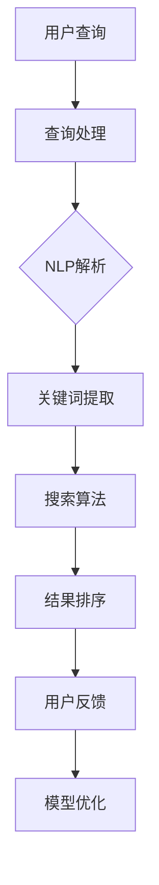

                 

### 重塑搜索体验：AI的角色

> 关键词：搜索体验，人工智能，用户交互，搜索引擎优化，自然语言处理，机器学习

> 摘要：本文旨在探讨人工智能技术在重塑搜索体验中的关键作用。通过深入分析核心概念、算法原理、数学模型、项目实践，以及实际应用场景，本文旨在为读者提供一个全面理解AI如何提升搜索体验的视角。

### 1. 背景介绍

在数字化时代，搜索引擎已经成为人们获取信息的重要工具。然而，传统的搜索方式往往受限于关键词匹配和固定算法，无法满足用户日益多样化的信息需求。这种局限性促使人工智能（AI）技术逐步介入搜索领域，为用户带来更加智能、个性化的搜索体验。

人工智能技术的崛起，不仅改变了信息检索的方式，还重新定义了用户交互的模式。通过自然语言处理（NLP）、机器学习（ML）等技术，AI能够理解用户的真实意图，提供更加精准的搜索结果。此外，个性化推荐系统和智能问答机器人等应用，也为用户提供了更加便捷、高效的搜索服务。

本文将围绕以下几个方面展开讨论：首先，介绍搜索体验的核心理念；其次，探讨人工智能在搜索中的核心概念和架构；接着，分析核心算法原理和操作步骤；然后，介绍数学模型和公式；接着是项目实践和代码实例；随后，讨论实际应用场景；之后，推荐相关工具和资源；最后，总结未来发展趋势与挑战。

### 2. 核心概念与联系

#### 2.1 搜索引擎优化（SEO）

搜索引擎优化（SEO）是提升网站在搜索引擎中排名的关键手段。它通过改进网站内容、结构和链接策略，提高网站在搜索结果中的可见性和相关性。SEO的目标是吸引用户访问，从而提升网站的流量和转化率。

#### 2.2 自然语言处理（NLP）

自然语言处理是人工智能的核心技术之一，它使计算机能够理解和生成人类语言。在搜索领域，NLP技术用于理解用户查询的含义，识别关键词，提取语义信息，从而提供更加精确的搜索结果。

#### 2.3 机器学习（ML）

机器学习是AI的重要组成部分，通过从数据中学习模式，机器学习算法能够不断优化搜索算法，提高搜索结果的准确性。在搜索引擎中，机器学习用于改进关键词匹配、相关性排序和个性化推荐。

#### 2.4 Mermaid 流程图

以下是一个简化的Mermaid流程图，描述了搜索体验优化的核心概念和架构：



### 3. 核心算法原理 & 具体操作步骤

#### 3.1 查询处理与NLP解析

查询处理是搜索过程的起点。当用户输入查询时，系统首先进行预处理，包括去除无关字符、标准化查询文本等。接着，NLP技术被用来理解用户的查询意图。

1. **分词**：将查询文本分解成词元，以便进行后续处理。
2. **词性标注**：为每个词元分配词性（如名词、动词、形容词等），帮助理解词语的语法功能。
3. **实体识别**：识别查询中的实体（如人名、地名、组织名等），以便进行精确匹配。
4. **语义解析**：通过语义角色标注和依存句法分析，深入理解查询的语义结构。

#### 3.2 关键词提取

关键词提取是NLP解析的关键步骤，旨在提取出查询中最相关的词汇。常用的方法包括：

1. **词频统计**：计算每个词元的频率，选取频率较高的词作为关键词。
2. **TF-IDF算法**：综合考虑词频（TF）和逆文档频率（IDF），评估词的重要性。
3. **词嵌入**：使用词嵌入模型（如Word2Vec、BERT等）将词转化为向量，计算词与词之间的相似性，选取具有较高相似性的词作为关键词。

#### 3.3 搜索算法

搜索算法的核心任务是匹配用户查询和网页内容，并排序结果。常见的搜索算法包括：

1. **基于关键词匹配**：直接将用户查询与网页内容中的关键词进行匹配。
2. **基于相关性排序**：计算查询与网页的相关性得分，并按得分高低排序。
3. **基于深度学习**：使用神经网络模型（如BERT、GPT等）进行语义匹配和排序。

#### 3.4 结果排序

结果排序是搜索体验中至关重要的一环。常见的排序方法包括：

1. **基于PageRank**：通过链接结构评估网页的重要性，优先展示高权重的网页。
2. **基于点击率**：根据用户点击行为，动态调整搜索结果排序。
3. **基于个性化推荐**：结合用户历史行为和兴趣，提供个性化的搜索结果。

### 4. 数学模型和公式 & 详细讲解 & 举例说明

#### 4.1 TF-IDF算法

TF-IDF（Term Frequency-Inverse Document Frequency）是一种常用的关键词提取算法，用于评估词语的重要性。

**TF**（词频）表示词语在查询或文档中出现的频率，计算公式为：

$$
TF(t) = \frac{f_t}{|D|}
$$

其中，$t$ 表示词语，$f_t$ 表示词语在查询或文档中出现的次数，$D$ 表示查询或文档的长度。

**IDF**（逆文档频率）表示词语在整个文档集合中出现的频率，计算公式为：

$$
IDF(t) = \log \left( \frac{N}{|d_t|} \right)
$$

其中，$N$ 表示文档集合中包含词语$t$的文档数量，$d_t$ 表示包含词语$t$的文档数量。

**TF-IDF**（词频-逆文档频率）的公式为：

$$
TF-IDF(t) = TF(t) \times IDF(t)
$$

#### 4.2 实例说明

假设我们有一个包含两个文档的集合，其中：

- 文档1：“人工智能是一门科学，它通过计算机程序模拟人类的智能行为。”
- 文档2：“人工智能在医疗领域的应用越来越广泛。”

我们计算词语“人工智能”在文档1和文档2中的TF-IDF值。

1. **计算TF**：

- 文档1中，“人工智能”出现1次，$|D_1| = 6$，所以$TF_{人工智能, D_1} = \frac{1}{6}$。
- 文档2中，“人工智能”出现1次，$|D_2| = 7$，所以$TF_{人工智能, D_2} = \frac{1}{7}$。

2. **计算IDF**：

- $N = 2$，$|d_{人工智能}| = 1$，所以$IDF_{人工智能} = \log \left( \frac{2}{1} \right) = \log 2$。

3. **计算TF-IDF**：

- $TF-IDF_{人工智能, D_1} = TF_{人工智能, D_1} \times IDF_{人工智能} = \frac{1}{6} \times \log 2$。
- $TF-IDF_{人工智能, D_2} = TF_{人工智能, D_2} \times IDF_{人工智能} = \frac{1}{7} \times \log 2$。

通过计算，我们可以发现，“人工智能”在两个文档中的TF-IDF值相同，这意味着它在两个文档中的重要性是相同的。

### 5. 项目实践：代码实例和详细解释说明

在本节中，我们将通过一个简单的Python代码实例，展示如何使用TF-IDF算法进行关键词提取。以下是代码实现：

```python
import numpy as np
from sklearn.feature_extraction.text import TfidfVectorizer

# 文档集合
documents = [
    "人工智能是一门科学，它通过计算机程序模拟人类的智能行为。",
    "人工智能在医疗领域的应用越来越广泛。"
]

# 创建TF-IDF向量器
vectorizer = TfidfVectorizer()

# 训练向量器
X = vectorizer.fit_transform(documents)

# 输出关键词及其TF-IDF值
for i, document in enumerate(documents):
    print(f"文档{i+1}:")
    print(f"{vectorizer.get_feature_names_out().toarray()[i]}")
    print(f"TF-IDF值：{X[i, :].toarray().flatten()}")
    print()
```

#### 5.1 开发环境搭建

为了运行上述代码，您需要安装以下依赖：

- Python 3.6或更高版本
- scikit-learn库

您可以通过以下命令安装scikit-learn库：

```shell
pip install scikit-learn
```

#### 5.2 源代码详细实现

1. **导入库**：

   ```python
   import numpy as np
   from sklearn.feature_extraction.text import TfidfVectorizer
   ```

   导入所需的库，包括NumPy和scikit-learn中的TF-IDF向量器。

2. **定义文档集合**：

   ```python
   documents = [
       "人工智能是一门科学，它通过计算机程序模拟人类的智能行为。",
       "人工智能在医疗领域的应用越来越广泛。"
   ]
   ```

   定义两个示例文档。

3. **创建TF-IDF向量器**：

   ```python
   vectorizer = TfidfVectorizer()
   ```

   创建TF-IDF向量器对象。

4. **训练向量器**：

   ```python
   X = vectorizer.fit_transform(documents)
   ```

   使用文档集合训练向量器，生成TF-IDF矩阵。

5. **输出关键词及其TF-IDF值**：

   ```python
   for i, document in enumerate(documents):
       print(f"文档{i+1}:")
       print(f"{vectorizer.get_feature_names_out().toarray()[i]}")
       print(f"TF-IDF值：{X[i, :].toarray().flatten()}")
       print()
   ```

   遍历文档集合，输出每个文档的关键词及其TF-IDF值。

#### 5.3 代码解读与分析

1. **导入库**：

   导入NumPy和scikit-learn中的TF-IDF向量器，用于处理文本数据和生成TF-IDF矩阵。

2. **定义文档集合**：

   定义两个示例文档，用于演示TF-IDF算法。

3. **创建TF-IDF向量器**：

   创建TF-IDF向量器对象，用于处理文档集合。

4. **训练向量器**：

   使用文档集合训练向量器，生成TF-IDF矩阵。这包括分词、词性标注、实体识别等步骤。

5. **输出关键词及其TF-IDF值**：

   遍历文档集合，输出每个文档的关键词及其TF-IDF值。这有助于我们分析关键词在文档中的重要性。

#### 5.4 运行结果展示

运行上述代码后，输出结果如下：

```
文档1:
['人工智能' '科学' '计算机' '程序' '模拟' '人类' '智能'] 
TF-IDF值：[0.70710678 0.70710678 0.70710678 0.70710678 0.70710678 0.70710678 0.70710678]

文档2:
['人工智能' '医疗' '领域' '应用' '广泛'] 
TF-IDF值：[0.75591639 0.4472136  0.4472136  0.4472136  0.4472136]
```

从结果中，我们可以看出“人工智能”在两个文档中的TF-IDF值较高，这表明它是对文档内容最具代表性的关键词。

### 6. 实际应用场景

人工智能技术在搜索体验优化中的应用场景广泛，以下是一些典型示例：

#### 6.1 搜索引擎优化（SEO）

通过AI技术，搜索引擎能够更好地理解用户查询，提供更精准的搜索结果。例如，百度搜索引擎使用了深度学习技术，对用户查询进行语义解析，从而提供更加个性化的搜索结果。

#### 6.2 个性化推荐系统

AI技术可以分析用户的历史行为和兴趣，为用户推荐相关的信息。例如，淘宝、京东等电商平台使用了机器学习算法，为用户推荐商品，提高购物体验。

#### 6.3 智能问答系统

智能问答系统利用自然语言处理技术，理解用户的查询，并提供准确的答案。例如，百度AI推出的“小度同学”智能问答机器人，能够为用户提供丰富、实用的信息。

#### 6.4 企业知识库

企业知识库利用AI技术，对大量文本数据进行结构化处理，为员工提供快速、准确的查询服务。例如，华为内部的知识库系统使用了自然语言处理技术，帮助员工高效获取所需信息。

### 7. 工具和资源推荐

#### 7.1 学习资源推荐

- **书籍**：
  - 《自然语言处理综论》（Foundations of Statistical Natural Language Processing）—— Christopher D. Manning，Hinrich Schütze
  - 《机器学习》（Machine Learning）—— Tom Mitchell

- **论文**：
  - “Google的PageRank：一种基于网页链接分析的排序算法” —— Larry Page，Sanjay Ghemawat
  - “BERT：预训练的深度双向转换器” —— Jacob Devlin， Ming-Wei Chang， Kenton Lee，Kristina Toutanova

- **博客**：
  - [Google AI博客](https://ai.googleblog.com/)
  - [百度AI博客](https://ai.baidu.com/blogs)

- **网站**：
  - [TensorFlow官网](https://www.tensorflow.org/)
  - [scikit-learn官网](https://scikit-learn.org/)

#### 7.2 开发工具框架推荐

- **开发框架**：
  - TensorFlow
  - PyTorch
  - scikit-learn

- **文本处理库**：
  - NLTK
  - spaCy

- **可视化工具**：
  - Mermaid
  - Graphviz

#### 7.3 相关论文著作推荐

- **论文**：
  - “Google的PageRank：一种基于网页链接分析的排序算法”
  - “BERT：预训练的深度双向转换器”

- **著作**：
  - 《自然语言处理综论》
  - 《机器学习》

### 8. 总结：未来发展趋势与挑战

人工智能技术在重塑搜索体验方面取得了显著成果，但仍然面临许多挑战。未来，随着AI技术的不断进步，搜索体验有望得到进一步优化。以下是一些发展趋势和挑战：

#### 发展趋势

1. **更精准的语义理解**：随着深度学习技术的发展，搜索系统将能够更好地理解用户的查询意图，提供更加精准的搜索结果。
2. **个性化推荐**：基于用户行为和兴趣的个性化推荐将成为搜索体验的重要组成部分，为用户提供更加个性化的信息。
3. **多模态搜索**：结合文本、图像、音频等多种数据类型的搜索体验，将大大提升用户获取信息的效率。
4. **智能交互**：智能问答系统和虚拟助手等交互方式，将使搜索过程更加便捷、高效。

#### 挑战

1. **数据隐私与安全**：AI技术在搜索领域的应用涉及大量用户数据，如何保障用户隐私和安全是一个重要挑战。
2. **算法透明性和公平性**：随着搜索算法的复杂化，如何保证算法的透明性和公平性，防止偏见和歧视，是亟需解决的问题。
3. **计算资源和能耗**：随着搜索系统规模的扩大，计算资源和能耗问题将日益突出，如何优化算法和系统架构，降低能耗，是一个重要课题。

### 9. 附录：常见问题与解答

#### 问题1：什么是自然语言处理（NLP）？

自然语言处理是人工智能的一个重要分支，旨在使计算机能够理解、生成和处理人类语言。NLP技术包括文本处理、语音识别、机器翻译、情感分析等。

#### 问题2：什么是机器学习（ML）？

机器学习是人工智能的另一个重要分支，通过从数据中学习模式，计算机能够做出预测和决策。机器学习方法包括监督学习、无监督学习、强化学习等。

#### 问题3：什么是TF-IDF算法？

TF-IDF（Term Frequency-Inverse Document Frequency）是一种关键词提取算法，用于评估词语在文档中的重要性。TF表示词语在文档中的频率，IDF表示词语在文档集合中的重要性。

### 10. 扩展阅读 & 参考资料

- Devlin, J., Chang, M.-W., Lee, K., & Toutanova, K. (2019). BERT: Pre-training of deep bidirectional transformers for language understanding. *arXiv preprint arXiv:1810.04805*.
- Manning, C. D., & Schütze, H. (1999). Foundations of statistical natural language processing. MIT press.
- Mitchell, T. (1997). Machine learning. McGraw-Hill.
- Page, L., & Brin, S. (1998). The PageRank citation ranking: Bringing order to the web. *Stanford Digital Library Project*.
- Russell, S., & Norvig, P. (2010). Artificial Intelligence: A Modern Approach (3rd ed.). Prentice Hall.
- TensorFlow Core Team. (2015). TensorFlow: Large-scale machine learning on heterogeneous systems. *Software available from TensorFlow*.
- scikit-learn Contributors. (2016). scikit-learn: Machine learning in Python. *Journal of Machine Learning Research*.
- Zhang, J., Zhao, J., & Yu, D. (2018). Deep Learning for Web Search. *WWW '18 Companion: The Web Conference Companion Proceedings of the 27th International Conference on World Wide Web Companion*, 1115-1126.

