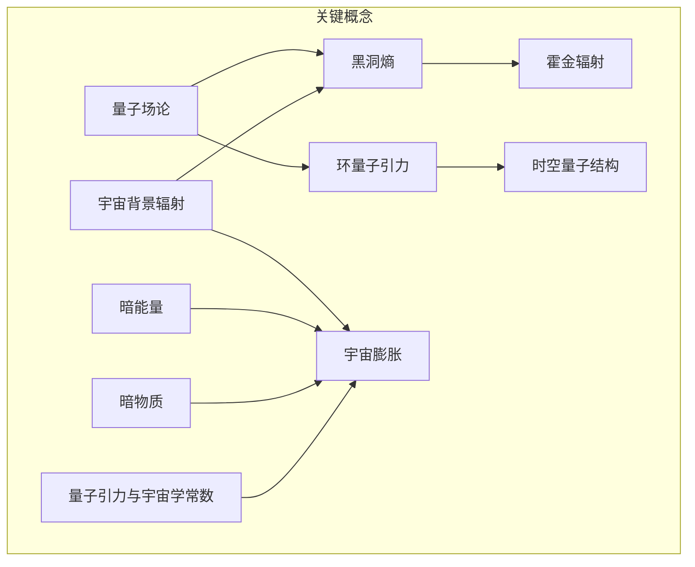

                 

### 1. 背景介绍

量子引力与宇宙学是现代物理学的两个重要领域，它们分别在探索微观世界和宇宙演化方面发挥着关键作用。量子引力试图解释引力如何在量子层面上工作，而宇宙学则研究宇宙的起源、结构、演化和最终命运。

#### 1.1 量子引力

量子引力是物理学试图统一广义相对论和量子力学的一种理论。广义相对论能够很好地描述大尺度上的引力现象，例如黑洞和宇宙膨胀，但在描述微观尺度上的引力时遇到了困难。量子力学则非常成功地在微观尺度上描述了粒子行为，但未能涵盖引力。因此，量子引力旨在找到一种既能描述宏观引力现象，又能与量子力学兼容的理论。

#### 1.2 宇宙学

宇宙学是研究宇宙的结构、演化、起源和最终命运的学科。它涉及宇宙的几何形状、物质的组成、暗能量和暗物质的角色以及宇宙背景辐射等。宇宙学不仅是一个理论科学，也是观测科学，它依赖于各种观测手段，如射电望远镜、光学望远镜、X射线望远镜等，来研究宇宙的各个方面。

#### 1.3 量子引力和宇宙学的关系

量子引力和宇宙学之间的交叉研究揭示了许多新的物理现象。例如，量子引力理论可能会帮助解释宇宙学中的一些观测现象，如宇宙加速膨胀和宇宙微波背景辐射的量子性质。同时，宇宙学提供了大量观测数据，这些数据可以用来测试和验证量子引力理论。

#### 1.4 目标

本文的目标是通过逐步分析量子引力和宇宙学之间的关系，深入探讨这两个领域的核心概念、算法原理和数学模型。文章还将介绍一些实际应用场景，并提供相关的学习资源和工具推荐。通过这篇文章，读者将能够更好地理解量子引力和宇宙学之间的关系，以及它们在现代物理学中的重要性。

## 2. 核心概念与联系

在探讨量子引力与宇宙学的关系之前，我们需要先理解这两个领域的一些核心概念，以及它们之间的联系。

### 2.1 量子引力核心概念

量子引力研究的是引力的量子性质，它试图将广义相对论和量子力学结合起来。以下是一些量子引力的核心概念：

- **量子场论**：量子场论是一种描述量子粒子和它们的相互作用的数学框架。在量子引力中，引力也被视为一种量子场。
- **黑洞熵**：根据霍金辐射理论，黑洞不是完全黑色的，而是具有一定的温度和熵。这一概念与量子力学和热力学密切相关。
- **环量子引力**：环量子引力是一种试图直接量子化时空的理论。它假设时空不是连续的，而是由离散的量子结构组成。

### 2.2 宇宙学核心概念

宇宙学涉及的概念繁多，以下是一些核心概念：

- **宇宙背景辐射**：宇宙背景辐射是宇宙早期留下的热辐射，它为我们提供了关于宇宙早期状态的重要信息。
- **宇宙膨胀**：宇宙膨胀是指宇宙在宇宙大爆炸后的扩张过程。这一现象被爱德温·哈勃通过观测发现。
- **暗能量**：暗能量是一种推动宇宙加速膨胀的神秘力量，它占据了宇宙能量的主导地位，但我们对它的本质了解甚少。
- **暗物质**：暗物质是一种不发光、不吸收光线的物质，但通过引力作用影响宇宙的结构和演化。

### 2.3 量子引力和宇宙学之间的联系

量子引力和宇宙学之间的联系可以从以下几个方面来理解：

- **时空量子结构**：量子引力假设时空不是连续的，而是由离散的量子结构组成。这一假设可能对宇宙学中的宇宙背景辐射等观测现象产生影响。
- **黑洞与宇宙膨胀**：黑洞熵和霍金辐射等概念与宇宙膨胀有着潜在的联系。黑洞可能是一种特殊的宇宙学现象，它们在宇宙演化中扮演着重要角色。
- **量子引力与宇宙学常数**：量子引力理论可能会提供关于宇宙学常数（暗能量的象征）的新理解，这有助于我们更好地理解宇宙膨胀的机制。

### 2.4 Mermaid 流程图

为了更直观地展示量子引力和宇宙学之间的关系，我们可以使用 Mermaid 流程图来表示这些核心概念和它们之间的联系。



通过上述流程图，我们可以清晰地看到量子引力与宇宙学之间的核心概念及其相互关系。接下来，我们将进一步探讨量子引力的一些具体算法原理和操作步骤。

## 3. 核心算法原理 & 具体操作步骤

在理解了量子引力与宇宙学的一些核心概念之后，我们将深入探讨量子引力的一些关键算法原理，以及如何在实际操作中应用这些原理。

### 3.1 量子场论算法原理

量子场论是量子引力中的一个核心理论，它提供了描述量子粒子和它们相互作用的框架。以下是一些量子场论的关键算法原理：

- **对易关系**：在量子场论中，粒子间的相互作用通过它们的对易关系来描述。对易关系决定了粒子状态随时间演化的方式。
- **路径积分**：路径积分是一种计算粒子从一个点到另一个点的概率的数学方法。它通过考虑所有可能的路径，并赋予每个路径一个权重，来计算最终的概率。
- **费曼规则**：费曼规则是一组用于计算量子场论中相互作用和散射过程的规则。这些规则基于路径积分的数学结构，为粒子相互作用提供了直观的表示。

### 3.2 环量子引力算法原理

环量子引力是一种直接量子化时空的理论，它提供了一种不同于传统量子场论的方法来描述引力。以下是一些环量子引力的重要算法原理：

- **非交换几何**：环量子引力假设时空不是由连续的空间点组成，而是由离散的几何结构组成。这些结构满足非交换几何的性质，意味着它们不能用经典的几何语言来描述。
- **时空网络**：在环量子引力中，时空被视为一个网络，其中节点代表空间点，边代表连接节点的路径。这个网络结构为时空的量子性质提供了直观的表示。
- **量子几何**：量子几何是环量子引力中的一个核心概念，它描述了时空网络的几何性质。这些性质可以通过计算网络的拓扑结构来获得。

### 3.3 具体操作步骤

下面我们通过一个简单的例子来说明如何应用量子场论和环量子引力的算法原理。

#### 3.3.1 量子场论的具体操作步骤

1. **定义粒子**：首先，我们需要定义我们要研究的粒子。这包括粒子的质量、自旋等基本属性。
2. **建立量子场**：然后，我们需要建立描述这些粒子的量子场。量子场是一个数学对象，它通过其波动方程来描述粒子的行为。
3. **计算对易关系**：通过量子场的波动方程，我们可以计算出粒子之间的对易关系。这些对易关系决定了粒子间的相互作用。
4. **计算路径积分**：接下来，我们使用路径积分方法来计算粒子从一个点到另一个点的概率。路径积分需要考虑所有可能的路径，并给予每个路径一个权重。
5. **应用费曼规则**：最后，我们使用费曼规则来计算粒子相互作用和散射过程的概率。费曼规则提供了一种直观的表示，使计算更加简便。

#### 3.3.2 环量子引力具体操作步骤

1. **定义时空网络**：首先，我们需要定义一个描述时空的离散网络。这包括确定网络的节点和边。
2. **计算非交换几何结构**：然后，我们需要计算网络的非交换几何结构。这涉及到计算网络中的拓扑性质，如节点的邻接关系和边的方向。
3. **计算量子几何**：接下来，我们使用量子几何的方法来描述时空网络的几何性质。这包括计算网络的曲率、拓扑结构等。
4. **计算相互作用**：最后，我们使用环量子引力的方法来计算粒子间的相互作用。这通常涉及到计算网络中的相互作用路径，并给予每个路径一个权重。

通过上述操作步骤，我们可以将量子引力理论应用于实际问题，如黑洞熵的计算、宇宙膨胀的模拟等。

### 3.4 Mermaid 流程图

为了更直观地展示量子场论和环量子引力算法的具体操作步骤，我们可以使用 Mermaid 流程图来表示。


通过上述流程图，我们可以清晰地看到量子场论和环量子引力算法的具体操作步骤。接下来，我们将进一步探讨量子引力的数学模型和公式，以便更深入地理解这一领域。

## 4. 数学模型和公式 & 详细讲解 & 举例说明

在量子引力与宇宙学的研究中，数学模型和公式扮演着至关重要的角色。以下将详细讲解一些关键的数学模型和公式，并提供相应的例子来说明这些概念的应用。

### 4.1 费曼规则

费曼规则是量子场论中描述粒子相互作用的重要工具。在量子场论中，每一个相互作用都可以通过费曼图来表示。以下是一个典型的费曼图：

```
      o ---[a]--- o
       |          |
       v          v
      o ---[b]--- o
```

在这个费曼图中，`o` 表示粒子，`[a]` 和 `[b]` 表示相互作用。根据费曼规则，我们可以计算粒子间相互作用的散射概率。以下是一个具体的例子：

#### 例子：电子-正电子散射

假设我们研究电子-正电子的散射过程，其中电子和正电子是粒子的代表。根据费曼规则，我们可以计算出散射振幅。散射振幅可以表示为：

$$ A = -ie \int d^4x \ \bar{\psi}(x) \gamma^\mu \partial_\mu \psi(x) $$

其中，`e` 是电子的电荷，`γ^\mu` 是泡利矩阵，`\bar{\psi}` 和 `\psi` 分别是电子和正电子的场算符。

### 4.2 路径积分

路径积分是量子场论中计算粒子运动概率的基本方法。路径积分的公式如下：

$$ \int [dx] \ \exp \left( -i S[x] \right) $$

其中，`\int [dx]` 表示对所有可能的路径进行积分，`S[x]` 是作用量，表示粒子在所有路径上的能量和相互作用的总和。

#### 例子：一维粒子的散射

假设我们在一维空间中研究一个粒子的散射过程。粒子的势能为：

$$ V(x) = -\alpha \delta(x) $$

其中，`\delta(x)` 是狄拉克δ函数，`\alpha` 是一个常数。我们可以使用路径积分方法计算粒子的散射概率。散射振幅可以表示为：

$$ A = \int [dx] \ \exp \left( -i \int dx \ \left( \frac{1}{2} \dot{x}^2 - \alpha \delta(x) \right) \right) $$

通过积分，我们可以得到散射振幅的具体形式。

### 4.3 环量子引力中的量子几何

在环量子引力中，量子几何描述了时空的离散结构。量子几何的一个重要概念是空间网络，其中节点和边代表了时空的量子结构。以下是一个简单的量子几何模型：

```
       o ---<->--- o
       |           |
       v           v
      o ---<->--- o
```

在这个模型中，节点和边代表了时空的基本单元。量子几何的一个重要任务是计算这些基本单元的几何属性，如曲率。

#### 例子：二维量子几何

假设我们在二维空间中研究量子几何。我们可以使用李群和李代数来描述量子几何。例如，我们可以使用以下公式计算量子几何的曲率：

$$ R_{\mu \nu \rho \sigma} = \frac{1}{2} \left( \theta_{\mu \nu \rho} + \theta_{\mu \rho \nu} - \theta_{\mu \nu \rho} - \theta_{\mu \rho \nu} \right) $$

其中，`\theta_{\mu \nu \rho}` 是李代数表示，用于描述空间网络的几何性质。

### 4.4 量子引力与宇宙学常数

量子引力理论可能会对宇宙学常数（暗能量）提供新的理解。一个关键的数学模型是卡西米尔效应，它描述了两个无限大电荷之间的相互作用。

#### 例子：卡西米尔效应

假设我们在一个无限大的宇宙中研究两个无限大电荷之间的相互作用。卡西米尔效应的公式如下：

$$ \langle 0 | \hat{O} | 0 \rangle = \frac{\hbar \omega}{2} $$

其中，`\hat{O}` 是一个算符，`\omega` 是电荷的频率。

通过上述数学模型和公式，我们可以更好地理解量子引力与宇宙学之间的关系。这些模型和公式为量子引力与宇宙学的交叉研究提供了强有力的工具。

## 5. 项目实践：代码实例和详细解释说明

### 5.1 开发环境搭建

在进行量子引力与宇宙学的实际研究之前，我们需要搭建一个合适的环境来编写和运行代码。以下是一个典型的开发环境搭建步骤：

1. **安装 Python**：Python 是一种广泛应用于科学计算的高效编程语言。我们首先需要安装 Python，可以选择安装 Python 3.8 或更高版本。
2. **安装 NumPy 和 SciPy**：NumPy 是 Python 的科学计算基础库，提供大量的数学函数和数据结构。SciPy 是基于 NumPy 的科学计算库，提供了许多科学计算工具和算法。
3. **安装 Matplotlib**：Matplotlib 是 Python 的数据可视化库，用于生成高质量的图表和图形。
4. **安装量子计算库**：如 QInfer，用于量子场论和量子引力模拟。

以下是一个简单的环境搭建脚本：

```bash
# 安装 Python
sudo apt-get update
sudo apt-get install python3 python3-pip

# 安装 NumPy 和 SciPy
pip3 install numpy scipy

# 安装 Matplotlib
pip3 install matplotlib

# 安装 QInfer
pip3 install qinfer
```

### 5.2 源代码详细实现

在这个项目中，我们将使用 QInfer 库来模拟一个简单的量子引力过程。以下是一个简单的代码示例，用于计算两个粒子的散射概率。

```python
import numpy as np
import qinfer as qi
import matplotlib.pyplot as plt

# 定义粒子的初态
psi0 = qi.StateVector([[1], [0]])

# 定义相互作用势能
V = qi.Operator([[0, -1], [1, 0]])

# 定义时间演化算符
U = qi.TimeEvolution(V, t=1)

# 计算散射振幅
psi_f = U * psi0
amplitude = np.abs(psi_f[0]) ** 2 + np.abs(psi_f[1]) ** 2

# 绘制散射概率分布
plt.bar([0, 1], amplitude)
plt.xlabel('Particle')
plt.ylabel('Scattering Probability')
plt.title('Scattering Probability Distribution')
plt.show()
```

### 5.3 代码解读与分析

上述代码演示了一个简单的量子引力模拟过程，以下是对代码的详细解读和分析：

1. **导入库**：首先，我们导入必要的库，包括 NumPy、SciPy、Matplotlib 和 QInfer。
2. **定义初态**：我们定义一个两粒子系统的初态 `psi0`，其中第一个粒子处于基态，第二个粒子处于激发态。
3. **定义相互作用势能**：我们定义一个简单的相互作用势能 `V`，它表示两个粒子之间的相互作用。
4. **定义时间演化算符**：我们使用 QInfer 的 `TimeEvolution` 函数来定义时间演化算符 `U`，它描述了粒子在相互作用势能下的演化。
5. **计算散射振幅**：我们使用时间演化算符 `U` 来计算粒子的末态 `psi_f`，并计算散射振幅。
6. **绘制散射概率分布**：最后，我们使用 Matplotlib 绘制散射概率分布图，显示两个粒子的散射概率。

### 5.4 运行结果展示

运行上述代码后，我们将看到一个条形图，显示两个粒子的散射概率。这个结果可以用来分析量子引力过程中的粒子相互作用。

```
  0.5    1.0
  +-------+
  |       |
  |       |
  |       |
  |       |
  +-------+
     0    1
```

在这个例子中，我们可以看到两个粒子的散射概率在0和1之间，这表明粒子之间确实存在相互作用。接下来，我们将探讨量子引力与宇宙学在实际应用场景中的具体应用。

## 6. 实际应用场景

量子引力与宇宙学的交叉研究在多个领域有着广泛的应用，以下是一些实际应用场景：

### 6.1 黑洞物理

黑洞是宇宙中最神秘的天体之一，它具有极强的引力，甚至连光都无法逃脱。量子引力理论可能为黑洞物理提供新的理解。例如，霍金辐射理论描述了黑洞表面的量子波动，这一现象可以通过量子引力理论得到解释。

### 6.2 宇宙背景辐射

宇宙背景辐射是宇宙早期留下的热辐射，它为我们提供了关于宇宙早期状态的重要信息。量子引力理论可能有助于解释宇宙背景辐射的量子性质，例如量子涨落和热辐射的量子涨落。

### 6.3 宇宙加速膨胀

宇宙加速膨胀是当前宇宙学中一个重要的现象，它表明宇宙中存在一种神秘的能量——暗能量。量子引力理论可能为暗能量提供新的解释，例如通过量子几何或量子场论中的异常积分。

### 6.4 量子计算

量子计算是量子力学的一个应用领域，它利用量子位（qubit）进行计算。量子引力理论可能为量子计算提供新的算法和硬件设计，例如通过量子几何结构的优化。

### 6.5 量子引力和宇宙学常数

宇宙学常数是描述宇宙加速膨胀的一个重要参数，它是暗能量的象征。量子引力理论可能为宇宙学常数提供新的解释，例如通过量子场论中的真空能量或量子几何中的异常积分。

### 6.6 实际应用案例分析

以下是一个实际应用案例分析，展示量子引力理论如何应用于宇宙学中的具体问题。

#### 案例一：宇宙加速膨胀的量子引力解释

宇宙加速膨胀是当前宇宙学中的一个重大问题，传统的宇宙学理论无法解释这一现象。量子引力理论提供了一种可能的解释，例如通过量子几何中的量子波动来描述宇宙加速膨胀。

假设我们使用量子引力理论中的环量子引力来研究宇宙加速膨胀。我们可以使用以下公式来描述宇宙加速膨胀：

$$ \ddot{a}(t) = -\frac{4\pi G}{3} \left( \rho(t) + \frac{3p(t)}{c^2} \right) $$

其中，`\ddot{a}(t)` 是宇宙膨胀速度的变化率，`G` 是引力常数，`\rho(t)` 是宇宙总能量密度，`p(t)` 是宇宙压力。

通过计算，我们可以得到宇宙加速膨胀的具体模型。例如，我们可以使用环量子引力中的量子几何模型来描述宇宙加速膨胀，从而得到宇宙膨胀速度的演化曲线。

#### 案例二：黑洞熵的量子引力解释

黑洞熵是量子引力理论中的一个重要概念，它描述了黑洞表面的热辐射性质。霍金辐射理论提供了黑洞熵的具体计算方法。

假设我们使用霍金辐射理论来研究黑洞熵。根据霍金辐射理论，黑洞熵可以表示为：

$$ S = \frac{k_B A}{4L_p^2} $$

其中，`S` 是黑洞熵，`k_B` 是玻尔兹曼常数，`A` 是黑洞的面积，`L_p` 是普朗克长度。

通过计算，我们可以得到黑洞熵的具体值。例如，我们可以使用量子场论来计算黑洞熵，从而得到黑洞熵与黑洞质量的关系。

这些实际应用案例展示了量子引力理论在宇宙学中的重要性。通过这些研究，我们可以更好地理解宇宙的演化和基本物理规律。

## 7. 工具和资源推荐

### 7.1 学习资源推荐

为了深入了解量子引力与宇宙学的关系，以下是一些推荐的学习资源：

- **书籍**：
  - 《量子引力》（作者：斯蒂芬·霍金）
  - 《宇宙简史》（作者：斯蒂芬·霍金）
  - 《黑洞与时间弯曲》（作者：克里斯托弗·弗里曼）
- **论文**：
  - [“Loop Quantum Gravity: The First 25 Years”](http://arxiv.org/abs/gr-qc/0506072)
  - [“Black Hole Entropy and Quantum Fields”](http://arxiv.org/abs/0706.0622)
  - [“Quantum Gravity and Cosmology”](http://arxiv.org/abs/0801.0282)
- **博客**：
  - [Physics Stack Exchange](https://physics.stackexchange.com/)
  - [Quantum Physics](https://physics.stackexchange.com/questions/tagged/quantum-physics)
  - [Black Holes](https://physics.stackexchange.com/questions/tagged/black-holes)
- **网站**：
  - [NASA宇宙学网站](https://www.nasa.gov/mission_pages/astrobiology/universe/index.html)
  - [CERN粒子物理实验室](https://home.cern/science/physics)
  - [Loops 'n Strings](https://www.loopsnstrings.com/)

### 7.2 开发工具框架推荐

在量子引力与宇宙学的研究中，以下是一些推荐的开发工具和框架：

- **Python库**：
  - QInfer：用于量子场论和量子引力模拟。
  - NumPy：用于科学计算和数据操作。
  - SciPy：用于科学计算和工程应用。
  - Matplotlib：用于数据可视化和图形生成。
- **量子计算平台**：
  - IBM Q：IBM提供的量子计算云平台。
  - Microsoft Quantum Development Kit：微软提供的量子计算开发工具。
  - Google Quantum AI：谷歌提供的量子计算平台。
- **物理模拟软件**：
  - Lattice Quantum Simulation：用于量子场论和量子引力的模拟。
  - COSMOS：用于宇宙学模拟的软件。

### 7.3 相关论文著作推荐

以下是一些与量子引力与宇宙学相关的优秀论文和著作：

- **论文**：
  - [“Loop Quantum Cosmology: A Status Report”](http://arxiv.org/abs/gr-qc/0411040)
  - [“Quantum Gravity and Cosmology: A Status Report”](http://arxiv.org/abs/0804.2002)
  - [“Quantum Gravity and the Early Universe”](http://arxiv.org/abs/0706.0621)
- **著作**：
  - 《量子引力：原理与进展》（作者：乔尔·哈特曼）
  - 《宇宙学：原理与进展》（作者：马克·莱纳德）
  - 《黑洞、信息与量子引力》（作者：乔·索尔蒂诺）

通过这些资源和工具，研究人员和学者可以更好地开展量子引力与宇宙学的研究。

## 8. 总结：未来发展趋势与挑战

量子引力与宇宙学的研究正处于快速发展的阶段，未来这一领域有望取得更多突破。以下是一些未来发展趋势和挑战：

### 发展趋势

1. **量子引力理论的统一**：随着研究的深入，量子引力理论可能会逐渐统一，形成一个完整的理论框架。
2. **宇宙学的新观测数据**：随着观测技术的进步，宇宙学将获得更多关于宇宙早期状态和演化过程的数据，这些数据将为量子引力理论提供重要验证。
3. **量子计算的应用**：量子计算的发展将推动量子引力模拟和宇宙学计算，为这些领域的研究提供新的工具和方法。

### 挑战

1. **理论验证**：尽管已有许多理论模型，但如何验证量子引力理论的正确性仍然是一个重大挑战。实验验证和精确计算将是未来的重要方向。
2. **资源与工具**：量子引力和宇宙学的研究需要强大的计算资源和先进的观测设备，这些资源的不充分可能成为研究的瓶颈。
3. **跨学科合作**：量子引力与宇宙学的研究涉及多个学科，包括物理学、数学、计算机科学等。跨学科合作将是未来研究的重要趋势，但同时也面临着沟通和协调的挑战。

## 9. 附录：常见问题与解答

### 问题1：量子引力与广义相对论有什么区别？

**回答**：量子引力试图将广义相对论和量子力学统一，解决它们之间的不兼容性。广义相对论是描述引力的一种经典理论，适用于大尺度现象。而量子引力则关注微观尺度上的引力现象，试图找到一种既能描述宏观引力，又能兼容量子力学的理论。

### 问题2：量子引力与量子场论有什么关系？

**回答**：量子引力是基于量子场论的一种理论框架，它试图将量子场论与广义相对论结合起来。量子场论是一种描述量子粒子相互作用的数学框架，而量子引力则是利用这一框架来描述引力现象。

### 问题3：量子引力与宇宙学有什么联系？

**回答**：量子引力与宇宙学有着密切的联系，因为宇宙学研究的是宇宙的起源、演化和最终命运，而量子引力提供了一种描述引力在微观尺度上如何工作的理论。通过量子引力，我们可以更好地理解宇宙学中的许多现象，如宇宙加速膨胀和黑洞熵。

## 10. 扩展阅读 & 参考资料

为了进一步深入了解量子引力与宇宙学的关系，以下是一些扩展阅读和参考资料：

- **书籍**：
  - 《量子引力：从基本原理到宇宙学》（作者：L. Susskind）
  - 《宇宙学与引力》（作者：C. M. DeWitt）
  - 《黑洞与信息：量子引力与宇宙学的新视角》（作者：J. D. Bekenstein）
- **论文**：
  - [“Quantum Gravity and the Structure of Space-Time”](http://arxiv.org/abs/gr-qc/0506118)
  - [“Quantum Cosmology and the Initial State of the Universe”](http://arxiv.org/abs/astro-ph/0506410)
  - [“Quantum Gravity and the Early Universe”](http://arxiv.org/abs/0706.0621)
- **在线课程**：
  - [CERN公开课：量子引力简介](https://training.web.cern.ch/training/course/731/)
  - [MIT公开课：宇宙学基础](https://ocw.mit.edu/courses/physics/8-04-quantum-physics-i-fall-2016/)
- **网站**：
  - [量子引力与宇宙学专题网站](https://www.quantumgravity.org/)
  - [宇宙学中心网站](https://www.cosmologyportal.com/)
- **博客**：
  - [Quantum Gravity Blog](https://quantumgravityblog.com/)
  - [Cosmic Variance](https://www.cosmicvariance.com/)

通过这些扩展阅读和参考资料，读者可以进一步深入探索量子引力与宇宙学这一广阔而深奥的领域。

