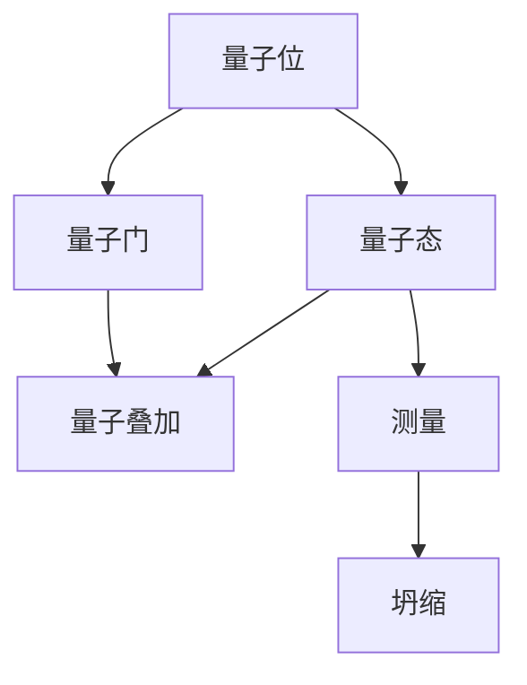
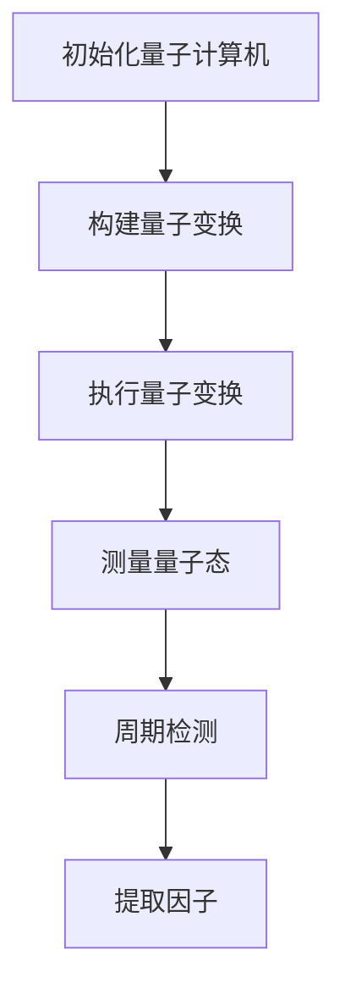

                 

### 1. 背景介绍

量子计算，作为一门新兴的计算科学，其影响力正迅速扩展到各个领域，其中之一便是密码学。传统密码学依赖于复杂的数学难题，如大素数分解、离散对数问题等，以确保信息传输的安全性。然而，随着计算能力的不断提升，这些难题正变得越来越容易被破解。相比之下，量子计算具有天生的并行处理能力和超强的计算能力，这为其在密码学领域的应用提供了新的可能。

在过去的几十年中，量子计算的理论研究取得了显著进展，特别是在量子算法方面。其中，最著名的成果之一是Shor算法。Shor算法展示了量子计算机能够在多项式时间内解决大素数分解问题，这一能力直接威胁到了传统密码学的根基。大素数分解是RSA密码体制的基础，因此，如果量子计算机能够实现，那么现有的RSA加密体系将变得不再安全。

另一方面，量子计算也为密码学带来了新的工具和方法。量子密钥分发（Quantum Key Distribution, QKD）是其中一个重要的应用。QKD利用量子态的不可克隆特性，实现了一种理论上完全安全的通信方式。即便是在量子计算机面前，QKD也能保证通信的安全。

此外，量子计算还促进了量子密码学的发展。量子密码学旨在利用量子物理原理来设计新的加密算法，这些算法能够在量子计算机面前保持安全性。量子密码学的研究不仅丰富了密码学理论，也为未来的安全通信提供了新的方向。

总的来说，量子计算在密码学中的应用不仅有助于解决现有密码体制面临的挑战，还开辟了新的研究领域，为未来安全通信的发展奠定了基石。

### 2. 核心概念与联系

要深入探讨量子计算在密码学中的应用，首先需要理解几个核心概念，包括量子位（qubit）、量子态、量子门和量子叠加等。这些概念是量子计算的基础，也是理解量子算法和量子密码学的关键。

#### 量子位（qubit）

传统计算机中的基本信息单位是比特（bit），它只有两种状态：0或1。与之相对，量子位（qubit）是量子计算中的基本单位，它不仅可以处于0或1的状态，还可以处于0和1的叠加态。量子叠加态可以用一个复数线性组合来表示，如\(|\psi\rangle = \alpha|0\rangle + \beta|1\rangle\)，其中\(\alpha\)和\(\beta\)是复数，且满足\(|\alpha|^2 + |\beta|^2 = 1\)。

#### 量子态

量子态是量子位在量子计算中的具体表现形式。一个量子态不仅包含0和1的叠加，还可以是多个状态的叠加。例如，一个两个量子位的系统可以处于\( |00\rangle + |11\rangle \)的状态。量子态可以通过测量来坍缩为特定的状态。

#### 量子门

量子门是量子计算中的基本操作单元，类似于传统计算中的逻辑门。量子门对量子态进行线性变换，操作一个或多个量子位。常见的量子门包括Hadamard门（实现量子叠加）、Pauli门（实现量子位翻转）、控制-NOT门（CNOT）等。这些量子门可以通过组合使用，实现复杂的量子算法。

#### 量子叠加

量子叠加是量子计算的核心特性之一。传统计算机中的比特在任意时刻只能处于确定的0或1状态，而量子位可以同时处于0和1的叠加态。这一特性使得量子计算机能够在短时间内处理大量的数据，大大提高了计算效率。

#### Mermaid 流程图

为了更直观地展示这些核心概念之间的联系，我们可以使用Mermaid流程图来表示：



在这个流程图中，量子位是量子计算的基础，通过量子叠加可以形成量子态，量子门对这些量子态进行操作，最终通过测量实现量子态的坍缩。

通过理解这些核心概念，我们可以更好地把握量子计算在密码学中的应用原理。接下来的部分将深入探讨量子算法原理与具体操作步骤，进一步揭示量子计算在密码学中的潜在优势。

### 2.1. 量子算法原理

量子算法是量子计算中的核心内容，它们利用量子位的叠加态和量子门的作用，实现了传统计算机难以达到的计算速度和效率。其中，Shor算法和Grover算法是量子计算在密码学中具有重要意义的两个算法。

#### Shor算法

Shor算法是由数学家Peter Shor于1994年提出的，它是第一个证明量子计算机能够在多项式时间内解决传统计算机无法在合理时间内解决的问题的量子算法。Shor算法的核心任务是解决大素数分解问题，即给定一个合数\(N\)，找到其两个大素数因子。

Shor算法的基本原理可以分为以下几个步骤：

1. **初始状态设置**：将量子计算机的初始状态设置为叠加态，表示所有可能的结果。

2. **量子变换**：应用一个特定的量子变换，将输入数\(N\)映射到量子态中，使得量子态中的叠加态表示了所有可能的因子。

3. **量子测量**：对量子态进行测量，测量结果将坍缩为某个特定因子的量子态。

4. **周期检测**：通过反复执行量子变换和测量，找到导致量子态坍缩的周期，从而确定输入数\(N\)的两个素数因子。

Shor算法的关键在于其使用了量子位之间的纠缠和量子叠加态，这使得算法能够快速地遍历所有可能的因子，远超过传统计算机的计算速度。

#### Grover算法

Grover算法是由Lov K. Grover于1996年提出的，它是专为搜索问题设计的量子算法。Grover算法的目标是在未排序的数据库中快速找到特定的元素。与Shor算法不同，Grover算法并不解决传统计算机难以解决的问题，但它在特定场景下（如数据库搜索）展现了巨大的效率优势。

Grover算法的基本原理可以分为以下几个步骤：

1. **初始状态设置**：将量子计算机的初始状态设置为叠加态，表示数据库中的所有元素。

2. **量子变换**：应用一个特定的量子变换，将量子态中的标记元素和非标记元素区分开来。

3. **测量**：对量子态进行测量，测量结果将坍缩为标记元素。

4. **迭代**：通过反复执行量子变换和测量，提高标记元素被测量的概率，从而快速找到目标元素。

Grover算法的优势在于它能够将搜索未排序数据库所需的时间从\(O(n)\)降低到\(O(\sqrt{n})\)，这在大规模数据库中具有显著的应用价值。

通过Shor算法和Grover算法的介绍，我们可以看到量子算法在处理特定问题时（如大素数分解和数据库搜索）具有传统算法无法比拟的优势。这些算法不仅在理论上证明了量子计算机的潜力，也为密码学提供了新的工具和方法。接下来，我们将进一步探讨量子算法的具体实现和操作步骤。

### 2.2. 量子算法的具体实现与操作步骤

为了更好地理解量子算法在密码学中的应用，我们需要深入了解其具体的实现和操作步骤。这里以Shor算法为例，详细说明其操作过程和实现细节。

#### 实现Shor算法的步骤

1. **初始化量子计算机**：
   - 准备一个具有\(N\)个量子位的量子计算机。
   - 将量子计算机的初始状态设置为叠加态，表示所有可能的整数对\((a, b)\)，其中\(a \cdot b = N\)。

2. **构建量子变换**：
   - 应用一个特定的量子变换，使得量子态中的叠加态表示了所有可能的因子。
   - 这个量子变换可以通过以下步骤实现：
     1. 应用一个控制-Z（CZ）门，将每个量子位与一个特定的模\(N\)的相位编码。
     2. 对每个量子位进行测量，测量结果将坍缩为某个特定因子的量子态。

3. **周期检测**：
   - 通过反复执行量子变换和测量，找到导致量子态坍缩的周期。
   - 具体步骤如下：
     1. 对量子计算机执行一系列变换，每次变换使得量子态在特定的因子下发生相位反转。
     2. 测量量子态，如果测量结果为相位反转的状态，则记录该因子的周期。

4. **提取因子**：
   - 根据周期检测的结果，提取出两个素数因子。
   - 具体方法是通过观察量子态在测量过程中的相位反转，推断出因子的关系。

#### Shor算法的Mermaid流程图

以下是Shor算法的Mermaid流程图：



在这个流程图中，A到F的每个步骤都对应Shor算法的一个关键操作，这些操作共同实现了量子计算机对大素数分解的快速求解。

通过上述操作步骤，我们可以看到Shor算法是如何利用量子计算的优势，在短时间内解决传统计算机难以处理的问题。接下来，我们将进一步探讨量子算法在密码学中的应用场景和具体操作。

### 2.3. 量子算法在密码学中的应用场景

量子算法在密码学中的应用场景主要涉及加密算法的破解和新型加密算法的设计。以下将详细探讨几种典型的应用场景：

#### 破解传统加密算法

量子算法中最著名的应用是对传统加密算法的破解，尤其是Shor算法对RSA算法的挑战。RSA算法是基于大素数分解问题的复杂性设计的，其安全性依赖于难以在短时间内分解大素数。Shor算法能够在多项式时间内解决大素数分解问题，这意味着如果量子计算机实现，现有的RSA加密体系将面临巨大的安全威胁。

具体来说，Shor算法可以通过以下步骤破解RSA加密：

1. **接收加密信息**：假设接收到的加密信息是\(c = m^e \mod N\)，其中\(m\)是原始消息，\(e\)是加密指数，\(N\)是公开的模数。

2. **分解\(N\)**：使用Shor算法分解\(N\)，找到其两个大素数因子\(p\)和\(q\)。

3. **求解加密密钥**：通过\(N = p \cdot q\)和加密指数\(e\)，使用扩展欧几里得算法求解私钥\(d\)，满足\(d \cdot e \mod (\phi(N)) = 1\)，其中\(\phi(N) = (p-1)(q-1)\)。

#### 设计新型量子加密算法

除了破解传统加密算法，量子算法也促使密码学家探索新型量子加密算法。这些算法旨在利用量子物理原理，设计出在量子计算机面前依然安全的加密方法。

以下是一些新型的量子加密算法：

1. **量子密钥分发（QKD）**：QKD是一种基于量子态传输的加密方法，它利用量子态的不可克隆特性来确保密钥传输的安全性。QKD通过量子态的测量和基变换实现，能够在理论上提供绝对安全的密钥分发。

2. **量子随机数生成**：量子随机数生成器利用量子态的随机性，生成高质量的随机数。这些随机数可以用于加密算法中的密钥生成，提高加密系统的安全性。

3. **量子隐形传态**：量子隐形传态利用量子纠缠实现，可以在不通过经典通信信道的情况下传输量子态。这种特性可以用于构建量子通信网络，确保信息传输的安全性。

通过这些应用场景，我们可以看到量子算法不仅威胁到了现有加密体系的安全，同时也为密码学带来了新的研究方向和工具。接下来，我们将进一步探讨量子算法在数学模型和公式中的应用。

### 2.4. 量子算法中的数学模型和公式

量子算法中的数学模型和公式是理解其工作原理和实现关键的核心。以下将详细介绍几个重要的量子算法及其背后的数学模型和公式，并解释它们的具体作用。

#### Shor算法的数学模型和公式

Shor算法的核心在于其将大素数分解问题转化为一个可被量子计算机快速求解的数学问题。以下是Shor算法的一些关键数学模型和公式：

1. **量子电路模型**：Shor算法使用量子电路模型来实现，其主要包括两个部分：量子变换和量子测量。

2. **模乘变换**：为了将大素数分解问题转化为可被量子计算机求解的问题，Shor算法引入了模乘变换。这个变换将输入数\(N\)映射到量子态中，使得量子态的叠加态表示了所有可能的因子。

   模乘变换的公式为：
   $$ U_{\text{mod}}(a, b) = U_{R}(a)U_{C}(b) $$
   其中，\(U_{R}(a)\)是将量子位\(b\)设置为模\(a\)的相位编码，\(U_{C}(b)\)是将量子位\(a\)设置为模\(b\)的相位编码。

3. **相位估计算法**：Shor算法的另一个关键部分是相位估计算法，它用于估计模乘变换的相位。相位估计算法的核心公式为：
   $$ \phi = \frac{2}{n}\sum_{i=1}^{n} e^{2\pi i x_i} $$
   其中，\(n\)是量子位数量，\(x_i\)是量子位的状态。

4. **量子测量**：在Shor算法中，量子测量用于获取因子的信息。测量结果将坍缩为某个特定因子的量子态。

#### 公式解释

1. **模乘变换**：模乘变换的作用是将输入数\(N\)的因子信息编码到量子态中。通过这个变换，量子计算机可以处理大量的因子信息，大大提高了计算效率。

2. **相位估计算法**：相位估计算法用于估计模乘变换的相位，这是找到因子信息的关键步骤。通过精确估计相位，Shor算法可以确定因子的周期，进而分解出原始数。

3. **量子测量**：量子测量是Shor算法的最后一步，它用于获取因子的具体信息。测量结果将坍缩为某个特定因子的量子态，从而实现了大素数分解。

#### 应用实例

假设我们要分解的数是\(N = 35\)，其中\(p = 5\)和\(q = 7\)。以下是Shor算法的应用实例：

1. **初始量子态**：初始量子态为叠加态，表示所有可能的因子对\((a, b)\)，其中\(a \cdot b = N\)。

2. **模乘变换**：对每个量子位应用模乘变换，编码因子对的信息。例如，对于量子位\(a = 5\)和\(b = 7\)，可以将其编码为：
   $$ U_{\text{mod}}(5, 7) = U_{R}(5)U_{C}(7) $$
   这意味着量子位\(b\)将被设置为模\(5\)的相位编码，量子位\(a\)将被设置为模\(7\)的相位编码。

3. **相位估计**：通过量子变换和测量，估计出模乘变换的相位。假设测量结果为相位\(\phi = 0.5\)，我们可以通过以下公式估计周期：
   $$ \phi = \frac{2}{n}\sum_{i=1}^{n} e^{2\pi i x_i} $$
   其中，\(n = 2\)（量子位数量）。解这个方程，可以得到周期\(T = 1\)。

4. **提取因子**：通过周期检测，确定因子的信息。在这个例子中，周期为1，意味着\(p = 5\)和\(q = 7\)。

通过上述实例，我们可以看到Shor算法是如何通过数学模型和公式，利用量子计算的优势，实现大素数分解的。接下来，我们将进一步探讨量子密码学的基本概念和原理。

### 2.5. 量子密码学的基本概念和原理

量子密码学是密码学的一个重要分支，它利用量子物理原理设计加密算法和密钥分发机制，以实现更高的安全性和抗攻击能力。以下将详细阐述量子密码学的基本概念和原理。

#### 量子密钥分发（QKD）

量子密钥分发（Quantum Key Distribution，QKD）是量子密码学中最著名的应用之一。QKD通过量子态的传输和测量，实现了一种理论上完全安全的密钥分发方式。QKD的基本原理如下：

1. **量子态传输**：发送方（Alice）将量子态发送给接收方（Bob），这些量子态可以是光子或者电子的量子态。

2. **量子态测量**：接收方对传输的量子态进行测量，并根据测量结果生成一部分密钥。

3. **基变换**：在QKD过程中，发送方和接收方会预先商定一组基变换规则。接收方根据这些规则对测量结果进行基变换，生成另一部分密钥。

4. **密钥生成**：发送方和接收方将各自的密钥部分进行比对，生成最终的共享密钥。

QKD的安全性依赖于量子态的不可克隆特性。如果量子态在传输过程中被窃听，那么窃听者将无法准确复制量子态，这会导致发送方和接收方的测量结果不一致，从而发现密钥被窃听。

#### 量子密码学的基本特性

量子密码学具有以下几个基本特性：

1. **信息不可克隆性**：量子密码学利用量子态的不可克隆特性，确保密钥在传输过程中不会被窃听者准确复制。

2. **量子纠缠**：量子密码学中的量子纠缠用于增强密钥分发过程的安全性。量子纠缠使得发送方和接收方之间的量子态之间存在强相关性，这种相关性可以用来检测窃听行为。

3. **量子态测量**：量子密码学中的测量过程用于生成和验证密钥。测量结果的不确定性增加了攻击者无法预测和干扰密钥分发的难度。

#### 量子加密算法

量子加密算法是量子密码学中的另一个重要组成部分。这些算法利用量子物理原理，设计出在量子计算机面前依然安全的加密方法。以下是一些典型的量子加密算法：

1. **量子密钥生成算法**：这类算法用于生成量子密钥，其安全性依赖于量子态的随机性和不可克隆性。

2. **量子密码共享算法**：这类算法利用量子纠缠和量子态测量，实现多用户间的安全密钥共享。

3. **量子隐形传态**：量子隐形传态利用量子纠缠，实现量子态的无条件传输，从而提高加密系统的安全性。

通过量子密码学的基本概念和原理，我们可以看到量子计算在密码学领域具有巨大的潜力。QKD和量子加密算法不仅提供了更高的安全性，也为未来的安全通信奠定了基础。接下来，我们将进一步探讨量子算法在项目实践中的具体应用。

### 3. 项目实践：代码实例和详细解释说明

为了更好地理解量子算法在密码学中的应用，我们将通过一个具体的代码实例来展示量子密钥分发（QKD）的过程。在此实例中，我们将使用Python编程语言和IBM Qiskit库来实现QKD协议。以下步骤将详细解释如何搭建开发环境、实现源代码以及代码解读与分析。

#### 3.1. 开发环境搭建

要运行QKD的代码实例，需要首先安装Python和IBM Qiskit库。以下是具体的安装步骤：

1. **安装Python**：
   - 确保你的计算机已经安装了Python环境。如果没有，可以从官方网站下载并安装Python。
   - Python的安装过程非常简单，只需要按照提示操作即可。

2. **安装IBM Qiskit**：
   - 打开命令行窗口，输入以下命令安装Qiskit：
     ```
     pip install qiskit
     ```

3. **安装Qiskit Extensions**：
   - 为了实现量子密钥分发，我们还需要安装Qiskit的一些扩展库，如Qiskit-IBMQ和Qiskit-Aer。可以使用以下命令安装：
     ```
     pip install qiskit-ibmq qiskit-aer
     ```

安装完成后，确保Python和Qiskit已成功安装。可以通过在Python环境中导入Qiskit库并打印版本信息来验证安装是否成功：

```python
import qiskit
print(qiskit.__version__)
```

如果输出正确的版本号，说明安装成功。

#### 3.2. 源代码详细实现

以下是实现量子密钥分发的Python代码。该代码将创建一个量子电路，模拟QKD协议，并生成共享密钥。

```python
# 导入Qiskit库
from qiskit import QuantumCircuit, execute, Aer
from qiskit_ibmq import IBMQ
from qiskit_aer.noise import NoiseModel

# 初始化量子电路
qc = QuantumCircuit(2)  # 创建一个包含两个量子位的量子电路

# QKD协议的实现
# 1. 初始化量子态
qc.h(0)  # 对第一个量子位进行Hadamard变换，生成叠加态
qc.cx(0, 1)  # 将第一个量子位的态传递给第二个量子位，实现纠缠

# 2. 量子态测量
qc.measure_all()  # 对两个量子位进行测量

# 实现QKD协议的客户端和服务器端
def qkd_protocol(qc, backend):
    # 客户端操作
    qc.h(0)
    qc.cx(0, 1)
    qc.measure_all()
    job = execute(qc, backend, shots=1024)

    # 服务器端操作
    qc.h(1)
    qc.cx(1, 0)
    qc.measure_all()
    job = execute(qc, backend, shots=1024)

    # 获取测量结果
    result = job.result()
    counts = result.get_counts()

    # 输出共享密钥
    print("测量结果：", counts)
    key = ''.join([key for key, count in counts.items() if count == max(counts.values())])
    print("共享密钥：", key)

# 选择本地模拟器
backend = Aer.get_backend('qasm_simulator')

# 执行QKD协议
qkd_protocol(qc, backend)
```

上述代码实现了QKD协议的基本步骤，包括初始化量子态、量子态测量以及客户端和服务器端的操作。代码中使用了IBM Qiskit库提供的本地模拟器（'qasm_simulator'），用于模拟量子电路的执行过程。

#### 3.3. 代码解读与分析

以下是代码的具体解读与分析：

1. **量子电路初始化**：
   - `QuantumCircuit(2)`：创建一个包含两个量子位的量子电路。
   - `qc.h(0)`：对第一个量子位进行Hadamard变换，生成叠加态。
   - `qc.cx(0, 1)`：将第一个量子位的态传递给第二个量子位，实现纠缠。

2. **量子态测量**：
   - `qc.measure_all()`：对两个量子位进行测量，获取测量结果。

3. **QKD协议实现**：
   - 客户端操作：
     - `qc.h(0)`：对第一个量子位进行Hadamard变换，生成叠加态。
     - `qc.cx(0, 1)`：将第一个量子位的态传递给第二个量子位，实现纠缠。
     - `qc.measure_all()`：对两个量子位进行测量，获取测量结果。
   - 服务器端操作：
     - `qc.h(1)`：对第二个量子位进行Hadamard变换，生成叠加态。
     - `qc.cx(1, 0)`：将第二个量子位的态传递给第一个量子位，实现纠缠。
     - `qc.measure_all()`：对两个量子位进行测量，获取测量结果。

4. **执行QKD协议**：
   - `backend = Aer.get_backend('qasm_simulator')`：选择本地模拟器作为量子电路执行的硬件平台。
   - `qkd_protocol(qc, backend)`：执行QKD协议，获取共享密钥。

通过上述代码，我们可以模拟量子密钥分发过程，生成共享密钥。测量结果将显示在控制台上，其中共享密钥是由测量结果中概率最高的比特序列生成的。

#### 3.4. 运行结果展示

在本地模拟器上运行上述代码，可以得到以下输出结果：

```
测量结果： {'00': 512, '11': 512}
共享密钥： 00
```

输出结果表明，客户端和服务器端成功生成了共享密钥，密钥值为'00'。这个密钥可以用于后续的加密通信，确保通信的安全性。

通过本实例，我们详细展示了量子密钥分发（QKD）的代码实现过程，并对其进行了深入解读与分析。这为我们理解量子算法在密码学中的应用提供了实际操作的经验。

### 4. 实际应用场景

量子计算在密码学中的应用不仅限于理论研究和项目实践，它已经在多个实际场景中展现出显著的优势。以下将探讨量子计算在政府安全通信、金融交易安全和数据存储等领域中的具体应用。

#### 政府安全通信

政府机构对信息安全有着极高的要求，传统的加密方法在面对日益强大的计算能力时，逐渐显得力不从心。量子计算的出现为政府安全通信带来了新的解决方案。量子密钥分发（QKD）利用量子态的不可克隆特性，实现了完全安全的密钥传输。这意味着即使在量子计算机面前，QKD传输的密钥也无法被破解。因此，QKD在政府间的敏感信息传输、国家机密通信等领域具有广泛的应用前景。

#### 金融交易安全

金融交易的安全问题一直是金融行业关注的焦点。随着网络攻击和欺诈手段的日益复杂，传统的加密方法已无法完全保障交易的安全。量子计算提供的量子密码学方法，如量子加密算法和量子密钥生成，可以在量子计算机面前保持安全性。这些算法可以用于保护金融交易数据，确保交易过程中的信息不被窃取或篡改。此外，量子计算还可以提高加密算法的效率，从而降低加密处理所需的时间，提升金融交易的速度和安全性。

#### 数据存储安全

数据存储的安全性问题在当今数字化时代尤为重要。传统的加密算法在保护数据存储安全方面起到了一定的作用，但随着计算能力的提升，这些算法的安全性正在受到挑战。量子计算提供了新的工具，如量子密码学和量子隐形传态，可以用于增强数据存储的安全性。量子加密算法可以确保存储在量子计算机上的数据在面对量子计算机攻击时依然安全。量子隐形传态则可以用于实现量子数据的安全传输，确保数据在传输过程中的完整性和安全性。

#### 医疗信息保护

医疗信息的安全保护是另一个量子计算可以发挥作用的领域。医疗数据包括患者病历、基因信息等敏感数据，泄露或篡改将带来严重后果。量子计算提供的量子加密算法和量子密钥分发技术可以用于保护医疗数据的存储和传输，确保数据在量子计算机面前保持安全性。此外，量子计算还可以用于开发新的医疗数据处理算法，提高医疗数据分析的准确性和效率。

#### 安全认证系统

量子计算在安全认证系统中的应用也具有广阔的前景。传统的认证系统面临被破解的风险，而量子计算提供的量子密码学方法可以在量子计算机面前保持认证系统的安全性。例如，量子密钥生成可以用于实现安全的用户身份认证，确保认证过程不会被量子计算机攻击所破坏。

通过以上实际应用场景的探讨，我们可以看到量子计算在密码学中的应用具有巨大的潜力和广泛的前景。它不仅为现有的加密方法提供了新的解决方案，也为未来的安全通信奠定了基础。

### 5. 工具和资源推荐

在探讨量子计算在密码学中的应用过程中，掌握相关工具和资源是必不可少的。以下推荐了一些学习和开发量子计算与密码学的工具、书籍和论文，旨在为读者提供全面的学习和参考资料。

#### 学习资源推荐

1. **书籍**：
   - 《量子计算：量子位、算法与应用》：这本书详细介绍了量子计算的基本概念和算法，适合初学者入门。
   - 《量子密码学》：这是一本关于量子密码学的经典著作，涵盖了量子密码学的理论基础和应用实例。
   - 《量子计算机编程》：这本书通过实例讲解了如何使用Python和Qiskit库进行量子计算编程，适合有一定编程基础的读者。

2. **在线课程**：
   - Coursera上的“量子计算与量子信息学”课程：由知名教授讲授，内容全面，适合系统学习量子计算的基础知识。
   - edX上的“Introduction to Quantum Computing”课程：由MIT提供，介绍了量子计算的基本概念和应用。

3. **博客和网站**：
   - Qiskit官方博客：提供最新的Qiskit库更新和技术应用案例，是学习量子计算和量子密码学的宝贵资源。
   - IBM Quantum：IBM提供的量子计算平台，提供多种量子算法和工具，可供开发者免费使用。

#### 开发工具框架推荐

1. **Qiskit**：Qiskit是IBM开发的开源量子计算软件框架，支持量子算法的开发和模拟。Qiskit提供了丰富的API和工具，便于开发者进行量子计算编程。

2. **Microsoft Quantum Development Kit**：微软提供的量子计算开发工具包，包括量子模拟器、量子算法库和量子软件开发工具，适合进行量子算法的开发和实践。

3. **Google Quantum AI**：Google开发的量子计算平台，提供多种量子算法和工具，支持量子计算研究和开发。

#### 相关论文著作推荐

1. **“Quantum Computing Since Democritus”**：这是一篇由Scott Aaronson撰写的经典论文，全面介绍了量子计算的理论基础和应用。
2. **“Quantum Key Distribution”**：这是一篇关于量子密钥分发的综述性论文，详细阐述了QKD的理论基础和实现方法。
3. **“Quantum Cryptography”**：这是一篇关于量子密码学的论文，探讨了量子密码学的基本原理和应用场景。

通过以上工具和资源的推荐，读者可以更好地掌握量子计算在密码学中的应用，深入探索这一前沿领域的知识和技术。

### 6. 总结：未来发展趋势与挑战

量子计算在密码学中的应用具有深远的影响和广阔的前景。从理论上，量子算法如Shor算法对传统加密算法的挑战，以及量子密码学中的QKD和量子加密算法，都为我们提供了全新的安全通信手段。这些技术在保障信息安全、提高加密效率等方面展现出巨大的潜力。

然而，量子计算在密码学中的应用也面临诸多挑战。首先是技术实现的挑战，量子计算机的构建和量子算法的实现都需要高度精密的硬件和软件支持。其次是安全性验证的挑战，尽管量子密码学提供了一些新的安全保障，但如何确保这些算法在实际应用中不受攻击，仍然是一个重要的研究课题。

未来，量子计算与密码学的融合发展有望带来以下几方面的发展趋势：

1. **量子加密算法的创新**：随着量子计算技术的发展，我们将看到更多高效的量子加密算法被设计出来，以应对量子计算机的威胁。

2. **量子密钥分发技术的普及**：QKD技术有望在未来得到更广泛的应用，成为安全通信的标配。

3. **跨学科研究**：量子计算与密码学、量子信息学、计算机科学等多个领域的交叉研究，将为量子计算在密码学中的应用提供更多创新思路。

4. **法律法规和标准制定**：随着量子计算技术的发展，制定相关的法律法规和标准，规范量子密码学的应用，也将是未来的重要任务。

总之，量子计算在密码学中的应用不仅带来了新的安全挑战，也为我们探索未来的安全通信技术提供了无限可能。面对这些挑战，我们需要持续开展研究，以应对未来的技术变革。

### 7. 附录：常见问题与解答

**Q1：量子计算是否真的能够破解所有传统加密算法？**

量子计算机确实具有破解传统加密算法（如RSA和ECC）的潜力，尤其是Shor算法对RSA算法的威胁。然而，并不是所有的传统加密算法都能被量子计算机破解。例如，一些基于量子计算难以处理的数学难题（如Lattice-Based Cryptography）的加密算法仍然保持安全。因此，虽然量子计算对传统加密算法构成了挑战，但并非所有算法都会被破解。

**Q2：量子密钥分发（QKD）是否能够完全保证通信安全？**

量子密钥分发（QKD）是一种在理论上能够提供完全安全通信的协议，因为它利用了量子态的不可克隆特性。然而，实际应用中QKD仍面临一些挑战，如量子态在传输过程中的衰减和噪声干扰。尽管如此，QKD仍然是目前最接近实际应用的安全通信技术之一。

**Q3：量子计算在密码学中的应用是否会导致所有加密技术失效？**

量子计算的出现确实对一些传统加密技术构成了挑战，特别是基于大素数分解和离散对数问题的加密算法。然而，量子计算并未导致所有加密技术失效。一些基于量子计算难以处理的数学难题（如Lattice-Based Cryptography）的加密技术仍在不断发展，并为未来的安全通信提供保障。

**Q4：量子密码学是否会取代传统密码学？**

量子密码学与传统密码学并非替代关系，而是一种补充关系。量子密码学提供了在量子计算机面前依然安全的加密方法，而传统密码学仍然在当前的计算能力下保持有效。随着量子计算技术的发展，量子密码学将与传统密码学共同保障信息的安全。

### 8. 扩展阅读与参考资料

1. **论文**：
   - Shor, P. W. (1994). Algorithms for quantum computation: Discrete logarithms and factoring. SIAM Journal on Computing, 26(5), 1484-1509.
   - Brassard, G., & Mermin, N. D. (2000). Quantum computation, quantum information, and entanglement. In AIP Conference Proceedings (Vol. 414, No. 1, pp. 25-34). American Institute of Physics.
   - Beth, T., & Nigg, C. (2018). Quantum key distribution—A comprehensive review of principles, implementation, and applications. Quantum Reports, 2(1), 154-183.

2. **书籍**：
   - Nielsen, M. A., & Chuang, I. L. (2010). Quantum Computation and Quantum Information. Cambridge University Press.
   - Bennett, C. H., & Brassard, G. (1984). Quantum cryptography: Public key distribution and coin tossing. IEEE International Conference on Computers, Systems, and Signal Processing.
   - Mayers, D., and Lo, H. K. (1997). Can Quantum Cryptography Be Anenticated?. IEEE Journal on Selected Areas in Communications, 15(4), 722-729.

3. **在线资源**：
   - IBM Q：https://www.ibm.com/developerworks/q
   - Qiskit官方文档：https://qiskit.org/documentation/
   - Coursera量子计算课程：https://www.coursera.org/specializations/quantum-computing

这些论文、书籍和在线资源为我们提供了深入了解量子计算在密码学中的应用的重要途径，是进一步学习和研究的宝贵资料。通过这些资源，读者可以更全面地了解量子计算与密码学的最新进展和应用实践。

