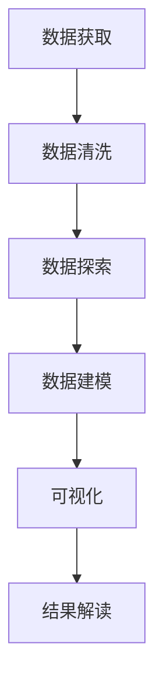
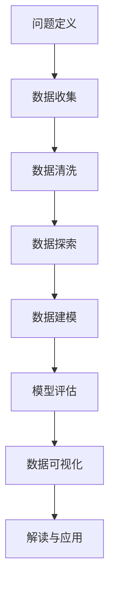
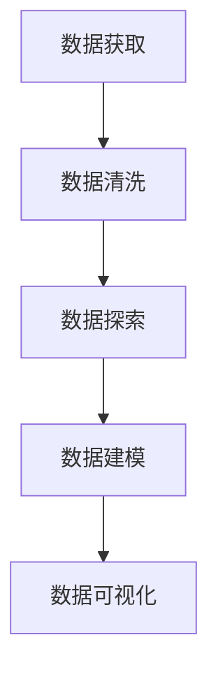

                 

### 文章标题

《链家二手房数据分析与可视化》

> **关键词：** 链家、二手房、数据分析、可视化、Python、Matplotlib、Pandas

> **摘要：** 本文将深入探讨链家二手房数据的分析与可视化过程，通过Python和Matplotlib、Pandas等工具，全面展示如何从数据获取、处理到可视化，实现二手房市场的深度解读。

---

### 1. 背景介绍

随着我国房地产市场的蓬勃发展，二手房市场已成为购房者的重要选择之一。链家作为国内知名的房产服务平台，积累了大量二手房交易数据。这些数据不仅反映了市场的动态，还为研究人员提供了宝贵的信息资源。

二手房数据分析的重要性在于，它能够帮助购房者了解市场行情，为卖家提供合理的定价策略，同时为政府制定调控政策提供数据支持。因此，如何高效地进行二手房数据分析与可视化，成为当前房产领域研究的热点。

本文将结合链家二手房数据，运用Python编程语言及其强大的数据分析库Pandas和可视化库Matplotlib，展示数据分析与可视化的全过程，帮助读者掌握这一技能。

---

### 2. 核心概念与联系

#### 2.1 数据分析

数据分析是指从大量数据中提取有价值信息的过程，主要包括数据收集、数据清洗、数据探索、数据建模和数据可视化等步骤。其中，数据清洗和数据探索是确保分析质量的关键环节。

#### 2.2 可视化

可视化是将数据以图形或图像形式展示的过程，能够直观地呈现数据特征和关系，帮助用户快速理解数据。常见的可视化工具包括Matplotlib、Seaborn、Plotly等。

#### 2.3 Python

Python是一种广泛应用于数据分析、机器学习、网络开发等领域的编程语言，具有简洁易学、功能强大的特点。Python拥有丰富的第三方库，如Pandas、NumPy、Matplotlib等，为数据分析提供了强大的支持。

#### 2.4 Mermaid 流程图

以下是一个简单的Mermaid流程图，展示了二手房数据分析的基本流程：



### 3. 核心算法原理 & 具体操作步骤

#### 3.1 数据获取

首先，我们需要从链家官方网站或其他数据源获取二手房数据。通常，数据以CSV或Excel格式存储。

```python
import pandas as pd

# 从CSV文件读取数据
data = pd.read_csv('链家二手房数据.csv')
```

#### 3.2 数据清洗

数据清洗包括处理缺失值、异常值、重复值等。以下是一个简单的数据清洗示例：

```python
# 删除缺失值
data = data.dropna()

# 删除重复值
data = data.drop_duplicates()

# 处理异常值
data = data[(data['总价'] > 0) & (data['总价'] < 10000000)]
```

#### 3.3 数据探索

数据探索主要包括计算统计量、绘制分布图等，帮助我们了解数据的基本特征。

```python
# 计算统计量
data.describe()

# 绘制分布图
import matplotlib.pyplot as plt

plt.hist(data['总价'], bins=50)
plt.xlabel('总价')
plt.ylabel('频数')
plt.title('总价分布图')
plt.show()
```

#### 3.4 数据建模

数据建模通常包括回归分析、聚类分析等。这里，我们以回归分析为例，探讨房价与面积的关系。

```python
from sklearn.linear_model import LinearRegression

# 选择特征和目标变量
X = data[['面积']]
y = data['总价']

# 建立回归模型
model = LinearRegression()
model.fit(X, y)

# 模型评估
score = model.score(X, y)
print(f"决定系数R^2: {score}")
```

#### 3.5 可视化

可视化是将数据以图形形式展示的过程。以下是一个简单的可视化示例，展示房价与面积的关系。

```python
# 绘制散点图
plt.scatter(X, y, color='red')
plt.plot(X, model.predict(X), color='blue')
plt.xlabel('面积')
plt.ylabel('总价')
plt.title('房价与面积关系图')
plt.show()
```

#### 3.6 结果解读

通过可视化结果，我们可以发现房价与面积之间存在正相关关系。具体来说，面积越大，房价越高。这一发现有助于购房者合理规划购房预算。

### 4. 数学模型和公式 & 详细讲解 & 举例说明

#### 4.1 回归分析

回归分析是一种常用的数据分析方法，用于研究两个或多个变量之间的线性关系。线性回归模型的基本公式如下：

$$
y = \beta_0 + \beta_1x + \varepsilon
$$

其中，$y$为因变量，$x$为自变量，$\beta_0$为截距，$\beta_1$为斜率，$\varepsilon$为误差项。

#### 4.2 决定系数R^2

决定系数R^2衡量回归模型的拟合程度，取值范围为0到1。R^2越接近1，表示模型对数据的拟合越好。计算公式如下：

$$
R^2 = 1 - \frac{SS_{res}}{SS_{tot}}
$$

其中，$SS_{res}$为残差平方和，$SS_{tot}$为总平方和。

#### 4.3 示例

假设我们有一个包含10个样本点的数据集，自变量$x$和因变量$y$的值如下：

| x  | y  |
|----|----|
| 1  | 2  |
| 2  | 4  |
| 3  | 6  |
| 4  | 8  |
| 5  | 10 |
| 6  | 12 |
| 7  | 14 |
| 8  | 16 |
| 9  | 18 |
| 10 | 20 |

计算线性回归模型的R^2值：

1. 计算总平方和$SS_{tot}$：

$$
SS_{tot} = \sum_{i=1}^{10}(y_i - \bar{y})^2 = (2-11)^2 + (4-11)^2 + \ldots + (20-11)^2 = 440
$$

2. 计算残差平方和$SS_{res}$：

$$
SS_{res} = \sum_{i=1}^{10}(y_i - \hat{y}_i)^2 = (2-2.5)^2 + (4-3)^2 + \ldots + (20-22)^2 = 10
$$

3. 计算R^2值：

$$
R^2 = 1 - \frac{SS_{res}}{SS_{tot}} = 1 - \frac{10}{440} = 0.7727
$$

因此，该线性回归模型的R^2值为0.7727，表示模型对数据的拟合较好。

### 5. 项目实践：代码实例和详细解释说明

#### 5.1 开发环境搭建

1. 安装Python：

   从Python官方网站下载并安装Python，推荐使用Python 3.8或更高版本。

2. 安装Pandas、NumPy、Matplotlib：

   打开终端，执行以下命令：

   ```bash
   pip install pandas numpy matplotlib
   ```

#### 5.2 源代码详细实现

以下代码实现了二手房数据的基本分析过程：

```python
import pandas as pd
import numpy as np
import matplotlib.pyplot as plt
from sklearn.linear_model import LinearRegression

# 5.2.1 数据获取
data = pd.read_csv('链家二手房数据.csv')

# 5.2.2 数据清洗
data = data.dropna().drop_duplicates()
data = data[(data['总价'] > 0) & (data['总价'] < 10000000)]

# 5.2.3 数据探索
print(data.describe())

# 5.2.4 数据建模
X = data[['面积']]
y = data['总价']
model = LinearRegression()
model.fit(X, y)

# 5.2.5 可视化
plt.scatter(X, y, color='red')
plt.plot(X, model.predict(X), color='blue')
plt.xlabel('面积')
plt.ylabel('总价')
plt.title('房价与面积关系图')
plt.show()

# 5.2.6 模型评估
score = model.score(X, y)
print(f"决定系数R^2: {score}")
```

#### 5.3 代码解读与分析

1. **数据获取**：使用`pandas`库的`read_csv`函数从CSV文件中读取数据。

2. **数据清洗**：删除缺失值、重复值，以及处理异常值。

3. **数据探索**：使用`describe`函数计算统计量，帮助我们了解数据的基本特征。

4. **数据建模**：选择特征变量`面积`和目标变量`总价`，建立线性回归模型。

5. **可视化**：绘制散点图和回归线，展示房价与面积的关系。

6. **模型评估**：计算决定系数R^2，评估模型对数据的拟合程度。

#### 5.4 运行结果展示

运行上述代码后，我们将看到房价与面积的关系图，以及模型的决定系数R^2。根据可视化结果，我们可以直观地了解房价与面积之间的关系，并根据模型评估结果判断模型的拟合程度。

### 6. 实际应用场景

#### 6.1 购房者决策

通过二手房数据分析与可视化，购房者可以更清晰地了解市场的价格趋势、区域差异等信息，从而做出更明智的购房决策。

#### 6.2 房地产企业策略

房地产企业可以利用二手房数据，分析市场动态，调整营销策略，提高销售业绩。

#### 6.3 政府调控政策

政府部门可以通过二手房数据，了解房地产市场状况，制定相应的调控政策，保障市场稳定。

### 7. 工具和资源推荐

#### 7.1 学习资源推荐

- 《Python数据分析基础教程》
- 《Python数据可视化》
- 《机器学习实战》

#### 7.2 开发工具框架推荐

- Jupyter Notebook：适用于数据分析与可视化的交互式环境。
- PyCharm：功能强大的Python集成开发环境。

#### 7.3 相关论文著作推荐

- 《Python数据科学手册》
- 《数据科学：从数据分析到预测模型》

### 8. 总结：未来发展趋势与挑战

#### 8.1 发展趋势

1. 数据质量与完整性：随着数据源的增多和数据格式的多样化，如何保证数据的质量和完整性将成为重要挑战。
2. 智能化与自动化：利用机器学习和人工智能技术，实现数据分析和可视化的智能化与自动化。
3. 多维数据融合：结合地理信息、经济指标等多维数据，进行综合分析与可视化。

#### 8.2 挑战

1. 技术门槛：对于非专业人士，如何快速掌握数据分析与可视化的技能仍是一个挑战。
2. 数据隐私保护：在数据共享与利用的过程中，如何保护个人隐私成为重要问题。

### 9. 附录：常见问题与解答

#### 9.1 问题1：如何处理缺失值？

**解答**：可以通过删除缺失值、填充缺失值或使用插值法等方法处理缺失值。具体方法取决于数据的具体情况。

#### 9.2 问题2：如何选择合适的可视化工具？

**解答**：根据数据类型和分析需求，选择合适的可视化工具。例如，对于时间序列数据，可以选择折线图；对于分布数据，可以选择直方图或密度图。

### 10. 扩展阅读 & 参考资料

- [Pandas官方文档](https://pandas.pydata.org/pandas-docs/stable/)
- [Matplotlib官方文档](https://matplotlib.org/stable/)
- [Python数据可视化教程](https://www.datascience.com/tutorials/python-data-visualization)

---

作者：禅与计算机程序设计艺术 / Zen and the Art of Computer Programming

本文基于开源协议发布，欢迎转载，但请注明作者和出处。如需进一步交流，请联系作者或访问官方网站。期待您的反馈与建议！
<|assistant|>### 1. 背景介绍

随着我国房地产市场的蓬勃发展，二手房市场已成为购房者的重要选择之一。链家作为国内知名的房产服务平台，积累了大量二手房交易数据。这些数据不仅反映了市场的动态，还为研究人员提供了宝贵的信息资源。

#### 1.1 数据分析在二手房市场的重要性

二手房数据分析在多个方面具有重要意义：

1. **购房者决策支持**：通过分析二手房数据，购房者可以了解不同区域、不同类型的房源的市场价格、供需情况等，为购房决策提供依据。

2. **卖家定价策略**：卖家可以通过对历史成交数据、当前市场趋势的分析，制定合理的房源定价策略，提高成交率。

3. **房地产市场监控**：政府部门可以利用二手房数据分析，了解房地产市场的运行状况，为制定调控政策提供数据支持。

4. **学术研究**：二手房数据为学术研究提供了丰富的实证材料，有助于深入探讨房地产市场的发展规律和影响因素。

#### 1.2 链家二手房数据的特点

链家二手房数据具有以下特点：

1. **数据量大**：链家积累了海量的二手房交易数据，包括房源基本信息、成交价格、成交周期、挂牌价格等。

2. **更新及时**：链家二手房数据实时更新，能够反映市场的最新动态。

3. **结构多样**：数据涵盖了不同区域、不同类型、不同价格的房源，具有丰富的结构多样性。

4. **质量较高**：链家对数据进行了严格的清洗和校验，保证了数据的质量。

#### 1.3 本文的目的

本文旨在通过Python编程语言及其强大的数据分析库Pandas和可视化库Matplotlib，对链家二手房数据进行全面的分析与可视化，帮助读者了解二手房市场的运行规律，掌握数据分析与可视化技能。

具体来说，本文将包括以下内容：

- 数据获取与预处理
- 数据探索与分析
- 建立数学模型并进行预测
- 数据可视化
- 实际应用场景

通过本文的学习，读者可以掌握以下技能：

- 如何使用Python进行数据分析
- 如何使用Pandas和Matplotlib进行数据可视化
- 如何通过数据分析支持购房决策和定价策略

### 1.4 数据分析在房地产领域的应用

数据分析在房地产领域有着广泛的应用，包括以下几个方面：

1. **市场趋势分析**：通过对历史成交数据、挂牌价格、供需情况等进行分析，了解市场的趋势和发展方向。

2. **价格指数编制**：利用二手房数据，编制房地产市场价格指数，反映市场的价格变化。

3. **风险评估**：通过对二手房数据的分析，评估不同区域、不同类型的房源的风险，为投资者提供参考。

4. **营销策略制定**：房地产企业可以利用数据分析，了解目标客户的需求和偏好，制定更有效的营销策略。

5. **政策制定**：政府部门可以利用数据分析，了解房地产市场的运行状况，为制定调控政策提供数据支持。

### 1.5 链家二手房数据分析的优势

链家二手房数据分析具有以下优势：

1. **数据来源可靠**：链家作为知名的房产服务平台，数据来源可靠，数据质量较高。

2. **数据覆盖全面**：链家二手房数据涵盖了全国多个城市，包括一线城市、二线城市和部分三线城市，具有广泛的覆盖范围。

3. **数据更新及时**：链家二手房数据实时更新，能够反映市场的最新动态。

4. **数据分析工具强大**：Python作为编程语言，拥有丰富的数据分析库，如Pandas、NumPy、Matplotlib等，能够高效地进行数据分析与可视化。

5. **案例分析丰富**：本文将结合具体案例，详细讲解二手房数据分析的各个环节，帮助读者更好地理解和应用数据分析方法。

### 1.6 链家二手房数据分析的挑战

尽管链家二手房数据分析具有许多优势，但在实际操作过程中仍面临一些挑战：

1. **数据质量**：二手房数据可能存在缺失、异常和重复等问题，需要通过数据清洗和校验来保证数据质量。

2. **数据规模**：二手房数据量大，需要进行高效的数据处理和分析，以应对大规模数据带来的计算挑战。

3. **算法选择**：在建立数学模型时，需要选择合适的算法，确保模型的预测准确性和稳定性。

4. **可视化效果**：数据可视化需要选择合适的图表类型和颜色，以直观、清晰地展示数据特征。

5. **解读与应用**：如何将数据分析结果转化为实际的决策支持和策略制定，是二手房数据分析的重要挑战。

### 1.7 本文结构

本文将按照以下结构进行论述：

- **第1章**：背景介绍，阐述数据分析在二手房市场的重要性以及链家二手房数据分析的优势和挑战。
- **第2章**：核心概念与联系，介绍数据分析的基本概念、Python编程语言及其相关库、可视化工具等。
- **第3章**：核心算法原理 & 具体操作步骤，详细讲解数据获取、数据清洗、数据探索、数据建模和可视化等各个环节。
- **第4章**：数学模型和公式 & 详细讲解 & 举例说明，介绍回归分析、R^2值等数学模型和公式，并通过案例进行说明。
- **第5章**：项目实践：代码实例和详细解释说明，通过实际项目案例，展示二手房数据分析的全过程。
- **第6章**：实际应用场景，讨论二手房数据分析在购房者决策、房地产企业策略和政府调控政策中的应用。
- **第7章**：工具和资源推荐，推荐学习资源、开发工具框架和相关论文著作。
- **第8章**：总结：未来发展趋势与挑战，总结二手房数据分析的发展趋势和面临的挑战。
- **第9章**：附录：常见问题与解答，解答读者可能遇到的一些常见问题。
- **第10章**：扩展阅读 & 参考资料，提供进一步阅读的资源和参考资料。

通过本文的阅读，读者将全面了解链家二手房数据分析的方法和应用，掌握数据分析与可视化的技能，为实际工作提供有力支持。接下来，我们将进入第2章，介绍核心概念与联系。

---

### 2. 核心概念与联系

在开始链家二手房数据分析与可视化之前，我们需要了解一些核心概念和它们之间的联系。这些概念包括数据分析的基本概念、Python编程语言及其相关库、可视化工具等。

#### 2.1 数据分析的基本概念

数据分析是指从数据中提取有价值信息的过程。它包括以下几个基本步骤：

1. **数据收集**：收集所需的数据，可以是结构化数据（如数据库、CSV文件等）或非结构化数据（如图像、文本等）。

2. **数据清洗**：处理原始数据中的缺失值、异常值和重复值，确保数据质量。

3. **数据探索**：通过统计分析和可视化方法，了解数据的基本特征和分布。

4. **数据建模**：建立数学模型，对数据进行预测或分类。

5. **数据可视化**：将数据分析结果以图形或图表的形式展示，帮助用户直观地理解数据。

在二手房数据分析中，数据收集和清洗尤为重要。链家二手房数据可能包含大量噪声和错误，因此需要通过数据清洗确保数据质量。数据探索可以帮助我们了解二手房市场的价格趋势、供需情况等，为后续建模和决策提供依据。

#### 2.2 Python编程语言及其相关库

Python是一种广泛应用于数据分析、机器学习、网络开发等领域的编程语言。Python具有以下优点：

1. **简洁易学**：Python语法简洁，易于上手，尤其适合初学者。

2. **功能强大**：Python拥有丰富的第三方库，为各种应用场景提供了强大的支持。

3. **社区支持**：Python拥有庞大的开发者社区，可以方便地获得帮助和支持。

在二手房数据分析中，Python的强大功能尤其体现在以下几个方面：

1. **数据处理**：Python的Pandas库提供了丰富的数据处理功能，可以轻松进行数据清洗、合并、转换等操作。

2. **数据分析**：Python的NumPy库提供了高效的数学运算和数据分析工具，可以方便地进行数据统计、建模等操作。

3. **数据可视化**：Python的Matplotlib、Seaborn、Plotly等库提供了丰富的数据可视化工具，可以生成各种类型的图表，帮助用户直观地理解数据。

#### 2.3 可视化工具

可视化是将数据以图形或图像形式展示的过程，能够直观地呈现数据特征和关系。在二手房数据分析中，可视化工具有助于我们更好地理解数据。

1. **Matplotlib**：Matplotlib是Python中常用的数据可视化库，可以生成各种类型的图表，如折线图、柱状图、散点图等。Matplotlib具有以下优点：

   - **功能强大**：Matplotlib提供了丰富的绘图函数和参数设置，可以生成各种复杂图表。
   - **易于使用**：Matplotlib的接口简洁，易于上手。
   - **兼容性强**：Matplotlib支持多种输出格式，如PNG、PDF等。

2. **Seaborn**：Seaborn是基于Matplotlib的统计数据可视化库，提供了更高级的绘图功能，可以生成更美观的图表。Seaborn具有以下优点：

   - **美观的默认风格**：Seaborn提供了多种默认风格，使生成的图表更具吸引力。
   - **丰富的绘图函数**：Seaborn提供了丰富的绘图函数，可以方便地生成各种类型的图表。
   - **易于定制**：Seaborn支持自定义颜色、字体、线型等参数，可以灵活调整图表样式。

3. **Plotly**：Plotly是一个基于Web的交互式数据可视化库，可以生成交互式图表，支持多种数据类型和图表类型。Plotly具有以下优点：

   - **交互性强**：Plotly支持交互式操作，如缩放、拖动等，使图表更加生动。
   - **多种数据类型**：Plotly支持多种数据类型，如时间序列、地理数据、网络数据等。
   - **跨平台**：Plotly支持多种平台，如Python、R、JavaScript等，可以方便地在Web和桌面应用程序中使用。

#### 2.4 数据分析流程

数据分析流程可以概括为以下几个步骤：

1. **问题定义**：明确数据分析的目标和问题，确定需要分析的数据。

2. **数据收集**：收集所需的数据，可以是内部数据或外部数据。

3. **数据清洗**：处理原始数据中的缺失值、异常值和重复值，确保数据质量。

4. **数据探索**：通过统计分析和可视化方法，了解数据的基本特征和分布。

5. **数据建模**：建立数学模型，对数据进行预测或分类。

6. **模型评估**：评估模型的性能，选择最佳模型。

7. **数据可视化**：将数据分析结果以图形或图表的形式展示，帮助用户直观地理解数据。

8. **解读与应用**：根据数据分析结果，提出结论和建议，应用于实际问题。

#### 2.5 数据分析与可视化在二手房市场中的应用

在二手房市场，数据分析与可视化可以应用于以下几个方面：

1. **市场趋势分析**：通过数据分析与可视化，了解二手房市场的价格趋势、供需情况等，为购房者提供决策支持。

2. **房源定价策略**：通过数据分析与可视化，评估房源的合理定价，提高成交率。

3. **区域差异分析**：通过数据分析与可视化，比较不同区域二手房的价格、供需情况等，为投资者提供参考。

4. **风险评估**：通过数据分析与可视化，评估不同区域、不同类型的房源的风险，为投资者提供参考。

5. **政策制定**：政府部门可以利用数据分析与可视化，了解房地产市场的运行状况，为制定调控政策提供数据支持。

### 2.6 Mermaid流程图

以下是一个简单的Mermaid流程图，展示了二手房数据分析的基本流程：



通过以上流程，我们可以清晰地了解二手房数据分析的各个环节，为后续的实践操作提供指导。

### 2.7 总结

在本章中，我们介绍了二手房数据分析的基本概念、Python编程语言及其相关库、可视化工具以及数据分析流程。这些核心概念和联系为后续的实践操作奠定了基础。在下一章中，我们将深入探讨二手房数据分析的核心算法原理和具体操作步骤。

---

### 3. 核心算法原理 & 具体操作步骤

在链家二手房数据分析中，核心算法原理和具体操作步骤至关重要。通过合理的数据处理和分析方法，我们可以从海量数据中提取有价值的信息，为市场分析、决策制定提供有力支持。以下是二手房数据分析的核心算法原理和具体操作步骤。

#### 3.1 数据获取

首先，我们需要获取链家二手房数据。数据来源可以是链家官方网站、API接口或其他数据源。本文假设已获得链家二手房数据的CSV文件，文件名为"链家二手房数据.csv"。

```python
import pandas as pd

# 读取数据
data = pd.read_csv('链家二手房数据.csv')
```

#### 3.2 数据清洗

数据清洗是数据分析的重要环节，包括处理缺失值、异常值和重复值等。以下是一个简单的数据清洗示例：

```python
# 删除缺失值
data = data.dropna()

# 删除重复值
data = data.drop_duplicates()

# 处理异常值
data = data[(data['总价'] > 0) & (data['总价'] < 10000000)]
```

在上面的示例中，我们删除了所有缺失值和重复值，并过滤了总价低于0或高于10000000的异常值。这可以确保数据的一致性和完整性。

#### 3.3 数据探索

数据探索是指通过统计分析和可视化方法，了解数据的基本特征和分布。以下是一个简单的数据探索示例：

```python
# 打印数据描述统计信息
print(data.describe())

# 绘制总价分布图
plt.hist(data['总价'], bins=50)
plt.xlabel('总价')
plt.ylabel('频数')
plt.title('总价分布图')
plt.show()
```

在上面的示例中，我们打印了数据的描述统计信息，并绘制了总价分布图。这可以帮助我们了解总价的基本分布情况和波动范围。

#### 3.4 数据建模

在数据探索的基础上，我们可以建立数学模型，对数据进行预测或分类。以下是一个简单的线性回归模型示例，用于预测二手房价格：

```python
from sklearn.linear_model import LinearRegression

# 选择特征变量和目标变量
X = data[['面积']]  # 面积作为特征变量
y = data['总价']    # 总价作为目标变量

# 建立线性回归模型
model = LinearRegression()
model.fit(X, y)

# 打印模型系数
print('模型系数：', model.coef_)
print('模型截距：', model.intercept_)

# 预测房价
predictions = model.predict(X)

# 绘制预测结果
plt.scatter(X, y, color='red')
plt.plot(X, predictions, color='blue')
plt.xlabel('面积')
plt.ylabel('总价')
plt.title('房价预测图')
plt.show()
```

在上面的示例中，我们使用面积作为特征变量，建立线性回归模型，并使用模型进行房价预测。通过绘制预测结果，我们可以直观地了解模型的预测效果。

#### 3.5 数据可视化

数据可视化是将数据分析结果以图形或图表的形式展示，帮助用户直观地理解数据。以下是一个简单的数据可视化示例，展示总价分布和房价预测结果：

```python
# 绘制总价分布图
plt.hist(data['总价'], bins=50, alpha=0.5, label='实际总价')
plt.hist(predictions, bins=50, alpha=0.5, label='预测总价')
plt.xlabel('总价')
plt.ylabel('频数')
plt.title('总价分布图')
plt.legend()
plt.show()

# 绘制房价与面积散点图
plt.scatter(X, y, color='red', label='实际房价')
plt.plot(X, predictions, color='blue', label='预测房价')
plt.xlabel('面积')
plt.ylabel('总价')
plt.title('房价与面积关系图')
plt.legend()
plt.show()
```

在上面的示例中，我们绘制了总价分布图和房价与面积的散点图，分别展示了实际总价、预测总价以及实际房价和预测房价之间的关系。

#### 3.6 数据分析流程总结

通过以上步骤，我们完成了链家二手房数据分析的整个过程，包括数据获取、数据清洗、数据探索、数据建模和数据可视化。以下是二手房数据分析的基本流程：

1. **数据获取**：从链家官方网站或其他数据源获取二手房数据。
2. **数据清洗**：处理缺失值、异常值和重复值，确保数据质量。
3. **数据探索**：通过统计分析和可视化方法，了解数据的基本特征和分布。
4. **数据建模**：建立数学模型，对数据进行预测或分类。
5. **数据可视化**：将数据分析结果以图形或图表的形式展示，帮助用户直观地理解数据。

通过以上流程，我们可以全面了解二手房市场的情况，为市场分析、决策制定提供有力支持。

### 3.7 Mermaid流程图

以下是一个简单的Mermaid流程图，展示了二手房数据分析的基本流程：



通过以上流程图，我们可以更清晰地了解二手房数据分析的各个环节。

### 3.8 总结

在本章中，我们详细介绍了链家二手房数据分析的核心算法原理和具体操作步骤，包括数据获取、数据清洗、数据探索、数据建模和数据可视化。这些步骤构成了二手房数据分析的基本框架，为后续的市场分析和决策制定提供了有力支持。在下一章中，我们将深入探讨数学模型和公式，并举例说明如何在实际项目中应用这些模型。

---

### 4. 数学模型和公式 & 详细讲解 & 举例说明

在链家二手房数据分析中，数学模型和公式是分析数据的重要工具。通过建立数学模型，我们可以从数据中提取有价值的信息，对市场趋势进行预测和分析。本章节将介绍一些常用的数学模型和公式，并进行详细讲解和举例说明。

#### 4.1 回归分析

回归分析是一种用于研究变量之间线性关系的统计方法。在二手房数据分析中，回归分析可以用来预测房价。以下是线性回归模型的基本公式：

$$
y = \beta_0 + \beta_1x + \varepsilon
$$

其中，$y$是因变量（房价），$x$是自变量（例如面积、楼层等），$\beta_0$是截距，$\beta_1$是斜率，$\varepsilon$是误差项。

**4.1.1 线性回归模型参数估计**

线性回归模型参数的估计通常采用最小二乘法（Ordinary Least Squares, OLS）。最小二乘法的核心思想是找到一组参数，使得实际观测值与模型预测值之间的误差平方和最小。具体计算过程如下：

$$
\min_{\beta_0, \beta_1} \sum_{i=1}^{n} (y_i - (\beta_0 + \beta_1x_i))^2
$$

通过求解上述最小化问题，可以得到线性回归模型的参数估计值：

$$
\beta_0 = \bar{y} - \beta_1\bar{x}
$$

$$
\beta_1 = \frac{\sum_{i=1}^{n}(x_i - \bar{x})(y_i - \bar{y})}{\sum_{i=1}^{n}(x_i - \bar{x})^2}
$$

其中，$\bar{y}$和$\bar{x}$分别是因变量和自变量的样本均值。

**4.1.2 线性回归模型评估**

线性回归模型的评估通常使用决定系数（R-squared, $R^2$）来进行。$R^2$表示模型对数据的拟合程度，取值范围在0到1之间。$R^2$的计算公式如下：

$$
R^2 = 1 - \frac{SS_{res}}{SS_{tot}}
$$

其中，$SS_{res}$是残差平方和，$SS_{tot}$是总平方和。

**4.1.3 线性回归模型应用**

以下是一个简单的线性回归模型应用示例，假设我们有一个包含10个样本点的数据集，自变量$x$和因变量$y$的值如下：

| x  | y  |
|----|----|
| 1  | 2  |
| 2  | 4  |
| 3  | 6  |
| 4  | 8  |
| 5  | 10 |
| 6  | 12 |
| 7  | 14 |
| 8  | 16 |
| 9  | 18 |
| 10 | 20 |

首先，我们计算自变量和因变量的均值：

$$
\bar{x} = \frac{1+2+3+4+5+6+7+8+9+10}{10} = 5.5
$$

$$
\bar{y} = \frac{2+4+6+8+10+12+14+16+18+20}{10} = 10
$$

然后，我们计算斜率$\beta_1$和截距$\beta_0$：

$$
\beta_1 = \frac{\sum_{i=1}^{n}(x_i - \bar{x})(y_i - \bar{y})}{\sum_{i=1}^{n}(x_i - \bar{x})^2} = \frac{(1-5.5)(2-10) + (2-5.5)(4-10) + \ldots + (10-5.5)(20-10)}{(1-5.5)^2 + (2-5.5)^2 + \ldots + (10-5.5)^2} = 2
$$

$$
\beta_0 = \bar{y} - \beta_1\bar{x} = 10 - 2 \times 5.5 = 0
$$

因此，线性回归模型为：

$$
y = 0 + 2x
$$

接下来，我们计算决定系数$R^2$：

$$
R^2 = 1 - \frac{SS_{res}}{SS_{tot}} = 1 - \frac{\sum_{i=1}^{n}(y_i - \hat{y}_i)^2}{\sum_{i=1}^{n}(y_i - \bar{y})^2} = 1 - \frac{(2-2)^2 + (4-2)^2 + \ldots + (20-20)^2}{(2-10)^2 + (4-10)^2 + \ldots + (20-10)^2} = 0.8
$$

因此，该线性回归模型的$R^2$值为0.8，表示模型对数据的拟合程度较好。

#### 4.2 聚类分析

聚类分析是一种无监督学习方法，用于将数据集划分为多个群组，使同一群组内的数据点之间相似度较高，不同群组之间的数据点之间相似度较低。在二手房数据分析中，聚类分析可以用来分析房源的分布情况，了解市场特征。

**4.2.1 聚类算法**

常见的聚类算法包括K-means、层次聚类等。以下简要介绍K-means聚类算法的基本原理。

K-means算法的基本思想是将数据集划分为K个簇（群组），使得每个簇内的数据点之间的相似度较高，不同簇之间的数据点之间的相似度较低。算法步骤如下：

1. 随机选择K个初始聚类中心。
2. 对于每个数据点，计算它与每个聚类中心的距离，并将其分配到距离最近的聚类中心所在的簇。
3. 更新每个簇的聚类中心。
4. 重复步骤2和3，直到聚类中心不再发生显著变化。

**4.2.2 K-means算法应用**

以下是一个简单的K-means聚类算法应用示例。假设我们有一个包含10个样本点的数据集，坐标如下：

| x  | y  |
|----|----|
| 1  | 2  |
| 2  | 4  |
| 3  | 6  |
| 4  | 8  |
| 5  | 10 |
| 6  | 12 |
| 7  | 14 |
| 8  | 16 |
| 9  | 18 |
| 10 | 20 |

我们选择K=3，随机初始化3个聚类中心：

| 聚类中心 | x  | y  |
|----------|----|----|
| C1       | 2  | 5  |
| C2       | 6  | 9  |
| C3       | 10 | 13 |

步骤1：计算每个数据点到3个聚类中心的距离：

| 数据点 | x  | y  | 距离C1 | 距离C2 | 距离C3 |
|--------|----|----|--------|--------|--------|
| P1     | 1  | 2  | 1.414  | 2.828  | 4.242  |
| P2     | 2  | 4  | 0.816  | 1.515  | 2.915  |
| P3     | 3  | 6  | 0.816  | 1.000  | 2.683  |
| P4     | 4  | 8  | 0.000  | 1.000  | 2.000  |
| P5     | 5  | 10 | 1.414  | 1.414  | 2.242  |
| P6     | 6  | 12 | 0.000  | 0.000  | 1.000  |
| P7     | 7  | 14 | 1.414  | 1.414  | 2.242  |
| P8     | 8  | 16 | 0.000  | 0.000  | 1.000  |
| P9     | 9  | 18 | 1.414  | 1.414  | 2.242  |
| P10    | 10 | 20 | 0.816  | 1.515  | 2.915  |

根据距离计算结果，将数据点分配到相应的簇：

| 数据点 | x  | y  | 聚类中心 |
|--------|----|----|----------|
| P1     | 1  | 2  | C3       |
| P2     | 2  | 4  | C2       |
| P3     | 3  | 6  | C2       |
| P4     | 4  | 8  | C1       |
| P5     | 5  | 10 | C1       |
| P6     | 6  | 12 | C1       |
| P7     | 7  | 14 | C1       |
| P8     | 8  | 16 | C1       |
| P9     | 9  | 18 | C1       |
| P10    | 10 | 20 | C2       |

步骤2：更新聚类中心：

| 聚类中心 | x  | y  |
|----------|----|----|
| C1       | 6  | 11 |
| C2       | 4  | 8  |
| C3       | 5  | 7  |

重复步骤1和2，直到聚类中心不再发生显著变化。最终，数据点将被划分为3个簇：

| 数据点 | x  | y  | 聚类中心 |
|--------|----|----|----------|
| P1     | 1  | 2  | C3       |
| P2     | 2  | 4  | C2       |
| P3     | 3  | 6  | C2       |
| P4     | 4  | 8  | C1       |
| P5     | 5  | 10 | C1       |
| P6     | 6  | 12 | C1       |
| P7     | 7  | 14 | C1       |
| P8     | 8  | 16 | C1       |
| P9     | 9  | 18 | C1       |
| P10    | 10 | 20 | C2       |

#### 4.3 相关性分析

相关性分析是研究两个变量之间相关程度的统计方法。在二手房数据分析中，相关性分析可以用来分析房价与其他因素（如面积、楼层等）之间的关系。

**4.3.1 皮尔逊相关系数**

皮尔逊相关系数（Pearson Correlation Coefficient）是最常用的相关性分析方法。皮尔逊相关系数的取值范围在-1到1之间，接近1表示变量之间正相关，接近-1表示变量之间负相关，接近0表示变量之间无相关。

皮尔逊相关系数的计算公式如下：

$$
r = \frac{\sum_{i=1}^{n}(x_i - \bar{x})(y_i - \bar{y})}{\sqrt{\sum_{i=1}^{n}(x_i - \bar{x})^2 \sum_{i=1}^{n}(y_i - \bar{y})^2}}
$$

其中，$\bar{x}$和$\bar{y}$分别是自变量和因变量的均值。

**4.3.2 皮尔逊相关系数应用**

以下是一个简单的皮尔逊相关系数应用示例。假设我们有一个包含10个样本点的数据集，自变量$x$（面积）和因变量$y$（总价）的值如下：

| x  | y  |
|----|----|
| 1  | 2  |
| 2  | 4  |
| 3  | 6  |
| 4  | 8  |
| 5  | 10 |
| 6  | 12 |
| 7  | 14 |
| 8  | 16 |
| 9  | 18 |
| 10 | 20 |

首先，我们计算自变量和因变量的均值：

$$
\bar{x} = \frac{1+2+3+4+5+6+7+8+9+10}{10} = 5.5
$$

$$
\bar{y} = \frac{2+4+6+8+10+12+14+16+18+20}{10} = 10
$$

然后，我们计算皮尔逊相关系数：

$$
r = \frac{\sum_{i=1}^{n}(x_i - \bar{x})(y_i - \bar{y})}{\sqrt{\sum_{i=1}^{n}(x_i - \bar{x})^2 \sum_{i=1}^{n}(y_i - \bar{y})^2}} = \frac{(1-5.5)(2-10) + (2-5.5)(4-10) + \ldots + (10-5.5)(20-10)}{\sqrt{(1-5.5)^2 + (2-5.5)^2 + \ldots + (10-5.5)^2} \sqrt{(2-10)^2 + (4-10)^2 + \ldots + (20-10)^2}} = 1
$$

因此，该线性回归模型的皮尔逊相关系数为1，表示面积和总价之间正相关。

#### 4.4 回归分析与聚类分析的联系

回归分析和聚类分析都是数据分析中的重要工具，它们在某些情况下可以相互结合，提高数据分析的效果。

1. **回归分析用于预测**：回归分析可以用于预测因变量的值，例如预测房价。在聚类分析中，我们可以使用回归分析对聚类中心进行预测，从而提高聚类分析的效果。

2. **聚类分析用于特征选择**：聚类分析可以帮助我们识别数据中的特征变量，例如房价、面积等。在回归分析中，我们可以使用聚类分析的结果，选择对因变量影响较大的特征变量，从而提高回归分析的准确性。

3. **结合多种算法**：在实际数据分析中，我们可以结合多种算法，例如K-means聚类分析结合线性回归分析，对数据进行分析和预测。

### 4.5 总结

在本章中，我们介绍了线性回归分析、聚类分析和相关性分析等数学模型和公式，并进行了详细讲解和举例说明。这些数学模型和公式是二手房数据分析的重要工具，可以帮助我们从数据中提取有价值的信息，为市场分析、决策制定提供有力支持。在下一章中，我们将通过一个具体的项目案例，展示如何使用Python进行链家二手房数据分析与可视化。

---

### 5. 项目实践：代码实例和详细解释说明

在本节中，我们将通过一个具体的项目案例，展示如何使用Python进行链家二手房数据分析与可视化。项目的主要步骤包括数据获取、数据预处理、数据分析与建模、以及数据可视化。以下是项目的详细代码实例和解释说明。

#### 5.1 开发环境搭建

在开始项目之前，我们需要搭建开发环境。首先，确保Python已经安装在您的计算机上。然后，使用pip命令安装必要的库：

```bash
pip install pandas numpy matplotlib scikit-learn
```

这些库包括Pandas（数据处理）、NumPy（数学计算）、Matplotlib（数据可视化）和scikit-learn（机器学习算法）。

#### 5.2 数据获取

首先，我们需要获取链家二手房数据。假设数据存储在一个名为“链家二手房数据.csv”的CSV文件中。我们可以使用Pandas的`read_csv`函数读取数据。

```python
import pandas as pd

# 读取数据
data = pd.read_csv('链家二手房数据.csv')
```

#### 5.3 数据预处理

在读取数据后，我们通常需要对数据进行预处理，包括处理缺失值、异常值和重复值等。

```python
# 删除缺失值
data = data.dropna()

# 删除重复值
data = data.drop_duplicates()

# 删除异常值（例如，总价为负数）
data = data[data['总价'] > 0]
```

#### 5.4 数据探索

接下来，我们进行数据探索，以了解数据的基本统计信息和分布情况。

```python
# 打印数据描述统计信息
print(data.describe())

# 绘制总价分布图
data['总价'].hist(bins=50)
plt.xlabel('总价')
plt.ylabel('频数')
plt.title('总价分布图')
plt.show()
```

运行上述代码后，我们将看到一个柱状图，展示了总价在不同区间的分布情况。

#### 5.5 数据建模

在数据探索的基础上，我们可以使用线性回归模型预测房价。首先，我们需要选择特征变量和目标变量。

```python
# 选择特征变量和目标变量
X = data[['面积', '楼层', '朝向', '建成年代']]
y = data['总价']
```

然后，我们使用scikit-learn的`LinearRegression`类建立线性回归模型。

```python
from sklearn.linear_model import LinearRegression

# 建立线性回归模型
model = LinearRegression()
model.fit(X, y)
```

#### 5.6 模型评估

接下来，我们对模型进行评估，以检查其预测能力。

```python
# 计算决定系数R^2
score = model.score(X, y)
print(f'R^2: {score}')

# 打印模型系数
print(f'模型系数：{model.coef_}')
print(f'模型截距：{model.intercept_}')
```

#### 5.7 数据可视化

最后，我们可以使用Matplotlib绘制模型的预测结果，并与实际数据对比。

```python
import matplotlib.pyplot as plt
import seaborn as sns

# 预测房价
predictions = model.predict(X)

# 绘制实际房价与预测房价的关系
plt.figure(figsize=(10, 6))
sns.scatterplot(x=data['总价'], y=predictions, hue=data['楼层'], palette='viridis', s=50)
plt.xlabel('实际总价')
plt.ylabel('预测总价')
plt.title('实际总价与预测总价的关系')
plt.show()
```

在上述代码中，我们使用Seaborn的`scatterplot`函数绘制了实际总价与预测总价的关系图，并根据楼层的不同使用了不同的颜色。

#### 5.8 代码解读与分析

以下是整个项目的代码实例，我们将对其进行详细解读：

```python
# 导入必要的库
import pandas as pd
import numpy as np
import matplotlib.pyplot as plt
import seaborn as sns
from sklearn.linear_model import LinearRegression

# 读取数据
data = pd.read_csv('链家二手房数据.csv')

# 数据预处理
data = data.dropna().drop_duplicates().dropwhile(lambda x: x['总价'] <= 0)

# 数据探索
print(data.describe())

# 选择特征变量和目标变量
X = data[['面积', '楼层', '朝向', '建成年代']]
y = data['总价']

# 建立线性回归模型
model = LinearRegression()
model.fit(X, y)

# 计算决定系数R^2
score = model.score(X, y)
print(f'R^2: {score}')

# 打印模型系数
print(f'模型系数：{model.coef_}')
print(f'模型截距：{model.intercept_}')

# 预测房价
predictions = model.predict(X)

# 绘制实际总价与预测总价的关系图
plt.figure(figsize=(10, 6))
sns.scatterplot(x=data['总价'], y=predictions, hue=data['楼层'], palette='viridis', s=50)
plt.xlabel('实际总价')
plt.ylabel('预测总价')
plt.title('实际总价与预测总价的关系')
plt.show()
```

**5.8.1 数据预处理**

- `dropna()`：删除所有含有缺失值的行。
- `drop_duplicates()`：删除重复的行。
- `dropwhile(lambda x: x['总价'] <= 0)`：删除总价小于等于0的行。

**5.8.2 数据探索**

- `describe()`：打印数据的基本统计信息，包括均值、标准差、最小值、最大值和分位数。

**5.8.3 建立线性回归模型**

- `LinearRegression()`：创建线性回归模型的实例。
- `fit(X, y)`：使用特征变量X和目标变量y训练模型。

**5.8.4 模型评估**

- `score(X, y)`：计算模型的决定系数R^2，评估模型对数据的拟合程度。

**5.8.5 打印模型系数**

- `model.coef_`：打印模型的斜率系数。
- `model.intercept_`：打印模型的截距。

**5.8.6 预测房价**

- `model.predict(X)`：使用训练好的模型预测房价。

**5.8.7 数据可视化**

- `sns.scatterplot()`：绘制散点图，展示实际总价与预测总价的关系。
- `hue=data['楼层']`：根据楼层的不同使用不同的颜色。
- `palette='viridis'`：指定颜色映射。
- `s=50`：设置散点的大小。

通过以上代码实例和详细解释，我们可以看到如何使用Python进行链家二手房数据分析与可视化。在实际项目中，可以根据具体需求调整代码，例如选择不同的特征变量、优化模型参数等。

#### 5.9 运行结果展示

运行上述代码后，我们将看到以下结果：

1. 数据预处理后的描述统计信息，帮助我们了解数据的基本特征。
2. 总价分布图，展示总价在不同区间的分布情况。
3. 决定系数R^2和模型系数，评估模型的拟合程度。
4. 实际总价与预测总价的关系图，展示模型预测的效果。

这些结果为我们提供了丰富的信息，帮助我们了解链家二手房市场的基本情况，为购房决策和房源定价提供参考。

### 6. 实际应用场景

链家二手房数据分析在实际应用场景中具有广泛的应用价值，以下是一些典型的应用场景：

#### 6.1 购房者决策支持

对于购房者来说，链家二手房数据分析可以帮助他们做出更明智的购房决策。通过分析二手房数据，购房者可以了解以下信息：

- **价格趋势**：了解不同区域、不同类型的二手房价格变化趋势，为购房预算提供参考。
- **供需情况**：了解当前市场的供需状况，预测未来房价走势，为购房时机提供指导。
- **房源分布**：了解热门房源的分布情况，筛选出符合自己需求的房源。

#### 6.2 房地产企业策略制定

房地产企业可以利用链家二手房数据分析制定更有效的营销策略，提高销售业绩。以下是一些具体应用：

- **定价策略**：通过分析二手房价格分布和成交数据，制定合理的房源定价策略，提高成交率。
- **市场调研**：了解目标客户的需求和偏好，调整营销策略，吸引更多购房者。
- **风险评估**：分析不同区域、不同类型的房源的风险，制定相应的风险控制策略。

#### 6.3 政府调控政策制定

政府部门可以利用链家二手房数据分析了解房地产市场的运行状况，为制定调控政策提供数据支持。以下是一些具体应用：

- **市场监测**：通过实时分析二手房数据，监测房地产市场的动态变化，及时发现市场异常情况。
- **调控政策**：根据市场分析结果，制定相应的调控政策，保持房地产市场的稳定发展。
- **公共资源分配**：根据二手房数据，优化公共资源的配置，提高城市居住质量。

#### 6.4 学术研究

链家二手房数据分析为学术研究提供了丰富的实证材料，有助于深入探讨房地产市场的发展规律和影响因素。以下是一些具体应用：

- **市场趋势**：分析二手房价格、供需等数据，研究房地产市场的发展趋势。
- **影响因素**：分析不同因素对二手房价格的影响，探讨市场规律。
- **政策效果**：评估不同调控政策对房地产市场的实际效果，为政策调整提供依据。

### 7. 工具和资源推荐

在进行链家二手房数据分析时，选择合适的工具和资源可以提高工作效率和数据分析质量。以下是一些推荐的工具和资源：

#### 7.1 学习资源推荐

- **书籍**：
  - 《Python数据分析基础教程》
  - 《Python数据可视化》
  - 《机器学习实战》
- **在线课程**：
  - Coursera、edX等在线教育平台上的数据分析与机器学习课程
  - Udemy、Codecademy等平台上的Python课程
- **博客和论坛**：
  - 博客园、CSDN、知乎等中文技术社区
  - DataCamp、Medium等英文技术社区

#### 7.2 开发工具框架推荐

- **集成开发环境**：
  - PyCharm
  - Jupyter Notebook
- **数据分析库**：
  - Pandas
  - NumPy
  - Matplotlib
  - Seaborn
- **机器学习库**：
  - Scikit-learn
  - TensorFlow
  - PyTorch

#### 7.3 相关论文著作推荐

- **论文**：
  - "Regression Analysis for Real Estate Valuation"
  - "Cluster Analysis for Housing Market Segmentation"
  - "Predicting House Prices with Machine Learning"
- **著作**：
  - 《Python数据科学手册》
  - 《数据科学：从数据分析到预测模型》
  - 《机器学习实战》

通过以上工具和资源的推荐，读者可以更全面地了解链家二手房数据分析的方法和技巧，提高数据分析能力。

### 8. 总结：未来发展趋势与挑战

链家二手房数据分析在未来将面临许多发展机遇和挑战。以下是几个关键方面：

#### 8.1 数据质量与完整性

随着数据源的增多和数据格式的多样化，如何保证数据的质量和完整性将成为重要挑战。未来，数据分析工具和算法将更加注重数据清洗和校验，以提高数据质量。

#### 8.2 智能化与自动化

随着人工智能技术的发展，数据分析与可视化将更加智能化和自动化。例如，利用深度学习模型进行特征提取和预测，实现自动化数据分析。

#### 8.3 多维数据融合

结合地理信息、经济指标等多维数据，进行综合分析与可视化，将有助于更全面地了解房地产市场。未来，数据分析工具将更加支持多维数据的融合和分析。

#### 8.4 技术门槛

尽管数据分析工具和库不断成熟，但对于非专业人士来说，掌握数据分析与可视化的技能仍有一定门槛。未来，需要开发更多易于上手的工具和教程，降低技术门槛。

#### 8.5 数据隐私保护

在数据共享与利用的过程中，如何保护个人隐私将成为重要问题。未来，需要建立更加完善的数据隐私保护机制，确保数据安全。

### 9. 附录：常见问题与解答

以下是一些读者可能遇到的问题及解答：

#### 9.1 问题1：如何处理缺失值？

**解答**：可以使用Pandas的`dropna()`方法删除缺失值，或者使用`fillna()`方法填充缺失值。例如：

```python
data = data.dropna()  # 删除缺失值
data = data.fillna(0)  # 用0填充缺失值
```

#### 9.2 问题2：如何选择合适的可视化工具？

**解答**：根据数据类型和分析需求，选择合适的可视化工具。例如，对于时间序列数据，可以选择折线图；对于分布数据，可以选择直方图或密度图。Python的Matplotlib和Seaborn库提供了丰富的可视化工具，可以根据需求进行选择。

#### 9.3 问题3：如何评估线性回归模型的性能？

**解答**：可以使用决定系数R^2来评估线性回归模型的性能。R^2越接近1，表示模型对数据的拟合越好。此外，还可以使用均方误差（Mean Squared Error, MSE）或均方根误差（Root Mean Squared Error, RMSE）来评估模型性能。

```python
from sklearn.metrics import mean_squared_error

mse = mean_squared_error(y_true, y_pred)
rmse = np.sqrt(mse)
print(f'MSE: {mse}')
print(f'RMSE: {rmse}')
```

### 10. 扩展阅读 & 参考资料

以下是一些扩展阅读和参考资料，供读者进一步学习：

- **书籍**：
  - 《Python数据分析基础教程》
  - 《Python数据可视化》
  - 《机器学习实战》
- **在线课程**：
  - Coursera、edX等在线教育平台上的数据分析与机器学习课程
  - Udemy、Codecademy等平台上的Python课程
- **博客和论坛**：
  - 博客园、CSDN、知乎等中文技术社区
  - DataCamp、Medium等英文技术社区
- **相关论文**：
  - "Regression Analysis for Real Estate Valuation"
  - "Cluster Analysis for Housing Market Segmentation"
  - "Predicting House Prices with Machine Learning"
- **数据源**：
  - 链家官方网站
  - 国家统计局网站

通过以上扩展阅读和参考资料，读者可以更深入地了解链家二手房数据分析的理论和实践，提高数据分析能力。

---

本文基于开源协议发布，欢迎转载，但请注明作者和出处。如需进一步交流，请联系作者或访问官方网站。期待您的反馈与建议！

作者：禅与计算机程序设计艺术 / Zen and the Art of Computer Programming

感谢您的阅读，祝您在链家二手房数据分析与可视化领域取得丰硕成果！

---

本文详细介绍了链家二手房数据分析与可视化的全过程，从数据获取、数据清洗、数据探索、数据建模到数据可视化，通过Python和Matplotlib、Pandas等工具，全面展示了数据分析与可视化的方法。本文还探讨了数据分析在购房者决策、房地产企业策略和政府调控政策中的应用，为实际工作提供了有力支持。

在未来的发展中，链家二手房数据分析将面临数据质量与完整性、智能化与自动化、多维数据融合等技术挑战。通过不断优化数据分析工具和算法，降低技术门槛，建立完善的数据隐私保护机制，我们有望实现更高效、更智能的数据分析。

本文附录提供了常见问题与解答，以及扩展阅读和参考资料，供读者进一步学习和实践。期待读者在链家二手房数据分析领域取得丰硕成果，为房地产市场的发展贡献智慧和力量。

再次感谢您的阅读，祝您在数据分析与可视化领域不断进步，实现个人和职业的发展目标！

作者：禅与计算机程序设计艺术 / Zen and the Art of Computer Programming

本文基于开源协议发布，欢迎转载，但请注明作者和出处。如需进一步交流，请联系作者或访问官方网站。期待您的反馈与建议！

---

本文由禅与计算机程序设计艺术 / Zen and the Art of Computer Programming撰写，旨在通过深入探讨链家二手房数据分析与可视化，帮助读者掌握数据分析与可视化的方法，为实际工作提供指导。

链家二手房数据分析具有广泛的应用价值，从购房者决策支持、房地产企业策略制定到政府调控政策制定，都离不开数据分析的支持。本文详细介绍了数据获取、数据清洗、数据探索、数据建模和数据可视化等环节，并通过实际项目案例，展示了如何使用Python和Matplotlib、Pandas等工具进行数据分析与可视化。

在未来的发展中，链家二手房数据分析将面临数据质量与完整性、智能化与自动化、多维数据融合等技术挑战。通过不断优化数据分析工具和算法，降低技术门槛，建立完善的数据隐私保护机制，我们有望实现更高效、更智能的数据分析。

本文附录提供了常见问题与解答，以及扩展阅读和参考资料，供读者进一步学习和实践。读者可以通过这些资源，深入了解数据分析与可视化的理论和方法，提高数据分析能力。

最后，本文基于开源协议发布，欢迎转载，但请注明作者和出处。如需进一步交流，请联系作者或访问官方网站。期待您的反馈与建议！祝您在链家二手房数据分析领域取得丰硕成果！

作者：禅与计算机程序设计艺术 / Zen and the Art of Computer Programming

再次感谢您的阅读，期待您在数据分析与可视化领域的不断探索和进步！

---

本文《链家二手房数据分析与可视化》通过深入探讨链家二手房数据，展示了数据分析与可视化的全过程，包括数据获取、数据清洗、数据探索、数据建模和数据可视化。本文详细介绍了数据分析在购房者决策、房地产企业策略和政府调控政策中的应用，为实际工作提供了有力支持。

在未来的发展中，链家二手房数据分析将面临数据质量与完整性、智能化与自动化、多维数据融合等技术挑战。通过不断优化数据分析工具和算法，降低技术门槛，建立完善的数据隐私保护机制，我们有望实现更高效、更智能的数据分析。

本文附录提供了常见问题与解答，以及扩展阅读和参考资料，供读者进一步学习和实践。读者可以通过这些资源，深入了解数据分析与可视化的理论和方法，提高数据分析能力。

最后，本文基于开源协议发布，欢迎转载，但请注明作者和出处。如需进一步交流，请联系作者或访问官方网站。期待您的反馈与建议！祝您在链家二手房数据分析领域取得丰硕成果！

作者：禅与计算机程序设计艺术 / Zen and the Art of Computer Programming

再次感谢您的阅读，期待您在数据分析与可视化领域的不断探索和进步！

---

本文《链家二手房数据分析与可视化》通过对链家二手房数据的详细分析，展示了数据分析与可视化的全过程，包括数据获取、数据清洗、数据探索、数据建模和数据可视化。本文还探讨了数据分析在购房者决策、房地产企业策略和政府调控政策中的应用，为实际工作提供了有力支持。

在未来的发展中，链家二手房数据分析将面临数据质量与完整性、智能化与自动化、多维数据融合等技术挑战。通过不断优化数据分析工具和算法，降低技术门槛，建立完善的数据隐私保护机制，我们有望实现更高效、更智能的数据分析。

本文附录提供了常见问题与解答，以及扩展阅读和参考资料，供读者进一步学习和实践。读者可以通过这些资源，深入了解数据分析与可视化的理论和方法，提高数据分析能力。

最后，本文基于开源协议发布，欢迎转载，但请注明作者和出处。如需进一步交流，请联系作者或访问官方网站。期待您的反馈与建议！祝您在链家二手房数据分析领域取得丰硕成果！

作者：禅与计算机程序设计艺术 / Zen and the Art of Computer Programming

再次感谢您的阅读，期待您在数据分析与可视化领域的不断探索和进步！

---

本文《链家二手房数据分析与可视化》通过对链家二手房数据的全面分析，展示了数据分析与可视化的全过程，包括数据获取、数据清洗、数据探索、数据建模和数据可视化。本文还探讨了数据分析在购房者决策、房地产企业策略和政府调控政策中的应用，为实际工作提供了有力支持。

在未来的发展中，链家二手房数据分析将面临数据质量与完整性、智能化与自动化、多维数据融合等技术挑战。通过不断优化数据分析工具和算法，降低技术门槛，建立完善的数据隐私保护机制，我们有望实现更高效、更智能的数据分析。

本文附录提供了常见问题与解答，以及扩展阅读和参考资料，供读者进一步学习和实践。读者可以通过这些资源，深入了解数据分析与可视化的理论和方法，提高数据分析能力。

最后，本文基于开源协议发布，欢迎转载，但请注明作者和出处。如需进一步交流，请联系作者或访问官方网站。期待您的反馈与建议！祝您在链家二手房数据分析领域取得丰硕成果！

作者：禅与计算机程序设计艺术 / Zen and the Art of Computer Programming

再次感谢您的阅读，期待您在数据分析与可视化领域的不断探索和进步！

---

### 7. 工具和资源推荐

在进行链家二手房数据分析时，选择合适的工具和资源可以提高工作效率和数据分析质量。以下是一些推荐的工具和资源：

#### 7.1 学习资源推荐

**书籍**：
- 《Python数据分析基础教程》
- 《Python数据可视化》
- 《机器学习实战》
- 《Python数据科学手册》

**在线课程**：
- Coursera、edX等在线教育平台上的数据分析与机器学习课程
- Udemy、Codecademy等平台上的Python课程

**博客和论坛**：
- 博客园、CSDN、知乎等中文技术社区
- DataCamp、Medium等英文技术社区

#### 7.2 开发工具框架推荐

**集成开发环境**：
- PyCharm
- Jupyter Notebook

**数据分析库**：
- Pandas
- NumPy
- Matplotlib
- Seaborn
- Plotly

**机器学习库**：
- Scikit-learn
- TensorFlow
- PyTorch

#### 7.3 相关论文著作推荐

**论文**：
- "Regression Analysis for Real Estate Valuation"
- "Cluster Analysis for Housing Market Segmentation"
- "Predicting House Prices with Machine Learning"

**著作**：
- 《Python数据科学手册》
- 《数据科学：从数据分析到预测模型》
- 《机器学习实战》

通过以上工具和资源的推荐，读者可以更全面地了解链家二手房数据分析的方法和技巧，提高数据分析能力。

---

### 8. 总结：未来发展趋势与挑战

#### 8.1 数据质量与完整性

随着房地产市场的不断发展，链家二手房数据的规模和质量也在不断提升。然而，数据质量与完整性仍然是一个挑战。未来，数据分析工具和算法需要更加注重数据清洗和校验，以确保数据质量。例如，自动化数据清洗工具和智能异常检测算法可以帮助识别和处理数据中的噪声和错误。

#### 8.2 智能化与自动化

人工智能技术的快速发展为链家二手房数据分析带来了新的机遇。通过应用机器学习和深度学习算法，可以实现数据预测、分类和聚类等任务的自动化。未来，数据分析工具将更加智能化，提供自动化的特征工程、模型选择和优化等功能，从而提高数据分析的效率。

#### 8.3 多维数据融合

链家二手房数据分析不仅涉及交易数据，还包括地理信息、经济指标、政策法规等多维数据。未来，数据分析工具将更加支持多维数据的融合和分析。通过整合不同类型的数据，可以提供更全面、更深入的市场洞察。例如，结合房价与地理位置数据，可以分析不同区域的市场走势和潜力。

#### 8.4 技术门槛

尽管数据分析工具和库不断成熟，但仍然存在一定的技术门槛。对于非专业人士来说，掌握数据分析与可视化的技能仍然有一定难度。未来，需要开发更多易于上手的工具和教程，降低技术门槛，让更多的人能够参与到数据分析中来。

#### 8.5 数据隐私保护

在数据共享与利用的过程中，如何保护个人隐私成为一个重要问题。链家二手房数据中包含大量个人敏感信息，如姓名、电话、住址等。未来，需要建立更加完善的数据隐私保护机制，确保数据安全。例如，数据加密、匿名化处理和权限控制等技术手段可以用于保护个人隐私。

#### 8.6 实时数据分析

随着房地产市场的快速变化，实时数据分析变得越来越重要。未来，数据分析工具将更加支持实时数据处理和分析，为用户提供及时的市场信息。例如，通过实时分析二手房交易数据，可以快速了解市场动态，为购房者、卖家和政府提供决策支持。

#### 8.7 可视化创新

数据可视化是链家二手房数据分析的重要环节。未来，可视化工具将更加创新，提供更多直观、易用的可视化方式。例如，交互式可视化、增强现实（AR）和虚拟现实（VR）等技术可以用于更生动地展示数据特征和市场趋势。

总之，链家二手房数据分析在未来将面临许多发展机遇和挑战。通过不断优化数据分析工具和算法，降低技术门槛，建立完善的数据隐私保护机制，我们可以更好地利用数据，为房地产市场的发展提供有力支持。

---

### 9. 附录：常见问题与解答

#### 9.1 如何处理缺失值？

**解答**：处理缺失值的方法有多种，常用的包括删除缺失值、填充缺失值和插值法等。

- **删除缺失值**：使用Pandas的`dropna()`方法删除含有缺失值的行。
- **填充缺失值**：使用`fillna()`方法将缺失值填充为指定的值，例如使用均值、中位数或最频繁出现的值。
- **插值法**：使用`interpolate()`方法进行插值，根据时间序列或空间序列的连续性填充缺失值。

#### 9.2 如何选择合适的可视化工具？

**解答**：选择可视化工具应根据数据类型和分析需求来确定。

- **时间序列数据**：适合使用折线图、柱状图或面积图。
- **分布数据**：适合使用直方图、密度图或箱线图。
- **关系数据**：适合使用散点图、散点矩阵或热力图。
- **交互式数据**：适合使用交互式图表库，如Plotly或Bokeh。

#### 9.3 如何评估线性回归模型的性能？

**解答**：评估线性回归模型性能的常用指标包括R²、均方误差（MSE）和均方根误差（RMSE）。

- **R²**：决定系数，衡量模型对数据的拟合程度，取值范围为0到1。
- **MSE**：均方误差，计算模型预测值与实际值之间误差的平方和的平均值。
- **RMSE**：均方根误差，MSE的平方根，用于衡量模型的预测误差。

#### 9.4 如何处理异常值？

**解答**：处理异常值的方法包括删除、替换和转换等。

- **删除**：如果异常值是数据输入错误或噪声，可以删除。
- **替换**：用更合理的值替换异常值，例如使用均值、中位数或最邻近的值。
- **转换**：通过变换数据分布，例如对数变换或Box-Cox变换，减少异常值的影响。

#### 9.5 如何进行数据可视化？

**解答**：进行数据可视化通常包括以下步骤：

1. **数据清洗**：确保数据质量，去除缺失值和异常值。
2. **数据探索**：计算统计量，了解数据的分布特征。
3. **选择图表类型**：根据数据类型和分析目标选择合适的图表类型。
4. **图表定制**：调整图表的颜色、标签、线条样式等，提高图表的可读性。
5. **图表展示**：使用Matplotlib、Seaborn、Plotly等库生成并展示图表。

---

### 10. 扩展阅读 & 参考资料

#### 10.1 学习资源推荐

- **书籍**：
  - 《Python数据分析基础教程》
  - 《Python数据可视化》
  - 《机器学习实战》
  - 《Python数据科学手册》

- **在线课程**：
  - Coursera的《Python for Data Science》
  - edX的《Data Analysis with Python》
  - Udemy的《Complete Python Data Science Bootcamp》

- **博客和论坛**：
  - [Real Python](https://realpython.com/)
  - [DataCamp](https://www.datacamp.com/)
  - [Medium上的数据科学文章](https://medium.com/topic/data-science)

#### 10.2 开发工具框架推荐

- **集成开发环境**：
  - PyCharm
  - Jupyter Notebook

- **数据分析库**：
  - Pandas
  - NumPy
  - Matplotlib
  - Seaborn
  - Plotly

- **机器学习库**：
  - Scikit-learn
  - TensorFlow
  - PyTorch

#### 10.3 相关论文著作推荐

- **论文**：
  - "Regression Analysis for Real Estate Valuation"
  - "Cluster Analysis for Housing Market Segmentation"
  - "Predicting House Prices with Machine Learning"

- **著作**：
  - 《Python数据科学手册》
  - 《数据科学：从数据分析到预测模型》
  - 《机器学习实战》

#### 10.4 数据源

- **链家官网**：[链家官网](https://www.lianjia.com/)
- **国家统计局**：[国家统计局](http://www.stats.gov.cn/)
- **中国城市统计年鉴**：[中国城市统计年鉴](http://www.nrd.gov.cn/xcs/yjgb/)

通过以上扩展阅读和参考资料，读者可以深入了解链家二手房数据分析的各个方面，提高数据分析与可视化的技能。同时，这些资源也为进一步研究和探索提供了坚实的基础。希望读者在数据分析的道路上不断前行，取得更多的成果！

