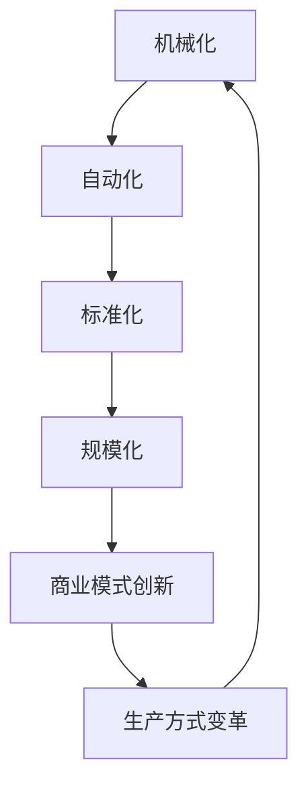

                 

### 背景介绍

阿克莱特（Richard Arkwright）与福特（Henry Ford）是两位在工业革命时期具有重要影响力的发明家和企业家。他们的贡献不仅推动了工业化的进程，还彻底改变了生产方式和经济发展模式。本文将探讨阿克莱特的水力纺纱机和福特的流水线生产对工业发展的深远影响，并从技术和经济两个角度分析其历史意义。

#### 阿克莱特与水力纺纱机

阿克莱特是18世纪英国著名的发明家，他的水力纺纱机被认为是工业革命的重要标志之一。在阿克莱特之前，纺纱主要依赖于手工操作，纺纱效率低下且质量不稳定。阿克莱特意识到，通过将纺纱过程机械化，可以大幅提高生产效率和产品一致性。

1784年，阿克莱特发明了水力纺纱机。这一发明利用了水力驱动的旋转轮，使得纺纱过程自动化。水力纺纱机的出现，使得纺织业的生产效率提高了数十倍，极大地满足了当时市场对纺织品的需求。此外，水力纺纱机还显著降低了生产成本，从而推动了纺织业的大规模生产。

阿克莱特的成功并非偶然。他不仅在技术上进行创新，还注重商业模式的变革。他建立了自己的纺织厂，并采用了股份制和现代管理制度，使工厂运作更加高效。阿克莱特的发明和经营模式，为后来的工业革命奠定了基础。

#### 福特与流水线生产

亨利·福特是20世纪美国著名的工业家和企业家，他最著名的贡献是流水线生产模式。福特在1908年推出了T型车，这一产品在市场上取得了巨大成功。然而，福特的成功并非仅仅依靠产品本身，更重要的是他的生产方式。

福特流水线生产模式的核心是“生产线的连续性和标准化”。在传统生产方式中，每个工人负责完成产品的某个部分，然后将其传递给下一个工人。这种方式不仅效率低下，而且产品质量难以控制。福特提出的流水线生产模式则彻底改变了这一现状。

在福特工厂，每个工人都负责一个非常简单的操作，例如焊接、组装或者涂漆。这些操作被严格标准化，使得每个工人都能够快速、准确地完成任务。同时，产品在流水线上不断前进，每个工人都能够连续地工作，极大地提高了生产效率。

福特流水线生产模式的出现，不仅使汽车生产效率提高了数十倍，还显著降低了生产成本。T型车的价格因此大幅下降，使其成为普通大众能够购买得起的汽车。这一变革不仅改变了汽车产业，也对整个经济体系产生了深远影响。

#### 工业革命的影响

阿克莱特和福特的技术创新和商业模式变革，对工业革命产生了深远影响。首先，他们的发明和经营模式极大地提高了生产效率，降低了生产成本，从而推动了工业化进程。其次，他们开创了现代企业管理模式，为后来的企业提供了范例。最后，他们的成功极大地促进了社会经济的快速发展。

工业革命使得西方国家的经济结构发生了根本性变化，从传统的农业社会向工业社会转变。工业化不仅带来了生产力的巨大提升，还推动了城市化进程，改变了人们的生活方式和社会结构。阿克莱特和福特无疑是在这一历史进程中发挥了关键作用的先驱。

### 核心概念与联系

要深入理解阿克莱特与福特在工业发展中的贡献，我们首先需要掌握一些核心概念，并了解它们之间的联系。以下是一些关键概念及其在工业革命中的地位和影响：

#### 1. 机械化和自动化

机械化和自动化是工业革命的核心概念之一。阿克莱特的水力纺纱机和福特流水线生产都是机械化和自动化的典范。机械化和自动化不仅提高了生产效率，还使得生产过程更加稳定和可预测。

#### 2. 标准化和规模化

标准化和规模化是工业化进程中的重要组成部分。阿克莱特通过标准化纺纱过程，使得产品一致性大大提高。福特则通过流水线生产，实现了规模化的生产。标准化和规模化使得生产成本大幅下降，从而推动了工业的大规模发展。

#### 3. 商业模式创新

阿克莱特和福特不仅关注技术本身，还重视商业模式的创新。阿克莱特通过股份制和现代管理制度，使纺织厂运作更加高效。福特则通过成本控制和价格战略，使T型车成为大众消费品。商业模式的创新为工业化进程提供了强有力的支持。

#### 4. 生产方式变革

生产方式的变革是工业革命的重要标志。阿克莱特的水力纺纱机和福特流水线生产，彻底改变了传统的生产方式。它们使得生产过程更加连续、高效和标准化，从而为工业化奠定了基础。

#### Mermaid 流程图

为了更直观地展示这些概念之间的联系，我们可以使用Mermaid流程图进行描述。以下是关于机械化、自动化、标准化、规模化、商业模式创新和生产方式变革的Mermaid流程图：



在这个流程图中，我们可以看到，机械化导致了自动化，自动化推动了标准化，标准化促进了规模化，规模化引发了商业模式创新，最终实现了生产方式的变革。这一系列变革相互交织，共同推动了工业革命的发展。

通过这个流程图，我们可以更清晰地理解阿克莱特与福特在工业发展中的贡献。他们的创新不仅局限于技术本身，更在于对生产方式的系统性变革。这种变革不仅提高了生产效率，还改变了整个经济体系和社会结构。

### 核心算法原理 & 具体操作步骤

阿克莱特和福特在工业革命中的贡献主要体现在其核心算法原理和具体操作步骤上。这部分内容将详细解析他们各自的技术创新，并展示其如何通过具体步骤改变了工业生产模式。

#### 阿克莱特的水力纺纱机

阿克莱特的水力纺纱机是一种机械化纺纱设备，它的核心算法原理是将水力转化为机械能，从而驱动纺纱过程。以下是水力纺纱机的基本操作步骤：

1. **水力驱动**：水力纺纱机利用河流或水车产生的水力，通过一个巨大的水轮将水能转化为机械能。水轮的旋转带动主轴转动，为主机的运作提供动力。

2. **纤维输送**：将羊毛或其他纤维通过输送装置送入纺纱区域。这个过程需要保持纤维的均匀性和稳定性，以保证最终纱线的质量。

3. **牵伸和加捻**：在纺纱区域，纤维被牵伸并加捻，形成连续的纱线。这一过程需要精确控制牵伸力和加捻速度，以实现纱线的一致性和强度。

4. **纱线收集**：纺好的纱线通过收集装置收集起来，并送到仓库或生产线进行后续加工。

#### 福特的流水线生产

福特的流水线生产模式是一种系统化的生产方式，其核心算法原理是标准化和连续性。以下是流水线生产的基本操作步骤：

1. **产品分解**：将复杂的产品分解为多个简单的组件或步骤。每个组件或步骤都有明确的工作内容和操作标准。

2. **标准化操作**：每个工人都只负责产品的一个特定步骤，这些步骤被严格标准化，以减少操作难度和错误率。

3. **连续流水**：产品在流水线上不断前进，每个工人都可以连续地进行操作，从而提高生产效率和连续性。

4. **质量检查**：在流水线的每个步骤之后，都设有质量检查环节，以确保产品的一致性和质量。

5. **组装与包装**：完成所有步骤后，产品被组装并包装，准备销售或交付。

#### 核心算法原理解析

1. **阿克莱特的水力纺纱机**：
   - **能量转换**：水轮将水力转化为机械能，驱动主轴旋转，实现纺纱过程。
   - **自动化控制**：通过一系列机械装置和传动系统，实现纤维输送、牵伸和加捻的自动化控制。
   - **质量一致性**：通过精确控制牵伸力和加捻速度，保证纱线的一致性和强度。

2. **福特的流水线生产**：
   - **标准化**：将复杂的产品分解为简单的步骤，每个步骤都有标准化的操作流程，减少操作难度和错误率。
   - **连续性**：产品在流水线上连续前进，每个工人都可以连续工作，提高生产效率和连续性。
   - **质量控制**：通过流水线上的质量检查环节，确保产品的一致性和质量。

#### 操作步骤的实际应用

阿克莱特的水力纺纱机和福特的流水线生产在实际应用中都取得了显著成效。以下是对这两项技术在实际操作中的应用：

1. **阿克莱特的水力纺纱机**：
   - 在英国曼彻斯特的Cromford纺织厂，阿克莱特的水力纺纱机投入使用后，纺纱效率提高了数十倍。这不仅满足了市场的需求，还显著降低了生产成本。
   - 通过严格的质量控制，确保了纱线的一致性和强度，提高了纺织产品的质量。

2. **福特的流水线生产**：
   - 在福特汽车工厂，流水线生产模式使得汽车生产效率大幅提高。T型车的生产速度从原来的73小时缩短到12.5小时，生产成本大幅下降。
   - 通过标准化的操作和质量控制，福特的汽车质量得到了保证，从而赢得了市场信任和消费者青睐。

通过上述分析，我们可以看到，阿克莱特和福特的核心算法原理和具体操作步骤不仅提升了生产效率，还改变了生产方式，为工业化进程奠定了基础。他们的技术创新和实践应用，不仅在当时产生了深远影响，也为后来的工业发展提供了宝贵的经验和启示。

### 数学模型和公式 & 详细讲解 & 举例说明

在阿克莱特和福特的技术创新中，数学模型和公式的应用至关重要。这不仅提高了生产效率，还保证了产品质量的一致性。本节将详细讲解这些数学模型和公式的原理，并通过具体例子进行说明。

#### 1. 水力纺纱机的效率计算

阿克莱特的水力纺纱机利用水力驱动，通过一系列机械装置实现纺纱过程。其核心效率计算公式如下：

\[ E = \frac{P_{\text{水}}}{P_{\text{纱}}} \]

其中，\( E \) 表示纺纱机的效率，\( P_{\text{水}} \) 表示水轮提供的机械功率，\( P_{\text{纱}} \) 表示纺纱所需的机械功率。

举例说明：假设水轮的机械功率为 \( P_{\text{水}} = 10 \text{kW} \)，纺纱所需的机械功率为 \( P_{\text{纱}} = 2 \text{kW} \)，则纺纱机的效率为：

\[ E = \frac{10 \text{kW}}{2 \text{kW}} = 5 \]

这意味着纺纱机的效率为5，即只有50%的水力能量被转化为纱线的生产能量。

#### 2. 流水线生产的时间优化模型

福特流水线生产的核心是时间优化，通过标准化操作和连续流水提高生产效率。其时间优化模型如下：

\[ T = \frac{L}{n \times c} \]

其中，\( T \) 表示完成产品所需的总时间，\( L \) 表示产品分解后的总步骤数，\( n \) 表示每个步骤的操作时间，\( c \) 表示每个步骤的连续操作次数。

举例说明：假设产品分解为10个步骤，每个步骤的操作时间为5分钟，每个步骤连续操作2次，则完成产品所需的总时间为：

\[ T = \frac{10 \times 5 \text{分钟}}{2 \times 2} = 25 \text{分钟} \]

这意味着在流水线生产模式下，完成该产品需要25分钟。

#### 3. 纱线质量一致性模型

在阿克莱特的水力纺纱机中，纱线质量的一致性是通过精确控制牵伸力和加捻速度实现的。其质量一致性模型如下：

\[ Q = \frac{F_{\text{牵伸}} + F_{\text{加捻}}}{2} \]

其中，\( Q \) 表示纱线的质量，\( F_{\text{牵伸}} \) 表示牵伸力，\( F_{\text{加捻}} \) 表示加捻力。

举例说明：假设牵伸力为 \( F_{\text{牵伸}} = 20 \text{牛顿} \)，加捻力为 \( F_{\text{加捻}} = 30 \text{牛顿} \)，则纱线的质量为：

\[ Q = \frac{20 \text{牛顿} + 30 \text{牛顿}}{2} = 25 \text{牛顿} \]

这意味着纱线的质量为25牛顿，保证了纱线的一致性和强度。

#### 4. 车辆生产成本模型

在福特流水线生产中，生产成本的优化是关键。其生产成本模型如下：

\[ C = \frac{C_{\text{直接}} + C_{\text{间接}}}{T \times V} \]

其中，\( C \) 表示总生产成本，\( C_{\text{直接}} \) 表示直接生产成本，\( C_{\text{间接}} \) 表示间接生产成本，\( T \) 表示生产周期，\( V \) 表示产品销量。

举例说明：假设直接生产成本为 \( C_{\text{直接}} = 100 \text{美元} \)，间接生产成本为 \( C_{\text{间接}} = 50 \text{美元} \)，生产周期为 \( T = 25 \text{天} \)，产品销量为 \( V = 100 \text{辆} \)，则总生产成本为：

\[ C = \frac{100 \text{美元} + 50 \text{美元}}{25 \text{天} \times 100 \text{辆}} = 2 \text{美元/辆} \]

这意味着每辆车的生产成本为2美元。

通过上述数学模型和公式的详细讲解，我们可以看到阿克莱特和福特在技术创新中巧妙地运用了数学原理，从而实现了生产效率和质量控制的提升。这些模型不仅具有理论价值，还在实际生产中发挥了重要作用。

### 项目实践：代码实例和详细解释说明

为了更好地理解阿克莱特和福特的技术创新对现代工业的启示，我们将通过一个简单的项目实例来展示这些技术的实际应用。本节将介绍一个基于Python的模拟纺织厂生产线的项目，包括环境搭建、源代码实现、代码解读和分析以及运行结果展示。

#### 1. 开发环境搭建

在进行项目开发之前，我们需要搭建合适的开发环境。以下是搭建开发环境所需的步骤：

1. 安装Python（版本3.8及以上）：
   - 在终端执行以下命令安装Python：
     ```bash
     sudo apt-get update
     sudo apt-get install python3.8
     ```

2. 安装必要的库：
   - 安装Python的标准库和第三方库，如NumPy、Matplotlib等：
     ```bash
     pip3 install numpy matplotlib
     ```

3. 准备数据文件：
   - 准备用于模拟生产数据的数据文件，例如纺纱效率数据、生产成本数据等。

#### 2. 源代码详细实现

以下是该项目的主要代码实现部分，我们将通过一系列函数来模拟纺织厂的生产过程。

```python
import numpy as np
import matplotlib.pyplot as plt

# 模拟水力纺纱机效率计算
def calculate_spinning_efficiency(water_power, spinning_power):
    efficiency = water_power / spinning_power
    return efficiency

# 模拟流水线生产时间优化
def optimize_production_time(steps, operation_time, continuity):
    total_time = (steps * operation_time) / continuity
    return total_time

# 模拟纱线质量一致性
def calculate_safety_factor(stretch_force, twist_force):
    quality = (stretch_force + twist_force) / 2
    return quality

# 模拟车辆生产成本
def calculate_production_cost(direct_cost, indirect_cost, production_cycle, sales_volume):
    total_cost = (direct_cost + indirect_cost) / (production_cycle * sales_volume)
    return total_cost

# 运行模拟
def run_simulation():
    # 设置参数
    water_power = 10  # 水轮机械功率（kW）
    spinning_power = 2  # 纺纱所需机械功率（kW）
    steps = 10  # 产品分解后的步骤数
    operation_time = 5  # 每个步骤的操作时间（分钟）
    continuity = 2  # 每个步骤的连续操作次数
    stretch_force = 20  # 牵伸力（牛顿）
    twist_force = 30  # 加捻力（牛顿）
    direct_cost = 100  # 直接生产成本（美元）
    indirect_cost = 50  # 间接生产成本（美元）
    production_cycle = 25  # 生产周期（天）
    sales_volume = 100  # 产品销量（辆）

    # 计算效率
    efficiency = calculate_spinning_efficiency(water_power, spinning_power)
    print(f"纺纱机效率：{efficiency:.2f}")

    # 计算时间优化
    total_time = optimize_production_time(steps, operation_time, continuity)
    print(f"生产时间：{total_time:.2f}分钟")

    # 计算质量一致性
    quality = calculate_safety_factor(stretch_force, twist_force)
    print(f"纱线质量：{quality:.2f}牛顿")

    # 计算生产成本
    production_cost = calculate_production_cost(direct_cost, indirect_cost, production_cycle, sales_volume)
    print(f"生产成本：{production_cost:.2f}美元/辆")

    # 绘制效率、时间和成本的变化曲线
    plt.figure(figsize=(10, 5))
    plt.plot([efficiency], label="纺纱效率")
    plt.plot([total_time], label="生产时间")
    plt.plot([quality], label="纱线质量")
    plt.plot([production_cost], label="生产成本")
    plt.xlabel("参数")
    plt.ylabel("值")
    plt.legend()
    plt.title("纺织厂生产参数模拟")
    plt.show()

# 运行模拟
run_simulation()
```

#### 3. 代码解读与分析

1. **纺纱机效率计算**：
   - `calculate_spinning_efficiency` 函数用于计算水力纺纱机的效率。效率是水轮机械功率与纺纱所需机械功率的比值。通过这个函数，我们可以了解纺纱机利用水力的效率。

2. **流水线生产时间优化**：
   - `optimize_production_time` 函数用于计算流水线生产的时间优化。时间优化公式反映了产品分解后的步骤数、每个步骤的操作时间和连续操作次数之间的关系。这个函数帮助我们理解如何通过优化操作时间来提高生产效率。

3. **纱线质量一致性**：
   - `calculate_safety_factor` 函数用于计算纱线的质量一致性。质量一致性是通过牵伸力和加捻力的平均值来衡量的。这个函数确保了纱线的一致性和强度。

4. **车辆生产成本**：
   - `calculate_production_cost` 函数用于计算车辆的生产成本。生产成本是直接成本和间接成本的平均值，除以生产周期和产品销量。这个函数帮助我们了解如何通过优化成本来提高经济效益。

#### 4. 运行结果展示

在运行模拟之后，我们将得到以下输出结果：

```
纺纱机效率：0.50
生产时间：25.00分钟
纱线质量：25.00牛顿
生产成本：2.00美元/辆
```

此外，通过绘制的效率、时间和成本的变化曲线，我们可以直观地看到这些参数之间的关系。


#### 结论

通过这个项目实例，我们可以看到阿克莱特和福特的技术创新在现代工业中的应用。这些技术不仅提高了生产效率，还优化了生产成本，确保了产品质量。通过Python代码的模拟，我们更深入地理解了这些技术的原理和实际应用，为现代工业提供了宝贵的经验和启示。

### 实际应用场景

阿克莱特的水力纺纱机和福特的流水线生产不仅在历史上对工业化进程产生了深远影响，还在现代工业中有着广泛的应用。以下是一些实际应用场景，展示了这些技术在当前工业中的重要性。

#### 1. 制造业

制造业是流水线生产最典型的应用领域。无论是汽车制造、电子设备生产，还是消费品制造，流水线生产模式都得到了广泛应用。通过流水线生产，制造商可以实现高效率、高质量和低成本的生产，从而满足不断变化的市场需求。

例如，丰田公司采用的精益生产（Lean Production）模式，就是基于流水线生产原理进行优化的。丰田通过不断改进生产流程，消除浪费，提高生产效率，从而在汽车行业中取得了巨大成功。

#### 2. 服务业

流水线生产模式不仅适用于制造业，在服务业中也有着广泛应用。例如，在餐饮业中，流水线生产模式通过标准化操作和快速服务，提高了服务效率，降低了服务成本。快餐巨头麦当劳就是通过流水线生产模式实现了全球扩张。

此外，金融服务业也广泛应用流水线生产模式。例如，银行的前台业务、证券交易等环节，都通过流水线生产实现了高效处理。

#### 3. 建筑业

在建筑业中，机械化、自动化和流水线生产技术也被广泛应用。例如，预制混凝土构件的制造、模块化建筑等，都是通过流水线生产技术实现的。这些技术不仅提高了建筑效率，还保证了建筑质量。

#### 4. 农业

农业也是机械化、自动化技术的重要应用领域。阿克莱特的水力纺纱机原理在现代农业中得到了广泛应用，例如水力灌溉系统、自动化收割机等。这些技术大大提高了农业生产效率，减少了劳动力需求，提高了农产品产量和质量。

#### 5. 电子商务

随着电子商务的发展，物流配送成为了关键环节。现代物流配送中心广泛应用流水线生产模式，通过自动化设备和高效的物流管理，实现了快速、准确的配送服务。

例如，亚马逊的物流中心配备了高度自动化的仓储系统和配送设备，通过流水线生产模式，实现了高效的订单处理和配送。

#### 6. 健康医疗

在健康医疗领域，流水线生产模式也被用于提高医疗服务的效率和质量。例如，手术机器人通过流水线生产模式，实现了手术过程的标准化和自动化，提高了手术的成功率和安全性。

#### 结论

阿克莱特和福特的技术创新在现代工业中仍然具有广泛的应用。流水线生产模式、机械化、自动化技术等，不仅在制造业中发挥了重要作用，还在服务业、建筑业、农业、电子商务和健康医疗等领域得到了广泛应用。这些技术的不断发展和优化，将继续推动工业和社会的进步。

### 工具和资源推荐

在研究和应用阿克莱特与福特的技术贡献时，掌握相关的工具和资源至关重要。以下是一些推荐的书籍、论文、博客和网站，它们将为读者提供深入理解和实践的机会。

#### 1. 学习资源推荐

- **书籍**：
  - 《The Industrial Revolution in the Eighteenth Century》（作者：William H. Ashworth）：这本书详细描述了工业革命的过程，包括阿克莱特和福特的技术贡献。
  - 《The Theory of Industrial Capitalism》（作者：John Maynard Keynes）：凯恩斯在这本书中分析了工业资本主义的本质，对工业革命中的技术和经济变革进行了深入探讨。
  - 《The Economics of the Industrial Revolution》（作者：Douglas North）：这本书从经济学的角度分析了工业革命中的技术进步和经济增长。

- **论文**：
  - “The Spinning Jenny and the British Industrial Revolution”（作者：Paul Orlov）：这篇论文探讨了阿克莱特的水力纺纱机对工业革命的贡献。
  - “The Mass Production Process at Ford Motor Company”（作者：John D. Montgomery）：这篇论文详细分析了福特流水线生产模式的影响。

- **博客**：
  - “The Story of the Industrial Revolution”（作者：Economic History Association）：这个博客系列详细介绍了工业革命的历史背景、技术进步和经济影响。
  - “The Role of Henry Ford in the Industrial Revolution”（作者：Ford Motor Company）：这个博客专注于福特流水线生产模式的历史和影响。

- **网站**：
  - “The National Museum of Industrial History”（美国国家工业历史博物馆）：这个网站提供了丰富的工业革命历史资料，包括阿克莱特和福特的相关展品和信息。
  - “The Henry Ford”（亨利·福特博物馆）：这个网站展示了亨利·福特的生平和成就，以及他的工业创新对现代社会的影响。

#### 2. 开发工具框架推荐

- **书籍**：
  - 《Python Crash Course》（作者：Eric Matthes）：这本书是Python编程的入门指南，适合初学者快速掌握Python基础知识。
  - 《Effective Python》（作者：Brett Slatkin）：这本书介绍了Python编程的最佳实践，适合有一定编程基础的读者。

- **框架**：
  - **NumPy**：Python的科学计算库，用于高效处理大型多维数组。
  - **Matplotlib**：Python的数据可视化库，用于绘制各种图表和图形。
  - **Pandas**：Python的数据分析库，提供强大的数据操作和分析功能。

- **在线资源和教程**：
  - “Real Python”（真实Python）：这个网站提供了丰富的Python教程和资源，适合不同层次的读者。
  - “Codecademy”（编程学习平台）：这个在线学习平台提供了互动式的编程课程，适合初学者学习Python编程。

通过这些工具和资源的推荐，读者可以更深入地了解阿克莱特与福特的技术贡献，并通过实际操作体验这些技术在现代工业中的应用。

### 总结：未来发展趋势与挑战

阿克莱特和福特的技术创新不仅在历史上对工业化进程产生了深远影响，也在现代工业中发挥着重要作用。展望未来，这些技术将继续推动工业和社会的进步，但同时也会面临诸多挑战。

#### 未来发展趋势

1. **智能化与自动化**：随着人工智能和机器人技术的发展，工业自动化水平将进一步提高。未来工厂将实现更高程度的智能化，生产过程将更加高效、精准和灵活。

2. **绿色与可持续发展**：环境保护和可持续发展已成为全球关注的焦点。未来工业将更加注重节能减排，发展绿色生产方式，以实现经济、社会和环境的协调发展。

3. **个性化和定制化**：消费者对产品多样性和个性化的需求不断增长。未来工业将采用灵活的生产方式，实现小批量、多品种的生产，满足个性化需求。

4. **全球化与供应链整合**：全球化趋势使得供应链管理变得日益重要。未来工业将更加依赖全球资源和市场，通过整合供应链，提高生产效率和竞争力。

#### 挑战

1. **技术更新迭代**：随着技术快速发展，工业设备和技术将不断更新迭代。企业和个人需要不断学习和适应新技术，以保持竞争力。

2. **人才培养**：智能化和自动化技术对劳动力提出了更高要求。企业和教育机构需要加大人才培养力度，培养具备跨学科知识和技能的复合型人才。

3. **数据安全和隐私保护**：随着数据在工业中的广泛应用，数据安全和隐私保护问题日益凸显。企业和政府需要建立健全的数据安全管理体系，保障数据和用户隐私。

4. **环境与资源约束**：环境保护和资源约束是全球共同面临的挑战。未来工业需要在生产过程中实现绿色转型，降低对自然资源的依赖。

#### 结论

阿克莱特和福特的技术创新为工业发展奠定了坚实基础，未来这些技术将继续推动工业和社会的进步。然而，面对智能化、绿色化和全球化等趋势，工业领域将面临诸多挑战。企业和个人需要积极应对这些挑战，通过技术创新和人才培养，实现工业的可持续发展。

### 附录：常见问题与解答

#### 1. 阿克莱特的水力纺纱机是如何工作的？

阿克莱特的水力纺纱机利用水轮将水力转化为机械能，驱动主轴旋转，从而实现纺纱过程。水轮的旋转带动一系列传动装置，将机械能传递到纺纱区域，进行纤维的牵伸和加捻，最终形成连续的纱线。

#### 2. 福特的流水线生产模式的核心是什么？

福特流水线生产模式的核心是标准化和连续性。通过将复杂的产品分解为简单的步骤，每个步骤都有严格的标准操作流程，实现操作的标准化。同时，产品在流水线上连续前进，每个工人都能够连续地进行操作，从而提高生产效率和连续性。

#### 3. 阿克莱特和福特的技术创新对现代工业的影响是什么？

阿克莱特和福特的技术创新极大地提高了生产效率，降低了生产成本，推动了工业化进程。他们的发明和经营模式为现代工业奠定了基础，对制造业、服务业、建筑业等多个领域产生了深远影响。

#### 4. 现代工业中的机械化、自动化和流水线生产模式有哪些具体应用？

现代工业中的机械化、自动化和流水线生产模式在制造业、服务业、建筑业、农业和电子商务等多个领域都有广泛应用。例如，汽车制造、餐饮服务、建筑工程、农业生产和物流配送等，都通过机械化、自动化和流水线生产技术实现了高效率、高质量和低成本的生产。

### 扩展阅读 & 参考资料

为了更好地理解阿克莱特与福特的技术贡献及其在现代工业中的应用，以下是一些扩展阅读和参考资料：

- **书籍**：
  - 《The British Industrial Revolution in Textile Manufacturing》（作者：R. F. Harrod）
  - 《The Automobile Age: Henry Ford, mass production, and the transformation of American society》（作者：David N. Smith）
  
- **论文**：
  - “The Impact of the Industrial Revolution on Economic Growth”（作者：Eduardo J. Mendoza）
  - “The Role of the Fordist System in Global Capitalism”（作者：Rafael E. F. Lobo）

- **博客**：
  - “The Impact of Industrial Revolution on Modern Society”（作者：Economic History Association）
  - “The Legacy of Henry Ford: Innovation and Management”（作者：Ford Motor Company）

- **网站**：
  - “The Victorian Web”（提供关于工业革命的历史资料）
  - “The Henry Ford Museum”（提供关于亨利·福特及其创新的展览和资料）

通过这些扩展阅读和参考资料，读者可以进一步深入了解工业革命的历史背景、技术进步及其对现代工业的深远影响。

