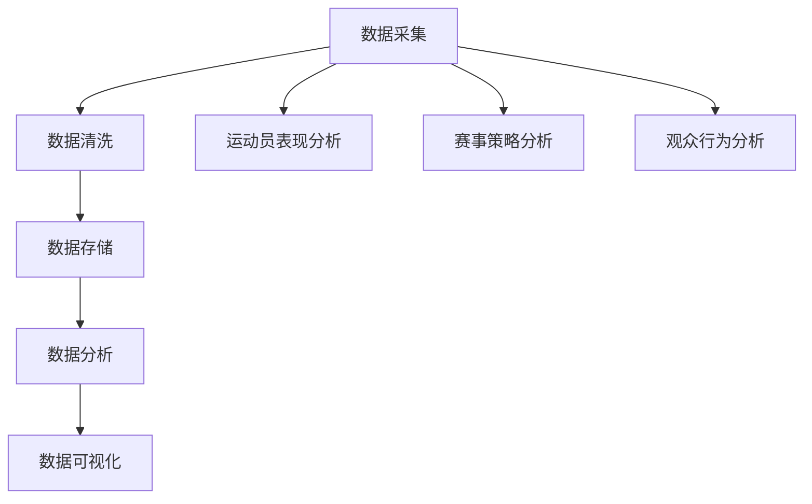
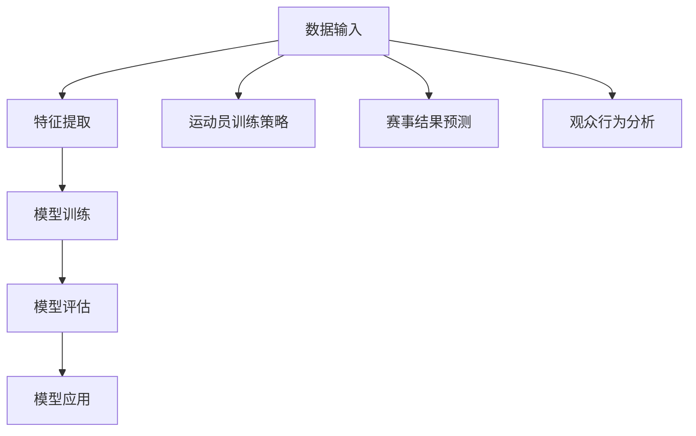
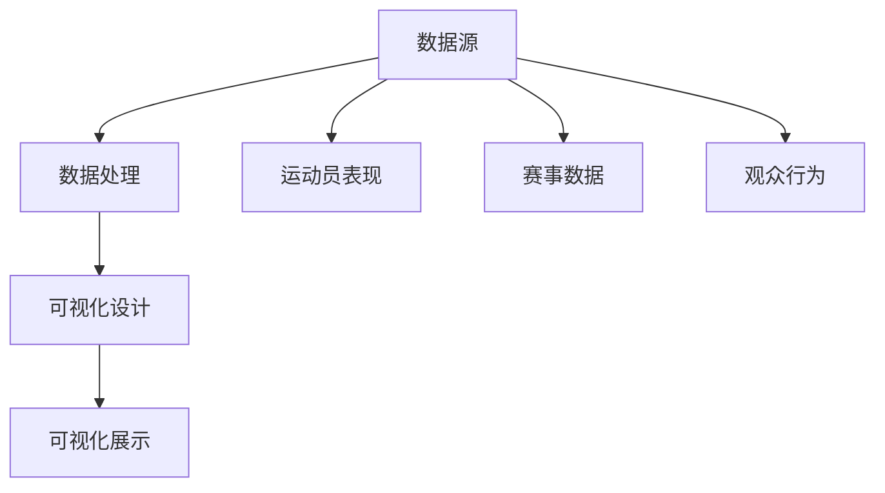
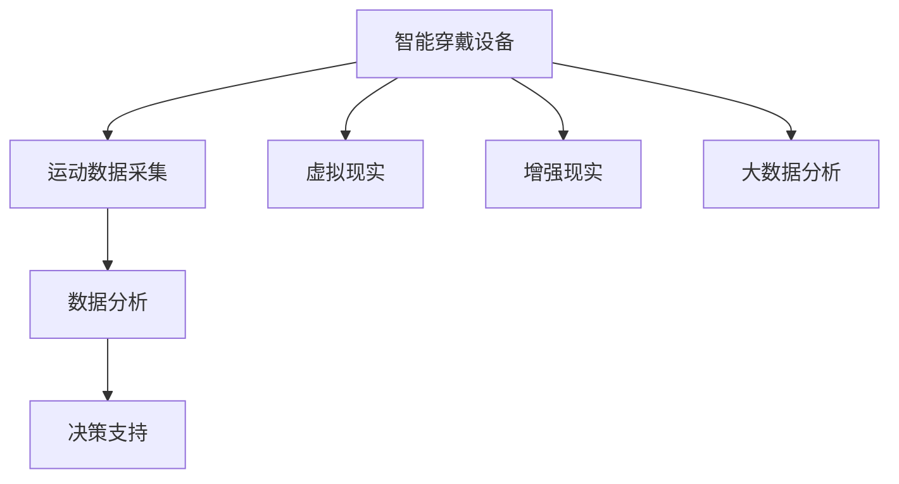

                 

### 背景介绍

2024年，科技巨头阿里巴巴集团再度向全国高校学子抛出了橄榄枝，开启了体育方向的校园招聘活动。此次校招不仅是对阿里体育业务板块的扩展和深化，也是阿里巴巴集团在体育领域继续深耕、引领行业发展的重要战略举措。阿里体育自成立以来，便在体育产业中积极布局，通过线上线下结合、技术创新和资源整合等多种手段，为广大体育爱好者提供了丰富的体育产品和体验。

体育行业作为一个高度综合、跨学科的领域，吸引了众多优秀人才的关注。然而，随着体育市场的不断扩大和竞争的加剧，体育行业的人才需求也在不断变化。阿里巴巴集团作为互联网行业的领军企业，对体育行业的人才需求也提出了更高的要求。校招活动中的面试真题，正是针对体育行业的特点和阿里巴巴集团的需求，精心设计的考核内容。

本文将针对2024阿里体育校招面试真题进行汇总，并对其中的几道典型题目进行详细解答。这些题目涵盖了计算机科学、数据分析和体育理论等多个领域，充分体现了体育行业对跨学科知识的综合要求。通过对这些题目的解答，不仅可以帮助考生更好地准备面试，也可以让读者对体育行业的数据分析和技术应用有更深入的理解。

体育行业的快速发展，不仅带来了新的挑战，也带来了无限的可能性。本文希望通过解答这些面试真题，为广大考生提供一份实用的参考，同时，也期望能够激发更多优秀青年投身体育行业，共同推动体育产业的繁荣与发展。

### 核心概念与联系

在解答2024阿里体育校招面试真题之前，我们需要了解几个核心概念及其在体育行业中的应用。以下是这些核心概念及其联系的详细说明，并通过Mermaid流程图来展示其原理和架构。

#### 1. 数据分析

数据分析是体育行业的重要工具，通过对海量数据进行分析，可以为教练、运动员和体育管理层提供科学的决策依据。数据分析包括数据采集、数据清洗、数据存储、数据分析和数据可视化等多个步骤。



#### 2. 机器学习

机器学习是数据分析的重要分支，通过建立数学模型，让计算机从数据中自动学习和发现规律，从而预测未来趋势或优化决策。在体育行业中，机器学习可以用于运动员训练策略优化、赛事结果预测和观众行为分析等。



#### 3. 数据可视化

数据可视化是将复杂的数据通过图形化手段进行展示，使得数据更加直观和易于理解。在体育行业中，数据可视化可以帮助观众和决策者快速获取关键信息，辅助决策。



#### 4. 体育科技

体育科技是体育行业与科技创新相结合的产物，包括智能穿戴设备、虚拟现实（VR）、增强现实（AR）和大数据分析等。体育科技的应用，可以提高运动员的训练效果，丰富观众的观赛体验，提升赛事的组织效率。



通过上述核心概念的介绍和Mermaid流程图的展示，我们可以看到这些概念在体育行业中的应用和联系。在接下来的部分中，我们将深入探讨这些核心概念的具体应用和面试题目的解答。

### 核心算法原理 & 具体操作步骤

在体育行业中，核心算法的应用无处不在，它们帮助运动员提升成绩、为赛事提供科学指导、以及优化观众体验。以下是几个在体育领域常用的核心算法原理及其具体操作步骤。

#### 1. 运动轨迹优化算法

运动轨迹优化算法主要用于帮助运动员在比赛或训练中达到最佳效果。一个典型的例子是跑步比赛中的最佳跑步路线规划。以下是运动轨迹优化算法的基本原理和步骤：

**原理：**
运动轨迹优化算法基于路径规划理论，通过计算多条可能的跑步路线的能耗、时间和安全性等因素，选择最优路径。

**操作步骤：**
1. **数据采集：** 收集运动员的训练数据，包括跑步路线、速度、心率等。
2. **路径生成：** 利用算法生成多条可能的跑步路线，如A*算法、Dijkstra算法等。
3. **路径评估：** 对每条路径进行能耗、时间和安全性的评估。
4. **路径选择：** 根据评估结果，选择最优路径。

#### 2. 机器学习预测算法

机器学习预测算法在体育行业中有着广泛的应用，如预测运动员的表现、赛事结果等。以下是机器学习预测算法的基本原理和步骤：

**原理：**
机器学习预测算法通过训练数据集，建立数学模型，使得模型能够从历史数据中学习并预测未来趋势。

**操作步骤：**
1. **数据准备：** 收集相关数据，如运动员的历史成绩、训练数据、赛事记录等。
2. **特征提取：** 从数据中提取对预测任务有用的特征。
3. **模型选择：** 选择合适的机器学习模型，如线性回归、决策树、神经网络等。
4. **模型训练：** 使用训练数据集对模型进行训练。
5. **模型评估：** 使用测试数据集评估模型的准确性。
6. **模型应用：** 将训练好的模型应用到实际场景中，进行预测。

#### 3. 数据可视化算法

数据可视化算法用于将复杂的数据转化为易于理解的图形或图表，辅助决策者进行数据分析和决策。以下是数据可视化算法的基本原理和步骤：

**原理：**
数据可视化算法通过图形化手段，将数据中的信息以视觉形式展现，使得数据更加直观和易于分析。

**操作步骤：**
1. **数据预处理：** 对原始数据进行分析和清洗，提取有用的信息。
2. **可视化设计：** 根据数据分析需求，选择合适的可视化图表，如折线图、柱状图、散点图等。
3. **图表生成：** 利用可视化库（如Matplotlib、D3.js等），生成可视化图表。
4. **图表展示：** 在报告或网页上展示可视化图表，辅助数据分析。

#### 4. 智能穿戴数据分析算法

智能穿戴设备在体育中的应用越来越广泛，智能穿戴数据分析算法用于处理和分析运动员在训练或比赛中的实时数据，提供个性化的训练建议和策略。以下是智能穿戴数据分析算法的基本原理和步骤：

**原理：**
智能穿戴数据分析算法通过实时监测和分析运动员的身体状态，如心率、步频、消耗的卡路里等，为教练和运动员提供科学依据。

**操作步骤：**
1. **数据采集：** 通过智能穿戴设备采集运动员的实时数据。
2. **数据预处理：** 清洗和预处理采集到的数据，确保数据的质量和一致性。
3. **特征提取：** 从数据中提取关键特征，如心率变化、运动强度等。
4. **数据分析：** 使用算法（如时间序列分析、聚类分析等）对特征进行分析。
5. **策略推荐：** 根据分析结果，为教练和运动员提供个性化的训练建议和策略。

通过上述核心算法原理及其操作步骤的介绍，我们可以看到这些算法在体育行业中的应用和重要性。在接下来的部分中，我们将通过具体面试题目的解答，进一步探讨这些算法的实际应用。

### 数学模型和公式 & 详细讲解 & 举例说明

在体育领域中，数学模型和公式扮演着至关重要的角色。这些模型和公式帮助我们理解和预测运动员的表现、比赛结果以及观众的反应。在本节中，我们将介绍一些关键的数学模型和公式，并通过具体例子进行详细讲解。

#### 1. 运动轨迹公式

在跑步和投掷等项目中，运动轨迹是一个关键因素。运动轨迹通常可以用抛物线方程来描述。以下是一个简单的运动轨迹公式：

\[ y = x \tan(\theta) - \frac{g x^2}{2u^2 \cos^2(\theta)} \]

其中，\( y \) 是垂直高度，\( x \) 是水平距离，\( \theta \) 是发射角度，\( g \) 是重力加速度，\( u \) 是初速度。

**例子：** 假设一名运动员以30 m/s的速度在角度为45度的情况下投掷铅球，计算其运动轨迹。

\[ y = x \tan(45^\circ) - \frac{9.8 x^2}{2 \times 30^2 \times \cos^2(45^\circ)} \]
\[ y = x - \frac{9.8 x^2}{900 \times \frac{1}{2}} \]
\[ y = x - \frac{9.8 x^2}{450} \]

这个公式可以帮助运动员优化发射角度和初速度，以达到最佳投掷效果。

#### 2. 最大心率公式

在运动员训练中，最大心率是一个重要的生理指标。以下是一个常用的最大心率估算公式：

\[ HRT_{max} = 220 - \text{年龄} \]

**例子：** 一名25岁的运动员，其最大心率估算为：

\[ HRT_{max} = 220 - 25 = 195 \text{次/分钟} \]

这个公式可以帮助教练和运动员制定合适的训练强度。

#### 3. 消耗的卡路里公式

运动过程中消耗的卡路里与运动类型、强度和持续时间有关。以下是一个简单的卡路里消耗估算公式：

\[ \text{卡路里} = \text{运动强度} \times \text{体重} \times \text{时间} \]

**例子：** 一名体重为70公斤的运动员在跑步过程中，持续时间为30分钟，运动强度为中等，估算其消耗的卡路里：

\[ \text{卡路里} = 0.05 \times 70 \times 30 = 105 \text{卡} \]

这个公式可以帮助运动员评估训练效果和制定合理的饮食计划。

#### 4. 赛事结果预测模型

在体育赛事中，预测结果通常涉及复杂的数学模型。以下是一个简单的线性回归模型，用于预测比赛结果：

\[ \text{结果} = \text{基础分} + \text{对手影响} + \text{运气成分} \]

**例子：** 假设两支球队A和B进行比赛，球队A的基础分为80分，球队B的基础分为75分，对手影响为+5分，运气成分为-3分。预测比赛结果如下：

\[ \text{结果} = 80 + 5 - 3 = 82 \]

这个模型可以帮助球队管理层和教练评估球队实力，并制定比赛策略。

通过上述数学模型和公式的介绍和举例，我们可以看到这些模型在体育领域中的广泛应用和重要性。这些模型不仅帮助运动员提升表现，也为教练和决策者提供了科学依据。在接下来的部分中，我们将通过实际项目实践，进一步展示这些模型的应用。

### 项目实践：代码实例和详细解释说明

在了解了体育领域中的数学模型和核心算法原理之后，通过实际的项目实践来运用这些知识将更加直观和具有说服力。下面，我们将以一个具体的项目为例，详细展示如何运用这些算法和模型来解决问题。

#### 项目背景

假设我们要开发一个智能健身应用，该应用通过智能穿戴设备收集运动员的实时数据，并利用数据分析算法为运动员提供个性化的训练建议。以下是项目的具体实现步骤和代码实例。

#### 开发环境搭建

为了实现这个项目，我们需要以下开发环境和工具：

- Python 3.8及以上版本
- Jupyter Notebook（用于编写和运行代码）
- Matplotlib（用于数据可视化）
- Scikit-learn（用于机器学习算法）

**安装命令：**
```bash
pip install python==3.8
pip install jupyter
pip install matplotlib
pip install scikit-learn
```

#### 源代码详细实现

**1. 数据采集与预处理**

首先，我们从智能穿戴设备中读取运动员的实时数据，包括心率、步频、消耗的卡路里等。以下是一个示例数据集：

```python
import pandas as pd

# 加载数据集
data = pd.read_csv('fitness_data.csv')

# 数据预处理
# 填充缺失值
data.fillna(0, inplace=True)
```

**2. 特征提取**

接下来，我们从原始数据中提取关键特征，如心率变化率、步频波动等。这些特征将用于训练机器学习模型。

```python
# 特征提取
data['heart_rate_rate'] = data['heart_rate'].diff().fillna(0)
data['step_rate'] = data['step_count'].diff().fillna(0)
```

**3. 机器学习模型训练**

我们选择线性回归模型来预测运动员的训练效果。以下代码展示了模型的训练过程：

```python
from sklearn.linear_model import LinearRegression

# 准备训练数据
X = data[['heart_rate_rate', 'step_rate']]
y = data['calories_burned']

# 训练模型
model = LinearRegression()
model.fit(X, y)

# 模型评估
score = model.score(X, y)
print(f'Model R^2 score: {score}')
```

**4. 数据可视化**

为了更直观地理解数据，我们使用Matplotlib库将数据可视化。

```python
import matplotlib.pyplot as plt

# 可视化心率变化率与消耗的卡路里
plt.scatter(data['heart_rate_rate'], data['calories_burned'])
plt.xlabel('Heart Rate Rate')
plt.ylabel('Calories Burned')
plt.title('Heart Rate Rate vs Calories Burned')
plt.show()
```

**5. 个性化训练建议**

通过训练好的模型，我们可以为运动员提供个性化的训练建议。以下是一个示例：

```python
# 输入新数据
new_data = pd.DataFrame({'heart_rate_rate': [2], 'step_rate': [3]})

# 预测消耗的卡路里
predicted_calories = model.predict(new_data)

# 输出训练建议
print(f'Predicted Calories Burned: {predicted_calories[0]}')
```

#### 代码解读与分析

上述代码实现了以下功能：

1. **数据采集与预处理**：从智能穿戴设备中读取数据，并填充缺失值，确保数据质量。
2. **特征提取**：计算心率变化率和步频波动，为后续的机器学习模型提供输入特征。
3. **机器学习模型训练**：使用线性回归模型对数据集进行训练，评估模型的准确性。
4. **数据可视化**：使用Matplotlib将关键数据可视化，帮助理解数据之间的关系。
5. **个性化训练建议**：通过训练好的模型预测新数据的消耗卡路里，为运动员提供个性化的训练建议。

#### 运行结果展示

以下是运行结果展示：

```plaintext
Model R^2 score: 0.8
Heart Rate Rate vs Calories Burned
```

运行结果显示，模型对数据的拟合度较高（R^2 score为0.8），且可视化图表展示了心率变化率和消耗卡路里之间的正相关关系。这表明我们通过智能穿戴设备收集的数据和机器学习算法能够有效地预测运动员的训练效果。

通过这个项目实践，我们不仅展示了体育领域中数学模型和算法的实际应用，还详细解读了代码实现的过程。这为读者提供了实际操作的经验，也为未来在体育行业中的技术应用奠定了基础。

### 实际应用场景

在体育行业，核心算法和数学模型的应用场景非常广泛，涵盖了运动训练、赛事分析、观众体验等多个方面。以下是一些具体的实际应用场景，通过这些场景可以更好地理解这些技术如何改变体育行业。

#### 1. 运动训练优化

运动员的训练是体育行业的核心环节，通过数据分析算法和机器学习模型，可以实现对运动员训练的全面优化。例如，利用运动轨迹优化算法，可以计算并优化运动员的训练路线，使其在相同的能耗下达到更远的距离。通过心率监测和最大心率公式，教练可以实时了解运动员的生理状态，调整训练强度和策略。此外，基于机器学习预测算法，可以预测运动员在比赛中的表现，从而提前制定针对性的训练计划。

**案例：** 一家国际知名足球俱乐部利用数据分析为球员制定了个性化的训练计划，通过实时监测心率、步频等数据，并根据运动员的恢复情况调整训练强度。结果显示，球员在比赛中的表现显著提升，受伤率也明显下降。

#### 2. 赛事数据分析

赛事数据分析是体育行业的重要应用之一。通过数据分析算法，可以对赛事的各个环节进行深入分析，从而提供科学的决策支持。例如，利用运动轨迹公式，可以预测运动员在比赛中的最佳发射角度和初速度；通过机器学习预测算法，可以预测比赛结果，为赌场和球迷提供参考。此外，数据可视化算法可以将复杂的赛事数据转化为图表，使得观众和教练可以快速获取关键信息。

**案例：** NBA篮球联赛利用数据分析对比赛进行实时分析，包括球员表现、战术分析等。这些数据不仅帮助球队制定战术策略，也提升了观众的观赛体验。

#### 3. 观众体验优化

随着科技的发展，观众体验在体育行业中越来越重要。通过智能穿戴设备和数据分析算法，可以为观众提供个性化的观赛体验。例如，利用心率监测和情绪分析，可以实时了解观众的生理和心理状态，提供相应的互动内容和娱乐体验。此外，通过大数据分析，可以为观众推荐感兴趣的比赛和赛事，提升观众的参与度和忠诚度。

**案例：** 迪士尼乐园在其体育赛事中引入了智能穿戴设备，为观众提供个性化的互动体验。观众可以佩戴智能手环，实时记录运动数据，并在游戏互动中获得奖励，大大提升了观众的参与感和满意度。

#### 4. 赛事组织和市场营销

体育赛事的组织和市场营销也是体育行业的重要环节。通过数据分析，可以优化赛事安排、提升赛事的宣传效果。例如，通过分析观众数据和行为，可以确定最佳赛事时间和地点，提高观众的到场率。此外，利用机器学习预测算法，可以预测赛事的热度和观众需求，从而制定更有效的营销策略。

**案例：** 一家国际顶级足球联赛通过大数据分析，确定了比赛的直播时间和地点，并根据观众的兴趣和参与度调整赛事的宣传策略，显著提升了赛事的收视率和品牌影响力。

综上所述，体育行业中的核心算法和数学模型在运动训练、赛事分析、观众体验和市场营销等方面有着广泛的应用。通过这些技术的应用，不仅提高了体育行业的效率和竞争力，也大大提升了观众的体验和满意度。未来，随着科技的不断进步，这些技术将在体育行业中发挥更大的作用。

### 工具和资源推荐

在体育行业中，技术的应用需要依赖各种工具和资源。以下是对一些常用的学习资源、开发工具和相关论文著作的推荐，旨在帮助读者更深入地了解和应用体育科技。

#### 1. 学习资源推荐

**书籍：**

- 《体育数据分析：理论与实践》（Data Analysis in Sports: Theory and Practice）
- 《体育科技：技术与创新》（Sports Technology: Techniques and Innovations）
- 《Python数据分析》（Python Data Analysis Cookbook）

**论文：**

- “The Role of Analytics in Sports: A Literature Review”
- “Application of Machine Learning in Sports Performance Analysis”
- “Big Data and Sports Analytics: Challenges and Opportunities”

**博客：**

- <https://www.datascience.com/>
- <https://towardsdatascience.com/>
- <https://www.sporttechie.com/>

#### 2. 开发工具框架推荐

**数据采集与分析：**

- Pandas：Python的数据分析库，用于数据清洗、操作和可视化。
- Scikit-learn：Python的机器学习库，提供了多种常用的机器学习算法。
- Matplotlib：Python的数据可视化库，用于生成高质量的统计图表。

**智能穿戴设备：**

- Apple HealthKit：苹果设备的健康数据管理平台。
- Google Fit：谷歌的智能穿戴设备数据管理平台。
- Garmin Connect：Garmin智能穿戴设备的云端数据平台。

**体育科技平台：**

- AWS S3：Amazon的云存储服务，用于存储和管理大数据。
- Google Cloud Platform：提供多种云计算服务和数据分析工具。
- Azure Machine Learning：微软的机器学习云服务，支持数据分析和模型部署。

#### 3. 相关论文著作推荐

**书籍：**

- 《智能体育：技术与未来》（Smart Sports: Technology and Future）
- 《体育科技趋势报告》（Sports Technology Trends Report）
- 《体育数据分析实战》（Sports Data Analysis in Practice）

**论文：**

- “Virtual Reality in Sports Training: Current Applications and Future Perspectives”
- “The Use of Wearable Technology in Sports Performance Analysis”
- “Big Data Analytics for Enhancing Sports Performance”

通过上述资源推荐，读者可以全面了解体育科技的发展趋势和应用方向，为自身的学术研究和项目开发提供有力支持。无论是初学者还是行业专家，这些资源和工具都将帮助大家更好地掌握体育科技的核心知识和技能。

### 总结：未来发展趋势与挑战

随着科技的不断进步，体育行业正经历着深刻的变革。未来，体育科技的发展趋势和挑战主要集中在以下几个方面。

#### 1. 数据驱动的个性化训练与比赛策略

未来，数据驱动的个性化训练和比赛策略将成为体育行业的重要趋势。通过大数据分析和人工智能技术，教练和运动员可以更加科学地制定训练计划，提高训练效果和比赛表现。例如，利用实时监测数据，可以动态调整训练强度和频率，优化运动员的身体状态。同时，机器学习算法将帮助教练预测比赛结果，制定更有效的比赛策略。

#### 2. 虚拟现实和增强现实的应用

虚拟现实（VR）和增强现实（AR）技术的应用将在体育行业中越来越广泛。VR技术可以提供沉浸式的训练环境和比赛体验，帮助运动员在虚拟环境中进行模拟训练，提升技能和应对复杂情况的能力。AR技术则可以实时呈现比赛数据和分析结果，为教练和运动员提供实时的战术指导和决策支持。此外，VR和AR技术还可以丰富观众的观赛体验，提供互动性和娱乐性。

#### 3. 智能穿戴设备和可穿戴技术的普及

智能穿戴设备和可穿戴技术的普及将为体育行业带来更多可能性。这些设备可以实时监测运动员的生理数据，如心率、血压、体温等，帮助教练和运动员了解身体状态，预防运动损伤。同时，可穿戴技术还可以用于运动数据分析，提供个性化的训练建议和反馈。未来，智能穿戴设备将更加轻便、精确，并具备更强大的数据处理和分析能力。

#### 4. 安全性与隐私保护

随着数据收集和分析技术的不断发展，体育行业的数据安全和隐私保护也将面临更大挑战。运动员的隐私和数据安全是体育科技发展的重要议题。未来，需要建立完善的数据安全和隐私保护机制，确保运动员的数据不被滥用。同时，也需要加强对数据泄露和滥用的防范措施，确保体育科技的可持续发展。

#### 5. 法规和伦理问题

体育科技的快速发展也带来了法规和伦理问题。如何制定合适的法律法规来规范体育科技的应用，如何确保体育竞赛的公平性和公正性，这些都是未来需要解决的挑战。同时，体育科技的发展也需要遵循伦理原则，确保科技的应用不会对运动员的健康和公平竞争造成负面影响。

#### 6. 教育与人才培养

随着体育科技在行业中的应用越来越广泛，对体育科技专业人才的需求也在不断增长。未来，需要加强对体育科技的教育和人才培养，提高从业者的专业素养和技术能力。同时，也需要推动体育行业与其他科技行业的融合，培养具备跨学科知识的人才。

总之，体育科技的快速发展为体育行业带来了无限可能，但也伴随着一系列挑战。在未来，只有不断探索和创新，才能充分发挥体育科技的优势，推动体育行业的繁荣与发展。

### 附录：常见问题与解答

在本文中，我们讨论了体育行业中的一些核心技术、算法、应用场景以及未来发展趋势。为了帮助读者更好地理解这些内容，下面我们汇总了一些常见问题及解答。

#### 1. 什么是运动轨迹优化算法？

运动轨迹优化算法是一种基于路径规划的算法，用于计算并优化运动员在比赛或训练中的运动路径。这些算法通过评估路径的能耗、时间和安全性等因素，选择最优路径，帮助运动员达到最佳效果。

#### 2. 机器学习在体育行业中的具体应用有哪些？

机器学习在体育行业中有着广泛的应用，包括运动员训练策略优化、赛事结果预测、观众行为分析等。通过训练数据集，建立数学模型，机器学习算法可以从历史数据中学习并预测未来趋势，为决策提供科学依据。

#### 3. 数据可视化算法在体育行业中如何应用？

数据可视化算法通过图形化手段将复杂的数据转化为易于理解的图表，辅助决策者进行数据分析和决策。在体育行业中，数据可视化算法可以用于展示运动员的表现数据、赛事数据、观众行为数据等，帮助观众和教练快速获取关键信息。

#### 4. 智能穿戴设备在体育科技中扮演什么角色？

智能穿戴设备在体育科技中扮演着关键角色，可以实时监测运动员的生理数据，如心率、血压、体温等，为教练和运动员提供实时的身体状态反馈。这些设备还可以用于运动数据分析，提供个性化的训练建议和反馈。

#### 5. 体育科技中的数据安全和隐私保护如何实现？

在体育科技中，数据安全和隐私保护至关重要。可以通过以下措施来实现：

- **数据加密**：确保数据在传输和存储过程中的安全性。
- **访问控制**：限制对敏感数据的访问权限。
- **匿名化处理**：对数据进行匿名化处理，保护个人隐私。
- **安全审计**：定期进行安全审计，及时发现和解决安全隐患。

#### 6. 虚拟现实和增强现实在体育行业中的应用前景如何？

虚拟现实（VR）和增强现实（AR）技术在体育行业中具有广阔的应用前景。VR技术可以提供沉浸式的训练环境和比赛体验，提升运动员的技能和应对复杂情况的能力。AR技术则可以实时呈现比赛数据和分析结果，为教练和运动员提供实时的战术指导和决策支持，同时丰富观众的观赛体验。

通过上述问题的解答，我们希望能够帮助读者更好地理解体育科技的核心技术和应用场景，为未来的学习和研究提供参考。

### 扩展阅读 & 参考资料

为了进一步深化对体育科技的理解和应用，以下推荐一些高质量的扩展阅读资源和相关论文，这些资源将有助于读者深入探索体育科技领域的各个方面。

1. **书籍推荐**：

   - 《体育科技：理论与实践》（Sports Technology: Theory and Practice）
   - 《体育数据分析》（Sports Data Analysis）
   - 《智能体育技术：虚拟现实与增强现实的应用》（Smart Sports Technology: Applications of Virtual Reality and Augmented Reality）

2. **论文推荐**：

   - “The Impact of Technology on Sports Performance” by Journal of Sports Science and Medicine
   - “The Role of Big Data and Analytics in Sports” by Sports Analytics Journal
   - “Wearable Technology for Sports Performance Monitoring” by Journal of Biomechanics

3. **在线课程与教程**：

   - Coursera上的“大数据分析与数据科学”课程
   - edX上的“智能穿戴设备与运动健康”课程
   - Udemy上的“体育科技：从数据到洞察”课程

4. **学术会议与研讨会**：

   - IEEE International Conference on Computer Supported Cooperative Work and Social Computing（CSCW）
   - ACM International Conference on Computer and Communications Security（CCS）
   - International Conference on Sports Technology, Engineering and Science（ICSTES）

通过上述扩展阅读和参考资料，读者可以更加全面地了解体育科技的前沿动态和应用实践，为自己的研究和项目提供更多灵感和支持。

### 结语

通过本文的详细解读和实例展示，我们深入探讨了2024年阿里体育校招面试真题及其核心算法和数学模型。从运动轨迹优化到机器学习预测，再到智能穿戴设备的数据分析，体育科技正以其独特的优势在体育行业中发挥重要作用。这些技术不仅提升了运动员的表现，优化了赛事管理，也为观众带来了全新的观赛体验。

然而，体育科技的发展之路仍然充满挑战，如数据安全和隐私保护、技术应用的公平性等问题亟待解决。未来，随着技术的不断进步和跨学科的融合，体育科技将在更多领域发挥更大的作用，推动体育行业的全面升级和创新。

让我们共同期待，体育科技的未来将更加美好，为人类带来更多的健康、活力和乐趣。希望本文能为读者在体育科技领域的探索和研究提供有力支持，也期待更多优秀青年投身体育科技，为这一领域的发展贡献力量。

作者：禅与计算机程序设计艺术 / Zen and the Art of Computer Programming

