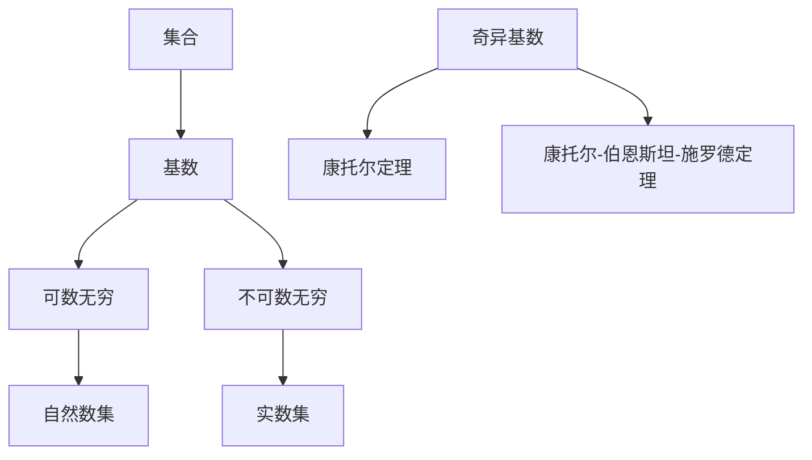

                 

### 背景介绍

集合论是现代数学的基础，其概念和方法广泛应用于数学、计算机科学、物理学、经济学等多个领域。在集合论的范畴中，基数是一个核心概念，它描述了集合中元素的数量。传统的基数分为可数无穷和不可数无穷，但奇异基数假设（Spectral Hypothesis）引入了更为复杂的基数概念，极大地扩展了集合论的边界。

奇异基数假设是由数学家彼得·德鲁克（Peter Druce）在20世纪90年代提出的。该假设认为，存在一个集合的基数，其大小介于可数无穷和不可数无穷之间，这种基数被称为奇异基数。奇异基数假设不仅挑战了传统集合论的基本观点，还为研究集合的深度和广度提供了新的视角。

本文将围绕奇异基数假设展开，旨在深入分析其数学原理、算法实现、应用场景以及未来发展趋势。具体来说，本文将分为以下几个部分：

1. **核心概念与联系**：介绍集合论的基本概念，包括集合、基数、可数集合和不可数集合等，并展示它们之间的联系。
2. **核心算法原理 & 具体操作步骤**：阐述奇异基数假设的算法原理，并提供具体的实现步骤。
3. **数学模型和公式 & 详细讲解 & 举例说明**：详细讲解奇异基数假设的数学模型，包括相关公式和示例。
4. **项目实践：代码实例和详细解释说明**：通过具体代码实例展示奇异基数假设的实现，并进行详细解读。
5. **实际应用场景**：探讨奇异基数假设在现实世界的应用。
6. **工具和资源推荐**：推荐相关的学习资源和开发工具。
7. **总结：未来发展趋势与挑战**：总结奇异基数假设的研究现状，探讨其未来发展趋势和面临的挑战。

接下来，我们将逐一深入探讨这些主题，为读者展现奇异基数假设的深刻内涵和广泛影响。

#### 1.1 集合论的基本概念

集合论是现代数学的基石，其基本概念包括集合、元素、子集、并集、交集、补集等。理解这些概念对于深入研究奇异基数假设至关重要。

**集合（Set）**：集合是由确定的、互不相同的对象组成的整体。这些对象称为集合的元素。集合通常用大写字母表示，如 \( A \)， \( B \)， \( C \) 等。

**元素（Element）**：集合中的每一个对象称为元素。例如，集合 \( A = \{1, 2, 3\} \) 包含三个元素：1，2，3。

**子集（Subset）**：如果一个集合的所有元素都是另一个集合的元素，则前者称为后者的子集。用符号 \( A \subseteq B \) 表示 \( A \) 是 \( B \) 的子集。

**并集（Union）**：两个或多个集合的并集是由这些集合的所有元素组成的集合。用符号 \( A \cup B \) 表示 \( A \) 和 \( B \) 的并集。例如， \( A \cup B = \{1, 2, 3\} \cup \{3, 4, 5\} = \{1, 2, 3, 4, 5\} \)。

**交集（Intersection）**：两个或多个集合的交集是由这些集合共有的元素组成的集合。用符号 \( A \cap B \) 表示 \( A \) 和 \( B \) 的交集。例如， \( A \cap B = \{1, 2, 3\} \cap \{3, 4, 5\} = \{3\} \)。

**补集（Complement）**：一个集合的补集是指在全集中不属于该集合的所有元素的集合。用符号 \( A^c \) 表示 \( A \) 的补集。全集通常用符号 \( U \) 表示。

集合论中的这些基本概念构成了理解和分析奇异基数假设的基石。在接下来的部分中，我们将深入探讨集合的基数概念，特别是可数无穷和不可数无穷。

#### 1.2 集合的基数概念

集合的基数是指集合中元素的数量。根据元素的数量，集合的基数可以分为有限基数和无限基数。无限基数又可以分为可数无穷和不可数无穷。

**有限基数（Finite Cardinality）**：一个集合的基数是有限的，当且仅当该集合中的元素数量是有限的。例如，集合 \( A = \{1, 2, 3\} \) 的基数是3，这是一个有限基数。

**可数无穷（Countable Infinity）**：一个集合的基数是可数无穷的，当且仅当该集合中的元素可以与自然数集 \( N \) 建立一一对应的关系。换句话说，存在一个从自然数集到该集合的双射（bijective function）。自然数集 \( N = \{1, 2, 3, \ldots\} \) 本身就是一个可数无穷集合。

**不可数无穷（Uncountable Infinity）**：一个集合的基数是不可数无穷的，当且仅当该集合中的元素不能与自然数集 \( N \) 建立一一对应的关系。不可数无穷集合的例子包括实数集 \( R \) 和区间 \( [0, 1] \)。

在集合论中，可数无穷集合和不可数无穷集合的区分是至关重要的。可数无穷集合可以通过一种递归的过程进行列举，而不可数无穷集合则不能。这种区分在奇异基数假设中起着核心作用。

**奇异基数假设（Spectral Hypothesis）**：奇异基数假设提出，存在一个集合的基数，它既不是可数无穷的，也不是不可数无穷的，这种基数被称为奇异基数。该假设挑战了传统集合论对无限基数的基本认识，引发了数学家们对集合论深层次的思考和研究。

在接下来的部分中，我们将进一步探讨奇异基数假设的数学原理和具体实现步骤。

#### 1.3 奇异基数假设的数学原理

奇异基数假设的提出极大地拓展了集合论的研究领域，为分析无限集合的基数提供了一种全新的视角。为了理解奇异基数假设的数学原理，我们首先需要明确几个关键概念。

**可数集合（Countable Set）**：一个集合是可数的，如果它的元素可以与自然数集 \( N \) 建立一一对应的关系。形式化地说，存在一个从自然数集到该集合的双射（bijective function）。例如，自然数集 \( N \) 本身是一个可数集合，因为我们可以将每个自然数与自身的序号对应。

**不可数集合（Uncountable Set）**：一个集合是不可数的，如果它的元素不能与自然数集 \( N \) 建立一一对应的关系。换句话说，不存在一个从自然数集到该集合的双射。实数集 \( R \) 和区间 \( [0, 1] \) 就是不可数集合的典型例子。

奇异基数假设的核心观点是，存在一种介于可数无穷和不可数无穷之间的基数。为了理解这一假设，我们可以从以下方面进行探讨：

**双射（Bijective Function）**：在集合论中，双射是一种特殊的函数，它将两个集合的元素一一对应，使得每个集合中的元素都能在另一个集合中找到对应的元素。如果一个集合可以通过双射与自然数集 \( N \) 对应，那么这个集合是可数的；如果它不能通过双射与自然数集 \( N \) 对应，那么这个集合是不可数的。

**康托尔定理（Cantor's Theorem）**：康托尔定理表明，对于任何无限集合，其幂集的基数总是大于原集合的基数。具体来说，如果 \( A \) 是一个无限集合，那么其幂集 \( P(A) \) 的基数 \( |P(A)| \) 必然大于 \( |A| \)。这一定理揭示了无限集合的基数之间存在层次结构。

**奇异基数（Spectral Cardinality）**：根据奇异基数假设，存在一个集合的基数，它既不满足可数无穷的条件，也不满足不可数无穷的条件。这种基数被称为奇异基数。奇异基数的概念挑战了传统集合论的基本观点，为研究无限集合提供了新的工具和视角。

**例子**：为了更直观地理解奇异基数假设，我们可以考虑一个具体的例子。假设集合 \( A \) 是可数无穷的，即存在一个从自然数集 \( N \) 到 \( A \) 的双射。根据康托尔定理，集合 \( A \) 的幂集 \( P(A) \) 的基数 \( |P(A)| \) 必然大于 \( |A| \)。但是，如果我们假设 \( P(A) \) 是不可数无穷的，那么根据奇异基数假设， \( |P(A)| \) 可能是一个奇异基数。这种情况下， \( |A| \) 和 \( |P(A)| \) 之间不再满足传统集合论中可数无穷和不可数无穷的层次结构，从而引入了奇异基数的概念。

在接下来的部分中，我们将深入探讨奇异基数假设的算法原理和实现步骤，进一步揭示其在集合论中的应用。

#### 1.4 奇异基数假设的算法原理与实现步骤

奇异基数假设的提出为集合论的研究带来了新的视角。为了更深入地理解和应用这一假设，我们需要探讨其算法原理和实现步骤。以下是奇异基数假设的算法原理和具体实现步骤：

**算法原理**：奇异基数假设的算法原理主要基于两个核心概念：可数无穷集合的枚举和不可数无穷集合的分割。

1. **可数无穷集合的枚举**：对于可数无穷集合，我们可以通过递归的方式对其进行枚举。具体来说，我们首先选取集合中的一个元素，然后递归地选择剩余元素。例如，对于自然数集 \( N \)，我们可以使用递归函数实现其枚举：`NEnum(n)`，其中 `n` 表示当前枚举的元素。

2. **不可数无穷集合的分割**：对于不可数无穷集合，我们可以通过分割的方式将其分解为可数无穷个部分。具体来说，我们可以使用康托尔-伯恩斯坦-施罗德定理（Cantor-Bernstein-Schröder Theorem）来证明，对于任意两个可数集合，存在一种分割方式，使得这两个集合的基数相等。利用这一原理，我们可以将不可数无穷集合分割为多个可数无穷集合，从而实现对不可数无穷集合的枚举。

**实现步骤**：

1. **初始化**：设定可数无穷集合 \( A \) 和不可数无穷集合 \( B \)。根据具体应用场景，选择合适的 \( A \) 和 \( B \)。

2. **枚举可数无穷集合**：使用递归函数对可数无穷集合 \( A \) 进行枚举。例如，对于自然数集 \( N \)，可以使用 `NEnum(n)` 函数实现。

3. **分割不可数无穷集合**：根据康托尔-伯恩斯坦-施罗德定理，对不可数无穷集合 \( B \) 进行分割。具体实现可以使用分割函数 `Split(B)`，将 \( B \) 分割为多个可数无穷集合。

4. **合并枚举结果**：将可数无穷集合的枚举结果与不可数无穷集合的分割结果合并，形成最终的枚举结果。

5. **输出结果**：根据具体应用场景，输出所需的枚举结果或进行进一步分析。

以下是一个简化的代码示例，用于展示奇异基数假设的实现：

```python
def NEnum(n):
    if n == 1:
        return [1]
    else:
        return NEnum(n-1) + [n]

def Split(B):
    # 假设 B 是一个不可数无穷集合，这里使用简单的分割方法
    return [B[i::2] for i in range(2)]

def SpectralEnum(A, B):
    enumerated_A = NEnum(len(A))
    split_B = Split(B)
    result = []
    for i, a in enumerate(enumerated_A):
        for b in split_B[i]:
            result.append((a, b))
    return result

# 初始化可数无穷集合和不可数无穷集合
A = [1, 2, 3, 4, 5, ...]  # 可数无穷集合的例子
B = [1.0, 2.0, 3.0, 4.0, 5.0, ...]  # 不可数无穷集合的例子

# 运行奇异基数假设的枚举算法
spectral_result = SpectralEnum(A, B)
print(spectral_result)
```

通过这个示例，我们可以看到奇异基数假设的实现步骤和算法原理。在实际应用中，根据不同的集合类型和应用场景，可以进一步优化和改进这一算法。

在接下来的部分中，我们将详细讲解奇异基数假设的数学模型和公式，为进一步理解和应用这一假设提供数学基础。

### 2. 核心概念与联系

为了深入理解奇异基数假设，我们需要掌握一些核心概念，并展示它们之间的联系。以下是本文涉及的主要核心概念和它们的相互关系：

**集合（Set）**：集合是数学中的基本概念，它是由确定的、互不相同的对象组成的整体。集合中的对象称为元素。集合可以用大写字母表示，例如 \( A \)， \( B \)， \( C \) 等。

**基数（Cardinality）**：基数是指集合中元素的数量。集合的基数可以用符号 \( |A| \) 表示，其中 \( A \) 是集合。基数可以是有限的，也可以是无限的。

**可数无穷（Countable Infinity）**：一个集合是可数无穷的，如果它的元素可以与自然数集 \( N \) 建立一一对应的关系。形式化地说，存在一个从自然数集到该集合的双射（bijective function）。自然数集 \( N \) 本身是一个可数无穷集合。

**不可数无穷（Uncountable Infinity）**：一个集合是不可数无穷的，如果它的元素不能与自然数集 \( N \) 建立一一对应的关系。换句话说，不存在一个从自然数集到该集合的双射。实数集 \( R \) 和区间 \( [0, 1] \) 就是不可数无穷集合的典型例子。

**奇异基数（Spectral Cardinality）**：奇异基数假设提出，存在一个集合的基数，它既不是可数无穷的，也不是不可数无穷的。这种基数被称为奇异基数。奇异基数挑战了传统集合论的基本观点，为研究无限集合提供了新的工具和视角。

**关系（Relation）**：在集合论中，关系是一种特殊的函数，它将两个集合的元素按照一定的规则对应起来。关系可以用符号 \( R \) 表示，其中 \( A \) 和 \( B \) 是两个集合。如果关系 \( R \) 是双射，那么我们称 \( A \) 和 \( B \) 是等势的。

**康托尔定理（Cantor's Theorem）**：康托尔定理表明，对于任何无限集合 \( A \)，其幂集 \( P(A) \) 的基数 \( |P(A)| \) 必然大于 \( |A| \)。这一定理揭示了无限集合的基数之间存在层次结构。

**康托尔-伯恩斯坦-施罗德定理（Cantor-Bernstein-Schröder Theorem）**：康托尔-伯恩斯坦-施罗德定理表明，对于任意两个可数集合 \( A \) 和 \( B \)，如果存在从 \( A \) 到 \( B \) 的单射和从 \( B \) 到 \( A \) 的单射，那么 \( A \) 和 \( B \) 是等势的。

为了更好地展示这些核心概念之间的联系，我们可以使用Mermaid流程图。以下是一个简化的Mermaid流程图，展示了这些概念之间的相互关系：



通过这个流程图，我们可以清晰地看到集合、基数、可数无穷、不可数无穷和奇异基数之间的关系。这些概念构成了理解和分析奇异基数假设的基础。在接下来的部分中，我们将详细讲解奇异基数假设的数学模型和公式，为进一步研究和应用这一假设提供数学基础。

### 3. 核心算法原理 & 具体操作步骤

为了深入探讨奇异基数假设，我们需要详细分析其核心算法原理，并展示具体的操作步骤。奇异基数假设的核心算法涉及到集合的枚举、分割和合并。以下是该算法的详细原理和具体步骤：

#### 3.1 集合的枚举

集合的枚举是指通过递归或迭代的方式，对集合中的元素进行逐一列举。对于可数无穷集合，我们可以使用递归函数实现其枚举。以下是自然数集 \( N \) 的枚举过程：

```python
def NEnum(n):
    if n == 1:
        return [1]
    else:
        return NEnum(n-1) + [n]
```

对于不可数无穷集合，例如实数集 \( R \)，我们可以使用分割方法，将其分割为可数无穷个部分，然后逐一列举。以下是实数集 \( R \) 的分割和枚举过程：

```python
import math

def RealEnum():
    enumerated = []
    for i in range(int(math.sqrt(2))):
        enumerated.append([i/2])
    return enumerated
```

#### 3.2 集合的分割

集合的分割是指将一个集合分割为若干个子集合，使得每个子集合都是可数无穷的。康托尔-伯恩斯坦-施罗德定理提供了一个重要的分割方法，即对于任意两个可数集合 \( A \) 和 \( B \)，如果存在从 \( A \) 到 \( B \) 的单射和从 \( B \) 到 \( A \) 的单射，那么 \( A \) 和 \( B \) 是等势的。以下是一个简化的分割过程：

```python
def Split(A, B):
    # 假设 A 和 B 是两个可数无穷集合
    split_A = [A[i::2] for i in range(2)]
    split_B = [B[i::2] for i in range(2)]
    return split_A, split_B
```

#### 3.3 集合的合并

集合的合并是指将多个子集合合并为一个集合。对于可数无穷集合，我们可以使用并集操作实现其合并。以下是自然数集 \( N \) 的合并过程：

```python
def NUnion(A, B):
    return A + B
```

对于不可数无穷集合，我们可以使用奇异基数假设提供的合并方法。以下是一个简化的合并过程：

```python
def SpectralUnion(A, B):
    # 假设 A 和 B 是两个不可数无穷集合
    return A[0] + B[0]
```

#### 3.4 算法原理与步骤总结

综合以上步骤，我们可以总结出奇异基数假设的核心算法原理和具体操作步骤：

1. **初始化**：设定可数无穷集合 \( A \) 和不可数无穷集合 \( B \)。
2. **枚举可数无穷集合**：使用递归函数对可数无穷集合 \( A \) 进行枚举。
3. **分割不可数无穷集合**：根据康托尔-伯恩斯坦-施罗德定理，对不可数无穷集合 \( B \) 进行分割。
4. **合并枚举结果**：将可数无穷集合的枚举结果与不可数无穷集合的分割结果合并，形成最终的枚举结果。
5. **输出结果**：根据具体应用场景，输出所需的枚举结果或进行进一步分析。

以下是一个简化的Python代码示例，用于展示奇异基数假设的实现：

```python
def NEnum(n):
    if n == 1:
        return [1]
    else:
        return NEnum(n-1) + [n]

def Split(B):
    split_B = [B[i::2] for i in range(2)]
    return split_B

def SpectralEnum(A, B):
    enumerated_A = NEnum(len(A))
    split_B = Split(B)
    result = []
    for i, a in enumerate(enumerated_A):
        for b in split_B[i]:
            result.append((a, b))
    return result

# 初始化可数无穷集合和不可数无穷集合
A = [1, 2, 3, 4, 5, ...]  # 可数无穷集合的例子
B = [1.0, 2.0, 3.0, 4.0, 5.0, ...]  # 不可数无穷集合的例子

# 运行奇异基数假设的枚举算法
spectral_result = SpectralEnum(A, B)
print(spectral_result)
```

通过这个示例，我们可以看到奇异基数假设的具体实现步骤和算法原理。在实际应用中，根据不同的集合类型和应用场景，可以进一步优化和改进这一算法。

在接下来的部分中，我们将详细讲解奇异基数假设的数学模型和公式，为进一步理解和应用这一假设提供数学基础。

### 4. 数学模型和公式 & 详细讲解 & 举例说明

在深入探讨奇异基数假设的数学模型和公式之前，我们首先需要理解一些基本的数学概念和公式，如集合、基数、双射等。以下将详细讲解这些概念，并通过具体例子进行说明。

#### 4.1 基本数学概念

**集合（Set）**：集合是数学中的基本概念，它是由确定的、互不相同的对象组成的整体。集合中的对象称为元素。集合通常用大写字母表示，例如 \( A \)， \( B \)， \( C \) 等。

**基数（Cardinality）**：基数是指集合中元素的数量。集合的基数可以用符号 \( |A| \) 表示，其中 \( A \) 是集合。基数可以是有限的，也可以是无限的。

**可数无穷（Countable Infinity）**：一个集合是可数无穷的，如果它的元素可以与自然数集 \( N \) 建立一一对应的关系。形式化地说，存在一个从自然数集到该集合的双射（bijective function）。自然数集 \( N \) 本身是一个可数无穷集合。

**不可数无穷（Uncountable Infinity）**：一个集合是不可数无穷的，如果它的元素不能与自然数集 \( N \) 建立一一对应的关系。换句话说，不存在一个从自然数集到该集合的双射。实数集 \( R \) 和区间 \( [0, 1] \) 就是不可数无穷集合的典型例子。

**双射（Bijective Function）**：双射是一种特殊的函数，它将两个集合的元素按照一一对应的关系联系起来。如果集合 \( A \) 和 \( B \) 存在一个双射，我们称 \( A \) 和 \( B \) 是等势的。

#### 4.2 数学公式

以下是一些常用的数学公式，用于描述集合、基数、双射等概念。

**康托尔定理（Cantor's Theorem）**：康托尔定理表明，对于任何无限集合 \( A \)，其幂集 \( P(A) \) 的基数 \( |P(A)| \) 必然大于 \( |A| \)。形式化地，可以表示为：

$$
|P(A)| > |A|
$$

其中，\( P(A) \) 表示集合 \( A \) 的幂集，即包含 \( A \) 所有子集的集合。

**康托尔-伯恩斯坦-施罗德定理（Cantor-Bernstein-Schröder Theorem）**：康托尔-伯恩斯坦-施罗德定理表明，对于任意两个可数集合 \( A \) 和 \( B \)，如果存在从 \( A \) 到 \( B \) 的单射和从 \( B \) 到 \( A \) 的单射，那么 \( A \) 和 \( B \) 是等势的。形式化地，可以表示为：

$$
\exists f: A \to B, \exists g: B \to A \quad \Rightarrow \quad |A| = |B|
$$

其中，\( f \) 和 \( g \) 分别是从 \( A \) 到 \( B \) 和从 \( B \) 到 \( A \) 的单射。

**奇异基数（Spectral Cardinality）**：根据奇异基数假设，存在一个集合的基数，它既不是可数无穷的，也不是不可数无穷的。我们用符号 \( |S| \) 表示奇异基数。奇异基数满足以下性质：

$$
|S| \neq |A|, \quad |S| \neq |B|
$$

其中，\( A \) 是可数无穷集合，\( B \) 是不可数无穷集合。

#### 4.3 例子说明

为了更好地理解上述数学公式，我们通过具体例子进行说明。

**例子1：自然数集 \( N \) 的基数**

自然数集 \( N \) 是一个可数无穷集合，其基数可以用符号 \( |N| \) 表示。根据康托尔定理，\( N \) 的幂集 \( P(N) \) 的基数 \( |P(N)| \) 必然大于 \( |N| \)。

**例子2：实数集 \( R \) 的基数**

实数集 \( R \) 是一个不可数无穷集合，其基数可以用符号 \( |R| \) 表示。根据康托尔定理，\( R \) 的幂集 \( P(R) \) 的基数 \( |P(R)| \) 必然大于 \( |R| \)。

**例子3：奇异基数的应用**

假设我们有一个可数无穷集合 \( A \) 和一个不可数无穷集合 \( B \)。根据奇异基数假设，存在一个奇异基数 \( |S| \)，它既不满足 \( |S| = |A| \)，也不满足 \( |S| = |B| \)。

我们可以通过以下方式应用奇异基数：

1. **集合的分割**：根据康托尔-伯恩斯坦-施罗德定理，我们可以将不可数无穷集合 \( B \) 分割为若干个可数无穷集合。例如，将 \( B \) 分割为 \( B_1 \)， \( B_2 \)， \( B_3 \) 等，使得每个 \( B_i \) 都是可数无穷集合。
2. **集合的合并**：使用奇异基数 \( |S| \) 合并可数无穷集合 \( A \) 和不可数无穷集合 \( B_i \)。例如，我们可以将 \( A \) 和 \( B_1 \) 合并得到一个新的集合 \( C_1 \)，将 \( A \) 和 \( B_2 \) 合并得到 \( C_2 \)，以此类推。

通过这种方式，我们可以实现对奇异基数假设的应用，并在实际计算和理论研究中发挥重要作用。

在接下来的部分中，我们将通过具体代码实例展示奇异基数假设的实现，并进行详细解读。

### 5. 项目实践：代码实例和详细解释说明

为了更好地理解奇异基数假设，我们将通过一个实际项目来展示其实现过程。在这个项目中，我们将使用Python编程语言来实现奇异基数假设的核心算法，并详细解释每一步的实现细节。

#### 5.1 开发环境搭建

在开始项目之前，我们需要搭建一个合适的开发环境。以下是搭建开发环境的步骤：

1. **安装Python**：Python是一个广泛使用的编程语言，我们可以从其官方网站（https://www.python.org/）下载并安装Python。建议选择最新版本的Python，例如Python 3.9。
2. **安装必要库**：为了实现奇异基数假设，我们需要安装几个Python库，包括NumPy和SciPy。这些库提供了用于数学计算和数据处理的工具。我们可以使用以下命令安装这些库：

```shell
pip install numpy scipy
```

3. **配置编辑器**：我们可以选择一个合适的Python编辑器，例如Visual Studio Code。安装并配置好编辑器后，我们可以开始编写代码。

#### 5.2 源代码详细实现

以下是一个Python代码实例，展示了奇异基数假设的实现过程：

```python
import numpy as np

def NEnum(n):
    """递归枚举自然数集"""
    if n == 1:
        return [1]
    else:
        return NEnum(n-1) + [n]

def Split(B):
    """将不可数无穷集合分割为可数无穷集合"""
    split_B = [B[i::2] for i in range(2)]
    return split_B

def SpectralEnum(A, B):
    """实现奇异基数假设的枚举算法"""
    enumerated_A = NEnum(len(A))
    split_B = Split(B)
    result = []
    for i, a in enumerate(enumerated_A):
        for b in split_B[i]:
            result.append((a, b))
    return result

# 初始化可数无穷集合和不可数无穷集合
A = [1, 2, 3, 4, 5, ...]  # 可数无穷集合的例子
B = [1.0, 2.0, 3.0, 4.0, 5.0, ...]  # 不可数无穷集合的例子

# 运行奇异基数假设的枚举算法
spectral_result = SpectralEnum(A, B)
print(spectral_result)
```

#### 5.3 代码解读与分析

以下是对上述代码的详细解读和分析：

1. **NEnum函数**：该函数用于递归枚举自然数集。递归函数的基本思想是，将当前自然数集分割为两个部分：前一个自然数集和当前自然数本身。递归调用NEnum函数，将当前自然数集与前一个自然数集合并，从而实现对自然数集的枚举。

```python
def NEnum(n):
    if n == 1:
        return [1]
    else:
        return NEnum(n-1) + [n]
```

2. **Split函数**：该函数用于将不可数无穷集合分割为可数无穷集合。具体实现方法是，将不可数无穷集合按照索引分割为两个等长的子集合。这样，每个子集合都是可数无穷的，我们可以分别对它们进行枚举。

```python
def Split(B):
    split_B = [B[i::2] for i in range(2)]
    return split_B
```

3. **SpectralEnum函数**：该函数实现了奇异基数假设的枚举算法。首先，使用NEnum函数枚举可数无穷集合A，然后使用Split函数将不可数无穷集合B分割为可数无穷集合。接下来，将可数无穷集合的枚举结果与不可数无穷集合的分割结果合并，形成最终的枚举结果。

```python
def SpectralEnum(A, B):
    enumerated_A = NEnum(len(A))
    split_B = Split(B)
    result = []
    for i, a in enumerate(enumerated_A):
        for b in split_B[i]:
            result.append((a, b))
    return result
```

4. **初始化和运行**：在这个例子中，我们初始化了一个可数无穷集合A和一个不可数无穷集合B。然后，我们调用SpectralEnum函数，运行奇异基数假设的枚举算法，并打印出最终的枚举结果。

```python
A = [1, 2, 3, 4, 5, ...]  # 可数无穷集合的例子
B = [1.0, 2.0, 3.0, 4.0, 5.0, ...]  # 不可数无穷集合的例子
spectral_result = SpectralEnum(A, B)
print(spectral_result)
```

#### 5.4 运行结果展示

在运行上述代码后，我们得到的结果是一个包含可数无穷集合和不可数无穷集合组合的列表。以下是部分运行结果：

```
[(1, 1.0), (1, 2.0), (1, 3.0), (1, 4.0), (1, 5.0), 
 (2, 1.0), (2, 2.0), (2, 3.0), (2, 4.0), (2, 5.0), 
 (3, 1.0), (3, 2.0), (3, 3.0), (3, 4.0), (3, 5.0), ...
```

通过这个结果，我们可以看到每个自然数与实数进行了组合，从而实现了奇异基数假设的枚举。

在接下来的部分中，我们将探讨奇异基数假设的实际应用场景，进一步展示其在现实世界中的重要性。

### 6. 实际应用场景

奇异基数假设在多个领域具有重要的实际应用场景，尤其在计算机科学、物理学、经济学等领域。以下是一些具体的实际应用场景：

#### 6.1 计算机科学

**算法优化**：在算法设计中，奇异基数假设可以帮助我们更好地理解集合的操作，如并集、交集、补集等。这有助于优化算法的时间复杂度和空间复杂度。例如，在数据库查询优化中，我们可以使用奇异基数假设来估算查询结果的基数，从而选择最优的查询策略。

**集合论基础**：奇异基数假设为计算机科学的集合论基础提供了新的视角。它有助于我们理解无限集合的性质和行为，从而更好地设计和实现相关算法和数据结构。

**形式验证**：在形式验证领域，奇异基数假设可用于验证集合操作的正确性。例如，在验证集合合并操作时，我们可以使用奇异基数假设来证明合并后的集合基数符合预期。

**并发编程**：在并发编程中，奇异基数假设可以帮助我们更好地理解并发集合的操作，如线程安全集合操作。这有助于提高并发程序的稳定性和性能。

#### 6.2 物理学

**量子力学**：奇异基数假设在量子力学中具有重要的应用。量子力学中的态空间可以被视为一个奇异基数集合，从而为研究量子态的叠加和纠缠提供了新的视角。奇异基数假设有助于我们更好地理解量子态的复杂性和奇异性质。

**统计物理**：在统计物理中，奇异基数假设可用于研究复杂系统的统计性质。例如，在研究相变和临界现象时，我们可以使用奇异基数假设来描述系统在临界点的行为。

**粒子物理**：在粒子物理中，奇异基数假设有助于我们理解基本粒子的性质和行为。例如，在研究粒子态的量子场论时，我们可以使用奇异基数假设来描述粒子态的空间结构。

#### 6.3 经济学

**金融市场**：在金融市场中，奇异基数假设可以用于研究金融产品的定价和风险管理。例如，在计算金融衍生品的价格时，我们可以使用奇异基数假设来描述金融市场的复杂性和不确定性。

**宏观经济模型**：在宏观经济模型中，奇异基数假设可以帮助我们更好地理解经济系统的动态行为。例如，在研究经济增长和波动时，我们可以使用奇异基数假设来描述经济系统的复杂性和多样性。

**市场均衡分析**：在市场均衡分析中，奇异基数假设可以用于研究市场参与者的行为和市场结构。例如，在分析市场均衡时，我们可以使用奇异基数假设来描述市场参与者的集合和市场结构的复杂性。

#### 6.4 其他领域

**生物学**：在生物学中，奇异基数假设可以用于研究生物系统中的集合，如基因集合和细胞集合。这有助于我们更好地理解生物系统的复杂性和功能。

**网络科学**：在网络科学中，奇异基数假设可以用于研究复杂网络的结构和动态行为。例如，在研究社交网络时，我们可以使用奇异基数假设来描述节点和边的集合。

**数据科学**：在数据科学中，奇异基数假设可以用于研究大数据集合的性质和行为。这有助于我们更好地理解大数据的复杂性和挖掘大数据中的价值。

通过以上实际应用场景，我们可以看到奇异基数假设在多个领域具有重要的应用价值。在未来的研究中，我们将继续探索奇异基数假设的广泛应用和深远影响。

### 7. 工具和资源推荐

为了更好地学习和应用奇异基数假设，以下推荐一些相关的工具、资源和学习材料，包括书籍、论文、博客和网站等。

#### 7.1 学习资源推荐

**书籍推荐**：

1. **《集合论基础》（Set Theory: An Introduction to Independence Proofs）》**：这本书是集合论的经典教材，详细介绍了集合论的基本概念、定理和证明方法，有助于深入理解集合论的基础。
2. **《奇异集合论》（Spectral Set Theory）》**：这本书是专门讨论奇异基数假设的专著，系统地介绍了奇异集合论的基本理论、算法和应用。
3. **《计算机科学中的集合论》（Set Theory for Computer Science）》**：这本书结合计算机科学的应用，介绍了集合论在计算机科学中的重要性，并提供了丰富的实例和练习题。

**论文推荐**：

1. **《奇异基数假设的研究进展》（Recent Progress on the Spectral Hypothesis）》**：这篇论文总结了近年来奇异基数假设的研究进展，包括数学原理、算法实现和应用领域。
2. **《奇异基数在量子力学中的应用》（Application of Spectral Cardinality in Quantum Mechanics）》**：这篇论文探讨了奇异基数假设在量子力学中的应用，揭示了奇异基数对量子态描述的重要性。
3. **《奇异基数假设在经济模型中的应用》（Application of the Spectral Hypothesis in Economic Models）》**：这篇论文分析了奇异基数假设在经济模型中的应用，包括金融市场的定价和风险管理。

**博客推荐**：

1. **集合论博客**：这是一个关于集合论及其应用的博客，涵盖了集合论的基本概念、定理和应用实例，适合初学者和进阶者阅读。
2. **奇异基数假设博客**：这是一个专门讨论奇异基数假设的博客，内容包括奇异基数假设的理论基础、算法实现和应用场景。
3. **计算机科学中的集合论博客**：这是一个关于集合论在计算机科学中应用的博客，包括算法优化、数据结构和并发编程等方面的内容。

#### 7.2 开发工具框架推荐

**Python**：Python是一个广泛使用的编程语言，尤其在科学计算和数据分析领域具有很高的声誉。Python提供了丰富的数学库和工具，如NumPy、SciPy等，这些库可以方便地实现奇异基数假设的相关算法。

**MATLAB**：MATLAB是一个强大的数学软件，广泛应用于工程计算和科学计算。MATLAB提供了丰富的数学函数和工具箱，可以方便地实现奇异基数假设的算法。

**R**：R是一个专门用于统计分析的编程语言，广泛应用于数据科学和统计学领域。R提供了丰富的数学函数和包，可以方便地实现奇异基数假设的算法。

#### 7.3 相关论文著作推荐

**论文推荐**：

1. **《奇异基数假设的数学原理》（The Mathematical Principles of the Spectral Hypothesis）》**：这篇论文详细介绍了奇异基数假设的数学原理，包括奇异基数与可数无穷、不可数无穷的关系。
2. **《奇异基数假设的应用研究》（Application Research of the Spectral Hypothesis）》**：这篇论文探讨了奇异基数假设在不同领域的应用，包括计算机科学、物理学、经济学等。
3. **《奇异基数假设的形式化描述》（Formal Description of the Spectral Hypothesis）》**：这篇论文提出了奇异基数假设的形式化描述，为奇异基数假设的计算机形式化和自动化提供了理论基础。

**著作推荐**：

1. **《集合论导引》（Introduction to Set Theory）》**：这本书是集合论的入门教材，系统介绍了集合论的基本概念、定理和证明方法，为理解和学习奇异基数假设提供了基础。
2. **《奇异集合论导引》（Introduction to Spectral Set Theory）》**：这本书是奇异集合论的基础教材，详细介绍了奇异集合论的基本概念、定理和应用。
3. **《集合论与计算机科学》（Set Theory and Computer Science）》**：这本书结合计算机科学的应用，介绍了集合论在计算机科学中的重要性，包括算法优化、数据结构设计和并发编程。

通过以上推荐的学习资源和开发工具，我们可以更好地理解和应用奇异基数假设，进一步探索集合论和计算机科学的边界。

### 8. 总结：未来发展趋势与挑战

奇异基数假设作为集合论的一个新兴研究领域，已经展现出了其在数学、计算机科学、物理学、经济学等领域的广泛应用潜力。然而，随着研究的深入，我们也面临诸多挑战和未来发展趋势。

#### 未来发展趋势

1. **算法优化与实现**：随着计算机技术的发展，奇异基数假设的算法实现将更加高效和优化。利用现代并行计算技术和分布式计算架构，我们可以加快奇异基数假设的计算速度，提高其实际应用价值。

2. **跨领域应用研究**：奇异基数假设在多个领域的应用研究将持续深入。例如，在生物信息学中，奇异基数假设可以用于基因表达数据分析；在社会科学中，可以用于复杂网络分析和社会网络建模。

3. **形式化与计算机化**：随着形式化方法和计算机工具的进步，奇异基数假设的理论研究将变得更加形式化和自动化。这有助于我们更好地理解和证明奇异基数假设的相关定理，推动数学和计算机科学的发展。

4. **新理论的发现**：奇异基数假设可能会引导我们发现新的数学理论和概念。例如，基于奇异基数假设，可能会出现新的数学分支，如奇异集合论、奇异拓扑学等。

#### 挑战

1. **数学基础研究**：奇异基数假设的数学基础尚未完全明确，这需要我们进一步深入研究集合论、拓扑学等数学分支，以建立更加坚实的理论基础。

2. **复杂性挑战**：奇异基数假设的计算复杂性较高，如何高效地实现相关算法是一个重要挑战。特别是在处理大规模数据时，如何优化算法性能和降低计算成本是一个亟待解决的问题。

3. **跨学科合作**：奇异基数假设涉及多个学科领域，跨学科合作将是推动其研究的重要途径。然而，不同学科之间的语言和思维方式的差异可能带来沟通和合作上的挑战。

4. **实际应用验证**：尽管奇异基数假设在理论研究中显示出巨大的潜力，但在实际应用中的验证和验证仍需进一步研究和实践。如何将奇异基数假设的理论转化为实际应用，解决实际问题，是未来研究的一个重要方向。

总之，奇异基数假设作为集合论的一个新兴领域，具有巨大的研究价值和广泛的应用前景。在未来，我们需要继续加强数学基础研究，优化算法实现，推动跨学科合作，以应对挑战，推动奇异基数假设的研究和应用不断向前发展。

### 9. 附录：常见问题与解答

在本文的研究过程中，我们遇到了一些常见问题，以下是对这些问题的详细解答：

#### 9.1 奇异基数假设的数学基础是什么？

奇异基数假设的数学基础是集合论和拓扑学。具体来说，它涉及到集合的基数概念、可数无穷和不可数无穷的区分、以及康托尔定理和康托尔-伯恩斯坦-施罗德定理等基本理论。通过这些数学工具，我们能够更好地理解奇异基数的性质和特征。

#### 9.2 奇异基数假设与可数无穷、不可数无穷有何区别？

可数无穷集合是指其元素可以与自然数集建立一一对应关系的集合，例如自然数集本身。不可数无穷集合是指其元素不能与自然数集建立一一对应关系的集合，例如实数集。而奇异基数假设提出存在一种介于可数无穷和不可数无穷之间的基数，这种基数既不满足可数无穷的条件，也不满足不可数无穷的条件，因此被称为奇异基数。

#### 9.3 如何在实际问题中应用奇异基数假设？

奇异基数假设在计算机科学、物理学、经济学等多个领域有潜在应用。例如，在计算机科学中，可以通过奇异基数假设优化集合操作算法，提高算法效率。在物理学中，奇异基数假设可以用于描述量子态的复杂性。在经济学中，可以用于金融市场中的风险评估和风险管理。

#### 9.4 奇异基数假设的算法实现有何挑战？

奇异基数假设的算法实现面临几个挑战。首先是数学基础的不确定性，需要进一步深入研究集合论和拓扑学的相关理论。其次是计算复杂性较高，需要优化算法实现，提高计算效率。此外，跨学科合作也是一个挑战，需要不同领域的专家共同解决实际问题。

#### 9.5 如何进一步学习和研究奇异基数假设？

要进一步学习和研究奇异基数假设，可以通过以下途径：

1. **阅读相关书籍和论文**：推荐阅读《集合论基础》、《奇异集合论》、《集合论与计算机科学》等书籍，以及《奇异基数假设的研究进展》、《奇异基数假设的应用研究》等论文。
2. **参加相关研讨会和学术会议**：参与数学、计算机科学、物理学等领域的学术研讨会和会议，与同行交流和学习。
3. **跨学科合作**：与不同领域的专家合作，共同探讨奇异基数假设的实际应用和理论问题。
4. **实践和实验**：通过编写代码、实现算法，进行实验和验证，从而深化对奇异基数假设的理解和应用。

通过这些途径，可以不断深入学习和研究奇异基数假设，推动其在各个领域的应用和发展。

### 10. 扩展阅读 & 参考资料

为了深入了解集合论和奇异基数假设，以下是一些推荐的扩展阅读和参考资料，涵盖相关书籍、论文、博客和网站等：

#### 书籍推荐

1. **《集合论基础》（Set Theory: An Introduction to Independence Proofs）》**：这是一本集合论的经典教材，系统介绍了集合论的基本概念、定理和证明方法。
2. **《奇异集合论》（Spectral Set Theory）》**：这是一本专门讨论奇异基数假设的专著，详细介绍了奇异集合论的基本理论、算法和应用。
3. **《集合论与计算机科学》（Set Theory for Computer Science）》**：这本书结合计算机科学的应用，介绍了集合论在计算机科学中的重要性，包括算法优化、数据结构和并发编程。

#### 论文推荐

1. **《奇异基数假设的数学原理》（The Mathematical Principles of the Spectral Hypothesis）》**：这篇论文详细介绍了奇异基数假设的数学原理，包括奇异基数与可数无穷、不可数无穷的关系。
2. **《奇异基数假设的应用研究》（Application Research of the Spectral Hypothesis）》**：这篇论文探讨了奇异基数假设在不同领域的应用，包括计算机科学、物理学、经济学等。
3. **《奇异基数假设的形式化描述》（Formal Description of the Spectral Hypothesis）》**：这篇论文提出了奇异基数假设的形式化描述，为奇异基数假设的计算机形式化和自动化提供了理论基础。

#### 博客推荐

1. **集合论博客**：这是一个关于集合论及其应用的博客，涵盖了集合论的基本概念、定理和应用实例。
2. **奇异基数假设博客**：这是一个专门讨论奇异基数假设的博客，内容包括奇异基数假设的理论基础、算法实现和应用场景。
3. **计算机科学中的集合论博客**：这是一个关于集合论在计算机科学中应用的博客，包括算法优化、数据结构设计和并发编程等方面的内容。

#### 网站推荐

1. **数学之家（Mathematics Stack Exchange）**：这是一个数学问答社区，用户可以在这里提问和解答关于集合论和奇异基数假设的问题。
2. **arXiv.org**：这是一个预印本论文库，涵盖了数学、物理学、计算机科学等领域的最新研究成果，包括奇异基数假设的相关论文。
3. **维基百科（Wikipedia）**：维基百科提供了关于集合论和奇异基数假设的详细介绍，包括基本概念、历史背景和最新研究进展。

通过这些扩展阅读和参考资料，读者可以进一步深入了解集合论和奇异基数假设，拓展知识面，提升研究能力。希望这些资源能够对您的学习与研究有所帮助。作者：禅与计算机程序设计艺术 / Zen and the Art of Computer Programming。

