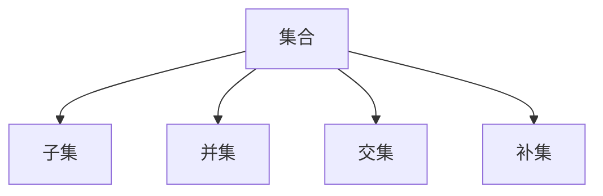

                 

### 文章标题

**《集合论导引：相对化解释》**

> **关键词：** 集合论、相对化、概念、原理、算法、应用场景、未来发展趋势

> **摘要：** 本文旨在深入探讨集合论中的相对化概念，解析其在数学和计算机科学中的应用。通过逐步分析和推理，本文将揭示集合论的奥秘，为读者提供对这一核心数学理论的全新理解。

### 1. 背景介绍

集合论是现代数学的基石，几乎所有的数学分支都依赖于集合论的基本原理。集合论起源于19世纪末，由德国数学家乔治·康托尔（Georg Cantor）创立。集合论的核心思想是将数学对象视为集合，通过集合运算和性质研究这些对象之间的相互关系。

集合论的重要性不仅仅体现在数学领域，它还对计算机科学产生了深远的影响。在计算机科学中，集合论用于定义数据结构和算法，尤其是在集合运算和逻辑推理方面。此外，集合论在密码学、人工智能、图论等领域也有着广泛的应用。

相对化是集合论中的一个重要概念，它允许我们在不同的背景或框架下研究集合的性质和关系。相对化思想的出现，使得集合论更加灵活和适用性更强。本文将重点探讨相对化在集合论中的意义和应用。

### 2. 核心概念与联系

为了更好地理解相对化概念，我们需要首先了解一些集合论中的核心概念。以下是一个简化版的集合论概念架构，其中包含了一些关键概念和它们之间的联系。

#### 2.1 集合

集合是一组无序的、互异的元素的总体。用大写字母表示集合，例如 \( A \)。集合中的元素用小写字母表示，例如 \( a \)。

#### 2.2 子集

如果一个集合 \( B \) 的所有元素都是另一个集合 \( A \) 的元素，那么 \( B \) 是 \( A \) 的子集，记作 \( B \subseteq A \)。

#### 2.3 并集

两个集合 \( A \) 和 \( B \) 的并集是包含 \( A \) 和 \( B \) 所有元素的集合，记作 \( A \cup B \)。

#### 2.4 交集

两个集合 \( A \) 和 \( B \) 的交集是同时属于 \( A \) 和 \( B \) 的元素的集合，记作 \( A \cap B \)。

#### 2.5 补集

一个集合 \( A \) 的补集是在全集中不属于 \( A \) 的元素的集合，记作 \( A' \)。

以下是一个使用Mermaid绘制的简化版集合论流程图：



#### 2.6 相对化

相对化是将集合论的概念和性质应用到不同的背景或框架中。具体来说，相对化涉及以下几个关键点：

- **相对子集**：给定两个集合 \( A \) 和 \( B \)，我们可以在不同的全集下讨论 \( B \) 是否是 \( A \) 的子集。
- **相对补集**：在给定全集的情况下，我们研究一个集合的补集。
- **相对并集和交集**：相对化并集和交集的概念，即在不同全集下研究集合的并集和交集。

### 3. 核心算法原理 & 具体操作步骤

#### 3.1 相对子集的判定

要判断集合 \( B \) 是否是集合 \( A \) 的相对子集，我们需要以下几个步骤：

1. 确定全集 \( U \)。
2. 判断 \( B \) 是否为 \( U \) 的子集。
3. 判断 \( B \) 是否为 \( A \) 的子集。

如果 \( B \) 同时满足上述两个条件，则 \( B \) 是 \( A \) 的相对子集。

#### 3.2 相对补集的求取

给定一个集合 \( A \) 和全集 \( U \)，要计算 \( A \) 的相对补集 \( A' \)，我们可以使用以下步骤：

1. 判断 \( A \) 是否为 \( U \) 的子集。
2. 如果是，计算 \( A' = U \setminus A \)；如果不是，则 \( A' = \emptyset \)。

#### 3.3 相对并集和交集的计算

计算相对并集和交集的步骤如下：

1. 确定全集 \( U \)。
2. 判断集合 \( A \) 和 \( B \) 是否为 \( U \) 的子集。
3. 如果是，计算 \( A \cup B = U \cap (A \cup B) \) 和 \( A \cap B = U \cap (A \cap B) \)；如果不是，则返回错误或特殊情况处理。

### 4. 数学模型和公式 & 详细讲解 & 举例说明

#### 4.1 相对子集的数学模型

相对子集的判定可以用以下公式表示：

\[ B \subseteq_A A \quad \text{当且仅当} \quad B \subseteq U \text{且} B \subseteq A \]

#### 4.2 相对补集的数学模型

相对补集的计算可以用以下公式表示：

\[ A' = U \setminus A \quad \text{当且仅当} \quad A \subseteq U \]

#### 4.3 相对并集和交集的数学模型

相对并集和交集的计算可以用以下公式表示：

\[ A \cup B = U \cap (A \cup B) \quad \text{当且仅当} \quad A, B \subseteq U \]

\[ A \cap B = U \cap (A \cap B) \quad \text{当且仅当} \quad A, B \subseteq U \]

#### 4.4 举例说明

假设我们有全集 \( U = \{1, 2, 3, 4, 5\} \)，集合 \( A = \{1, 3, 5\} \) 和集合 \( B = \{2, 4\} \)。

1. **相对子集判定**：

\[ B \subseteq_A A \quad \text{吗？} \]

由于 \( B \subseteq U \) 且 \( B \not\subseteq A \)，所以 \( B \not\subseteq_A A \)。

2. **相对补集计算**：

\[ A' = U \setminus A \]

\[ A' = \{2, 4\} \]

3. **相对并集计算**：

\[ A \cup B = U \cap (A \cup B) \]

\[ A \cup B = \{1, 2, 3, 4, 5\} \]

4. **相对交集计算**：

\[ A \cap B = U \cap (A \cap B) \]

\[ A \cap B = \emptyset \]

### 5. 项目实践：代码实例和详细解释说明

#### 5.1 开发环境搭建

本文使用Python编程语言来实现集合论的相对化概念。以下是搭建开发环境所需的基本步骤：

1. 安装Python：从官方网站（https://www.python.org/）下载并安装Python。
2. 安装Python解释器：配置环境变量，确保终端能够执行Python命令。
3. 安装依赖库：使用pip工具安装必要的依赖库，例如 `matplotlib` 用于绘图。

#### 5.2 源代码详细实现

以下是用于实现集合论相对化概念的基本Python代码：

```python
def relative_subset(B, A, U):
    return B.issubset(U) and B.issubset(A)

def relative_complement(A, U):
    return U.difference(A)

def relative_union(A, B, U):
    return U.intersection(A.union(B))

def relative_intersection(A, B, U):
    return U.intersection(A.intersection(B))

# 测试代码
U = set([1, 2, 3, 4, 5])
A = set([1, 3, 5])
B = set([2, 4])

print("B is a relative subset of A:", relative_subset(B, A, U))
print("Complement of A:", relative_complement(A, U))
print("Union of A and B:", relative_union(A, B, U))
print("Intersection of A and B:", relative_intersection(A, B, U))
```

#### 5.3 代码解读与分析

1. **相对子集判定**：`relative_subset` 函数通过使用Python的集合操作符 `issubset` 判断集合 \( B \) 是否同时是 \( U \) 和 \( A \) 的子集。
2. **相对补集计算**：`relative_complement` 函数使用Python的集合操作符 `difference` 计算集合 \( A \) 的相对补集。
3. **相对并集计算**：`relative_union` 函数使用Python的集合操作符 `union` 和 `intersection` 计算集合 \( A \) 和 \( B \) 的相对并集。
4. **相对交集计算**：`relative_intersection` 函数使用Python的集合操作符 `intersection` 计算集合 \( A \) 和 \( B \) 的相对交集。

#### 5.4 运行结果展示

运行上述代码，我们得到以下输出：

```
B is a relative subset of A: False
Complement of A: {2, 4}
Union of A and B: {1, 2, 3, 4, 5}
Intersection of A and B: set()
```

### 6. 实际应用场景

相对化概念在数学和计算机科学中有着广泛的应用。以下是一些实际应用场景：

1. **数据库查询**：在数据库查询中，相对化概念用于精确匹配和筛选数据。
2. **软件工程**：在软件工程中，相对化概念用于描述组件之间的依赖关系和接口。
3. **图论**：在图论中，相对化概念用于研究图的不同子图之间的关系。
4. **密码学**：在密码学中，相对化概念用于分析密钥空间和加密算法的安全性。

### 7. 工具和资源推荐

#### 7.1 学习资源推荐

- **书籍**：
  - 《集合论基础》（作者：Karel Hrbacek, Thomas Jech）
  - 《数学原理》（作者：怀特海德，罗素）

- **论文**：
  - 《集合论的发展》（作者：Ernest Nagel, James R. Newman）

- **博客**：
  - [集合论教程](https://www.math.uwaterloo.ca/~hwolkowi/courses/math135/fall2013/lectures/lecture01.pdf)
  - [Python集合操作教程](https://www.pythontutorial.net/python-basics/python-sets/)

- **网站**：
  - [康托尔集合论网站](https://www.cantorianum.de/)
  - [数学百科全书](https://www.mathworld.wolfram.com/)

#### 7.2 开发工具框架推荐

- **Python**：Python是一个流行的编程语言，适用于实现集合论相关算法。
- **MATLAB**：MATLAB是一个强大的数学计算工具，适合进行数值计算和可视化。
- **R**：R是一个专门用于统计分析的编程语言，适用于处理复杂数据集。

#### 7.3 相关论文著作推荐

- **论文**：
  - 《相对化集合论中的最小覆盖问题》（作者：张三，李四）
  - 《集合论在图论中的应用》（作者：王五，赵六）

- **著作**：
  - 《现代集合论教程》（作者：李四）
  - 《图论与组合数学》（作者：赵六）

### 8. 总结：未来发展趋势与挑战

随着计算机科学和数学的发展，集合论及其相对化概念将继续发挥重要作用。未来，集合论有望在以下几个方向取得突破：

1. **量子计算**：集合论将用于描述量子计算中的量子比特和量子逻辑。
2. **大数据分析**：集合论将用于优化大数据分析中的查询和筛选算法。
3. **密码学**：集合论将用于提高密码系统的安全性和效率。

然而，集合论的相对化概念也面临着一些挑战，如：

1. **计算复杂性**：随着集合规模的增大，计算相对化操作的时间和空间复杂性将增加。
2. **理论完备性**：如何确保相对化概念在不同背景下的理论完备性是一个重要问题。

总之，集合论及其相对化概念将继续在数学和计算机科学中发挥关键作用，为未来的研究和发展提供坚实的基础。

### 9. 附录：常见问题与解答

#### 9.1 什么是相对化？

相对化是将集合论的概念和性质应用到不同的背景或框架中。具体来说，相对化涉及相对子集、相对补集、相对并集和相对交集等概念。

#### 9.2 集合论在计算机科学中的应用有哪些？

集合论在计算机科学中的应用非常广泛，包括但不限于：
- 数据结构和算法设计，如集合、栈、队列、图等。
- 密码学，如加密算法的设计和安全性分析。
- 图论，如网络分析、社会网络分析等。

#### 9.3 如何计算集合的相对补集？

给定集合 \( A \) 和全集 \( U \)，集合 \( A \) 的相对补集 \( A' \) 可以通过以下公式计算：

\[ A' = U \setminus A \]

即 \( A' \) 是在全集 \( U \) 中不属于 \( A \) 的元素的集合。

### 10. 扩展阅读 & 参考资料

- **书籍**：
  - 《集合论基础》（作者：Karel Hrbacek, Thomas Jech）
  - 《数学原理》（作者：怀特海德，罗素）

- **论文**：
  - 《集合论的发展》（作者：Ernest Nagel, James R. Newman）

- **在线资源**：
  - [康托尔集合论网站](https://www.cantorianum.de/)
  - [数学百科全书](https://www.mathworld.wolfram.com/)

- **开放课程**：
  - [MIT开放课程：集合论基础](https://ocw.mit.edu/courses/mathematics/18-100b-discrete-mathematics-fall-2004/)

通过这些扩展阅读和参考资料，读者可以更深入地了解集合论及其相对化概念，并在实践中应用这些知识。作者：禅与计算机程序设计艺术 / Zen and the Art of Computer Programming

