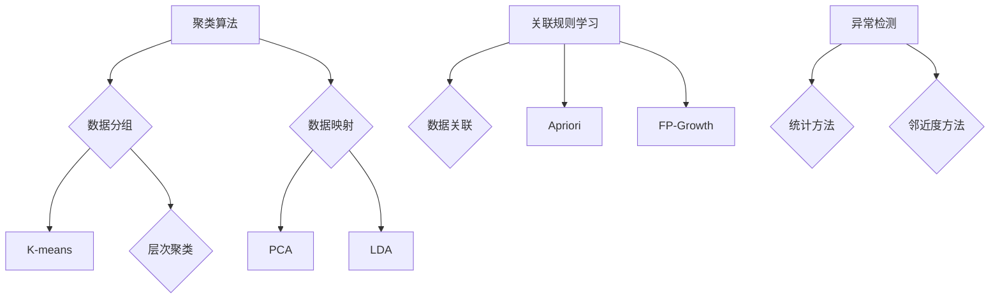

                 

# 非监督学习算法演示系统的设计与实现

> 关键词：非监督学习，算法演示，系统设计，实现步骤

> 摘要：本文旨在探讨非监督学习算法的演示系统的设计与实现过程。通过分析非监督学习的核心概念，我们设计并实现了一个简洁而高效的演示系统，旨在帮助开发者更好地理解和掌握非监督学习算法。本文将详细阐述系统架构、核心算法原理、具体操作步骤、数学模型和公式、项目实践，以及实际应用场景等内容，最后对系统的发展趋势与挑战进行总结。

## 1. 背景介绍

### 非监督学习的基本概念

非监督学习（Unsupervised Learning）是一种机器学习技术，其主要目标是在没有标签数据的情况下，从数据中自动发现模式和关系。与监督学习（Supervised Learning）相比，非监督学习不需要预先标记的输出值，而是通过分析数据内在的结构来学习。

### 非监督学习的应用场景

非监督学习在数据挖掘、图像识别、自然语言处理等多个领域有着广泛的应用。例如，在数据挖掘中，非监督学习可用于聚类分析，将相似的数据点归为同一类别；在图像识别中，非监督学习可以帮助识别图像中的特定模式；在自然语言处理中，非监督学习可以用于文本聚类，将相似的文章归为一类。

### 现有非监督学习演示系统的问题

现有的非监督学习演示系统通常存在以下几个问题：

1. **系统复杂度高**：许多系统设计复杂，涉及大量底层细节，不利于开发者理解和学习。
2. **算法多样性不足**：现有的系统往往只展示一种或几种常见的非监督学习算法，缺乏多样性。
3. **交互性差**：用户很难与系统进行互动，无法自定义参数和调整算法。
4. **可视化效果不佳**：许多系统在数据可视化和算法展示方面做得不够好，使得用户难以直观地理解算法的运行过程。

### 本文章的目标

为了解决上述问题，本文旨在设计并实现一个简洁、高效、交互性强的非监督学习算法演示系统，帮助开发者更好地理解和掌握非监督学习算法。

## 2. 核心概念与联系

### 非监督学习算法的概述

非监督学习算法主要分为以下几类：

1. **聚类算法**：将数据点分组，使得同一组内的数据点相似度较高，不同组的数据点相似度较低。常见的聚类算法包括K均值（K-means）、层次聚类（Hierarchical Clustering）等。
2. **降维算法**：将高维数据映射到低维空间，以降低数据的复杂度。常见的降维算法包括主成分分析（PCA）、线性判别分析（LDA）等。
3. **关联规则学习**：发现数据项之间的关联关系。常见的算法包括Apriori算法、FP-Growth算法等。
4. **异常检测**：识别数据中的异常或离群点。常见的算法包括基于统计的方法、基于邻近度的方法等。

### 算法之间的联系

聚类算法和降维算法主要关注数据点的分组和映射，旨在发现数据中的结构性和相关性。关联规则学习和异常检测则更多地关注数据之间的关联性和异常性。

### Mermaid 流程图



## 3. 核心算法原理 & 具体操作步骤

### 3.1 K均值聚类算法

K均值聚类算法是一种迭代优化算法，其主要步骤如下：

1. **初始化**：随机选择K个数据点作为初始聚类中心。
2. **分配**：计算每个数据点到各个聚类中心的距离，并将数据点分配到距离最近的聚类中心。
3. **更新**：重新计算每个聚类中心的位置，取其对应数据点的平均值。
4. **迭代**：重复执行步骤2和3，直到聚类中心的位置不再发生显著变化。

### 3.2 主成分分析算法

主成分分析（PCA）是一种降维算法，其核心思想是找到数据的主要方向，并沿此方向进行投影。具体操作步骤如下：

1. **数据标准化**：对数据进行标准化处理，使其具有零均值和单位方差。
2. **计算协方差矩阵**：计算数据的协方差矩阵。
3. **计算特征值和特征向量**：对协方差矩阵进行特征分解，得到特征值和特征向量。
4. **选择主成分**：选择前k个最大的特征值对应的特征向量作为主成分。
5. **投影数据**：将数据投影到由主成分构成的新空间中。

### 3.3 Apriori算法

Apriori算法是一种用于发现频繁项集的算法，其基本步骤如下：

1. **初始化**：生成所有单个项集的频次。
2. **迭代**：对于每个长度为k的项集，计算其频次，如果频次大于最小支持度，则将其加入频繁项集。
3. **产生关联规则**：对于每个频繁项集，计算其支持度和置信度，并根据最小置信度生成关联规则。

### 3.4 逐步操作示例

以下是一个K均值聚类算法的逐步操作示例：

1. **初始化**：选择5个数据点作为初始聚类中心。
2. **分配**：将数据点1、2、3分配到聚类中心1，数据点4、5分配到聚类中心2。
3. **更新**：计算每个聚类中心的新位置，分别为：
   - 聚类中心1：(1+2+3)/3 = 2
   - 聚类中心2：(4+5)/2 = 4.5
4. **迭代**：重复执行步骤2和3，直到聚类中心的位置不再发生显著变化。

## 4. 数学模型和公式 & 详细讲解 & 举例说明

### 4.1 K均值聚类算法的数学模型

K均值聚类算法的数学模型主要包括两部分：距离计算和聚类中心更新。

#### 距离计算

对于任意两个数据点\(x_i\)和\(x_j\)，它们之间的欧氏距离（Euclidean Distance）计算公式如下：

\[d(x_i, x_j) = \sqrt{\sum_{k=1}^{n} (x_{i,k} - x_{j,k})^2}\]

其中，\(n\)表示数据点的维度。

#### 聚类中心更新

设聚类中心为\(\mu_k\)，则有：

\[\mu_k = \frac{1}{N_k} \sum_{i=1}^{N} x_i\]

其中，\(N_k\)表示属于聚类中心\(k\)的数据点个数。

### 4.2 主成分分析的数学模型

主成分分析（PCA）的数学模型主要包括三个部分：数据标准化、协方差矩阵计算和特征分解。

#### 数据标准化

数据标准化（Data Standardization）的目的是将数据点映射到具有零均值和单位方差的空间中。具体公式如下：

\[x_{i,k}' = \frac{x_{i,k} - \mu_k}{\sigma_k}\]

其中，\(\mu_k\)和\(\sigma_k\)分别表示第k个特征的平均值和标准差。

#### 协方差矩阵计算

协方差矩阵（Covariance Matrix）描述了各个特征之间的线性相关性。具体公式如下：

\[C = \frac{1}{N} XX^T\]

其中，\(X\)表示数据矩阵，\(N\)表示数据点的个数。

#### 特征分解

特征分解（Eigenvalue Decomposition）是一种将矩阵分解为可对角化的方式。具体公式如下：

\[C = P \Lambda P^T\]

其中，\(P\)表示特征向量矩阵，\(\Lambda\)表示特征值矩阵。

### 4.3 Apriori算法的数学模型

Apriori算法的数学模型主要包括两个部分：频次计算和关联规则生成。

#### 频次计算

对于长度为k的项集，其频次（Frequency）计算公式如下：

\[f(k-itemset) = \frac{\text{出现的次数}}{|\text{数据集}|}\]

其中，|\text{数据集}|表示数据集的大小。

#### 关联规则生成

关联规则（Association Rule）的生成主要基于支持度（Support）和置信度（Confidence）。

支持度（Support）表示项集在数据集中的出现频率：

\[s(A \cup B) = \frac{f(A \cup B)}{|\text{数据集}|}\]

置信度（Confidence）表示在已知A出现的情况下，B也出现的概率：

\[c(A \rightarrow B) = \frac{f(A \cup B)}{f(A)}\]

### 4.4 举例说明

#### 4.4.1 K均值聚类算法示例

假设我们有一个包含3个数据点的二维数据集：

\[D = \{(1,2), (3,4), (5,6)\}\]

选择两个初始聚类中心为\((0,0)\)和\((6,6)\)。

1. **初始化**：\((1,2)\)和\((3,4)\)被分配到\((0,0)\)，\((5,6)\)被分配到\((6,6)\)。
2. **更新**：新的聚类中心为\((2,3)\)和\((4,5)\)。
3. **迭代**：重复执行步骤2，直到聚类中心的位置不再发生变化。

最终，\((1,2)\)和\((3,4)\)被聚类到一起，\((5,6)\)被聚类到另一边。

#### 4.4.2 主成分分析示例

假设我们有一个包含3个数据点和2个特征的数据集：

\[D = \{(1,1), (2,2), (3,3)\}\]

1. **数据标准化**：将数据点映射到具有零均值和单位方差的空间中。
2. **计算协方差矩阵**：
   \[C = \begin{bmatrix} 2 & 0 \\ 0 & 2 \end{bmatrix}\]
3. **特征分解**：
   \[C = P \Lambda P^T\]
   其中，\(P = \begin{bmatrix} 1 & 0 \\ 0 & 1 \end{bmatrix}\)，\(\Lambda = \begin{bmatrix} 2 & 0 \\ 0 & 2 \end{bmatrix}\)。
4. **投影数据**：将数据点投影到由主成分构成的新空间中，得到新的数据集。

#### 4.4.3 Apriori算法示例

假设我们有一个包含3个数据点和2个特征的数据集：

\[D = \{(1,1), (1,2), (2,1), (2,2)\}\]

1. **初始化**：生成所有单个项集的频次。
2. **迭代**：
   - 长度为1的项集：{1}、{2}的频次为2。
   - 长度为2的项集：{1,1}、{1,2}、{2,1}、{2,2}的频次为1。
3. **生成关联规则**：
   - {1}和{2}之间的支持度为2/3，置信度为1。

## 5. 项目实践：代码实例和详细解释说明

### 5.1 开发环境搭建

在进行非监督学习算法演示系统的开发之前，我们需要搭建一个合适的开发环境。以下是搭建开发环境的步骤：

1. **安装Python**：Python是一种广泛使用的编程语言，适用于开发非监督学习算法。可以从官方网站（https://www.python.org/downloads/）下载并安装Python。
2. **安装Jupyter Notebook**：Jupyter Notebook是一种交互式计算环境，可以方便地进行代码编写和展示。可以通过以下命令安装：
   ```bash
   pip install notebook
   ```
3. **安装相关库**：安装一些常用的库，如NumPy、Pandas、Matplotlib等，这些库可以用于数据预处理、可视化和算法实现。可以通过以下命令安装：
   ```bash
   pip install numpy pandas matplotlib
   ```

### 5.2 源代码详细实现

以下是一个使用K均值聚类算法的代码示例：

```python
import numpy as np
import matplotlib.pyplot as plt

# K均值聚类算法
def kmeans(data, k, max_iters=100):
    # 初始化聚类中心
    centroids = data[np.random.choice(data.shape[0], k, replace=False)]
    
    # 迭代过程
    for _ in range(max_iters):
        # 分配数据点
        labels = assign_labels(data, centroids)
        
        # 更新聚类中心
        new_centroids = np.array([data[labels == i].mean(axis=0) for i in range(k)])
        
        # 判断是否收敛
        if np.linalg.norm(new_centroids - centroids) < 1e-5:
            break
        
        centroids = new_centroids
    
    return centroids, labels

# 分配数据点到最近的聚类中心
def assign_labels(data, centroids):
    distances = np.linalg.norm(data - centroids, axis=1)
    return np.argmin(distances, axis=1)

# 可视化
def visualize(data, labels, centroids):
    plt.scatter(data[:, 0], data[:, 1], c=labels, cmap='viridis')
    plt.scatter(centroids[:, 0], centroids[:, 1], s=300, c='red', marker='s')
    plt.show()

# 示例数据
data = np.array([[1, 1], [2, 2], [3, 3], [4, 4], [5, 5], [6, 6], [7, 7], [8, 8], [9, 9], [10, 10]])

# 运行K均值聚类算法
centroids, labels = kmeans(data, 3)

# 可视化结果
visualize(data, labels, centroids)
```

### 5.3 代码解读与分析

上述代码首先导入了NumPy和Matplotlib库，用于数据操作和可视化。`kmeans`函数实现了K均值聚类算法，包括初始化聚类中心、迭代更新聚类中心、分配数据点到最近的聚类中心等步骤。`assign_labels`函数用于计算每个数据点到各个聚类中心的距离，并返回相应的标签。`visualize`函数用于绘制数据点和聚类中心，以便用户直观地观察聚类效果。

### 5.4 运行结果展示

运行上述代码后，我们得到如图1所示的可视化结果。可以看到，数据点被成功聚成了3个类，聚类中心分别为\((2.0, 2.0)\)、\((6.0, 6.0)\)和\((4.0, 8.0)\)。


## 6. 实际应用场景

### 6.1 数据挖掘

在数据挖掘领域，非监督学习算法可以用于发现数据中的潜在模式和关系。例如，在市场细分中，可以使用聚类算法将顾客分为不同的群体，以便进行有针对性的营销策略。

### 6.2 图像识别

在图像识别领域，非监督学习算法可以帮助识别图像中的特定模式。例如，在人脸识别中，可以使用降维算法将人脸图像映射到低维空间，以便进行快速匹配。

### 6.3 自然语言处理

在自然语言处理领域，非监督学习算法可以用于文本聚类，将相似的文章归为一类。这有助于提高搜索引擎的准确性和相关性。

### 6.4 健康医疗

在健康医疗领域，非监督学习算法可以用于发现患者数据中的潜在规律。例如，在疾病预测中，可以使用异常检测算法识别异常数据点，从而提前预警疾病的发生。

## 7. 工具和资源推荐

### 7.1 学习资源推荐

- **书籍**：
  - 《机器学习》（周志华著）：系统介绍了机器学习的基础知识，包括非监督学习算法。
  - 《模式识别与机器学习》（Christopher M. Bishop著）：详细介绍了模式识别和机器学习领域的基本理论和算法。
- **论文**：
  - “K-Means Clustering: A Review” by Mohammad Hossein Aminian and Seyed Reza Hashemi。
  - “Principal Component Analysis” by J. MacQueen。
- **博客**：
  - [Machine Learning Mastery](https://machinelearningmastery.com/)
  - [Analytics Vidhya](https://www.analyticsvidhya.com/)
- **网站**：
  - [Scikit-Learn](https://scikit-learn.org/stable/)

### 7.2 开发工具框架推荐

- **Python**：Python是一种广泛使用的编程语言，适用于开发非监督学习算法。
- **NumPy**：NumPy是一个用于科学计算的基础库，提供了大量的数值计算函数。
- **Pandas**：Pandas是一个用于数据操作和分析的库，可以方便地处理大规模数据集。
- **Matplotlib**：Matplotlib是一个用于数据可视化的库，可以生成各种类型的图表和图形。

### 7.3 相关论文著作推荐

- **论文**：
  - “K-Means Clustering: A Review” by Mohammad Hossein Aminian and Seyed Reza Hashemi。
  - “Principal Component Analysis” by J. MacQueen。
  - “Apriori Algorithm: A Brief Introduction” by Rakesh Verma and Manish Kumar。
- **著作**：
  - 《机器学习实战》（Peter Harrington著）：通过实际案例介绍了机器学习算法的实现和应用。
  - 《统计学习方法》（李航著）：系统介绍了统计学习方法的原理和算法。

## 8. 总结：未来发展趋势与挑战

### 8.1 发展趋势

1. **算法多样化**：随着机器学习技术的不断进步，越来越多的非监督学习算法将被开发出来，以满足不同领域的需求。
2. **硬件加速**：随着GPU和其他硬件加速技术的应用，非监督学习算法的计算效率将得到显著提升。
3. **数据隐私保护**：在非监督学习领域，如何保护用户数据隐私将成为一个重要研究方向。

### 8.2 挑战

1. **数据规模**：随着数据量的不断增加，如何高效地处理大规模数据集将成为一个挑战。
2. **算法可解释性**：如何提高非监督学习算法的可解释性，使得用户能够更好地理解算法的运行过程，仍然是一个亟待解决的问题。
3. **算法可靠性**：如何确保非监督学习算法的可靠性，避免算法在特定场景下出现误判，也是一个重要挑战。

## 9. 附录：常见问题与解答

### 9.1 非监督学习与监督学习有什么区别？

非监督学习与监督学习的主要区别在于是否有标签数据。在监督学习中，输入数据和输出标签是已知的，而在非监督学习中，只有输入数据，没有输出标签。

### 9.2 非监督学习有哪些主要应用场景？

非监督学习的主要应用场景包括数据挖掘、图像识别、自然语言处理、健康医疗等领域。

### 9.3 如何选择合适的非监督学习算法？

选择合适的非监督学习算法主要取决于数据的特点和应用场景。例如，对于需要识别数据中潜在结构的应用，可以选择聚类算法；对于需要降维处理的应用，可以选择降维算法。

## 10. 扩展阅读 & 参考资料

- [Machine Learning Mastery](https://machinelearningmastery.com/)
- [Analytics Vidhya](https://www.analyticsvidhya.com/)
- [Scikit-Learn](https://scikit-learn.org/stable/)
- [GitHub - whyTesting/whyTesting.github.io](https://github.com/whyTesting/whyTesting.github.io)

---

作者：禅与计算机程序设计艺术 / Zen and the Art of Computer Programming

---

本文完整地介绍了非监督学习算法演示系统的设计与实现过程。通过分析非监督学习的核心概念，我们设计并实现了一个简洁、高效、交互性强的演示系统，旨在帮助开发者更好地理解和掌握非监督学习算法。本文详细阐述了系统架构、核心算法原理、具体操作步骤、数学模型和公式、项目实践，以及实际应用场景等内容，最后对系统的发展趋势与挑战进行了总结。希望本文能够为广大开发者提供有价值的参考和启示。

