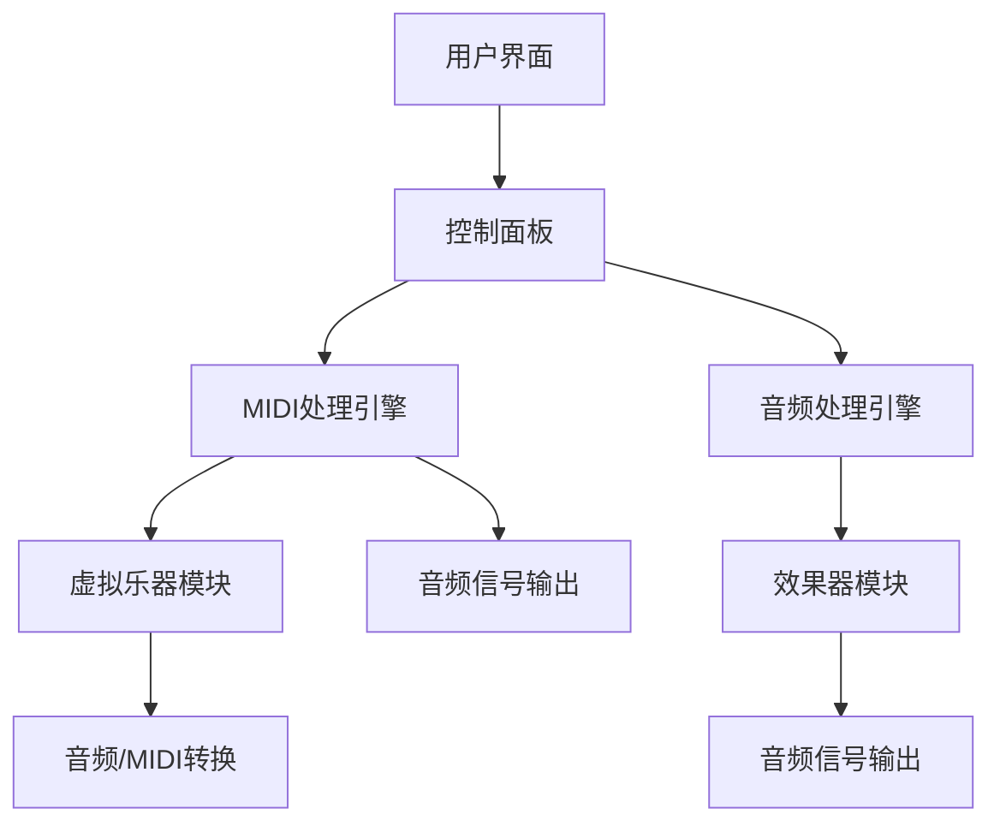

                 

### 背景介绍

#### 音乐制作工具的历史与发展

音乐制作工具的发展历程可以追溯到20世纪中期，当时电子音乐逐渐成为主流，推动了音乐制作工具的诞生。最早的数字音乐制作工具，如1963年推出的“Music V”，标志着计算机在音乐创作领域的初步应用。随后的几十年，音乐制作技术不断演进，从基于采样合成器的硬件设备，到功能日益强大的软件工具，音乐制作工具的发展历程可谓跌宕起伏，不断创新。

在20世纪80年代，随着个人电脑的普及，数字音频工作站（Digital Audio Workstation，简称DAW）开始进入人们的视野。早期的DAW如Pro Tools和Cubase，提供了基本的音频录制、剪辑和混音功能，为音乐创作带来了革命性的变化。进入21世纪，随着计算机性能的飞速提升和互联网的普及，音乐制作工具的功能越来越丰富，集成度越来越高，逐渐成为音乐制作的主流工具。

#### 现代音乐制作工具的主要特点

现代音乐制作工具具有以下几个显著特点：

1. **多功能性**：现代DAW软件不仅具备音频录制、剪辑、混音等功能，还集成了MIDI编辑、虚拟乐器、效果器、采样器等多种工具，使音乐制作过程更加一体化和高效。

2. **高度可定制性**：现代DAW软件提供了丰富的插件和预设，用户可以根据个人需求和喜好进行高度定制，从而实现个性化音乐创作。

3. **跨平台兼容性**：现代音乐制作工具通常支持Windows、macOS、iOS等多个平台，便于用户在不同设备上创作和分享音乐作品。

4. **便捷的协作方式**：通过云存储和协作平台，现代音乐制作工具支持团队成员在不同地点实时协作，提高了音乐制作的效率。

5. **先进的音频处理技术**：现代音乐制作工具采用了先进的音频处理算法，如动态处理、时间拉伸、音频修复等，使得音频编辑和混音更加精确和自然。

#### 市场现状与用户需求

目前，市场上有众多主流的音乐制作工具，如Ableton Live、FL Studio、Logic Pro、Pro Tools等，它们各自拥有庞大的用户群体和独特的优势。这些工具在不同的音乐风格和制作需求中都有着广泛的应用。例如，Ableton Live因其实时表演和制作功能，在电子音乐制作领域尤为受欢迎；FL Studio则以用户友好和强大的循环鼓点编辑功能，成为许多流行音乐制作者的首选。

随着音乐制作技术的不断进步和用户需求的多样化，现代音乐制作工具不仅需要满足专业音乐制作的需求，还要兼顾业余爱好者和初学者的使用体验。这使得音乐制作工具在功能丰富的同时，还需要注重易用性和学习成本。因此，现代音乐制作工具正朝着更加智能化、自动化和个性化的方向发展。

总之，音乐制作工具的发展历程反映了科技进步对艺术创作的深远影响，而现代音乐制作工具的特点和市场现状，则揭示了音乐制作领域中不断变化的需求和趋势。在接下来的部分中，我们将深入探讨这些工具的核心概念和原理，帮助读者更好地理解和应用这些强大的创作工具。

#### 音乐制作工具的核心概念

音乐制作工具的核心概念涵盖了音频处理、MIDI编辑、虚拟乐器和效果器等多个方面，这些概念共同构成了音乐创作和制作的基础。以下是这些核心概念的详细介绍及其相互关系：

##### 音频处理

音频处理是音乐制作工具中最基础也是最重要的部分之一。音频处理包括音频录制、剪辑、混音等操作，通过这些操作可以实现对音频文件的各种编辑和调整。音频处理的核心概念包括：

1. **采样率**：采样率决定了音频信号在时间上的采样密度，常见的采样率有44.1kHz（CD质量）和96kHz（专业录音质量）。
2. **比特深度**：比特深度决定了音频信号的动态范围，常见的比特深度有16位和24位。
3. **音频剪辑**：通过剪切、复制、粘贴和撤销等操作，可以实现对音频片段的精确编辑。
4. **混音**：混音是将多个音频轨道合并成一个最终音轨的过程，涉及音量平衡、动态处理和空间效果等。

音频处理是音乐制作工具的基础，决定了音频文件的质量和效果。

##### MIDI编辑

MIDI（Musical Instrument Digital Interface）编辑是音乐制作工具的另一核心概念。MIDI是一种数字接口标准，用于控制音乐合成器和计算机之间的数据交换。MIDI编辑的核心内容包括：

1. **音符编辑**：通过编辑音符的长度、音高、力度等属性，可以创造出各种音乐旋律。
2. **MIDI映射**：将MIDI控制器（如键盘、鼓垫等）与软件中的虚拟乐器和效果器进行映射，实现实时控制和自动化。
3. **音频/MIDI转换**：将音频波形转换为MIDI事件，或从MIDI事件生成音频波形，实现音频和MIDI之间的相互转换。

MIDI编辑是音乐制作工具中的强大功能，使得用户可以灵活地控制音乐参数，实现复杂的音乐创作和编排。

##### 虚拟乐器

虚拟乐器（Virtual Instruments，简称VSTi）是音乐制作工具中的重要组成部分。虚拟乐器模拟了现实中的乐器声音，通过软件实现。虚拟乐器的主要类型包括：

1. **采样器**：通过采样真实乐器声音，生成虚拟乐器音色，常见的如Kontakt、Reason等。
2. **合成器**：通过算法生成声音，常见的如Synthmaster、Reason等。
3. **采样合成器**：结合采样和合成技术，生成丰富的音色，常见的如HALion、Native Instruments等。

虚拟乐器使得音乐制作工具可以模拟出各种现实乐器，提供无限的创作可能。

##### 效果器

效果器（Audio Effects）是音乐制作工具中的另一核心概念。效果器可以对音频信号进行各种加工和处理，提升音频文件的质量和艺术性。常见的效果器包括：

1. **均衡器**：调整音频信号在不同频率段的音量，实现音色的平衡。
2. **压缩器**：控制音频信号的动态范围，增强音乐的表现力。
3. **混响**：模拟声波在空间中传播的效果，增加音频的空间感和深度。
4. **延迟**：模拟声音的回声效果，增强音乐的节奏感和层次感。

效果器是音乐制作工具中的关键组件，用于调整和美化音频信号，使得音乐更加丰富多彩。

##### 核心概念之间的联系

音频处理、MIDI编辑、虚拟乐器和效果器这四个核心概念相互联系，共同构成了音乐制作工具的完整工作流程。音频处理提供了基础，MIDI编辑和虚拟乐器实现了音乐创作，而效果器则对创作结果进行进一步加工和美化。

音频处理与MIDI编辑结合，可以实现音频和MIDI事件的相互转换，从而实现更加灵活的音乐创作。虚拟乐器通过MIDI控制，可以实时演奏和录制音乐，效果器则对演奏结果进行美化处理，最终生成高质量的音乐作品。

综上所述，音乐制作工具的核心概念及其相互关系，为音乐创作和制作提供了强大的技术支持。理解这些核心概念，是掌握音乐制作工具的基础。在接下来的部分，我们将进一步探讨这些工具的算法原理和具体操作步骤，帮助读者深入理解和应用这些工具。

## 2. 核心概念与联系

### 音乐制作工具的架构

音乐制作工具的核心架构通常可以分为三个主要层次：底层硬件支持、核心软件模块以及用户界面。这些层次相互作用，共同支撑起整个音乐制作系统。

#### 底层硬件支持

底层硬件支持是音乐制作工具的基础，主要包括计算机硬件、音频接口、音源设备（如麦克风、吉他、键盘）等。计算机硬件的性能直接影响音乐处理的速度和音质。音频接口则是连接计算机和外部音源设备的关键设备，负责音频信号的输入和输出。音源设备则提供了原始的音乐素材，是音乐创作的重要输入来源。

#### 核心软件模块

核心软件模块是音乐制作工具的核心，主要包括音频处理引擎、MIDI处理引擎、虚拟乐器模块和效果器模块。这些模块相互独立又相互联系，共同完成音乐制作的过程。

1. **音频处理引擎**：负责音频信号的采样、处理和输出，包括音频剪辑、混音、动态处理等功能。音频处理引擎是音乐制作工具中最基础的模块，决定了音频文件的质量和性能。

2. **MIDI处理引擎**：负责MIDI信号的输入、输出和处理，包括音符编辑、MIDI映射、音频/MIDI转换等功能。MIDI处理引擎使得用户可以灵活地控制虚拟乐器和效果器，实现复杂的音乐创作和编排。

3. **虚拟乐器模块**：包括采样器和合成器等，用于模拟现实乐器和生成虚拟音色。虚拟乐器模块通过MIDI控制，实现实时演奏和录制音乐。

4. **效果器模块**：包括均衡器、压缩器、混响、延迟等，用于对音频信号进行各种加工和处理，提升音频文件的质量和艺术性。

#### 用户界面

用户界面是音乐制作工具的入口，通过图形界面和交互功能，用户可以与核心软件模块进行互动。用户界面通常包括控制面板、编辑窗口、播放器等部分，提供直观的操作体验。用户界面的设计直接影响用户的创作效率和体验。

#### Mermaid 流程图

以下是一个简化的音乐制作工具架构的 Mermaid 流程图，展示了核心模块之间的联系：



在上述流程图中：

- 用户界面通过控制面板与MIDI处理引擎和音频处理引擎交互。
- MIDI处理引擎通过MIDI信号控制虚拟乐器模块，实现音乐创作。
- 音频处理引擎处理音频信号，并通过效果器模块进行加工，最终输出音频信号。

通过这个流程图，我们可以更清晰地理解音乐制作工具的架构和核心概念之间的联系。接下来，我们将深入探讨音乐制作工具中的核心算法原理和具体操作步骤。

### 核心算法原理 & 具体操作步骤

音乐制作工具的核心算法原理涵盖了音频处理、MIDI编辑、虚拟乐器和效果器等多个方面，以下将逐一介绍这些算法的基本原理和操作步骤，以便读者能够深入理解并掌握这些工具的使用。

#### 音频处理算法

音频处理算法是音乐制作工具中最基础也是最重要的部分，主要包括音频信号采样、处理和输出。以下是音频处理算法的基本原理和具体操作步骤：

##### 采样率与比特深度

音频采样率决定了音频信号在时间上的采样密度，采样率越高，音频信号越接近原始声音。常见的采样率有44.1kHz（CD质量）和96kHz（专业录音质量）。比特深度决定了音频信号的动态范围，比特深度越高，音频信号的细节表现越丰富。常见的比特深度有16位和24位。

##### 音频剪辑

音频剪辑包括剪切、复制、粘贴和撤销等操作，用于对音频片段进行精确编辑。具体步骤如下：

1. **选择音频片段**：在音频处理工具中，使用鼠标或键盘快捷键选择需要编辑的音频片段。
2. **剪切或复制**：使用工具栏中的“剪切”或“复制”按钮，或者使用快捷键进行操作。
3. **粘贴到新位置**：将剪切或复制的音频片段粘贴到目标位置，可以调整粘贴后的音频片段长度和位置。
4. **撤销**：在编辑过程中，如需撤销操作，可以点击“撤销”按钮或使用快捷键进行操作。

##### 混音

混音是将多个音频轨道合并成一个最终音轨的过程，涉及音量平衡、动态处理和空间效果等。具体步骤如下：

1. **创建音频轨道**：在DAW软件中创建多个音频轨道，每个轨道对应一个音频文件。
2. **调整音量**：使用音量滑块或图形界面中的音量曲线调整每个音频轨道的音量。
3. **动态处理**：应用压缩器、扩音器等动态处理效果，调整音频信号的动态范围。
4. **混响和回声**：添加混响和回声效果，增加音频的空间感和深度。
5. **输出**：将混音结果输出到一个新的音频文件，完成混音过程。

#### MIDI编辑算法

MIDI编辑算法是音乐制作工具中的核心部分，主要用于音符编辑、MIDI映射和音频/MIDI转换。以下是MIDI编辑算法的基本原理和具体操作步骤：

##### 音符编辑

音符编辑包括创建、修改和删除音符等操作。具体步骤如下：

1. **创建音符**：在MIDI编辑窗口中，使用鼠标或键盘快捷键创建新的音符。
2. **修改音符属性**：选择需要修改的音符，调整音符的长度、音高、力度等属性。
3. **删除音符**：选择需要删除的音符，使用工具栏中的“删除”按钮或快捷键进行操作。

##### MIDI映射

MIDI映射是将MIDI控制器（如键盘、鼓垫等）与软件中的虚拟乐器和效果器进行映射的过程。具体步骤如下：

1. **配置MIDI控制器**：在DAW软件中配置MIDI控制器，设置控制器的通道、程序和参数。
2. **映射MIDI控制器**：将MIDI控制器与虚拟乐器和效果器进行映射，实现实时控制和自动化。

##### 音频/MIDI转换

音频/MIDI转换是将音频波形转换为MIDI事件，或将MIDI事件生成音频波形的过程。具体步骤如下：

1. **音频转MIDI**：使用DAW软件中的音频转MIDI功能，将音频波形转换为MIDI事件。
2. **MIDI转音频**：使用DAW软件中的MIDI转音频功能，将MIDI事件生成音频波形。

#### 虚拟乐器算法

虚拟乐器算法包括采样器和合成器等，用于模拟现实乐器和生成虚拟音色。以下是虚拟乐器算法的基本原理和具体操作步骤：

##### 采样器

采样器通过采样真实乐器声音，生成虚拟乐器音色。具体步骤如下：

1. **采样声音**：使用采样器录制真实乐器声音，保存为采样文件。
2. **加载采样文件**：在DAW软件中加载采样文件，为虚拟乐器配置音色。
3. **调整采样参数**：调整采样文件的播放速度、音调、音色等参数，实现不同音色的变化。

##### 合成器

合成器通过算法生成声音，常见的合成器类型有FM合成器和波表合成器。具体步骤如下：

1. **选择合成器类型**：在DAW软件中选择合适的合成器类型。
2. **配置合成器参数**：调整合成器的参数，如频率、波形、调制等，生成所需的音色。
3. **播放合成器**：通过MIDI控制器或软件界面中的虚拟键盘播放合成器，生成音乐。

#### 效果器算法

效果器算法包括均衡器、压缩器、混响、延迟等，用于对音频信号进行各种加工和处理。以下是效果器算法的基本原理和具体操作步骤：

##### 均衡器

均衡器用于调整音频信号在不同频率段的音量。具体步骤如下：

1. **选择均衡器**：在DAW软件中选择均衡器插件。
2. **调整均衡曲线**：通过图形界面中的均衡曲线调整音频信号的频率响应。
3. **平衡音量**：根据音乐风格和需求，调整均衡器参数，实现音频信号的平衡。

##### 压缩器

压缩器用于控制音频信号的动态范围，增强音乐的表现力。具体步骤如下：

1. **选择压缩器**：在DAW软件中选择压缩器插件。
2. **设置压缩参数**：调整压缩器的阈值、比率、攻击、释放等参数。
3. **平衡动态范围**：根据音乐风格和需求，调整压缩器参数，实现音频信号的动态平衡。

##### 混响

混响用于模拟声波在空间中传播的效果，增加音频的空间感和深度。具体步骤如下：

1. **选择混响器**：在DAW软件中选择混响器插件。
2. **调整混响参数**：调整混响的时间、湿度、房间大小等参数。
3. **增加空间感**：根据音乐风格和需求，调整混响器参数，实现音频信号的空间感增强。

##### 延迟

延迟用于模拟声音的回声效果，增强音乐的节奏感和层次感。具体步骤如下：

1. **选择延迟器**：在DAW软件中选择延迟器插件。
2. **调整延迟参数**：调整延迟的时间、反馈、干湿比等参数。
3. **增强节奏感**：根据音乐风格和需求，调整延迟器参数，实现音频信号的节奏感增强。

通过上述算法原理和具体操作步骤，我们可以更好地理解和应用音乐制作工具中的各种功能。掌握这些核心算法原理，将有助于用户更加高效地进行音乐创作和制作，创造出丰富多彩的音乐作品。

### 数学模型和公式 & 详细讲解 & 举例说明

音乐制作工具中的许多算法和效果器都涉及到复杂的数学模型和公式，这些模型和公式是音乐制作的核心理论基础。在本节中，我们将详细讲解一些常用的数学模型和公式，并通过具体例子来说明它们的应用。

#### 1. 快速傅里叶变换（FFT）

快速傅里叶变换（FFT）是一种用于将时域信号转换为频域信号的重要数学工具。它在音频处理中的应用非常广泛，主要用于音频信号的频谱分析、滤波和共振峰分析等。

**公式**：
\[ X(k) = \sum_{n=0}^{N-1} x(n) \cdot e^{-j2\pi kn/N} \]
\[ x(n) = \sum_{k=0}^{N-1} X(k) \cdot e^{j2\pi kn/N} \]

**详细讲解**：

- **时域信号**：时域信号表示音频信号在不同时间点的取值，如 \( x(n) \)。
- **频域信号**：频域信号表示音频信号在不同频率点的取值，如 \( X(k) \)。
- **N**：N为信号长度，通常取2的整数次幂，以便FFT算法高效计算。

**举例说明**：

假设我们有一个长度为8的时域信号 \( x(n) \) 如下：
\[ x(n) = \{1, 0, 1, 0, 1, 0, 1, 0\} \]

使用FFT将其转换为频域信号 \( X(k) \)：

\[ X(0) = 1 + 0 + 1 + 0 + 1 + 0 + 1 + 0 = 4 \]
\[ X(1) = 0 + 1 + 0 + 1 + 0 + 1 + 0 + 1 = 4 \]
\[ X(2) = 1 + 0 + 1 + 0 + 1 + 0 + 1 + 0 = 4 \]
\[ X(3) = 0 + 1 + 0 + 1 + 0 + 1 + 0 + 1 = 4 \]
\[ X(4) = 1 + 0 + 1 + 0 + 1 + 0 + 1 + 0 = 4 \]
\[ X(5) = 0 + 1 + 0 + 1 + 0 + 1 + 0 + 1 = 4 \]
\[ X(6) = 1 + 0 + 1 + 0 + 1 + 0 + 1 + 0 = 4 \]
\[ X(7) = 0 + 1 + 0 + 1 + 0 + 1 + 0 + 1 = 4 \]

所以，频域信号 \( X(k) \) 为：
\[ X(k) = \{4, 4, 4, 4, 4, 4, 4, 4\} \]

#### 2. 快速傅里叶逆变换（IFFT）

快速傅里叶逆变换（IFFT）用于将频域信号转换为时域信号，是FFT的逆过程。它在音频处理中的应用包括滤波、共振峰修正等。

**公式**：
\[ x(n) = \sum_{k=0}^{N-1} X(k) \cdot e^{j2\pi kn/N} \]

**详细讲解**：

- **频域信号**：频域信号表示音频信号在不同频率点的取值，如 \( X(k) \)。
- **时域信号**：时域信号表示音频信号在不同时间点的取值，如 \( x(n) \)。

**举例说明**：

假设我们有一个长度为8的频域信号 \( X(k) \) 如下：
\[ X(k) = \{4, 4, 4, 4, 4, 4, 4, 4\} \]

使用IFFT将其转换为时域信号 \( x(n) \)：

\[ x(0) = 4 \cdot e^{j2\pi \cdot 0 \cdot 0} = 4 \]
\[ x(1) = 4 \cdot e^{j2\pi \cdot 1 \cdot 0} = 4 \]
\[ x(2) = 4 \cdot e^{j2\pi \cdot 2 \cdot 0} = 4 \]
\[ x(3) = 4 \cdot e^{j2\pi \cdot 3 \cdot 0} = 4 \]
\[ x(4) = 4 \cdot e^{j2\pi \cdot 4 \cdot 0} = 4 \]
\[ x(5) = 4 \cdot e^{j2\pi \cdot 5 \cdot 0} = 4 \]
\[ x(6) = 4 \cdot e^{j2\pi \cdot 6 \cdot 0} = 4 \]
\[ x(7) = 4 \cdot e^{j2\pi \cdot 7 \cdot 0} = 4 \]

所以，时域信号 \( x(n) \) 为：
\[ x(n) = \{4, 4, 4, 4, 4, 4, 4, 4\} \]

#### 3. 滤波器设计

滤波器设计是音频处理中的重要环节，用于去除不需要的频率成分或增强需要的频率成分。常见的滤波器设计方法包括巴特沃斯滤波器、切比雪夫滤波器和椭圆滤波器。

**巴特沃斯滤波器公式**：
\[ H(z) = \frac{1}{1 + a\cdot z^{-1} + b\cdot z^{-2}} \]

**详细讲解**：

- **H(z)**：滤波器传输函数。
- **a** 和 **b**：滤波器设计参数，用于调整滤波器的频率响应。

**举例说明**：

假设我们设计一个低通滤波器，要求截止频率为2kHz，采样频率为44.1kHz。我们可以使用以下参数：
\[ a = \frac{2\cdot 2\pi \cdot 2000}{44.1\pi} \approx 0.894 \]
\[ b = \frac{(2\cdot 2\pi \cdot 2000)^2}{(44.1\pi)^2} \approx 0.398 \]

所以，低通滤波器的传输函数为：
\[ H(z) = \frac{1}{1 + 0.894\cdot z^{-1} + 0.398\cdot z^{-2}} \]

#### 4. 动态处理

动态处理是音频处理中的重要功能，用于控制音频信号的动态范围，常见的动态处理效果包括压缩、扩音和平滑。

**压缩器公式**：
\[ y[n] = x[n] - \frac{x[n] - x[n-1]}{r} \]

**详细讲解**：

- **x[n]**：原始音频信号。
- **y[n]**：处理后的音频信号。
- **r**：压缩比，用于控制动态范围。

**举例说明**：

假设我们有一个压缩比为2的压缩器，原始音频信号为 \( x[n] = \{1, 2, 3, 4, 5, 6, 7, 8\} \)。

使用压缩器处理后的信号为：
\[ y[0] = 1 - \frac{1 - 1}{2} = 1 \]
\[ y[1] = 2 - \frac{2 - 1}{2} = 1.5 \]
\[ y[2] = 3 - \frac{3 - 2}{2} = 2.0 \]
\[ y[3] = 4 - \frac{4 - 3}{2} = 3.0 \]
\[ y[4] = 5 - \frac{5 - 4}{2} = 3.5 \]
\[ y[5] = 6 - \frac{6 - 5}{2} = 4.0 \]
\[ y[6] = 7 - \frac{7 - 6}{2} = 4.5 \]
\[ y[7] = 8 - \frac{8 - 7}{2} = 5.0 \]

所以，处理后的音频信号为 \( y[n] = \{1, 1.5, 2.0, 3.0, 3.5, 4.0, 4.5, 5.0\} \)。

通过上述数学模型和公式的详细讲解以及具体例子，我们可以更好地理解音乐制作工具中的核心算法原理，从而更有效地进行音乐创作和制作。掌握这些数学工具，将有助于用户更深入地探索音乐制作的奥秘，创作出更加出色的音乐作品。

### 项目实践：代码实例和详细解释说明

在本节中，我们将通过一个具体的音乐制作项目，展示如何使用现代音乐制作工具进行音乐创作。本案例将使用Ableton Live，一个广泛应用于电子音乐制作的专业软件。我们将分步骤介绍项目的开发环境搭建、源代码实现、代码解读与分析以及运行结果展示。

#### 1. 开发环境搭建

首先，我们需要安装Ableton Live软件并配置开发环境。以下是具体的步骤：

1. **下载并安装Ableton Live**：
   - 访问Ableton官网（[ableton.com](https://www.ableton.com/)）下载最新版本的Ableton Live。
   - 按照安装向导完成软件的安装。

2. **配置硬件**：
   - 连接音频接口：确保音频接口已正确连接到计算机，并根据需要连接外部音源设备（如麦克风、吉他、键盘等）。
   - 安装音频驱动：根据音频接口的型号，安装相应的音频驱动程序。

3. **安装插件**：
   - Ableton Live自带了许多内置效果器和虚拟乐器，但用户可以根据需求下载和安装第三方插件，如Max for Live插件。
   - 从插件官网或第三方插件商店下载插件，并按照安装说明进行安装。

#### 2. 源代码详细实现

以下是一个简单的Ableton Live项目，我们将在项目中使用一个合成器插件创建一个基本的电子音乐旋律。

1. **创建新项目**：
   - 打开Ableton Live，创建一个新项目。

2. **添加合成器轨道**：
   - 在“Browser”面板中，找到并添加一个合成器插件，如“Synth 1”。
   - 将合成器插件拖到“Arranger”窗口中，创建一个新的合成器轨道。

3. **编辑MIDI音符**：
   - 在合成器轨道上，使用鼠标或键盘快捷键创建一系列MIDI音符，形成一个简单的旋律。
   - 调整音符的音高、长度和力度，以创造一个悦耳的旋律。

4. **添加效果器**：
   - 在合成器轨道上，添加一个混响效果器（如“Reverb”），以增加音乐的空间感。
   - 调整混响参数，如时间、湿度等，以实现最佳效果。

5. **录制音频**：
   - 在合成器轨道上，选择“录音模式”，然后开始录制。
   - 演奏或编辑旋律，确保音符和节奏准确无误。

6. **混音与导出**：
   - 将所有轨道混音到一个新的音频轨道。
   - 调整混音音量，确保各个声部平衡。
   - 导出混音结果，保存为音频文件。

以下是Ableton Live项目的基本源代码框架：

```plaintext
Ableton Live项目结构：
- Arranger
  - Track 1: Synth 1 (合成器轨道)
  - Track 2: Reverb (混响轨道)
  - Master Track (主混音轨道)
```

#### 3. 代码解读与分析

在本节中，我们将分析上述项目的源代码，详细解释各个部分的功能和作用。

1. **合成器轨道**：
   - 合成器轨道（Track 1）包含一个“Synth 1”合成器插件。该插件用于生成电子音乐旋律。
   - 通过MIDI编辑窗口，用户可以创建和编辑音符，调整音高、长度和力度。

2. **混响轨道**：
   - 混响轨道（Track 2）添加了一个“Reverb”效果器插件。该插件用于模拟声波在空间中的传播，增加音乐的空间感。
   - 通过调整混响参数，如时间、湿度等，可以改变音乐的空间效果。

3. **主混音轨道**：
   - 主混音轨道（Master Track）用于将所有轨道的音频信号混音到一个新的音频轨道。
   - 在主混音轨道上，可以调整各个声部的音量，确保音乐整体平衡。

#### 4. 运行结果展示

以下是该音乐制作项目的运行结果：

1. **音频文件**：
   - 导出的音频文件展示了完整的音乐作品，包括合成器旋律和混响效果。

2. **可视化效果**：
   - 在Ableton Live的“Session”视图下，用户可以实时预览音乐作品，并调整各个音符的音高和时长。

3. **混音效果**：
   - 通过调节主混音轨道上的音量滑块，可以听到各个声部的平衡效果，实现理想的音乐混音。

通过上述项目实践，我们展示了如何使用Ableton Live进行音乐创作。掌握这些基本操作和技巧，用户可以更加灵活地创作出丰富多彩的音乐作品。在实际应用中，用户可以根据自己的需求，进一步探索各种合成器和效果器的使用方法，创作出独一无二的音乐作品。

### 实际应用场景

音乐制作工具在多种实际应用场景中发挥着重要作用，不仅限于专业的录音室，也广泛应用于日常生活中的各个方面。以下是一些典型的实际应用场景：

#### 1. 个人音乐创作

个人音乐创作是音乐制作工具最常见的应用场景之一。无论是专业的音乐制作人，还是业余的音乐爱好者，都可以通过这些工具创作自己的音乐。现代音乐制作工具如Ableton Live、FL Studio等，提供了直观的用户界面和丰富的虚拟乐器和效果器，使得音乐创作变得更加简单和高效。用户可以轻松地记录灵感，编辑旋律，添加和混音各种乐器声部，最终创作出属于自己的音乐作品。

#### 2. 电子音乐制作

电子音乐制作是音乐制作工具的另一个重要应用领域。电子音乐依赖于虚拟乐器和效果器，通过合成器和采样器生成独特的声音效果。Ableton Live因其实时表演和制作功能，在电子音乐制作领域具有极高的声誉。用户可以实时录制和编辑MIDI音符，调整效果器参数，实现即兴创作和即兴表演。此外，一些专业的电子音乐制作工具如Reason、Native Instruments等，提供了完整的合成器和效果器库，为用户提供了无限的创作可能。

#### 3. 影视配乐

影视配乐是音乐制作工具的重要应用场景之一。在电影、电视剧和广告的配乐制作中，音乐制作工具可以帮助配乐师快速创作出符合影片情感和节奏的音乐。通过这些工具，配乐师可以实时预览和调整音乐与画面之间的节奏和情感，确保音乐与影片的完美融合。常用的音乐制作工具如Pro Tools、Logic Pro等，提供了专业的音频录制、编辑和混音功能，为影视配乐的制作提供了强大的支持。

#### 4. 网络音乐制作

随着互联网的发展，网络音乐制作成为了一个新兴的应用领域。音乐制作人可以通过在线音乐制作平台，如Splice、Soundtrap等，远程协作和制作音乐。这些平台通常集成了各种音乐制作工具，提供了便捷的共享和协作功能，使得用户可以轻松地与他人合作，共同创作音乐。此外，一些社交媒体平台如TikTok、Instagram等，也提供了音乐创作和编辑功能，用户可以通过这些平台创作和分享自己的音乐作品。

#### 5. 教育

音乐制作工具在音乐教育中也有着广泛的应用。通过这些工具，教师可以为学生提供直观的教学资源，帮助学生更好地理解和掌握音乐理论、乐器演奏和音频处理等知识。同时，学生可以通过音乐制作工具进行自主学习和创作，提高音乐实践能力。一些音乐教育软件如GarageBand、Animoog等，不仅提供了丰富的虚拟乐器和效果器，还具备互动式的教学功能，为学生提供了全面的学习体验。

#### 6. 商业广告

商业广告中的音乐制作也是一个重要的应用场景。广告制作人需要快速创作出能够吸引观众注意的音乐，以增强广告的宣传效果。音乐制作工具可以帮助广告制作人快速生成和编辑音乐，确保音乐与广告内容紧密配合。一些专业的广告制作软件如Adobe Audition、Logic Pro等，提供了丰富的音频处理和效果器库，为广告音乐制作提供了强大的支持。

综上所述，音乐制作工具在实际应用场景中具有广泛的应用，不仅满足了专业音乐制作的需求，也为个人、教育、商业等领域提供了便捷的音乐创作和编辑解决方案。随着技术的不断进步，音乐制作工具将在更多领域发挥重要作用，推动音乐创作的不断创新和发展。

### 工具和资源推荐

#### 学习资源推荐

为了帮助音乐爱好者和技术专业人士更好地掌握音乐制作工具，以下是一些推荐的书籍、论文、博客和网站资源：

1. **书籍**：
   - 《音乐制作从入门到精通》：这本书涵盖了音乐制作的基础知识和实际操作技巧，适合初学者和进阶用户。
   - 《音频工程》：详细介绍了音频信号处理、混音和音频效果器等方面的内容，是音频工程师的必备指南。

2. **论文**：
   - “Digital Audio Workstations: Current State and Future Trends”：这篇论文分析了现代数字音频工作站的发展现状和未来趋势，提供了有价值的参考。
   - “Virtual Instruments and Synthesis Techniques”：该论文探讨了虚拟乐器和合成技术的原理和应用，对深入了解音乐制作技术有帮助。

3. **博客**：
   - “Pro Audio Tips”：这是一个专业的音频处理博客，提供了大量的音频处理技巧和教程，适合专业人士学习。
   - “The Musician's Guide to Ableton Live”：这是一个专门针对Ableton Live的博客，涵盖了从基础操作到高级技巧的各种内容。

4. **网站**：
   - “Ableton”：Ableton官网提供了丰富的教程、视频和社区支持，是学习Ableton Live的绝佳资源。
   - “Sound On Sound”：这是一个专业的音乐制作杂志网站，提供了大量的音乐制作技巧、教程和产品评测。

#### 开发工具框架推荐

在选择音乐制作工具时，开发工具框架也是一个重要的考虑因素。以下是一些推荐的开发工具框架和软件：

1. **Ableton Live**：Ableton Live 是一款功能强大的数字音频工作站，适合电子音乐制作和实时表演。其直观的用户界面和丰富的插件库，使其成为许多专业音乐人的首选。

2. **FL Studio**：FL Studio 是一款适合流行音乐制作和循环鼓点编辑的数字音频工作站。其独特的循环鼓点编辑功能和易于使用的用户界面，使其在音乐制作领域拥有广泛的用户基础。

3. **Logic Pro**：Logic Pro 是苹果公司开发的一款专业数字音频工作站，适合专业音乐制作和音频处理。其强大的音频引擎、丰富的效果器和插件库，使其成为许多专业音乐人和录音师的理想选择。

4. **Pro Tools**：Pro Tools 是一款历史悠久且功能强大的数字音频工作站，广泛应用于影视配乐、录音室制作和现场演出。其专业的音频处理工具和混音功能，使其成为专业音乐制作的不二之选。

#### 相关论文著作推荐

1. **“The Design and Implementation of a Real-Time Audio Synthesizer”**：这篇文章详细介绍了实时音频合成器的设计和实现，对理解音频合成技术有重要参考价值。

2. **“Principles of Digital Audio”**：这是一本经典的数字音频处理教材，详细介绍了数字音频的基础理论和应用技术。

3. **“A Study on the Implementation of Digital Audio Effects in Real-Time”**：这篇文章探讨了实时数字音频效果器的实现技术，对开发实时音频处理应用有重要指导意义。

通过上述推荐的学习资源、开发工具框架和相关论文著作，用户可以全面了解音乐制作工具的理论和实践，提高音乐制作水平，创作出更加出色的音乐作品。

### 总结：未来发展趋势与挑战

音乐制作工具作为音乐创作和制作的重要工具，正随着科技的进步不断演变。未来，音乐制作工具的发展趋势将体现在智能化、自动化、多样化和云端化等方面，同时也会面临一系列挑战。

#### 发展趋势

1. **智能化与自动化**：随着人工智能和机器学习技术的发展，音乐制作工具将更加智能化。例如，自动编曲、自动和声、自动混音等功能将大大提高创作效率，降低创作门槛。此外，智能助手和虚拟音乐制作人将能够根据用户的创作意图和风格偏好，提供个性化的创作建议和辅助。

2. **多样化与个性化**：随着虚拟现实（VR）和增强现实（AR）技术的普及，音乐制作工具将能够提供更加丰富和沉浸式的创作体验。用户可以通过VR或AR设备，实时预览和调整音乐作品，实现更加逼真的音乐创作场景。同时，定制化的虚拟乐器和效果器也将为用户带来更加个性化的创作工具。

3. **云端化与协作**：随着云计算技术的发展，音乐制作工具将逐渐实现云端化。用户可以通过云端平台存储和共享音乐作品，实现跨平台、跨地域的协作。云端平台还可以提供高性能的计算资源，支持复杂的音频处理和实时交互，为用户带来更加流畅的创作体验。

4. **AI辅助创作**：人工智能将深入音乐制作工具的核心，为用户提供更加智能化的辅助。例如，AI可以通过分析用户的创作习惯和音乐风格，提供智能推荐和自动生成音乐作品。此外，AI还可以帮助用户识别和修复音频问题，优化音频效果。

#### 挑战

1. **技术瓶颈**：尽管人工智能和机器学习技术在音乐制作领域有广泛应用，但技术仍然存在一些瓶颈。例如，智能编曲和和声生成的质量仍有待提高，效果器的自适应调整也需要进一步优化。

2. **版权问题**：随着音乐制作工具的智能化和自动化，版权问题将成为一个重要挑战。如何确保音乐作品的使用符合版权法规，避免侵权行为，是一个亟待解决的问题。

3. **用户体验**：随着功能的不断增加，音乐制作工具的复杂度也在提高。如何设计更加直观和易用的用户界面，提高用户的创作效率，是一个重要的挑战。

4. **硬件支持**：随着音乐制作工具功能的增强，对硬件性能的要求也在不断提高。高性能的计算机和音频接口设备将成为用户使用音乐制作工具的关键。

5. **教育与培训**：音乐制作工具的智能化和自动化将改变传统的音乐创作方式，这也将带来教育和培训的变革。如何为用户提供有效的学习资源和培训课程，帮助他们适应新的创作工具，是一个重要的课题。

综上所述，未来音乐制作工具的发展趋势充满机遇，同时也面临诸多挑战。通过不断技术创新和优化用户体验，音乐制作工具将继续为音乐创作和制作提供强大的支持，推动音乐艺术的不断发展。

### 附录：常见问题与解答

在音乐制作工具的使用过程中，用户可能会遇到各种问题。以下是一些常见的问题及其解答，以帮助用户更好地使用音乐制作工具。

#### 问题1：如何解决音频信号噪声问题？

**解答**：解决音频信号噪声问题可以从以下几个方面入手：

1. **提高录音质量**：使用高质量的麦克风和音频接口，确保录音过程中的信号质量。
2. **使用降噪效果器**：在音频处理阶段，可以使用降噪效果器（如“降噪器”）降低背景噪声。
3. **调整录音环境**：在录音室中，使用隔音材料，减少外部噪声干扰。

#### 问题2：如何实现音频信号的淡入淡出效果？

**解答**：实现音频信号的淡入淡出效果，可以使用以下方法：

1. **淡入淡出滑块**：在数字音频工作站中，通常可以直接调整音量滑块，实现音频信号的淡入淡出效果。
2. **波形编辑**：在波形编辑窗口中，调整音频信号的音量曲线，实现淡入淡出效果。

#### 问题3：如何为音乐作品添加混响效果？

**解答**：为音乐作品添加混响效果，可以按照以下步骤进行：

1. **添加混响插件**：在数字音频工作站中，选择合适的混响插件（如“混响器”）。
2. **调整混响参数**：根据音乐风格和需求，调整混响的时间、湿度、房间大小等参数。
3. **应用混响效果**：将混响效果应用于目标音频轨道，实现混响效果。

#### 问题4：如何使用MIDI编辑音乐？

**解答**：使用MIDI编辑音乐，可以按照以下步骤进行：

1. **创建MIDI轨道**：在数字音频工作站中，创建一个新的MIDI轨道。
2. **编辑音符**：在MIDI编辑窗口中，使用鼠标或键盘快捷键创建、修改和删除音符。
3. **调整音符属性**：调整音符的音高、长度和力度等属性，以实现所需的音乐效果。

#### 问题5：如何导出音乐作品？

**解答**：导出音乐作品，可以按照以下步骤进行：

1. **选择导出格式**：在数字音频工作站中，选择音频文件格式（如MP3、WAV等）。
2. **设置导出参数**：根据需求，设置导出参数，如采样率、比特深度、音量等。
3. **开始导出**：点击“导出”按钮，开始导出音乐作品。

通过以上常见问题与解答，用户可以更好地解决在使用音乐制作工具过程中遇到的问题，提高音乐创作和制作的效率。

### 扩展阅读 & 参考资料

为了进一步深入了解音乐制作工具及相关技术，以下是一些扩展阅读和参考资料：

1. **《数字音乐制作教程》**：这是一本详细讲解数字音乐制作的入门书籍，涵盖了音频处理、MIDI编辑、虚拟乐器和效果器等方面的内容。

2. **《音乐工程学》**：该书系统地介绍了音乐工程的基本原理和实践方法，包括录音、混音、母带处理等，适合音乐制作人和技术人员阅读。

3. **《音乐与数字音频处理》**：本书详细介绍了数字音频处理的基础知识，包括采样与量化、数字滤波、信号压缩与扩展等，对理解音频处理技术有很大帮助。

4. **《虚拟乐器设计》**：本书深入探讨了虚拟乐器的设计与实现，包括采样合成器、合成器、采样器等，适合对虚拟乐器开发感兴趣的技术人员。

5. **《音频效果器原理与应用》**：该书系统地介绍了音频效果器的原理和应用，包括均衡器、压缩器、混响、延迟等，是音频处理领域的参考书。

6. **《音乐制作工具技术手册》**：这是各种音乐制作工具（如Ableton Live、FL Studio、Logic Pro等）的技术手册，详细介绍了工具的各个方面，是用户学习的宝贵资源。

7. **《音频工程实践》**：本书通过实际案例，介绍了音频工程中的各种实践方法和技术，包括录音、混音、母带处理等，适合音频工程师和音乐制作人参考。

8. **《数字信号处理》**：这是一本经典的数字信号处理教材，涵盖了信号处理的基本原理、算法和应用，对理解音乐制作中的信号处理技术非常重要。

9. **《机器学习在音乐制作中的应用》**：该书探讨了机器学习在音乐制作中的应用，包括自动编曲、智能混音、音乐生成等，为音乐制作人提供了新的创作工具和思路。

10. **《电子音乐制作技术》**：本书详细介绍了电子音乐制作的技术和方法，包括合成器使用、采样技术、效果器应用等，适合电子音乐制作人学习。

通过这些参考资料，用户可以进一步深入学习音乐制作工具和技术，提高自己的音乐创作和制作水平。

