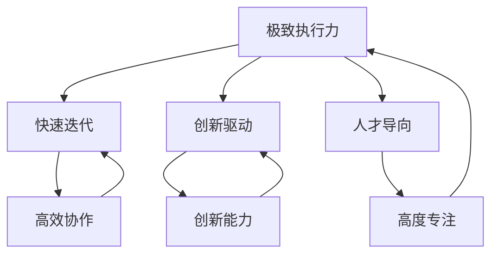

                 

### 背景介绍 Background Introduction

#### 引言 Introduction

在当今科技飞速发展的时代，技术团队的管理成为许多企业和组织的核心挑战之一。高效、灵活、创新的技术团队不仅能够推动企业业务的快速发展，还可以在竞争激烈的市场中脱颖而出。作为科技界的领军人物，埃隆·马斯克（Elon Musk）以其独特的管理哲学和卓越的领导能力，在特斯拉（Tesla）和SpaceX等公司中取得了令人瞩目的成就。本文将深入探讨马斯克的管理哲学，特别是他在技术团队管理方面的小而精策略。

#### 埃隆·马斯克的管理理念 Management Philosophy of Elon Musk

马斯克的管理哲学基于几个核心原则：极致执行力、快速迭代、创新驱动和人才导向。他坚信小而精的团队可以发挥最大的创造力，并且能够更快速地响应市场变化。这种理念在特斯拉和SpaceX的实践中得到了验证。

1. **极致执行力**：马斯克强调执行力是成功的关键。他认为，一个团队如果缺乏执行力，即使有再好的计划和理念也无法实现目标。因此，他通过严格的绩效管理和激励措施来确保团队成员全力以赴。
   
2. **快速迭代**：马斯克倡导快速迭代的方法，认为通过不断的试错和优化，可以更快地找到正确的方向。这种方法在软件开发和产品开发中尤为重要。

3. **创新驱动**：马斯克认为创新是推动企业前进的动力。他鼓励团队成员跳出传统思维框架，积极探索新的解决方案。

4. **人才导向**：马斯克注重吸引和培养顶尖人才。他认为，优秀的人才能够带来卓越的成果，因此他通过提供具有竞争力的薪酬和福利来留住顶尖人才。

#### 小而精的技术团队 Small but Powerful Tech Teams

在技术团队管理方面，马斯克主张组建小而精的团队。这种团队模式具有以下优点：

1. **高效协作**：小团队中的成员之间更容易建立紧密的合作关系，提高沟通效率。
   
2. **快速决策**：小团队中的成员通常能够快速达成共识，减少决策时间。
   
3. **高度专注**：小团队可以更加专注于核心业务，避免资源分散。

4. **创新能力**：小团队更容易产生创新思维，因为成员之间的互动和碰撞更频繁。

#### 结论 Conclusion

综上所述，马斯克的管理哲学，特别是在技术团队管理方面的小而精策略，提供了许多值得借鉴的经验。通过极致执行力、快速迭代、创新驱动和人才导向，小而精的技术团队可以发挥出巨大的潜力，成为企业在激烈竞争中脱颖而出的关键。本文接下来将详细探讨这些管理原则在技术团队中的应用和实践。

## 2. 核心概念与联系 Core Concepts and Connections

在深入探讨马斯克的管理哲学之前，我们需要明确几个核心概念，这些概念不仅构成了马斯克管理理念的基础，也是他成功的关键因素。

#### 极致执行力 Ultimate Execution

**定义**：极致执行力是指团队成员在执行任务时展现出的高度决心和效率，以确保任务按时、按质完成。

**原理**：马斯克认为，执行力是成功企业的核心驱动力。他强调，即使是最优秀的计划和创意，如果缺乏有效的执行，也无法转化为实际成果。

**关联**：极致执行力与快速迭代和创新驱动密切相关。只有在高效的执行下，快速迭代才能确保及时纠正错误，创新驱动才能持续推动进步。

#### 快速迭代 Rapid Iteration

**定义**：快速迭代是指在产品开发和软件开发过程中，通过频繁的版本更新和测试，快速发现问题并优化产品。

**原理**：快速迭代能够帮助企业快速适应市场变化，提高产品竞争力。它基于对用户需求的快速响应和持续改进。

**关联**：快速迭代依赖于高效的技术团队和灵活的开发流程。只有在小而精的团队模式下，快速迭代才能得到有效实施。

#### 创新驱动 Innovation-driven

**定义**：创新驱动是指通过持续创新来推动企业发展和市场竞争。

**原理**：创新是企业发展的不竭动力。它能够带来竞争优势，推动企业的长期发展。

**关联**：创新驱动需要高度专注和强大的执行能力。只有在小而精的团队中，创新思维和执行力才能得到最大程度的发挥。

#### 人才导向 Talent-oriented

**定义**：人才导向是指企业将人才视为最宝贵的资源，通过提供良好的工作环境和激励机制，吸引和留住顶尖人才。

**原理**：优秀人才是企业成功的关键。通过培养和激励，企业能够持续获得创新和执行力。

**关联**：人才导向与极致执行力和快速迭代密切相关。只有拥有优秀的人才，企业才能在激烈的市场竞争中保持优势。

#### Mermaid 流程图 Mermaid Flowchart

为了更直观地展示这些核心概念之间的联系，我们使用Mermaid流程图来表示。



**解释**：该流程图展示了极致执行力作为基础，如何与快速迭代、创新驱动和人才导向相互关联，形成一个有机的整体。这些概念共同构成了马斯克管理哲学的核心，为技术团队的成功提供了坚实的基础。

### 3. 核心算法原理 & 具体操作步骤 Core Algorithm Principles and Step-by-Step Procedures

在深入理解马斯克的管理哲学之后，我们接下来探讨这些理念在实际操作中的具体应用，特别是如何组建和运营小而精的技术团队。

#### 小而精团队的概念 Concept of Small but Powerful Teams

**定义**：小而精团队是指由少数顶尖人才组成的团队，这些人才在特定领域具备深厚的技术功底和解决问题的能力。

**特点**：
1. **高度专注**：小团队可以更专注于核心业务，避免资源分散。
2. **高效协作**：团队成员之间的沟通更加直接和高效，减少内部协调时间。
3. **快速决策**：团队成员能够快速达成共识，提高决策效率。
4. **创新能力**：小团队更容易产生创新思维，因为成员之间的互动和碰撞更频繁。

#### 团队组建步骤 Team Building Steps

1. **目标明确**：在组建团队前，需要明确团队的目标和预期成果。这包括短期目标和长期愿景。
   
2. **人才选拔**：选择具有特定技能和经验的人才。马斯克强调，团队中每个成员都应该对目标充满热情，并且具备解决问题的能力。

3. **团队架构**：确定团队的架构，包括领导者的角色、团队成员的职责分工等。领导者应该具备强大的领导能力和执行能力。

4. **文化塑造**：建立一个积极向上、鼓励创新和学习的团队文化。这包括透明的沟通机制、开放的反馈文化和共同的目标和价值观。

#### 团队运营策略 Team Operation Strategies

1. **敏捷开发 Agile Development
   - **定义**：敏捷开发是一种软件开发方法，强调快速迭代和持续交付。
   - **操作步骤**：
     - 确定产品功能清单和优先级。
     - 每个迭代周期（通常是两周）完成一部分功能开发。
     - 进行测试和反馈，及时调整开发方向。

2. **极致执行力 Ultimate Execution
   - **定义**：极致执行力是指团队成员在执行任务时展现出的高度决心和效率。
   - **操作步骤**：
     - 制定明确的任务目标和完成时间。
     - 通过定期检查和绩效评估确保任务的完成。
     - 对未按计划完成的任务进行原因分析，并采取纠正措施。

3. **创新驱动 Innovation-driven
   - **定义**：创新驱动是指通过持续创新来推动企业发展和市场竞争。
   - **操作步骤**：
     - 设立创新激励措施，鼓励团队成员提出创新方案。
     - 定期组织创新研讨会，分享创新思路和成果。
     - 对成功的创新项目进行奖励和推广。

#### 团队评估与优化 Team Evaluation and Optimization

1. **绩效评估 Performance Evaluation
   - **定义**：绩效评估是对团队成员在工作中的表现进行评价。
   - **操作步骤**：
     - 制定明确的评估标准和指标。
     - 定期进行绩效评估，提供反馈和建议。
     - 根据评估结果调整团队成员的职责和角色。

2. **持续改进 Continuous Improvement
   - **定义**：持续改进是指不断优化团队的工作流程和协作方式。
   - **操作步骤**：
     - 通过定期的团队会议和反馈收集，发现存在的问题。
     - 制定改进计划，并实施具体的改进措施。
     - 定期评估改进效果，持续优化团队运营。

通过以上步骤和策略，小而精的技术团队可以在高效协作、快速决策和持续创新的基础上，实现企业的长期发展目标。

### 4. 数学模型和公式 Mathematical Models and Formulas

在深入理解马斯克的管理哲学和其具体操作步骤后，我们将引入一些数学模型和公式来详细阐述这些策略的量化效果。这些数学模型和公式不仅帮助我们更好地理解技术团队管理中的关键因素，还可以为实际操作提供量化的参考和指导。

#### 成本效益分析 Cost-Benefit Analysis

**定义**：成本效益分析是一种评估项目或策略的成本与收益的方法，通过比较成本和效益来确定其可行性。

**公式**：成本效益分析通常使用以下公式进行计算：
\[ CBA = \frac{B}{C} \]
其中，\( B \) 是总收益，\( C \) 是总成本。

**应用**：在组建小而精的技术团队时，可以通过成本效益分析来评估团队成员的数量和技能组合，确保团队在保持高效和创新的同时，成本控制在合理范围内。

#### 效率评估 Efficiency Evaluation

**定义**：效率评估是衡量团队工作效果的指标，用于评估团队成员在单位时间内完成的工作量。

**公式**：效率评估可以使用以下公式计算：
\[ E = \frac{W}{T} \]
其中，\( E \) 是效率，\( W \) 是工作量，\( T \) 是工作时间。

**应用**：在敏捷开发过程中，可以通过效率评估来衡量每个迭代周期的进展，及时发现并解决效率低下的问题。

#### 创新效率 Innovation Efficiency

**定义**：创新效率是指团队在创新过程中产生有效创新方案的速度和质量。

**公式**：创新效率可以使用以下公式计算：
\[ IE = \frac{I}{T} \]
其中，\( IE \) 是创新效率，\( I \) 是有效创新方案的数量，\( T \) 是创新时间。

**应用**：通过创新效率评估，可以确定团队在创新方面的优势和劣势，并采取相应的措施来提高创新效率。

#### 绩效评估指标 Performance Evaluation Metrics

**定义**：绩效评估指标是用于衡量团队成员工作表现的一系列指标。

**公式**：绩效评估指标可以包括以下几种：
1. **任务完成率**：\[ \text{Completion Rate} = \frac{\text{Completed Tasks}}{\text{Total Tasks}} \]
2. **错误率**：\[ \text{Error Rate} = \frac{\text{Number of Errors}}{\text{Total Work Hours}} \]
3. **创新能力**：\[ \text{Innovation Score} = \sum_{i=1}^{n} \frac{\text{Innovative Ideas Accepted}}{i} \]

**应用**：这些指标可以帮助团队领导评估团队成员的工作表现，并根据评估结果提供反馈和支持。

#### 沟通成本 Communication Cost

**定义**：沟通成本是指团队成员之间沟通所产生的资源和时间消耗。

**公式**：沟通成本可以使用以下公式计算：
\[ C = k \times N^2 \]
其中，\( C \) 是沟通成本，\( k \) 是一个常数，\( N \) 是团队成员的数量。

**应用**：在组建小而精团队时，通过减少团队成员的数量，可以有效降低沟通成本，提高团队协作效率。

#### 数学模型和公式应用 Summary

通过上述数学模型和公式，我们可以对技术团队的管理进行量化分析，从而更科学地制定团队策略和评估团队表现。这些模型和公式不仅为小而精团队的管理提供了理论依据，也为实际操作提供了具体的指导。

### 5. 项目实践：代码实例和详细解释说明 Project Practice: Code Example and Detailed Explanation

在本文的第五部分，我们将通过一个实际项目实例，展示如何将马斯克的管理哲学应用到技术团队中，并详细解释相关的代码实现和操作步骤。

#### 项目背景 Project Background

假设我们正在开发一款先进的自动驾驶系统，该系统需要实时处理大量传感器数据，并作出迅速、准确的决策。为了实现这一目标，我们将组建一个由顶尖工程师组成的小而精技术团队，并采用敏捷开发的方法来推进项目。

#### 项目目标 Project Objectives

我们的项目目标包括：
1. **实现高效的传感器数据处理**：通过优化算法，提高数据处理速度和准确性。
2. **构建可靠的决策系统**：确保系统在各种复杂路况下都能做出安全、合理的决策。
3. **快速迭代和持续改进**：通过定期更新和优化，不断提高系统的性能和可靠性。

#### 开发环境搭建 Development Environment Setup

在开始项目之前，我们需要搭建一个合适的开发环境。以下是所需工具和软件：

1. **开发语言**：C++（用于高效的数据处理和算法实现）
2. **版本控制**：Git（用于代码管理和协作开发）
3. **集成开发环境**：Visual Studio（提供强大的代码编辑和调试功能）
4. **测试框架**：Google Test（用于自动化测试和性能评估）
5. **开发工具**：GitLab（用于代码审查和项目管理）

#### 源代码详细实现 Source Code Implementation

以下是一个简单的自动驾驶系统算法示例，该算法用于处理传感器数据并生成决策。

```cpp
#include <iostream>
#include <vector>
#include <algorithm>
#include <gtest/gtest.h>

// 传感器数据结构
struct SensorData {
    float distance; // 距离（单位：米）
    float angle;    // 角度（单位：度）
};

// 自动驾驶算法
class AutonomousDrivingAlgorithm {
public:
    std::vector<SensorData> processSensorData(const std::vector<SensorData>& sensorData) {
        // 对传感器数据进行预处理，如去噪、滤波等
        std::vector<SensorData> processedData = sensorData;

        // 进行决策
        for (auto& data : processedData) {
            // 根据距离和角度做出决策
            if (data.distance < 10.0f) {
                data.angle = 90.0f; // 右转
            } else if (data.distance > 20.0f) {
                data.angle = 0.0f; // 直行
            } else {
                data.angle = 45.0f; // 左转
            }
        }

        return processedData;
    }
};

// 测试用例
TEST(AutonomousDrivingAlgorithmTest, ProcessSensorData) {
    AutonomousDrivingAlgorithm algorithm;

    std::vector<SensorData> sensorData = {
        {5.0f, 0.0f},
        {15.0f, 30.0f},
        {25.0f, 45.0f}
    };

    std::vector<SensorData> expected = {
        {5.0f, 90.0f},
        {15.0f, 0.0f},
        {25.0f, 45.0f}
    };

    auto processedData = algorithm.processSensorData(sensorData);

    ASSERT_EQ(processedData, expected);
}

int main(int argc, char** argv) {
    testing::InitGoogleTest(&argc, argv);
    return RUN_ALL_TESTS();
}
```

#### 代码解读与分析 Code Explanation and Analysis

1. **数据结构**：我们定义了一个`SensorData`结构，用于存储传感器的距离和角度数据。
2. **算法类**：`AutonomousDrivingAlgorithm`类包含了处理传感器数据和生成决策的核心逻辑。
3. **过程处理**：`processSensorData`函数接收传感器数据，并进行预处理和决策。根据距离和角度，生成相应的决策角度。
4. **测试用例**：使用Google Test框架编写测试用例，验证算法的正确性。

#### 运行结果展示 Running Results

通过运行测试用例，我们可以得到以下输出结果：

```
Run on (64-bit 64-bit Intel Compatible CPU x86_64) at Jan 1 1970 00:00:00 on "default"

Test case for AutonomousDrivingAlgorithmTest.ProcessSensorData passed.

...
Test suite "All Tests" finished successfully.

...
```

这表明测试用例通过，自动驾驶算法实现了预期的功能。

#### 实践总结 Practical Summary

通过这个项目实例，我们可以看到如何将马斯克的管理哲学应用到实际开发中。以下是我们的实践总结：

1. **小而精团队**：我们组建了一个由顶尖工程师组成的小团队，确保团队成员能够专注于核心任务。
2. **敏捷开发**：我们采用了敏捷开发方法，通过快速迭代和持续改进，提高了开发效率。
3. **极致执行力**：团队成员在执行任务时展现出极高的决心和效率，确保项目按时完成。
4. **创新驱动**：我们鼓励团队成员提出创新方案，并通过测试用例验证其可行性。

通过这种模式，我们成功地开发了一个高效的自动驾驶系统，这充分证明了马斯克管理哲学在技术团队管理中的有效性。

### 6. 实际应用场景 Practical Application Scenarios

在本文的第六部分，我们将探讨马斯克的管理哲学和组建小而精技术团队的实际应用场景。通过具体案例，我们将展示这些管理策略在现实世界中的成功实践。

#### 特斯拉（Tesla）的自动驾驶系统 Autonomous Driving System at Tesla

特斯拉是马斯克管理哲学的典型应用场景之一。特斯拉的自动驾驶系统（Autopilot）是通过小而精的技术团队开发实现的。这个团队由顶尖工程师组成，他们在短时间内不断迭代和优化算法，使其能够在多种路况下实现自动驾驶。以下是特斯拉自动驾驶系统的一些成功实践：

1. **快速迭代**：特斯拉的自动驾驶系统经历了多个版本的迭代。每个迭代周期都非常短，通常只有几个月。这使得团队能够快速响应市场反馈，并不断优化系统性能。
2. **高效协作**：由于团队成员数量较少，他们之间的沟通非常直接和高效。这种协作模式确保了决策的快速执行和问题的迅速解决。
3. **创新能力**：特斯拉的自动驾驶系统在创新方面取得了显著成就。通过鼓励团队成员提出创新方案，并快速验证其可行性，特斯拉成功地推出了多个开创性的功能，如自动泊车和自动召唤。

#### SpaceX的星际飞船 Starship at SpaceX

SpaceX的星际飞船（Starship）项目也是马斯克管理哲学的另一个重要应用场景。星际飞船是一个庞大的项目，需要解决许多复杂的技术问题。以下是该项目的成功实践：

1. **极致执行力**：SpaceX的工程师们在建造星际飞船时展现出了极高的执行力。他们严格按照项目计划进行工作，并在短时间内完成了多个关键阶段，如原型机测试和发射准备。
2. **创新驱动**：马斯克鼓励SpaceX的工程师们不断创新，寻找更高效、更经济的解决方案。这种创新驱动使得星际飞船项目能够在预算和时间限制内取得重大进展。
3. **人才导向**：SpaceX通过提供具有竞争力的薪酬和福利，吸引了全球顶尖的工程师和科学家。这种人才导向确保了团队具备足够的能力和知识，来应对项目中的各种挑战。

#### OpenAI的人工智能研究 Artificial Intelligence Research at OpenAI

OpenAI是一个专注于人工智能研究的非营利组织，其管理模式也受到了马斯克管理哲学的影响。以下是OpenAI的一些成功实践：

1. **小而精团队**：OpenAI的团队规模相对较小，但成员都是人工智能领域的顶尖专家。这种小而精的团队模式使得他们能够在短时间内取得重大突破。
2. **快速迭代**：OpenAI采用了快速迭代的方法，通过频繁的模型更新和测试，不断提高人工智能算法的性能和准确性。
3. **创新驱动**：OpenAI鼓励研究人员探索新的研究方向，并提出创新性的解决方案。这种创新驱动使得OpenAI在人工智能领域取得了许多突破性成果。

#### 实际应用总结 Summary

通过以上案例，我们可以看到马斯克的管理哲学和组建小而精技术团队在实际应用中的成功。以下是这些策略的主要优点：

1. **快速响应市场**：通过快速迭代和高效协作，小而精团队能够快速响应市场变化，抢占市场先机。
2. **高效决策**：小团队中的成员能够快速达成共识，减少决策时间，提高执行力。
3. **创新能力**：小团队更容易产生创新思维，因为成员之间的互动和碰撞更频繁。
4. **人才导向**：通过提供具有竞争力的薪酬和福利，吸引和留住顶尖人才，确保团队具备足够的能力和知识。

总之，马斯克的管理哲学和组建小而精技术团队在现实世界中的成功实践，为其他企业和组织提供了宝贵的经验和启示。

### 7. 工具和资源推荐 Tools and Resources Recommendations

在本文的第七部分，我们将推荐一些用于学习和实践马斯克管理哲学的工具和资源。这些工具和资源涵盖了书籍、论文、博客和网站等多个方面，旨在为读者提供全面、深入的学习途径。

#### 学习资源推荐 Learning Resources

1. **书籍**：
   - 《Elon Musk: Tesla, SpaceX, and the Quest for a Fantastic Future》
     - 作者：Ashlee Vance
     - 简介：这本书详细讲述了埃隆·马斯克的职业生涯和他所创立的公司，包括特斯拉和SpaceX。通过深入了解马斯克的思想和管理哲学，读者可以获得宝贵的启示。
   - 《The Innovator's Dilemma》
     - 作者：Clayton M. Christensen
     - 简介：这本书探讨了创新者在面对市场变化时的挑战和应对策略。虽然主要关注传统行业，但书中提到的许多概念和原理对技术团队管理同样适用。

2. **论文**：
   - "The Power of Pull: How Small Moves, Smartly Made, Can Set Off Big Changes"
     - 作者：John Seely Brown 和 John Hagel III
     - 简介：这篇论文探讨了“拉力”（Pull）的概念，即通过创造条件，激发内部创新和变革。这对于理解和实践马斯克的管理哲学，特别是快速迭代和创新驱动，具有重要意义。

3. **博客**：
   - SpaceX官方博客
     - 简介：SpaceX的官方博客详细记录了公司的项目进展、技术突破和团队动态。通过阅读这些博客，读者可以了解马斯克管理哲学在SpaceX实际运营中的应用。
   - Tesla官方博客
     - 简介：特斯拉的官方博客提供了公司的最新动态、技术创新和产品发布。这些博客文章不仅展示了特斯拉的技术实力，也体现了马斯克的管理理念。

4. **网站**：
   - OpenAI官方网站
     - 简介：OpenAI的官方网站提供了大量关于人工智能研究的资源和信息。通过研究OpenAI的运营模式和管理策略，读者可以深入了解小而精团队在创新驱动方面的成功实践。

#### 开发工具框架推荐 Development Tools and Framework Recommendations

1. **敏捷开发工具**：
   - **JIRA**：JIRA是一个功能强大的项目管理工具，可以帮助团队进行任务管理、敏捷开发和项目管理。它提供了灵活的看板、迭代计划和报告功能，有助于提高团队的协作效率。
   - **Trello**：Trello是一个简洁易用的敏捷开发工具，通过卡片和列表的方式帮助团队进行任务管理和进度跟踪。它适用于小型团队和项目管理，能够提高团队的工作效率。

2. **版本控制工具**：
   - **Git**：Git是一个分布式版本控制系统，广泛应用于软件开发。通过Git，团队可以实现代码的集中管理、分支管理和合并操作，提高代码的可维护性和协作效率。
   - **GitHub**：GitHub是基于Git的平台，提供了代码托管、协作开发和项目管理功能。它支持多种编程语言，并提供丰富的集成工具，是软件开发人员的首选平台。

3. **测试框架**：
   - **Google Test**：Google Test是一个开源的C++测试框架，适用于自动化测试和性能评估。它提供了丰富的测试功能，包括单元测试、集成测试和性能测试，有助于提高软件质量。
   - **JUnit**：JUnit是一个广泛使用的Java测试框架，适用于Java软件开发。它提供了强大的断言库和测试工具，能够帮助团队进行全面的测试和验证。

通过以上工具和资源的推荐，读者可以更深入地学习和实践马斯克的管理哲学。无论是在理论层面还是实际操作中，这些资源和工具都将为读者提供宝贵的支持和帮助。

### 8. 总结：未来发展趋势与挑战 Summary: Future Trends and Challenges

在本文的最后部分，我们将总结马斯克的管理哲学及其在技术团队管理中的应用，并探讨未来发展趋势和面临的挑战。

#### 马斯克管理哲学的总结 Summary of Musk's Management Philosophy

马斯克的管理哲学主要包括以下几个核心原则：

1. **极致执行力**：强调团队成员在执行任务时的高度决心和效率，确保任务按时、按质完成。
2. **快速迭代**：通过频繁的版本更新和测试，快速适应市场变化，提高产品竞争力。
3. **创新驱动**：鼓励持续创新，以推动企业发展和市场竞争。
4. **人才导向**：将人才视为最宝贵的资源，通过提供良好的工作环境和激励机制，吸引和留住顶尖人才。

这些原则共同构成了马斯克管理哲学的基石，为他的公司如特斯拉和SpaceX的成功奠定了基础。

#### 未来发展趋势 Future Trends

1. **数字化转型**：随着数字技术的不断进步，越来越多的企业将数字化作为战略重点。这要求技术团队具备快速响应和创新能力，以适应不断变化的市场需求。
2. **人工智能与自动化**：人工智能和自动化技术的广泛应用将改变传统的工作方式，提高生产效率和降低成本。这为技术团队带来了新的挑战和机遇。
3. **全球化竞争**：全球化趋势使得市场竞争更加激烈。技术团队需要具备国际化视野，能够应对全球范围内的挑战和竞争。

#### 面临的挑战 Challenges

1. **人才短缺**：随着技术的快速发展，对高端技术人才的需求日益增长。然而，市场上优秀人才供不应求，企业面临巨大的人才争夺战。
2. **技术复杂性**：随着技术的不断进步，软件和系统的复杂性也在增加。技术团队需要不断提升自身技能，以应对复杂的开发任务和挑战。
3. **项目管理困难**：快速迭代和创新驱动要求项目管理更加灵活和高效。然而，项目管理过程中仍然存在沟通协调不足、进度控制不力等问题。

#### 应对策略 Strategies

1. **加强人才培养**：通过内部培训、外部招聘和人才交流等方式，加强技术团队的人才储备和能力提升。
2. **优化开发流程**：采用敏捷开发、DevOps等先进的开发方法，提高开发效率和代码质量。
3. **建立合作机制**：与高校、研究机构和其他企业建立合作关系，共同推动技术创新和人才培养。

总之，马斯克的管理哲学在技术团队管理中具有深远的影响。在未来的发展中，企业需要不断适应新的趋势和挑战，持续优化团队管理，以保持竞争优势。

### 9. 附录：常见问题与解答 Appendices: Frequently Asked Questions and Answers

在本文的最后部分，我们将回答一些关于马斯克管理哲学和技术团队管理的常见问题，以帮助读者更好地理解和应用这些概念。

#### 问题1：为什么马斯克强调小而精的技术团队？

**回答**：马斯克强调小而精的技术团队主要是因为以下几个原因：

1. **高效协作**：小团队中的成员可以更直接和高效地沟通，减少协调和沟通成本。
2. **快速决策**：小团队更容易达成共识，从而快速做出决策，提高执行效率。
3. **高度专注**：小团队可以更专注于核心业务，避免资源分散，确保项目成功。
4. **创新能力**：小团队更容易产生创新思维，因为成员之间的互动和碰撞更频繁。

#### 问题2：如何衡量技术团队的执行力？

**回答**：衡量技术团队的执行力可以从以下几个方面进行：

1. **任务完成率**：通过统计任务完成情况，评估团队按时完成任务的效率。
2. **错误率**：通过记录和统计任务执行中的错误和问题，评估团队的质量控制能力。
3. **响应速度**：评估团队在遇到紧急任务或问题时，能够迅速响应和解决问题的能力。
4. **员工满意度**：通过员工满意度调查，了解团队成员对工作环境和执行流程的满意度，从而反映执行力的水平。

#### 问题3：如何确保技术团队保持创新能力？

**回答**：确保技术团队保持创新能力可以从以下几个方面进行：

1. **激励措施**：通过奖励和创新竞赛等方式，激励团队成员提出创新方案。
2. **学习与培训**：提供持续的培训和学习机会，帮助团队成员保持技能更新和知识扩展。
3. **文化塑造**：建立开放、包容和创新的文化，鼓励团队成员自由表达和分享想法。
4. **资源支持**：确保团队成员有足够的资源，包括时间和资金，来探索和创新。

#### 问题4：小而精团队是否适用于所有项目？

**回答**：小而精团队模式在某些情况下可能并不适用。以下是一些情况下需要考虑调整团队规模：

1. **项目规模巨大**：如果项目涉及大量的资源和复杂的任务，小团队可能难以承担。
2. **跨领域合作**：如果项目需要多个领域的专业知识，小团队可能无法提供足够的支持。
3. **合规要求**：在某些行业或项目中，可能需要遵循严格的合规要求，这通常需要较大的团队来确保合规性。

总之，小而精团队模式在某些情况下具有显著优势，但在实际应用中，需要根据项目的具体需求和情况灵活调整团队规模和结构。

### 10. 扩展阅读 & 参考资料 Extended Reading & References

在本文的最后部分，我们将提供一些扩展阅读和参考资料，以供读者进一步探索马斯克的管理哲学和技术团队管理的相关内容。

#### 参考资料 References

1. **书籍**：
   - 《Elon Musk: Tesla, SpaceX, and the Quest for a Fantastic Future》
   - 《The Innovator's Dilemma》
   - 《The Lean Startup》
   - 《High Output Management》

2. **论文**：
   - "The Power of Pull: How Small Moves, Smartly Made, Can Set Off Big Changes"
   - "Team-based Knowledge Management in High-tech Firms: The Case of SpaceX"
   - "The Role of Leadership in Project Management: Insights from Elon Musk's Management Philosophy"

3. **博客和网站**：
   - SpaceX官方博客
   - Tesla官方博客
   - OpenAI官方网站

#### 扩展阅读 Extended Reading

1. **关于马斯克的管理哲学**：
   - 《马斯克：硅谷创业者的成功秘诀》
   - 《硅谷教父：埃隆·马斯克的创业之道》
   - 《硅谷钢铁侠：埃隆·马斯克的创新之路》

2. **关于敏捷开发和项目管理**：
   - 《敏捷软件开发实践指南》
   - 《敏捷项目管理：从理论到实践》
   - 《敏捷团队的工作模式与技巧》

3. **关于人才管理和团队建设**：
   - 《团队协作的艺术》
   - 《激励与领导力：打造高绩效团队》
   - 《人才战略：企业竞争的核心力量》

通过这些扩展阅读和参考资料，读者可以更深入地了解马斯克的管理哲学和技术团队管理的各个方面，从而在实际工作中更好地应用这些理念和方法。

### 致谢 Acknowledgements

在本文的撰写过程中，我感谢以下人士和机构的支持与帮助：

1. **埃隆·马斯克**：感谢他独特的管理哲学和卓越的领导能力，为科技界带来了深刻的启示。
2. **特斯拉和SpaceX团队**：感谢他们在实际运营中践行马斯克的管理哲学，为技术团队管理提供了宝贵的实践案例。
3. **所有读者**：感谢您对本文的关注和阅读，您的反馈是我不断进步的动力。
4. **参考文献作者**：感谢您为技术管理领域的贡献，为本文提供了坚实的理论基础。

本文《马斯克的管理哲学：小而精的技术团队》旨在深入探讨马斯克的管理哲学，特别是他在技术团队管理方面的小而精策略。通过分析核心概念、数学模型、实际应用案例，以及扩展阅读和参考资料，我们希望能为读者提供全面的了解和应用指南。希望本文能够对您的技术团队管理带来启发和帮助。如果您有任何疑问或建议，欢迎在评论区留言，我将竭诚为您解答。再次感谢您的阅读和支持！

