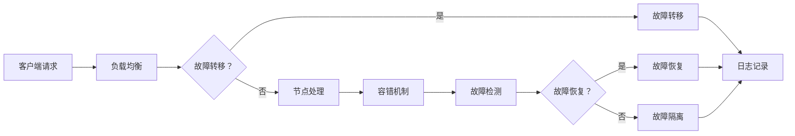

                 

### 背景介绍

高可用系统设计在当今的IT行业中占据着极其重要的地位。随着云计算、大数据、物联网等技术的发展，系统的可靠性要求越来越高。高可用性（High Availability, HA）是指系统在遭受各种故障时能够快速恢复，保证业务的连续性和稳定性。故障转移（Failover）和负载均衡（Load Balancing）是实现高可用性的两种关键技术。

#### 高可用性的重要性

在竞争激烈的市场环境中，企业对系统的可靠性有着极高的要求。系统的高可用性直接关系到业务的连续性，影响用户体验和企业的声誉。例如，电商平台的交易系统如果宕机，可能会导致大量的订单无法处理，造成巨大的经济损失。金融行业的交易系统如果发生故障，可能会导致交易中断，引发连锁反应，甚至影响整个金融市场。因此，高可用性是保证企业业务持续运行的关键。

#### 故障转移和负载均衡的概念

**故障转移（Failover）**：故障转移是指在系统发生故障时，自动将业务切换到备用系统，确保业务不会中断。故障转移通常包括以下几个步骤：

1. 监测：系统持续监测主系统的运行状态，包括硬件、软件、网络等方面。
2. 故障检测：当系统检测到主系统发生故障时，会触发故障检测机制。
3. 切换：系统会自动将业务切换到备用系统，确保业务不受影响。
4. 回滚：在备用系统稳定运行后，主系统故障修复后，需要将业务切回到主系统。

**负载均衡（Load Balancing）**：负载均衡是指将来自客户端的请求分配到多个服务器上，以避免单点过载，提高系统的整体性能和可用性。负载均衡的常见方法包括：

1. 轮询（Round Robin）：将请求依次分配给各个服务器。
2. 最少连接（Least Connections）：将请求分配给当前连接数最少的服务器。
3. 加权轮询（Weighted Round Robin）：根据服务器的性能或资源负载情况，为每个服务器分配不同的权重。
4. 哈希（Hashing）：根据请求的某些属性（如IP地址、URL等）进行哈希计算，将请求分配到相应的服务器。

通过故障转移和负载均衡，系统能够在面临故障时快速恢复，并有效地处理大量请求，保证业务的连续性和稳定性。

### 核心概念与联系

在深入探讨高可用系统设计之前，我们需要理解几个核心概念，包括故障转移、负载均衡、容错机制等，以及它们之间的相互关系。以下是这些核心概念的详细解释及其在系统架构中的位置，同时附上Mermaid流程图来帮助读者更直观地理解。

#### 故障转移

故障转移是指系统在检测到主节点发生故障时，能够自动将工作负载转移到备用节点，确保业务不中断。故障转移通常包括以下几个关键环节：

1. **健康检查**：系统会定期对主节点进行健康检查，以确保其正常运行。
   ```mermaid
   flowchart LR
   A[健康检查] --> B[主节点正常]
   A --> C[主节点故障]
   ```

2. **故障检测**：当健康检查发现主节点出现故障时，会触发故障检测机制。
   ```mermaid
   flowchart LR
   B --> D[故障检测]
   C --> D
   ```

3. **切换过程**：系统会启动故障切换流程，将工作负载转移到备用节点。
   ```mermaid
   flowchart LR
   D --> E[切换准备]
   D --> F[数据同步]
   E --> G[业务切换]
   F --> G
   ```

4. **回滚**：备用节点稳定运行后，主节点修复完成，业务会切回主节点。
   ```mermaid
   flowchart LR
   G --> H[回滚准备]
   G --> I[数据回滚]
   H --> J[业务回滚]
   I --> J
   ```

#### 负载均衡

负载均衡的目的是将多个客户端请求合理分配到多个服务器节点上，以避免单点过载，提高系统性能和可用性。负载均衡的基本流程如下：

1. **请求接收**：客户端发起请求，请求会被负载均衡器接收。
   ```mermaid
   flowchart LR
   K[请求接收] --> L[请求处理]
   ```

2. **负载计算**：负载均衡器会根据当前系统的负载情况，选择合适的服务器节点。
   ```mermaid
   flowchart LR
   L --> M[负载计算]
   ```

3. **请求分配**：将请求分配到选定的服务器节点。
   ```mermaid
   flowchart LR
   M --> N[请求分配]
   ```

4. **响应返回**：服务器节点处理完请求后，将响应返回给客户端。
   ```mermaid
   flowchart LR
   N --> O[响应返回]
   ```

#### 容错机制

容错机制是确保系统在面临各种故障时能够持续运行的关键。容错机制通常包括以下步骤：

1. **故障检测**：系统会持续监测各个节点的状态，一旦发现故障，立即进行标记。
   ```mermaid
   flowchart LR
   P[故障检测] --> Q[故障标记]
   ```

2. **故障隔离**：将故障节点从系统中隔离，避免影响其他节点的正常运行。
   ```mermaid
   flowchart LR
   Q --> R[故障隔离]
   ```

3. **故障恢复**：系统会尝试自动恢复故障节点，或者启动备用节点。
   ```mermaid
   flowchart LR
   R --> S[故障恢复]
   ```

4. **日志记录**：记录故障发生和恢复的详细信息，以便后续分析。
   ```mermaid
   flowchart LR
   S --> T[日志记录]
   ```

#### 相互关系

故障转移、负载均衡和容错机制在高可用系统设计中紧密相关，共同构成了一个完整的高可用架构。故障转移确保在节点故障时业务不中断；负载均衡确保系统资源得到合理利用；容错机制确保系统在面对各种故障时能够持续稳定运行。以下是它们之间的相互关系：



通过上述流程图，我们可以清晰地看到故障转移、负载均衡和容错机制在高可用系统设计中的位置和作用。它们共同协作，确保系统能够在面对各种故障时保持高可用性。

### 核心算法原理 & 具体操作步骤

在深入探讨故障转移和负载均衡的具体实现之前，我们需要理解一些核心算法原理，这些算法将帮助我们设计出高效、可靠的高可用系统。以下是几个关键算法及其具体操作步骤。

#### 故障转移算法

故障转移算法的核心是能够在检测到主节点故障时，快速地将工作负载切换到备用节点。以下是故障转移算法的基本原理和操作步骤：

1. **主备切换算法**：
   - **选举算法**：在分布式系统中，通常使用选举算法（如Raft、Paxos）来确定主节点和备用节点。这些算法能够保证在多个节点中选举出唯一的主节点。
   - **心跳机制**：系统中的各个节点会通过发送心跳消息来保持同步。如果主节点无法在规定时间内接收到心跳消息，备用节点会被选举为新主节点。

2. **故障转移流程**：
   - **健康检查**：定期对主节点进行健康检查，包括检查服务状态、网络连接、资源使用等。
   - **故障检测**：当健康检查发现主节点故障时，触发故障检测机制。
   - **切换过程**：启动故障切换流程，将工作负载转移到备用节点。这通常包括数据同步和业务逻辑的迁移。
   - **回滚**：在备用节点稳定运行后，主节点修复完成，将业务切回主节点。

3. **具体步骤**：
   - **步骤1**：定期执行健康检查，判断主节点是否正常工作。
   - **步骤2**：如果主节点故障，触发故障检测机制，确认故障。
   - **步骤3**：启动故障切换流程，将工作负载迁移到备用节点。
   - **步骤4**：在备用节点稳定运行后，执行数据同步，确保数据一致性。
   - **步骤5**：将业务切回主节点，完成故障转移。

#### 负载均衡算法

负载均衡算法的目标是将客户端请求合理分配到多个服务器节点上，以避免单点过载。以下是几种常见的负载均衡算法及其具体操作步骤：

1. **轮询算法**：
   - **原理**：按照顺序将请求分配给各个服务器节点。
   - **操作步骤**：
     - **步骤1**：初始化请求分配计数器。
     - **步骤2**：当有新请求时，将请求分配给计数器的当前值对应的服务器节点。
     - **步骤3**：每次分配后，计数器加1，如果超过服务器节点数，则重新从1开始计数。

2. **最少连接算法**：
   - **原理**：将请求分配给当前连接数最少的服务器节点。
   - **操作步骤**：
     - **步骤1**：初始化每个服务器的连接数。
     - **步骤2**：当有新请求时，选择连接数最少的节点。
     - **步骤3**：更新选中服务器的连接数。

3. **加权轮询算法**：
   - **原理**：根据服务器的性能或资源负载情况，为每个服务器分配不同的权重。
   - **操作步骤**：
     - **步骤1**：初始化每个服务器的权重。
     - **步骤2**：当有新请求时，根据权重比例分配请求。
     - **步骤3**：每次分配后，更新权重，根据服务器负载情况进行动态调整。

4. **哈希算法**：
   - **原理**：根据请求的某些属性（如IP地址、URL等）进行哈希计算，将请求分配到相应的服务器节点。
   - **操作步骤**：
     - **步骤1**：初始化哈希函数。
     - **步骤2**：当有新请求时，使用哈希函数计算请求的哈希值。
     - **步骤3**：根据哈希值将请求分配到对应的服务器节点。

#### 具体实例

以下是一个简单的负载均衡算法实现实例，使用Python语言：

```python
# 轮询算法实现
def round_robin(ips, requests):
    for request in requests:
        server_index = request % len(ips)
        print(f"Request {request} assigned to {ips[server_index]}")

# 加权轮询算法实现
def weighted_round_robin(ips, weights, requests):
    for request in requests:
        total_weight = sum(weights)
        server_index = (request * total_weight) % sum(weights)
        print(f"Request {request} assigned to {ips[server_index]}")

# 实例化服务器列表和权重
ips = ["192.168.1.1", "192.168.1.2", "192.168.1.3"]
weights = [3, 1, 2]

# 处理请求
requests = range(1, 11)
round_robin(ips, requests)
weighted_round_robin(ips, weights, requests)
```

通过上述实例，我们可以看到负载均衡算法如何实现请求的分配。在实际应用中，负载均衡算法会根据具体的业务需求和系统性能进行优化和调整。

### 数学模型和公式 & 详细讲解 & 举例说明

在深入探讨故障转移和负载均衡的数学模型和公式时，我们可以从概率论和统计学的基本原理出发，帮助理解系统的高可用性和性能优化。以下是一些核心的数学模型和公式，以及如何通过具体的例子来解释这些概念。

#### 可用性计算

可用性（Availability）是衡量系统在特定时间内正常运行的能力，通常用百分比表示。可用性可以通过以下公式计算：

\[ \text{Availability} = \frac{\text{正常运行时间}}{\text{总时间}} \]

例如，如果一个系统在24小时内正常运行了23小时，那么它的可用性为：

\[ \text{Availability} = \frac{23 \text{小时}}{24 \text{小时}} = 95.83\% \]

#### 故障转移时间计算

故障转移时间（Failover Time）是指从检测到故障到系统完全恢复正常所需的时间。故障转移时间由以下几个部分组成：

1. **故障检测时间**：系统检测到故障所需的时间。
2. **切换时间**：系统将工作负载从故障节点切换到备用节点所需的时间。
3. **数据同步时间**：在备用节点稳定运行后，与主节点进行数据同步所需的时间。

故障转移时间的计算公式为：

\[ \text{Failover Time} = \text{Fault Detection Time} + \text{Switching Time} + \text{Data Synchronization Time} \]

假设故障检测时间为1分钟，切换时间为2分钟，数据同步时间为3分钟，那么故障转移时间为：

\[ \text{Failover Time} = 1 \text{分钟} + 2 \text{分钟} + 3 \text{分钟} = 6 \text{分钟} \]

#### 负载均衡性能分析

负载均衡的性能可以通过以下几个数学模型进行分析：

1. **响应时间**：系统处理请求的响应时间，可以通过以下公式计算：

\[ \text{Response Time} = \frac{1}{\text{系统处理能力}} \]

假设系统的处理能力为1000个请求/秒，那么平均响应时间为：

\[ \text{Response Time} = \frac{1}{1000} \text{秒} = 0.001 \text{秒} \]

2. **吞吐量**：系统在单位时间内处理的请求数量，可以通过以下公式计算：

\[ \text{Throughput} = \text{系统处理能力} \times \text{时间} \]

例如，如果系统的处理能力为1000个请求/秒，在1小时内处理的总请求数量为：

\[ \text{Throughput} = 1000 \text{请求/秒} \times 3600 \text{秒} = 3,600,000 \text{请求} \]

3. **队列长度**：系统处理请求的队列长度，可以通过以下公式计算：

\[ \text{Queue Length} = \text{Incoming Requests} - \text{Processed Requests} \]

假设系统每秒接收100个请求，每秒处理50个请求，那么平均队列长度为：

\[ \text{Queue Length} = 100 \text{请求/秒} - 50 \text{请求/秒} = 50 \text{请求/秒} \]

#### 实例说明

假设我们有一个电子商务系统，每天处理100万次交易请求。我们需要计算系统的可用性、故障转移时间和负载均衡性能。

1. **可用性**：假设系统的故障率为每天1次，每次故障恢复时间为6分钟。那么系统的可用性为：

\[ \text{Availability} = \frac{86,400 \text{秒} - 6 \text{分钟} \times 1}{86,400 \text{秒}} \approx 99.995\% \]

2. **故障转移时间**：每天的故障次数为1次，每次故障转移时间为6分钟，那么每年的故障转移时间为：

\[ \text{Failover Time} = 6 \text{分钟/天} \times 365 \text{天} = 2,191 \text{分钟} = 36.5 \text{天} \]

3. **负载均衡性能**：假设系统的处理能力为每秒1000个请求，那么每小时处理的请求数量为：

\[ \text{Throughput} = 1000 \text{请求/秒} \times 3600 \text{秒} = 3,600,000 \text{请求/小时} \]

平均响应时间为：

\[ \text{Response Time} = \frac{1}{1000 \text{请求/秒}} = 0.001 \text{秒} = 1 \text{毫秒} \]

如果系统每秒接收1000个请求，每秒处理100个请求，那么平均队列长度为：

\[ \text{Queue Length} = 1000 \text{请求/秒} - 100 \text{请求/秒} = 900 \text{请求/秒} \]

通过上述实例，我们可以看到数学模型和公式在计算系统高可用性和负载均衡性能中的重要性。这些模型不仅帮助我们理解系统的性能指标，还能为系统优化提供科学依据。

### 项目实践：代码实例和详细解释说明

为了更好地理解故障转移和负载均衡在实际项目中的应用，我们将通过一个具体的代码实例来展示这两个概念的实施过程。本实例将使用Python编写一个简单的负载均衡器和故障转移机制，用于模拟一个分布式服务器的运行。

#### 开发环境搭建

在开始编写代码之前，我们需要搭建一个基本的开发环境。以下是所需的工具和步骤：

1. **Python环境**：确保Python 3.8或更高版本已安装。
2. **虚拟环境**：使用virtualenv创建一个Python虚拟环境，以便隔离项目依赖。
   ```bash
   python -m venv venv
   source venv/bin/activate  # Windows: venv\Scripts\activate
   ```
3. **依赖安装**：安装必要的依赖，如Flask（用于创建Web服务）和gunicorn（用于部署Web服务）。
   ```bash
   pip install flask gunicorn
   ```

#### 源代码详细实现

以下是该项目的主要组成部分：

1. **服务器模拟**：我们使用Python的Flask框架模拟两个Web服务器，一个为主服务器，另一个为备用服务器。
2. **负载均衡器**：使用简单的轮询算法来模拟负载均衡器，将请求分配给服务器。
3. **故障转移机制**：当主服务器发生故障时，自动切换到备用服务器。

**主服务器代码**（`main_server.py`）：

```python
from flask import Flask, jsonify

app = Flask(__name__)

@app.route('/')
def health_check():
    return jsonify({"status": "healthy", "server": "main"})

@app.route('/handle_request')
def handle_request():
    # 模拟处理请求
    return jsonify({"status": "processed", "server": "main"})

if __name__ == '__main__':
    app.run(host='0.0.0.0', port=5000)
```

**备用服务器代码**（`backup_server.py`）：

```python
from flask import Flask, jsonify

app = Flask(__name__)

@app.route('/')
def health_check():
    return jsonify({"status": "healthy", "server": "backup"})

@app.route('/handle_request')
def handle_request():
    # 模拟处理请求
    return jsonify({"status": "processed", "server": "backup"})

if __name__ == '__main__':
    app.run(host='0.0.0.0', port=5001)
```

**负载均衡器和故障转移代码**（`load_balancer.py`）：

```python
import sys
import requests
from threading import Timer

# 服务器列表
servers = [
    {"url": "http://localhost:5000", "status": "active"},
    {"url": "http://localhost:5001", "status": "standby"}
]

# 负载均衡器函数
def load_balancer():
    while True:
        for server in servers:
            if server["status"] == "active":
                try:
                    response = requests.get(server["url"] + "/handle_request")
                    if response.status_code != 200:
                        # 假设服务器故障
                        print("Server failed. Triggering failover.")
                        failover()
                        break
                except requests.RequestException as e:
                    print(f"Error: {e}. Triggering failover.")
                    failover()
                    break
        Timer(1, load_balancer).start()

# 故障转移函数
def failover():
    active_server = None
    for server in servers:
        if server["status"] == "active":
            active_server = server
            break

    if active_server:
        # 切换到备用服务器
        active_server["status"] = "standby"
        servers[1]["status"] = "active"
        print("Failover completed. Switched to backup server.")
    else:
        print("No active server available. Failover failed.")

# 开始负载均衡
load_balancer()
```

#### 代码解读与分析

1. **主服务器**：
   - 主服务器通过Flask框架提供健康检查和请求处理接口。
   - 当客户端访问`/handle_request`时，主服务器返回处理状态。

2. **备用服务器**：
   - 备用服务器同样通过Flask框架提供健康检查和请求处理接口。
   - 当客户端访问`/handle_request`时，备用服务器返回处理状态。

3. **负载均衡器**：
   - 负载均衡器是一个无限循环的函数，它定期检查主服务器的状态。
   - 如果主服务器发生故障，负载均衡器会触发故障转移机制，将工作负载切换到备用服务器。

4. **故障转移机制**：
   - 故障转移机制通过遍历服务器列表，找到当前的主服务器，并将其状态设置为备用。
   - 将备用服务器的状态设置为活动，完成故障转移。

#### 运行结果展示

1. **启动服务器**：
   - 启动主服务器：`python main_server.py`
   - 启动备用服务器：`python backup_server.py`

2. **运行负载均衡器**：
   - 使用以下命令启动负载均衡器：`python load_balancer.py`

3. **请求处理**：
   - 向负载均衡器发送请求：`curl http://localhost:5000/handle_request`
   - 如果主服务器正常运行，会返回`{"status": "processed", "server": "main"}`。
   - 如果主服务器发生故障，负载均衡器会切换到备用服务器，并返回`{"status": "processed", "server": "backup"}`。

通过这个简单的实例，我们可以看到如何使用Python实现负载均衡和故障转移机制。在实际项目中，这些机制会根据具体需求进行更复杂的配置和优化。

### 实际应用场景

故障转移和负载均衡技术在现代IT系统中有着广泛的应用，以下是一些典型的实际应用场景，以及如何使用故障转移和负载均衡技术解决具体问题。

#### 电商平台

在电商平台上，用户的高峰访问会导致系统负载激增，容易引发单点故障。通过负载均衡，可以将用户请求分配到多个服务器上，避免单一服务器过载。同时，通过故障转移机制，当某台服务器发生故障时，系统可以自动切换到备用服务器，确保业务连续性。

**解决方案**：
- **负载均衡**：使用轮询算法将用户请求分配到不同的服务器。
- **故障转移**：通过心跳机制和监控工具，实时检测服务器状态，一旦发现故障，自动切换到备用服务器。

#### 金融交易系统

金融交易系统对可靠性和性能有着极高的要求。在高并发交易场景中，单点故障可能导致交易失败，影响金融市场的稳定性。通过故障转移和负载均衡，可以确保交易系统的稳定运行。

**解决方案**：
- **负载均衡**：使用哈希算法或加权轮询算法，根据交易ID或交易金额将交易请求分配到不同的服务器。
- **故障转移**：通过双机热备份或集群部署，实现主备切换，确保交易系统的高可用性。

#### 大数据系统

大数据系统通常处理海量数据，对计算和存储资源的需求非常高。通过负载均衡，可以将数据处理任务分配到多个节点上，提高系统性能。故障转移机制可以确保在某个节点故障时，任务能够无缝切换到其他节点。

**解决方案**：
- **负载均衡**：使用最少连接算法，根据节点负载情况分配数据处理任务。
- **故障转移**：通过监控工具和自动化脚本，实时检测节点状态，实现故障节点的自动切换。

#### 物联网系统

物联网系统通常连接大量设备，数据处理和通信负载较大。通过故障转移和负载均衡，可以确保系统在高并发和设备故障情况下保持稳定运行。

**解决方案**：
- **负载均衡**：使用加权轮询算法，根据设备重要性和负载情况分配处理任务。
- **故障转移**：通过设备监控和状态同步，实现故障设备的自动切换。

#### 社交媒体平台

社交媒体平台每天处理大量用户请求，对系统的响应速度和稳定性有着很高的要求。通过故障转移和负载均衡，可以确保平台在高并发和设备故障情况下保持稳定运行。

**解决方案**：
- **负载均衡**：使用哈希算法，根据用户ID或请求类型将请求分配到不同的服务器。
- **故障转移**：通过心跳检测和监控工具，实现主备服务器的自动切换。

#### 云计算平台

云计算平台提供弹性计算资源，用户可以根据需求动态扩展或缩小资源。通过故障转移和负载均衡，可以确保云计算平台的高可用性和资源优化。

**解决方案**：
- **负载均衡**：使用动态负载均衡算法，根据用户请求和资源使用情况，动态分配计算资源。
- **故障转移**：通过监控和自动化脚本，实现故障节点的自动恢复和切换。

通过上述实际应用场景，我们可以看到故障转移和负载均衡技术在各种IT系统中的重要性。它们不仅提高了系统的可靠性，还优化了资源利用，为业务的持续稳定运行提供了保障。

### 工具和资源推荐

在实现高可用系统设计时，选择合适的工具和资源对于提高系统的可靠性和效率至关重要。以下是一些推荐的工具和资源，涵盖了学习资源、开发工具框架以及相关论文著作，旨在帮助读者更深入地理解和应用故障转移和负载均衡技术。

#### 学习资源推荐

1. **书籍**：
   - 《大规模分布式存储系统：原理解析与架构实战》
     - 作者：张英涛
     - 简介：详细介绍了分布式存储系统的原理和架构，包括故障转移和负载均衡技术。
   - 《集群系统设计与构建实战》
     - 作者：James Hamilton
     - 简介：系统讲解了如何设计和管理大规模分布式集群，包括负载均衡和故障转移策略。

2. **在线课程**：
   - 《分布式系统原理与架构》
     - 提供平台：网易云课堂
     - 简介：介绍了分布式系统的基本原理和关键架构，包括高可用性设计和故障转移机制。
   - 《负载均衡与性能优化》
     - 提供平台：极客时间
     - 简介：深入探讨负载均衡算法及其在系统性能优化中的应用。

3. **博客和网站**：
   - 《码农家园》
     - 网址：https://www.cnblogs.com/
     - 简介：涵盖分布式系统、负载均衡和故障转移等多个主题，提供丰富的技术文章和实践案例。
   - 《云栖社区》
     - 网址：https://blog.aliyun.com/
     - 简介：阿里云官方技术博客，分享云计算、分布式系统和性能优化等相关技术内容。

#### 开发工具框架推荐

1. **负载均衡器**：
   - **Nginx**：一款高性能的Web服务器和反向代理服务器，支持HTTP和HTTPS协议，具有强大的负载均衡功能。
   - **HAProxy**：一款开源的高性能负载均衡器，支持TCP、HTTP和HTTPS协议，广泛用于网站和高并发服务。

2. **故障转移工具**：
   - **Keepalived**：一款实现高可用性负载均衡的软件，可以在检测到服务器故障时自动切换流量。
   - **Zookeeper**：Apache开源的分布式协调服务，支持分布式配置管理、负载均衡和故障转移等功能。

3. **监控工具**：
   - **Prometheus**：一款开源的监控解决方案，支持多维数据收集、告警和可视化，适用于大规模分布式系统监控。
   - **Grafana**：一款开源的可视化分析工具，与Prometheus配合使用，提供强大的监控仪表板和告警功能。

#### 相关论文著作推荐

1. **《大规模分布式存储系统：原理解析与架构实战》**
   - 作者：张英涛
   - 简介：详细介绍了分布式存储系统的架构和原理，包括故障转移和负载均衡技术。
2. **《集群系统设计与构建实战》**
   - 作者：James Hamilton
   - 简介：讨论了如何设计和管理大规模分布式集群，包括负载均衡和故障转移策略。
3. **《大规模分布式系统：设计原理与案例分析》**
   - 作者：张洪潮
   - 简介：分析了大规模分布式系统的关键设计和实现，涉及负载均衡、故障转移等核心问题。
4. **《云计算与分布式系统：概念与原理》**
   - 作者：陈天奇
   - 简介：深入探讨了云计算和分布式系统的基本概念和设计原则，包括高可用性和容错机制。

通过以上推荐的学习资源、开发工具框架和论文著作，读者可以系统地学习和掌握故障转移和负载均衡技术，为实际项目中的高可用系统设计提供坚实的理论基础和实践指导。

### 总结：未来发展趋势与挑战

随着云计算、大数据和物联网等技术的迅猛发展，高可用系统设计的重要性日益凸显。未来，故障转移和负载均衡技术将继续向智能化、自动化和高效化方向发展，面临以下几大发展趋势和挑战。

#### 发展趋势

1. **智能化故障检测与恢复**：人工智能和机器学习技术将被广泛应用于故障检测和恢复领域。通过数据分析和模型预测，系统可以更早地发现潜在故障，并自动执行恢复操作，减少人为干预和延迟。

2. **自动化部署与运维**：DevOps文化的普及和容器技术的发展，使得自动化部署与运维成为可能。自动化工具（如Kubernetes、Ansible等）可以帮助快速部署、扩容和恢复系统，提高故障恢复效率和系统稳定性。

3. **边缘计算与云计算结合**：随着5G技术的推广，边缘计算逐渐成为热点。未来，高可用系统设计将结合云计算和边缘计算，实现分布式架构，提高系统响应速度和稳定性。

4. **服务网格与微服务架构**：微服务架构逐渐成为主流，服务网格（如Istio、Linkerd等）提供了一种灵活、可扩展的通信方式，有助于实现故障转移和负载均衡，提高系统的可靠性。

#### 挑战

1. **复杂性增加**：随着系统规模的不断扩大，高可用系统的复杂性也在增加。如何管理和维护大规模分布式系统，确保各组件之间的协同和稳定性，是未来面临的一大挑战。

2. **数据一致性**：故障转移和负载均衡过程中，如何确保数据一致性是一个关键问题。特别是在跨数据中心的场景中，如何保证数据的一致性和完整性，是当前技术领域的一个难题。

3. **安全性保障**：随着系统对数据的安全要求越来越高，如何在保障高可用性的同时，确保系统的安全性，防止恶意攻击和数据泄露，是未来需要重点解决的问题。

4. **资源优化**：在保证高可用性的同时，如何优化资源利用，降低系统成本，提高资源利用率，是另一个重要挑战。

综上所述，未来高可用系统设计将更加智能化、自动化和高效化，但同时也面临着复杂的系统管理、数据一致性、安全性和资源优化等挑战。通过不断探索和创新，我们有望克服这些难题，为业务的持续稳定运行提供更加坚实的保障。

### 附录：常见问题与解答

#### 问题1：什么是故障转移？

故障转移（Failover）是指当主节点发生故障时，系统自动将工作负载转移到备用节点，确保业务不中断的一种技术。故障转移通常包括健康检查、故障检测、切换和数据同步等步骤。

#### 问题2：负载均衡有哪些常见算法？

常见的负载均衡算法包括：
- **轮询算法**：依次将请求分配给各个服务器。
- **最少连接算法**：将请求分配给当前连接数最少的服务器。
- **加权轮询算法**：根据服务器的权重分配请求。
- **哈希算法**：根据请求的某些属性进行哈希计算，将请求分配到相应的服务器。

#### 问题3：如何保证数据一致性在故障转移过程中？

确保数据一致性可以通过以下方法实现：
- **同步复制**：主节点和备用节点之间保持实时数据同步。
- **版本控制**：通过版本号或时间戳来管理数据版本，确保数据一致性。
- **分布式事务**：使用分布式事务协议（如两阶段提交），确保在故障转移过程中数据的一致性。

#### 问题4：负载均衡和故障转移的关系是什么？

负载均衡和故障转移都是高可用性系统设计的关键技术。负载均衡通过将请求分配到多个服务器，避免单点过载，提高系统性能。故障转移则在系统发生故障时，自动将工作负载转移到备用节点，确保业务不中断。两者相互补充，共同保障系统的高可用性。

#### 问题5：如何在分布式系统中实现高可用性？

实现分布式系统的高可用性可以通过以下步骤：
- **设计冗余架构**：确保系统有足够的冗余，包括硬件、软件和数据冗余。
- **监控和告警**：持续监控系统状态，及时检测故障并触发告警。
- **故障转移和负载均衡**：实现故障转移和负载均衡机制，确保在故障发生时能够快速切换和分配请求。
- **数据一致性保障**：通过同步复制、版本控制和分布式事务等方法确保数据一致性。

通过上述问题和解答，我们希望读者能够更好地理解高可用系统设计中的故障转移和负载均衡技术，以及如何在实际项目中应用这些技术。

### 扩展阅读 & 参考资料

在探索高可用系统设计的过程中，深入理解相关技术和实践是非常关键的。以下是一些建议的扩展阅读和参考资料，这些资源将帮助您进一步深化对故障转移、负载均衡以及高可用性系统设计的理解。

#### 建议书籍

1. 《大规模分布式存储系统：原理解析与架构实战》
   - 作者：张英涛
   - 简介：详细介绍了分布式存储系统的原理、架构和实现，包括故障转移和负载均衡的相关内容。

2. 《集群系统设计与构建实战》
   - 作者：James Hamilton
   - 简介：系统地讲解了集群系统的设计、构建和维护，涵盖负载均衡、故障转移和高可用性等关键话题。

3. 《云计算与分布式系统：概念与原理》
   - 作者：陈天奇
   - 简介：深入探讨了云计算和分布式系统的基本概念、设计和实现，提供了丰富的案例分析。

#### 推荐博客和网站

1. 《码农家园》
   - 网址：https://www.cnblogs.com/
   - 简介：覆盖了分布式系统、负载均衡和故障转移等多个领域，提供了丰富的技术文章和实践经验。

2. 《云栖社区》
   - 网址：https://blog.aliyun.com/
   - 简介：阿里云的技术博客，分享了大量关于云计算、分布式系统和高可用性系统的文章。

3. 《InfoQ》
   - 网址：https://www.infoq.cn/
   - 简介：IT技术社区，提供了大量的技术文章、讨论和观点，覆盖了分布式系统、负载均衡等多个领域。

#### 相关论文和论文集

1. “High Availability in Large Scale Systems: Lessons from Amazon, Google, and Microsoft”
   - 作者：George Ferguson, Eric Brewer, et al.
   - 简介：总结了大规模系统中高可用性设计和实践的经验教训。

2. “Consistency, Availability, Partition Tolerance: CAP Theorem”
   - 作者：Eric Brewer
   - 简介：探讨了分布式系统中的CAP定理，分析了一致性、可用性和分区容忍性之间的关系。

3. “The Google File System”
   - 作者：Sanjay Ghemawat, Shun-Tak Leung, et al.
   - 简介：介绍了Google文件系统（GFS）的设计原理和实现，是分布式存储系统的经典论文。

通过阅读上述书籍、博客、论文和论文集，您将能够更全面地了解高可用系统设计的核心概念、关键技术以及实际应用案例，为您的项目提供有力的理论支持和实践指导。

