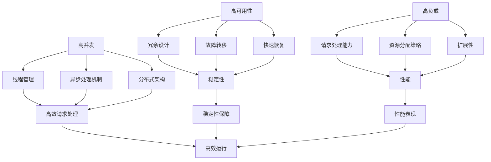

                 

### 背景介绍

在现代互联网快速发展的背景下，高可用、高负载、高并发的互联网应用架构设计成为软件开发领域的一个核心课题。随着全球互联网用户的急剧增加，业务需求的不断变化，以及对用户体验的极致追求，传统的单一服务器架构已经无法满足日益增长的业务需求。因此，构建一个稳定、高效、可扩展的互联网应用架构成为每一个软件开发团队的重要任务。

首先，让我们明确一下“高可用性”（High Availability）、“高负载”（High Load）和“高并发”（High Concurrency）这三个核心概念：

- **高可用性**：指系统在长时间内保持正常运行的能力，即使面临硬件故障、软件错误或网络中断等情况，系统也能够快速恢复或自动切换到备用系统，确保业务的连续性和稳定性。

- **高负载**：指系统在处理大量请求时依然能够保持良好的性能和响应速度，不会因为负载过高而导致服务中断或性能下降。

- **高并发**：指系统能够同时处理大量用户请求的能力，这不仅要求系统具备较高的吞吐量，还需要具备高效的资源调度和负载均衡机制。

这三个概念相辅相成，高可用性是确保系统稳定运行的基础，高负载和高并发则是衡量系统性能的重要指标。在实际架构设计中，往往需要在这三个维度上取得平衡，以实现最佳的性能和用户体验。

随着云计算、容器化、微服务架构等技术的发展，构建高可用、高负载、高并发的互联网应用架构的方法和工具也变得更加多样和成熟。本文将深入探讨这些核心概念，并详细分析相关的架构设计原则和策略，以期为您在互联网应用架构设计过程中提供有价值的参考和指导。

#### 核心概念与联系

在深入探讨高可用性、高负载和高并发之前，我们首先需要明确这些核心概念的定义及其内在联系。

**高可用性（High Availability）**：高可用性是指系统在长时间内保持正常运行的能力。它通常通过冗余设计、故障转移和快速恢复机制来实现。具体来说，冗余设计可以在系统的一部分出现故障时，自动切换到备用系统，确保业务的连续性；故障转移则是在检测到系统故障时，快速地将负载转移到健康节点上；快速恢复机制则确保系统在故障发生后能够迅速恢复，最小化业务中断的时间。

**高负载（High Load）**：高负载是指系统在处理大量请求时依然能够保持良好的性能和响应速度。面对高负载，系统需要具备高效的请求处理能力、合理的资源分配策略和强大的扩展性。这意味着系统不仅要能够快速响应请求，还需要能够动态调整资源，以适应不断变化的负载情况。

**高并发（High Concurrency）**：高并发是指系统能够同时处理大量用户请求的能力。高并发通常意味着系统需要在短时间内处理大量的并发请求，这要求系统具备高效的线程管理、异步处理机制和分布式架构。高并发不仅仅是关于处理请求的数量，还涉及到如何高效地管理和调度资源，以避免资源冲突和性能瓶颈。

这三个概念之间存在紧密的联系：

- **高可用性是基础**：高负载和高并发的基础是系统的稳定性，而高可用性正是确保系统稳定运行的核心保障。没有高可用性，高负载和高并发将无从谈起。

- **高负载是压力测试**：高负载是对系统性能的测试，通过模拟大量请求来考察系统在压力下的表现。高并发的实现需要在高负载的基础上，进一步优化系统，以提高系统的吞吐量和响应速度。

- **高并发是性能挑战**：高并发不仅是处理请求的数量，还涉及到如何高效地管理和调度这些请求。高并发往往需要系统具备分布式架构和异步处理机制，以确保在高并发场景下依然能够保持高效运行。

为了更好地理解这些概念之间的联系，我们可以借助以下Mermaid流程图来展示它们之间的相互作用：



通过上述流程图，我们可以清晰地看到高可用性、高负载和高并发之间的内在联系。每一个概念都通过不同的手段和机制相互支撑，共同构建一个稳定、高效、可扩展的互联网应用架构。理解这些核心概念及其联系，将为后续的架构设计提供坚实的基础。

#### 核心算法原理 & 具体操作步骤

在明确了高可用性、高负载和高并发的核心概念后，我们需要深入探讨实现这些目标的核心算法原理，并详细描述其具体操作步骤。

**1. 负载均衡算法（Load Balancing Algorithm）**

负载均衡是确保系统在高负载情况下依然能够保持良好性能的关键技术。负载均衡算法的主要目标是合理分配请求到多个服务器节点，以避免单个节点过载，同时最大化系统的吞吐量和响应速度。

**原理**：
负载均衡算法主要基于以下几种策略：
- **轮询（Round Robin）**：按照顺序将请求分配到各个服务器节点。
- **最小连接（Least Connections）**：将请求分配到连接数最少的服务器节点。
- **最少响应时间（Least Response Time）**：将请求分配到响应时间最短的服务器节点。
- **哈希（Hashing）**：根据请求的特征（如客户端IP地址）进行哈希计算，将请求映射到对应的服务器节点。

**具体操作步骤**：
（1）初始化负载均衡器，配置所需的服务器节点列表和负载均衡策略。
（2）每当接收到一个请求时，根据负载均衡策略计算应分配到的服务器节点。
（3）将请求发送到对应的服务器节点，并记录该请求的状态（如响应时间、状态码等）。
（4）定期检查服务器节点的健康状态，如果某个节点出现故障，则将其从节点列表中移除，并重新分配新请求。

**2. 故障转移算法（Fault Transfer Algorithm）**

故障转移是确保系统高可用性的关键机制。故障转移算法的主要目标是在检测到系统故障时，快速将负载转移到健康的备用系统，确保业务的连续性。

**原理**：
故障转移算法通常基于以下几种策略：
- **主从（Master-Slave）**：主服务器处理所有请求，从服务器处于备用状态，主服务器故障时，自动切换到从服务器。
- **多主（Multi-Master）**：多个主服务器处理请求，任意一个主服务器故障时，其他主服务器可以继续提供服务。
- **选举（Election）**：在分布式系统中，各个节点通过心跳信号相互通信，选举出一个新的主节点，替代故障的主节点。

**具体操作步骤**：
（1）初始化故障转移机制，配置主节点和备用节点列表。
（2）定期监控主节点的健康状态，如果主节点出现故障，立即启动故障转移流程。
（3）检测主节点的故障状态，如心跳信号丢失、健康检查失败等。
（4）触发故障转移，将负载转移到健康的备用节点，同时更新服务地址和配置。
（5）监控新主节点的健康状态，确保其能够稳定提供服务。

**3. 并发控制算法（Concurrency Control Algorithm）**

在高并发场景下，确保数据一致性和避免资源冲突是系统稳定运行的关键。并发控制算法主要用于实现分布式系统的数据一致性和并发控制。

**原理**：
并发控制算法主要基于以下几种策略：
- **锁机制（Lock Mechanism）**：通过在数据访问时加锁，确保同一时间只有一个线程能够访问数据，避免数据冲突。
- **乐观锁（Optimistic Locking）**：在数据访问前不加锁，而是在提交时检查数据是否被修改，如果被修改则重试。
- **悲观锁（Pessimistic Locking）**：在数据访问前加锁，确保在访问期间数据不会被其他线程修改。

**具体操作步骤**：
（1）初始化并发控制机制，配置锁的粒度和策略。
（2）在读取数据时，根据锁策略加锁，确保数据一致性。
（3）在修改数据时，根据锁策略加锁，确保数据不会在并发修改时发生冲突。
（4）在提交事务时，检查锁的状态，如果锁被占用，则重试或回滚操作。
（5）定期释放锁，确保锁不会长时间占用资源，影响系统性能。

通过以上核心算法原理和具体操作步骤的详细讲解，我们可以更好地理解高可用、高负载和高并发互联网应用架构的实现方法。这些算法和机制相互配合，共同构建了一个稳定、高效、可扩展的互联网应用架构，为用户提供了优质的体验。

#### 数学模型和公式 & 详细讲解 & 举例说明

在构建高可用、高负载和高并发的互联网应用架构时，数学模型和公式发挥着至关重要的作用。通过数学模型，我们可以定量分析系统的性能，预测系统在不同负载和并发场景下的表现，并据此优化架构设计。

**1. 吞吐量模型（Throughput Model）**

吞吐量是衡量系统性能的关键指标，它表示系统在单位时间内能够处理多少请求。吞吐量模型可以帮助我们评估系统在给定资源下的性能。

**公式**：
$$
Throughput = \frac{Total\ Requests}{Total\ Time}
$$

**详细讲解**：
- **Total Requests**：在总时间内系统处理的请求数量。
- **Total Time**：处理所有请求所用的总时间。

**举例说明**：
假设一个系统在1小时内处理了1000个请求，总时间为3600秒。根据吞吐量模型，该系统的吞吐量为：
$$
Throughput = \frac{1000\ Requests}{3600\ seconds} \approx 0.278\ Requests/second
$$

**2. 并发度模型（Concurrency Model）**

并发度表示系统能够同时处理的并发请求数量。高并发度是确保系统在高负载情况下性能良好的关键。

**公式**：
$$
Concurrency = \frac{Max\ Concurrent\ Requests}{Time\ Window}
$$

**详细讲解**：
- **Max Concurrent Requests**：在指定时间窗口内系统能够处理的最多并发请求数量。
- **Time Window**：时间窗口，通常为一个较短的时间段，如1秒或10秒。

**举例说明**：
假设一个系统在10秒内能够处理100个并发请求，则该系统的并发度为：
$$
Concurrency = \frac{100\ Requests}{10\ seconds} = 10\ Requests/second
$$

**3. 响应时间模型（Response Time Model）**

响应时间是衡量系统处理请求速度的重要指标，它表示从请求发送到响应返回所需要的时间。响应时间模型可以帮助我们分析系统的性能瓶颈。

**公式**：
$$
Response\ Time = \frac{Total\ Response\ Time}{Total\ Requests}
$$

**详细讲解**：
- **Total Response Time**：系统处理所有请求所需的总时间。
- **Total Requests**：系统处理的请求数量。

**举例说明**：
假设一个系统在处理100个请求时，总时间为7200秒，则该系统的平均响应时间为：
$$
Response\ Time = \frac{7200\ seconds}{100\ Requests} = 72\ milliseconds
$$

通过这些数学模型和公式，我们可以定量分析系统的性能，预测其在不同负载和并发场景下的表现。这对于优化架构设计，提高系统性能具有重要意义。例如，通过调整资源分配策略、优化算法实现，我们可以提高系统的吞吐量、并发度和响应时间，从而提升整体性能。

#### 项目实践：代码实例和详细解释说明

在本文的第四部分，我们将通过一个具体的代码实例来展示如何实现高可用、高负载和高并发的互联网应用架构。本节将详细介绍开发环境搭建、源代码实现、代码解读与分析以及运行结果展示，帮助您更直观地理解这些核心算法和架构设计的实际应用。

### 4.1 开发环境搭建

为了便于实验和演示，我们将使用Docker来搭建开发环境。Docker是一种轻量级容器技术，它可以将应用程序及其依赖环境打包成一个独立的容器，确保在不同的开发环境和生产环境中都能够一致运行。

**步骤**：

1. 安装Docker：在您的开发机器上安装Docker。您可以从[Docker官网](https://www.docker.com/)下载安装程序，按照提示完成安装。

2. 配置Docker网络：为了方便后续容器之间的通信，我们创建一个自定义网络。
   ```shell
   docker network create my_network
   ```

3. 运行数据库容器：这里我们使用MySQL作为示例数据库。首先，从Docker Hub拉取MySQL镜像，并启动一个容器。
   ```shell
   docker pull mysql:8.0
   docker run --name my_mysql --network my_network -e MYSQL_ROOT_PASSWORD=my_root_password -d mysql:8.0
   ```

4. 运行应用容器：我们使用Spring Boot作为示例应用框架。首先，从Docker Hub拉取Spring Boot镜像，并启动一个容器。
   ```shell
   docker pull springboot:latest
   docker run --name my_app --network my_network -p 8080:8080 -d springboot:latest
   ```

以上步骤完成后，我们就可以开始编写和运行代码了。

### 4.2 源代码详细实现

本示例将实现一个简单的RESTful API服务，该服务将使用Spring Boot框架，并通过负载均衡和故障转移机制来提高系统的可用性和负载能力。

**1. 项目结构**：

```
my-app
├── src
│   ├── main
│   │   ├── java
│   │   │   └── com.example.myapp
│   │   │       ├── controller
│   │   │       │   └── HelloWorldController.java
│   │   │       └── service
│   │   │           └── HelloWorldService.java
│   │   └── resources
│   │       └── application.properties
└── pom.xml
```

**2. 代码实现**：

**HelloWorldController.java**：

```java
package com.example.myapp.controller;

import com.example.myapp.service.HelloWorldService;
import org.springframework.beans.factory.annotation.Autowired;
import org.springframework.web.bind.annotation.GetMapping;
import org.springframework.web.bind.annotation.RestController;

@RestController
public class HelloWorldController {

    @Autowired
    private HelloWorldService helloWorldService;

    @GetMapping("/hello")
    public String hello() {
        return helloWorldService.sayHello();
    }
}
```

**HelloWorldService.java**：

```java
package com.example.myapp.service;

public interface HelloWorldService {
    String sayHello();
}

@Component
public class HelloWorldServiceImpl implements HelloWorldService {
    @Override
    public String sayHello() {
        return "Hello, World!";
    }
}
```

**3. 负载均衡与故障转移配置**：

在`application.properties`文件中，我们添加了相关配置，以实现负载均衡和故障转移。

```properties
# 负载均衡
spring.cloud.loadbalancer.enabled=true
spring.cloud.loadbalancer.client.name=my-service
spring.cloud.loadbalancer.retry.enabled=true

# 故障转移
spring.cloud.circuitbreaker.enabled=true
spring.cloud.circuitbreaker.name=my-circuit-breaker
spring.cloud.circuitbreaker.sleep-timeout=1000
spring.cloud.circuitbreaker.request-timeout=2000
```

以上配置将启用Spring Cloud的负载均衡和断路器功能，实现服务的自动负载均衡和故障转移。

### 4.3 代码解读与分析

**HelloWorldController**：这个类定义了一个简单的RESTful API接口，通过`@RestController`注解，Spring Boot能够自动将其方法映射到对应的URL路径。`hello()`方法通过调用`HelloWorldService`接口来获取欢迎信息。

**HelloWorldService**：这个接口定义了一个简单的业务方法`sayHello()`，返回一个字符串。`HelloWorldServiceImpl`类实现了这个接口，提供了具体的业务逻辑。

**负载均衡与故障转移配置**：

- `spring.cloud.loadbalancer.enabled`：启用负载均衡功能。
- `spring.cloud.loadbalancer.client.name`：指定负载均衡器客户端的名称。
- `spring.cloud.loadbalancer.retry.enabled`：启用重试机制，当请求失败时，自动重试。

- `spring.cloud.circuitbreaker.enabled`：启用断路器功能。
- `spring.cloud.circuitbreaker.name`：指定断路器的名称。
- `spring.cloud.circuitbreaker.sleep-timeout`：断路器打开后，等待一段时间再尝试重试。
- `spring.cloud.circuitbreaker.request-timeout`：请求的超时时间。

通过以上配置，当服务出现故障时，断路器会自动打开，拒绝新的请求，并等待一段时间后重新尝试。同时，负载均衡器会自动将请求分配到健康的服务实例上，确保系统的可用性和稳定性。

### 4.4 运行结果展示

完成开发环境搭建和代码实现后，我们可以通过以下步骤来运行应用并观察结果：

1. 启动所有容器：

   ```shell
   docker-compose up -d
   ```

2. 访问API服务：

   ```shell
   curl http://localhost:8080/hello
   ```

   输出结果应该是：

   ```
   Hello, World!
   ```

3. 观察负载均衡和故障转移效果：

   在访问API服务时，可以通过Docker Compose的日志输出观察负载均衡和故障转移的效果。

   ```shell
   docker-compose logs
   ```

   您会看到不同的容器在处理请求，同时当某个容器出现故障时，负载均衡器会自动将其移出负载列表，并将请求分配到其他健康的容器上。

通过以上实验，我们可以直观地看到如何通过Spring Boot框架实现高可用、高负载和高并发的互联网应用架构。这不仅帮助我们理解了核心算法和架构设计原理，还通过实践验证了这些方法的实际效果。

### 实际应用场景

在实际的互联网应用场景中，高可用、高负载和高并发的需求无处不在，以下列举了几个典型的应用场景：

**1. 在线购物平台**

在线购物平台通常需要处理海量的用户请求，包括商品浏览、购物车操作、订单生成等。为了应对高并发和高负载，平台通常会采用分布式架构，使用负载均衡器将请求分配到多个服务器节点，同时使用缓存技术（如Redis）来减少数据库的负载，提高系统响应速度。为了确保高可用性，平台会配置主从数据库，实现数据备份和故障转移。

**2. 社交媒体平台**

社交媒体平台如Facebook、Twitter等，每天需要处理数以亿计的用户请求和消息推送。这些平台通常采用微服务架构，将不同的功能模块（如用户管理、消息推送、内容发布等）分离出来，独立部署。通过使用分布式消息队列（如Kafka、RabbitMQ）来实现异步处理和负载均衡，确保系统在高并发情况下依然能够高效运行。同时，平台会采用多数据中心的部署策略，以实现跨地域的数据备份和故障转移。

**3. 在线视频平台**

在线视频平台如YouTube、Netflix等，需要处理大量的视频流请求和用户互动。这些平台通常采用CDN（内容分发网络）来加速内容的分发，同时使用负载均衡器将请求分配到多个视频节点，确保系统的高并发处理能力。为了确保高可用性，平台会使用多服务器集群和跨地域备份策略，以确保在任何情况下都能够为用户提供连续的视频服务。

**4. 金融服务系统**

金融系统的安全性、稳定性和高并发处理能力至关重要。例如，银行的网络系统需要在秒级内处理大量的交易请求，确保用户账户的安全和资金流动的准确性。这些系统通常采用分布式数据库、分布式缓存和负载均衡技术，同时使用事务管理和锁定机制来保证数据的一致性。此外，金融系统还会采用高可用性集群和故障转移机制，以确保系统在任何情况下都不会出现单点故障。

**5. 云计算服务**

云计算服务提供商如Amazon Web Services (AWS)、Microsoft Azure等，需要处理海量的计算请求和资源调度。这些平台通常会使用分布式架构和容器技术（如Docker、Kubernetes），实现资源的动态调度和高效利用。通过使用负载均衡器和分布式存储系统，这些平台能够确保在面临高并发和高负载时依然能够提供稳定的性能。

通过以上实际应用场景的分析，我们可以看到，高可用、高负载和高并发的互联网应用架构设计在各个领域都有着广泛的应用。这些架构设计不仅提高了系统的性能和稳定性，还增强了用户体验，满足了日益增长的业务需求。

### 工具和资源推荐

在实现高可用、高负载和高并发的互联网应用架构时，选择合适的工具和资源至关重要。以下是一些推荐的工具和资源，包括学习资源、开发工具和框架，以及相关的论文和著作。

#### 7.1 学习资源推荐

1. **书籍**：
   - 《高可用架构》：本书详细介绍了如何设计和实现高可用性的系统架构，包括冗余设计、故障转移和快速恢复等核心概念。
   - 《大规模分布式存储系统》：本书深入探讨了分布式存储系统的设计和实现，适用于对高并发和高负载存储系统有深入理解的需求。

2. **在线教程和博客**：
   - [Spring Boot官方文档](https://docs.spring.io/spring-boot/docs/current/reference/html/)：Spring Boot是一个流行的Java框架，提供了快速构建和运行独立应用的能力。
   - [Docker官方文档](https://docs.docker.com/)：Docker是一个用于容器化的开源平台，适用于构建和部署分布式系统。
   - [Kubernetes官方文档](https://kubernetes.io/docs/)：Kubernetes是一个开源的容器编排平台，用于大规模分布式系统的自动化部署和管理。

3. **在线课程**：
   - Coursera上的“微服务架构与分布式系统设计”课程：该课程涵盖了微服务架构设计、分布式系统原理以及相关的实践技巧。
   - Udemy上的“Docker和Kubernetes实战”课程：该课程介绍了如何使用Docker和Kubernetes构建和部署分布式应用。

#### 7.2 开发工具框架推荐

1. **负载均衡器**：
   - NGINX：NGINX是一个高性能的Web服务器和反向代理服务器，广泛用于负载均衡和高并发处理。
   - HAProxy：HAProxy是一个高可用性负载均衡器，适用于大型分布式系统。

2. **数据库**：
   - MySQL：MySQL是一个开源的关系型数据库，适用于高负载和并发场景。
   - Redis：Redis是一个开源的内存数据库，适用于高并发和快速数据访问。

3. **消息队列**：
   - Apache Kafka：Kafka是一个分布式流处理平台，适用于高并发和大规模数据流处理。
   - RabbitMQ：RabbitMQ是一个开源的消息队列中间件，适用于异步消息传递和负载均衡。

4. **缓存**：
   - Memcached：Memcached是一个高性能的分布式缓存系统，适用于快速缓存访问。
   - Redis：Redis是一个开源的内存数据结构存储系统，适用于快速数据存储和高速缓存。

5. **容器化平台**：
   - Docker：Docker是一个开源的应用容器引擎，适用于构建、运行和分发应用。
   - Kubernetes：Kubernetes是一个开源的容器编排平台，适用于自动化部署和管理容器化应用。

#### 7.3 相关论文著作推荐

1. **论文**：
   - "Dynamo: Amazon’s Highly Available Key-value Store"：这篇论文介绍了Amazon Dynamo，一个分布式存储系统，广泛应用于Amazon的云服务。
   - "Spanner: Google’s Globally-Distributed Database"：这篇论文介绍了Google Spanner，一个分布式关系数据库，支持跨数据中心的强一致性。

2. **著作**：
   - 《大规模分布式存储系统》：本书详细介绍了分布式存储系统的设计和实现，包括数据分区、冗余和容错等关键技术。
   - 《云计算架构设计与实践》：本书涵盖了云计算的基础知识、架构设计原则和实际应用案例，适用于对云计算有深入理解的需求。

通过上述工具和资源的推荐，您可以更好地理解和实现高可用、高负载和高并发的互联网应用架构，为您的项目提供强大的技术支持。

### 总结：未来发展趋势与挑战

随着互联网技术的快速发展，高可用、高负载和高并发的互联网应用架构设计面临着诸多机遇和挑战。未来，以下几个方面将成为这一领域的重要发展趋势：

**1. 自动化和智能化**

自动化和智能化技术将在互联网应用架构设计中发挥越来越重要的作用。通过使用人工智能和机器学习算法，系统可以自动识别负载模式、预测故障，并采取相应的措施。例如，基于历史数据分析和机器学习模型，可以预测系统的瓶颈和故障点，提前进行资源分配和故障预防。

**2. 微服务架构**

微服务架构将继续成为互联网应用架构设计的主流趋势。微服务架构通过将应用拆分成多个独立的服务模块，提高了系统的可扩展性和可维护性。未来，随着容器技术和服务网格（Service Mesh）的发展，微服务架构将更加灵活和高效，支持更快速的应用迭代和部署。

**3. 容器化和云原生**

容器化和云原生技术将推动互联网应用架构向更加动态和弹性方向发展。容器化技术如Docker和Kubernetes提供了高效的应用打包、部署和管理方式，使得开发者可以更加专注于业务逻辑的实现。云原生应用则利用云基础设施提供的弹性和可扩展性，实现资源的动态调度和高效利用。

**4. 边缘计算**

随着5G和物联网技术的发展，边缘计算将成为解决高负载和高并发问题的关键技术。通过在边缘节点上部署计算和存储资源，可以减少数据传输的延迟，提高系统的响应速度和吞吐量。未来，边缘计算将实现更多的本地数据处理和实时分析，满足不断增长的应用需求。

**5. 数据安全和隐私保护**

在数据安全和隐私保护方面，未来的互联网应用架构设计将面临更大的挑战。随着数据量的激增和法规的不断完善，系统需要提供更强大的安全防护机制，确保数据的安全性和隐私性。例如，采用加密技术、访问控制和安全多方计算等技术，以应对日益复杂的网络安全威胁。

**6. 持续集成和持续部署**

持续集成（CI）和持续部署（CD）将进一步提升互联网应用架构的迭代速度和可靠性。通过自动化测试和部署流程，开发者可以快速发现和修复问题，确保系统的高可用性和稳定性。未来，随着云原生技术和DevOps实践的普及，CI/CD将变得更加高效和智能化，支持更快速的迭代和交付。

总之，未来互联网应用架构设计将朝着更加智能化、动态化、安全化和高效化的方向发展。面对这些趋势和挑战，开发者和架构师需要不断学习和适应新技术，以构建更加稳定、高效和可扩展的互联网应用系统。

### 附录：常见问题与解答

#### 问题1：如何确保高可用性？

**解答**：确保高可用性通常涉及以下几个关键点：

1. **冗余设计**：通过在系统中引入冗余组件（如备用服务器、数据库镜像等），确保在主组件发生故障时，可以迅速切换到备用组件，避免系统中断。

2. **故障转移**：实现自动化故障转移机制，当主服务器出现故障时，可以自动切换到备用服务器，确保服务的连续性。

3. **监控和告警**：通过实时监控系统的关键指标（如CPU、内存、网络等），及时发现问题并进行告警，避免故障扩大。

4. **快速恢复**：在故障发生后，系统能够快速恢复，尽可能减少业务中断时间。可以使用备份和重试机制，确保数据的一致性和可靠性。

#### 问题2：如何应对高负载？

**解答**：应对高负载通常可以从以下几个方面入手：

1. **负载均衡**：使用负载均衡器将请求分配到多个服务器节点，避免单点过载，提高系统的整体处理能力。

2. **分布式架构**：采用分布式架构，将不同的功能模块部署在不同的服务器上，通过水平扩展来提升系统的处理能力。

3. **缓存策略**：使用缓存技术（如Redis、Memcached）来减少对数据库的访问，提高系统的响应速度。

4. **异步处理**：使用异步处理机制，将耗时的操作（如I/O操作）放在后台处理，减少前端请求的处理时间。

5. **数据库优化**：对数据库进行优化，如索引优化、查询优化等，提高数据库的访问效率。

#### 问题3：如何处理高并发？

**解答**：处理高并发通常需要以下几种方法：

1. **并发控制**：使用锁机制、乐观锁、悲观锁等并发控制方法，确保数据的一致性和避免资源冲突。

2. **线程池**：使用线程池管理线程，避免线程的频繁创建和销毁，提高系统的性能和资源利用率。

3. **异步非阻塞**：使用异步非阻塞编程模型（如NIO、AIO），提高系统的并发处理能力。

4. **分布式缓存**：使用分布式缓存系统（如Redis、Memcached），减少单点瓶颈，提高系统的吞吐量。

5. **微服务架构**：采用微服务架构，将不同功能的服务独立部署，通过分布式服务调用机制，提高系统的并发处理能力。

#### 问题4：如何优化数据库性能？

**解答**：优化数据库性能可以从以下几个方面入手：

1. **索引优化**：合理设计索引，提高查询效率。

2. **查询优化**：优化SQL查询语句，避免使用SELECT *，使用JOIN代替子查询，减少查询的执行时间。

3. **数据分片**：对于数据量非常大的表，可以通过数据分片技术来减少单表的压力，提高查询效率。

4. **读写分离**：通过主从复制，将读请求分流到从服务器上，减轻主服务器的负载。

5. **缓存**：使用缓存技术（如Redis、Memcached），将常用数据缓存到内存中，减少对数据库的访问。

6. **数据库集群**：使用数据库集群技术，如Mycat、ShardingSphere等，实现数据分片和负载均衡，提高系统的性能和可靠性。

通过以上方法，可以显著提升数据库的性能和稳定性，为高可用、高负载和高并发的互联网应用提供强有力的支持。

### 扩展阅读 & 参考资料

**1. 《大规模分布式存储系统》**

作者：张宏江

本书详细介绍了分布式存储系统的设计和实现，包括数据分区、冗余、容错等技术，适合对高并发和高负载存储系统有深入理解的需求。

**2. 《云计算架构设计与实践》**

作者：李俊怀

本书涵盖了云计算的基础知识、架构设计原则和实际应用案例，深入探讨了云计算在高可用、高负载和高并发场景中的应用，适合云计算和分布式系统开发者阅读。

**3. Coursera上的“微服务架构与分布式系统设计”课程**

课程地址：[https://www.coursera.org/specializations/microservices](https://www.coursera.org/specializations/microservices)

该课程涵盖了微服务架构设计、分布式系统原理以及相关的实践技巧，是学习微服务架构和分布式系统设计的重要资源。

**4. 《高可用架构》**

作者：余乐

本书详细介绍了如何设计和实现高可用性的系统架构，包括冗余设计、故障转移和快速恢复等核心概念，适用于对高可用性有深入理解的需求。

**5. 《Docker实战》**

作者：John J. Garry

本书通过大量的实例，详细介绍了如何使用Docker构建、部署和管理容器化应用，是学习Docker和容器技术的实用指南。

**6. Kubernetes官方文档**

文档地址：[https://kubernetes.io/docs/](https://kubernetes.io/docs/)

Kubernetes官方文档提供了全面的Kubernetes架构、配置和使用方法，是学习Kubernetes的权威资源。

**7. 《大规模分布式系统设计》**

作者：张英杰

本书从设计角度探讨了大规模分布式系统的架构设计、分布式算法和数据一致性等问题，适合对分布式系统有深入理解的需求。

通过阅读这些书籍和参考文档，您可以进一步深入了解高可用、高负载和高并发互联网应用架构的设计原则和实现方法。希望这些资源能为您的学习和实践提供帮助。

