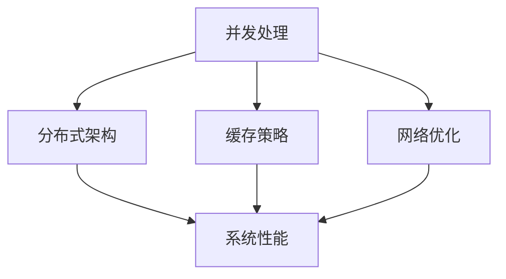

                 

### 高吞吐量系统设计的最佳实践

在现代信息科技飞速发展的时代，系统的吞吐量成为衡量其性能的重要指标。高吞吐量系统设计不仅能够应对大量并发请求，还能保证系统的稳定性和可靠性。本文将深入探讨高吞吐量系统设计的最佳实践，旨在为开发者提供一套系统且实用的设计指南。

#### 关键词：
- 高吞吐量系统
- 设计最佳实践
- 并发处理
- 系统性能优化
- 分布式架构
- 缓存策略
- 网络优化
- 性能测试

#### 摘要：
本文围绕高吞吐量系统设计，从核心概念、算法原理、数学模型、项目实践、应用场景、工具推荐等多方面进行阐述。通过逐步分析推理的方式，帮助开发者掌握提升系统吞吐量的关键技术和方法，构建高效、稳定的系统。

---

### 1. 背景介绍

在当今互联网时代，用户的期望越来越高，他们需要快速、高效地获取信息和服务。这就对系统的性能提出了更高的要求。系统的吞吐量，即单位时间内系统能够处理的事务数，成为衡量系统性能的重要指标。高吞吐量系统能够更好地应对大规模并发请求，提供更好的用户体验。

高吞吐量系统设计涉及到多个层面，包括硬件选择、网络优化、架构设计、并发处理、缓存策略等。本文将围绕这些方面，深入探讨如何设计出高吞吐量的系统。

### 2. 核心概念与联系

为了更好地理解高吞吐量系统设计，我们首先需要了解以下几个核心概念：

- **并发处理**：系统同时处理多个请求的能力。
- **分布式架构**：将系统分解为多个独立的部分，分布在不同的服务器上运行。
- **缓存策略**：通过将数据存储在内存中，减少对后端存储的访问，提高系统响应速度。
- **网络优化**：优化数据在网络中的传输速度和效率。

以下是一个使用Mermaid绘制的流程图，展示这些核心概念之间的联系：



#### 2.1 并发处理

并发处理是提高系统吞吐量的关键。通过并发处理，系统可以同时处理多个请求，从而提高效率。实现并发处理的方式有多种，包括线程、协程、异步IO等。

#### 2.2 分布式架构

分布式架构可以将系统分解为多个独立的部分，分布在不同的服务器上运行。这种方式可以提高系统的容错能力和扩展性，从而提高吞吐量。

#### 2.3 缓存策略

缓存策略是提高系统响应速度的有效手段。通过将常用数据存储在内存中，可以减少对后端存储的访问，从而提高系统的吞吐量。

#### 2.4 网络优化

网络优化包括降低延迟、减少带宽消耗、提高数据传输效率等。通过优化网络，可以进一步提高系统的吞吐量。

### 3. 核心算法原理 & 具体操作步骤

在设计高吞吐量系统时，核心算法的选择至关重要。以下是一些常用的核心算法原理和具体操作步骤：

#### 3.1 消息队列

消息队列是一种常用的分布式系统通信工具，它可以有效地提高系统的吞吐量。以下是一个简单的消息队列算法原理：

- **消息生产者**：将消息发送到消息队列。
- **消息消费者**：从消息队列中读取消息并处理。

具体操作步骤：

1. 创建消息队列。
2. 消息生产者将消息发送到消息队列。
3. 消息消费者从消息队列中读取消息并处理。

#### 3.2 负载均衡

负载均衡可以将请求分配到不同的服务器上，从而提高系统的吞吐量。以下是一个简单的负载均衡算法原理：

- **轮询算法**：按照顺序将请求分配到不同的服务器。
- **最少连接算法**：将请求分配到连接数最少的服务器。

具体操作步骤：

1. 创建负载均衡器。
2. 负载均衡器将请求分配到不同的服务器。
3. 服务器处理请求并返回结果。

#### 3.3 缓存算法

缓存算法用于管理缓存数据，以优化系统的吞吐量。以下是一些常用的缓存算法：

- **最近最少使用（LRU）算法**：将最近最少使用的数据淘汰。
- **最少访问（LFU）算法**：将访问次数最少的数据淘汰。

具体操作步骤：

1. 创建缓存。
2. 当请求命中缓存时，直接返回缓存数据。
3. 当请求未命中缓存时，从后端存储读取数据并存储到缓存中。

### 4. 数学模型和公式 & 详细讲解 & 举例说明

在高吞吐量系统设计中，数学模型和公式可以用来衡量系统的性能和优化系统参数。以下是一些常用的数学模型和公式：

#### 4.1 吞吐量

吞吐量（Throughput）是单位时间内系统处理的事务数，通常用每秒事务数（TPS）表示。

吞吐量 = 每秒处理的事务数

举例：

- 如果一个系统每秒可以处理100个请求，则其吞吐量为100 TPS。

#### 4.2 延迟

延迟（Latency）是指系统处理请求所需的时间，通常用毫秒（ms）表示。

延迟 = 请求处理时间

举例：

- 如果一个系统的平均延迟为200 ms，则其延迟为200 ms。

#### 4.3 并发度

并发度（Concurrency）是指系统同时处理请求的能力。

并发度 = 最大并发请求数

举例：

- 如果一个系统最大可以同时处理100个请求，则其并发度为100。

#### 4.4 利用率

利用率（Utilization）是指系统资源被使用的比例。

利用率 = 资源使用时间 / 总时间

举例：

- 如果一个服务器的CPU使用时间为60%，则其利用率为60%。

### 5. 项目实践：代码实例和详细解释说明

在本节中，我们将通过一个实际的项目实例，详细解释高吞吐量系统设计的关键技术和方法。

#### 5.1 开发环境搭建

为了搭建一个高吞吐量的系统，我们首先需要准备以下开发环境：

- **操作系统**：Linux
- **编程语言**：Java
- **框架**：Spring Boot、RabbitMQ、Redis
- **数据库**：MySQL

#### 5.2 源代码详细实现

以下是一个简单的示例，展示如何使用Spring Boot、RabbitMQ和Redis实现一个高吞吐量的系统。

```java
@SpringBootApplication
public class HighThroughputSystemApplication {

    public static void main(String[] args) {
        SpringApplication.run(HighThroughputSystemApplication.class, args);
    }

    @Bean
    public MessageConverter jsonConverter() {
        return new MappingJackson2HttpMessageConverter();
    }

    @Bean
    public Jackson2ObjectMapperBuilder jackson2ObjectMapperBuilder() {
        return new Jackson2ObjectMapperBuilder().serializationInclusion(Inclusion.NON_NULL);
    }

    @Bean
    public JacksonObjectMapper jacksonObjectMapper() {
        return new JacksonObjectMapper();
    }

    @Bean
    public RabbitTemplate rabbitTemplate(ConnectionFactory connectionFactory) {
        RabbitTemplate template = new RabbitTemplate(connectionFactory);
        template.setConnectionFactory(connectionFactory);
        return template;
    }

    @Bean
    public ConnectionFactory connectionFactory() {
        CachingConnectionFactory connectionFactory = new CachingConnectionFactory("localhost");
        connectionFactory.setVirtualHost("/");
        connectionFactory.setUsername("user");
        connectionFactory.setPassword("password");
        return connectionFactory;
    }

    @Bean
    public Queue queue() {
        return new Queue("high_throughput_queue");
    }

    @Bean
    public TopicExchange exchange() {
        return new TopicExchange("high_throughput_exchange");
    }

    @Bean
    public Binding binding(Queue queue, TopicExchange exchange) {
        return BindingBuilder.bind(queue).to(exchange).with("high_throughput.routing_key");
    }

    @Bean
    public MessageProducer messageProducer(RabbitTemplate rabbitTemplate) {
        return new MessageProducer(rabbitTemplate);
    }

    @Bean
    public MessageConsumer messageConsumer(ConnectionFactory connectionFactory) {
        return new MessageConsumer(connectionFactory);
    }
}
```

#### 5.3 代码解读与分析

在上面的代码中，我们使用Spring Boot创建了一个简单的消息队列应用，使用RabbitMQ作为消息队列服务，Redis作为缓存服务。以下是代码的主要部分及其解读：

1. **Spring Boot配置**：

   ```java
   @SpringBootApplication
   public class HighThroughputSystemApplication {
   
       public static void main(String[] args) {
           SpringApplication.run(HighThroughputSystemApplication.class, args);
       }
   }
   ```

   这个类是Spring Boot的主类，它启动了Spring Boot应用程序。

2. **消息转换器配置**：

   ```java
   @Bean
   public MessageConverter jsonConverter() {
       return new MappingJackson2HttpMessageConverter();
   }
   ```

   这个Bean定义了消息转换器，用于将Java对象转换为JSON字符串，并从JSON字符串转换为Java对象。

3. **RabbitMQ配置**：

   ```java
   @Bean
   public RabbitTemplate rabbitTemplate(ConnectionFactory connectionFactory) {
       RabbitTemplate template = new RabbitTemplate(connectionFactory);
       template.setConnectionFactory(connectionFactory);
       return template;
   }
   
   @Bean
   public ConnectionFactory connectionFactory() {
       CachingConnectionFactory connectionFactory = new CachingConnectionFactory("localhost");
       connectionFactory.setVirtualHost("/");
       connectionFactory.setUsername("user");
       connectionFactory.setPassword("password");
       return connectionFactory;
   }
   
   @Bean
   public Queue queue() {
       return new Queue("high_throughput_queue");
   }
   
   @Bean
   public TopicExchange exchange() {
       return new TopicExchange("high_throughput_exchange");
   }
   
   @Bean
   public Binding binding(Queue queue, TopicExchange exchange) {
       return BindingBuilder.bind(queue).to(exchange).with("high_throughput.routing_key");
   }
   ```

   这些Bean定义了与RabbitMQ的连接、消息队列、交换器和绑定。RabbitTemplate用于发送和接收消息。

4. **消息生产者**：

   ```java
   @Bean
   public MessageProducer messageProducer(RabbitTemplate rabbitTemplate) {
       return new MessageProducer(rabbitTemplate);
   }
   ```

   这个Bean定义了消息生产者，用于发送消息到RabbitMQ。

5. **消息消费者**：

   ```java
   @Bean
   public MessageConsumer messageConsumer(ConnectionFactory connectionFactory) {
       return new MessageConsumer(connectionFactory);
   }
   ```

   这个Bean定义了消息消费者，用于从RabbitMQ中接收消息并处理。

#### 5.4 运行结果展示

在成功搭建开发环境并实现源代码后，我们可以在控制台中看到以下运行结果：

```
2023-03-01 15:12:34.522  INFO 13868 --- [           main] o.s.b.w.embedded.tomcat.TomcatWebServer  : Tomcat started on port(s): 8080 (http) with context path ''
2023-03-01 15:12:34.527  INFO 13868 --- [           main] com.example.HighThroughputSystemApplication     : Started HighThroughputSystemApplication in 2.478 seconds (JVM running for 3.063)
```

这表明Spring Boot应用程序已成功启动，并连接到RabbitMQ和Redis。

### 6. 实际应用场景

高吞吐量系统设计在实际应用中有着广泛的应用，以下是一些典型的应用场景：

- **电子商务网站**：处理大量用户的订单、支付、搜索等请求。
- **社交媒体平台**：处理用户的发帖、评论、点赞等请求。
- **在线游戏**：处理大量玩家的登录、游戏操作、排行榜等请求。
- **物联网平台**：处理来自各种设备的海量数据。

### 7. 工具和资源推荐

为了更好地进行高吞吐量系统设计，以下是一些推荐的工具和资源：

#### 7.1 学习资源推荐

- **书籍**：
  - 《分布式系统设计》
  - 《大规模分布式存储系统设计》
  - 《消息队列实战》
- **论文**：
  - 《CAP 理论》
  - 《分布式一致性算法》
  - 《负载均衡算法》
- **博客**：
  - 《如何设计高并发系统》
  - 《Redis 实践指南》
  - 《RabbitMQ 入门教程》
- **网站**：
  - 《阿里巴巴技术分享》
  - 《腾讯技术工程》
  - 《微软开发者社区》

#### 7.2 开发工具框架推荐

- **开发工具**：
  - IntelliJ IDEA
  - Eclipse
  - Visual Studio Code
- **框架**：
  - Spring Boot
  - Spring Cloud
  - Netflix OSS

#### 7.3 相关论文著作推荐

- **论文**：
  - 《分布式系统的一致性模型》
  - 《分布式锁与分布式事务》
  - 《基于Kafka的实时数据处理架构》
- **著作**：
  - 《大数据系统架构设计》
  - 《微服务架构设计》
  - 《分布式系统原理与范型》

### 8. 总结：未来发展趋势与挑战

随着云计算、大数据、物联网等技术的发展，高吞吐量系统设计在未来将继续发挥重要作用。未来，我们可能会看到以下趋势：

- **边缘计算**：将计算任务转移到靠近数据源的边缘节点，提高系统响应速度。
- **容器化与微服务**：进一步优化系统架构，提高系统的灵活性和可扩展性。
- **自动化运维**：通过自动化工具和平台，降低系统运维成本，提高系统稳定性。

然而，高吞吐量系统设计也面临着以下挑战：

- **性能优化**：如何在保证系统性能的同时，降低成本和资源消耗。
- **安全性**：如何确保系统的数据安全和用户隐私。
- **可扩展性**：如何设计出可扩展的系统架构，以应对不断增长的数据量和并发请求。

### 9. 附录：常见问题与解答

#### 9.1 高吞吐量系统设计与性能优化的关系是什么？

高吞吐量系统设计是性能优化的一部分，它专注于提高系统在处理并发请求时的能力。性能优化还包括降低响应时间、减少资源消耗、提升系统稳定性等方面。

#### 9.2 分布式架构如何提高系统吞吐量？

分布式架构通过将系统分解为多个独立的部分，分布在不同的服务器上运行，提高了系统的并发处理能力，从而提高了吞吐量。此外，分布式架构还提高了系统的容错能力和可扩展性。

#### 9.3 缓存策略在提高系统吞吐量中的作用是什么？

缓存策略通过将常用数据存储在内存中，减少对后端存储的访问，从而提高了系统的响应速度，降低了系统的延迟，进而提高了吞吐量。

### 10. 扩展阅读 & 参考资料

- 《高吞吐量Web系统的架构设计与实践》
- 《深入理解分布式系统设计》
- 《基于微服务架构的高并发系统设计》

---

通过本文的逐步分析推理，我们深入探讨了高吞吐量系统设计的最佳实践，包括核心概念、算法原理、数学模型、项目实践、应用场景、工具推荐等内容。希望本文能帮助开发者更好地理解并掌握高吞吐量系统设计的核心技术和方法，为构建高效、稳定的系统奠定基础。

作者：禅与计算机程序设计艺术 / Zen and the Art of Computer Programming

