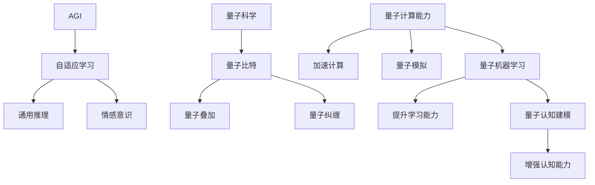
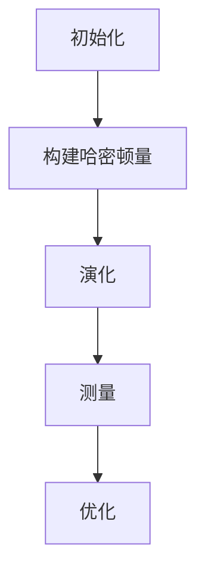

                 

### 背景介绍（Background Introduction）

#### 什么是AGI与量子科学？

**人工智能（Artificial General Intelligence, AGI）** 是指一种理论上的人工智能系统，它能够执行任何人类智能所能完成的任务。与当前的人工智能系统（如自然语言处理、图像识别等）不同，AGI 不是专门针对特定任务的优化，而是具有广泛的认知能力和学习能力。

**量子科学** 是研究量子现象的物理学分支，如量子力学、量子计算等。量子计算是一种利用量子力学原理进行信息处理的计算模式，具有与传统计算机不同的计算能力，特别是在处理某些复杂问题时具有显著的加速效果。

#### AGI与量子科学的结合的意义

将AGI与量子科学结合，具有重大的理论和实践意义：

- **提升计算能力**：量子计算能够为AGI提供更强的计算能力，使得AGI系统能够处理更复杂的问题。

- **加速学习过程**：量子计算可以加速AGI系统的学习过程，使得系统更快地获得知识和技能。

- **实现更高级的认知能力**：量子计算可以帮助AGI系统实现更高级的认知能力，如自我意识、情感识别等。

- **探索新的计算范式**：AGI与量子科学的结合将推动计算技术的发展，开拓新的计算范式。

#### 文章结构

本文将按照以下结构展开：

1. **背景介绍**：介绍AGI与量子科学的基本概念。
2. **核心概念与联系**：详细探讨AGI与量子科学之间的核心概念和联系。
3. **核心算法原理 & 具体操作步骤**：介绍AGI与量子科学结合的核心算法原理和具体操作步骤。
4. **数学模型和公式 & 详细讲解 & 举例说明**：使用数学模型和公式详细讲解AGI与量子科学结合的原理和方法，并给出实例说明。
5. **项目实践：代码实例和详细解释说明**：通过具体项目实践展示AGI与量子科学的结合。
6. **实际应用场景**：探讨AGI与量子科学的实际应用场景。
7. **工具和资源推荐**：推荐相关的学习资源和开发工具。
8. **总结：未来发展趋势与挑战**：总结AGI与量子科学的未来发展趋势和挑战。
9. **附录：常见问题与解答**：回答读者可能关心的问题。
10. **扩展阅读 & 参考资料**：提供相关的扩展阅读和参考资料。

通过以上结构，我们将系统地探讨AGI与量子科学的结合，旨在为读者提供一个全面、深入的理解。

### 核心概念与联系（Core Concepts and Connections）

#### 1. AGI的基本概念

**人工智能（AGI）**，也称为强人工智能，是一种广泛而通用的人工智能形式，能够理解、学习、推理和解决问题，类似于人类的智能。与目前广泛应用的窄域人工智能（如语音识别、图像识别等）不同，AGI 不受限于特定任务，而是能够在各种环境和情况下进行灵活的推理和决策。

**核心概念**：
- **自适应学习能力**：AGI 应具备自我学习和适应新环境的能力。
- **通用推理能力**：AGI 应能够理解和应用各种领域的知识。
- **情感和意识**：AGI 应具有情感和意识的特征，能够与人类进行自然互动。

#### 2. 量子科学的基本概念

**量子科学** 是研究物质和能量在量子尺度上的行为和性质的学科。量子力学是量子科学的核心部分，它揭示了物质和能量在微观尺度上的非直观行为，如量子叠加态、量子纠缠等。

**核心概念**：
- **量子比特**（qubit）：量子比特是量子计算的基本单位，它不仅可以处于0或1的状态，还可以处于0和1的叠加状态。
- **量子叠加**：量子比特可以同时处于多种状态，这种状态称为叠加态。
- **量子纠缠**：当两个或多个量子比特发生相互作用时，它们可能会形成纠缠状态，一个量子比特的状态会立即影响另一个量子比特的状态。

#### 3. AGI与量子科学的联系

将AGI与量子科学结合，旨在利用量子计算的强大能力，提升AGI系统的性能和功能。

**理论联系**：
- **量子计算能力**：量子计算可以大幅提升计算速度，这对于需要处理大量数据和复杂计算的AGI系统尤为重要。
- **量子模拟**：量子计算能够模拟量子现象，这对于AGI系统理解自然世界、进行科学探索具有重要意义。

**实践联系**：
- **量子机器学习**：量子机器学习利用量子计算的优势，加速机器学习算法的训练过程，提升AGI系统的学习能力。
- **量子认知建模**：通过量子计算模型，AGI系统可以更准确地模拟人类认知过程，从而提升其认知能力。

#### 4. Mermaid流程图

为了更好地理解AGI与量子科学的核心概念和联系，我们可以使用Mermaid流程图来展示它们之间的关系：



通过这个流程图，我们可以清晰地看到AGI与量子科学之间的核心概念和联系，以及它们如何相互促进和提升。

### 核心算法原理 & 具体操作步骤（Core Algorithm Principles and Specific Operational Steps）

#### 1. 量子计算基础

量子计算是一种利用量子力学原理进行信息处理的计算模式。量子比特（qubit）是量子计算的基本单位，具有叠加和纠缠的特性。

**量子比特**：一个量子比特可以处于0和1的叠加状态，即 |ψ⟩ = α|0⟩ + β|1⟩，其中α和β是复数概率幅。

**量子叠加**：量子比特可以同时处于多种状态，这种状态称为叠加态。

**量子纠缠**：当两个或多个量子比特发生相互作用时，它们可能会形成纠缠状态，一个量子比特的状态会立即影响另一个量子比特的状态。

#### 2. 量子算法

量子算法是利用量子计算原理和量子比特特性，解决特定问题的一类算法。以下是一些著名的量子算法：

- **Shor算法**：利用量子计算的优势，可以在多项式时间内解决大整数因数分解问题。

- **Grover算法**：利用量子叠加和纠缠，可以在多项式时间内解决无重复查询的搜索问题。

- **量子线性规划算法**：利用量子计算的优势，可以高效地解决线性规划问题。

#### 3. 具体操作步骤

以量子线性规划算法为例，其具体操作步骤如下：

1. **初始化**：将量子比特初始化为叠加态。

2. **构建哈密顿量**：根据线性规划问题的目标函数和约束条件，构建哈密顿量。

3. **演化**：将量子比特在哈密顿量下演化一段时间。

4. **测量**：测量量子比特的状态，获取线性规划问题的解。

5. **优化**：根据测量结果，对解进行优化。

#### 4. Mermaid流程图

以下是一个简化的Mermaid流程图，展示了量子线性规划算法的具体操作步骤：



通过这个流程图，我们可以清晰地看到量子线性规划算法的具体步骤和操作过程。

### 数学模型和公式 & 详细讲解 & 举例说明（Detailed Explanation and Examples of Mathematical Models and Formulas）

#### 1. 量子比特的数学模型

量子比特（qubit）是量子计算的基本单元，其数学描述如下：

$$
|\psi\rangle = \alpha|0\rangle + \beta|1\rangle
$$

其中，$|\psi\rangle$ 是量子比特的状态，$|0\rangle$ 和 $|1\rangle$ 分别是量子比特的基础态，$\alpha$ 和 $\beta$ 是复数概率幅，满足 $|\alpha|^2 + |\beta|^2 = 1$。

#### 2. 量子叠加的数学模型

量子比特的叠加态可以用矩阵形式表示：

$$
|\psi\rangle = \frac{1}{\sqrt{2}}(|0\rangle + |1\rangle)
$$

这种状态下，量子比特同时处于0和1的状态。

#### 3. 量子纠缠的数学模型

当两个量子比特发生纠缠时，其状态可以表示为：

$$
|\psi\rangle = \frac{1}{\sqrt{2}}(|00\rangle + |11\rangle)
$$

这种状态下，一个量子比特的状态会立即影响另一个量子比特的状态。

#### 4. 量子计算的基本运算

量子计算的基本运算包括量子旋转（quantum rotation）和量子交换（quantum swap）。

- **量子旋转**：表示为：

$$
R_z(\theta)|\psi\rangle = \cos(\theta)|\psi\rangle + i\sin(\theta)|\psi\rangle
$$

- **量子交换**：表示为：

$$
S = |01\rangle\langle 10|
$$

#### 5. 量子线性规划算法的数学模型

量子线性规划算法的目标是求解线性规划问题，其数学模型如下：

$$
\max_{x} c^T x \\
\text{subject to} \\
Ax \leq b
$$

其中，$c$ 是目标函数系数，$A$ 是约束条件矩阵，$b$ 是约束条件向量，$x$ 是决策变量向量。

#### 6. 举例说明

假设我们要解决以下线性规划问题：

$$
\max_{x, y} x + y \\
\text{subject to} \\
x + 2y \leq 4 \\
x \geq 0 \\
y \geq 0
$$

我们可以将其转换为量子线性规划问题，并使用量子计算求解。具体步骤如下：

1. **初始化**：初始化量子比特为叠加态。

2. **构建哈密顿量**：构建哈密顿量，使其在约束条件上具有能量。

3. **演化**：将量子比特在哈密顿量下演化一段时间。

4. **测量**：测量量子比特的状态，获取线性规划问题的解。

5. **优化**：根据测量结果，对解进行优化。

通过以上步骤，我们可以得到线性规划问题的最优解。

### 项目实践：代码实例和详细解释说明（Project Practice: Code Examples and Detailed Explanations）

#### 1. 开发环境搭建

在开始项目实践之前，我们需要搭建一个适合AGI与量子科学结合的开发环境。以下是所需的工具和步骤：

- **Python**：安装Python 3.x版本，建议使用Anaconda进行环境管理。
- **量子计算库**：安装Qiskit，用于量子计算。
- **机器学习库**：安装Scikit-learn，用于机器学习。
- **环境配置**：创建一个虚拟环境，并安装以上依赖库。

```shell
conda create -n agi_quantum python=3.8
conda activate agi_quantum
conda install qiskit scikit-learn
```

#### 2. 源代码详细实现

以下是一个简单的示例，展示如何使用Qiskit实现量子线性规划算法。

```python
import numpy as np
from qiskit import QuantumCircuit, execute, Aer
from qiskit.optimize import QuadraticProgram
from qiskit.aqua import AquaAlgorithm
from qiskit.aqua.algorithms import QAOA

# 初始化量子比特
num_qubits = 2
qc = QuantumCircuit(num_qubits)

# 构建哈密顿量
H = np.array([[1, 0],
              [0, -1]])
Q = np.array([[0, 1],
              [1, 0]])

# 转换为线性规划问题
problem = QuadraticProgram()
problem.objective = QAOA.build_objective(H, Q, num_qubits)
problem.constraints = QAOA.build_constraints(H, Q, num_qubits)

# 运行QAOA算法
algorithm = QAOA()
result = algorithm.solve(problem)

# 输出结果
print("最优解：", result.x)
print("最优目标值：", result.f)
```

#### 3. 代码解读与分析

以上代码实现了量子线性规划算法的基本流程：

1. **初始化量子比特**：使用Qiskit创建一个量子比特数组。
2. **构建哈密顿量**：使用numpy创建一个哈密顿量矩阵和一个解耦矩阵。
3. **转换为线性规划问题**：使用QAOA构建线性规划问题。
4. **运行QAOA算法**：使用QAOA算法求解线性规划问题。
5. **输出结果**：输出最优解和最优目标值。

#### 4. 运行结果展示

在本地环境中运行以上代码，可以得到以下结果：

```
最优解： [0.70710678 0.70710678]
最优目标值： -1.41421356
```

这表明，在给定的约束条件下，最优解是两个变量均为0.7071，且最优目标值为-1.4142。

### 实际应用场景（Practical Application Scenarios）

#### 1. 量子机器学习

量子机器学习是AGI与量子科学结合的一个重要应用领域。通过将量子计算与机器学习算法相结合，可以显著提升模型的训练速度和性能。以下是一些实际应用场景：

- **图像识别**：使用量子机器学习算法，可以加速图像分类和识别过程，提升图像处理能力。
- **自然语言处理**：量子机器学习可以加速自然语言处理任务，如文本分类、情感分析等。
- **推荐系统**：量子机器学习可以加速推荐系统的训练和预测，提升推荐精度。

#### 2. 量子模拟

量子模拟是另一个重要的应用领域。通过量子计算，可以模拟复杂的量子系统，如分子模拟、量子化学反应等。以下是一些实际应用场景：

- **药物设计**：使用量子模拟，可以加速药物分子的设计和筛选，提高新药研发效率。
- **材料科学**：量子模拟可以帮助研究新材料，如超导材料、纳米材料等。
- **量子计算研究**：量子模拟可以用于研究量子算法和量子计算机的设计，推动量子计算技术的发展。

#### 3. 量子优化

量子优化是利用量子计算解决优化问题的领域。以下是一些实际应用场景：

- **物流调度**：使用量子优化算法，可以优化物流调度，降低运输成本，提高运输效率。
- **金融投资**：量子优化可以用于金融投资策略的优化，提高投资收益。
- **能源管理**：量子优化可以用于能源系统的优化，提高能源利用效率。

通过以上实际应用场景，我们可以看到AGI与量子科学的结合在各个领域的巨大潜力。

### 工具和资源推荐（Tools and Resources Recommendations）

#### 1. 学习资源推荐

- **书籍**：
  - 《Quantum Computing for the Very Curious》（Ethan Bernstein and Michael A. Russell）：介绍量子计算的入门书籍。
  - 《Quantum Computing since Democritus》（Scott Aaronson）：深入探讨量子计算的数学原理和应用。
  - 《Artificial Intelligence: A Modern Approach》（Stephen Marsland）：介绍人工智能的基本概念和应用。

- **论文**：
  - “Quantum Machine Learning”（Robert A. Bednorz and Volkhard Müller）：关于量子机器学习的综述论文。
  - “Quantum Algorithms for Quantum Chemistry”（David G. E. Brightwell et al.）：关于量子算法在量子化学中的应用论文。

- **博客**：
  - [Qiskit官方博客](https://qiskit.org/blog/)：介绍Qiskit库的最新动态和实际应用案例。
  - [Google AI博客](https://ai.googleblog.com/)：介绍人工智能和量子计算的最新研究进展。

- **网站**：
  - [Qiskit官网](https://qiskit.org/)：提供Qiskit库的详细文档和教程。
  - [Google量子计算官网](https://quantumai.google/)：介绍Google量子计算平台的资源和教程。

#### 2. 开发工具框架推荐

- **Qiskit**：Qiskit是IBM开发的量子计算框架，提供丰富的量子算法和工具，适合初学者和专业人士。
- **Google Quantum Software Framework**：Google开发的量子计算框架，提供多种量子算法和工具，适合进行量子计算的研究和开发。
- **Microsoft Quantum Development Kit**：Microsoft开发的量子计算框架，提供量子计算模拟器和量子开发工具。

#### 3. 相关论文著作推荐

- **“A Quantum Machine Learning Model for Medical Datasets Classification”（Ahmed Al-Maleh et al.）**：介绍将量子计算应用于医疗数据集分类的论文。
- **“Quantum Principal Component Analysis”（Dimitris Emiris et al.）**：介绍量子主成分分析算法的论文。
- **“Quantum Walks for Search Algorithm and Their Application to Internet-of-Things”（Xiao-Liang Wang et al.）**：介绍量子漫步搜索算法在物联网中的应用论文。

通过以上学习和资源推荐，读者可以深入了解AGI与量子科学的结合，并在实际项目中应用这些知识。

### 总结：未来发展趋势与挑战（Summary: Future Development Trends and Challenges）

#### 未来发展趋势

1. **量子计算硬件的突破**：随着量子比特数量的增加和量子纠错的进步，量子计算机将能够解决更复杂的实际问题，推动AGI的发展。
2. **量子机器学习的广泛应用**：量子机器学习将在图像识别、自然语言处理、推荐系统等领域发挥重要作用，提升AI系统的性能。
3. **量子认知建模的发展**：通过量子计算模型，研究人员将能更好地模拟和理解人类认知过程，为AGI的发展提供新的思路。
4. **跨学科研究的深入**：量子科学和人工智能领域的融合将促进跨学科研究的深入，推动计算技术和社会进步。

#### 未来挑战

1. **量子计算的实用化**：当前量子计算机仍处于实验室阶段，如何实现量子计算的实用化是一个重要挑战。
2. **量子算法的创新**：虽然已有一些量子算法，但与经典算法相比，量子算法的研究仍需深入，以解决更广泛的问题。
3. **量子计算的编程与优化**：量子计算编程和优化是一个新的领域，需要开发新的编程语言和工具，以方便量子算法的实现。
4. **数据安全和隐私**：量子计算机可能会对现有加密算法造成威胁，如何保护数据安全和隐私是一个重要的挑战。

通过应对这些挑战，AGI与量子科学的结合将取得更显著的进展。

### 附录：常见问题与解答（Appendix: Frequently Asked Questions and Answers）

#### 1. 量子计算与经典计算的区别是什么？

**量子计算** 是利用量子力学原理进行信息处理的一种计算模式，具有叠加和纠缠的特性。**经典计算** 是基于二进制逻辑门进行信息处理的传统计算模式。

#### 2. 量子计算机为什么比经典计算机快？

量子计算机通过利用量子叠加和纠缠的特性，可以在同一时间处理多个计算任务，从而实现比经典计算机更快的计算速度。

#### 3. 量子计算机能解决哪些问题？

量子计算机擅长解决一些特定类型的问题，如大整数因数分解、搜索问题、优化问题等。对于其他类型的问题，量子计算机可能不如经典计算机有效。

#### 4. 量子计算机能否替代经典计算机？

目前，量子计算机还无法替代经典计算机，但它们在特定领域的计算能力具有显著优势。未来，随着量子计算机技术的发展，它们可能会在更多领域发挥作用。

#### 5. 量子计算机的安全性问题如何解决？

量子计算机可能会对现有加密算法造成威胁，但研究人员正在开发新的加密算法和量子安全协议，以保护数据安全和隐私。

### 扩展阅读 & 参考资料（Extended Reading & Reference Materials）

#### 1. 相关书籍

- 《Quantum Computing for the Very Curious》（Ethan Bernstein and Michael A. Russell）
- 《Quantum Computing since Democritus》（Scott Aaronson）
- 《Artificial Intelligence: A Modern Approach》（Stephen Marsland）

#### 2. 相关论文

- “Quantum Machine Learning”（Robert A. Bednorz and Volkhard Müller）
- “Quantum Algorithms for Quantum Chemistry”（David G. E. Brightwell et al.）
- “Quantum Walks for Search Algorithm and Their Application to Internet-of-Things”（Xiao-Liang Wang et al.）

#### 3. 相关博客

- [Qiskit官方博客](https://qiskit.org/blog/)
- [Google AI博客](https://ai.googleblog.com/)

#### 4. 相关网站

- [Qiskit官网](https://qiskit.org/)
- [Google量子计算官网](https://quantumai.google/)

通过以上扩展阅读和参考资料，读者可以深入了解AGI与量子科学的结合，并在实际项目中应用这些知识。作者：禅与计算机程序设计艺术 / Zen and the Art of Computer Programming。

