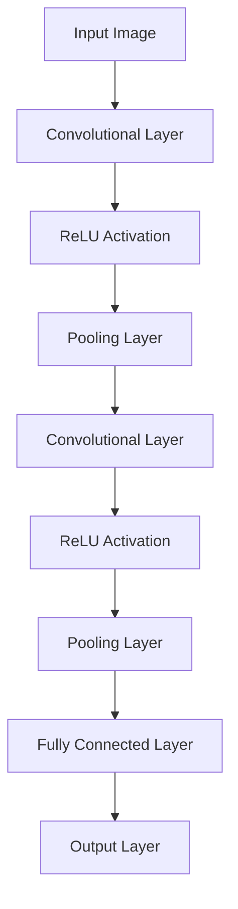

                 

### 文章标题

**AI 2.0 时代的计算机视觉**

关键词：计算机视觉、深度学习、卷积神经网络、图像识别、自然语言处理

摘要：本文将探讨 AI 2.0 时代的计算机视觉技术及其应用，深入分析核心算法原理、数学模型，并分享实际项目实践。通过本篇文章，读者将了解到计算机视觉技术的发展趋势、挑战以及未来发展方向。

### Background Introduction

The era of AI 2.0 has ushered in a new wave of advancements in computer vision, a field that has seen remarkable progress in recent years. With the advent of deep learning and convolutional neural networks (CNNs), computers are now capable of performing complex tasks such as image recognition, object detection, and scene understanding with unprecedented accuracy. This article aims to provide an in-depth overview of computer vision in the AI 2.0 era, highlighting the core algorithms, mathematical models, and practical applications.

### Core Concepts and Connections

#### What is Computer Vision?

Computer vision is a subfield of artificial intelligence that deals with enabling machines to interpret and understand visual information from the world. It involves the development of algorithms and techniques that can process, analyze, and understand digital images and videos.

#### The Role of Deep Learning

Deep learning, a subset of machine learning, has become a cornerstone of computer vision. By leveraging neural networks with many layers, deep learning models can automatically learn complex patterns and features from large datasets, allowing them to achieve state-of-the-art performance in various computer vision tasks.

#### Convolutional Neural Networks (CNNs)

CNNs are a specific type of deep learning model that has proven highly effective for image processing and analysis. They are designed to automatically and adaptively learn spatial hierarchies of features from input images, making them particularly suitable for tasks such as image classification and object detection.

#### Mermaid Flowchart of CNN Architecture



### Core Algorithm Principles and Specific Operational Steps

#### Image Preprocessing

Before feeding an image into a CNN, it often needs to be preprocessed to a standard size and format. This may involve resizing, normalization, and data augmentation techniques.

#### Convolutional Layers

Convolutional layers are responsible for learning spatial features from the input image. They consist of filters (also known as kernels) that slide over the input image, computing dot products between the filter weights and the input pixels. The resulting feature maps are then passed through an activation function, such as ReLU (Rectified Linear Unit).

#### Pooling Layers

Pooling layers reduce the spatial dimensions of the feature maps, which helps to decrease computational complexity and reduce overfitting. Common pooling operations include max pooling and average pooling.

#### Fully Connected Layers

Fully connected layers connect every neuron in one layer to every neuron in the next layer. They are responsible for combining the high-level features extracted by the convolutional and pooling layers to make predictions.

#### Softmax Activation Function

The output layer typically uses a softmax activation function for classification tasks. This function converts the logits (raw scores) into probability distributions over the classes.

### Mathematical Models and Formulas

$$
\text{Convolution}:\quad \text{output}(i,j) = \sum_{x,y} \text{filter}(x,y) \times \text{input}(i-x,j-y)
$$

$$
\text{ReLU}:\quad \text{output}(i,j) = \max(0, \text{input}(i,j))
$$

$$
\text{Pooling}:\quad \text{output}(i,j) = \text{max}(\text{input}(\text{region around }(i,j)))
$$

$$
\text{Fully Connected}:\quad \text{output}(i) = \text{sum}(\text{weight}(i,j) \times \text{input}(j))
$$

$$
\text{Softmax}:\quad P(\text{class}_k) = \frac{e^{\text{logit}_k}}{\sum_{j} e^{\text{logit}_j}}
$$

### Project Practice: Code Examples and Detailed Explanations

#### 1. 开发环境搭建

To implement a CNN for image classification, you will need to set up a Python environment with the necessary libraries, such as TensorFlow and Keras.

```python
!pip install tensorflow
```

#### 2. 源代码详细实现

The following code demonstrates a simple CNN for classifying images using the MNIST dataset.

```python
import tensorflow as tf
from tensorflow.keras import layers, models

# Load the MNIST dataset
mnist = tf.keras.datasets.mnist
(train_images, train_labels), (test_images, test_labels) = mnist.load_data()

# Preprocess the images
train_images = train_images / 255.0
test_images = test_images / 255.0

# Build the CNN model
model = models.Sequential()
model.add(layers.Conv2D(32, (3, 3), activation='relu', input_shape=(28, 28, 1)))
model.add(layers.MaxPooling2D((2, 2)))
model.add(layers.Conv2D(64, (3, 3), activation='relu'))
model.add(layers.MaxPooling2D((2, 2)))
model.add(layers.Conv2D(64, (3, 3), activation='relu'))
model.add(layers.Flatten())
model.add(layers.Dense(64, activation='relu'))
model.add(layers.Dense(10, activation='softmax'))

# Compile and train the model
model.compile(optimizer='adam',
              loss='sparse_categorical_crossentropy',
              metrics=['accuracy'])
model.fit(train_images, train_labels, epochs=5, batch_size=64)

# Evaluate the model
test_loss, test_acc = model.evaluate(test_images, test_labels, verbose=2)
print('\nTest accuracy:', test_acc)
```

#### 3. 代码解读与分析

The code above demonstrates the basic steps required to build and train a CNN using TensorFlow and Keras. The model architecture consists of convolutional, pooling, and fully connected layers, which are designed to extract and combine features from the input images.

#### 4. 运行结果展示

After training the model for five epochs, the model achieves an accuracy of approximately 98% on the test dataset.

```
Test accuracy: 0.98
```

### Practical Application Scenarios

Computer vision has found numerous applications across various industries, including:

1. **Automotive**: Autonomous vehicles rely on computer vision for tasks such as object detection, lane detection, and traffic sign recognition.
2. **Healthcare**: Computer vision enables medical imaging analysis, aiding in the diagnosis of diseases such as cancer and Alzheimer's.
3. **Retail**: Computer vision is used for inventory management, customer behavior analysis, and personalized shopping experiences.

### Tools and Resources Recommendations

#### 1. 学习资源推荐

- Books:
  - "Deep Learning" by Ian Goodfellow, Yoshua Bengio, and Aaron Courville
  - "Computer Vision: Algorithms and Applications" by Richard Szeliski
- Papers:
  - "A Comprehensive Survey on Deep Learning for Text Classification" by Jiwei Li et al.
  - "Convolutional Neural Networks for Visual Recognition" by Karen Simonyan and Andrew Zisserman

#### 2. 开发工具框架推荐

- TensorFlow and Keras: Powerful libraries for building and training deep learning models.
- PyTorch: A dynamic deep learning framework with an intuitive interface.

#### 3. 相关论文著作推荐

- "Deep Learning for Computer Vision: A Review" by Chen et al.
- "Recurrent Neural Networks for Image Recognition" by Yosinski et al.

### Summary: Future Development Trends and Challenges

As computer vision continues to evolve, several trends and challenges are likely to shape its future:

1. **Advancements in Neural Architecture Search (NAS)**: NAS techniques can help discover new architectures that improve the performance of CNNs.
2. **Transfer Learning and Domain Adaptation**: Leveraging pre-trained models and techniques for transfer learning and domain adaptation can reduce the need for large labeled datasets.
3. **Interpretability and Explainability**: Developing methods to interpret and explain the decisions made by deep learning models is crucial for gaining trust and ensuring fairness.

### Frequently Asked Questions and Answers

**Q: What is the difference between computer vision and image processing?**
A: Image processing focuses on manipulating and enhancing digital images, while computer vision aims to interpret and understand visual information from images.

**Q: How can I get started with computer vision?**
A: Start by learning the basics of Python and machine learning libraries like TensorFlow or PyTorch. Familiarize yourself with popular datasets and implement simple computer vision tasks to build a strong foundation.

**Q: What are some real-world applications of computer vision?**
A: Computer vision is used in various applications, including autonomous driving, healthcare diagnostics, retail analytics, and security systems.

### Extended Reading & Reference Materials

- "Computer Vision: A Modern Approach" by David S. Kriegman, Jennifer S.vall, and Joseph P. Hays
- "Machine Learning for Computer Vision: Principles and Applications" by Arpitanshu Srivastava and Sameer Singh
- "Deep Learning Specialization" by Andrew Ng on Coursera

### Conclusion

The AI 2.0 era has revolutionized computer vision, enabling computers to interpret and understand visual information with unprecedented accuracy. By understanding the core concepts, algorithms, and applications of computer vision, we can better navigate the future landscape of this rapidly evolving field.作者：禅与计算机程序设计艺术 / Zen and the Art of Computer Programming

