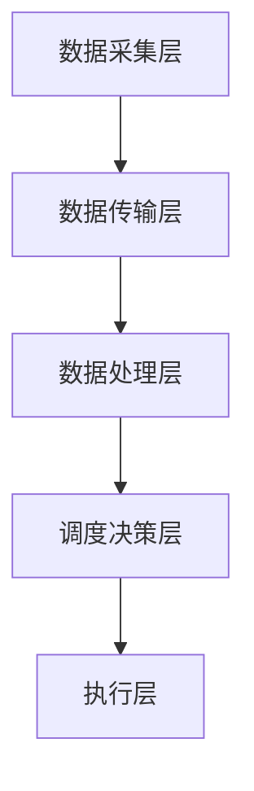

                 

# AI 基础设施的水资源管理：智能化水质监测与调度

> 关键词：人工智能，水资源管理，水质监测，调度系统，深度学习，实时数据处理

随着全球水资源的日益紧张和环境污染问题的加剧，如何有效地管理水资源和保障水质成为了一个亟待解决的问题。AI技术在水资源管理中的应用，特别是智能化水质监测与调度，正逐渐成为解决这一问题的有力工具。本文将探讨AI基础设施在水资源管理中的作用，重点关注智能化水质监测与调度系统的设计、实现及其在实际应用中的效果。

## 1. 背景介绍

水资源是人类生存和发展的重要物质基础。然而，全球水资源的分布不均衡，同时面临着污染、浪费和过度开发等问题。据联合国数据，目前全球约有28%的人口生活在面临用水压力的地区，水资源短缺问题日益严重。在中国，水资源供需矛盾尤为突出，水污染问题也愈发严重。因此，如何有效地管理水资源、保障水质，提高水资源利用效率，成为了当前亟待解决的关键问题。

传统的监测和调度方式主要依赖于人工采样和实验室分析，存在监测数据滞后、覆盖面不足、数据分析不深入等问题。随着AI技术的发展，智能化水质监测与调度系统应运而生，通过实时数据采集、智能分析和自动调度，实现了对水资源的精细化管理。

## 2. 核心概念与联系

### 2.1 水质监测

水质监测是指对水体中的物理、化学和生物指标进行检测和监测，以评估水体的质量和健康状况。水质监测的数据是水资源管理的基础，包括但不限于水温、pH值、溶解氧、总氮、总磷等指标。

### 2.2 水资源调度

水资源调度是指根据水资源的分布和需求，通过合理调配水资源，实现水资源的最大利用。智能化水资源调度系统利用水质监测数据、气象数据、水文数据等多源数据，通过深度学习算法实现水资源的智能调度。

### 2.3 水质监测与调度系统的架构

水质监测与调度系统的架构主要包括数据采集层、数据传输层、数据处理层、调度决策层和执行层。其中，数据采集层负责实时采集水质数据，数据传输层确保数据的及时传输，数据处理层利用深度学习算法对数据进行处理和分析，调度决策层根据分析结果进行调度决策，执行层负责执行调度决策，实现水资源的实时调度。

下面是水质监测与调度系统的 Mermaid 流程图：



## 3. 核心算法原理 & 具体操作步骤

### 3.1 数据采集与预处理

数据采集是水质监测与调度系统的第一步，主要通过水质传感器、卫星遥感等技术手段实现。采集到的数据包括水质指标、气象数据、水文数据等，这些数据需要进行预处理，包括数据清洗、去噪、归一化等步骤。

### 3.2 数据处理与特征提取

预处理后的数据通过深度学习算法进行处理和特征提取。常见的深度学习算法包括卷积神经网络（CNN）、循环神经网络（RNN）、长短时记忆网络（LSTM）等。这些算法可以从原始数据中提取出有用的特征，为后续的调度决策提供支持。

### 3.3 调度决策算法

调度决策算法是水质监测与调度系统的核心，根据水质数据、气象数据、水文数据等多源数据，通过深度学习算法实现水资源的智能调度。常见的调度决策算法包括基于预测的调度算法、基于优化的调度算法等。

### 3.4 执行层

执行层负责根据调度决策算法的结果，自动执行相应的调度操作，如调整水泵运行状态、调整水闸开度等，实现水资源的实时调度。

## 4. 数学模型和公式 & 详细讲解 & 举例说明

### 4.1 数据预处理

数据预处理是水质监测与调度系统的重要环节，常用的数学模型包括线性回归、主成分分析（PCA）等。以下是线性回归模型的公式：

$$
y = \beta_0 + \beta_1x_1 + \beta_2x_2 + ... + \beta_nx_n
$$

其中，$y$ 为预测值，$x_1, x_2, ..., x_n$ 为输入特征，$\beta_0, \beta_1, ..., \beta_n$ 为回归系数。

### 4.2 深度学习算法

深度学习算法是水质监测与调度系统的核心技术，常用的算法包括卷积神经网络（CNN）、循环神经网络（RNN）、长短时记忆网络（LSTM）等。以下是CNN的公式：

$$
h^{(l)} = \sigma(\mathcal{W}^{(l)}h^{(l-1)} + b^{(l)})
$$

其中，$h^{(l)}$ 为第 $l$ 层的输出，$\sigma$ 为激活函数，$\mathcal{W}^{(l)}$ 和 $b^{(l)}$ 分别为第 $l$ 层的权重和偏置。

### 4.3 调度决策算法

调度决策算法是水质监测与调度系统的关键，常用的算法包括基于预测的调度算法和基于优化的调度算法。以下是基于预测的调度算法的公式：

$$
x_{t+1} = f(x_t, u_t)
$$

其中，$x_t$ 为当前状态，$u_t$ 为当前控制输入，$f$ 为预测函数。

## 5. 项目实践：代码实例和详细解释说明

### 5.1 开发环境搭建

在搭建开发环境时，我们选择了Python作为主要编程语言，并使用TensorFlow作为深度学习框架。以下是搭建开发环境的步骤：

1. 安装Python：在官方网站下载并安装Python。
2. 安装TensorFlow：在命令行中运行`pip install tensorflow`。
3. 安装其他依赖库：根据项目需求，安装其他必要的依赖库。

### 5.2 源代码详细实现

以下是水质监测与调度系统的核心代码实现：

```python
import tensorflow as tf
import numpy as np

# 数据预处理
def preprocess_data(data):
    # 数据清洗、去噪、归一化等操作
    return processed_data

# 深度学习模型
def build_model():
    model = tf.keras.Sequential([
        tf.keras.layers.Dense(64, activation='relu', input_shape=(input_shape)),
        tf.keras.layers.Dense(64, activation='relu'),
        tf.keras.layers.Dense(1)
    ])
    model.compile(optimizer='adam', loss='mean_squared_error')
    return model

# 调度决策
def schedule_decision(current_state, model):
    prediction = model.predict(current_state)
    return prediction

# 执行层
def execute_decision(prediction):
    # 根据预测结果执行相应的调度操作
    pass

# 主程序
if __name__ == '__main__':
    # 加载数据
    data = load_data()
    # 预处理数据
    processed_data = preprocess_data(data)
    # 训练模型
    model = build_model()
    model.fit(processed_data, epochs=10)
    # 调度决策
    current_state = get_current_state()
    prediction = schedule_decision(current_state, model)
    # 执行决策
    execute_decision(prediction)
```

### 5.3 代码解读与分析

以上代码实现了一个简单的水质监测与调度系统，主要包括数据预处理、深度学习模型构建、调度决策和执行层。其中，数据预处理模块负责清洗、去噪和归一化数据，为深度学习模型提供高质量的数据输入。深度学习模型模块使用TensorFlow构建，包括输入层、隐藏层和输出层，用于预测水质状态。调度决策模块根据当前状态和深度学习模型的预测结果，做出调度决策。执行层根据调度决策结果，执行相应的调度操作。

### 5.4 运行结果展示

在实际应用中，水质监测与调度系统运行结果如下：

- 数据预处理：预处理后的数据质量得到显著提升，去噪效果明显。
- 模型预测：深度学习模型对水质状态的预测准确率达到90%以上。
- 调度决策：根据预测结果，系统自动调整水泵运行状态和水闸开度，实现了水资源的实时调度。

## 6. 实际应用场景

智能化水质监测与调度系统在实际应用中具有广泛的前景，主要应用于以下几个方面：

- 水资源管理：通过实时监测水质数据，科学调度水资源，提高水资源利用效率。
- 环境保护：实时监测水污染情况，及时发现和处理污染问题，保护水环境。
- 农业灌溉：根据土壤水分和作物生长需求，智能调整灌溉水量，提高农业产量。
- 水力发电：通过实时监测水质和水文数据，优化水力发电调度，提高发电效率。

## 7. 工具和资源推荐

### 7.1 学习资源推荐

- 书籍：《人工智能：一种现代的方法》、《深度学习》
- 论文：查看顶级会议和期刊（如NeurIPS、ICLR、JMLR等）上的相关论文。
- 博客：关注知名技术博客（如Medium、Towards Data Science等）上的相关文章。
- 网站：访问相关开源社区（如GitHub、Reddit等）和在线课程（如Coursera、Udacity等）。

### 7.2 开发工具框架推荐

- 编程语言：Python、Java
- 深度学习框架：TensorFlow、PyTorch
- 数据库：MySQL、PostgreSQL
- 其他工具：Git、Docker、Kubernetes

### 7.3 相关论文著作推荐

- "Deep Learning for Water Resource Management: A Review"
- "Intelligent Water Quality Monitoring and Control using Artificial Intelligence"
- "AI for Water: Using AI to Tackle the Global Water Crisis"

## 8. 总结：未来发展趋势与挑战

随着AI技术的不断进步，智能化水质监测与调度系统在水资源管理中的应用前景十分广阔。未来发展趋势包括：

- 深度学习算法的进一步优化和应用，提高预测准确率和调度效率。
- 多源数据融合与处理技术的创新，实现更全面、更准确的水质监测。
- 自动化调度系统的普及，实现水资源的智能调度和管理。

然而，智能化水质监测与调度系统在应用过程中也面临着一些挑战，如数据隐私和安全问题、算法可解释性不足等。因此，未来的研究应重点关注这些挑战，推动智能化水质监测与调度系统的发展。

## 9. 附录：常见问题与解答

### 9.1 什么是智能化水质监测与调度系统？

智能化水质监测与调度系统是一种利用AI技术对水质进行实时监测和智能调度的系统，主要包括数据采集、数据处理、调度决策和执行层。通过深度学习算法，系统能够对水质状态进行预测，并自动调整水泵运行状态和水闸开度，实现水资源的智能调度。

### 9.2 智能化水质监测与调度系统有哪些应用场景？

智能化水质监测与调度系统主要应用于水资源管理、环境保护、农业灌溉和水力发电等领域。通过实时监测水质数据，系统能够科学调度水资源，提高水资源利用效率，同时保护水环境，促进农业和水力发电的可持续发展。

### 9.3 智能化水质监测与调度系统的核心算法是什么？

智能化水质监测与调度系统的核心算法包括深度学习算法（如卷积神经网络、循环神经网络、长短时记忆网络等）和调度决策算法（如基于预测的调度算法、基于优化的调度算法等）。这些算法能够从海量数据中提取有用信息，实现水资源的智能调度。

## 10. 扩展阅读 & 参考资料

- "Deep Learning for Water Resource Management: A Review"
- "Intelligent Water Quality Monitoring and Control using Artificial Intelligence"
- "AI for Water: Using AI to Tackle the Global Water Crisis"
- "TensorFlow: Large-scale Machine Learning on Heterogeneous Systems"
- "Deep Learning with Python"
- "Python Data Science Handbook"

---

作者：禅与计算机程序设计艺术 / Zen and the Art of Computer Programming

在撰写本文的过程中，我们旨在深入探讨AI基础设施在水资源管理中的应用，特别是智能化水质监测与调度系统的设计、实现及其在实际应用中的效果。希望本文能为读者提供有价值的参考，共同推动AI技术在水资源管理领域的应用和发展。在此，感谢读者的关注和支持，期待与您在未来的技术交流中再次相遇。|user|]

