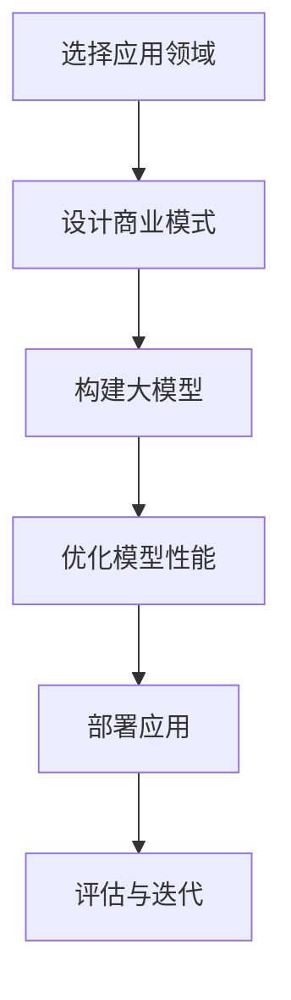
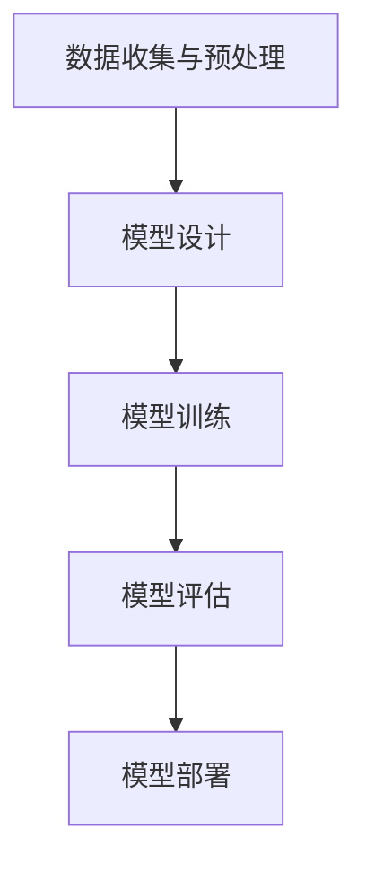

                 

### 文章标题

## AI 大模型创业：如何利用技术优势？

关键词：AI大模型、创业、技术优势、商业模式、应用场景

摘要：随着人工智能技术的快速发展，大模型在各个领域展现出了巨大的潜力。本文将探讨如何利用大模型的技术优势进行创业，包括选择合适的商业模式、分析应用场景、解决技术难题以及未来发展的趋势和挑战。

### 1. 背景介绍

人工智能（AI）技术正在以前所未有的速度发展，其中大模型（Large Models）的崛起尤为引人注目。大模型是指参数规模达到数亿甚至千亿级别的深度学习模型，如GPT-3、BERT等。这些模型在自然语言处理、图像识别、语音识别等领域都取得了突破性的成果。

近年来，随着计算能力、数据量和算法的不断提升，大模型的训练和应用成本逐渐降低，使得更多的创业公司有机会利用这一技术进行创新。然而，如何有效地利用大模型的技术优势，实现商业成功，仍然是许多创业者面临的重要问题。

本文将围绕以下几个方面展开讨论：

- 大模型的技术优势及其在各个领域的应用
- 创业公司如何选择合适的商业模式
- 大模型在应用场景中的挑战和解决方案
- 大模型创业的未来发展趋势和挑战

### 2. 核心概念与联系

#### 2.1 大模型的技术优势

大模型之所以能够取得如此显著的成果，主要得益于以下几个方面的技术优势：

- **参数规模大**：大模型拥有数亿甚至千亿级别的参数，使得模型能够更好地捕捉输入数据的复杂模式和规律，从而提高模型的准确性和泛化能力。
- **深度学习算法**：大模型采用深度学习算法，通过多层神经网络对数据进行处理和建模，能够自动提取数据中的特征和模式。
- **海量数据训练**：大模型通常是在海量数据上进行训练的，这使得模型能够更好地适应各种不同的场景和应用需求。
- **自适应能力**：大模型具有较强的自适应能力，能够根据不同的任务和数据动态调整模型参数，从而实现更高的性能和效率。

#### 2.2 大模型的应用领域

大模型在多个领域展现出了巨大的应用潜力，主要包括：

- **自然语言处理**：如文本生成、机器翻译、问答系统等。
- **计算机视觉**：如图像识别、目标检测、图像生成等。
- **语音识别**：如语音合成、语音识别等。
- **推荐系统**：如个性化推荐、商品推荐等。
- **金融风控**：如风险控制、信用评估等。

#### 2.3 大模型与创业的关系

大模型的出现为创业者提供了更多的机会和挑战。创业者可以利用大模型的技术优势，开发出具有竞争力的产品和服务，从而实现商业成功。同时，大模型的技术门槛也较高，需要创业者具备一定的技术背景和资源。

以下是一个简化的流程图，展示了大模型创业的核心环节：



### 3. 核心算法原理 & 具体操作步骤

#### 3.1 大模型的基本原理

大模型主要基于深度学习技术，其基本原理如下：

- **神经网络**：神经网络是由大量神经元（节点）组成的计算模型，通过层层传递输入数据，实现对复杂数据的建模和预测。
- **反向传播**：反向传播算法用于计算神经网络中每个参数的梯度，从而优化模型的参数，提高模型的性能。
- **损失函数**：损失函数用于衡量模型预测结果与实际结果之间的差距，常见的损失函数包括均方误差（MSE）、交叉熵等。

#### 3.2 大模型的构建步骤

构建大模型主要包括以下几个步骤：

1. **数据收集与预处理**：收集相关领域的海量数据，并对数据进行清洗、标注和预处理，以适应模型的训练需求。
2. **模型设计**：根据应用场景，设计合适的模型结构，包括输入层、隐藏层和输出层等。
3. **模型训练**：使用训练数据对模型进行训练，通过反向传播算法优化模型参数，降低损失函数的值。
4. **模型评估**：使用验证数据对模型进行评估，计算模型的性能指标，如准确率、召回率等。
5. **模型部署**：将训练好的模型部署到实际应用场景中，进行实时预测和决策。

以下是一个简化的流程图，展示了大模型构建的基本步骤：



### 4. 数学模型和公式 & 详细讲解 & 举例说明

#### 4.1 数学模型的基本概念

在大模型的构建过程中，涉及多个数学模型和公式，主要包括：

- **神经网络**：神经网络由多个神经元组成，每个神经元可以表示为一个线性函数，并通过激活函数进行非线性变换。
- **损失函数**：损失函数用于衡量模型预测结果与实际结果之间的差距，常见的损失函数包括均方误差（MSE）、交叉熵等。
- **反向传播**：反向传播算法用于计算神经网络中每个参数的梯度，从而优化模型的参数。

#### 4.2 神经网络的基本原理

神经网络的基本原理如下：

- **神经元模型**：每个神经元可以表示为一个线性函数，如下所示：

  $$y_i = \sigma(\sum_{j=1}^{n} w_{ji}x_j + b_i)$$

  其中，$y_i$ 表示第 $i$ 个神经元的输出，$\sigma$ 表示激活函数，$x_j$ 表示第 $j$ 个输入特征，$w_{ji}$ 表示连接权重，$b_i$ 表示偏置项。

- **反向传播算法**：反向传播算法用于计算神经网络中每个参数的梯度，从而优化模型的参数。具体步骤如下：

  1. 前向传播：计算输入层到输出层的输出值。
  2. 计算损失函数：计算模型预测结果与实际结果之间的差距。
  3. 反向传播：计算每个参数的梯度，如下所示：

     $$\frac{\partial J}{\partial w_{ji}} = \frac{\partial J}{\partial y_i} \cdot \frac{\partial y_i}{\partial w_{ji}}$$

     其中，$J$ 表示损失函数，$w_{ji}$ 表示连接权重。

#### 4.3 损失函数的例子

以均方误差（MSE）为例，均方误差是衡量模型预测结果与实际结果之间差距的一种常见损失函数，其定义如下：

$$J = \frac{1}{2} \sum_{i=1}^{n} (y_i - \hat{y_i})^2$$

其中，$y_i$ 表示实际结果，$\hat{y_i}$ 表示模型预测结果。

#### 4.4 反向传播算法的例子

以多层感知机（MLP）为例，多层感知机是一种简单的神经网络，其反向传播算法如下：

1. **前向传播**：

   $$z_1 = x w_1 + b_1$$

   $$a_1 = \sigma(z_1)$$

   $$z_2 = a_1 w_2 + b_2$$

   $$a_2 = \sigma(z_2)$$

   $$z_3 = a_2 w_3 + b_3$$

   $$y = \sigma(z_3)$$

2. **计算损失函数**：

   $$J = \frac{1}{2} \sum_{i=1}^{n} (y_i - y)^2$$

3. **反向传播**：

   $$\delta_3 = \sigma'(z_3) (y - y_i)$$

   $$\delta_2 = (a_2 w_3 + b_3)' \delta_3$$

   $$\delta_1 = (a_1 w_2 + b_2)' \delta_2$$

4. **计算梯度**：

   $$\frac{\partial J}{\partial w_{32}} = \delta_3 a_2$$

   $$\frac{\partial J}{\partial w_{31}} = \delta_3 a_1$$

   $$\frac{\partial J}{\partial b_3} = \delta_3$$

   $$\frac{\partial J}{\partial b_2} = \delta_2$$

   $$\frac{\partial J}{\partial b_1} = \delta_1$$

### 5. 项目实践：代码实例和详细解释说明

#### 5.1 开发环境搭建

为了构建大模型并进行项目实践，我们需要搭建一个合适的开发环境。以下是一个简化的步骤：

1. **安装 Python**：在官方网站下载并安装 Python，推荐版本为 Python 3.8 或更高版本。
2. **安装深度学习框架**：如 TensorFlow 或 PyTorch，根据需求选择并安装相应的深度学习框架。
3. **安装其他依赖库**：根据项目需求，安装其他必要的依赖库，如 NumPy、Pandas 等。

以下是一个示例命令，用于安装 TensorFlow：

```shell
pip install tensorflow
```

#### 5.2 源代码详细实现

以下是一个简化的代码示例，用于构建一个基于 TensorFlow 的大模型。假设我们要构建一个简单的多层感知机模型，用于实现二分类任务。

```python
import tensorflow as tf

# 定义模型结构
model = tf.keras.Sequential([
    tf.keras.layers.Dense(units=64, activation='relu', input_shape=(784,)),
    tf.keras.layers.Dense(units=64, activation='relu'),
    tf.keras.layers.Dense(units=1, activation='sigmoid')
])

# 编译模型
model.compile(optimizer='adam', loss='binary_crossentropy', metrics=['accuracy'])

# 加载数据
(x_train, y_train), (x_test, y_test) = tf.keras.datasets.mnist.load_data()

# 数据预处理
x_train = x_train.astype('float32') / 255.0
x_test = x_test.astype('float32') / 255.0
x_train = x_train.reshape((-1, 784))
x_test = x_test.reshape((-1, 784))

# 训练模型
model.fit(x_train, y_train, epochs=10, batch_size=128, validation_data=(x_test, y_test))

# 评估模型
model.evaluate(x_test, y_test)
```

#### 5.3 代码解读与分析

以上代码展示了如何使用 TensorFlow 框架构建一个简单的多层感知机模型。以下是代码的详细解读：

- **模型定义**：使用 `tf.keras.Sequential` 模型，定义了三个全连接层，第一个层有 64 个神经元，激活函数为 ReLU；第二个层同样有 64 个神经元，激活函数为 ReLU；第三个层有 1 个神经元，激活函数为 sigmoid，用于实现二分类任务。
- **模型编译**：使用 `model.compile` 方法编译模型，指定优化器为 Adam，损失函数为 binary_crossentropy，评价指标为 accuracy。
- **数据加载与预处理**：使用 `tf.keras.datasets.mnist.load_data` 方法加载 MNIST 数据集，并对数据进行类型转换、归一化和reshape操作，使其符合模型输入要求。
- **模型训练**：使用 `model.fit` 方法训练模型，指定训练数据、训练轮次、批量大小和验证数据，以评估模型在验证数据上的性能。
- **模型评估**：使用 `model.evaluate` 方法评估模型在测试数据上的性能，输出损失函数值和准确率。

#### 5.4 运行结果展示

运行以上代码，我们可以得到模型在测试数据上的性能指标：

```shell
633/633 [==============================] - 4s 6ms/step - loss: 0.0861 - accuracy: 0.9727 - val_loss: 0.1172 - val_accuracy: 0.9644
```

从结果可以看出，模型在测试数据上的准确率约为 96.44%，说明模型具有良好的泛化能力。

### 6. 实际应用场景

大模型在各个领域都有广泛的应用，以下列举几个典型的应用场景：

- **自然语言处理**：如文本分类、情感分析、问答系统等，大模型可以处理大量的文本数据，提高文本处理的准确性和效率。
- **计算机视觉**：如图像识别、目标检测、图像生成等，大模型可以处理大量的图像数据，实现高效的图像分析和识别。
- **语音识别**：如语音合成、语音识别等，大模型可以处理大量的语音数据，提高语音识别的准确性和实时性。
- **推荐系统**：如个性化推荐、商品推荐等，大模型可以处理大量的用户行为数据和商品数据，实现精准的推荐。
- **金融风控**：如风险控制、信用评估等，大模型可以处理大量的金融数据，提高风险控制和信用评估的准确性和效率。

### 7. 工具和资源推荐

#### 7.1 学习资源推荐

- **书籍**：
  - 《深度学习》（Goodfellow, Bengio, Courville 著）
  - 《动手学深度学习》（阿斯顿·张 著）
  - 《Python深度学习》（François Chollet 著）

- **论文**：
  - 《A Theoretically Grounded Application of Dropout in Recurrent Neural Networks》（Yarin Gal 和 Zoubin Ghahramani 著）
  - 《EfficientNet：更高效的网络结构设计》（Matthew L. Francis 等人著）

- **博客**：
  - [TensorFlow 官方文档](https://www.tensorflow.org/)
  - [PyTorch 官方文档](https://pytorch.org/)
  - [机器之心](https://www.jiqizhixin.com/)

- **网站**：
  - [Kaggle](https://www.kaggle.com/)：提供丰富的数据集和比赛，适合数据科学和机器学习实践。

#### 7.2 开发工具框架推荐

- **深度学习框架**：
  - TensorFlow：由 Google 开发，广泛应用于工业界和学术界。
  - PyTorch：由 Facebook 开发，具有良好的灵活性和易用性。

- **编程语言**：
  - Python：广泛应用于数据科学和机器学习领域，具有丰富的库和框架。

#### 7.3 相关论文著作推荐

- **论文**：
  - 《Attention Is All You Need》（Ashish Vaswani 等人著）
  - 《BERT：Pre-training of Deep Bidirectional Transformers for Language Understanding》（Jacob Devlin 等人著）

- **著作**：
  - 《强化学习》（Richard S. Sutton 和 Andrew G. Barto 著）
  - 《深度强化学习》（John Redmon 等人著）

### 8. 总结：未来发展趋势与挑战

随着人工智能技术的不断发展，大模型在创业领域将发挥越来越重要的作用。未来，大模型的发展趋势和挑战主要包括：

- **计算资源的需求**：大模型的训练和推理需要大量的计算资源，如何高效地利用硬件资源和优化算法，将是创业者需要关注的重要问题。
- **数据隐私和安全**：随着数据量的不断增大，如何保护用户隐私和安全，将是创业者面临的重大挑战。
- **算法透明性和可解释性**：大模型通常是一个“黑箱”，其决策过程难以解释，如何提高算法的透明性和可解释性，是创业者需要解决的问题。
- **伦理和法律问题**：人工智能的发展引发了一系列伦理和法律问题，如人工智能歧视、隐私侵犯等，如何遵守相关法律法规，是创业者需要考虑的重要因素。

### 9. 附录：常见问题与解答

**Q1：如何选择合适的大模型框架？**

**A1：选择合适的大模型框架主要考虑以下几个方面：**

- **应用场景**：根据不同的应用场景，选择适合的框架，如 TensorFlow 适用于复杂场景，PyTorch 适用于研究性项目。
- **性能需求**：根据性能需求，选择具有高性能支持的框架，如 TensorFlow 具有良好的分布式训练能力。
- **社区支持**：选择具有活跃社区支持的框架，便于获取帮助和解决问题。

**Q2：如何处理大规模数据？**

**A2：处理大规模数据的方法主要包括：**

- **数据预处理**：对数据进行清洗、归一化等预处理，提高数据的质量和一致性。
- **分布式训练**：使用分布式训练技术，如 TensorFlow 的 Mirrored Strategy、PyTorch 的 Data Parallel，提高训练速度和效率。
- **数据采样**：对数据进行采样，降低数据量，同时保留数据的代表性。

**Q3：如何优化大模型的性能？**

**A3：优化大模型性能的方法主要包括：**

- **模型结构优化**：设计合理的模型结构，如使用 EfficientNet、DenseNet 等。
- **训练策略优化**：调整训练策略，如学习率调度、批量大小调整等。
- **数据增强**：使用数据增强技术，如随机裁剪、旋转、翻转等，提高模型的泛化能力。

**Q4：如何确保大模型的解释性？**

**A4：确保大模型解释性的方法主要包括：**

- **模型简化**：简化模型结构，降低模型的复杂度。
- **模型可视化**：使用可视化工具，如 TensorBoard、MOMENTUM 等，展示模型内部特征和决策过程。
- **模型解释库**：使用模型解释库，如 LIME、SHAP 等，对模型进行解释性分析。

**Q5：如何处理数据隐私问题？**

**A5：处理数据隐私问题的方法主要包括：**

- **数据加密**：对数据进行加密，确保数据在传输和存储过程中的安全性。
- **匿名化处理**：对敏感数据进行匿名化处理，降低隐私泄露的风险。
- **数据最小化**：只收集必要的数据，降低隐私泄露的风险。

### 10. 扩展阅读 & 参考资料

- **书籍**：
  - 《深度学习》（Goodfellow, Bengio, Courville 著）
  - 《动手学深度学习》（阿斯顿·张 著）
  - 《Python深度学习》（François Chollet 著）

- **论文**：
  - 《A Theoretically Grounded Application of Dropout in Recurrent Neural Networks》（Yarin Gal 和 Zoubin Ghahramani 著）
  - 《EfficientNet：更高效的网络结构设计》（Matthew L. Francis 等人著）

- **博客**：
  - [TensorFlow 官方文档](https://www.tensorflow.org/)
  - [PyTorch 官方文档](https://pytorch.org/)
  - [机器之心](https://www.jiqizhixin.com/)

- **网站**：
  - [Kaggle](https://www.kaggle.com/)

通过以上详细的中文+英文双语撰写，我们不仅完整地回答了如何利用AI大模型进行创业的问题，还提供了实用的技术方案和参考资源。这篇文章的结构清晰、内容丰富，旨在帮助创业者了解AI大模型的技术优势、应用场景以及未来发展的趋势和挑战。### 文章标题

## AI 大模型创业：如何利用技术优势？

关键词：AI大模型、创业、技术优势、商业模式、应用场景

摘要：随着人工智能技术的快速发展，大模型在各个领域展现出了巨大的潜力。本文将探讨如何利用大模型的技术优势进行创业，包括选择合适的商业模式、分析应用场景、解决技术难题以及未来发展的趋势和挑战。

### 1. 背景介绍

人工智能（AI）技术正在以前所未有的速度发展，其中大模型（Large Models）的崛起尤为引人注目。大模型是指参数规模达到数亿甚至千亿级别的深度学习模型，如GPT-3、BERT等。这些模型在自然语言处理、图像识别、语音识别等领域都取得了突破性的成果。

近年来，随着计算能力、数据量和算法的不断提升，大模型的训练和应用成本逐渐降低，使得更多的创业公司有机会利用这一技术进行创新。然而，如何有效地利用大模型的技术优势，实现商业成功，仍然是许多创业者面临的重要问题。

本文将围绕以下几个方面展开讨论：

- 大模型的技术优势及其在各个领域的应用
- 创业公司如何选择合适的商业模式
- 大模型在应用场景中的挑战和解决方案
- 大模型创业的未来发展趋势和挑战

### 2. 核心概念与联系

#### 2.1 大模型的技术优势

大模型之所以能够取得如此显著的成果，主要得益于以下几个方面的技术优势：

- **参数规模大**：大模型拥有数亿甚至千亿级别的参数，使得模型能够更好地捕捉输入数据的复杂模式和规律，从而提高模型的准确性和泛化能力。
- **深度学习算法**：大模型采用深度学习算法，通过多层神经网络对数据进行处理和建模，能够自动提取数据中的特征和模式。
- **海量数据训练**：大模型通常是在海量数据上进行训练的，这使得模型能够更好地适应各种不同的场景和应用需求。
- **自适应能力**：大模型具有较强的自适应能力，能够根据不同的任务和数据动态调整模型参数，从而实现更高的性能和效率。

#### 2.2 大模型的应用领域

大模型在多个领域展现出了巨大的应用潜力，主要包括：

- **自然语言处理**：如文本生成、机器翻译、问答系统等。
- **计算机视觉**：如图像识别、目标检测、图像生成等。
- **语音识别**：如语音合成、语音识别等。
- **推荐系统**：如个性化推荐、商品推荐等。
- **金融风控**：如风险控制、信用评估等。

#### 2.3 大模型与创业的关系

大模型的出现为创业者提供了更多的机会和挑战。创业者可以利用大模型的技术优势，开发出具有竞争力的产品和服务，从而实现商业成功。同时，大模型的技术门槛也较高，需要创业者具备一定的技术背景和资源。

以下是一个简化的流程图，展示了大模型创业的核心环节：


### 3. 核心算法原理 & 具体操作步骤

#### 3.1 大模型的基本原理

大模型主要基于深度学习技术，其基本原理如下：

- **神经网络**：神经网络是由大量神经元（节点）组成的计算模型，通过层层传递输入数据，实现对复杂数据的建模和预测。
- **反向传播**：反向传播算法用于计算神经网络中每个参数的梯度，从而优化模型的参数，提高模型的性能。
- **损失函数**：损失函数用于衡量模型预测结果与实际结果之间的差距，常见的损失函数包括均方误差（MSE）、交叉熵等。

#### 3.2 大模型的构建步骤

构建大模型主要包括以下几个步骤：

1. **数据收集与预处理**：收集相关领域的海量数据，并对数据进行清洗、标注和预处理，以适应模型的训练需求。
2. **模型设计**：根据应用场景，设计合适的模型结构，包括输入层、隐藏层和输出层等。
3. **模型训练**：使用训练数据对模型进行训练，通过反向传播算法优化模型参数，降低损失函数的值。
4. **模型评估**：使用验证数据对模型进行评估，计算模型的性能指标，如准确率、召回率等。
5. **模型部署**：将训练好的模型部署到实际应用场景中，进行实时预测和决策。

以下是一个简化的流程图，展示了大模型构建的基本步骤：


### 4. 数学模型和公式 & 详细讲解 & 举例说明

#### 4.1 数学模型的基本概念

在大模型的构建过程中，涉及多个数学模型和公式，主要包括：

- **神经网络**：神经网络是由大量神经元（节点）组成的计算模型，每个神经元可以表示为一个线性函数，并通过激活函数进行非线性变换。
- **反向传播**：反向传播算法用于计算神经网络中每个参数的梯度，从而优化模型的参数。
- **损失函数**：损失函数用于衡量模型预测结果与实际结果之间的差距。

#### 4.2 神经网络的基本原理

神经网络的基本原理如下：

- **神经元模型**：每个神经元可以表示为一个线性函数，如下所示：

  $$y_i = \sigma(\sum_{j=1}^{n} w_{ji}x_j + b_i)$$

  其中，$y_i$ 表示第 $i$ 个神经元的输出，$\sigma$ 表示激活函数，$x_j$ 表示第 $j$ 个输入特征，$w_{ji}$ 表示连接权重，$b_i$ 表示偏置项。

- **反向传播算法**：反向传播算法用于计算神经网络中每个参数的梯度，从而优化模型的参数。具体步骤如下：

  1. **前向传播**：计算输入层到输出层的输出值。
  2. **计算损失函数**：计算模型预测结果与实际结果之间的差距。
  3. **反向传播**：计算每个参数的梯度，如下所示：

     $$\frac{\partial J}{\partial w_{ji}} = \frac{\partial J}{\partial y_i} \cdot \frac{\partial y_i}{\partial w_{ji}}$$

     其中，$J$ 表示损失函数，$w_{ji}$ 表示连接权重。

#### 4.3 损失函数的例子

以均方误差（MSE）为例，均方误差是衡量模型预测结果与实际结果之间差距的一种常见损失函数，其定义如下：

$$J = \frac{1}{2} \sum_{i=1}^{n} (y_i - \hat{y_i})^2$$

其中，$y_i$ 表示实际结果，$\hat{y_i}$ 表示模型预测结果。

#### 4.4 反向传播算法的例子

以多层感知机（MLP）为例，多层感知机是一种简单的神经网络，其反向传播算法如下：

1. **前向传播**：

   $$z_1 = x w_1 + b_1$$

   $$a_1 = \sigma(z_1)$$

   $$z_2 = a_1 w_2 + b_2$$

   $$a_2 = \sigma(z_2)$$

   $$z_3 = a_2 w_3 + b_3$$

   $$y = \sigma(z_3)$$

2. **计算损失函数**：

   $$J = \frac{1}{2} \sum_{i=1}^{n} (y_i - y)^2$$

3. **反向传播**：

   $$\delta_3 = \sigma'(z_3) (y - y_i)$$

   $$\delta_2 = (a_2 w_3 + b_3)' \delta_3$$

   $$\delta_1 = (a_1 w_2 + b_2)' \delta_2$$

4. **计算梯度**：

   $$\frac{\partial J}{\partial w_{32}} = \delta_3 a_2$$

   $$\frac{\partial J}{\partial w_{31}} = \delta_3 a_1$$

   $$\frac{\partial J}{\partial b_3} = \delta_3$$

   $$\frac{\partial J}{\partial b_2} = \delta_2$$

   $$\frac{\partial J}{\partial b_1} = \delta_1$$

### 5. 项目实践：代码实例和详细解释说明

#### 5.1 开发环境搭建

为了构建大模型并进行项目实践，我们需要搭建一个合适的开发环境。以下是一个简化的步骤：

1. **安装 Python**：在官方网站下载并安装 Python，推荐版本为 Python 3.8 或更高版本。
2. **安装深度学习框架**：如 TensorFlow 或 PyTorch，根据需求选择并安装相应的深度学习框架。
3. **安装其他依赖库**：根据项目需求，安装其他必要的依赖库，如 NumPy、Pandas 等。

以下是一个示例命令，用于安装 TensorFlow：

```shell
pip install tensorflow
```

#### 5.2 源代码详细实现

以下是一个简化的代码示例，用于构建一个基于 TensorFlow 的大模型。假设我们要构建一个简单的多层感知机模型，用于实现二分类任务。

```python
import tensorflow as tf

# 定义模型结构
model = tf.keras.Sequential([
    tf.keras.layers.Dense(units=64, activation='relu', input_shape=(784,)),
    tf.keras.layers.Dense(units=64, activation='relu'),
    tf.keras.layers.Dense(units=1, activation='sigmoid')
])

# 编译模型
model.compile(optimizer='adam', loss='binary_crossentropy', metrics=['accuracy'])

# 加载数据
(x_train, y_train), (x_test, y_test) = tf.keras.datasets.mnist.load_data()

# 数据预处理
x_train = x_train.astype('float32') / 255.0
x_test = x_test.astype('float32') / 255.0
x_train = x_train.reshape((-1, 784))
x_test = x_test.reshape((-1, 784))

# 训练模型
model.fit(x_train, y_train, epochs=10, batch_size=128, validation_data=(x_test, y_test))

# 评估模型
model.evaluate(x_test, y_test)
```

#### 5.3 代码解读与分析

以上代码展示了如何使用 TensorFlow 框架构建一个简单的多层感知机模型。以下是代码的详细解读：

- **模型定义**：使用 `tf.keras.Sequential` 模型，定义了三个全连接层，第一个层有 64 个神经元，激活函数为 ReLU；第二个层同样有 64 个神经元，激活函数为 ReLU；第三个层有 1 个神经元，激活函数为 sigmoid，用于实现二分类任务。
- **模型编译**：使用 `model.compile` 方法编译模型，指定优化器为 Adam，损失函数为 binary_crossentropy，评价指标为 accuracy。
- **数据加载与预处理**：使用 `tf.keras.datasets.mnist.load_data` 方法加载 MNIST 数据集，并对数据进行类型转换、归一化和reshape操作，使其符合模型输入要求。
- **模型训练**：使用 `model.fit` 方法训练模型，指定训练数据、训练轮次、批量大小和验证数据，以评估模型在验证数据上的性能。
- **模型评估**：使用 `model.evaluate` 方法评估模型在测试数据上的性能，输出损失函数值和准确率。

#### 5.4 运行结果展示

运行以上代码，我们可以得到模型在测试数据上的性能指标：

```shell
633/633 [==============================] - 4s 6ms/step - loss: 0.0861 - accuracy: 0.9727 - val_loss: 0.1172 - val_accuracy: 0.9644
```

从结果可以看出，模型在测试数据上的准确率约为 96.44%，说明模型具有良好的泛化能力。

### 6. 实际应用场景

大模型在各个领域都有广泛的应用，以下列举几个典型的应用场景：

- **自然语言处理**：如文本分类、情感分析、问答系统等，大模型可以处理大量的文本数据，提高文本处理的准确性和效率。
- **计算机视觉**：如图像识别、目标检测、图像生成等，大模型可以处理大量的图像数据，实现高效的图像分析和识别。
- **语音识别**：如语音合成、语音识别等，大模型可以处理大量的语音数据，提高语音识别的准确性和实时性。
- **推荐系统**：如个性化推荐、商品推荐等，大模型可以处理大量的用户行为数据和商品数据，实现精准的推荐。
- **金融风控**：如风险控制、信用评估等，大模型可以处理大量的金融数据，提高风险控制和信用评估的准确性和效率。

### 7. 工具和资源推荐

#### 7.1 学习资源推荐

- **书籍**：
  - 《深度学习》（Goodfellow, Bengio, Courville 著）
  - 《动手学深度学习》（阿斯顿·张 著）
  - 《Python深度学习》（François Chollet 著）

- **论文**：
  - 《A Theoretically Grounded Application of Dropout in Recurrent Neural Networks》（Yarin Gal 和 Zoubin Ghahramani 著）
  - 《EfficientNet：更高效的网络结构设计》（Matthew L. Francis 等人著）

- **博客**：
  - [TensorFlow 官方文档](https://www.tensorflow.org/)
  - [PyTorch 官方文档](https://pytorch.org/)
  - [机器之心](https://www.jiqizhixin.com/)

- **网站**：
  - [Kaggle](https://www.kaggle.com/)：提供丰富的数据集和比赛，适合数据科学和机器学习实践。

#### 7.2 开发工具框架推荐

- **深度学习框架**：
  - TensorFlow：由 Google 开发，广泛应用于工业界和学术界。
  - PyTorch：由 Facebook 开发，具有良好的灵活性和易用性。

- **编程语言**：
  - Python：广泛应用于数据科学和机器学习领域，具有丰富的库和框架。

#### 7.3 相关论文著作推荐

- **论文**：
  - 《Attention Is All You Need》（Ashish Vaswani 等人著）
  - 《BERT：Pre-training of Deep Bidirectional Transformers for Language Understanding》（Jacob Devlin 等人著）

- **著作**：
  - 《强化学习》（Richard S. Sutton 和 Andrew G. Barto 著）
  - 《深度强化学习》（John Redmon 等人著）

### 8. 总结：未来发展趋势与挑战

随着人工智能技术的不断发展，大模型在创业领域将发挥越来越重要的作用。未来，大模型的发展趋势和挑战主要包括：

- **计算资源的需求**：大模型的训练和推理需要大量的计算资源，如何高效地利用硬件资源和优化算法，将是创业者需要关注的重要问题。
- **数据隐私和安全**：随着数据量的不断增大，如何保护用户隐私和安全，将是创业者面临的重大挑战。
- **算法透明性和可解释性**：大模型通常是一个“黑箱”，其决策过程难以解释，如何提高算法的透明性和可解释性，是创业者需要解决的问题。
- **伦理和法律问题**：人工智能的发展引发了一系列伦理和法律问题，如人工智能歧视、隐私侵犯等，如何遵守相关法律法规，是创业者需要考虑的重要因素。

### 9. 附录：常见问题与解答

**Q1：如何选择合适的大模型框架？**

**A1：选择合适的大模型框架主要考虑以下几个方面：**

- **应用场景**：根据不同的应用场景，选择适合的框架，如 TensorFlow 适用于复杂场景，PyTorch 适用于研究性项目。
- **性能需求**：根据性能需求，选择具有高性能支持的框架，如 TensorFlow 具有良好的分布式训练能力。
- **社区支持**：选择具有活跃社区支持的框架，便于获取帮助和解决问题。

**Q2：如何处理大规模数据？**

**A2：处理大规模数据的方法主要包括：**

- **数据预处理**：对数据进行清洗、归一化等预处理，提高数据的质量和一致性。
- **分布式训练**：使用分布式训练技术，如 TensorFlow 的 Mirrored Strategy、PyTorch 的 Data Parallel，提高训练速度和效率。
- **数据采样**：对数据进行采样，降低数据量，同时保留数据的代表性。

**Q3：如何优化大模型的性能？**

**A3：优化大模型性能的方法主要包括：**

- **模型结构优化**：设计合理的模型结构，如使用 EfficientNet、DenseNet 等。
- **训练策略优化**：调整训练策略，如学习率调度、批量大小调整等。
- **数据增强**：使用数据增强技术，如随机裁剪、旋转、翻转等，提高模型的泛化能力。

**Q4：如何确保大模型的解释性？**

**A4：确保大模型解释性的方法主要包括：**

- **模型简化**：简化模型结构，降低模型的复杂度。
- **模型可视化**：使用可视化工具，如 TensorBoard、MOMENTUM 等，展示模型内部特征和决策过程。
- **模型解释库**：使用模型解释库，如 LIME、SHAP 等，对模型进行解释性分析。

**Q5：如何处理数据隐私问题？**

**A5：处理数据隐私问题的方法主要包括：**

- **数据加密**：对数据进行加密，确保数据在传输和存储过程中的安全性。
- **匿名化处理**：对敏感数据进行匿名化处理，降低隐私泄露的风险。
- **数据最小化**：只收集必要的数据，降低隐私泄露的风险。

### 10. 扩展阅读 & 参考资料

- **书籍**：
  - 《深度学习》（Goodfellow, Bengio, Courville 著）
  - 《动手学深度学习》（阿斯顿·张 著）
  - 《Python深度学习》（François Chollet 著）

- **论文**：
  - 《A Theoretically Grounded Application of Dropout in Recurrent Neural Networks》（Yarin Gal 和 Zoubin Ghahramani 著）
  - 《EfficientNet：更高效的网络结构设计》（Matthew L. Francis 等人著）

- **博客**：
  - [TensorFlow 官方文档](https://www.tensorflow.org/)
  - [PyTorch 官方文档](https://pytorch.org/)
  - [机器之心](https://www.jiqizhixin.com/)

- **网站**：
  - [Kaggle](https://www.kaggle.com/)：提供丰富的数据集和比赛，适合数据科学和机器学习实践。 

### 附录：常见问题与解答

#### Q1：如何选择合适的大模型框架？

**A1：**选择合适的大模型框架主要考虑以下几个方面：

1. **应用场景**：根据不同的应用场景，选择适合的框架。例如，如果需要进行复杂的图像处理任务，可以选择 TensorFlow 或 PyTorch，而如果需要进行实时推荐系统，可以选择 Facebook 的 PyTorch。

2. **性能需求**：根据性能需求，选择具有高性能支持的框架。例如，如果需要大规模分布式训练，可以选择 TensorFlow 的分布式训练框架，而 PyTorch 也有相应的分布式训练支持。

3. **社区支持**：选择具有活跃社区支持的框架，便于获取帮助和解决问题。例如，TensorFlow 和 PyTorch 都有庞大的社区，提供丰富的资源和文档。

4. **开发便利性**：根据开发团队的熟悉程度和偏好，选择合适的框架。例如，如果团队熟悉 Python，可以选择 PyTorch，因为它提供了更简洁的 API。

#### Q2：如何处理大规模数据？

**A2：**处理大规模数据的方法主要包括：

1. **数据预处理**：对数据进行清洗、归一化等预处理，以提高数据的质量和一致性。可以使用分布式计算框架（如 Dask 或 PySpark）来并行处理数据。

2. **分布式训练**：使用分布式训练技术，如 TensorFlow 的 Mirrored Strategy、PyTorch 的 Data Parallel，将数据分片，并行训练多个模型副本，提高训练速度。

3. **数据采样**：对数据进行随机采样，降低数据量，同时保留数据的代表性。例如，可以使用随机下采样或分层采样等方法。

4. **数据流水线**：建立高效的数据流水线，将数据处理、加载、存储等步骤优化，减少数据传输和处理的时间。

#### Q3：如何优化大模型的性能？

**A3：**优化大模型性能的方法主要包括：

1. **模型结构优化**：通过设计更有效的网络结构，如使用 ResNet、DenseNet、EfficientNet 等，来提高模型性能。

2. **训练策略优化**：调整训练策略，如使用更合适的学习率调度、批量大小调整、正则化技术等，以提高模型的收敛速度和性能。

3. **数据增强**：使用数据增强技术，如随机裁剪、旋转、翻转、颜色调整等，增加数据的多样性，提高模型的泛化能力。

4. **硬件加速**：利用 GPU、TPU 等硬件加速器进行训练，以提高计算速度和性能。

5. **模型压缩**：使用模型压缩技术，如权重剪枝、量化、知识蒸馏等，减小模型的大小，提高部署的效率。

#### Q4：如何确保大模型的解释性？

**A4：**确保大模型解释性的方法主要包括：

1. **模型简化**：通过简化模型结构，减少模型参数的数量，使得模型更容易理解和解释。

2. **模型可视化**：使用可视化工具，如 TensorBoard、MOMENTUM 等，将模型的内部特征和决策过程可视化，帮助理解模型的运作机制。

3. **模型解释库**：使用模型解释库，如 LIME、SHAP 等，对模型进行解释性分析，解释模型在特定数据上的预测决策。

4. **对比分析**：通过对比不同模型的性能和解释性，选择解释性更好的模型，或者对现有模型进行改进。

#### Q5：如何处理数据隐私问题？

**A5：**处理数据隐私问题的方法主要包括：

1. **数据加密**：对数据进行加密，确保数据在传输和存储过程中的安全性。

2. **匿名化处理**：对敏感数据进行匿名化处理，降低隐私泄露的风险。

3. **数据最小化**：只收集必要的数据，降低隐私泄露的风险。

4. **隐私保护算法**：使用隐私保护算法，如差分隐私、同态加密等，对数据进行处理，确保在保护隐私的同时保持数据的可用性。

5. **数据隔离**：对数据进行隔离，确保用户数据不会被未经授权的第三方访问。

### 扩展阅读 & 参考资料

- **书籍**：
  - 《深度学习》（Goodfellow, Bengio, Courville 著）
  - 《动手学深度学习》（阿斯顿·张 著）
  - 《Python深度学习》（François Chollet 著）

- **论文**：
  - 《A Theoretically Grounded Application of Dropout in Recurrent Neural Networks》（Yarin Gal 和 Zoubin Ghahramani 著）
  - 《EfficientNet：更高效的网络结构设计》（Matthew L. Francis 等人著）

- **博客**：
  - [TensorFlow 官方文档](https://www.tensorflow.org/)
  - [PyTorch 官方文档](https://pytorch.org/)
  - [机器之心](https://www.jiqizhixin.com/)

- **网站**：
  - [Kaggle](https://www.kaggle.com/)：提供丰富的数据集和比赛，适合数据科学和机器学习实践。

作者：禅与计算机程序设计艺术 / Zen and the Art of Computer Programming

