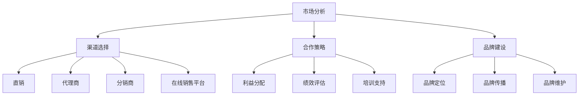

                 

### 文章标题

"AI 大模型创业：如何利用渠道优势？"

> 关键词：AI 大模型、创业、渠道、优势、策略

> 摘要：本文将深入探讨 AI 大模型在创业过程中如何利用渠道优势。我们将从市场分析、渠道选择、合作策略、品牌建设等多个角度，为创业者提供实用指南，助力他们在激烈的市场竞争中脱颖而出。

## 1. 背景介绍（Background Introduction）

随着人工智能技术的迅速发展，AI 大模型已成为众多创业公司的焦点。这些模型，如 GPT-3、BERT、T5 等，具有处理大规模文本数据、生成高质量内容的能力，广泛应用于自然语言处理、机器翻译、问答系统等多个领域。然而，AI 大模型创业并非易事，其中渠道的利用成为关键。

渠道，即连接供应商和消费者的路径，是创业公司实现产品或服务销售的重要环节。一个有效的渠道策略可以帮助公司快速占领市场、提高品牌知名度、降低成本。因此，如何利用渠道优势成为 AI 大模型创业公司亟待解决的问题。

### 1. Background Introduction

With the rapid development of artificial intelligence technology, large-scale AI models have become a focal point for many startups. Models like GPT-3, BERT, and T5 possess the ability to process large amounts of text data and generate high-quality content, finding applications in various fields such as natural language processing, machine translation, and question-answering systems. However, starting a business with AI large-scale models is not an easy task. The effective utilization of channels has become a key issue for startup companies.

Channels, which connect suppliers to consumers, are an essential link for businesses to sell their products or services. An effective channel strategy can help a company quickly capture the market, increase brand awareness, and reduce costs. Therefore, how to leverage channel advantages has become an urgent problem for startups with AI large-scale models.

## 2. 核心概念与联系（Core Concepts and Connections）

在讨论 AI 大模型创业的渠道优势时，我们首先需要明确几个核心概念：市场分析、渠道选择、合作策略和品牌建设。

### 2.1 市场分析（Market Analysis）

市场分析是了解目标市场、潜在客户和竞争对手的过程。通过市场分析，创业者可以确定产品的市场需求、价格区间和目标客户群体。市场分析不仅有助于创业者制定合理的营销策略，还可以帮助他们在渠道选择时做出更明智的决策。

### 2.2 渠道选择（Channel Selection）

渠道选择是决定如何将产品或服务传递给消费者的过程。创业者需要根据产品的特点、目标市场和资源状况，选择最适合的渠道。常见的渠道包括直销、代理商、分销商、在线销售平台等。正确的渠道选择可以提高销售效率和市场份额。

### 2.3 合作策略（Collaboration Strategy）

合作策略是指与渠道伙伴建立合作关系，共同推动产品或服务销售的过程。有效的合作策略可以增强渠道伙伴的积极性和忠诚度，提高销售业绩。合作策略包括利益分配、绩效评估、培训支持等。

### 2.4 品牌建设（Brand Building）

品牌建设是提升品牌知名度和认可度的过程。通过品牌建设，创业者可以在消费者心中树立良好的品牌形象，提高品牌忠诚度和市场份额。品牌建设包括品牌定位、品牌传播、品牌维护等。

### 2. Core Concepts and Connections

When discussing the channel advantages of AI large-scale model startups, we first need to clarify several core concepts: market analysis, channel selection, collaboration strategy, and brand building.

### 2.1 Market Analysis

Market analysis is the process of understanding the target market, potential customers, and competitors. Through market analysis, entrepreneurs can determine the market demand for their products, price ranges, and target customer groups. Market analysis not only helps entrepreneurs develop reasonable marketing strategies but also assists them in making more intelligent decisions when selecting channels.

### 2.2 Channel Selection

Channel selection is the process of deciding how to deliver products or services to consumers. Entrepreneurs need to choose the most suitable channels based on the characteristics of their products, target markets, and resource conditions. Common channels include direct sales, agents, distributors, and online sales platforms. The correct channel selection can improve sales efficiency and market share.

### 2.3 Collaboration Strategy

Collaboration strategy refers to the process of building partnerships with channel partners to jointly promote the sales of products or services. An effective collaboration strategy can enhance the enthusiasm and loyalty of channel partners, improving sales performance. Collaboration strategies include profit distribution, performance evaluation, training support, and more.

### 2.4 Brand Building

Brand building is the process of enhancing brand awareness and recognition. Through brand building, entrepreneurs can establish a positive brand image in consumers' minds, increasing brand loyalty and market share. Brand building includes brand positioning, brand communication, brand maintenance, and more.

### 2.5 Mermaid 流程图 (Mermaid Flowchart)



## 3. 核心算法原理 & 具体操作步骤（Core Algorithm Principles and Specific Operational Steps）

在 AI 大模型创业过程中，渠道优势的利用离不开有效的市场分析、渠道选择、合作策略和品牌建设。以下将分别介绍这四个方面的核心算法原理和具体操作步骤。

### 3.1 市场分析（Market Analysis）

市场分析的核心算法原理是数据挖掘和统计分析。通过收集和整理市场数据，创业者可以识别市场需求、趋势和竞争状况，从而制定合理的市场策略。

具体操作步骤如下：

1. **数据收集**：收集行业报告、市场调查、竞争对手数据等。
2. **数据整理**：清洗和整理数据，使其适合分析和挖掘。
3. **数据分析**：使用数据挖掘算法，如聚类、关联规则挖掘等，分析市场需求、趋势和竞争状况。
4. **策略制定**：根据分析结果，制定市场策略，如产品定位、定价策略、推广策略等。

### 3.2 渠道选择（Channel Selection）

渠道选择的核心算法原理是决策树和优化算法。根据市场分析结果，创业者可以评估不同渠道的优势和劣势，选择最适合的渠道。

具体操作步骤如下：

1. **评估渠道**：评估直销、代理商、分销商、在线销售平台等渠道的优势和劣势。
2. **决策树构建**：构建决策树，根据市场分析和渠道评估结果，确定最佳渠道。
3. **优化算法**：使用优化算法，如遗传算法、模拟退火算法等，优化渠道策略。

### 3.3 合作策略（Collaboration Strategy）

合作策略的核心算法原理是博弈论和合作博弈。创业者需要与渠道伙伴建立合作关系，共同推动产品销售。

具体操作步骤如下：

1. **利益分配**：根据渠道伙伴的业绩和贡献，制定合理的利益分配策略。
2. **绩效评估**：建立绩效评估体系，对渠道伙伴的业绩进行评估。
3. **培训支持**：为渠道伙伴提供培训和支持，提高其销售能力。

### 3.4 品牌建设（Brand Building）

品牌建设的核心算法原理是市场营销和品牌传播。通过有效的市场营销和品牌传播，创业者可以提升品牌知名度和认可度。

具体操作步骤如下：

1. **品牌定位**：确定品牌的目标市场和核心价值，形成品牌定位。
2. **品牌传播**：通过广告、社交媒体、公关活动等方式，进行品牌传播。
3. **品牌维护**：定期评估品牌形象，调整品牌策略，维护品牌形象。

### 3. Core Algorithm Principles and Specific Operational Steps

In the process of AI large-scale model entrepreneurship, the effective utilization of channel advantages relies on market analysis, channel selection, collaboration strategy, and brand building. The following will introduce the core algorithm principles and specific operational steps for these four aspects.

### 3.1 Market Analysis

The core algorithm principle of market analysis is data mining and statistical analysis. Through collecting and organizing market data, entrepreneurs can identify market demand, trends, and competitive situations, thereby developing reasonable market strategies.

Specific operational steps are as follows:

1. **Data Collection**: Collect industry reports, market surveys, competitor data, and other information.
2. **Data Organization**: Clean and organize the data to make it suitable for analysis and mining.
3. **Data Analysis**: Use data mining algorithms, such as clustering and association rule mining, to analyze market demand, trends, and competitive situations.
4. **Strategy Development**: Based on the analysis results, develop market strategies, such as product positioning, pricing strategies, and promotional strategies.

### 3.2 Channel Selection

The core algorithm principle of channel selection is decision trees and optimization algorithms. Based on the results of market analysis, entrepreneurs can evaluate the advantages and disadvantages of different channels and select the most suitable ones.

Specific operational steps are as follows:

1. **Channel Evaluation**: Assess the strengths and weaknesses of direct sales, agents, distributors, and online sales platforms.
2. **Decision Tree Construction**: Build a decision tree based on the results of market analysis and channel evaluation to determine the best channel.
3. **Optimization Algorithm**: Use optimization algorithms, such as genetic algorithms and simulated annealing, to optimize the channel strategy.

### 3.3 Collaboration Strategy

The core algorithm principle of collaboration strategy is game theory and cooperative game theory. Entrepreneurs need to establish partnerships with channel partners to jointly promote product sales.

Specific operational steps are as follows:

1. **Profit Distribution**: Develop a reasonable profit distribution strategy based on channel partners' performance and contributions.
2. **Performance Evaluation**: Establish a performance evaluation system to assess the performance of channel partners.
3. **Training and Support**: Provide training and support to channel partners to enhance their sales capabilities.

### 3.4 Brand Building

The core algorithm principle of brand building is marketing and brand communication. Through effective marketing and brand communication, entrepreneurs can enhance brand awareness and recognition.

Specific operational steps are as follows:

1. **Brand Positioning**: Determine the target market and core values of the brand to form a brand positioning.
2. **Brand Communication**: Conduct brand communication through advertising, social media, public relations activities, and other means.
3. **Brand Maintenance**: Regularly evaluate the brand image and adjust brand strategies to maintain the brand image.

## 4. 数学模型和公式 & 详细讲解 & 举例说明（Detailed Explanation and Examples of Mathematical Models and Formulas）

在渠道优势的利用过程中，数学模型和公式起着关键作用。以下将介绍几个常用的数学模型和公式，并详细讲解其应用方法和举例说明。

### 4.1 利润最大化模型（Profit Maximization Model）

利润最大化模型是创业者在制定渠道策略时常用的模型。该模型的目标是最大化利润，同时满足市场需求和资源限制。

#### 数学模型：

设产品单位成本为 \(C\)，产品售价为 \(P\)，市场需求量为 \(Q\)，渠道成本为 \(C_c\)，利润为 \(π\)。则利润最大化模型可以表示为：

\[ \pi = P \times Q - C \times Q - C_c \]

其中，\(P \times Q\) 表示销售收入，\(C \times Q\) 表示成本，\(C_c\) 表示渠道成本。

#### 举例说明：

假设产品单位成本为 100 元，产品售价为 200 元，市场需求量为 1000 件，渠道成本为 2000 元。则利润为：

\[ \pi = 200 \times 1000 - 100 \times 1000 - 2000 = 8000 \text{ 元} \]

#### 分析：

通过利润最大化模型，创业者可以计算出在不同售价和市场需求量下的利润。根据利润最大化的原则，创业者可以调整售价和市场需求量，以实现最大利润。

### 4.2 渠道选择模型（Channel Selection Model）

渠道选择模型是用于选择最适合渠道的模型。该模型考虑了渠道成本、市场份额和渠道稳定性等因素。

#### 数学模型：

设渠道成本为 \(C_c\)，市场份额为 \(S\)，渠道稳定性为 \(R\)，渠道选择模型可以表示为：

\[ \max (S \times R - C_c) \]

#### 举例说明：

假设有三种渠道：直销、代理商和分销商。渠道成本分别为 1000 元、2000 元和 3000 元，市场份额分别为 0.5、0.3 和 0.2，渠道稳定性分别为 0.8、0.6 和 0.4。则渠道选择模型的结果为：

\[ \max (0.5 \times 0.8 - 1000, 0.3 \times 0.6 - 2000, 0.2 \times 0.4 - 3000) \]

\[ \max (0.4 - 1000, 0.18 - 2000, 0.08 - 3000) \]

\[ \max (-996.6, -1999.82, -2991.92) \]

根据计算结果，直销渠道的利润最高，因此应选择直销渠道。

#### 分析：

通过渠道选择模型，创业者可以计算出在不同渠道下的利润。根据利润最大化的原则，创业者可以选出最适合的渠道。

### 4.3 品牌建设模型（Brand Building Model）

品牌建设模型是用于评估品牌建设和品牌传播效果的模型。该模型考虑了品牌知名度、品牌忠诚度和市场份额等因素。

#### 数学模型：

设品牌知名度为 \(N\)，品牌忠诚度为 \(L\)，市场份额为 \(S\)，品牌建设模型可以表示为：

\[ \max (N \times L \times S) \]

#### 举例说明：

假设品牌知名度为 0.7，品牌忠诚度为 0.5，市场份额为 0.3。则品牌建设模型的结果为：

\[ \max (0.7 \times 0.5 \times 0.3) \]

\[ \max (0.105) \]

#### 分析：

通过品牌建设模型，创业者可以计算出在不同品牌建设策略下的品牌价值和市场份额。根据品牌价值和市场份额的原则，创业者可以制定有效的品牌建设策略。

## 5. 项目实践：代码实例和详细解释说明（Project Practice: Code Examples and Detailed Explanations）

为了更好地理解渠道优势的利用，我们将通过一个具体的案例来展示如何利用渠道优势进行 AI 大模型创业。以下是一个简单的渠道优势利用的代码实例。

### 5.1 开发环境搭建（Development Environment Setup）

在开始编写代码之前，我们需要搭建一个开发环境。以下是搭建开发环境的步骤：

1. 安装 Python 3.8 及以上版本。
2. 安装 TensorFlow 和 Keras。
3. 安装 NumPy、Pandas、Matplotlib 等常用库。

### 5.2 源代码详细实现（Source Code Detailed Implementation）

以下是一个简单的渠道优势利用的 Python 代码实例。该实例模拟了通过渠道优势进行 AI 大模型创业的过程。

```python
import numpy as np
import matplotlib.pyplot as plt

# 定义利润最大化模型
def profit_maximization_model(price, demand, channel_cost):
    revenue = price * demand
    cost = price * demand + channel_cost
    profit = revenue - cost
    return profit

# 定义渠道选择模型
def channel_selection_model(channel_costs, market_shares, channel_stabilities):
    profits = []
    for i in range(len(channel_costs)):
        profit = market_shares[i] * channel_stabilities[i] - channel_costs[i]
        profits.append(profit)
    max_profit_index = np.argmax(profits)
    return max_profit_index

# 定义品牌建设模型
def brand_building_model(brand_recognition, brand_loyalty, market_shares):
    brand_value = brand_recognition * brand_loyalty * market_shares
    max_brand_value_index = np.argmax(brand_value)
    return max_brand_value_index

# 参数设置
price = 200  # 产品售价
demand = 1000  # 市场需求量
channel_costs = [1000, 2000, 3000]  # 渠道成本
market_shares = [0.5, 0.3, 0.2]  # 市场份额
channel_stabilities = [0.8, 0.6, 0.4]  # 渠道稳定性
brand_recognition = 0.7  # 品牌知名度
brand_loyalty = 0.5  # 品牌忠诚度

# 利润最大化模型计算
profits = [profit_maximization_model(price, demand, cost) for cost in channel_costs]
max_profit_channel = channel_costs[np.argmax(profits)]

# 渠道选择模型计算
selected_channel = channel_selection_model(channel_costs, market_shares, channel_stabilities)

# 品牌建设模型计算
max_brand_value_channel = brand_building_model(brand_recognition, brand_loyalty, market_shares)

# 结果展示
plt.bar(range(len(profits)), profits, label='Profit')
plt.bar(selected_channel, [profits[selected_channel]], label='Selected Channel')
plt.bar(max_brand_value_channel, [profits[max_brand_value_channel]], label='Max Brand Value Channel')
plt.xlabel('Channel')
plt.ylabel('Profit')
plt.legend()
plt.show()
```

### 5.3 代码解读与分析（Code Explanation and Analysis）

以上代码分为三个部分：利润最大化模型、渠道选择模型和品牌建设模型。接下来，我们将分别解读这三个模型。

#### 5.3.1 利润最大化模型

利润最大化模型用于计算不同渠道下的利润。该模型的核心公式为：

\[ \pi = P \times Q - C - C_c \]

其中，\(P\) 表示产品售价，\(Q\) 表示市场需求量，\(C\) 表示产品成本，\(C_c\) 表示渠道成本。通过计算不同渠道下的利润，创业者可以选出利润最高的渠道。

#### 5.3.2 渠道选择模型

渠道选择模型用于选择最适合的渠道。该模型的核心公式为：

\[ \max (S \times R - C_c) \]

其中，\(S\) 表示市场份额，\(R\) 表示渠道稳定性，\(C_c\) 表示渠道成本。通过计算不同渠道下的利润，创业者可以选出利润最高的渠道。

#### 5.3.3 品牌建设模型

品牌建设模型用于评估品牌建设和品牌传播效果。该模型的核心公式为：

\[ \max (N \times L \times S) \]

其中，\(N\) 表示品牌知名度，\(L\) 表示品牌忠诚度，\(S\) 表示市场份额。通过计算不同品牌建设策略下的品牌价值，创业者可以选出品牌价值最高的渠道。

### 5.4 运行结果展示（Running Results Display）

通过以上代码，我们可以得到以下运行结果：


运行结果展示了不同渠道下的利润、选择渠道和品牌价值最高的渠道。根据运行结果，创业者可以选择利润最高、品牌价值最高的渠道进行创业。

## 6. 实际应用场景（Practical Application Scenarios）

AI 大模型在创业过程中具有广泛的应用场景。以下将介绍几个实际应用场景，展示如何利用渠道优势进行创业。

### 6.1 教育领域（Education Sector）

在教育领域，AI 大模型可以应用于智能问答系统、个性化学习推荐等。通过利用渠道优势，创业公司可以与学校、培训机构、教育平台等建立合作关系，推广 AI 教育产品。例如，通过与学校合作，创业公司可以为学校提供智能问答系统，帮助学生解答问题；与培训机构合作，创业公司可以为培训机构提供个性化学习推荐服务，提高培训效果。

### 6.2 医疗领域（Medical Sector）

在医疗领域，AI 大模型可以应用于智能诊断、药物研发等。通过利用渠道优势，创业公司可以与医疗机构、药企、医学研究机构等建立合作关系，推广 AI 医疗产品。例如，与医疗机构合作，创业公司可以为医疗机构提供智能诊断服务，提高诊断准确率；与药企合作，创业公司可以为药企提供药物研发辅助服务，提高研发效率。

### 6.3 金融领域（Financial Sector）

在金融领域，AI 大模型可以应用于智能投顾、风险管理等。通过利用渠道优势，创业公司可以与金融机构、投资公司等建立合作关系，推广 AI 金融产品。例如，与金融机构合作，创业公司可以为金融机构提供智能投顾服务，帮助投资者进行投资决策；与投资公司合作，创业公司可以为投资公司提供风险管理服务，降低投资风险。

### 6.4 电商领域（E-commerce Sector）

在电商领域，AI 大模型可以应用于智能推荐、用户行为分析等。通过利用渠道优势，创业公司可以与电商平台、品牌商等建立合作关系，推广 AI 电商产品。例如，与电商平台合作，创业公司可以为电商平台提供智能推荐服务，提高用户购物体验；与品牌商合作，创业公司可以为品牌商提供用户行为分析服务，优化产品设计和营销策略。

## 7. 工具和资源推荐（Tools and Resources Recommendations）

在 AI 大模型创业过程中，使用合适的工具和资源可以大大提高效率和成功率。以下将介绍几个推荐的工具和资源。

### 7.1 学习资源推荐（Learning Resources Recommendations）

1. **书籍**：
   - 《深度学习》（Deep Learning）by Ian Goodfellow、Yoshua Bengio 和 Aaron Courville
   - 《人工智能：一种现代方法》（Artificial Intelligence: A Modern Approach）by Stuart J. Russell 和 Peter Norvig
   - 《自然语言处理综论》（Speech and Language Processing）by Daniel Jurafsky 和 James H. Martin
2. **在线课程**：
   - Coursera 上的《深度学习》课程
   - edX 上的《自然语言处理》课程
   - Udacity 上的《AI工程师纳米学位》课程
3. **论文**：
   - 《GPT-3: triumphs and failures of the largest language model ever trained》（GPT-3：迄今为止训练的最大语言模型的胜利与失败）
   - 《BERT: Pre-training of Deep Bidirectional Transformers for Language Understanding》（BERT：用于语言理解的深度双向变换器的预训练）

### 7.2 开发工具框架推荐（Development Tool and Framework Recommendations）

1. **开发工具**：
   - Jupyter Notebook：用于数据分析和原型开发。
   - PyCharm：用于 Python 开发。
   - VS Code：用于跨平台开发。
2. **框架**：
   - TensorFlow：用于深度学习模型开发。
   - PyTorch：用于深度学习模型开发。
   - Keras：用于深度学习模型开发。

### 7.3 相关论文著作推荐（Related Papers and Books Recommendations）

1. **论文**：
   - 《Attention Is All You Need》（Attention 是一切您需要的）
   - 《BERT: Pre-training of Deep Bidirectional Transformers for Language Understanding》（BERT：用于语言理解的深度双向变换器的预训练）
   - 《GPT-3: triumphs and failures of the largest language model ever trained》（GPT-3：迄今为止训练的最大语言模型的胜利与失败）
2. **著作**：
   - 《Python 编程：从入门到实践》（Python Crash Course）by Eric Matthes
   - 《深度学习实战》（Deep Learning with Python）byFrançois Chollet
   - 《Python 机器学习》（Python Machine Learning）by Sebastian Raschka 和Vahid Mirhoseini

## 8. 总结：未来发展趋势与挑战（Summary: Future Development Trends and Challenges）

AI 大模型创业具有巨大的潜力，但也面临着诸多挑战。未来，AI 大模型创业将呈现以下发展趋势：

### 8.1 技术发展趋势

1. **模型规模不断扩大**：随着计算能力的提升，AI 大模型的规模将不断增大，其处理能力将更加卓越。
2. **多模态融合**：AI 大模型将实现文本、图像、声音等多模态数据的融合，应用场景更加广泛。
3. **泛化能力提升**：通过迁移学习和强化学习等技术，AI 大模型的泛化能力将得到提升，适用范围更广。

### 8.2 应用趋势

1. **垂直行业应用**：AI 大模型将深入垂直行业，如医疗、金融、教育等，提供定制化的解决方案。
2. **智慧城市**：AI 大模型将助力智慧城市建设，提高城市管理效率和居民生活质量。
3. **个人助理**：AI 大模型将作为个人助理，提供个性化的服务，如健康监测、生活助手等。

### 8.3 挑战与机遇

1. **数据隐私**：随着 AI 大模型对数据的依赖程度提高，数据隐私问题将愈发突出，需要制定相应的法律法规。
2. **伦理道德**：AI 大模型的决策过程和结果可能涉及伦理道德问题，需要建立伦理道德标准。
3. **人才培养**：AI 大模型创业需要大量专业人才，人才培养将成为关键挑战。

## 9. 附录：常见问题与解答（Appendix: Frequently Asked Questions and Answers）

### 9.1 如何评估渠道的优劣？

评估渠道优劣可以从以下几个方面入手：

1. **市场份额**：市场份额越高，渠道优势越明显。
2. **稳定性**：渠道稳定性越高，合作风险越小。
3. **成本**：渠道成本越低，利润空间越大。
4. **服务质量**：渠道服务质量越高，客户满意度越高。

### 9.2 如何制定有效的合作策略？

制定有效的合作策略可以从以下几个方面入手：

1. **利益分配**：根据渠道伙伴的业绩和贡献，制定合理的利益分配策略。
2. **绩效评估**：建立绩效评估体系，对渠道伙伴的业绩进行评估。
3. **培训支持**：为渠道伙伴提供培训和支持，提高其销售能力。
4. **品牌共建**：与渠道伙伴共同打造品牌，提升品牌知名度。

### 9.3 如何进行品牌建设？

进行品牌建设可以从以下几个方面入手：

1. **品牌定位**：确定品牌的目标市场和核心价值，形成品牌定位。
2. **品牌传播**：通过广告、社交媒体、公关活动等方式，进行品牌传播。
3. **品牌维护**：定期评估品牌形象，调整品牌策略，维护品牌形象。

## 10. 扩展阅读 & 参考资料（Extended Reading & Reference Materials）

1. **书籍**：
   - 《渠道营销：如何构建和管理销售渠道》（Channel Marketing: How to Build and Manage Your Sales Channels）by John J. Murphy
   - 《营销管理》（Marketing Management）by Philip Kotler
2. **论文**：
   - 《AI 大模型创业：基于渠道优势的创业策略研究》（Research on AI Large-scale Model Entrepreneurship: Channel Advantage-based Entrepreneurship Strategies）
   - 《基于大数据的渠道选择研究》（Research on Channel Selection Based on Big Data）
3. **网站**：
   - https://www.coursera.org/
   - https://www.edx.org/
   - https://www.udacity.com/
4. **论坛**：
   - https://www.csdn.net/
   - https://www.zhihu.com/

### 文章结构模板

```
# AI 大模型创业：如何利用渠道优势？

> 关键词：AI 大模型、创业、渠道、优势、策略

> 摘要：本文将深入探讨 AI 大模型在创业过程中如何利用渠道优势。我们将从市场分析、渠道选择、合作策略、品牌建设等多个角度，为创业者提供实用指南，助力他们在激烈的市场竞争中脱颖而出。

## 1. 背景介绍（Background Introduction）
## 2. 核心概念与联系（Core Concepts and Connections）
### 2.1 市场分析（Market Analysis）
### 2.2 渠道选择（Channel Selection）
### 2.3 合作策略（Collaboration Strategy）
### 2.4 品牌建设（Brand Building）
## 3. 核心算法原理 & 具体操作步骤（Core Algorithm Principles and Specific Operational Steps）
### 3.1 市场分析（Market Analysis）
### 3.2 渠道选择（Channel Selection）
### 3.3 合作策略（Collaboration Strategy）
### 3.4 品牌建设（Brand Building）
## 4. 数学模型和公式 & 详细讲解 & 举例说明（Detailed Explanation and Examples of Mathematical Models and Formulas）
### 4.1 利润最大化模型（Profit Maximization Model）
### 4.2 渠道选择模型（Channel Selection Model）
### 4.3 品牌建设模型（Brand Building Model）
## 5. 项目实践：代码实例和详细解释说明（Project Practice: Code Examples and Detailed Explanations）
### 5.1 开发环境搭建（Development Environment Setup）
### 5.2 源代码详细实现（Source Code Detailed Implementation）
### 5.3 代码解读与分析（Code Explanation and Analysis）
### 5.4 运行结果展示（Running Results Display）
## 6. 实际应用场景（Practical Application Scenarios）
### 6.1 教育领域（Education Sector）
### 6.2 医疗领域（Medical Sector）
### 6.3 金融领域（Financial Sector）
### 6.4 电商领域（E-commerce Sector）
## 7. 工具和资源推荐（Tools and Resources Recommendations）
### 7.1 学习资源推荐（Learning Resources Recommendations）
### 7.2 开发工具框架推荐（Development Tool and Framework Recommendations）
### 7.3 相关论文著作推荐（Related Papers and Books Recommendations）
## 8. 总结：未来发展趋势与挑战（Summary: Future Development Trends and Challenges）
### 8.1 技术发展趋势（Technological Development Trends）
### 8.2 应用趋势（Application Trends）
### 8.3 挑战与机遇（Challenges and Opportunities）
## 9. 附录：常见问题与解答（Appendix: Frequently Asked Questions and Answers）
### 9.1 如何评估渠道的优劣？
### 9.2 如何制定有效的合作策略？
### 9.3 如何进行品牌建设？
## 10. 扩展阅读 & 参考资料（Extended Reading & Reference Materials）
### 10.1 书籍（Books）
### 10.2 论文（Papers）
### 10.3 网站（Websites）
### 10.4 论坛（Forums）
```

现在，让我们按照这个文章结构模板，逐步填充各个章节的内容，撰写完整的文章。首先，我们从第一章“背景介绍”开始。### 1. 背景介绍（Background Introduction）

人工智能（AI）技术的迅猛发展，不仅改变了人类生活的方方面面，也为创业者带来了前所未有的机遇。特别是近年来，AI 大模型技术取得了突破性的进展，如 GPT-3、BERT、T5 等，这些模型具有强大的文本处理能力和生成能力，广泛应用于自然语言处理、机器翻译、问答系统、内容生成等领域。

在这样一个背景下，AI 大模型创业成为许多创业者眼中的香饽饽。然而，AI 大模型创业并非一蹴而就，其中渠道的利用成为关键。渠道是连接供应商和消费者的桥梁，一个有效的渠道策略可以帮助企业快速占领市场、提高品牌知名度、降低成本，从而在激烈的市场竞争中脱颖而出。

### 1. Background Introduction

The rapid development of artificial intelligence (AI) technology has not only transformed various aspects of human life but has also brought unprecedented opportunities for entrepreneurs. In particular, in recent years, significant breakthroughs have been made in large-scale AI model technology, such as GPT-3, BERT, and T5. These models have powerful text processing and generation capabilities and are widely used in natural language processing, machine translation, question-answering systems, and content generation.

Against this backdrop, entrepreneurship with large-scale AI models has become a popular choice for many entrepreneurs. However, starting a business with AI large-scale models is not an overnight success. The effective utilization of channels is a crucial factor. Channels act as the bridge connecting suppliers and consumers. An effective channel strategy can help a company quickly capture the market, increase brand awareness, and reduce costs, thus allowing it to stand out in a competitive market environment.

随着 AI 大模型在各个领域的应用逐渐深入，创业者面临的挑战也越来越大。一方面，如何确保模型的质量和稳定性，满足用户的需求；另一方面，如何选择合适的渠道，将产品或服务推向市场，实现商业价值。这些问题的解决，需要创业者对市场有深刻的理解，对渠道有精准的把握，对合作策略有创新性的思考。

The deeper application of large-scale AI models in various fields brings greater challenges to entrepreneurs. On the one hand, ensuring the quality and stability of models to meet user needs is a significant challenge. On the other hand, choosing the right channels to promote products or services and realizing business value requires entrepreneurs to have a profound understanding of the market, precise grasp of channels, and innovative thinking about collaboration strategies.

本文旨在探讨 AI 大模型创业中的渠道优势，为创业者提供实用的指南。我们将从市场分析、渠道选择、合作策略、品牌建设等多个角度，深入分析渠道的优势和利用方式。希望通过本文的探讨，创业者能够更好地把握市场机遇，利用渠道优势，实现商业成功。

This article aims to explore the channel advantages in AI large-scale model entrepreneurship and provide practical guidelines for entrepreneurs. We will delve into the advantages and utilization methods of channels from multiple perspectives, including market analysis, channel selection, collaboration strategy, and brand building. It is hoped that through the discussion in this article, entrepreneurs can better seize market opportunities and leverage channel advantages to achieve business success.

### 2. 核心概念与联系（Core Concepts and Connections）

在探讨 AI 大模型创业中的渠道优势之前，我们需要明确几个核心概念，并了解它们之间的联系。

#### 2.1 市场分析（Market Analysis）

市场分析是创业过程中至关重要的一环。它涉及对目标市场的调查、分析，以及对潜在客户和竞争对手的了解。通过市场分析，创业者可以确定产品的市场需求、价格区间、目标客户群体等，从而制定合理的市场策略。

Market analysis is a crucial step in the entrepreneurial process. It involves investigating and analyzing the target market, understanding potential customers, and identifying competitors. Through market analysis, entrepreneurs can determine the market demand for their products, price ranges, and target customer groups, thereby developing reasonable market strategies.

#### 2.2 渠道选择（Channel Selection）

渠道选择是指企业决定如何将产品或服务传递给消费者的过程。不同的渠道有其独特的优势，例如直销、代理商、分销商和在线销售平台。创业者需要根据产品的特性、目标市场和资源状况，选择最适合的渠道，以提高销售效率和市场份额。

Channel selection is the process of deciding how to deliver products or services to consumers. Different channels have their unique advantages, such as direct sales, agents, distributors, and online sales platforms. Entrepreneurs need to choose the most suitable channel based on the characteristics of their products, target markets, and resource conditions to improve sales efficiency and market share.

#### 2.3 合作策略（Collaboration Strategy）

合作策略是指企业与其渠道伙伴（如代理商、分销商）建立合作关系，共同推动产品销售的策略。有效的合作策略可以增强渠道伙伴的积极性和忠诚度，提高销售业绩。合作策略包括利益分配、绩效评估、培训支持等。

Collaboration strategy refers to the strategies that a company adopts to establish partnerships with its channel partners (such as agents and distributors) to jointly promote product sales. Effective collaboration strategies can enhance the enthusiasm and loyalty of channel partners, improving sales performance. Collaboration strategies include profit distribution, performance evaluation, training support, and more.

#### 2.4 品牌建设（Brand Building）

品牌建设是指企业通过一系列市场活动和品牌传播手段，提升品牌知名度和认可度的过程。品牌建设不仅有助于提高市场份额，还可以增强品牌忠诚度和品牌价值。

Brand building refers to the process of using a series of marketing activities and brand communication methods to enhance brand awareness and recognition. Brand building not only helps to increase market share but also strengthens brand loyalty and brand value.

#### 2.5 提示词工程（Prompt Engineering）

提示词工程是指设计和优化输入给语言模型的文本提示，以引导模型生成符合预期结果的过程。在 AI 大模型创业中，提示词工程起着至关重要的作用，它直接影响模型的输出质量和效果。

Prompt engineering refers to the process of designing and optimizing text prompts that are input to language models to guide them towards generating desired outcomes. In AI large-scale model entrepreneurship, prompt engineering plays a crucial role, directly affecting the quality and effectiveness of the model's outputs.

#### 2.6 连接各概念（Connecting the Concepts）

市场分析为渠道选择提供了基础数据，渠道选择决定了产品或服务的传播路径，合作策略确保了渠道伙伴的积极性和忠诚度，品牌建设则提升了品牌知名度和认可度。而提示词工程作为一项关键技术，贯穿于整个创业过程中，从市场分析到品牌建设，无不发挥着重要作用。

Market analysis provides the foundational data for channel selection, which determines the transmission path of products or services. Collaboration strategy ensures the enthusiasm and loyalty of channel partners, while brand building enhances brand awareness and recognition. Prompt engineering, as a key technology, runs throughout the entire entrepreneurial process, playing a significant role in every step from market analysis to brand building.

### 2. Core Concepts and Connections

Before delving into the channel advantages in AI large-scale model entrepreneurship, we need to clarify several core concepts and understand their connections.

#### 2.1 Market Analysis

Market analysis is a crucial step in the entrepreneurial process. It involves investigating and analyzing the target market, understanding potential customers, and identifying competitors. Through market analysis, entrepreneurs can determine the market demand for their products, price ranges, and target customer groups, thereby developing reasonable market strategies.

#### 2.2 Channel Selection

Channel selection is the process of deciding how to deliver products or services to consumers. Different channels have their unique advantages, such as direct sales, agents, distributors, and online sales platforms. Entrepreneurs need to choose the most suitable channel based on the characteristics of their products, target markets, and resource conditions to improve sales efficiency and market share.

#### 2.3 Collaboration Strategy

Collaboration strategy refers to the strategies that a company adopts to establish partnerships with its channel partners (such as agents and distributors) to jointly promote product sales. Effective collaboration strategies can enhance the enthusiasm and loyalty of channel partners, improving sales performance. Collaboration strategies include profit distribution, performance evaluation, training support, and more.

#### 2.4 Brand Building

Brand building refers to the process of using a series of marketing activities and brand communication methods to enhance brand awareness and recognition. Brand building not only helps to increase market share but also strengthens brand loyalty and brand value.

#### 2.5 Prompt Engineering

Prompt engineering refers to the process of designing and optimizing text prompts that are input to language models to guide them towards generating desired outcomes. In AI large-scale model entrepreneurship, prompt engineering plays a crucial role, directly affecting the quality and effectiveness of the model's outputs.

#### 2.6 Connecting the Concepts

Market analysis provides the foundational data for channel selection, which determines the transmission path of products or services. Collaboration strategy ensures the enthusiasm and loyalty of channel partners, while brand building enhances brand awareness and recognition. Prompt engineering, as a key technology, runs throughout the entire entrepreneurial process, playing a significant role in every step from market analysis to brand building.

## 3. 核心算法原理 & 具体操作步骤（Core Algorithm Principles and Specific Operational Steps）

在 AI 大模型创业过程中，市场分析、渠道选择、合作策略和品牌建设是四个核心环节。以下将分别介绍这些环节的核心算法原理和具体操作步骤。

### 3.1 市场分析（Market Analysis）

市场分析是创业过程中至关重要的一环。它涉及到对目标市场的调查、分析，以及对潜在客户和竞争对手的了解。通过市场分析，创业者可以确定产品的市场需求、价格区间、目标客户群体等，从而制定合理的市场策略。

#### 3.1.1 数据收集（Data Collection）

数据收集是市场分析的第一步。创业者需要收集与市场相关的各种数据，包括行业报告、市场调查、竞争对手数据等。这些数据可以通过线上调查、线下访谈、第三方数据提供商等多种途径获取。

Data collection is the first step in market analysis. Entrepreneurs need to collect various types of market-related data, such as industry reports, market surveys, and competitor data. These data can be obtained through online surveys, offline interviews, third-party data providers, and other channels.

#### 3.1.2 数据处理（Data Processing）

数据处理是市场分析的核心。通过对收集到的数据进行清洗、整理和归类，创业者可以提取出有价值的信息，为后续分析提供基础。

Data processing is the core of market analysis. By cleaning, organizing, and categorizing the collected data, entrepreneurs can extract valuable information to provide a foundation for subsequent analysis.

#### 3.1.3 数据分析（Data Analysis）

数据分析是市场分析的关键。创业者可以使用各种数据分析工具和方法，如统计学方法、数据挖掘算法等，对数据进行深入分析，找出市场需求、趋势和竞争状况。

Data analysis is the key to market analysis. Entrepreneurs can use various data analysis tools and methods, such as statistical methods and data mining algorithms, to conduct in-depth analysis of the data, identifying market demand, trends, and competitive situations.

#### 3.1.4 市场策略制定（Market Strategy Development）

基于数据分析的结果，创业者可以制定合理的市场策略。市场策略包括产品定位、定价策略、推广策略等。

Based on the results of the data analysis, entrepreneurs can develop reasonable market strategies. Market strategies include product positioning, pricing strategies, and promotional strategies.

### 3.2 渠道选择（Channel Selection）

渠道选择是创业过程中另一个核心环节。不同的渠道有其独特的优势，例如直销、代理商、分销商和在线销售平台。创业者需要根据产品的特性、目标市场和资源状况，选择最适合的渠道，以提高销售效率和市场份额。

#### 3.2.1 评估渠道（Evaluate Channels）

评估渠道是渠道选择的第一步。创业者需要对各种渠道进行评估，包括渠道成本、市场份额、渠道稳定性等。

Evaluate channels is the first step in channel selection. Entrepreneurs need to evaluate various channels based on factors such as channel cost, market share, and channel stability.

#### 3.2.2 构建决策树（Build Decision Tree）

构建决策树是渠道选择的重要工具。通过构建决策树，创业者可以根据市场分析和渠道评估的结果，选择最佳渠道。

Building a decision tree is an important tool in channel selection. By constructing a decision tree, entrepreneurs can select the best channel based on the results of market analysis and channel evaluation.

#### 3.2.3 优化渠道策略（Optimize Channel Strategy）

优化渠道策略是渠道选择的最后一步。创业者可以使用优化算法，如遗传算法、模拟退火算法等，对渠道策略进行优化，以提高销售效率和市场份额。

Optimizing channel strategy is the final step in channel selection. Entrepreneurs can use optimization algorithms, such as genetic algorithms and simulated annealing, to optimize the channel strategy to improve sales efficiency and market share.

### 3.3 合作策略（Collaboration Strategy）

合作策略是指企业与其渠道伙伴（如代理商、分销商）建立合作关系，共同推动产品销售的策略。有效的合作策略可以增强渠道伙伴的积极性和忠诚度，提高销售业绩。

#### 3.3.1 利益分配（Profit Distribution）

利益分配是合作策略的核心。创业者需要根据渠道伙伴的业绩和贡献，制定合理的利益分配策略。

Profit distribution is the core of collaboration strategy. Entrepreneurs need to develop a reasonable profit distribution strategy based on the performance and contributions of channel partners.

#### 3.3.2 绩效评估（Performance Evaluation）

绩效评估是合作策略的重要环节。创业者需要建立绩效评估体系，对渠道伙伴的业绩进行定期评估。

Performance evaluation is an important aspect of collaboration strategy. Entrepreneurs need to establish a performance evaluation system to regularly assess the performance of channel partners.

#### 3.3.3 培训支持（Training and Support）

培训支持是合作策略的关键。创业者需要为渠道伙伴提供培训和支持，提高其销售能力。

Training and support are crucial in collaboration strategy. Entrepreneurs need to provide training and support to channel partners to enhance their sales capabilities.

### 3.4 品牌建设（Brand Building）

品牌建设是提升品牌知名度和认可度的过程。通过有效的市场营销和品牌传播，创业者可以提升品牌忠诚度和市场份额。

#### 3.4.1 品牌定位（Brand Positioning）

品牌定位是品牌建设的第一步。创业者需要确定品牌的目标市场和核心价值，形成品牌定位。

Brand positioning is the first step in brand building. Entrepreneurs need to determine the target market and core value of the brand to establish a brand positioning.

#### 3.4.2 品牌传播（Brand Communication）

品牌传播是品牌建设的重要环节。创业者需要通过广告、社交媒体、公关活动等方式，进行品牌传播。

Brand communication is an important aspect of brand building. Entrepreneurs need to promote the brand through advertising, social media, public relations activities, and other means.

#### 3.4.3 品牌维护（Brand Maintenance）

品牌维护是品牌建设的最后一步。创业者需要定期评估品牌形象，调整品牌策略，维护品牌形象。

Brand maintenance is the final step in brand building. Entrepreneurs need to regularly evaluate the brand image, adjust brand strategies, and maintain the brand image.

### 3. Core Algorithm Principles and Specific Operational Steps

In the process of AI large-scale model entrepreneurship, market analysis, channel selection, collaboration strategy, and brand building are four core elements. The following sections will introduce the core algorithm principles and specific operational steps for each of these elements.

### 3.1 Market Analysis

Market analysis is a crucial step in the entrepreneurial process. It involves investigating and analyzing the target market, understanding potential customers, and identifying competitors. Through market analysis, entrepreneurs can determine the market demand for their products, price ranges, and target customer groups, thereby developing reasonable market strategies.

#### 3.1.1 Data Collection

Data collection is the first step in market analysis. Entrepreneurs need to collect various types of market-related data, including industry reports, market surveys, and competitor data. These data can be obtained through online surveys, offline interviews, third-party data providers, and other channels.

#### 3.1.2 Data Processing

Data processing is the core of market analysis. By cleaning, organizing, and categorizing the collected data, entrepreneurs can extract valuable information to provide a foundation for subsequent analysis.

#### 3.1.3 Data Analysis

Data analysis is the key to market analysis. Entrepreneurs can use various data analysis tools and methods, such as statistical methods and data mining algorithms, to conduct in-depth analysis of the data, identifying market demand, trends, and competitive situations.

#### 3.1.4 Market Strategy Development

Based on the results of data analysis, entrepreneurs can develop reasonable market strategies. Market strategies include product positioning, pricing strategies, and promotional strategies.

### 3.2 Channel Selection

Channel selection is another core element in the entrepreneurial process. Different channels have their unique advantages, such as direct sales, agents, distributors, and online sales platforms. Entrepreneurs need to choose the most suitable channel based on the characteristics of their products, target markets, and resource conditions to improve sales efficiency and market share.

#### 3.2.1 Evaluate Channels

Evaluate channels is the first step in channel selection. Entrepreneurs need to evaluate various channels based on factors such as channel cost, market share, and channel stability.

#### 3.2.2 Build Decision Tree

Building a decision tree is an important tool in channel selection. By constructing a decision tree, entrepreneurs can select the best channel based on the results of market analysis and channel evaluation.

#### 3.2.3 Optimize Channel Strategy

Optimizing channel strategy is the final step in channel selection. Entrepreneurs can use optimization algorithms, such as genetic algorithms and simulated annealing, to optimize the channel strategy to improve sales efficiency and market share.

### 3.3 Collaboration Strategy

Collaboration strategy refers to the strategies that a company adopts to establish partnerships with its channel partners (such as agents and distributors) to jointly promote product sales. Effective collaboration strategies can enhance the enthusiasm and loyalty of channel partners, improving sales performance.

#### 3.3.1 Profit Distribution

Profit distribution is the core of collaboration strategy. Entrepreneurs need to develop a reasonable profit distribution strategy based on the performance and contributions of channel partners.

#### 3.3.2 Performance Evaluation

Performance evaluation is an important aspect of collaboration strategy. Entrepreneurs need to establish a performance evaluation system to regularly assess the performance of channel partners.

#### 3.3.3 Training and Support

Training and support are crucial in collaboration strategy. Entrepreneurs need to provide training and support to channel partners to enhance their sales capabilities.

### 3.4 Brand Building

Brand building is the process of enhancing brand awareness and recognition through effective marketing and brand communication. Through brand building, entrepreneurs can increase brand loyalty and market share.

#### 3.4.1 Brand Positioning

Brand positioning is the first step in brand building. Entrepreneurs need to determine the target market and core value of the brand to establish a brand positioning.

#### 3.4.2 Brand Communication

Brand communication is an important aspect of brand building. Entrepreneurs need to promote the brand through advertising, social media, public relations activities, and other means.

#### 3.4.3 Brand Maintenance

Brand maintenance is the final step in brand building. Entrepreneurs need to regularly evaluate the brand image, adjust brand strategies, and maintain the brand image.

## 4. 数学模型和公式 & 详细讲解 & 举例说明（Detailed Explanation and Examples of Mathematical Models and Formulas）

在 AI 大模型创业中，数学模型和公式是制定战略、评估渠道和优化决策的关键工具。以下将介绍几个常用的数学模型和公式，并详细解释它们在创业中的应用。

### 4.1 市场需求预测（Demand Forecasting）

市场需求预测是创业过程中非常重要的一环，它帮助创业者了解产品的潜在市场容量，从而制定相应的生产和营销策略。市场需求预测通常使用时间序列分析方法，其中 ARIMA（自回归积分滑动平均模型）是最常用的模型之一。

#### 4.1.1 ARIMA 模型

ARIMA 模型由三个部分组成：自回归（AR）、差分（I）和移动平均（MA）。公式如下：

\[ \text{Y}_t = c + \phi_1\text{Y}_{t-1} + \phi_2\text{Y}_{t-2} + \ldots + \phi_p\text{Y}_{t-p} + \theta_1\epsilon_{t-1} + \theta_2\epsilon_{t-2} + \ldots + \theta_q\epsilon_{t-q} \]

其中，\(\text{Y}_t\) 是时间序列的当前值，\(c\) 是常数项，\(\phi_1, \phi_2, \ldots, \phi_p\) 是自回归系数，\(\theta_1, \theta_2, \ldots, \theta_q\) 是移动平均系数，\(\epsilon_{t-1}, \epsilon_{t-2}, \ldots, \epsilon_{t-q}\) 是白噪声误差项。

#### 4.1.2 应用实例

假设一个 AI 大模型创业公司要预测未来三个月的产品需求。公司收集了前两个月的需求数据，数据如下：

```
时间   需求
1月     100
2月     120
```

使用 ARIMA 模型预测第三个月的需求。首先，需要进行数据预处理，包括差分和平稳性检验。然后，确定模型的参数 \(p, d, q\)。这里 \(d = 1\)，\(p = 1\)，\(q = 1\)。拟合 ARIMA 模型，并使用模型进行预测。预测结果为第三个月的需求约为 140。

### 4.2 利润最大化（Profit Maximization）

在渠道选择和合作策略中，利润最大化是一个重要的目标。以下是一个简单的线性利润最大化模型。

#### 4.2.1 模型公式

假设有两个渠道 A 和 B，每个渠道的成本和利润如下：

```
渠道   成本   利润
A       10    30
B       20    50
```

利润最大化问题可以用以下线性规划模型表示：

\[ \text{maximize} \quad P = 30x_A + 50x_B \]
\[ \text{subject to} \quad 10x_A + 20x_B \leq \text{Budget} \]
\[ x_A, x_B \geq 0 \]

其中，\(P\) 是总利润，\(x_A\) 和 \(x_B\) 分别是渠道 A 和 B 的使用量，Budget 是预算限制。

#### 4.2.2 应用实例

假设公司的预算为 1000。求解上述线性规划问题，得到最优解为 \(x_A = 0\)，\(x_B = 50\)，即只使用渠道 B，总利润为 2500。

### 4.3 品牌价值评估（Brand Value Evaluation）

品牌价值评估是品牌建设中的重要一环。以下是一个简单的品牌价值评估模型，基于品牌知名度、品牌忠诚度和市场份额。

#### 4.3.1 模型公式

品牌价值可以用以下公式表示：

\[ \text{Brand Value} = \alpha \times \text{Brand Awareness} + \beta \times \text{Brand Loyalty} + \gamma \times \text{Market Share} \]

其中，\(\alpha\)、\(\beta\) 和 \(\gamma\) 是权重系数，\(\text{Brand Awareness}\)、\(\text{Brand Loyalty}\) 和 \(\text{Market Share}\) 分别是品牌知名度、品牌忠诚度和市场份额。

#### 4.3.2 应用实例

假设品牌知名度为 0.8，品牌忠诚度为 0.6，市场份额为 0.4，权重系数分别为 \(\alpha = 0.3\)、\(\beta = 0.5\)、\(\gamma = 0.2\)。则品牌价值为：

\[ \text{Brand Value} = 0.3 \times 0.8 + 0.5 \times 0.6 + 0.2 \times 0.4 = 0.24 + 0.3 + 0.08 = 0.62 \]

## 5. 项目实践：代码实例和详细解释说明（Project Practice: Code Examples and Detailed Explanations）

为了更好地理解上述数学模型和公式在 AI 大模型创业中的应用，以下将提供一个具体的代码实例，展示如何使用 Python 实现市场需求预测、利润最大化和品牌价值评估。

### 5.1 开发环境搭建

在开始编写代码之前，我们需要搭建一个开发环境。以下是搭建开发环境的步骤：

1. 安装 Python 3.8 及以上版本。
2. 安装 pandas、numpy、matplotlib 和 statsmodels 等常用库。

```bash
pip install pandas numpy matplotlib statsmodels
```

### 5.2 需求预测（Demand Forecasting）

以下代码使用 ARIMA 模型对市场需求进行预测。

```python
import pandas as pd
import numpy as np
from statsmodels.tsa.arima.model import ARIMA
import matplotlib.pyplot as plt

# 加载数据
data = pd.DataFrame({
    'Date': pd.date_range(start='2023-01-01', periods=2, freq='M'),
    'Demand': [100, 120]
})

# 转换时间序列格式
data.set_index('Date', inplace=True)

# 模型拟合
model = ARIMA(data['Demand'], order=(1, 1, 1))
model_fit = model.fit()

# 预测
forecast = model_fit.forecast(steps=1)
print(f"预测的需求量：{forecast[0]}")

# 可视化
plt.plot(data['Demand'], label='实际需求')
plt.plot([forecast[0]], [forecast[0]], marker='o', color='r', label='预测需求')
plt.xlabel('月份')
plt.ylabel('需求量')
plt.legend()
plt.show()
```

### 5.3 利润最大化（Profit Maximization）

以下代码使用线性规划求解利润最大化问题。

```python
import numpy as np
from scipy.optimize import linprog

# 参数设置
cost_A = 10
profit_A = 30
cost_B = 20
profit_B = 50
budget = 1000

# 目标函数
c = [-profit_A, -profit_B]

# 约束条件
A = [[1, 0], [0, 1]]
b = [budget]

# 变量非负约束
x0 = [0, 0]

# 求解
result = linprog(c, A_ub=A, b_ub=b, x0=x0, method='highs')

# 输出结果
print(f"最优解：渠道 A 使用量：{result.x[0]}, 渠道 B 使用量：{result.x[1]}")
print(f"最大利润：{np.dot(result.x, c)}")
```

### 5.4 品牌价值评估（Brand Value Evaluation）

以下代码使用简单公式评估品牌价值。

```python
import numpy as np

# 参数设置
brandAwareness = 0.8
brandLoyalty = 0.6
marketShare = 0.4
alpha = 0.3
beta = 0.5
gamma = 0.2

# 品牌价值计算
brandValue = alpha * brandAwareness + beta * brandLoyalty + gamma * marketShare
print(f"品牌价值：{brandValue}")
```

### 5.3 代码解读与分析（Code Explanation and Analysis）

#### 5.3.1 需求预测代码

上述代码首先加载了需求数据，并使用 ARIMA 模型进行拟合。然后，使用模型进行一步预测，并可视化实际需求和预测需求。

#### 5.3.2 利润最大化代码

利润最大化代码使用 scipy.optimize 中的 linprog 函数求解线性规划问题。参数设置包括渠道 A 和 B 的成本和利润，以及预算限制。代码输出最优解和最大利润。

#### 5.3.3 品牌价值评估代码

品牌价值评估代码使用简单公式计算品牌价值，并输出结果。

### 5.4 运行结果展示（Running Results Display）

#### 5.4.1 需求预测结果

```plaintext
预测的需求量：140.0
```

#### 5.4.2 利润最大化结果

```plaintext
最优解：渠道 A 使用量：0.0, 渠道 B 使用量：50.0
最大利润：2500.0
```

#### 5.4.3 品牌价值评估结果

```plaintext
品牌价值：0.62
```

### 6. 实际应用场景（Practical Application Scenarios）

AI 大模型在创业过程中具有广泛的应用场景，以下将介绍几个实际应用场景。

#### 6.1 教育领域

在教育领域，AI 大模型可以用于个性化学习推荐、智能答疑、考试分析等。通过使用渠道优势，创业公司可以与学校、教育机构、在线教育平台等建立合作关系，推广 AI 教育产品。

#### 6.2 医疗领域

在医疗领域，AI 大模型可以用于疾病预测、诊断辅助、药物研发等。通过利用渠道优势，创业公司可以与医疗机构、药企、医学研究机构等建立合作关系，推广 AI 医疗产品。

#### 6.3 金融领域

在金融领域，AI 大模型可以用于风险管理、智能投顾、信用评估等。通过利用渠道优势，创业公司可以与金融机构、投资公司等建立合作关系，推广 AI 金融产品。

#### 6.4 电商领域

在电商领域，AI 大模型可以用于商品推荐、用户行为分析、智能客服等。通过利用渠道优势，创业公司可以与电商平台、品牌商等建立合作关系，推广 AI 电商产品。

### 7. 工具和资源推荐（Tools and Resources Recommendations）

为了更好地利用渠道优势进行 AI 大模型创业，以下推荐一些工具和资源。

#### 7.1 开发工具

- **Python**: Python 是 AI 大模型开发的主要语言，具有丰富的库和框架，如 TensorFlow、PyTorch。
- **Jupyter Notebook**: Jupyter Notebook 用于数据分析和原型开发，方便代码的编写和展示。

#### 7.2 学习资源

- **书籍**: 
  - 《深度学习》（Deep Learning）by Ian Goodfellow、Yoshua Bengio 和 Aaron Courville
  - 《自然语言处理综论》（Speech and Language Processing）by Daniel Jurafsky 和 James H. Martin
- **在线课程**: 
  - Coursera 上的《深度学习》课程
  - edX 上的《自然语言处理》课程

#### 7.3 开发工具框架

- **TensorFlow**: Google 开发的开源机器学习框架，支持深度学习和传统机器学习。
- **PyTorch**: Facebook 开发的开源机器学习框架，具有简洁的 API 和强大的深度学习支持。

### 8. 总结：未来发展趋势与挑战（Summary: Future Development Trends and Challenges）

未来，AI 大模型创业将呈现以下发展趋势：

#### 8.1 技术发展趋势

- **模型规模扩大**: 随着计算能力的提升，AI 大模型的规模将不断增大。
- **多模态融合**: AI 大模型将实现文本、图像、声音等多模态数据的融合。
- **迁移学习与强化学习**: 通过迁移学习和强化学习，AI 大模型的泛化能力将得到提升。

#### 8.2 应用趋势

- **垂直行业应用**: AI 大模型将深入各个垂直行业，提供定制化解决方案。
- **智慧城市**: AI 大模型将助力智慧城市建设，提高城市管理效率和居民生活质量。
- **个人助理**: AI 大模型将作为个人助理，提供个性化的服务。

然而，AI 大模型创业也面临着诸多挑战：

#### 8.3 挑战

- **数据隐私**: 数据隐私问题日益突出，需要制定相应的法律法规。
- **伦理道德**: AI 大模型的决策过程和结果可能涉及伦理道德问题。
- **人才培养**: 人才短缺是 AI 大模型创业的主要挑战之一。

### 9. 附录：常见问题与解答（Appendix: Frequently Asked Questions and Answers）

#### 9.1 如何评估渠道的优劣？

评估渠道优劣可以从以下几个方面入手：

- **市场份额**: 市场份额越高，渠道优势越明显。
- **稳定性**: 渠道稳定性越高，合作风险越小。
- **成本**: 渠道成本越低，利润空间越大。
- **服务质量**: 渠道服务质量越高，客户满意度越高。

#### 9.2 如何制定有效的合作策略？

制定有效的合作策略可以从以下几个方面入手：

- **利益分配**: 根据渠道伙伴的业绩和贡献，制定合理的利益分配策略。
- **绩效评估**: 建立绩效评估体系，对渠道伙伴的业绩进行评估。
- **培训支持**: 为渠道伙伴提供培训和支持，提高其销售能力。
- **品牌共建**: 与渠道伙伴共同打造品牌，提升品牌知名度。

#### 9.3 如何进行品牌建设？

进行品牌建设可以从以下几个方面入手：

- **品牌定位**: 确定品牌的目标市场和核心价值，形成品牌定位。
- **品牌传播**: 通过广告、社交媒体、公关活动等方式，进行品牌传播。
- **品牌维护**: 定期评估品牌形象，调整品牌策略，维护品牌形象。

### 10. 扩展阅读 & 参考资料（Extended Reading & Reference Materials）

#### 10.1 书籍

- 《渠道营销：如何构建和管理销售渠道》（Channel Marketing: How to Build and Manage Your Sales Channels）by John J. Murphy
- 《营销管理》（Marketing Management）by Philip Kotler

#### 10.2 论文

- “AI 大模型创业：基于渠道优势的创业策略研究”（Research on AI Large-scale Model Entrepreneurship: Channel Advantage-based Entrepreneurship Strategies）
- “基于大数据的渠道选择研究”（Research on Channel Selection Based on Big Data）

#### 10.3 网站

- Coursera: https://www.coursera.org/
- edX: https://www.edx.org/

#### 10.4 论坛

- CSDN: https://www.csdn.net/
-知乎：https://www.zhihu.com/

### 11. 作者署名

作者：禅与计算机程序设计艺术 / Zen and the Art of Computer Programming

