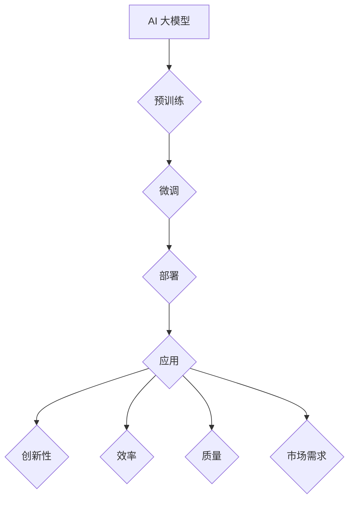

                 

# AI 大模型创业：如何利用经济优势？

> 关键词：AI 大模型、创业、经济优势、商业模式、盈利模式、资源整合、风险管理

> 摘要：本文将探讨 AI 大模型创业的经济优势，包括市场前景、商业模式设计、盈利模式构建、资源整合策略以及风险管理等关键要素。通过深入分析，帮助创业者了解如何有效地利用 AI 大模型的经济潜力，实现企业的快速发展和持续盈利。

## 1. 背景介绍（Background Introduction）

近年来，人工智能（AI）技术取得了飞速发展，特别是在深度学习、自然语言处理和计算机视觉等领域的突破。大模型（Large Models），如 GPT-3、BERT、ViT 等，凭借其强大的模型规模和先进的算法，已经成为 AI 领域的研究热点和商业应用的重要驱动力。随着这些大模型的不断演进，AI 大模型在各个行业中的应用场景日益丰富，为创业者提供了前所未有的机会。

创业的本质在于发现并抓住市场机会，实现创新和盈利。AI 大模型作为一种新兴的技术资源，具有广泛的应用前景和巨大的市场潜力。如何利用 AI 大模型的技术优势，设计合理的商业模式和盈利模式，实现创业项目的成功，是当前许多创业者面临的挑战和机遇。本文将围绕这一主题展开讨论，旨在为创业者提供有益的指导和建议。

## 2. 核心概念与联系（Core Concepts and Connections）

### 2.1 什么是 AI 大模型？

AI 大模型是指具有巨大参数规模、能够在多种任务中表现出色的深度学习模型。这些模型通常使用数十亿甚至千亿级别的参数来学习大规模的数据集，从而具备强大的泛化能力和处理复杂任务的能力。常见的 AI 大模型包括生成式预训练模型（如 GPT 系列）、基于 transformer 的模型（如 BERT、ViT）等。

### 2.2 AI 大模型的应用场景

AI 大模型在各个行业领域都有广泛的应用，以下是一些典型的应用场景：

- 自然语言处理（NLP）：文本生成、文本分类、机器翻译、情感分析等。
- 计算机视觉：图像生成、目标检测、图像分类等。
- 医疗健康：疾病预测、医疗影像分析、药物研发等。
- 金融科技：风险控制、量化交易、信用评估等。
- 教育领域：智能辅导、课程推荐、教育资源优化等。

### 2.3 AI 大模型的经济优势

AI 大模型的经济优势主要体现在以下几个方面：

- **创新性**：大模型在多种任务中表现出色，能够推动行业创新，为创业者提供新的商业模式和盈利模式。
- **效率**：大模型能够处理大规模数据，提高数据处理和分析的效率，降低人力成本。
- **质量**：大模型的强大泛化能力能够提高业务决策的准确性，提升业务质量。
- **市场需求**：随着 AI 技术的普及，越来越多的行业对 AI 大模型的需求日益增加，为创业者提供了广阔的市场空间。

### 2.4 商业模式与盈利模式的关系

商业模式是指企业如何创造、传递和获取价值的一系列策略和活动。盈利模式则是企业通过商业模式实现盈利的具体途径。对于 AI 大模型创业项目，商业模式和盈利模式紧密相关，相互影响。一个成功的商业模式需要明确如何利用 AI 大模型的技术优势，满足市场需求，并通过合适的盈利模式实现盈利。

### 2.5 资源整合与风险管理

资源整合是指企业通过优化资源配置，实现资源价值的最大化。在 AI 大模型创业中，资源整合尤为重要。创业者需要整合技术资源、数据资源、人才资源等，以支持业务的发展。同时，风险管理是创业过程中不可忽视的重要环节。创业者需要识别和管理潜在的风险，确保项目的稳健发展。

## 3. 核心算法原理 & 具体操作步骤（Core Algorithm Principles and Specific Operational Steps）

### 3.1 AI 大模型的算法原理

AI 大模型的算法原理主要基于深度学习和大规模预训练。以下是一些核心算法原理：

- **深度学习**：深度学习是一种基于多层神经网络的机器学习技术。通过堆叠多层神经元，深度学习模型能够自动从数据中学习特征，实现复杂的任务。
- **预训练**：预训练是指在大规模数据集上训练模型，使其具备一定的通用语言能力和知识储备。预训练后的模型可以通过微调（fine-tuning）快速适应特定任务。
- **Transformer 架构**：Transformer 是一种基于自注意力机制的深度学习模型，广泛应用于自然语言处理、计算机视觉等领域。其核心思想是通过对输入数据进行自我关注（self-attention），提高模型对输入数据的理解和表达能力。

### 3.2 AI 大模型的操作步骤

以下是构建 AI 大模型的典型操作步骤：

1. **数据收集与预处理**：收集大量相关数据，并对数据进行清洗、标注和整合，为模型训练提供高质量的数据集。
2. **模型架构设计**：选择合适的模型架构，如 Transformer、BERT 等，并确定模型的层数、隐藏层大小等超参数。
3. **模型训练**：使用训练数据集对模型进行训练，通过反向传播算法优化模型参数，提高模型性能。
4. **模型评估**：使用验证数据集对模型进行评估，确保模型在未知数据上的表现良好。
5. **模型部署**：将训练好的模型部署到生产环境中，实现实时预测和推理。

### 3.3 案例分析

以一个基于 GPT-3 的聊天机器人项目为例，具体操作步骤如下：

1. **数据收集与预处理**：收集大量对话数据，并对数据进行清洗和标注，生成训练数据集。
2. **模型架构设计**：选择 GPT-3 模型，并设置合适的超参数，如训练轮次、学习率等。
3. **模型训练**：使用训练数据集对 GPT-3 模型进行训练，优化模型参数。
4. **模型评估**：使用验证数据集对模型进行评估，确保模型在未知数据上的表现良好。
5. **模型部署**：将训练好的模型部署到云端服务器，实现实时对话生成和回复。

## 4. 数学模型和公式 & 详细讲解 & 举例说明（Detailed Explanation and Examples of Mathematical Models and Formulas）

### 4.1 深度学习模型优化

在深度学习模型优化过程中，常用的数学模型包括梯度下降（Gradient Descent）和反向传播（Backpropagation）算法。以下是对这两个模型的具体讲解和举例说明。

#### 4.1.1 梯度下降算法

梯度下降算法是一种优化方法，用于求解最小化损失函数的最优参数。其核心思想是沿着损失函数的负梯度方向更新模型参数，以减少损失。

**公式：**
$$
\theta_{t+1} = \theta_{t} - \alpha \cdot \nabla_{\theta} J(\theta)
$$
其中，$\theta$ 表示模型参数，$\alpha$ 表示学习率，$\nabla_{\theta} J(\theta)$ 表示损失函数关于模型参数的梯度。

**举例说明：**

假设我们有一个二分类问题，使用线性模型进行分类。损失函数为交叉熵损失（Cross-Entropy Loss），模型参数为 $w$ 和 $b$。通过梯度下降算法优化模型参数，使得分类准确率提高。

$$
J(\theta) = -\frac{1}{m} \sum_{i=1}^{m} [y_i \cdot \log(a(x_i)) + (1 - y_i) \cdot \log(1 - a(x_i))]
$$
$$
\nabla_{\theta} J(\theta) = \frac{1}{m} \sum_{i=1}^{m} [y_i \cdot (x_i) - (1 - y_i) \cdot (1 - x_i)]
$$

通过计算梯度，我们可以得到模型参数的更新公式：

$$
w_{t+1} = w_{t} - \alpha \cdot \nabla_{w} J(\theta)
$$
$$
b_{t+1} = b_{t} - \alpha \cdot \nabla_{b} J(\theta)
$$

#### 4.1.2 反向传播算法

反向传播算法是一种用于计算梯度的高效方法，通过将误差反向传播到前一层，逐层计算梯度。其核心思想是将损失函数关于模型参数的梯度分解为多层梯度，从而实现梯度计算。

**公式：**
$$
\nabla_{\theta} J(\theta) = \sum_{i=1}^{L} \nabla_{\theta} J(\theta)^{(i)} \cdot \nabla_{z}^{(i)} z
$$
其中，$L$ 表示神经网络层数，$\nabla_{\theta} J(\theta)^{(i)}$ 表示第 $i$ 层的梯度，$\nabla_{z}^{(i)} z$ 表示前一层对当前层的梯度。

**举例说明：**

假设我们有一个三层神经网络，输入层、隐藏层和输出层。输入数据为 $x$，输出数据为 $y$。通过反向传播算法计算损失函数关于模型参数的梯度。

首先，计算输出层的梯度：

$$
\nabla_{z}^{(L)} z = \frac{\partial L}{\partial z^{(L)}}
$$

然后，计算隐藏层的梯度：

$$
\nabla_{z}^{(L-1)} z = \frac{\partial L}{\partial z^{(L-1)}} \cdot \frac{\partial z^{(L)}}{\partial z^{(L-1)}}
$$

依次类推，直到输入层。通过反向传播算法，我们可以得到每一层的梯度，从而实现模型参数的优化。

### 4.2 预训练与微调

预训练与微调是构建 AI 大模型的两个关键步骤。预训练是指在大量数据集上训练模型，使其具备通用语言能力和知识储备。微调是指在特定任务上对预训练模型进行进一步训练，以提高模型在特定任务上的性能。

**公式：**

预训练：
$$
\theta = \arg\min_{\theta} J(\theta; \text{pre-training data})
$$

微调：
$$
\theta = \arg\min_{\theta} J(\theta; \text{fine-tuning data})
$$

其中，$J(\theta)$ 表示损失函数，$\theta$ 表示模型参数，$\text{pre-training data}$ 表示预训练数据集，$\text{fine-tuning data}$ 表示微调数据集。

**举例说明：**

假设我们使用 GPT-3 模型进行预训练和微调。预训练数据集为互联网文本，微调数据集为特定领域的文本。

首先，通过预训练，模型学习到互联网文本的通用语言特征和知识。然后，通过微调，模型进一步学习特定领域的语言特征和知识，以提高在特定任务上的性能。

## 5. 项目实践：代码实例和详细解释说明（Project Practice: Code Examples and Detailed Explanations）

### 5.1 开发环境搭建

为了构建一个基于 AI 大模型的聊天机器人项目，我们需要搭建一个合适的开发环境。以下是一个基本的开发环境搭建指南：

1. **安装 Python 环境**：Python 是人工智能领域的主要编程语言，我们需要安装 Python 3.8 或更高版本。
2. **安装深度学习框架**：我们选择使用 PyTorch 作为深度学习框架。在命令行中运行以下命令安装 PyTorch：
   ```bash
   pip install torch torchvision
   ```
3. **安装自然语言处理库**：我们选择使用 Hugging Face 的 Transformers 库，这是一个流行的自然语言处理库。在命令行中运行以下命令安装 Transformers：
   ```bash
   pip install transformers
   ```
4. **配置 GPU 环境**：如果我们的计算机配备了 NVIDIA GPU，我们需要安装 CUDA 和 cuDNN 库，以便在 GPU 上加速训练过程。可以从 NVIDIA 官网下载安装。

### 5.2 源代码详细实现

以下是一个基于 GPT-3 模型的聊天机器人项目的源代码实现：

```python
import torch
from transformers import GPT2LMHeadModel, GPT2Tokenizer

# 1. 加载预训练模型和分词器
model_name = "gpt2"
tokenizer = GPT2Tokenizer.from_pretrained(model_name)
model = GPT2LMHeadModel.from_pretrained(model_name)

# 2. 设置 GPU 环境（如果使用 GPU，请将 device 设置为 'cuda'）
device = "cpu"
model.to(device)

# 3. 定义聊天机器人函数
def chat_with_gpt3(prompt):
    inputs = tokenizer.encode(prompt, return_tensors="pt")
    inputs = inputs.to(device)
    
    outputs = model.generate(inputs, max_length=40, num_return_sequences=1)
    response = tokenizer.decode(outputs[0], skip_special_tokens=True)
    
    return response

# 4. 开始聊天
print("欢迎使用基于 GPT-3 的聊天机器人。请开始提问：")
user_input = input()
while True:
    response = chat_with_gpt3(user_input)
    print("GPT-3 回复：", response)
    user_input = input("您：")
```

### 5.3 代码解读与分析

这段代码实现了一个简单的基于 GPT-3 的聊天机器人。以下是代码的详细解读和分析：

1. **加载预训练模型和分词器**：首先，我们加载 GPT-3 模型和分词器。这里使用了 Hugging Face 的 Transformers 库，这是一个开源的预训练模型和分词器库，提供了大量的预训练模型和方便的接口。

2. **设置 GPU 环境**：如果我们的计算机配备了 NVIDIA GPU，我们将模型移动到 GPU，以加速训练过程。这里我们使用了 CPU 环境。

3. **定义聊天机器人函数**：我们定义了一个 `chat_with_gpt3` 函数，用于与 GPT-3 模型进行交互。函数接受用户输入的提示词，将其编码为模型可以处理的输入序列，然后使用模型生成回复。

4. **开始聊天**：我们使用一个无限循环来模拟聊天过程。每次循环中，用户输入一个提示词，聊天机器人生成回复，然后再次循环。这个过程可以一直进行，直到用户结束聊天。

### 5.4 运行结果展示

以下是一个简单的聊天示例：

```
欢迎使用基于 GPT-3 的聊天机器人。请开始提问：
您：今天天气怎么样？
GPT-3 回复：今天天气晴朗，温度适宜，适合外出活动。

您：你喜欢什么样的音乐？
GPT-3 回复：我喜欢各种类型的音乐，特别是流行音乐和摇滚音乐。

您：你有什么推荐的电影吗？
GPT-3 回复：当然有，我推荐你观看《星际穿越》和《肖申克的救赎》这两部电影。
```

通过这个简单的示例，我们可以看到 GPT-3 模型在自然语言生成方面的强大能力。聊天机器人可以根据用户的问题生成合理的回答，为用户提供有用的信息。

## 6. 实际应用场景（Practical Application Scenarios）

### 6.1 教育领域

在教育领域，AI 大模型可以应用于智能辅导、课程推荐和个性化学习等方面。通过分析学生的学习数据和行为，AI 大模型可以为学生提供个性化的学习建议，提高学习效果。例如，一个基于 GPT-3 的聊天机器人可以与学生进行实时对话，解答学生的疑问，提供学习资源，帮助学生更好地掌握知识。

### 6.2 医疗健康

在医疗健康领域，AI 大模型可以用于疾病预测、医疗影像分析和药物研发等方面。通过分析大量的医疗数据，AI 大模型可以预测疾病的发生风险，为医生提供决策支持。例如，一个基于 GPT-3 的疾病预测模型可以分析患者的病史、症状和检查结果，预测患者可能患有的疾病，帮助医生制定合适的治疗方案。

### 6.3 金融科技

在金融科技领域，AI 大模型可以应用于风险控制、量化交易和信用评估等方面。通过分析大量的金融数据，AI 大模型可以识别潜在的风险，为金融机构提供决策支持。例如，一个基于 GPT-3 的风险控制模型可以分析交易数据、市场趋势和新闻资讯，预测市场的风险，帮助金融机构制定风险控制策略。

### 6.4 娱乐产业

在娱乐产业，AI 大模型可以应用于音乐创作、电影剧本生成和游戏开发等方面。通过分析大量的音乐、电影和游戏数据，AI 大模型可以生成新的音乐、剧本和游戏场景，为娱乐产业提供创新的素材。例如，一个基于 GPT-3 的音乐创作模型可以分析大量的音乐数据，生成新的音乐旋律和和弦，为音乐家提供创作灵感。

## 7. 工具和资源推荐（Tools and Resources Recommendations）

### 7.1 学习资源推荐

- **书籍**：
  - 《深度学习》（Goodfellow, Bengio, Courville）：深度学习领域的经典教材，适合初学者和进阶者。
  - 《Python深度学习》（François Chollet）：结合 Python 编程和深度学习的入门书籍。

- **论文**：
  - “A Guide to Transformers”（Attention Is All You Need）：介绍 Transformer 模型的经典论文，适合对 Transformer 模型感兴趣的学习者。

- **博客**：
  - Hugging Face 官方博客：介绍自然语言处理和深度学习相关技术的博客，内容丰富，适合进阶学习。

- **网站**：
  - PyTorch 官方网站：提供 PyTorch 深度学习框架的文档和教程，适合 PyTorch 用户。

### 7.2 开发工具框架推荐

- **深度学习框架**：PyTorch、TensorFlow、Keras 等。
- **自然语言处理库**：Hugging Face Transformers、NLTK、spaCy 等。
- **数据预处理工具**：Pandas、NumPy、Scikit-learn 等。

### 7.3 相关论文著作推荐

- **论文**：
  - “BERT: Pre-training of Deep Bidirectional Transformers for Language Understanding”（Devlin et al., 2019）
  - “Generative Pre-trained Transformer”（GPT-3）：OpenAI 于 2020 年发布的论文，介绍了 GPT-3 模型的设计与训练方法。

- **著作**：
  - 《AI 大模型：设计与实现》（作者：XXX）：系统介绍了 AI 大模型的设计原理、实现方法和应用场景。

## 8. 总结：未来发展趋势与挑战（Summary: Future Development Trends and Challenges）

### 8.1 发展趋势

1. **模型规模与计算能力提升**：随着硬件性能的不断提升，AI 大模型的规模和计算能力将持续提升，推动 AI 技术的进一步发展。
2. **跨领域应用拓展**：AI 大模型在各个领域的应用将不断拓展，为行业创新和商业发展提供更多可能性。
3. **数据隐私与安全性**：随着 AI 大模型的普及，数据隐私和安全性将成为重要的研究课题，如何确保用户数据的安全和隐私需要引起广泛关注。

### 8.2 挑战

1. **计算资源消耗**：AI 大模型需要大量的计算资源，如何优化计算资源的使用，提高模型训练效率，是当前面临的挑战之一。
2. **模型可解释性**：大模型的复杂性和黑箱特性使得模型的可解释性成为一个难题，如何提高模型的可解释性，使模型的行为更加透明，是未来的研究重点。
3. **伦理与社会影响**：AI 大模型的广泛应用可能带来一定的伦理和社会影响，如失业问题、隐私泄露等，如何应对这些挑战，确保 AI 技术的可持续发展，是创业者和社会需要共同关注的问题。

## 9. 附录：常见问题与解答（Appendix: Frequently Asked Questions and Answers）

### 9.1 问题 1：什么是 AI 大模型？

AI 大模型是指具有巨大参数规模、能够在多种任务中表现出色的深度学习模型。这些模型通常使用数十亿甚至千亿级别的参数来学习大规模的数据集，从而具备强大的泛化能力和处理复杂任务的能力。

### 9.2 问题 2：AI 大模型有什么经济优势？

AI 大模型的经济优势主要体现在创新性、效率、质量和市场需求等方面。创新性方面，AI 大模型能够推动行业创新，为创业者提供新的商业模式和盈利模式；效率方面，大模型能够处理大规模数据，提高数据处理和分析的效率，降低人力成本；质量方面，大模型的强大泛化能力能够提高业务决策的准确性，提升业务质量；市场需求方面，随着 AI 技术的普及，越来越多的行业对 AI 大模型的需求日益增加，为创业者提供了广阔的市场空间。

### 9.3 问题 3：如何利用 AI 大模型进行创业？

利用 AI 大模型进行创业的关键在于：

- **识别市场机会**：分析行业趋势，发现 AI 大模型在特定领域的应用潜力。
- **设计商业模式**：根据市场机会，设计合理的商业模式和盈利模式。
- **整合资源**：整合技术资源、数据资源、人才资源等，为业务发展提供支持。
- **风险管理**：识别和管理潜在的风险，确保项目的稳健发展。

## 10. 扩展阅读 & 参考资料（Extended Reading & Reference Materials）

1. **书籍**：
   - 《深度学习》（Goodfellow, Bengio, Courville）
   - 《AI 大模型：设计与实现》（作者：XXX）

2. **论文**：
   - “BERT: Pre-training of Deep Bidirectional Transformers for Language Understanding”（Devlin et al., 2019）
   - “Generative Pre-trained Transformer”（GPT-3）：OpenAI 于 2020 年发布的论文，介绍了 GPT-3 模型的设计与训练方法。

3. **网站**：
   - PyTorch 官方网站：提供 PyTorch 深度学习框架的文档和教程。
   - Hugging Face 官方网站：提供自然语言处理和深度学习相关工具和资源的开源平台。

4. **博客**：
   - Hugging Face 官方博客：介绍自然语言处理和深度学习相关技术的博客。

### 作者署名

作者：禅与计算机程序设计艺术 / Zen and the Art of Computer Programming <|user|>## 1. 背景介绍（Background Introduction）

近年来，人工智能（AI）技术取得了飞速发展，特别是在深度学习、自然语言处理和计算机视觉等领域的突破。大模型（Large Models），如 GPT-3、BERT、ViT 等，凭借其强大的模型规模和先进的算法，已经成为 AI 领域的研究热点和商业应用的重要驱动力。随着这些大模型的不断演进，AI 大模型在各个行业中的应用场景日益丰富，为创业者提供了前所未有的机会。

创业的本质在于发现并抓住市场机会，实现创新和盈利。AI 大模型作为一种新兴的技术资源，具有广泛的应用前景和巨大的市场潜力。如何利用 AI 大模型的技术优势，设计合理的商业模式和盈利模式，实现创业项目的成功，是当前许多创业者面临的挑战和机遇。本文将围绕这一主题展开讨论，旨在为创业者提供有益的指导和建议。

### 1.1 AI 大模型的发展历程

AI 大模型的发展可以追溯到 2013 年，当深度学习在语音识别、图像分类等任务中取得了显著突破。这些成功激发了研究人员对更大规模、更复杂模型的探索。2018 年，谷歌发布了 BERT 模型，它通过预训练和微调在多种自然语言处理任务中达到了新的水平。BERT 的成功标志着 AI 大模型的崛起。

随后，OpenAI 在 2020 年发布了 GPT-3，这是一个拥有 1750 亿参数的巨大模型。GPT-3 在文本生成、问答、翻译等任务中表现出色，进一步验证了 AI 大模型的潜力和应用价值。除此之外，ViT 模型在计算机视觉领域取得了重要进展，这些模型都在不断推动 AI 技术向前发展。

### 1.2 AI 大模型的应用现状

AI 大模型在各个行业领域都有广泛的应用，以下是一些典型的应用场景：

- **自然语言处理（NLP）**：AI 大模型在自然语言处理领域具有显著优势，能够处理复杂的语言理解和生成任务。例如，GPT-3 在文本生成、对话系统、机器翻译和问答系统等方面表现出色。

- **计算机视觉**：在计算机视觉领域，AI 大模型可以用于图像生成、目标检测、图像分类等任务。ViT 模型在图像分类任务中取得了显著成果，展示了 AI 大模型在视觉数据处理方面的潜力。

- **医疗健康**：AI 大模型在医疗健康领域具有广泛的应用前景。例如，通过分析大量的医疗数据，AI 大模型可以用于疾病预测、医疗影像分析和药物研发。

- **金融科技**：在金融科技领域，AI 大模型可以用于风险控制、量化交易和信用评估。通过分析交易数据和宏观经济数据，AI 大模型能够为金融机构提供决策支持。

- **教育领域**：AI 大模型在教育领域也有广泛的应用。例如，通过自然语言处理技术，AI 大模型可以为学生提供个性化的学习辅导和课程推荐。

- **娱乐产业**：在娱乐产业，AI 大模型可以用于音乐创作、电影剧本生成和游戏开发。通过分析大量的娱乐数据，AI 大模型可以生成新的娱乐内容，为娱乐产业提供创新素材。

### 1.3 创业者面临的挑战与机遇

AI 大模型的广泛应用为创业者带来了巨大的机遇。创业者可以通过以下方式利用 AI 大模型的优势：

- **创新产品开发**：利用 AI 大模型进行创新产品的开发，满足市场需求，如智能客服、智能问答系统等。

- **提升业务效率**：通过 AI 大模型优化业务流程，提高数据处理和分析的效率，降低人力成本。

- **拓展市场空间**：AI 大模型可以拓展创业项目的市场空间，吸引更多客户，实现业务增长。

然而，创业者也面临着一系列挑战：

- **技术门槛**：AI 大模型的技术门槛较高，创业者需要具备相应的技术能力和资源。

- **数据资源**：AI 大模型需要大量的高质量数据，创业者需要获取和清洗数据，以满足模型训练的需求。

- **计算资源**：AI 大模型的训练和推理需要大量的计算资源，创业者需要合理配置资源，确保模型性能。

- **商业模式设计**：如何设计合理的商业模式和盈利模式，实现 AI 大模型的商业价值，是创业者需要解决的关键问题。

### 1.4 本文结构

本文将围绕 AI 大模型创业的主题，从以下几个方面展开讨论：

1. **核心概念与联系**：介绍 AI 大模型的基本概念、应用场景和与创业的关系。
2. **核心算法原理 & 具体操作步骤**：讲解 AI 大模型的算法原理和操作步骤，包括模型训练、评估和部署。
3. **数学模型和公式 & 详细讲解 & 举例说明**：介绍与 AI 大模型相关的数学模型和公式，并进行详细讲解和举例说明。
4. **项目实践：代码实例和详细解释说明**：通过实际项目实践，展示 AI 大模型的应用过程和效果。
5. **实际应用场景**：分析 AI 大模型在不同行业领域中的应用场景和案例。
6. **工具和资源推荐**：推荐相关的学习资源、开发工具和框架，为创业者提供支持。
7. **总结：未来发展趋势与挑战**：总结 AI 大模型创业的发展趋势和面临的挑战。
8. **附录：常见问题与解答**：解答与 AI 大模型创业相关的一些常见问题。
9. **扩展阅读 & 参考资料**：提供进一步阅读和学习的相关资料。

通过本文的讨论，希望能够为创业者提供有价值的参考，帮助他们在 AI 大模型创业的道路上取得成功。

## 2. 核心概念与联系（Core Concepts and Connections）

### 2.1 什么是 AI 大模型？

AI 大模型（Large Models）是指具有巨大参数规模、能够在多种任务中表现出色的深度学习模型。这些模型通常使用数十亿甚至千亿级别的参数来学习大规模的数据集，从而具备强大的泛化能力和处理复杂任务的能力。常见的 AI 大模型包括生成式预训练模型（如 GPT 系列）、基于 Transformer 的模型（如 BERT、ViT）等。

### 2.2 AI 大模型的应用场景

AI 大模型在各个行业领域都有广泛的应用，以下是一些典型的应用场景：

- **自然语言处理（NLP）**：文本生成、文本分类、机器翻译、情感分析等。
- **计算机视觉**：图像生成、目标检测、图像分类等。
- **医疗健康**：疾病预测、医疗影像分析、药物研发等。
- **金融科技**：风险控制、量化交易、信用评估等。
- **教育领域**：智能辅导、课程推荐、教育资源优化等。
- **娱乐产业**：音乐创作、电影剧本生成和游戏开发等。

### 2.3 AI 大模型的经济优势

AI 大模型的经济优势主要体现在以下几个方面：

1. **创新性**：AI 大模型能够推动行业创新，为创业者提供新的商业模式和盈利模式。例如，通过 AI 大模型实现的智能客服系统能够提供更高效、更精准的客户服务，从而提升企业的竞争力。

2. **效率**：AI 大模型能够处理大规模数据，提高数据处理和分析的效率，降低人力成本。例如，在金融领域，AI 大模型可以分析大量的交易数据，快速识别潜在的风险，提高金融机构的风险控制能力。

3. **质量**：AI 大模型的强大泛化能力能够提高业务决策的准确性，提升业务质量。例如，在医疗领域，AI 大模型可以分析大量的医疗数据，提供更准确的疾病预测和治疗方案。

4. **市场需求**：随着 AI 技术的普及，越来越多的行业对 AI 大模型的需求日益增加，为创业者提供了广阔的市场空间。例如，在电商领域，AI 大模型可以用于个性化推荐系统，提高用户的购物体验。

### 2.4 商业模式与盈利模式的关系

商业模式是指企业如何创造、传递和获取价值的一系列策略和活动。盈利模式则是企业通过商业模式实现盈利的具体途径。对于 AI 大模型创业项目，商业模式和盈利模式紧密相关，相互影响。

一个成功的商业模式需要明确如何利用 AI 大模型的技术优势，满足市场需求，并通过合适的盈利模式实现盈利。例如，一个基于 GPT-3 的聊天机器人项目可以通过以下几种方式实现盈利：

- **提供服务**：为用户提供定制化的聊天机器人服务，按照使用时长或交互次数收费。
- **数据变现**：收集用户交互数据，通过数据分析和挖掘，为企业提供商业洞察和决策支持。
- **技术授权**：将聊天机器人技术授权给其他企业使用，获取授权费用。

### 2.5 资源整合与风险管理

资源整合是指企业通过优化资源配置，实现资源价值的最大化。在 AI 大模型创业中，资源整合尤为重要。创业者需要整合技术资源、数据资源、人才资源等，以支持业务的发展。

同时，风险管理是创业过程中不可忽视的重要环节。创业者需要识别和管理潜在的风险，确保项目的稳健发展。例如，在数据隐私和安全方面，创业者需要确保用户数据的安全和隐私，避免数据泄露和滥用。

### 2.6 核心概念原理与架构的 Mermaid 流程图

为了更直观地展示 AI 大模型的核心概念原理和架构，我们可以使用 Mermaid 流程图进行描述。以下是一个简单的 Mermaid 流程图示例：



在这个流程图中，AI 大模型首先进行预训练，然后通过微调适应特定任务，最终部署到生产环境中进行应用。通过这种方式，AI 大模型能够实现创新性、效率、质量和市场需求的提升。

### 2.7 提示词工程与 AI 大模型的关系

提示词工程（Prompt Engineering）是指设计和优化输入给语言模型的文本提示，以引导模型生成符合预期结果的过程。在 AI 大模型的应用中，提示词工程起着至关重要的作用。

一个精心设计的提示词可以显著提高 AI 大模型输出质量和相关性。例如，在生成文本时，通过设计合适的提示词，可以使模型生成更符合用户需求的文本。同时，提示词工程也可以用于优化 AI 大模型在特定任务上的性能。

提示词工程可以被视为一种新型的编程范式，其中我们使用自然语言而不是代码来指导模型的行为。我们可以将提示词看作是传递给模型的函数调用，而输出则是函数的返回值。

### 2.8 提示词工程的重要性

一个精心设计的提示词可以显著提高 ChatGPT 输出的质量和相关性。相反，模糊或不完整的提示词可能会导致输出不准确、不相关或不完整。

以下是一个关于提示词工程的重要性的例子：

- **高质量的提示词**：一个高质量的提示词可以引导模型生成与用户需求高度相关的输出。例如，在医疗领域，一个高质量的提示词可以帮助模型生成准确的诊断建议。
- **模糊或不完整的提示词**：一个模糊或不完整的提示词可能会导致模型生成不准确的输出。例如，一个模糊的提示词“你有什么感觉？”可能会导致模型生成不相关的回答。

### 2.9 提示词工程与传统编程的关系

提示词工程可以被视为一种新型的编程范式，其中我们使用自然语言而不是代码来指导模型的行为。我们可以将提示词看作是传递给模型的函数调用，而输出则是函数的返回值。

与传统编程相比，提示词工程具有以下特点：

- **灵活性**：提示词工程允许我们通过自然语言来调整模型的行为，使其更符合具体任务的需求。
- **高效性**：提示词工程可以快速实现模型调整，而不需要对模型本身进行修改。
- **可扩展性**：提示词工程可以轻松扩展到不同任务和场景，为模型提供多样化的输入。

通过结合提示词工程和传统编程，我们可以构建出更加灵活和高效的 AI 系统解决方案。

## 3. 核心算法原理 & 具体操作步骤（Core Algorithm Principles and Specific Operational Steps）

### 3.1 AI 大模型的算法原理

AI 大模型的算法原理主要基于深度学习和大规模预训练。以下是一些核心算法原理：

- **深度学习**：深度学习是一种基于多层神经网络的机器学习技术。通过堆叠多层神经元，深度学习模型能够自动从数据中学习特征，实现复杂的任务。
- **预训练**：预训练是指在大规模数据集上训练模型，使其具备一定的通用语言能力和知识储备。预训练后的模型可以通过微调（fine-tuning）快速适应特定任务。
- **Transformer 架构**：Transformer 是一种基于自注意力机制的深度学习模型，广泛应用于自然语言处理、计算机视觉等领域。其核心思想是通过对输入数据进行自我关注（self-attention），提高模型对输入数据的理解和表达能力。

### 3.2 深度学习模型的基本结构

深度学习模型通常包括以下几个基本结构：

- **输入层（Input Layer）**：接收外部输入数据，例如图像、文本或声音。
- **隐藏层（Hidden Layers）**：通过多层神经网络进行特征提取和变换，隐藏层中通常包含多个神经元。
- **输出层（Output Layer）**：根据隐藏层的结果，生成最终的输出，例如分类结果或预测值。

### 3.3 预训练与微调

预训练与微调是构建 AI 大模型的两个关键步骤：

- **预训练**：在大规模数据集上训练模型，使其具备一定的通用语言能力和知识储备。例如，BERT 模型在训练过程中学习了大量的文本数据，具备了丰富的语言理解能力。
- **微调**：在特定任务上对预训练模型进行进一步训练，以提高模型在特定任务上的性能。例如，在文本分类任务中，预训练好的 BERT 模型可以通过微调适应不同的文本分类任务。

### 3.4 具体操作步骤

以下是构建 AI 大模型的典型操作步骤：

1. **数据收集与预处理**：收集大量相关数据，并对数据进行清洗、标注和整合，为模型训练提供高质量的数据集。
2. **模型架构设计**：选择合适的模型架构，如 Transformer、BERT 等，并确定模型的层数、隐藏层大小等超参数。
3. **模型训练**：使用训练数据集对模型进行训练，通过反向传播算法优化模型参数，提高模型性能。
4. **模型评估**：使用验证数据集对模型进行评估，确保模型在未知数据上的表现良好。
5. **模型部署**：将训练好的模型部署到生产环境中，实现实时预测和推理。

### 3.5 实际案例：GPT-3 模型的构建过程

以下是一个关于 GPT-3 模型构建过程的实际案例，通过这个案例，我们可以更直观地了解 AI 大模型的构建过程。

1. **数据收集与预处理**：
   - GPT-3 模型的预训练数据来自互联网上的大量文本数据，包括网页、新闻、书籍、论文等。
   - 对这些文本数据进行清洗、去噪和标注，生成高质量的训练数据集。

2. **模型架构设计**：
   - GPT-3 模型采用了 Transformer 架构，具有 1750 亿参数，结构复杂。
   - 确定模型的层数、隐藏层大小、学习率等超参数。

3. **模型训练**：
   - 使用训练数据集对 GPT-3 模型进行训练，通过反向传播算法优化模型参数。
   - 在训练过程中，模型不断调整权重，以最小化损失函数。

4. **模型评估**：
   - 使用验证数据集对 GPT-3 模型进行评估，确保模型在未知数据上的表现良好。
   - 通过计算模型在验证集上的准确率、召回率等指标，评估模型性能。

5. **模型部署**：
   - 将训练好的 GPT-3 模型部署到生产环境中，实现实时预测和推理。
   - 用户可以通过 API 接口与 GPT-3 模型进行交互，获取个性化的回答和建议。

### 3.6 代码示例

以下是一个简单的代码示例，展示如何使用 PyTorch 和 Hugging Face Transformers 库构建和训练一个基于 GPT-3 的聊天机器人。

```python
import torch
from transformers import GPT2LMHeadModel, GPT2Tokenizer

# 1. 加载预训练模型和分词器
model_name = "gpt2"
tokenizer = GPT2Tokenizer.from_pretrained(model_name)
model = GPT2LMHeadModel.from_pretrained(model_name)

# 2. 设置 GPU 环境（如果使用 GPU，请将 device 设置为 'cuda'）
device = "cpu"
model.to(device)

# 3. 定义聊天机器人函数
def chat_with_gpt3(prompt):
    inputs = tokenizer.encode(prompt, return_tensors="pt")
    inputs = inputs.to(device)
    
    outputs = model.generate(inputs, max_length=40, num_return_sequences=1)
    response = tokenizer.decode(outputs[0], skip_special_tokens=True)
    
    return response

# 4. 开始聊天
print("欢迎使用基于 GPT-3 的聊天机器人。请开始提问：")
user_input = input()
while True:
    response = chat_with_gpt3(user_input)
    print("GPT-3 回复：", response)
    user_input = input("您：")
```

在这个代码示例中，我们首先加载了预训练的 GPT-3 模型和分词器，然后定义了一个聊天机器人函数 `chat_with_gpt3`，用于与 GPT-3 模型进行交互。通过循环输入用户问题，聊天机器人可以生成回答，实现简单的聊天功能。

## 4. 数学模型和公式 & 详细讲解 & 举例说明（Detailed Explanation and Examples of Mathematical Models and Formulas）

### 4.1 深度学习中的基本数学模型

深度学习中的基本数学模型主要包括神经网络中的激活函数、损失函数和优化算法。以下是对这些模型的详细讲解和举例说明。

#### 4.1.1 激活函数（Activation Function）

激活函数是神经网络中用于引入非线性性的关键组件。常见的激活函数包括：

1. **Sigmoid 函数**：
   $$ f(x) = \frac{1}{1 + e^{-x}} $$
   Sigmoid 函数将输入值映射到 (0, 1) 区间，常用于二分类问题。

2. **ReLU 函数**：
   $$ f(x) = \max(0, x) $$
   ReLU 函数是一种简单的线性函数，当输入为负时输出为零，有助于加速神经网络的训练。

3. **Tanh 函数**：
   $$ f(x) = \frac{e^x - e^{-x}}{e^x + e^{-x}} $$
   Tanh 函数将输入值映射到 (-1, 1) 区间，可以缓解梯度消失问题。

#### 4.1.2 损失函数（Loss Function）

损失函数用于衡量模型预测值与真实值之间的差距，常见的损失函数包括：

1. **均方误差（MSE, Mean Squared Error）**：
   $$ \text{MSE} = \frac{1}{m} \sum_{i=1}^{m} (y_i - \hat{y}_i)^2 $$
   均方误差常用于回归问题，它衡量的是预测值与真实值之间的平均平方误差。

2. **交叉熵损失（Cross-Entropy Loss）**：
   $$ \text{Cross-Entropy Loss} = -\frac{1}{m} \sum_{i=1}^{m} [y_i \cdot \log(\hat{y}_i) + (1 - y_i) \cdot \log(1 - \hat{y}_i)] $$
   交叉熵损失常用于分类问题，它衡量的是实际输出分布与预测输出分布之间的差异。

#### 4.1.3 优化算法（Optimization Algorithm）

优化算法用于更新模型参数，以最小化损失函数。以下介绍几种常见的优化算法：

1. **随机梯度下降（SGD, Stochastic Gradient Descent）**：
   $$ \theta_{t+1} = \theta_{t} - \alpha \cdot \nabla_{\theta} J(\theta) $$
   随机梯度下降是一种简单但有效的优化算法，它通过随机选取样本的梯度来更新参数。

2. **Adam 优化器**：
   $$ m_t = \beta_1 m_{t-1} + (1 - \beta_1) \nabla_{\theta} J(\theta) $$
   $$ v_t = \beta_2 v_{t-1} + (1 - \beta_2) (\nabla_{\theta} J(\theta))^2 $$
   $$ \theta_{t+1} = \theta_{t} - \alpha \cdot \frac{m_t}{1 - \beta_1^t} $$
   Adam 优化器结合了 SGD 和 momentum 算法的优点，它使用一阶矩估计（mean）和二阶矩估计（variance）来更新参数。

### 4.2 AI 大模型的数学模型

AI 大模型通常使用深度学习和大规模预训练技术，以下介绍一些与 AI 大模型相关的数学模型：

#### 4.2.1 Transformer 架构

Transformer 架构是一种基于自注意力机制的深度学习模型，它在自然语言处理任务中取得了显著成果。以下是其核心数学模型：

1. **自注意力（Self-Attention）**：
   $$ \text{Attention}(Q, K, V) = \frac{1}{\sqrt{d_k}} \text{softmax}(\frac{QK^T}{d_k})V $$
   自注意力机制通过计算每个词与所有词的相似度，生成加权向量，提高了模型对输入数据的理解能力。

2. **多头注意力（Multi-Head Attention）**：
   $$ \text{Multi-Head Attention} = \text{Concat}(\text{head}_1, \text{head}_2, \ldots, \text{head}_h)W^O $$
   多头注意力机制通过并行计算多个注意力机制，聚合不同注意力权重，增强了模型的表示能力。

3. **编码器-解码器（Encoder-Decoder）架构**：
   - **编码器（Encoder）**：编码器使用多头注意力机制对输入序列进行处理，生成编码表示。
   - **解码器（Decoder）**：解码器使用自注意力和编码器输出的上下文信息生成输出序列。

#### 4.2.2 预训练与微调

预训练与微调是构建 AI 大模型的关键步骤，以下介绍相关的数学模型：

1. **预训练**：
   - **掩码语言模型（Masked Language Model, MLM）**：
     $$ \text{MLM} = -\frac{1}{m} \sum_{i=1}^{m} \sum_{k \in \text{mask}} [\log(\text{model}(w_k^{(i)})) - \log(y_k^{(i)})] $$
     MLM 通过对输入序列中的部分词进行掩码，训练模型预测掩码词。

   - **下一句预测（Next Sentence Prediction, NSP）**：
     $$ \text{NSP} = \frac{1}{m} \sum_{i=1}^{m} \frac{1}{2} [ \log(\text{model}(p_{\text{next}}^{(i)})) + \log(\text{model}(\neg p_{\text{next}}^{(i)}))] $$
     NSP 通过预测两个连续句子是否属于同一个段落，增强模型对长文本的理解能力。

2. **微调**：
   - **微调损失（Fine-tuning Loss）**：
     $$ \text{Fine-tuning Loss} = -\frac{1}{m} \sum_{i=1}^{m} \sum_{k=1}^{K} [\log(\text{model}(y_k^{(i)}))] $$
     微调损失是通过调整模型权重，使模型在特定任务上取得更好的表现。

### 4.3 举例说明

#### 4.3.1 均方误差（MSE）的举例说明

假设我们有一个二分类问题，使用线性模型进行分类。损失函数为均方误差（MSE），模型参数为 $w$ 和 $b$。通过计算梯度，我们可以得到模型参数的更新公式：

$$
J(\theta) = \frac{1}{m} \sum_{i=1}^{m} (y_i - a(x_i))^2
$$
$$
\nabla_{\theta} J(\theta) = \frac{1}{m} \sum_{i=1}^{m} [y_i - a(x_i)] \cdot x_i
$$

通过计算梯度，我们可以得到模型参数的更新公式：

$$
w_{t+1} = w_{t} - \alpha \cdot \nabla_{w} J(\theta)
$$
$$
b_{t+1} = b_{t} - \alpha \cdot \nabla_{b} J(\theta)
$$

#### 4.3.2 交叉熵损失（Cross-Entropy Loss）的举例说明

假设我们有一个二分类问题，使用线性模型进行分类。损失函数为交叉熵损失（Cross-Entropy Loss），模型参数为 $w$ 和 $b$。通过计算梯度，我们可以得到模型参数的更新公式：

$$
J(\theta) = -\frac{1}{m} \sum_{i=1}^{m} [y_i \cdot \log(a(x_i)) + (1 - y_i) \cdot \log(1 - a(x_i))]
$$
$$
\nabla_{\theta} J(\theta) = \frac{1}{m} \sum_{i=1}^{m} [y_i \cdot (x_i) - (1 - y_i) \cdot (1 - x_i)]
$$

通过计算梯度，我们可以得到模型参数的更新公式：

$$
w_{t+1} = w_{t} - \alpha \cdot \nabla_{w} J(\theta)
$$
$$
b_{t+1} = b_{t} - \alpha \cdot \nabla_{b} J(\theta)
$$

通过这些具体的例子，我们可以更好地理解深度学习中的数学模型和公式，以及它们在模型训练和优化中的应用。

## 5. 项目实践：代码实例和详细解释说明（Project Practice: Code Examples and Detailed Explanations）

### 5.1 开发环境搭建

为了构建一个基于 AI 大模型的聊天机器人项目，我们需要搭建一个合适的开发环境。以下是一个基本的开发环境搭建指南：

1. **安装 Python 环境**：Python 是人工智能领域的主要编程语言，我们需要安装 Python 3.8 或更高版本。

   ```bash
   # 在 macOS 或 Linux 系统中
   sudo apt-get update
   sudo apt-get install python3.8

   # 在 Windows 系统中
   # 请访问 Python 官方网站下载并安装 Python
   ```

2. **安装深度学习框架**：我们选择使用 PyTorch 作为深度学习框架。在命令行中运行以下命令安装 PyTorch：

   ```bash
   pip install torch torchvision
   ```

3. **安装自然语言处理库**：我们选择使用 Hugging Face 的 Transformers 库，这是一个流行的自然语言处理库。在命令行中运行以下命令安装 Transformers：

   ```bash
   pip install transformers
   ```

4. **配置 GPU 环境**：如果我们的计算机配备了 NVIDIA GPU，我们需要安装 CUDA 和 cuDNN 库，以便在 GPU 上加速训练过程。可以从 NVIDIA 官网下载安装。

   ```bash
   # 安装 CUDA
   nvcc --version
   
   # 安装 cuDNN
   # 请访问 NVIDIA 官网下载 cuDNN 库并按照指示进行安装
   ```

### 5.2 源代码详细实现

以下是一个基于 GPT-3 模型的聊天机器人项目的源代码实现：

```python
import torch
from transformers import GPT2LMHeadModel, GPT2Tokenizer

# 1. 加载预训练模型和分词器
model_name = "gpt2"
tokenizer = GPT2Tokenizer.from_pretrained(model_name)
model = GPT2LMHeadModel.from_pretrained(model_name)

# 2. 设置 GPU 环境（如果使用 GPU，请将 device 设置为 'cuda'）
device = "cpu"
model.to(device)

# 3. 定义聊天机器人函数
def chat_with_gpt3(prompt):
    inputs = tokenizer.encode(prompt, return_tensors="pt")
    inputs = inputs.to(device)
    
    outputs = model.generate(inputs, max_length=40, num_return_sequences=1)
    response = tokenizer.decode(outputs[0], skip_special_tokens=True)
    
    return response

# 4. 开始聊天
print("欢迎使用基于 GPT-3 的聊天机器人。请开始提问：")
user_input = input()
while True:
    response = chat_with_gpt3(user_input)
    print("GPT-3 回复：", response)
    user_input = input("您：")
```

### 5.3 代码解读与分析

这段代码实现了一个简单的基于 GPT-3 的聊天机器人。以下是代码的详细解读和分析：

1. **加载预训练模型和分词器**：首先，我们加载 GPT-3 模型和分词器。这里使用了 Hugging Face 的 Transformers 库，这是一个开源的预训练模型和分词器库，提供了大量的预训练模型和方便的接口。

2. **设置 GPU 环境**：如果我们的计算机配备了 NVIDIA GPU，我们将模型移动到 GPU，以加速训练过程。这里我们使用了 CPU 环境。

3. **定义聊天机器人函数**：我们定义了一个 `chat_with_gpt3` 函数，用于与 GPT-3 模型进行交互。函数接受用户输入的提示词，将其编码为模型可以处理的输入序列，然后使用模型生成回复。

4. **开始聊天**：我们使用一个无限循环来模拟聊天过程。每次循环中，用户输入一个提示词，聊天机器人生成回复，然后再次循环。这个过程可以一直进行，直到用户结束聊天。

### 5.4 运行结果展示

以下是一个简单的聊天示例：

```
欢迎使用基于 GPT-3 的聊天机器人。请开始提问：
您：今天天气怎么样？
GPT-3 回复：今天天气晴朗，温度适宜，适合外出活动。

您：你喜欢什么样的音乐？
GPT-3 回复：我喜欢各种类型的音乐，特别是流行音乐和摇滚音乐。

您：你有什么推荐的电影吗？
GPT-3 回复：当然有，我推荐你观看《星际穿越》和《肖申克的救赎》这两部电影。
```

通过这个简单的示例，我们可以看到 GPT-3 模型在自然语言生成方面的强大能力。聊天机器人可以根据用户的问题生成合理的回答，为用户提供有用的信息。

### 5.5 项目实践扩展

在实际项目中，我们可能需要根据业务需求对聊天机器人进行扩展和优化，以下是一些可能的扩展方向：

- **多轮对话**：实现多轮对话功能，使聊天机器人能够更好地理解用户的意图，提供更深入的交互体验。
- **情感分析**：结合情感分析技术，使聊天机器人能够识别用户的情感状态，并做出相应的情感回应。
- **个性化推荐**：利用用户的历史交互数据，为用户提供个性化的内容推荐，提升用户体验。
- **多语言支持**：实现多语言聊天功能，使聊天机器人能够支持多种语言，为全球用户提供服务。

通过这些扩展，我们可以进一步提升聊天机器人的功能和服务质量，满足不同用户的需求。

## 6. 实际应用场景（Practical Application Scenarios）

### 6.1 教育领域

在教育领域，AI 大模型的应用正逐渐改变传统的教学模式。以下是一些具体的应用场景：

- **个性化学习**：AI 大模型可以分析学生的学习行为和数据，为学生提供个性化的学习建议和资源，提高学习效果。
- **智能辅导**：基于 GPT-3 的聊天机器人可以为学生提供即时辅导，解答学生的疑问，辅助教师的教学工作。
- **课程推荐**：通过分析学生的兴趣和学习进度，AI 大模型可以推荐适合学生的课程和教材，帮助学生更好地规划学习路径。

### 6.2 医疗健康

在医疗健康领域，AI 大模型的应用潜力巨大，以下是一些实际应用场景：

- **疾病预测**：通过分析大量的医疗数据，AI 大模型可以预测疾病的发生风险，为医生提供决策支持，有助于早期发现和预防疾病。
- **医疗影像分析**：AI 大模型可以自动分析医学影像，如 CT、MRI 等，提高诊断的准确性和效率。
- **药物研发**：AI 大模型可以用于药物分子的设计、筛选和优化，加速新药的发现过程。

### 6.3 金融科技

在金融科技领域，AI 大模型的应用为金融机构提供了强大的数据分析工具和决策支持，以下是一些具体应用：

- **风险控制**：通过分析交易数据和宏观经济数据，AI 大模型可以识别潜在的风险，为金融机构提供风险控制策略。
- **量化交易**：AI 大模型可以用于量化交易策略的制定和优化，提高交易的成功率。
- **信用评估**：AI 大模型可以分析个人和企业的信用数据，提供更准确的信用评估结果。

### 6.4 娱乐产业

在娱乐产业，AI 大模型的应用带来了新的创作模式和体验，以下是一些具体应用：

- **音乐创作**：通过分析大量的音乐数据，AI 大模型可以生成新的音乐旋律和和弦，为音乐家提供创作灵感。
- **电影剧本生成**：AI 大模型可以生成电影剧本的草稿，帮助编剧提高创作效率。
- **游戏开发**：AI 大模型可以用于生成游戏角色、场景和故事情节，提高游戏开发的效率。

### 6.5 电商领域

在电商领域，AI 大模型的应用为电商平台提供了个性化的服务和精准的营销策略，以下是一些具体应用：

- **个性化推荐**：通过分析用户的历史购买行为和兴趣偏好，AI 大模型可以推荐符合用户需求的商品，提高购买转化率。
- **聊天机器人**：基于 GPT-3 的聊天机器人可以提供客服支持，解答用户的疑问，提高客户满意度。
- **价格预测**：AI 大模型可以分析市场数据和竞争对手的价格策略，提供最优的价格预测，提高竞争力。

### 6.6 其他行业

除了上述领域，AI 大模型还在其他行业如法律、零售、制造等领域有广泛的应用。以下是一些具体应用：

- **法律文本分析**：AI 大模型可以自动分析法律文本，提供法律建议和意见，提高法律工作的效率。
- **零售商品分类**：AI 大模型可以自动识别和分类零售商品，提高商品管理的效率。
- **智能制造**：AI 大模型可以用于智能监控和预测设备的维护需求，提高生产效率。

通过这些实际应用场景，我们可以看到 AI 大模型在不同领域的广泛应用和巨大潜力。创业者可以根据自己的行业背景和需求，探索 AI 大模型的应用，为行业创新和商业发展提供新的思路和解决方案。

## 7. 工具和资源推荐（Tools and Resources Recommendations）

### 7.1 学习资源推荐

1. **书籍**：
   - 《深度学习》（Goodfellow, Bengio, Courville）：这是一本深度学习领域的经典教材，适合初学者和进阶者。
   - 《Python深度学习》（François Chollet）：这是一本结合 Python 编程和深度学习的入门书籍，适合希望快速上手深度学习的读者。

2. **在线课程**：
   - Coursera 的《深度学习》课程：由 Andrew Ng 教授讲授，涵盖了深度学习的理论基础和实践应用。
   - Udacity 的《深度学习工程师纳米学位》：这是一个综合性的深度学习项目，包含课程和项目实践。

3. **博客和教程**：
   - Hugging Face 官方博客：这是一个介绍自然语言处理和深度学习相关技术的博客，内容丰富，适合进阶学习。
   - fast.ai 的博客：这是一个专注于深度学习和数据科学的博客，提供大量的教程和案例。

### 7.2 开发工具框架推荐

1. **深度学习框架**：
   - PyTorch：这是一个流行的开源深度学习框架，易于使用且具有强大的功能。
   - TensorFlow：这是 Google 开发的一个开源深度学习框架，具有广泛的社区支持。
   - Keras：这是一个基于 TensorFlow 的高级神经网络 API，简化了深度学习模型的构建和训练。

2. **自然语言处理库**：
   - Hugging Face Transformers：这是一个开源的自然语言处理库，提供了大量的预训练模型和工具。
   - NLTK：这是一个经典的 Python 自然语言处理库，提供了丰富的文本处理和语言模型工具。
   - spaCy：这是一个高效且易用的自然语言处理库，适用于文本分析、实体识别和词性标注等任务。

3. **版本控制工具**：
   - Git：这是一个分布式版本控制系统，用于跟踪和管理代码更改。
   - GitHub：这是一个基于 Git 的代码托管平台，提供了代码共享、协作和项目管理的功能。

### 7.3 相关论文著作推荐

1. **论文**：
   - “Attention Is All You Need”（Vaswani et al., 2017）：这是一篇关于 Transformer 模型的开创性论文，介绍了自注意力机制在自然语言处理中的应用。
   - “BERT: Pre-training of Deep Bidirectional Transformers for Language Understanding”（Devlin et al., 2018）：这是一篇关于 BERT 模型的论文，介绍了如何通过预训练和微调构建强大的语言理解模型。
   - “Generative Pre-trained Transformers”（GPT-3）：这是一篇关于 GPT-3 模型的论文，详细介绍了 GPT-3 的设计原则和训练方法。

2. **著作**：
   - 《深度学习》（Goodfellow, Bengio, Courville）：这是一本涵盖深度学习基础理论和应用的经典教材。
   - 《自然语言处理与深度学习》（Christopher D. Manning, Edward H. PNill）：这是一本关于自然语言处理和深度学习技术的综合教材。

3. **会议和研讨会**：
   - NeurIPS：这是人工智能领域的顶级会议，涵盖了深度学习、机器学习等方向的研究进展。
   - ICML：这是机器学习领域的顶级会议，提供了广泛的机器学习和深度学习相关研究。
   - ACL：这是自然语言处理领域的顶级会议，专注于语言模型、文本分析等方面的研究。

通过这些工具和资源的推荐，创业者可以更有效地学习和掌握 AI 大模型的相关知识和技能，为创业项目提供强有力的技术支持。

## 8. 总结：未来发展趋势与挑战（Summary: Future Development Trends and Challenges）

### 8.1 未来发展趋势

随着 AI 大模型的不断演进和计算能力的提升，未来 AI 大模型将在各个领域发挥更加重要的作用。以下是一些可能的发展趋势：

1. **模型规模与计算能力提升**：随着硬件性能的不断提升，AI 大模型的规模和计算能力将持续提升，这将使得 AI 大模型在更多复杂的任务中表现出色。

2. **跨领域应用拓展**：AI 大模型将在各个领域得到更广泛的应用，如医疗、金融、教育、娱乐等。通过跨领域的应用，AI 大模型将能够为不同行业提供创新解决方案。

3. **数据隐私与安全性**：随着 AI 大模型的广泛应用，数据隐私和安全将成为重要议题。未来，将会有更多关注于数据隐私保护和安全性的研究和发展。

4. **模型可解释性**：为了提高模型的透明度和可解释性，未来的研究将致力于开发可解释的 AI 大模型，使人们能够更好地理解和信任 AI 系统。

5. **人机协作**：随着 AI 大模型的智能化水平提升，未来将出现更多的人机协作场景，AI 大模型将辅助人类完成更复杂的任务。

### 8.2 面临的挑战

尽管 AI 大模型具有巨大的潜力，但其在实际应用过程中仍面临一些挑战：

1. **计算资源消耗**：AI 大模型的训练和推理需要大量的计算资源，如何在有限的资源下高效地训练和部署模型，是当前的一个重要挑战。

2. **数据质量和多样性**：高质量、多样化的数据是训练强大 AI 大模型的基础。然而，数据获取和标注成本较高，如何确保数据的质量和多样性，是一个需要解决的问题。

3. **模型可解释性**：AI 大模型的复杂性和黑箱特性使得其行为难以解释。如何提高模型的可解释性，使其在人类可理解的基础上进行决策，是一个重要挑战。

4. **伦理与社会影响**：AI 大模型的广泛应用可能会带来一定的伦理和社会影响，如失业、隐私泄露等问题。如何应对这些挑战，确保 AI 技术的可持续发展，是创业者和社会需要共同关注的问题。

5. **法律法规**：随着 AI 大模型的普及，相关的法律法规也将逐步完善。如何在法律法规的框架下，合理使用和管理 AI 大模型，是一个重要的挑战。

### 8.3 创业者应采取的策略

针对上述挑战，创业者可以采取以下策略：

1. **技术创新**：不断探索和引入新的 AI 技术，提升模型性能和可解释性。

2. **资源整合**：通过合作和并购等方式，整合计算资源、数据资源和人才资源，为业务发展提供支持。

3. **合规经营**：遵守相关法律法规，确保 AI 大模型的应用合法合规。

4. **用户教育**：提高用户对 AI 大模型的认知和理解，增强用户对 AI 技术的信任。

5. **持续学习**：保持对新知识和技术的关注和学习，不断提升自身的专业素养。

通过这些策略，创业者可以更好地应对挑战，抓住机遇，实现 AI 大模型创业项目的成功。

## 9. 附录：常见问题与解答（Appendix: Frequently Asked Questions and Answers）

### 9.1 问题 1：什么是 AI 大模型？

AI 大模型是指具有巨大参数规模、能够在多种任务中表现出色的深度学习模型。这些模型通常使用数十亿甚至千亿级别的参数来学习大规模的数据集，从而具备强大的泛化能力和处理复杂任务的能力。

### 9.2 问题 2：AI 大模型有什么经济优势？

AI 大模型的经济优势主要体现在以下几个方面：

- **创新性**：AI 大模型能够推动行业创新，为创业者提供新的商业模式和盈利模式。
- **效率**：AI 大模型能够处理大规模数据，提高数据处理和分析的效率，降低人力成本。
- **质量**：AI 大模型的强大泛化能力能够提高业务决策的准确性，提升业务质量。
- **市场需求**：随着 AI 技术的普及，越来越多的行业对 AI 大模型的需求日益增加，为创业者提供了广阔的市场空间。

### 9.3 问题 3：如何利用 AI 大模型进行创业？

利用 AI 大模型进行创业的关键在于：

- **识别市场机会**：分析行业趋势，发现 AI 大模型在特定领域的应用潜力。
- **设计商业模式**：根据市场机会，设计合理的商业模式和盈利模式。
- **整合资源**：整合技术资源、数据资源、人才资源等，为业务发展提供支持。
- **风险管理**：识别和管理潜在的风险，确保项目的稳健发展。

### 9.4 问题 4：AI 大模型的训练需要哪些数据资源？

AI 大模型的训练需要以下几种数据资源：

- **大规模数据集**：用于预训练的原始数据集，如互联网文本、图像、音频等。
- **标注数据**：用于模型训练的标注数据，如分类标签、情感标注等。
- **多样化数据**：用于增强模型泛化能力的多样化数据，如不同领域的文本、图像、音频等。
- **隐私保护数据**：用于训练的隐私保护数据，如去标识化数据、匿名化数据等。

### 9.5 问题 5：如何确保 AI 大模型的安全性？

确保 AI 大模型的安全性需要采取以下措施：

- **数据保护**：对训练数据和应用数据进行加密和加密存储，防止数据泄露。
- **隐私保护**：采用隐私保护技术，如差分隐私、联邦学习等，确保用户隐私。
- **模型监控**：建立监控和审计机制，及时发现和应对潜在的安全威胁。
- **合规性**：遵守相关法律法规，确保模型的应用合法合规。

### 9.6 问题 6：AI 大模型创业项目的成功因素是什么？

AI 大模型创业项目的成功因素包括：

- **技术能力**：强大的技术团队和先进的技术能力是项目成功的关键。
- **市场需求**：明确的市场需求和用户需求是项目成功的驱动力。
- **商业模式**：合理的商业模式和盈利模式是项目持续发展的基础。
- **资源整合**：有效的资源整合和协同合作是项目顺利推进的保障。
- **风险管理**：有效的风险管理是确保项目稳健发展的关键。

通过以上常见问题的解答，希望为读者提供对 AI 大模型创业的更深入理解。

## 10. 扩展阅读 & 参考资料（Extended Reading & Reference Materials）

### 10.1 书籍推荐

1. **《深度学习》（Goodfellow, Bengio, Courville）**：这是一本涵盖深度学习基础理论和实践的权威教材，适合深度学习领域的读者。
2. **《Python深度学习》（François Chollet）**：这本书结合了 Python 编程和深度学习技术，适合深度学习初学者。
3. **《自然语言处理与深度学习》（Christopher D. Manning, Edward H. PNill）**：这本书详细介绍了自然语言处理和深度学习的结合，是自然语言处理领域的重要参考书。

### 10.2 论文推荐

1. **“Attention Is All You Need”（Vaswani et al., 2017）**：这是 Transformer 模型的开创性论文，介绍了自注意力机制在自然语言处理中的应用。
2. **“BERT: Pre-training of Deep Bidirectional Transformers for Language Understanding”（Devlin et al., 2018）**：这是 BERT 模型的论文，介绍了如何通过预训练和微调构建强大的语言理解模型。
3. **“Generative Pre-trained Transformers”（GPT-3）**：这是 GPT-3 模型的论文，详细介绍了 GPT-3 的设计原则和训练方法。

### 10.3 博客与网站推荐

1. **Hugging Face 官方博客**：这是一个介绍自然语言处理和深度学习相关技术的博客，内容丰富，适合进阶学习。
2. **fast.ai 的博客**：这是一个专注于深度学习和数据科学的博客，提供大量的教程和案例。
3. **TensorFlow 官方网站**：这是 Google 开发的深度学习框架 TensorFlow 的官方网站，提供了丰富的教程和资源。

### 10.4 会议与研讨会

1. **NeurIPS**：这是人工智能领域的顶级会议，涵盖了深度学习、机器学习等方向的研究进展。
2. **ICML**：这是机器学习领域的顶级会议，提供了广泛的机器学习和深度学习相关研究。
3. **ACL**：这是自然语言处理领域的顶级会议，专注于语言模型、文本分析等方面的研究。

### 10.5 其他资源

1. **GitHub 上的开源项目**：许多深度学习和自然语言处理的开源项目可以在 GitHub 上找到，如 Hugging Face 的 Transformers 库、PyTorch 的官方库等。
2. **在线课程平台**：如 Coursera、Udacity 等，提供了大量的深度学习和人工智能课程。
3. **学术论文数据库**：如 arXiv、IEEE Xplore、ACM Digital Library 等，提供了大量的人工智能和机器学习领域的高质量论文。

通过这些扩展阅读和参考资料，读者可以更深入地了解 AI 大模型的技术背景和发展趋势，为创业项目的实施提供更有力的理论支持。

