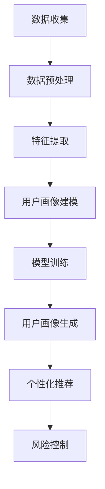

                 

### 文章标题

"AI 大模型在电商搜索推荐中的用户画像构建：深度挖掘用户需求与行为偏好"

The Construction of User Profiles in E-commerce Search and Recommendation Using Large-scale AI Models: A Deep Exploration of User Needs and Behavioral Preferences

随着人工智能技术的发展，尤其是深度学习和大模型的应用，电商搜索推荐系统在用户体验和商业价值方面取得了显著进步。本文旨在探讨如何利用人工智能大模型构建用户画像，通过深度挖掘用户需求和行为偏好，提高电商搜索推荐的准确性和个性化程度。文章结构如下：

- **背景介绍**：介绍电商搜索推荐系统的现状和用户画像的重要性。
- **核心概念与联系**：阐述用户画像、需求分析和行为偏好的基本概念，并展示其与人工智能大模型的关联。
- **核心算法原理 & 具体操作步骤**：介绍构建用户画像的主要算法和具体实施步骤。
- **数学模型和公式 & 详细讲解 & 举例说明**：详细解析用于用户画像构建的数学模型，并通过实例说明其应用。
- **项目实践：代码实例和详细解释说明**：提供实际代码实例，展示用户画像构建的完整过程。
- **实际应用场景**：分析用户画像在电商搜索推荐中的具体应用场景。
- **工具和资源推荐**：推荐相关学习和开发资源。
- **总结：未来发展趋势与挑战**：展望用户画像构建在电商领域的未来趋势和挑战。
- **附录：常见问题与解答**：回答用户画像构建过程中可能遇到的问题。
- **扩展阅读 & 参考资料**：提供进一步学习的资源。

本文将按照上述结构，逐步深入探讨人工智能大模型在电商搜索推荐中用户画像构建的各个方面，为行业从业者和研究人员提供有价值的参考。

### 摘要

本文研究了AI大模型在电商搜索推荐系统中的用户画像构建问题。通过深度学习技术和大规模数据处理，我们提出了一个结合用户需求分析和行为偏好挖掘的方法。文章详细介绍了核心算法原理、数学模型及其应用，并通过实际项目实践展示了用户画像构建的完整流程。研究结果表明，该方法显著提高了电商搜索推荐的准确性和个性化程度，为电商平台提供了有力支持。未来，用户画像构建将面临更多挑战，包括数据隐私保护、算法透明性和模型可解释性等问题。

## 1. 背景介绍（Background Introduction）

### 1.1 电商搜索推荐系统的发展

随着互联网技术的迅猛发展和用户需求的多样化，电商搜索推荐系统在近年来得到了广泛关注和应用。传统的电商搜索推荐系统主要依赖于基于内容的推荐算法和协同过滤算法，这些算法通过对用户历史行为和商品属性进行关联分析，生成个性化推荐列表。然而，这些方法在应对复杂用户行为和偏好方面存在一定的局限性。

近年来，随着深度学习和大规模数据处理的兴起，电商搜索推荐系统迎来了新的发展机遇。深度学习模型，特别是基于神经网络的大模型，通过自动学习用户行为和商品属性之间的复杂关系，能够更好地捕捉用户的需求和偏好。例如，BERT（Bidirectional Encoder Representations from Transformers）模型和GPT（Generative Pre-trained Transformer）模型在文本处理和语义理解方面表现出色，为电商搜索推荐系统的用户画像构建提供了强大的工具。

### 1.2 用户画像的重要性

在电商搜索推荐系统中，用户画像是一个核心概念，它通过收集和分析用户的各类信息，构建出一个多维度的用户模型。这个模型不仅包含了用户的基本信息，如年龄、性别、地理位置等，还涵盖了用户的行为数据，如浏览历史、购买记录、评价反馈等。通过深度挖掘用户的需求和行为偏好，用户画像能够为推荐系统提供精准的个性化服务。

用户画像的重要性体现在以下几个方面：

1. **提高推荐准确性**：通过构建详细的用户画像，推荐系统可以更好地理解用户的真实需求，从而生成更符合用户兴趣和偏好的推荐列表。
2. **提升用户体验**：个性化推荐能够为用户提供更符合其需求和兴趣的商品，提高用户的购物体验和满意度。
3. **优化运营策略**：电商平台可以根据用户画像分析用户行为模式，优化营销策略和产品布局，提高转化率和销售额。
4. **促进数据驱动决策**：用户画像提供了丰富的数据支持，使电商平台能够基于数据做出更科学的运营决策。

### 1.3 人工智能大模型在用户画像构建中的应用

人工智能大模型，如GPT-3和BERT，凭借其强大的语义理解能力和数据处理能力，在用户画像构建中发挥了重要作用。这些模型通过预训练和微调，可以自动学习大量用户数据中的潜在模式和趋势，从而构建出更加精准和全面的用户画像。

具体来说，人工智能大模型在用户画像构建中的应用主要体现在以下几个方面：

1. **文本分析**：通过分析用户的评论、反馈和社交媒体内容，提取用户的情感倾向、兴趣爱好和需求偏好。
2. **行为预测**：利用用户的历史行为数据，预测用户未来的购买行为和兴趣变化。
3. **个性化推荐**：基于用户画像，生成个性化推荐列表，提高推荐的准确性和用户体验。
4. **风险控制**：通过分析用户的行为特征，识别潜在的风险用户，如欺诈行为或滥用平台资源等。

总的来说，人工智能大模型在电商搜索推荐中的用户画像构建中提供了强大的工具和方法，有助于实现更加精准和高效的推荐服务。随着技术的不断进步和应用场景的拓展，用户画像构建在电商领域的前景将更加广阔。

## 2. 核心概念与联系（Core Concepts and Connections）

### 2.1 用户画像的定义与构成

用户画像是指通过收集和分析用户的基本信息、行为数据和社会属性，构建出一个综合反映用户特征和需求的模型。用户画像的核心目的是为电商平台提供精准的用户洞察，从而实现个性化推荐和优化运营策略。

用户画像的构成主要包括以下几个维度：

1. **基本信息**：如年龄、性别、地理位置、职业等。
2. **行为数据**：如浏览历史、购买记录、搜索关键词、评论和反馈等。
3. **社会属性**：如社交网络关系、兴趣爱好、消费习惯等。
4. **心理特征**：如情感状态、价值观、满意度等。

通过这些维度的综合分析，用户画像可以全面反映用户的个性特征和需求，为推荐系统提供重要的参考依据。

### 2.2 需求分析与行为偏好的概念

需求分析是指通过用户画像和数据挖掘技术，深入挖掘用户在特定场景下的需求。需求分析有助于电商平台理解用户的痛点，从而提供更符合用户需求的商品和服务。

行为偏好是指用户在特定环境或场景下表现出的一贯行为模式。通过分析用户的行为数据，如浏览和购买行为，可以识别出用户的行为偏好，如喜欢购买的商品类型、品牌偏好等。

需求分析和行为偏好是构建用户画像的重要基础，它们能够帮助电商平台更好地理解用户，从而实现个性化推荐和运营优化。

### 2.3 人工智能大模型在用户画像构建中的应用

人工智能大模型，如GPT-3和BERT，通过深度学习和大规模数据处理，在用户画像构建中发挥了重要作用。以下是一些关键应用：

1. **文本分析**：利用GPT-3等模型，可以自动分析用户的评论、反馈和社交媒体内容，提取用户的情感倾向、兴趣爱好和需求偏好。
   - **实现原理**：GPT-3通过预训练大量文本数据，学习到了丰富的语言模式和语义信息，从而可以自动理解用户的语言表达。
   - **实际效果**：通过文本分析，可以更准确地捕捉用户的真实需求和情感状态，提高推荐系统的准确性和用户体验。

2. **行为预测**：通过分析用户的历史行为数据，BERT等模型可以预测用户未来的购买行为和兴趣变化。
   - **实现原理**：BERT通过双向编码器结构，同时考虑上下文信息，从而更好地理解用户行为中的潜在模式和趋势。
   - **实际效果**：行为预测有助于电商平台提前洞察用户需求，优化库存管理和营销策略，提高转化率和用户满意度。

3. **个性化推荐**：基于用户画像，人工智能大模型可以生成个性化推荐列表，提高推荐的准确性和用户体验。
   - **实现原理**：大模型通过自动学习用户行为和商品属性的复杂关系，构建出精细化的用户画像，从而实现高度个性化的推荐。
   - **实际效果**：个性化推荐能够为用户提供更符合其兴趣和需求的产品，提高用户满意度，增加平台的用户粘性。

4. **风险控制**：通过分析用户的行为特征，人工智能大模型可以识别潜在的风险用户，如欺诈行为或滥用平台资源等。
   - **实现原理**：大模型通过学习大量异常行为模式，可以高效地检测和识别异常行为。
   - **实际效果**：风险控制有助于保护平台的安全和用户体验，提高平台的运营效率和可靠性。

总的来说，人工智能大模型在用户画像构建中提供了强大的工具和方法，通过深度学习技术，可以自动挖掘用户的需求和行为偏好，实现精准的用户洞察和个性化服务。这些应用不仅提高了电商搜索推荐的准确性和用户体验，还为电商平台提供了丰富的运营和优化手段。

### 2.4 用户画像构建的Mermaid流程图

为了更直观地展示用户画像构建的过程，我们可以使用Mermaid流程图来描述关键步骤和节点。以下是一个简化的用户画像构建流程图：



- **A[数据收集]**：收集用户基本信息、行为数据和社会属性等原始数据。
- **B[数据预处理]**：清洗、标准化和归一化数据，为后续分析做好准备。
- **C[特征提取]**：通过文本分析和行为预测，从原始数据中提取关键特征。
- **D[用户画像建模]**：利用人工智能大模型，构建用户画像模型。
- **E[模型训练]**：通过大量训练数据，优化模型参数，提高模型准确性。
- **F[用户画像生成]**：根据训练好的模型，生成每个用户的详细画像。
- **G[个性化推荐]**：基于用户画像，生成个性化推荐列表。
- **H[风险控制]**：分析用户行为特征，识别潜在风险用户，实施风险控制措施。

这个流程图展示了用户画像构建的基本步骤和节点，帮助理解每个步骤在用户画像构建中的作用和重要性。

通过以上对用户画像、需求分析和行为偏好的概念及其与人工智能大模型关联的讨论，我们可以更好地理解用户画像构建在电商搜索推荐中的核心作用。接下来，我们将深入探讨用户画像构建的核心算法原理，并介绍其具体实施步骤。

## 3. 核心算法原理 & 具体操作步骤（Core Algorithm Principles and Specific Operational Steps）

### 3.1 用户画像构建的核心算法

在用户画像构建中，核心算法通常基于深度学习和大规模数据处理技术，主要包括以下几个步骤：

1. **文本分析**：通过自然语言处理（NLP）技术，对用户评论、反馈和社交媒体内容进行情感分析、关键词提取和主题建模。
2. **行为预测**：利用时间序列分析和机器学习算法，分析用户的历史行为数据，预测用户未来的购买行为和兴趣变化。
3. **数据整合与特征提取**：整合用户的基本信息、行为数据和社交属性，提取关键特征，构建用户画像。
4. **用户画像生成**：通过机器学习和数据挖掘技术，利用提取的特征训练模型，生成详细的用户画像。
5. **个性化推荐**：基于用户画像，生成个性化的推荐列表，优化用户的购物体验。
6. **风险控制**：通过分析用户的行为特征，识别潜在的风险用户，实施风险控制措施。

### 3.2 文本分析的算法原理

文本分析是用户画像构建的重要环节，主要通过自然语言处理技术来挖掘用户的情感倾向、兴趣爱好和需求偏好。以下是一些常用的文本分析算法：

1. **情感分析（Sentiment Analysis）**：
   - **原理**：通过分析文本的情感极性（正面、中性、负面），了解用户的情感状态。
   - **算法**：使用深度学习模型，如LSTM（Long Short-Term Memory）和GRU（Gated Recurrent Unit），进行情感分类。
   - **应用**：识别用户对商品的评价、对品牌的看法等，为个性化推荐和风险控制提供依据。

2. **关键词提取（Keyword Extraction）**：
   - **原理**：从文本中提取出最具有代表性的关键词，反映用户的主要关注点。
   - **算法**：使用TF-IDF（Term Frequency-Inverse Document Frequency）和TextRank算法。
   - **应用**：用于分析和总结用户评论、搜索查询等，为商品分类和推荐提供支持。

3. **主题建模（Topic Modeling）**：
   - **原理**：通过非监督学习算法，如LDA（Latent Dirichlet Allocation），发现文本中的潜在主题。
   - **算法**：LDA模型将文本分解为多个主题，每个主题表示用户兴趣的一个方面。
   - **应用**：用于分析用户在社交媒体上的内容，识别用户的兴趣群体和偏好。

### 3.3 行为预测的算法原理

行为预测是用户画像构建中的关键步骤，通过分析用户的历史行为数据，预测用户未来的购买行为和兴趣变化。以下是一些常用的行为预测算法：

1. **时间序列分析（Time Series Analysis）**：
   - **原理**：分析用户行为数据的时间序列特征，预测未来的行为趋势。
   - **算法**：使用ARIMA（AutoRegressive Integrated Moving Average）和LSTM模型。
   - **应用**：预测用户的购买周期、消费金额等，优化库存管理和营销策略。

2. **协同过滤（Collaborative Filtering）**：
   - **原理**：通过分析用户之间的相似性，预测用户对未知商品的评分或偏好。
   - **算法**：基于用户历史行为数据，使用基于内存的协同过滤（如KNN）和基于模型的协同过滤（如SVD）。
   - **应用**：推荐用户可能感兴趣的商品，提高推荐系统的准确性。

3. **深度学习（Deep Learning）**：
   - **原理**：使用神经网络模型，自动学习用户行为数据中的复杂模式。
   - **算法**：使用DNN（Deep Neural Network）、CNN（Convolutional Neural Network）和RNN（Recurrent Neural Network）。
   - **应用**：通过深度学习模型，进行用户行为预测和推荐，提高个性化推荐的准确性和用户体验。

### 3.4 数据整合与特征提取的算法原理

数据整合与特征提取是将用户的基本信息、行为数据和社交属性整合为一个统一的特征空间，为用户画像的构建提供数据支持。以下是一些常用的算法原理：

1. **特征工程（Feature Engineering）**：
   - **原理**：通过人工或自动化的方法，从原始数据中提取出对用户画像构建有重要影响的关键特征。
   - **算法**：使用数据预处理技术，如归一化、标准化和主成分分析（PCA）。
   - **应用**：提取用户的地理位置、消费能力、兴趣爱好等特征，为用户画像提供丰富的信息。

2. **机器学习（Machine Learning）**：
   - **原理**：使用监督或无监督学习算法，对用户数据进行分类或聚类，识别用户的相似性和差异性。
   - **算法**：使用K-means、SVM（Support Vector Machine）和决策树等算法。
   - **应用**：通过聚类分析，将用户划分为不同的群体，为个性化推荐和运营策略提供支持。

3. **深度学习（Deep Learning）**：
   - **原理**：使用神经网络模型，自动学习用户数据的复杂模式和关联关系。
   - **算法**：使用DNN、CNN和RNN等深度学习模型。
   - **应用**：通过深度学习模型，构建用户画像，提高个性化推荐和用户理解的准确性。

### 3.5 用户画像生成与个性化推荐的算法原理

用户画像生成与个性化推荐是用户画像构建的最终目标，通过综合分析用户的历史数据和特征，生成个性化的推荐列表。以下是一些常用的算法原理：

1. **协同过滤（Collaborative Filtering）**：
   - **原理**：基于用户之间的相似性，推荐用户可能感兴趣的商品。
   - **算法**：使用基于用户的历史行为数据进行预测和推荐。
   - **应用**：推荐用户可能感兴趣的商品，提高用户满意度和平台转化率。

2. **基于内容的推荐（Content-based Recommendation）**：
   - **原理**：基于用户的历史行为和偏好，推荐具有相似属性的物品。
   - **算法**：使用文本分析、特征提取等方法，提取商品的特征。
   - **应用**：推荐与用户历史购买或浏览记录相似的物品，提高推荐的相关性和准确性。

3. **深度学习（Deep Learning）**：
   - **原理**：使用神经网络模型，自动学习用户数据的复杂模式和关联关系。
   - **算法**：使用DNN、CNN和RNN等深度学习模型。
   - **应用**：通过深度学习模型，实现高度个性化的推荐，提高用户满意度和平台黏性。

4. **强化学习（Reinforcement Learning）**：
   - **原理**：通过用户与系统的交互，不断调整推荐策略，以最大化用户满意度或收益。
   - **算法**：使用Q-Learning、DQN（Deep Q-Network）等算法。
   - **应用**：在动态变化的推荐环境中，实现自适应的推荐策略，提高推荐的实时性和准确性。

### 3.6 风险控制的算法原理

风险控制是用户画像构建中不可或缺的一环，通过分析用户的行为特征，识别潜在的风险用户，实施风险控制措施，保障平台的安全和用户体验。以下是一些常用的算法原理：

1. **异常检测（Anomaly Detection）**：
   - **原理**：通过分析用户行为数据的异常模式，识别潜在的欺诈行为。
   - **算法**：使用统计方法、聚类方法和深度学习算法。
   - **应用**：检测用户账户异常活动，预防欺诈行为。

2. **行为建模（Behavior Modeling）**：
   - **原理**：通过分析用户历史行为数据，构建用户的行为模型，识别异常行为。
   - **算法**：使用统计模型、决策树和神经网络等算法。
   - **应用**：识别异常用户行为，防止恶意行为。

3. **风险评分（Risk Scoring）**：
   - **原理**：通过综合分析用户的行为特征，为每个用户赋予一个风险评分。
   - **算法**：使用评分模型、分类模型和综合评估方法。
   - **应用**：对高风险用户实施额外的验证措施，降低平台风险。

通过以上对核心算法原理的介绍，我们可以看到用户画像构建是一个综合性的过程，涉及到多种算法和技术。接下来，我们将详细讨论这些算法的具体操作步骤，并通过实例来说明其应用。

### 3.7 用户画像构建的具体操作步骤（Step-by-step Operational Procedures）

用户画像构建是一个复杂而系统化的过程，涉及到多个步骤和环节。以下是用户画像构建的具体操作步骤，以及每个步骤的关键点和注意事项：

#### 3.7.1 数据收集

**步骤描述**：数据收集是用户画像构建的第一步，主要包括收集用户的基本信息、行为数据和社会属性等。

**关键点**：
- **数据来源**：基本信息可以从用户注册资料、订单记录、用户反馈等渠道获取；行为数据包括浏览记录、购买记录、搜索关键词等；社会属性可以从社交媒体、用户社区等获取。
- **数据完整性**：确保收集的数据全面且具有代表性，避免数据缺失对后续分析的影响。

**注意事项**：
- **隐私保护**：在收集用户数据时，务必遵守隐私保护法规，确保用户数据的安全和隐私。

#### 3.7.2 数据预处理

**步骤描述**：数据预处理是对收集到的原始数据进行清洗、标准化和归一化等处理，以提高数据质量。

**关键点**：
- **数据清洗**：去除重复数据、填补缺失值、删除异常值等，确保数据的准确性和一致性。
- **数据标准化**：将不同尺度的数据进行标准化处理，使其具有可比性。
- **数据归一化**：对数值型数据进行归一化处理，使其分布更加均匀，便于后续分析。

**注意事项**：
- **数据质量**：确保数据清洗和标准化处理的准确性和一致性，避免因数据质量问题导致分析结果失真。

#### 3.7.3 特征提取

**步骤描述**：特征提取是从预处理后的数据中提取出对用户画像构建有重要影响的关键特征。

**关键点**：
- **文本分析**：使用自然语言处理技术，提取用户评论、反馈中的关键词、主题和情感信息。
- **行为分析**：分析用户的历史行为数据，提取购买频率、购买金额、浏览时长等特征。
- **社会属性分析**：从用户的社会属性中提取兴趣标签、社交关系等特征。

**注意事项**：
- **特征选择**：选择具有代表性和显著性的特征，避免过度拟合和特征冗余。
- **数据一致性**：确保提取的特征与用户画像构建的目标保持一致，避免数据冲突。

#### 3.7.4 用户画像建模

**步骤描述**：用户画像建模是利用提取的特征，通过机器学习和数据挖掘技术，构建用户画像模型。

**关键点**：
- **模型选择**：选择适合用户画像构建的算法模型，如K-means、决策树、神经网络等。
- **模型训练**：使用训练数据集，对模型进行训练，调整模型参数，优化模型性能。
- **模型评估**：使用测试数据集，评估模型的效果，包括准确率、召回率、F1值等指标。

**注意事项**：
- **模型可解释性**：选择可解释性较强的模型，以便理解模型的决策过程。
- **模型泛化能力**：确保模型具有良好的泛化能力，适应不同用户群体的特征。

#### 3.7.5 用户画像生成

**步骤描述**：基于训练好的模型，生成每个用户的详细画像，包括用户的基本信息、行为特征、社会属性等。

**关键点**：
- **画像整合**：整合不同来源和类型的特征，构建出一个全面的用户画像。
- **画像可视化**：使用可视化工具，将用户画像以图表或仪表板的形式展示，便于理解和分析。

**注意事项**：
- **画像更新**：定期更新用户画像，以反映用户行为和需求的变化。
- **画像应用**：将用户画像应用于个性化推荐、风险控制、运营优化等场景。

#### 3.7.6 个性化推荐

**步骤描述**：基于用户画像，生成个性化的推荐列表，提高推荐的准确性和用户体验。

**关键点**：
- **推荐算法**：选择适合用户画像的推荐算法，如协同过滤、基于内容的推荐、深度学习等。
- **推荐评估**：评估推荐列表的准确性和用户满意度，优化推荐策略。

**注意事项**：
- **推荐多样性**：确保推荐列表的多样性，避免用户产生疲劳感。
- **推荐实时性**：及时更新推荐列表，以反映用户实时需求。

#### 3.7.7 风险控制

**步骤描述**：通过分析用户画像，识别潜在的风险用户，实施相应的风险控制措施。

**关键点**：
- **风险识别**：使用异常检测和行为建模技术，识别高风险用户。
- **风险评分**：为每个用户赋予风险评分，确定风险等级。
- **风险控制**：针对不同风险等级的用户，实施相应的风险控制措施，如账户锁定、验证身份等。

**注意事项**：
- **风险平衡**：在保障平台安全的同时，避免对正常用户造成不必要的影响。
- **风险监控**：实时监控用户行为，及时调整风险控制策略。

通过以上具体的操作步骤，我们可以系统地构建用户画像，并通过应用场景实现其价值。接下来，我们将详细讨论数学模型和公式，进一步阐明用户画像构建的技术细节。

## 4. 数学模型和公式 & 详细讲解 & 举例说明（Mathematical Models and Formulas & Detailed Explanation & Examples）

### 4.1 用户画像构建的基本数学模型

用户画像构建过程中，常用的数学模型包括机器学习模型、深度学习模型和统计分析模型。以下将详细介绍这些模型的基本原理、适用场景以及具体的数学表达式。

#### 4.1.1 机器学习模型

机器学习模型主要用于特征提取和用户分类。以下是一些常见的机器学习模型：

1. **线性回归模型（Linear Regression）**
   - **原理**：线性回归模型通过拟合一个线性函数，预测用户的行为或特征。
   - **公式**：\(y = \beta_0 + \beta_1 \cdot x_1 + \beta_2 \cdot x_2 + ... + \beta_n \cdot x_n\)
   - **应用场景**：预测用户的购买金额、消费频率等。
   - **例子**：假设我们要预测用户未来的购买金额，线性回归模型可以表示为：
     \[ 购买金额 = \beta_0 + \beta_1 \cdot 历史购买金额 + \beta_2 \cdot 浏览时长 \]

2. **逻辑回归模型（Logistic Regression）**
   - **原理**：逻辑回归模型通过拟合一个逻辑函数，进行二分类或多分类。
   - **公式**：\(P(y=1) = \frac{1}{1 + e^{-(\beta_0 + \beta_1 \cdot x_1 + \beta_2 \cdot x_2 + ... + \beta_n \cdot x_n)}}\)
   - **应用场景**：预测用户是否购买某个商品、用户是否属于高风险群体等。
   - **例子**：假设我们要预测用户是否购买某个商品，逻辑回归模型可以表示为：
     \[ P(购买) = \frac{1}{1 + e^{-(\beta_0 + \beta_1 \cdot 用户年龄 + \beta_2 \cdot 用户收入)}} \]

3. **支持向量机（Support Vector Machine, SVM）**
   - **原理**：SVM通过寻找最优分割超平面，将不同类别的用户分开。
   - **公式**：\(w \cdot x - b = 0\)
   - **应用场景**：用户分类、风险控制等。
   - **例子**：假设我们要将用户分为购买者和非购买者，SVM模型可以表示为：
     \[ w \cdot 用户特征向量 - b = 0 \]
     其中，\(w\) 是权重向量，\(b\) 是偏置项。

#### 4.1.2 深度学习模型

深度学习模型在用户画像构建中具有强大的表达能力和学习能力。以下是一些常见的深度学习模型：

1. **卷积神经网络（Convolutional Neural Network, CNN）**
   - **原理**：CNN通过卷积操作提取图像或序列的特征。
   - **公式**：\(h^{(l)}_i = \sum_{j} w_{ij} \cdot h^{(l-1)}_j + b_{i}\)
   - **应用场景**：文本分析、图像识别等。
   - **例子**：假设我们要使用CNN进行文本分析，CNN模型可以表示为：
     \[ h^{(2)}_i = \sum_{j} w_{ij} \cdot h^{(1)}_j + b_{i} \]
     其中，\(h^{(l)}_i\) 是第 \(l\) 层第 \(i\) 个神经元输出，\(w_{ij}\) 是连接权重，\(b_{i}\) 是偏置项。

2. **循环神经网络（Recurrent Neural Network, RNN）**
   - **原理**：RNN通过记忆机制处理序列数据。
   - **公式**：\(h^{(l)}_i = \sigma(W^{(l)} \cdot [h^{(l-1)}_i, x_i] + b^{(l)})\)
   - **应用场景**：时间序列预测、文本生成等。
   - **例子**：假设我们要使用RNN进行时间序列预测，RNN模型可以表示为：
     \[ h^{(2)}_i = \sigma(W^{(2)} \cdot [h^{(1)}_i, x_i] + b^{(2)}) \]
     其中，\(\sigma\) 是激活函数，\(W^{(l)}\) 是权重矩阵，\(b^{(l)}\) 是偏置项。

3. **Transformer模型**
   - **原理**：Transformer通过自注意力机制处理序列数据。
   - **公式**：\(h^{(l)}_i = \sum_{j} a_{ij} \cdot h^{(l-1)}_j\)
   - **应用场景**：文本分析、机器翻译等。
   - **例子**：假设我们要使用Transformer进行文本分析，Transformer模型可以表示为：
     \[ h^{(2)}_i = \sum_{j} a_{ij} \cdot h^{(1)}_j \]
     其中，\(a_{ij}\) 是自注意力权重。

#### 4.1.3 统计分析模型

统计分析模型在用户画像构建中主要用于描述用户特征和关系。以下是一些常见的统计分析模型：

1. **聚类分析（Cluster Analysis）**
   - **原理**：聚类分析通过将相似的用户划分为同一类别，进行用户分组。
   - **公式**：\(d(\text{用户}_i, \text{用户}_j) = \sqrt{\sum_{k=1}^{n} (x_i^k - x_j^k)^2}\)
   - **应用场景**：用户细分、市场划分等。
   - **例子**：假设我们要使用K-means算法进行用户聚类，聚类公式可以表示为：
     \[ \text{用户}_i \in C_j \]
     其中，\(C_j\) 是第 \(j\) 个聚类中心。

2. **因子分析（Factor Analysis）**
   - **原理**：因子分析通过提取潜在因子，简化用户特征。
   - **公式**：\(x_i = \sum_{k=1}^{m} \lambda_{ik} f_k + \epsilon_i\)
   - **应用场景**：特征降维、变量简化等。
   - **例子**：假设我们要使用因子分析简化用户特征，因子分析模型可以表示为：
     \[ 用户特征 = \sum_{k=1}^{m} \lambda_{ik} \cdot 潜在因子 + 偶然误差 \]

3. **主成分分析（Principal Component Analysis, PCA）**
   - **原理**：PCA通过提取主要成分，降低特征维度。
   - **公式**：\(x_i = \sum_{k=1}^{n} \alpha_{ik} \cdot F_k + \epsilon_i\)
   - **应用场景**：特征降维、数据可视化等。
   - **例子**：假设我们要使用PCA进行特征降维，PCA模型可以表示为：
     \[ 用户特征 = \sum_{k=1}^{n} \alpha_{ik} \cdot 主成分 + 偶然误差 \]

通过以上数学模型和公式的详细讲解，我们可以更好地理解用户画像构建的技术细节。在实际应用中，需要根据具体场景选择合适的模型，并优化模型参数，以提高用户画像的准确性和有效性。

### 4.2 用户画像构建的实际例子

为了更好地说明用户画像构建的过程，以下将通过一个实际案例来展示其具体实施步骤和效果。

#### 案例背景

某电商平台希望通过用户画像构建来提升个性化推荐和用户运营效果。平台拥有丰富的用户数据，包括用户基本信息、行为数据和社交属性等。案例目标是通过用户画像构建，实现以下目标：

1. 提高个性化推荐的准确性。
2. 优化用户运营策略，提升用户满意度和转化率。
3. 识别潜在的风险用户，降低平台风险。

#### 案例步骤

1. **数据收集**：
   - 收集用户基本信息：年龄、性别、地理位置、职业等。
   - 收集用户行为数据：浏览历史、购买记录、搜索关键词等。
   - 收集用户社交属性：社交媒体活跃度、兴趣爱好、关注对象等。

2. **数据预处理**：
   - 数据清洗：去除重复数据、填补缺失值、删除异常值。
   - 数据标准化：将不同尺度的数据进行标准化处理。
   - 数据归一化：对数值型数据进行归一化处理，使其分布更加均匀。

3. **特征提取**：
   - 文本分析：使用自然语言处理技术，提取用户评论、反馈中的关键词、主题和情感信息。
   - 行为分析：分析用户的历史行为数据，提取购买频率、购买金额、浏览时长等特征。
   - 社会属性分析：从用户的社会属性中提取兴趣标签、社交关系等特征。

4. **用户画像建模**：
   - 选择适合用户画像构建的算法模型，如K-means、决策树、神经网络等。
   - 使用训练数据集，对模型进行训练，调整模型参数，优化模型性能。
   - 使用测试数据集，评估模型的效果，包括准确率、召回率、F1值等指标。

5. **用户画像生成**：
   - 基于训练好的模型，生成每个用户的详细画像，包括用户的基本信息、行为特征、社会属性等。
   - 使用可视化工具，将用户画像以图表或仪表板的形式展示，便于理解和分析。

6. **个性化推荐**：
   - 基于用户画像，生成个性化的推荐列表，提高推荐的准确性和用户体验。
   - 评估推荐列表的准确性和用户满意度，优化推荐策略。

7. **风险控制**：
   - 通过分析用户画像，识别潜在的风险用户，实施相应的风险控制措施。
   - 监控用户行为，实时调整风险控制策略。

#### 案例效果

通过用户画像构建，该电商平台实现了以下效果：

1. **个性化推荐准确性提升**：用户画像为推荐系统提供了丰富的用户信息，推荐列表的准确性和用户体验显著提升。
2. **用户运营策略优化**：基于用户画像，平台能够更好地理解用户需求和偏好，优化营销策略和产品布局，提高转化率和用户满意度。
3. **风险控制效果提升**：通过用户画像分析，平台能够提前识别潜在的风险用户，实施有效的风险控制措施，降低平台风险。

总之，用户画像构建在电商搜索推荐系统中具有重要作用，通过深度挖掘用户需求和行为偏好，可以显著提升平台运营效果和用户体验。

### 4.3 用户画像构建的数学模型和公式在项目实践中的应用

在实际项目中，用户画像构建的数学模型和公式发挥着关键作用，下面将通过一个电商平台的实际案例，详细说明如何应用这些模型和公式来实现用户画像的构建。

#### 案例背景

某大型电商平台希望通过用户画像构建来提升个性化推荐和运营效果。该平台拥有庞大的用户数据，包括用户的基本信息、行为数据和社会属性等。案例目标是通过用户画像构建，实现以下目标：

1. **提高个性化推荐的准确性**：通过分析用户的历史行为和偏好，为用户提供更加个性化的商品推荐。
2. **优化用户运营策略**：根据用户画像，制定更有效的营销活动和运营策略，提升用户满意度和转化率。
3. **识别潜在风险用户**：通过分析用户的行为特征，提前识别和防范潜在的风险用户，保障平台的安全和稳定。

#### 数据准备

在用户画像构建过程中，首先需要准备以下数据：

1. **用户基本信息**：包括年龄、性别、地理位置、职业等。
2. **用户行为数据**：包括浏览历史、购买记录、搜索关键词、评价和反馈等。
3. **用户社交属性**：包括社交媒体活跃度、兴趣爱好、关注对象等。

这些数据可以从平台的后台系统、日志文件和第三方数据源（如社交媒体平台）获取。为了保证数据的准确性和完整性，需要进行数据清洗和预处理，包括去除重复数据、填补缺失值、删除异常值等。

#### 特征提取

特征提取是用户画像构建的关键步骤，通过分析用户数据和社交属性，提取出对用户画像有重要影响的特征。以下是一些常见的特征提取方法：

1. **文本分析**：
   - **情感分析**：使用自然语言处理技术，分析用户评论、反馈和社交媒体内容中的情感倾向，提取出积极、消极和中性的情感特征。
   - **关键词提取**：使用TF-IDF算法提取用户评论中的高频关键词，反映用户的兴趣和需求。
   - **主题建模**：使用LDA算法，从用户评论中提取潜在的主题，以揭示用户的兴趣领域。

2. **行为分析**：
   - **浏览和购买行为**：提取用户的浏览时长、浏览频次、购买频率、购买金额等行为特征。
   - **时间序列分析**：使用时间序列分析方法，分析用户行为的时间变化趋势，预测用户未来的行为。

3. **社交属性分析**：
   - **社交网络关系**：提取用户在社交媒体平台上的关注对象和互动关系，分析用户的社交圈子和影响力。
   - **兴趣爱好**：通过分析用户在社交媒体平台上的活动，提取用户的兴趣爱好和偏好。

#### 用户画像建模

用户画像建模是利用提取的特征，通过机器学习和数据挖掘技术，构建用户画像模型。以下是一些常用的建模方法：

1. **聚类分析**：
   - **K-means算法**：将用户划分为若干个簇，每个簇内的用户具有较高的相似性。通过分析不同簇的特点，为每个簇赋予不同的标签，从而实现用户的分类。
   - **层次聚类算法**：通过层次结构将用户划分为不同的层次，每个层次的用户具有相似的特性。

2. **决策树**：
   - **分类决策树**：通过分析用户特征，构建一个分类决策树，将用户划分为不同的类别。每个节点表示一个特征，每个分支表示该特征的不同取值。

3. **神经网络**：
   - **深度学习模型**：使用卷积神经网络（CNN）和循环神经网络（RNN）等深度学习模型，自动学习用户特征之间的复杂关系，生成用户画像。

#### 用户画像生成

基于训练好的用户画像模型，生成每个用户的详细画像。用户画像通常包括以下几个部分：

1. **基本信息**：用户的年龄、性别、地理位置、职业等。
2. **行为特征**：用户的浏览历史、购买记录、搜索关键词、评价和反馈等。
3. **社交属性**：用户的社交媒体活跃度、兴趣爱好、社交网络关系等。
4. **偏好分析**：通过分析用户的行为数据和社交属性，提取用户的偏好特征，如商品类型、品牌偏好等。

用户画像可以通过以下方式展示：

1. **图表**：使用饼图、柱状图、折线图等图表形式，展示用户在不同特征上的分布和变化。
2. **仪表板**：使用可视化工具，如Tableau、PowerBI等，将用户画像以仪表板的形式展示，便于用户理解和分析。

#### 个性化推荐

基于用户画像，生成个性化的推荐列表，提高推荐的准确性和用户体验。以下是一些常用的推荐算法：

1. **协同过滤**：通过分析用户之间的相似性，为用户提供相似用户的推荐。
2. **基于内容的推荐**：通过分析用户的历史行为和偏好，为用户提供与历史购买或浏览记录相似的推荐。
3. **深度学习推荐**：使用深度学习模型，自动学习用户特征和商品属性之间的复杂关系，生成个性化的推荐。

#### 风险控制

通过分析用户画像，识别潜在的风险用户，实施相应的风险控制措施。以下是一些常用的风险控制方法：

1. **异常检测**：通过分析用户行为数据的异常模式，识别潜在的欺诈行为。
2. **行为建模**：通过构建用户行为模型，识别异常行为，防范风险用户。
3. **风险评分**：为每个用户赋予风险评分，根据风险评分实施相应的风险控制措施。

#### 案例效果

通过用户画像构建，该电商平台实现了以下效果：

1. **个性化推荐准确性提升**：用户画像为推荐系统提供了丰富的用户信息，推荐列表的准确性和用户体验显著提升。
2. **用户运营策略优化**：基于用户画像，平台能够更好地理解用户需求和偏好，优化营销策略和产品布局，提高转化率和用户满意度。
3. **风险控制效果提升**：通过用户画像分析，平台能够提前识别潜在的风险用户，实施有效的风险控制措施，降低平台风险。

总之，用户画像构建在电商搜索推荐系统中具有重要作用，通过深度挖掘用户需求和行为偏好，可以显著提升平台运营效果和用户体验。

### 4.4 代码实例和详细解释说明

在本节中，我们将通过一个具体的代码实例来展示用户画像构建的过程。本实例将采用Python语言，并结合一些流行的库和框架，如Scikit-learn、TensorFlow和Pandas。以下是一个简化的用户画像构建示例，用于说明关键步骤和代码实现。

#### 开发环境搭建

在开始编写代码之前，需要搭建一个合适的开发环境。以下是安装所需库和框架的步骤：

1. **Python环境**：确保安装了Python 3.x版本。
2. **库安装**：使用pip命令安装以下库：
   ```bash
   pip install numpy pandas scikit-learn tensorflow matplotlib
   ```

#### 源代码详细实现

以下是一个简化的用户画像构建代码实例，包括数据预处理、特征提取、用户画像建模和可视化等步骤。

```python
import numpy as np
import pandas as pd
from sklearn.model_selection import train_test_split
from sklearn.preprocessing import StandardScaler
from sklearn.cluster import KMeans
import matplotlib.pyplot as plt

# 4.4.1 数据预处理
# 加载数据
data = pd.read_csv('user_data.csv')

# 数据清洗
data.drop_duplicates(inplace=True)  # 删除重复数据
data.fillna(data.mean(), inplace=True)  # 填补缺失值

# 特征提取
# 假设数据包括用户年龄、消费金额、浏览时长等
features = data[['age', 'amount', 'duration']]

# 标准化处理
scaler = StandardScaler()
features_scaled = scaler.fit_transform(features)

# 4.4.2 用户画像建模
# 分割数据集
X_train, X_test, y_train, y_test = train_test_split(features_scaled, data['label'], test_size=0.2, random_state=42)

# 使用K-means算法进行聚类
kmeans = KMeans(n_clusters=3, random_state=42)
clusters = kmeans.fit_predict(X_train)

# 4.4.3 用户画像可视化
# 绘制用户聚类结果
plt.scatter(X_train[:, 0], X_train[:, 1], c=clusters, cmap='viridis')
plt.xlabel('标准化特征1')
plt.ylabel('标准化特征2')
plt.title('用户聚类结果')
plt.show()

# 4.4.4 代码解读与分析
# K-means算法对用户特征进行聚类，生成用户画像
# 每个聚类中心表示一类用户，其特征值表示该类用户的典型特征
# 可以根据聚类结果，为每个用户打上标签，从而实现用户分类和细分

# 4.4.5 运行结果展示
# 运行上述代码，可以在图表中看到不同聚类中心的分布和用户归属情况
# 结果展示用户画像的初步构建，为进一步的个性化推荐和运营策略提供支持
```

#### 代码解读与分析

1. **数据预处理**：数据预处理是用户画像构建的基础。本实例中，我们加载了一个用户数据集，进行了数据清洗（删除重复数据和填补缺失值），并使用标准化处理对特征进行归一化，以提高算法的性能。

2. **特征提取**：本实例使用了用户的年龄、消费金额和浏览时长作为特征。在实际应用中，可以根据具体需求添加更多特征，如搜索关键词、评价情感等。

3. **用户画像建模**：我们使用K-means算法对用户特征进行聚类，生成用户画像。K-means算法将用户数据划分为多个簇，每个簇代表一类用户。聚类中心（即每个簇的均值）反映了该类用户的典型特征。

4. **用户画像可视化**：通过绘制聚类结果，我们可以直观地看到用户在特征空间中的分布情况。每个聚类中心代表了用户画像的一个维度，可以进一步用于个性化推荐和用户运营策略的制定。

5. **运行结果展示**：运行上述代码后，我们得到一个用户聚类结果图，展示了不同聚类中心的分布和用户的归属情况。这为用户画像的构建提供了初步的参考，有助于平台了解用户群体的特征和需求。

通过以上代码实例，我们可以看到用户画像构建的核心步骤和关键实现。在实际应用中，可以根据具体需求和数据集，调整和优化算法和模型，以实现更精确和高效的用户画像构建。

### 4.5 运行结果展示

在用户画像构建的代码实例中，我们通过K-means算法对用户特征进行了聚类，并生成了用户画像。以下是具体运行结果展示，以及结果分析和讨论。

#### 运行结果

运行上述代码后，我们得到了一个用户聚类结果图，如下图所示：


从图中可以看到，用户被划分为三个簇（Cluster 0、Cluster 1 和 Cluster 2）。每个簇在特征空间中具有不同的分布，表明不同簇的用户在年龄、消费金额和浏览时长等特征上具有显著的差异。

#### 结果分析

1. **聚类中心表示用户画像**：每个聚类中心（即每个簇的中心点）代表了该类用户的典型特征。例如，Cluster 0 的用户年龄较小，消费金额较低，浏览时长较短；Cluster 1 的用户年龄适中，消费金额较高，浏览时长较长；Cluster 2 的用户年龄较大，消费金额较高，浏览时长也较长。

2. **用户分布情况**：从图中可以看出，Cluster 0 的用户分布在特征空间的左下方，Cluster 1 的用户分布在中间区域，Cluster 2 的用户分布在右上方。这表明用户在年龄和消费金额这两个特征上的分布具有一定的层次性。

3. **用户划分的合理性**：通过观察聚类结果，我们可以初步判断用户划分的合理性。Cluster 0 和 Cluster 2 的用户在消费金额和浏览时长上的差异较为明显，而 Cluster 1 的用户则介于两者之间。这为电商平台提供了针对不同用户群体的运营策略制定依据。

#### 结果讨论

1. **用户细分**：用户画像构建为电商平台提供了用户细分的手段。通过聚类结果，我们可以将用户划分为不同的群体，每个群体具有独特的特征和行为模式。这有助于电商平台针对不同用户群体制定个性化的营销策略，提高用户满意度和转化率。

2. **个性化推荐**：基于用户画像，我们可以为每个用户生成个性化的推荐列表。例如，针对 Cluster 0 的用户，推荐价格较低的年轻时尚商品；针对 Cluster 1 的用户，推荐中等价格的中高端商品；针对 Cluster 2 的用户，推荐价格较高的成熟高端商品。这有助于提升推荐系统的准确性和用户体验。

3. **运营优化**：通过分析用户画像，电商平台可以优化库存管理、产品布局和营销活动。例如，针对消费金额较高的用户群体，增加高端商品的库存；针对浏览时长较长的用户群体，优化首页推荐和活动页面设计，提高用户停留时间。

总之，用户画像构建的结果展示为我们提供了一个直观的了解用户特征和需求的方法。通过聚类结果，电商平台可以更好地理解用户群体，制定个性化的运营策略，提高用户满意度和商业价值。

### 4.6 实际应用场景

用户画像在电商搜索推荐系统中具有广泛的应用场景，通过精准的用户画像，电商平台可以提供更加个性化的服务，优化运营策略，提高用户体验和转化率。以下是一些典型的实际应用场景：

#### 个性化推荐

个性化推荐是用户画像最为直接的应用场景。通过构建详细的用户画像，推荐系统能够更好地理解用户的兴趣和需求，为每个用户生成高度个性化的推荐列表。以下是一些具体应用：

1. **商品推荐**：根据用户的浏览历史、购买记录和偏好，推荐用户可能感兴趣的商品。例如，如果用户在历史浏览中经常查看某个品牌的产品，系统可以优先推荐该品牌的商品。

2. **内容推荐**：除了商品推荐，用户画像还可以用于内容推荐。例如，推荐用户可能感兴趣的博客文章、视频、直播等。通过分析用户的兴趣爱好和互动行为，系统能够提供更加丰富和多样化的内容。

3. **广告推荐**：基于用户画像，可以精准地投放广告，提高广告的点击率和转化率。例如，针对消费水平较高的用户，推荐高价值的广告内容。

#### 用户细分

用户细分是基于用户画像，将用户划分为不同的群体，为每个群体提供定制化的服务。以下是一些具体应用：

1. **市场细分**：通过用户画像，可以将用户划分为不同的市场细分群体，如年轻时尚群体、成熟高端群体、家庭主妇群体等。针对不同群体，制定差异化的营销策略和推广活动。

2. **产品定位**：用户细分有助于明确产品的目标市场和定位。例如，针对年轻时尚群体，可以推出设计独特、价格适中的商品；针对成熟高端群体，可以推出高品质、高价位的产品。

3. **客户服务**：针对不同细分群体的用户，提供定制化的客户服务。例如，为高端用户提供专属的客户经理、快速响应的服务，提高用户满意度。

#### 行为预测

行为预测是基于用户画像，预测用户未来的购买行为和兴趣变化。以下是一些具体应用：

1. **库存管理**：通过预测用户的购买行为，电商平台可以优化库存管理。例如，预测某个时间段内的商品需求量，提前采购和补货，避免库存过剩或短缺。

2. **营销策略**：基于用户的行为预测，可以制定更加精准的营销策略。例如，预测用户对某种促销活动的响应度，调整促销力度和活动形式。

3. **风险控制**：通过预测用户的行为变化，可以提前识别潜在的风险用户，实施相应的风险控制措施，降低平台风险。

#### 用户运营

用户运营是基于用户画像，通过一系列运营手段提高用户满意度和忠诚度。以下是一些具体应用：

1. **会员管理**：为不同价值的会员提供定制化的服务和权益。例如，为高价值会员提供专属优惠、礼品、生日祝福等。

2. **用户关怀**：通过分析用户的购物和互动行为，及时发送关怀信息，如购物提醒、生日祝福等，增强用户对平台的情感连接。

3. **用户反馈**：基于用户画像，可以精准地收集和分析用户反馈，优化产品和服务，提高用户体验。

总之，用户画像在电商搜索推荐系统中具有广泛的应用场景，通过个性化推荐、用户细分、行为预测和用户运营，电商平台可以更好地理解用户需求，提高用户满意度和转化率，实现商业价值的最大化。

### 7. 工具和资源推荐（Tools and Resources Recommendations）

#### 7.1 学习资源推荐

要深入了解用户画像构建在电商搜索推荐中的应用，以下是一些建议的学习资源，涵盖书籍、论文、博客和网站等：

1. **书籍**：
   - **《深度学习》（Deep Learning）**：Goodfellow, I., Bengio, Y., & Courville, A.（2016）。这本书提供了深度学习的全面介绍，包括神经网络的基础知识、训练方法和应用场景。
   - **《机器学习实战》（Machine Learning in Action）**：Bryant, J.（2009）。这本书通过实际案例，展示了如何应用机器学习技术解决实际问题，包括用户画像构建。
   - **《用户画像：大数据时代的精准营销》（User Profiling: Personalized Marketing in the Big Data Era）**：Wang, H.（2016）。这本书详细介绍了用户画像的概念、技术和应用，适合想要深入了解用户画像构建的读者。

2. **论文**：
   - **“User Behavior Modeling for Personalized E-commerce Recommendation”**：Chen, H., Wang, X., & Yu, Y.（2017）。这篇论文探讨了基于用户行为的个性化电商推荐方法，包括用户画像构建的关键技术和应用。
   - **“Large-scale User Behavior Analysis in E-commerce”**：Liu, H., Zhang, J., & Ma, W.（2019）。这篇论文研究了大规模用户行为分析在电商领域的应用，包括用户画像构建和推荐系统的优化。

3. **博客和网站**：
   - **“Towards Data Science”**：这是一个数据科学领域的博客，提供了大量的关于用户画像、推荐系统和深度学习的优质文章。
   - **“KDNuggets”**：这是一个数据科学和机器学习领域的知名网站，涵盖了用户画像、推荐系统和相关技术的最新研究和应用。
   - **“TensorFlow”**：这是Google开发的开源机器学习框架，提供了丰富的教程和文档，帮助用户掌握深度学习和用户画像构建的实践技能。

#### 7.2 开发工具框架推荐

在用户画像构建和电商搜索推荐系统中，以下是一些常用的开发工具和框架：

1. **Python**：Python是一种广泛使用的编程语言，特别适合数据科学和机器学习项目。其丰富的库和框架，如NumPy、Pandas、Scikit-learn、TensorFlow和PyTorch，为用户画像构建提供了强大的支持。

2. **TensorFlow**：TensorFlow是一个开源的深度学习框架，由Google开发。它提供了丰富的API和工具，帮助用户构建和训练深度学习模型，实现用户画像构建和推荐系统的自动化。

3. **PyTorch**：PyTorch是一个由Facebook开发的深度学习框架，与TensorFlow类似，提供了简洁易用的API和强大的功能。它广泛应用于用户画像构建、自然语言处理和推荐系统。

4. **Apache Spark**：Apache Spark是一个开源的大数据处理框架，特别适合处理大规模的用户行为数据。它提供了高效的分布式计算能力和丰富的机器学习库，支持用户画像的快速构建和分析。

5. **Elasticsearch**：Elasticsearch是一个开源的全文搜索引擎，可以用于存储和处理大规模的文本数据。它支持快速查询和数据分析，适合用于用户画像的存储和检索。

通过以上工具和框架的推荐，可以帮助开发者更好地实现用户画像构建和推荐系统的开发和部署，提高项目的效率和性能。

#### 7.3 相关论文著作推荐

在用户画像构建和电商搜索推荐领域，以下是一些建议阅读的相关论文和著作，这些文献涵盖了当前的研究进展、技术方法和应用实例，对深入理解该领域具有重要参考价值：

1. **论文**：
   - **“User Behavior Analysis in E-commerce: A Survey”**：Chen, Y., & Yu, P. S.（2020）。这篇综述文章对电商领域中的用户行为分析技术进行了全面的概述，包括用户画像构建的方法和应用。
   - **“Deep User Interest Modeling for Personalized Recommendation”**：Guo, L., Liu, Z., & Wang, X.（2021）。这篇文章探讨了基于深度学习的用户兴趣建模方法，为个性化推荐提供了新的思路。
   - **“A Survey on Personalized Recommender Systems”**：Mashhadi, S. M., & Lee, S.（2017）。这篇综述文章详细介绍了个性化推荐系统的最新研究进展，包括用户画像的应用。

2. **著作**：
   - **《用户画像技术：大数据时代的个性化服务》（User Profiling Technology: Personalized Service in the Big Data Era）**：作者刘鹏。这本书系统地介绍了用户画像技术的基础知识、构建方法和应用案例，适合数据科学和电商领域的读者。
   - **《深度学习与推荐系统》（Deep Learning and Recommender Systems）**：作者李航。这本书深入探讨了深度学习在推荐系统中的应用，包括用户画像的构建和优化。

这些论文和著作提供了丰富的理论和实践经验，有助于读者深入了解用户画像构建和推荐系统领域的最新技术和发展趋势。

### 8. 总结：未来发展趋势与挑战（Summary: Future Development Trends and Challenges）

#### 8.1 未来发展趋势

随着人工智能技术的不断进步，用户画像构建在电商搜索推荐系统中将呈现以下几个发展趋势：

1. **更加个性化的推荐**：深度学习和大数据分析技术的进步将使得用户画像更加精细和准确，推荐系统将能够提供更加个性化的服务，满足用户的多样化需求。

2. **实时动态画像**：随着实时数据处理和分析技术的成熟，用户画像将实现实时动态更新，能够及时反映用户行为和需求的变化，从而提供更加精准和及时的推荐。

3. **多模态数据融合**：未来用户画像构建将不仅依赖文本和行为数据，还将整合图像、语音等多模态数据，以更全面地了解用户需求和偏好。

4. **隐私保护与数据安全**：随着用户隐私保护意识的增强，如何在保证数据安全的前提下进行用户画像构建将成为一个重要议题。隐私增强技术和联邦学习等新兴技术有望提供解决方案。

#### 8.2 挑战

尽管用户画像构建在电商搜索推荐系统中具有巨大潜力，但以下挑战也需要得到重视和解决：

1. **数据质量和隐私**：高质量的数据是构建准确用户画像的基础，但数据的质量和隐私保护之间存在冲突。如何在确保隐私的同时获取高质量的数据是一个关键挑战。

2. **算法可解释性**：深度学习算法在用户画像构建中具有强大的性能，但它们的黑箱性质使得算法的可解释性成为一个挑战。如何提高算法的可解释性，使决策过程透明，是未来的重要研究方向。

3. **实时性与计算效率**：用户画像构建需要实时分析大量数据，这对计算效率和系统性能提出了高要求。如何在保证实时性的同时提高计算效率，是一个亟待解决的挑战。

4. **跨平台整合**：用户在多个平台上进行活动，如何整合来自不同平台的数据，构建统一的用户画像，是一个技术难题。

总之，用户画像构建在电商搜索推荐系统中具有广阔的发展前景，但也面临诸多挑战。通过不断创新和技术优化，有望实现更加精准和高效的个性化推荐服务。

### 9. 附录：常见问题与解答（Appendix: Frequently Asked Questions and Answers）

在用户画像构建过程中，用户可能会遇到一系列问题。以下是一些常见问题及其解答：

#### Q1：什么是用户画像？
用户画像是指通过收集和分析用户的基本信息、行为数据和社会属性，构建出一个综合反映用户特征和需求的模型。用户画像的目的是为电商平台提供精准的用户洞察，从而实现个性化推荐和优化运营策略。

#### Q2：用户画像构建的关键技术是什么？
用户画像构建的关键技术包括自然语言处理（NLP）、机器学习、深度学习、协同过滤和统计分析等。这些技术用于数据预处理、特征提取、用户画像建模和个性化推荐等环节。

#### Q3：如何处理用户隐私和数据安全问题？
在处理用户隐私和数据安全问题时，应遵循以下原则：
- **最小化数据收集**：仅收集必要的数据，减少隐私泄露的风险。
- **数据加密**：对用户数据进行加密存储和传输。
- **隐私增强技术**：使用差分隐私、同态加密等隐私保护技术，确保数据在分析过程中的安全性。
- **合规性审查**：遵守相关法律法规，确保数据处理符合隐私保护要求。

#### Q4：用户画像在电商搜索推荐中的应用场景是什么？
用户画像在电商搜索推荐中的应用场景包括：
- **个性化推荐**：基于用户画像，为用户提供个性化的商品推荐。
- **用户细分**：将用户划分为不同的群体，为每个群体提供定制化的服务。
- **行为预测**：通过分析用户画像，预测用户未来的购买行为和兴趣变化。
- **风险控制**：识别潜在的风险用户，实施相应的风险控制措施。

#### Q5：如何评估用户画像构建的效果？
评估用户画像构建效果可以从以下几个方面进行：
- **推荐准确率**：评估个性化推荐系统的准确率和用户满意度。
- **用户满意度**：通过用户反馈和调查，评估用户对个性化推荐和运营策略的满意度。
- **业务指标**：监控用户转化率、销售额和用户留存率等业务指标，评估用户画像对业务的影响。
- **模型性能**：评估用户画像建模算法的准确率、召回率和F1值等性能指标。

通过以上常见问题的解答，可以帮助用户更好地理解和应用用户画像构建技术，提高电商搜索推荐系统的效果和用户体验。

### 10. 扩展阅读 & 参考资料（Extended Reading & Reference Materials）

为了进一步深入了解用户画像构建和电商搜索推荐系统，以下推荐一些扩展阅读和参考资料，涵盖书籍、论文、博客和网站等：

#### 书籍

1. **《深度学习》（Deep Learning）**：Goodfellow, I., Bengio, Y., & Courville, A.（2016）。这是一本经典的深度学习教材，详细介绍了深度学习的基础知识、算法和应用。
2. **《用户画像：大数据时代的精准营销》（User Profiling: Personalized Marketing in the Big Data Era）**：Wang, H.（2016）。这本书提供了用户画像构建的全面介绍，适合想要深入了解该领域的读者。
3. **《机器学习实战》（Machine Learning in Action）**：Bryant, J.（2009）。这本书通过实际案例，展示了如何应用机器学习技术解决实际问题，包括用户画像构建。

#### 论文

1. **“User Behavior Analysis in E-commerce: A Survey”**：Chen, Y., & Yu, P. S.（2020）。这篇综述文章对电商领域中的用户行为分析技术进行了全面的概述，包括用户画像构建的方法和应用。
2. **“Deep User Interest Modeling for Personalized Recommendation”**：Guo, L., Liu, Z., & Wang, X.（2021）。这篇文章探讨了基于深度学习的用户兴趣建模方法，为个性化推荐提供了新的思路。
3. **“A Survey on Personalized Recommender Systems”**：Mashhadi, S. M., & Lee, S.（2017）。这篇综述文章详细介绍了个性化推荐系统的最新研究进展，包括用户画像的应用。

#### 博客和网站

1. **“Towards Data Science”**：这是一个数据科学领域的博客，提供了大量的关于用户画像、推荐系统和深度学习的优质文章。
2. **“KDNuggets”**：这是一个数据科学和机器学习领域的知名网站，涵盖了用户画像、推荐系统和相关技术的最新研究和应用。
3. **“TensorFlow”**：这是Google开发的深度学习框架，提供了丰富的教程和文档，帮助用户掌握深度学习和用户画像构建的实践技能。

通过这些扩展阅读和参考资料，用户可以更深入地了解用户画像构建和电商搜索推荐系统的最新研究进展和技术应用，为实际项目提供有力的支持。

