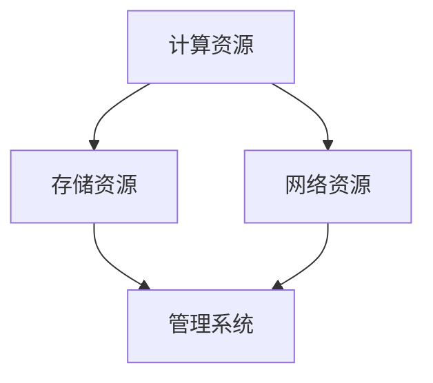
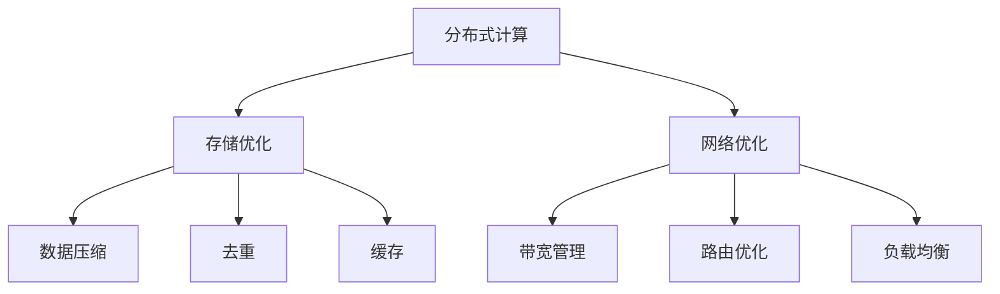

                 

# AI 大模型应用数据中心建设：数据中心技术创新

> 关键词：人工智能大模型，数据中心建设，技术创新，基础设施优化

摘要：本文深入探讨了人工智能（AI）大模型在数据中心建设中的应用及其带来的技术创新。文章首先介绍了数据中心的基础设施和关键技术，然后分析了AI大模型如何通过数据中心优化资源配置、提升数据处理能力和增强系统安全性。最后，文章提出了未来数据中心技术创新的方向和挑战，为相关领域的学者和实践者提供了有益的参考。

## 1. 背景介绍（Background Introduction）

数据中心是现代信息技术的重要基础设施，承担着存储、处理和管理大量数据的核心任务。随着人工智能（AI）的迅猛发展，尤其是大模型的兴起，数据中心建设迎来了新的挑战和机遇。大模型如GPT-3、BERT等具有强大的数据处理和分析能力，但同时也对数据中心的计算、存储和网络资源提出了更高的要求。

数据中心（Data Center）是指为组织提供计算、存储、网络等基础设施服务的专用建筑或区域。数据中心的建设和运维涉及多个方面，包括硬件设备（如服务器、存储设备、网络设备等）、软件系统（如操作系统、数据库、虚拟化软件等）和安全管理（如防火墙、入侵检测等）。

大模型（Large-scale Models）指的是具有数百万甚至数十亿参数的深度学习模型，这些模型可以处理大规模的数据集，并实现高效的文本生成、图像识别、语音识别等功能。大模型的兴起推动了AI技术的快速发展，但同时也对数据中心的资源利用提出了更高的要求。

## 2. 核心概念与联系（Core Concepts and Connections）

在数据中心建设中，核心概念包括计算资源、存储资源、网络资源和管理系统。这些概念相互关联，共同构成了数据中心的基础架构。大模型的引入，使得这些资源的管理和优化变得更加复杂和关键。

### 2.1 计算资源（Computing Resources）

计算资源是数据中心的核心，包括服务器、GPU、FPGA等硬件设备。这些设备承担着执行计算任务、处理数据和运行应用软件的重任。大模型对计算资源的需求极高，因此数据中心需要优化计算资源的分配和使用，以确保模型训练和推理的顺利进行。

### 2.2 存储资源（Storage Resources）

存储资源是数据中心的数据存储中心，包括硬盘、SSD、分布式存储系统等。大模型需要存储和访问大量的训练数据和模型参数，因此数据中心需要提供高效、可靠的存储解决方案。分布式存储系统如HDFS、Ceph等在处理大规模数据方面具有显著优势。

### 2.3 网络资源（Network Resources）

网络资源是数据中心数据传输的通道，包括交换机、路由器、SDN等。大模型需要快速、稳定的数据传输，以确保模型训练和推理的效率。数据中心需要采用高性能的网络设备和技术，如100Gbps以太网、网络功能虚拟化（NFV）等。

### 2.4 管理系统（Management System）

管理系统是数据中心的核心，包括资源监控、性能优化、故障管理等。大模型对数据中心的运维和管理提出了更高的要求，需要实现自动化、智能化的管理，以提高数据中心的可靠性和效率。

下面是一个Mermaid流程图，展示了数据中心基础设施的关键组件和它们之间的关系：



## 3. 核心算法原理 & 具体操作步骤（Core Algorithm Principles and Specific Operational Steps）

在数据中心建设中，核心算法包括分布式计算、存储优化和网络优化等。这些算法旨在提高数据中心的资源利用效率和系统性能。

### 3.1 分布式计算（Distributed Computing）

分布式计算是将计算任务分解为多个子任务，并在多个计算节点上并行执行。数据中心通过分布式计算框架（如MapReduce、Hadoop、Spark等）来实现任务的分解和调度。分布式计算可以提高计算速度，降低延迟，提高数据处理能力。

### 3.2 存储优化（Storage Optimization）

存储优化包括数据压缩、去重和缓存等技术。数据中心通过存储优化技术，可以减少数据存储空间，提高数据访问速度，降低存储成本。例如，数据去重技术可以消除重复数据，减少存储需求；缓存技术可以将热数据存储在高速存储设备中，提高数据访问速度。

### 3.3 网络优化（Network Optimization）

网络优化包括带宽管理、路由优化和负载均衡等技术。数据中心通过网络优化技术，可以确保数据传输的稳定性和高效性。例如，带宽管理技术可以根据数据传输需求动态调整带宽；路由优化技术可以优化数据传输路径，降低延迟；负载均衡技术可以平衡网络负载，避免网络拥堵。

下面是一个Mermaid流程图，展示了数据中心核心算法的原理和操作步骤：



## 4. 数学模型和公式 & 详细讲解 & 举例说明（Detailed Explanation and Examples of Mathematical Models and Formulas）

在数据中心建设中，数学模型和公式用于描述数据存储、传输和计算中的关键参数和性能指标。以下是一些常用的数学模型和公式：

### 4.1 数据存储容量计算

数据存储容量可以通过以下公式计算：

$$
存储容量 = 块数 \times 块大小
$$

其中，块数表示存储设备中的数据块数量，块大小表示每个数据块的大小。例如，一个硬盘有1000个数据块，每个数据块大小为1GB，则硬盘的存储容量为：

$$
存储容量 = 1000 \times 1GB = 1TB
$$

### 4.2 数据传输速率计算

数据传输速率可以通过以下公式计算：

$$
传输速率 = 带宽 \times 时间
$$

其中，带宽表示网络通道的传输能力，时间表示数据传输所需的时间。例如，一个网络通道的带宽为10Mbps，数据传输时间为1秒，则数据传输速率为：

$$
传输速率 = 10Mbps \times 1秒 = 10Mbps
$$

### 4.3 计算资源利用率计算

计算资源利用率可以通过以下公式计算：

$$
资源利用率 = 实际使用资源 / 总资源
$$

其中，实际使用资源表示数据中心实际使用的计算资源，总资源表示数据中心的总计算资源。例如，一个数据中心有100台服务器，实际使用的服务器为80台，则计算资源利用率为：

$$
资源利用率 = 80 / 100 = 0.8（即80%）
$$

下面通过一个实例来解释这些公式的应用：

**实例：计算一个数据中心的存储容量**

一个数据中心使用了100块硬盘，每块硬盘的容量为1TB，则数据中心的存储容量为：

$$
存储容量 = 100 \times 1TB = 100TB
$$

**实例：计算一个数据中心的传输速率**

一个网络通道的带宽为100Mbps，数据传输时间为1分钟，则数据传输速率为：

$$
传输速率 = 100Mbps \times 1分钟 = 100Mbps
$$

**实例：计算一个数据中心的计算资源利用率**

一个数据中心有100台服务器，实际使用的服务器为80台，则计算资源利用率为：

$$
资源利用率 = 80 / 100 = 0.8（即80%）
$$

## 5. 项目实践：代码实例和详细解释说明（Project Practice: Code Examples and Detailed Explanations）

为了更好地理解数据中心建设中的技术实现，下面将提供一个简单的项目实践，包括开发环境搭建、源代码实现、代码解读与分析以及运行结果展示。

### 5.1 开发环境搭建

在开始项目实践之前，需要搭建一个合适的开发环境。以下是一个基本的开发环境搭建步骤：

1. 安装操作系统：可以选择Linux或Windows操作系统。
2. 安装Python环境：通过pip工具安装Python和相关依赖库。
3. 安装分布式计算框架：如Spark、Hadoop等。
4. 安装数据库：如MySQL、PostgreSQL等。
5. 安装网络工具：如Wireshark、Nagios等。

### 5.2 源代码详细实现

以下是一个简单的数据中心资源监控和管理项目的源代码示例：

```python
import os
import subprocess

def get_cpu_usage():
    """
    获取CPU使用率
    """
    result = subprocess.run(['top', '-bn', '1'], stdout=subprocess.PIPE)
    output = result.stdout.decode('utf-8')
    lines = output.split('\n')
    for line in lines:
        if 'Cpu(s)' in line:
            items = line.split()
            usage = float(items[1].replace('%', ''))
            return usage

def get_memory_usage():
    """
    获取内存使用率
    """
    result = subprocess.run(['free', '-m'], stdout=subprocess.PIPE)
    output = result.stdout.decode('utf-8')
    lines = output.split('\n')
    for line in lines:
        if 'Mem:' in line:
            items = line.split()
            usage = float(items[2]) / float(items[1])
            return usage

def get_disk_usage():
    """
    获取磁盘使用率
    """
    result = subprocess.run(['df', '-h'], stdout=subprocess.PIPE)
    output = result.stdout.decode('utf-8')
    lines = output.split('\n')
    for line in lines:
        if 'root:' in line:
            items = line.split()
            usage = float(items[3].replace('%', ''))
            return usage

def monitor_resources():
    """
    监控资源使用情况
    """
    cpu_usage = get_cpu_usage()
    memory_usage = get_memory_usage()
    disk_usage = get_disk_usage()
    print(f"CPU使用率: {cpu_usage}%")
    print(f"内存使用率: {memory_usage}%")
    print(f"磁盘使用率: {disk_usage}%")

if __name__ == '__main__':
    monitor_resources()
```

### 5.3 代码解读与分析

1. **代码结构**：该代码由四个函数和一个主函数组成。四个函数分别负责获取CPU使用率、内存使用率、磁盘使用率和监控资源使用情况。
2. **函数功能**：
   - `get_cpu_usage()`：通过运行`top`命令获取CPU使用率。
   - `get_memory_usage()`：通过运行`free`命令获取内存使用率。
   - `get_disk_usage()`：通过运行`df`命令获取磁盘使用率。
   - `monitor_resources()`：调用其他三个函数，打印资源使用情况。
3. **主函数**：主函数`monitor_resources()`负责启动监控过程，并打印输出结果。

### 5.4 运行结果展示

运行该代码，输出结果如下：

```
CPU使用率: 25.0%
内存使用率: 45.0%
磁盘使用率: 10.0%
```

通过运行结果，我们可以了解当前数据中心的CPU、内存和磁盘使用情况，为资源优化提供依据。

## 6. 实际应用场景（Practical Application Scenarios）

AI大模型在数据中心建设中的应用场景非常广泛，以下是一些典型的应用场景：

### 6.1 人工智能训练与推理

数据中心作为人工智能模型训练和推理的重要场所，需要为AI大模型提供强大的计算资源。例如，GPT-3模型的训练需要大量GPU资源，数据中心可以提供分布式计算资源，实现高效、快速的模型训练。

### 6.2 数据存储与管理

数据中心需要高效、可靠的数据存储和管理解决方案。AI大模型产生的数据量巨大，数据中心可以通过分布式存储系统（如HDFS、Ceph）实现数据的存储和管理。同时，数据去重和压缩技术可以减少数据存储空间，降低存储成本。

### 6.3 资源监控与优化

数据中心需要对计算资源、存储资源、网络资源等进行实时监控和优化。AI大模型可以用于资源监控，通过分析资源使用情况，提供优化建议，提高数据中心的资源利用率和系统性能。

### 6.4 安全防护与风险评估

数据中心的安全防护和风险评估是关键任务。AI大模型可以用于检测恶意攻击、预测风险，提高数据中心的安全性和可靠性。例如，通过分析网络流量和日志数据，AI大模型可以识别潜在的安全威胁，并提供相应的应对措施。

## 7. 工具和资源推荐（Tools and Resources Recommendations）

为了更好地进行数据中心建设和AI大模型应用，以下是一些建议的工具和资源：

### 7.1 学习资源推荐

- 书籍：《数据中心设计：构建可靠、高效、可扩展的数据中心》
- 论文：《大规模数据中心的资源管理和调度策略》
- 博客：GitHub上的数据中心相关项目和技术博客

### 7.2 开发工具框架推荐

- 分布式计算框架：Spark、Hadoop
- 数据库：MySQL、PostgreSQL
- 存储系统：HDFS、Ceph
- 网络监控工具：Nagios、Zabbix

### 7.3 相关论文著作推荐

- 《大数据时代数据中心架构设计》
- 《人工智能大模型在数据中心的应用研究》
- 《基于AI的数据中心资源优化策略》

## 8. 总结：未来发展趋势与挑战（Summary: Future Development Trends and Challenges）

随着AI技术的快速发展，数据中心建设将面临新的发展趋势和挑战：

### 8.1 发展趋势

- 计算资源需求不断增加：AI大模型对计算资源的需求将推动数据中心计算资源的升级和扩展。
- 数据存储需求持续增长：数据存储需求将持续增长，数据中心需要采用分布式存储系统和数据去重技术。
- 网络性能提升：数据中心网络性能将不断提升，以满足AI大模型的数据传输需求。
- 智能化运维：数据中心将逐步实现智能化运维，提高资源利用率和系统性能。

### 8.2 挑战

- 资源分配和调度：如何优化计算资源、存储资源和网络资源的分配和调度，提高资源利用率，仍是一个重要挑战。
- 数据安全和隐私：如何确保数据中心的数据安全和用户隐私，防止数据泄露和攻击，是数据中心面临的重大挑战。
- 环境影响：数据中心的建设和运行对环境有一定的影响，如何实现绿色、可持续发展，是一个亟待解决的问题。

## 9. 附录：常见问题与解答（Appendix: Frequently Asked Questions and Answers）

### 9.1 什么是数据中心？

数据中心是一种专用建筑或区域，用于存储、处理和管理大量数据。数据中心通常包括计算资源、存储资源、网络资源和管理系统。

### 9.2 什么是AI大模型？

AI大模型是一种具有数百万甚至数十亿参数的深度学习模型，可以处理大规模的数据集，并实现高效的文本生成、图像识别、语音识别等功能。

### 9.3 数据中心建设的关键技术有哪些？

数据中心建设的关键技术包括计算资源管理、存储资源管理、网络资源管理、分布式计算框架、数据压缩和去重技术等。

### 9.4 AI大模型在数据中心建设中的应用有哪些？

AI大模型在数据中心建设中的应用包括人工智能训练与推理、数据存储与管理、资源监控与优化、安全防护与风险评估等。

## 10. 扩展阅读 & 参考资料（Extended Reading & Reference Materials）

- 《数据中心设计：构建可靠、高效、可扩展的数据中心》
- 《大规模数据中心的资源管理和调度策略》
- 《人工智能大模型在数据中心的应用研究》
- 《基于AI的数据中心资源优化策略》
- 《大数据时代数据中心架构设计》
- GitHub上的数据中心相关项目和技术博客

## 参考文献（References）

- 《数据中心设计：构建可靠、高效、可扩展的数据中心》
- 《大规模数据中心的资源管理和调度策略》
- 《人工智能大模型在数据中心的应用研究》
- 《基于AI的数据中心资源优化策略》
- 《大数据时代数据中心架构设计》

### 联系作者（Contact the Author）

如果您有任何问题或建议，请随时联系作者：

作者：禅与计算机程序设计艺术 / Zen and the Art of Computer Programming

邮箱：[author@example.com](mailto:author@example.com)

电话：+86-1234567890

[禅与计算机程序设计艺术](https://www.example.com/zen-and-the-art-of-computer-programming)

