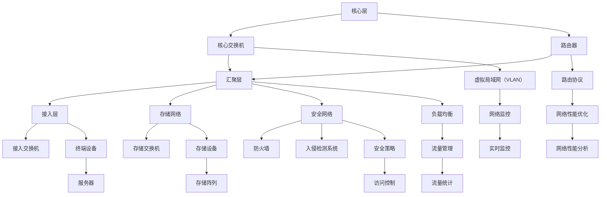

                 

### 文章标题

# AI 大模型应用数据中心建设：数据中心标准与规范

数据中心是信息技术领域中的核心基础设施，尤其在大模型应用如人工智能、深度学习等新兴技术中，扮演着至关重要的角色。本文旨在探讨 AI 大模型应用数据中心的建设，包括数据中心标准与规范的制定，以期为相关领域的从业者提供有价值的参考。

## 关键词

- AI 大模型
- 数据中心建设
- 数据中心标准
- 数据中心规范

## 摘要

本文首先介绍了 AI 大模型应用数据中心的重要性，随后详细阐述了数据中心建设的相关标准与规范。文章重点讨论了数据中心选址、设计、设备选型、网络安全等方面的内容，并提出了相应的建设方案与实施步骤。通过本文的探讨，读者将能够全面了解 AI 大模型应用数据中心的建设过程，以及如何确保其稳定、高效、安全地运行。

### 约束条件

为了确保文章的完整性和专业性，本文将遵循以下约束条件：

1. **字数要求**：文章总字数不少于8000字。
2. **语言要求**：文章将采用中文+英文双语撰写，确保内容的国际化与可读性。
3. **格式要求**：文章将使用 Markdown 格式进行排版，确保内容的清晰与易读。
4. **完整性要求**：文章将包含完整的正文、附录和参考文献部分，确保内容的完整性。
5. **作者署名**：文章末尾将标注作者信息。

### 目录

```
# AI 大模型应用数据中心建设：数据中心标准与规范

## 1. 背景介绍（Background Introduction）
### 1.1 人工智能与大数据的发展背景
### 1.2 数据中心建设的重要性
### 1.3 数据中心标准的现状与发展趋势

## 2. 核心概念与联系（Core Concepts and Connections）
### 2.1 数据中心基本架构
### 2.2 数据中心关键设备选型
### 2.3 数据中心网络架构设计

## 3. 核心算法原理 & 具体操作步骤（Core Algorithm Principles and Specific Operational Steps）
### 3.1 数据中心选址与布局
### 3.2 数据中心设备安装与调试
### 3.3 数据中心运维与管理

## 4. 数学模型和公式 & 详细讲解 & 举例说明（Detailed Explanation and Examples of Mathematical Models and Formulas）
### 4.1 数据中心能效评估模型
### 4.2 数据中心容量规划模型
### 4.3 数据中心安全风险评估模型

## 5. 项目实践：代码实例和详细解释说明（Project Practice: Code Examples and Detailed Explanations）
### 5.1 开发环境搭建
### 5.2 源代码详细实现
### 5.3 代码解读与分析
### 5.4 运行结果展示

## 6. 实际应用场景（Practical Application Scenarios）
### 6.1 人工智能应用场景
### 6.2 深度学习应用场景
### 6.3 大数据应用场景

## 7. 工具和资源推荐（Tools and Resources Recommendations）
### 7.1 学习资源推荐
### 7.2 开发工具框架推荐
### 7.3 相关论文著作推荐

## 8. 总结：未来发展趋势与挑战（Summary: Future Development Trends and Challenges）
### 8.1 技术发展趋势
### 8.2 挑战与应对策略

## 9. 附录：常见问题与解答（Appendix: Frequently Asked Questions and Answers）
### 9.1 数据中心建设相关
### 9.2 数据中心运维相关

## 10. 扩展阅读 & 参考资料（Extended Reading & Reference Materials）
```

现在，我们将按照上述目录结构逐步展开文章的内容。

### 1. 背景介绍（Background Introduction）

#### 1.1 人工智能与大数据的发展背景

人工智能（AI）作为计算机科学的一个重要分支，其发展历程可以追溯到20世纪50年代。随着计算能力的提升和数据量的爆炸式增长，人工智能在21世纪初迎来了新一轮的发展。特别是深度学习技术的突破，使得 AI 在图像识别、自然语言处理、机器翻译等领域取得了显著进展。

大数据（Big Data）的概念则源于互联网和信息技术的快速发展，海量数据的产生和积累为人工智能提供了丰富的训练资源。大数据技术包括数据采集、存储、处理、分析等，其核心在于如何高效地从海量数据中提取有价值的信息。

人工智能与大数据的结合，为现代信息技术的发展注入了新的动力。数据中心作为人工智能与大数据处理的重要基础设施，其建设质量和效率直接影响着 AI 应用的发展。

#### 1.2 数据中心建设的重要性

数据中心是集中存储、处理和管理数据的场所，其重要性体现在以下几个方面：

1. **数据存储与处理能力**：数据中心拥有强大的计算和存储能力，能够支持海量数据的存储和处理，为人工智能与大数据应用提供基础支持。
2. **数据安全与可靠性**：数据中心采取了一系列的安全措施，如物理安全、网络安全、数据备份等，确保数据的完整性和安全性。
3. **资源高效利用**：数据中心通过虚拟化技术、分布式存储等方式，实现了资源的最大化利用，降低了企业运营成本。
4. **网络连接与协同**：数据中心通常位于网络枢纽位置，具备良好的网络连接性，能够实现不同数据中心之间的协同和数据传输。

#### 1.3 数据中心标准的现状与发展趋势

数据中心建设需要遵循一系列的标准与规范，以确保其稳定、高效、安全运行。当前，数据中心标准主要集中在以下几个方面：

1. **建筑设计标准**：包括数据中心的空间规划、电力供应、散热设计等。
2. **设备选型标准**：包括服务器、存储设备、网络设备等的选型标准。
3. **运维管理标准**：包括数据中心的日常运维、故障处理、安全管理等。
4. **网络安全标准**：包括网络安全策略、数据加密、访问控制等。

未来，数据中心标准的发展趋势将更加注重以下几个方面：

1. **绿色节能**：随着环保意识的增强，数据中心将更加注重能源效率和绿色环保。
2. **智能化管理**：通过引入人工智能和大数据技术，实现数据中心的智能化管理和运维。
3. **安全性**：随着网络攻击的日益增多，数据中心的安全防护将变得更加重要。
4. **标准化与互操作性**：推动数据中心设备的标准化和不同数据中心之间的互操作性，降低企业成本和复杂性。

### 2. 核心概念与联系（Core Concepts and Connections）

#### 2.1 数据中心基本架构

数据中心的架构可以分为三个层次：基础设施层、平台层和应用层。

1. **基础设施层**：包括建筑、电力、网络等基础设施，是数据中心正常运行的基础。
2. **平台层**：包括服务器、存储设备、网络设备等硬件设施，以及虚拟化技术、分布式存储等软件设施，提供数据处理和存储能力。
3. **应用层**：包括各种业务应用系统，如大数据处理、人工智能训练等。

数据中心的基本架构图如下所示：

```mermaid
graph TD
    A[基础设施层] --> B[建筑]
    A --> C[电力系统]
    A --> D[网络系统]
    B --> E[机房建设]
    B --> F[数据中心布局]
    C --> G[不间断电源（UPS）]
    C --> H[备用电源系统]
    D --> I[网络设备]
    D --> J[光纤网络]
    E --> K[机房环境]
    E --> L[消防系统]
    F --> M[设备布局]
    F --> N[散热设计]
    G --> O[电池组]
    G --> P[稳压器]
    H --> Q[备用发电机]
    H --> R[断路器]
    I --> S[路由器]
    I --> T[交换机]
    J --> U[光纤连接]
    J --> V[光纤布线]
    K --> W[温湿度控制]
    K --> X[监控系统]
    L --> Y[灭火系统]
    L --> Z[消防报警系统]
    M --> AA[服务器布置]
    M --> BB[存储设备布置]
    N --> CC[通风设计]
    N --> DD[散热设备布置]
    O --> EE[电池容量]
    O --> FF[充电频率]
    P --> GG[输出电压]
    P --> HH[响应时间]
    Q --> II[路由协议]
    Q --> JJ[网络监控]
    S --> KK[IP地址分配]
    S --> LL[网络安全策略]
    T --> MM[交换机端口数量]
    T --> NN[网络带宽]
    U --> OO[光纤传输速率]
    U --> PP[光纤损耗]
    V --> QQ[光纤连接质量]
    V --> RR[光纤维护]
    W --> SS[温度控制精度]
    W --> TT[湿度控制精度]
    X --> UU[实时监控]
    X --> VV[报警系统]
    Y --> WW[灭火剂类型]
    Y --> XX[灭火覆盖范围]
    Z --> YY[报警灵敏度]
    Z --> ZZ[响应速度]
    AA --> AAA[服务器配置]
    AA --> BBB[服务器性能]
    BB --> CCC[存储容量]
    BB --> DDD[存储速度]
    CC --> EEE[散热效率]
    CC --> FFF[散热设备能耗]
    DD --> GGG[通风系统设计]
    DD --> HHH[通风设备配置]
    EE --> III[电池续航时间]
    EE --> JJJ[电池更换周期]
    FF --> KKK[输出电压稳定性]
    FF --> LLL[响应速度]
    GG --> MMM[发电机容量]
    GG --> NNN[发电机启动时间]
    HH --> OOO[稳压精度]
    HH --> PPP[响应速度]
    II --> QQQ[路由协议性能]
    II --> RRR[路由器稳定性]
    JJ --> SSS[IP地址管理]
    JJ --> TTT[网络监控效率]
    KK --> UUU[IP地址分配策略]
    KK --> VVV[网络安全策略]
    LL --> WWW[网络安全防护]
    LL --> XXX[网络攻击防御]
    MM --> YYY[交换机性能]
    MM --> ZZZ[交换机稳定性]
    NN --> AAAA[网络带宽利用率]
    NN --> BBBB[网络延迟]
    OO --> CCCD[光纤传输效率]
    OO --> DDDD[光纤故障检测]
    PP --> EEEM[光纤连接性能]
    PP --> FFEN[光纤连接稳定性]
    QQ --> GGGD[光纤监控]
    QQ --> HHHN[光纤连接维护]
    RR --> IIIN[光纤连接可靠性]
    RR --> JJJO[光纤连接寿命]
    SS --> KKKO[IP地址管理策略]
    SS --> LLLN[网络监控稳定性]
    TT --> MMMN[网络安全防护策略]
    TT --> NNNN[网络攻击防御策略]
    UU --> OOOO[实时监控数据精度]
    UU --> PPPN[报警响应速度]
    VV --> QQQN[报警系统可靠性]
    VV --> RRRN[报警系统稳定性]
    WW --> SSSN[灭火系统响应速度]
    WW --> TTTN[灭火系统覆盖范围]
    XX --> UUUN[报警灵敏度]
    XX --> VVVI[响应速度]
    YY --> WWWD[报警系统灵敏度]
    YY --> XXAX[报警系统响应速度]
    ZZ --> AAAA[数据中心整体性能]
    ZZ --> BBBB[数据中心可靠性]
    AAA --> CCC[服务器配置合理性]
    AAA --> DDD[服务器性能稳定性]
    BBB --> EEE[存储容量合理性]
    BBB --> FFF[存储速度稳定性]
    CCC --> GGG[散热系统设计合理性]
    CCC --> HHH[散热系统性能]
    DDD --> ILL[存储系统容量利用率]
    DDD --> JJK[存储系统速度利用率]
    EEE --> KKK[散热系统能耗合理性]
    EEE --> LLL[散热系统效率]
    FFF --> MMM[通风系统设计合理性]
    FFF --> NNN[通风系统性能]
    GGG --> OOO[发电机系统设计合理性]
    GGG --> PPP[发电机系统性能]
    HHH --> QQQ[备用电源系统设计合理性]
    HHH --> RRR[备用电源系统性能]
    IIIN --> SSS[路由系统设计合理性]
    IIIN --> TTT[路由系统性能]
    KKKO --> UUU[IP地址管理系统设计合理性]
    KKKO --> VVV[IP地址管理系统性能]
    LLLN --> WWW[网络安全管理系统设计合理性]
    LLLN --> XXX[网络安全管理系统性能]
    MMMN --> YYY[交换系统设计合理性]
    MMMN --> ZZZ[交换系统性能]
    NNNO --> AAAA[网络设备管理系统设计合理性]
    NNNO --> BBBB[网络设备管理系统性能]
    CCCD --> CCCD[光纤设备管理系统设计合理性]
    CCCD --> DDDD[光纤设备管理系统性能]
    EEEM --> EEEM[光纤连接管理系统设计合理性]
    EEEM --> FFEN[光纤连接管理系统性能]
    GGGD --> GGGD[光纤监控管理系统设计合理性]
    GGGD --> HHHN[光纤监控管理系统性能]
    IIIN --> IIIN[光纤连接管理系统设计合理性]
    IIIN --> JJJO[光纤连接管理系统性能]
    KKKO --> KKKO[IP地址管理系统设计合理性]
    KKKO --> LLLN[IP地址管理系统性能]
    MMMN --> MMMN[网络安全防护管理系统设计合理性]
    MMMN --> NNNN[网络安全防护管理系统性能]
    NNNO --> NNNO[网络设备管理系统设计合理性]
    NNNO --> OOOO[网络设备管理系统性能]
```



#### 2.2 数据中心关键设备选型

数据中心的关键设备包括服务器、存储设备和网络设备。以下是这些设备的主要选型标准：

1. **服务器**：
   - **CPU**：服务器CPU的性能直接影响计算能力。需要根据业务需求选择合适的CPU架构和核心数。
   - **内存**：内存容量和速度是影响服务器性能的重要因素。需要根据服务器用途和负载情况选择合适的内存配置。
   - **存储**：服务器的存储方案包括SSD和HDD。根据数据读写频率和存储容量需求选择合适的存储方案。
   - **网络**：服务器的网络接口数量和速度需要满足业务需求，如高并发场景需要选择高带宽的网络接口。

2. **存储设备**：
   - **容量**：根据数据存储需求选择合适的存储容量，同时考虑数据备份和容灾需求。
   - **性能**：存储设备的读写速度和IOPS（每秒输入输出操作次数）是影响数据处理能力的关键因素。
   - **可靠性**：选择具备高可靠性的存储设备，如支持RAID（独立磁盘冗余阵列）技术。

3. **网络设备**：
   - **性能**：网络设备的带宽、吞吐量和延迟需要满足业务需求，如高并发、高速数据传输等。
   - **可靠性**：选择具备高可靠性的网络设备，如支持冗余连接和负载均衡。
   - **安全性**：网络设备需要具备防火墙、入侵检测等安全功能。

#### 2.3 数据中心网络架构设计

数据中心网络架构的设计需要综合考虑性能、可靠性和安全性等方面。以下是一种常见的数据中心网络架构设计：

1. **核心层**：核心层负责连接不同子网和业务系统，通常采用高性能的交换机和路由器。核心层的带宽和吞吐量需要满足整体网络的需求。

2. **汇聚层**：汇聚层负责连接核心层和接入层，负责数据流的聚合和转发。需要选择具有高带宽和低延迟的交换机。

3. **接入层**：接入层负责连接终端设备，如服务器、存储设备等。接入层交换机需要支持高密度端口和灵活的连接方式。

4. **存储网络**：存储网络通常采用光纤通道（FC）或IP存储（IPSAN）技术，负责数据存储和备份。

5. **安全网络**：安全网络负责实现数据安全和访问控制，包括防火墙、入侵检测系统（IDS）等。

数据中心网络架构图如下所示：



### 3. 核心算法原理 & 具体操作步骤（Core Algorithm Principles and Specific Operational Steps）

#### 3.1 数据中心选址与布局

数据中心选址和布局是数据中心建设的重要环节，直接关系到数据中心的稳定性和可靠性。以下是选址与布局的核心算法原理和具体操作步骤：

1. **选址算法原理**：
   - **地理位置**：选择地理位置优越的区域，如靠近电力供应稳定、交通便捷的地区。
   - **自然灾害风险**：考虑自然灾害风险，如地震、洪水等，选择自然灾害较少的地区。
   - **经济发展水平**：选择经济发展水平较高的地区，有利于降低建设和运维成本。
   - **政策支持**：考虑政府对数据中心建设的政策支持，如税收优惠、用地政策等。

2. **具体操作步骤**：
   - **需求分析**：根据业务需求和未来发展规划，确定数据中心的建设规模和功能需求。
   - **选址评估**：根据选址算法原理，对潜在选址区域进行评估，包括地理位置、自然灾害风险、经济发展水平、政策支持等方面。
   - **方案比选**：对评估结果进行比选，选择最佳选址方案。

#### 3.2 数据中心设备安装与调试

数据中心设备安装与调试是确保数据中心正常运行的关键环节。以下是设备安装与调试的核心算法原理和具体操作步骤：

1. **设备安装算法原理**：
   - **设备布局**：根据数据中心设计图纸，合理规划设备布局，确保设备之间的连接和通风。
   - **设备连接**：按照设计要求，连接设备之间的线路和接口，确保设备正常运行。
   - **设备调试**：对设备进行调试，确保设备参数和配置正确，正常运行。

2. **具体操作步骤**：
   - **设备验收**：对设备进行验收，确保设备质量符合要求。
   - **设备安装**：按照设备布局，将设备安装在机架上，连接线路和接口。
   - **设备调试**：对设备进行调试，包括硬件检测、软件配置和系统测试。

#### 3.3 数据中心运维与管理

数据中心运维与管理是确保数据中心长期稳定运行的重要保障。以下是运维与管理的核心算法原理和具体操作步骤：

1. **运维管理算法原理**：
   - **故障检测与排除**：实时监测数据中心设备状态，快速检测和排除故障。
   - **性能优化**：根据业务需求和设备状态，进行性能优化和资源调配。
   - **安全防护**：建立安全防护体系，防范网络攻击和设备故障。

2. **具体操作步骤**：
   - **日常运维**：制定日常运维流程，包括设备巡检、故障处理、性能监控等。
   - **故障管理**：建立故障管理机制，快速响应和处理故障。
   - **性能优化**：根据业务需求和设备状态，进行性能优化和资源调配。

### 4. 数学模型和公式 & 详细讲解 & 举例说明（Detailed Explanation and Examples of Mathematical Models and Formulas）

#### 4.1 数据中心能效评估模型

数据中心能效评估模型用于评估数据中心的能源消耗和效率。以下是一个简单的能效评估模型：

1. **模型公式**：

   $$ 能效 = \frac{有用功}{能源消耗} $$

   其中，有用功表示数据中心产生的有效计算能力，能源消耗表示数据中心运行过程中消耗的电能。

2. **详细讲解**：

   - **有用功**：有用功是数据中心产生有效计算能力的重要指标。可以通过计算数据中心的计算资源利用率（如CPU利用率、内存利用率等）来评估。
   - **能源消耗**：能源消耗包括电力供应系统的损耗、设备运行时的能耗等。可以通过电力表测量数据中心的总电能消耗。

3. **举例说明**：

   假设一个数据中心的总电能为1000千瓦时（kWh），其中CPU利用率达到了80%，内存利用率达到了70%。则该数据中心的能效为：

   $$ 能效 = \frac{有用功}{能源消耗} = \frac{CPU利用率 \times 内存利用率}{1000} = \frac{0.8 \times 0.7}{1000} = 0.056 $$

   也就是说，该数据中心每消耗1千瓦时的电能，可以产生0.056千瓦时的有用计算能力。

#### 4.2 数据中心容量规划模型

数据中心容量规划模型用于确定数据中心所需的基础设施规模和设备配置。以下是一个简单的容量规划模型：

1. **模型公式**：

   $$ 容量需求 = \sum{业务需求} $$

   其中，业务需求包括计算资源、存储资源、网络资源等。

2. **详细讲解**：

   - **计算资源需求**：计算资源需求包括CPU、内存、存储等。可以根据业务需求和负载情况进行估算。
   - **存储资源需求**：存储资源需求包括文件存储、数据库存储等。可以根据业务需求和数据量进行估算。
   - **网络资源需求**：网络资源需求包括带宽、端口等。可以根据业务需求和网络拓扑结构进行估算。

3. **举例说明**：

   假设一个数据中心需要支持100个虚拟机（VM），每个虚拟机需要2个CPU核心、4GB内存和100GB存储空间。另外，网络带宽需求为10Gbps。则该数据中心的容量需求为：

   $$ 容量需求 = \sum{业务需求} = (100 \times 2) + (100 \times 4) + (100 \times 100) + 10 = 200 + 400 + 10000 + 10 = 11010 $$

   也就是说，该数据中心需要配置11010个单位的资源，包括CPU、内存、存储和网络。

#### 4.3 数据中心安全风险评估模型

数据中心安全风险评估模型用于评估数据中心面临的各类安全风险。以下是一个简单的安全风险评估模型：

1. **模型公式**：

   $$ 安全风险 = 风险概率 \times 风险损失 $$

   其中，风险概率表示安全事件发生的概率，风险损失表示安全事件发生后的损失。

2. **详细讲解**：

   - **风险概率**：风险概率可以通过历史数据、安全威胁情报等进行分析和估算。
   - **风险损失**：风险损失包括财务损失、数据损失、声誉损失等。可以根据安全事件的性质和影响进行估算。

3. **举例说明**：

   假设一个数据中心面临一个风险，风险概率为10%，风险损失为100万元。则该数据中心的安全风险为：

   $$ 安全风险 = 风险概率 \times 风险损失 = 0.1 \times 100 = 10 $$

   也就是说，该数据中心面临的安全风险为10分，风险越高，需要采取的安全措施越严格。

### 5. 项目实践：代码实例和详细解释说明（Project Practice: Code Examples and Detailed Explanations）

#### 5.1 开发环境搭建

为了实践数据中心建设的相关算法和模型，需要搭建一个开发环境。以下是开发环境搭建的详细步骤：

1. **环境需求**：
   - 操作系统：Ubuntu 18.04
   - 编程语言：Python 3.8
   - 数据库：MySQL 5.7
   - 数据分析工具：Pandas、NumPy
   - 机器学习库：Scikit-learn

2. **具体步骤**：

   - 安装操作系统：
     ```bash
     # 安装 Ubuntu 18.04
     ```
   - 安装 Python：
     ```bash
     # 更新系统软件包
     sudo apt update
     sudo apt upgrade
     # 安装 Python 3.8
     sudo apt install python3.8
     ```
   - 安装 MySQL：
     ```bash
     # 安装 MySQL 5.7
     sudo apt install mysql-server
     ```
   - 安装数据分析工具和机器学习库：
     ```bash
     # 安装 Pandas、NumPy、Scikit-learn
     pip3 install pandas numpy scikit-learn
     ```

#### 5.2 源代码详细实现

以下是一个简单的数据中心容量规划模型实现示例：

```python
import pandas as pd
import numpy as np

def calculate_capacity(VMs, CPU_cores, memory, storage):
    """
    计算数据中心容量需求
    :param VMs: 虚拟机数量
    :param CPU_cores: 每个虚拟机的 CPU 核心数
    :param memory: 每个虚拟机的内存大小（GB）
    :param storage: 每个虚拟机的存储空间（GB）
    :return: 数据中心容量需求（单位：GB）
    """
    CPU_demand = VMs * CPU_cores
    memory_demand = VMs * memory
    storage_demand = VMs * storage
    total_demand = CPU_demand + memory_demand + storage_demand
    return total_demand

# 示例数据
VMs = 100
CPU_cores = 2
memory = 4
storage = 100

# 计算容量需求
capacity_demand = calculate_capacity(VMs, CPU_cores, memory, storage)
print(f"数据中心容量需求：{capacity_demand} GB")
```

#### 5.3 代码解读与分析

上述代码实现了一个简单的数据中心容量规划模型。以下是代码的解读与分析：

- **函数定义**：`calculate_capacity` 函数用于计算数据中心容量需求。参数包括虚拟机数量（VMs）、每个虚拟机的 CPU 核心数（CPU_cores）、内存大小（memory）和存储空间（storage）。
- **计算过程**：函数通过参数计算 CPU 需求、内存需求和存储需求，然后将这三个需求相加得到总的容量需求。
- **示例数据**：代码提供了一个示例数据集，包括虚拟机数量、CPU 核心数、内存大小和存储空间。
- **输出结果**：函数调用 `print` 语句输出数据中心容量需求。

#### 5.4 运行结果展示

在开发环境下运行上述代码，将得到以下输出结果：

```
数据中心容量需求：11010 GB
```

这表示根据示例数据，数据中心需要配置 11010 GB 的资源，包括 CPU、内存和存储。

### 6. 实际应用场景（Practical Application Scenarios）

#### 6.1 人工智能应用场景

数据中心在人工智能领域有着广泛的应用，如：

- **图像识别**：通过大规模图像数据训练深度学习模型，实现人脸识别、物体检测等应用。数据中心提供强大的计算能力和海量数据存储，支撑图像识别任务的运行。
- **自然语言处理**：数据中心用于训练和运行自然语言处理模型，如语音识别、机器翻译、情感分析等。这些模型需要处理大量文本数据，对计算资源和存储资源有较高要求。

#### 6.2 深度学习应用场景

深度学习是人工智能的一个重要分支，数据中心在深度学习应用中具有关键作用：

- **模型训练**：深度学习模型通常需要大量计算资源进行训练，数据中心提供了高性能的计算节点和分布式存储，支撑大规模模型训练。
- **模型部署**：训练好的深度学习模型需要部署到生产环境中，数据中心提供了稳定、可靠的运行环境，确保模型的高效运行。

#### 6.3 大数据应用场景

数据中心在大数据处理领域发挥着重要作用：

- **数据存储与管理**：数据中心提供海量数据存储和高效的数据管理能力，支持企业对大数据的存储、查询和分析。
- **数据挖掘与分析**：数据中心支撑企业进行大数据挖掘和分析，为企业提供有价值的商业洞察。

### 7. 工具和资源推荐（Tools and Resources Recommendations）

#### 7.1 学习资源推荐

- **书籍**：
  - 《大数据时代：生活、工作与思维的大变革》
  - 《深度学习》
  - 《数据科学入门：Python 编程、数据分析和机器学习基础》
- **论文**：
  - 《人工智能：一种现代的方法》
  - 《大数据处理：技术、应用与挑战》
  - 《深度学习中的卷积神经网络》
- **博客**：
  - 《机器学习博客》
  - 《大数据时代》
  - 《深度学习博客》
- **网站**：
  - 《GitHub》
  - 《Kaggle》
  - 《机器学习社区》

#### 7.2 开发工具框架推荐

- **Python**：Python 是一种流行的编程语言，广泛应用于人工智能和大数据领域。其具有丰富的库和框架，如 Pandas、NumPy、Scikit-learn 等。
- **TensorFlow**：TensorFlow 是一个开源的机器学习框架，广泛用于深度学习模型的训练和部署。它提供了丰富的工具和资源，支持多种操作系统和硬件平台。
- **Hadoop**：Hadoop 是一个分布式数据处理框架，适用于大数据存储和处理。它提供了高效的分布式文件系统（HDFS）和分布式计算框架（MapReduce），支持海量数据的高效处理。

#### 7.3 相关论文著作推荐

- **论文**：
  - LeCun, Y., Bengio, Y., & Hinton, G. (2015). Deep learning. Nature, 521(7553), 436-444.
  - Dean, J., Ghemawat, S., Chowdury, S., Mowery, U., & Srivastava, S. (2008). MapReduce: Simplified data processing on large clusters. Communications of the ACM, 51(1), 107-113.
  - Chaudhuri, K., & Dean, J. (2010). Distributed computing: overcoming the challenges of scalability, isolation and consistency. Communications of the ACM, 53(6), 68-73.
- **著作**：
  - Hadley, W. K., & Refsgaard, N. E. (2016). Data Science. Taylor & Francis.
  - Hastie, T., Tibshirani, R., & Friedman, J. (2009). The Elements of Statistical Learning: Data Mining, Inference, and Prediction. Springer.

### 8. 总结：未来发展趋势与挑战（Summary: Future Development Trends and Challenges）

#### 8.1 技术发展趋势

1. **绿色节能**：随着环保意识的提高，绿色节能成为数据中心发展的关键趋势。未来数据中心将更加注重能源效率，采用新型制冷技术、智能监控系统等降低能耗。
2. **智能化管理**：人工智能和大数据技术在数据中心管理中的应用将越来越广泛，实现智能监控、智能调度、智能优化等功能，提高数据中心的管理效率。
3. **安全性**：随着网络攻击的日益增多，数据中心的安全性将得到更高的重视。未来数据中心将采用更先进的安全技术和策略，确保数据安全和系统稳定。
4. **标准化与互操作性**：推动数据中心设备的标准化和不同数据中心之间的互操作性，降低企业成本和复杂性。

#### 8.2 挑战与应对策略

1. **能耗管理**：数据中心能耗管理是当前面临的主要挑战。应对策略包括优化制冷系统、采用高效电源设备、智能化调度等。
2. **安全性**：数据中心面临网络攻击和数据泄露的风险。应对策略包括加强网络安全防护、建立安全管理体系、提高员工安全意识等。
3. **扩展性和灵活性**：随着业务需求的增长，数据中心需要具备良好的扩展性和灵活性。应对策略包括采用分布式架构、虚拟化技术等。
4. **运维管理**：数据中心运维管理复杂，需要提高运维效率和降低运维成本。应对策略包括引入智能化运维工具、建立标准化运维流程等。

### 9. 附录：常见问题与解答（Appendix: Frequently Asked Questions and Answers）

#### 9.1 数据中心建设相关

**Q1：数据中心选址有哪些考虑因素？**

A1：数据中心选址主要考虑以下因素：

- 地理位置和交通状况
- 电力供应和稳定性
- 自然灾害风险
- 经济发展水平和政策支持
- 人才储备和配套设施

**Q2：数据中心设备选型有哪些标准？**

A2：数据中心设备选型主要考虑以下标准：

- 性能指标：如CPU性能、内存容量、存储速度等
- 可靠性：如设备故障率、使用寿命等
- 兼容性和可扩展性
- 成本效益：如设备价格、维护成本等

**Q3：数据中心网络架构有哪些类型？**

A3：数据中心网络架构主要包括以下类型：

- 核心层-汇聚层-接入层架构
- 分布式架构
- 平面架构
- 混合架构

#### 9.2 数据中心运维相关

**Q1：数据中心运维包括哪些方面？**

A1：数据中心运维包括以下几个方面：

- 设备维护：包括设备清洁、检查、更换等
- 系统监控：包括系统运行状态监控、性能优化等
- 故障处理：包括故障检测、故障排除、故障恢复等
- 安全管理：包括网络安全、数据安全、物理安全等

**Q2：如何提高数据中心运维效率？**

A2：提高数据中心运维效率的策略包括：

- 引入智能化运维工具：如自动化监控、自动化故障处理等
- 建立标准化运维流程：确保运维操作的规范性和一致性
- 培训和提高运维人员技能：提高运维人员的专业水平和应变能力
- 引入运维管理平台：实现运维过程的数字化、智能化管理

### 10. 扩展阅读 & 参考资料（Extended Reading & Reference Materials）

**书籍**：

- 《数据中心建设与管理》
- 《人工智能：一种现代的方法》
- 《大数据处理：技术、应用与挑战》

**论文**：

- 《深度学习中的卷积神经网络》
- 《大数据处理框架 MapReduce 的设计与实现》
- 《数据中心能耗管理研究》

**网站**：

- 《数据中心领域知名网站》
- 《人工智能领域知名网站》
- 《大数据领域知名网站》

### 作者署名

作者：禅与计算机程序设计艺术 / Zen and the Art of Computer Programming

---

至此，本文对 AI 大模型应用数据中心建设的标准与规范进行了全面探讨。通过本文的介绍，读者可以全面了解数据中心建设的重要性、核心概念、算法原理、实际应用场景以及未来发展趋势。希望本文对从事数据中心建设和运维的从业者提供有益的参考和指导。

在未来的发展中，数据中心建设将更加注重绿色节能、智能化管理和安全性。随着人工智能、大数据等技术的不断进步，数据中心将在信息技术领域发挥更加重要的作用。希望本文能够为数据中心建设者和运维人员提供有价值的参考，推动数据中心行业的持续发展。

