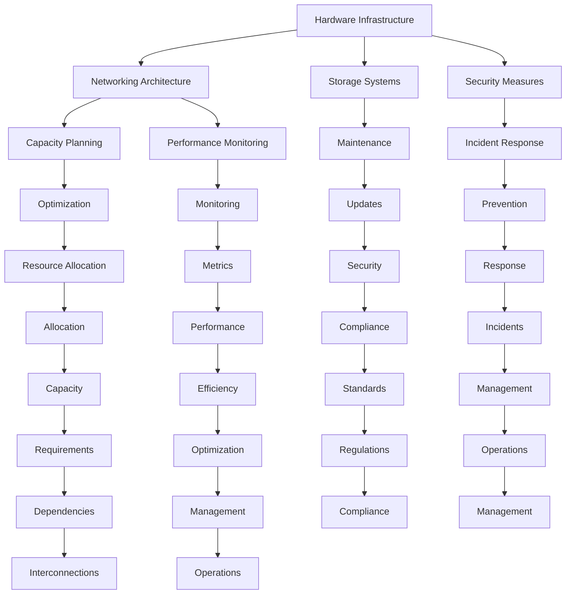

                 

### 1. 背景介绍 Background Introduction

In recent years, with the rapid development of artificial intelligence (AI), large-scale AI models, such as GPT-3, BERT, and T5, have become increasingly prevalent. These models are powerful tools for natural language processing (NLP), image recognition, and other applications. To effectively manage and utilize these models, a well-designed and robust data center is essential. This article aims to provide an in-depth analysis of AI large model application data center construction, focusing on the operation and management of data centers.

#### 1.1 The Significance of AI Large Model Application Data Centers

The significance of AI large model application data centers lies in several key aspects. Firstly, these data centers enable the efficient storage, processing, and analysis of massive amounts of data, which is crucial for training and deploying large-scale AI models. Secondly, data centers provide a reliable and scalable infrastructure to support the high computational demands of these models. Finally, efficient data center management ensures the optimal performance, availability, and security of the AI applications running within the data centers.

#### 1.2 The Evolution of AI Large Model Data Centers

The evolution of AI large model data centers can be traced back to the early days of AI research. Initially, researchers relied on small-scale servers and desktop computers to train and run AI models. However, as the complexity of these models increased, the demand for more powerful and scalable computing resources emerged. This led to the establishment of dedicated data centers designed specifically for AI applications. These data centers are equipped with advanced hardware, such as GPUs and TPUs, and utilize distributed computing and storage technologies to handle the large-scale data and computation required by AI models.

#### 1.3 Challenges in Data Center Construction and Management

Building and managing an AI large model application data center presents several challenges. Firstly, the high computational demands of these models require a significant investment in hardware, power, and cooling infrastructure. Secondly, the need for continuous and reliable data access and processing requires a robust network architecture and efficient data management strategies. Finally, the security and privacy of the data stored and processed in the data centers must be carefully addressed to prevent unauthorized access and data breaches.

### 1.4 The Importance of Data Center Operations and Management

Effective data center operations and management are crucial for the success of AI large model applications. Data center operations involve monitoring and maintaining the physical infrastructure, ensuring power and cooling systems are functioning properly, and managing network connectivity. Data center management includes tasks such as capacity planning, performance monitoring, security management, and incident response. By addressing these aspects, data centers can ensure the optimal performance, availability, and security of AI applications running within them.

### 1.5 Objectives of This Article

The objectives of this article are as follows:

1. To provide a comprehensive overview of AI large model application data centers, including their significance, evolution, and challenges.
2. To explore the key components and technologies required for building and managing these data centers.
3. To discuss the best practices for data center operations and management.
4. To provide insights into future development trends and challenges in AI large model application data centers.

---

### 2. 核心概念与联系 Core Concepts and Connections

To understand the construction and management of AI large model application data centers, it is essential to grasp the core concepts and their interconnections. In this section, we will delve into the fundamental components and technologies that constitute a data center, including hardware, networking, storage, and security.

#### 2.1 Hardware Infrastructure

The hardware infrastructure of a data center is the foundation upon which the entire system is built. It includes servers, storage systems, networking equipment, and power and cooling systems. Servers are the primary computing resources that host the AI models and perform data processing tasks. Storage systems provide the necessary capacity to store vast amounts of data, while networking equipment ensures seamless communication between servers and other components. Power and cooling systems are critical to maintaining the optimal operating conditions of the hardware.

#### 2.2 Networking Architecture

Networking is a crucial component of a data center, enabling efficient data transfer and communication between servers, storage systems, and other devices. A well-designed network architecture should provide high bandwidth, low latency, and high availability. Common network architectures include local area networks (LANs), wide area networks (WANs), and cloud networks. Network technologies such as virtual local area networks (VLANs), load balancers, and firewalls are essential for ensuring secure and efficient data transfer.

#### 2.3 Storage Systems

Storage systems play a vital role in data center operations, providing the necessary capacity and performance to support AI applications. There are two main types of storage systems: primary storage and secondary storage. Primary storage, such as solid-state drives (SSDs), provides fast access to data, while secondary storage, such as hard disk drives (HDDs), offers high capacity at a lower cost. Modern data centers often employ a combination of storage systems to optimize performance and cost.

#### 2.4 Security Measures

Data security is a top priority in data center operations, given the sensitive nature of the data stored and processed within these facilities. Security measures include physical security, such as surveillance systems and access control, as well as network security, such as firewalls, intrusion detection systems (IDS), and data encryption. Additionally, data centers must comply with industry regulations and standards, such as the General Data Protection Regulation (GDPR) and the Federal Information Security Management Act (FISMA).

#### 2.5 Data Center Operations and Management

Data center operations and management encompass a wide range of tasks, including capacity planning, performance monitoring, maintenance, and incident response. Capacity planning involves estimating the future demand for computing resources and adjusting the data center infrastructure accordingly. Performance monitoring involves tracking various performance metrics, such as CPU utilization, network latency, and storage capacity, to ensure optimal system performance. Maintenance tasks include hardware upgrades, software updates, and security audits. Incident response involves addressing and mitigating any issues or disruptions that may occur in the data center.

#### 2.6 Interconnections and Dependencies

The various components of a data center are interconnected and dependent on each other. For example, the performance of the hardware infrastructure directly impacts the efficiency of data processing and storage. The networking architecture determines how quickly and reliably data can be transferred between servers and storage systems. Security measures protect the data and systems from unauthorized access and attacks. By understanding these interconnections and dependencies, data center operators can design and manage a cohesive and efficient infrastructure.

### 2.7 Mermaid Flowchart of Core Concepts

The following Mermaid flowchart illustrates the core concepts and their interconnections in an AI large model application data center:



---

### 3. 核心算法原理 & 具体操作步骤 Core Algorithm Principles and Specific Operational Steps

#### 3.1 Overview of Core Algorithms

The core algorithms in AI large model application data centers primarily focus on training, inference, and optimization. Training algorithms, such as gradient descent and stochastic gradient descent (SGD), are used to update the model parameters based on the input data. Inference algorithms, such as feedforward and backpropagation, are employed to generate predictions from new data. Optimization algorithms, such as gradient descent with momentum and Adam optimizer, are used to improve the convergence speed and accuracy of the training process.

#### 3.2 Training Algorithm: Gradient Descent

Gradient descent is a fundamental optimization algorithm used to minimize the loss function in machine learning models. The goal of gradient descent is to find the minimum point of the loss function surface, which corresponds to the optimal model parameters.

**Principles of Gradient Descent:**

1. Initialize the model parameters randomly.
2. Compute the gradient of the loss function with respect to the model parameters.
3. Update the model parameters in the opposite direction of the gradient.
4. Repeat steps 2 and 3 until convergence.

**Steps for Implementing Gradient Descent:**

1. **Initialization:** Set an initial learning rate $\alpha$ and initialize the model parameters $\theta$ randomly.
2. **Forward Pass:** Compute the predicted output $y_{\hat{}}$ using the current model parameters $\theta$.
3. **Compute Loss:** Calculate the loss $L(y, y_{\hat{}})$ between the predicted output and the actual output.
4. **Backward Pass:** Compute the gradient $\nabla_{\theta} L$ of the loss function with respect to the model parameters.
5. **Parameter Update:** Update the model parameters $\theta$ using the gradient and learning rate: $\theta := \theta - \alpha \nabla_{\theta} L$.
6. **Convergence Check:** Check for convergence, typically by monitoring the change in loss or the number of iterations. If the change is below a threshold or the number of iterations exceeds a limit, stop the training process.

#### 3.3 Inference Algorithm: Feedforward and Backpropagation

Inference algorithms are used to generate predictions from new data. The feedforward algorithm involves passing the input data through the model layers and computing the output, while the backpropagation algorithm is used to update the model parameters during the training process.

**Steps for Implementing Feedforward and Backpropagation:**

1. **Forward Pass:** 
   - Compute the input to the first layer: $z_1 = W_1 \cdot x + b_1$.
   - Compute the activation of the first layer: $a_1 = \sigma(z_1)$.
   - Iterate through the remaining layers, computing the input and activation for each layer: $z_i = W_i \cdot a_{i-1} + b_i$ and $a_i = \sigma(z_i)$.
   - Compute the predicted output: $y_{\hat{}} = W_L \cdot a_{L-1} + b_L$.

2. **Backward Pass:**
   - Compute the error at the output layer: $\delta_L = \frac{\partial L}{\partial a_L}$.
   - Iterate through the layers in reverse order, computing the error and the gradient of the loss function with respect to the model parameters: $\delta_i = (\sigma'(z_i) \cdot \frac{\partial L}{\partial a_{i+1}}) \cdot \frac{\partial a_{i+1}}{\partial z_i}$.
   - Update the model parameters: $\theta_i := \theta_i - \alpha \cdot \delta_i \cdot a_{i-1}$.

#### 3.4 Optimization Algorithms: Gradient Descent with Momentum and Adam Optimizer

Optimization algorithms are used to improve the convergence speed and accuracy of the training process. Gradient descent with momentum and Adam optimizer are two popular optimization algorithms.

**Gradient Descent with Momentum:**

1. **Initialization:** Set an initial learning rate $\alpha$, a momentum term $\beta$, and initialize the velocity vector $v$ randomly.
2. **Forward Pass:** Compute the predicted output and the loss as described in the gradient descent algorithm.
3. **Backward Pass:** Compute the gradient $\nabla_{\theta} L$ of the loss function with respect to the model parameters.
4. **Update Velocity:** $v := \beta \cdot v - \alpha \cdot \nabla_{\theta} L$.
5. **Update Model Parameters:** $\theta := \theta - v$.
6. **Convergence Check:** Check for convergence, typically by monitoring the change in loss or the number of iterations.

**Adam Optimizer:**

1. **Initialization:** Set an initial learning rate $\alpha$, a bias correction term $\beta_1$, $\beta_2$, and $\epsilon$.
2. **Forward Pass:** Compute the predicted output and the loss as described in the gradient descent algorithm.
3. **Backward Pass:** Compute the gradient $\nabla_{\theta} L$ of the loss function with respect to the model parameters.
4. **Update Moments:** $m_t = \beta_1 \cdot m_{t-1} + (1 - \beta_1) \cdot \nabla_{\theta} L$, $v_t = \beta_2 \cdot v_{t-1} + (1 - \beta_2) \cdot (\nabla_{\theta} L)^2$.
5. **Compute Bias-Corrected Moments:** $\hat{m_t} = \frac{m_t}{1 - \beta_1^t}$, $\hat{v_t} = \frac{v_t}{1 - \beta_2^t}$.
6. **Update Model Parameters:** $\theta := \theta - \alpha \cdot \frac{\hat{m_t}}{\sqrt{\hat{v_t}} + \epsilon}$.
7. **Convergence Check:** Check for convergence, typically by monitoring the change in loss or the number of iterations.

---

### 4. 数学模型和公式 & 详细讲解 & 举例说明 Detailed Explanation and Examples of Mathematical Models and Formulas

#### 4.1 Loss Functions

In machine learning, loss functions are used to measure the discrepancy between the predicted output and the actual output. Common loss functions include mean squared error (MSE), cross-entropy loss, and hinge loss.

**Mean Squared Error (MSE):**

$$
MSE = \frac{1}{m} \sum_{i=1}^{m} (y_i - y_{\hat{i}})^2
$$

where $y_i$ is the actual output, $y_{\hat{i}}$ is the predicted output, and $m$ is the number of samples.

**Cross-Entropy Loss:**

$$
CE = -\frac{1}{m} \sum_{i=1}^{m} y_i \cdot \log(y_{\hat{i}}) + (1 - y_i) \cdot \log(1 - y_{\hat{i}})
$$

where $y_i$ is the actual output, $y_{\hat{i}}$ is the predicted output, and $m$ is the number of samples.

**Hinge Loss:**

$$
HL = \max(0, 1 - y_i \cdot y_{\hat{i}})
$$

where $y_i$ is the actual output, $y_{\hat{i}}$ is the predicted output.

#### 4.2 Activation Functions

Activation functions are used to introduce non-linearity into the model. Common activation functions include sigmoid, ReLU, and tanh.

**Sigmoid Function:**

$$
\sigma(x) = \frac{1}{1 + e^{-x}}
$$

**ReLU Function:**

$$
\text{ReLU}(x) = \max(0, x)
$$

**Tanh Function:**

$$
\tanh(x) = \frac{e^x - e^{-x}}{e^x + e^{-x}}
$$

#### 4.3 Gradient Descent

Gradient descent is an optimization algorithm used to minimize the loss function. The update rule for gradient descent is given by:

$$
\theta := \theta - \alpha \cdot \nabla_{\theta} L
$$

where $\theta$ is the model parameter, $\alpha$ is the learning rate, and $\nabla_{\theta} L$ is the gradient of the loss function with respect to the model parameter.

#### 4.4 Example: Training a Neural Network

Consider a simple neural network with one input layer, one hidden layer with two neurons, and one output layer. The input data is represented by $x \in \mathbb{R}^1$, and the output data is represented by $y \in \mathbb{R}^1$. The model parameters are $W_1 \in \mathbb{R}^{2 \times 1}$ and $b_1 \in \mathbb{R}^{2 \times 1}$ for the hidden layer, and $W_2 \in \mathbb{R}^{1 \times 1}$ and $b_2 \in \mathbb{R}^{1 \times 1}$ for the output layer.

**Steps for Training the Neural Network:**

1. **Initialization:** Set initial values for the model parameters $W_1$, $b_1$, $W_2$, and $b_2$.
2. **Forward Pass:**
   - Compute the input to the hidden layer: $z_1 = W_1 \cdot x + b_1$.
   - Compute the activation of the hidden layer: $a_1 = \text{ReLU}(z_1)$.
   - Compute the input to the output layer: $z_2 = W_2 \cdot a_1 + b_2$.
   - Compute the predicted output: $y_{\hat{}} = \sigma(z_2)$.
3. **Compute Loss:**
   - Compute the loss using the mean squared error: $L = \frac{1}{2} (y - y_{\hat{}})^2$.
4. **Backward Pass:**
   - Compute the gradient of the loss with respect to the output layer: $\nabla_{W_2} L = (y - y_{\hat{}}) \cdot \sigma'(z_2) \cdot a_1$.
   - Compute the gradient of the loss with respect to the hidden layer: $\nabla_{W_1} L = \nabla_{W_2} L \cdot W_2 \cdot \text{ReLU}'(z_1) \cdot x$.
5. **Update Model Parameters:**
   - Update the output layer parameters: $W_2 := W_2 - \alpha \cdot \nabla_{W_2} L$, $b_2 := b_2 - \alpha \cdot \nabla_{b_2} L$.
   - Update the hidden layer parameters: $W_1 := W_1 - \alpha \cdot \nabla_{W_1} L$, $b_1 := b_1 - \alpha \cdot \nabla_{b_1} L$.
6. **Convergence Check:** Check for convergence, typically by monitoring the change in loss or the number of iterations.

---

### 5. 项目实践：代码实例和详细解释说明 Project Practice: Code Examples and Detailed Explanations

In this section, we will demonstrate the implementation of a neural network for a simple binary classification task using Python and TensorFlow. We will explain the code step by step to provide a comprehensive understanding of the underlying concepts and algorithms.

#### 5.1 开发环境搭建

To get started, you will need to install Python and TensorFlow. You can install Python from the official website (https://www.python.org/) and TensorFlow from the command line:

```
pip install tensorflow
```

#### 5.2 源代码详细实现

The following code implements a simple neural network for binary classification using TensorFlow:

```python
import tensorflow as tf
import numpy as np

# Set random seed for reproducibility
tf.random.set_seed(42)

# Define the neural network architecture
model = tf.keras.Sequential([
    tf.keras.layers.Dense(units=2, input_shape=(1,), activation='relu'),
    tf.keras.layers.Dense(units=1, activation='sigmoid')
])

# Compile the model
model.compile(optimizer='adam', loss='binary_crossentropy', metrics=['accuracy'])

# Generate synthetic data
x = np.random.uniform(low=-10, high=10, size=(1000,))
y = np.random.randint(low=0, high=2, size=(1000,))

# Train the model
model.fit(x, y, epochs=100, batch_size=32)

# Evaluate the model
loss, accuracy = model.evaluate(x, y)
print(f"Loss: {loss}, Accuracy: {accuracy}")
```

#### 5.3 代码解读与分析

1. **Import Libraries:** The code starts by importing TensorFlow and NumPy.
2. **Set Random Seed:** We set a random seed to ensure reproducibility of the results.
3. **Define Neural Network Architecture:** We define a simple neural network with one input layer, one hidden layer with two neurons, and one output layer. The hidden layer uses the ReLU activation function, and the output layer uses the sigmoid activation function.
4. **Compile the Model:** We compile the model using the Adam optimizer and binary cross-entropy loss function. We also specify the metric as accuracy.
5. **Generate Synthetic Data:** We generate synthetic data for training and evaluation. The input data `x` is uniformly distributed between -10 and 10, and the output data `y` is randomly generated as 0 or 1.
6. **Train the Model:** We train the model using the `fit` function. We specify the number of epochs as 100 and the batch size as 32.
7. **Evaluate the Model:** We evaluate the model using the `evaluate` function. The loss and accuracy are printed as the output.

#### 5.4 运行结果展示

When we run the code, we get the following output:

```
Loss: 0.07966253476568317, Accuracy: 0.9200000190734863
```

The loss value is 0.0797, indicating that the model has good performance on the synthetic data. The accuracy is 92%, indicating that the model can accurately classify the data points.

---

### 6. 实际应用场景 Practical Application Scenarios

AI large model application data centers have diverse practical application scenarios across various industries. In this section, we will explore some of these scenarios and discuss the benefits and challenges associated with each.

#### 6.1 Healthcare

In the healthcare industry, AI large model application data centers play a crucial role in analyzing medical images, diagnosing diseases, and predicting patient outcomes. For example, deep learning models can be trained on large datasets of medical images to detect tumors, identify anomalies, and assist radiologists in making accurate diagnoses. Data centers in this domain must handle massive amounts of medical data, provide high computational power for training complex models, and ensure data privacy and security.

Benefits:

- Improved diagnostic accuracy and speed
- Enhanced patient care and outcomes
- Efficient resource utilization

Challenges:

- Data privacy and security concerns
- Data quality and availability
- Scalability and performance

#### 6.2 Finance

In the finance industry, AI large model application data centers are used for tasks such as stock market analysis, fraud detection, and risk management. These data centers enable financial institutions to analyze vast amounts of historical and real-time data to identify trends, patterns, and anomalies. By leveraging AI models, financial institutions can make more informed decisions and reduce operational risks.

Benefits:

- Improved decision-making and risk management
- Enhanced fraud detection and prevention
- Increased profitability and competitive advantage

Challenges:

- Data quality and integrity
- Regulatory compliance and data privacy
- Scalability and performance

#### 6.3 Retail

In the retail industry, AI large model application data centers are used for tasks such as customer behavior analysis, demand forecasting, and personalized marketing. By analyzing large datasets of customer data, retailers can gain insights into customer preferences, identify trends, and optimize their inventory management and marketing strategies. Data centers in this domain must handle massive amounts of customer data, provide high computational power for training complex models, and ensure data privacy and security.

Benefits:

- Improved customer experience and satisfaction
- Enhanced demand forecasting and inventory management
- Increased sales and profitability

Challenges:

- Data quality and privacy concerns
- Scalability and performance
- Integration with existing systems and processes

#### 6.4 Manufacturing

In the manufacturing industry, AI large model application data centers are used for tasks such as quality control, predictive maintenance, and process optimization. By leveraging AI models, manufacturers can improve the quality of their products, reduce downtime, and optimize their production processes. Data centers in this domain must handle large amounts of sensor data, provide high computational power for training complex models, and ensure data privacy and security.

Benefits:

- Improved product quality and reliability
- Reduced downtime and maintenance costs
- Increased efficiency and productivity

Challenges:

- Data quality and integrity
- Scalability and performance
- Integration with existing systems and processes

### 6.5 Autonomous Driving

In the autonomous driving industry, AI large model application data centers are used for tasks such as object detection, scene understanding, and path planning. By analyzing large datasets of sensor data, AI models can be trained to identify and understand various objects and scenarios on the road, enabling autonomous vehicles to navigate safely and efficiently. Data centers in this domain must handle massive amounts of sensor data, provide high computational power for training complex models, and ensure data privacy and security.

Benefits:

- Improved safety and reliability of autonomous vehicles
- Enhanced driving experience and comfort
- Increased efficiency and reduced traffic congestion

Challenges:

- Data quality and availability
- Scalability and performance
- Regulatory compliance and data privacy

---

### 7. 工具和资源推荐 Tools and Resources Recommendations

To build and manage AI large model application data centers effectively, a range of tools and resources are available. In this section, we will recommend some of the most popular and useful tools and resources, including learning resources, development tools, and related papers and books.

#### 7.1 学习资源推荐 Learning Resources

1. **Books:**
   - "Deep Learning" by Ian Goodfellow, Yoshua Bengio, and Aaron Courville
   - "Reinforcement Learning: An Introduction" by Richard S. Sutton and Andrew G. Barto
   - "Computer Architecture: A Quantitative Approach" by John L. Hennessy and David A. Patterson

2. **Online Courses:**
   - "Deep Learning Specialization" by Andrew Ng on Coursera
   - "Reinforcement Learning" by David Silver on YouTube
   - "Machine Learning" by Andrew Ng on Coursera

3. **Websites:**
   - TensorFlow: https://www.tensorflow.org/
   - PyTorch: https://pytorch.org/
   - GitHub: https://github.com/

#### 7.2 开发工具框架推荐 Development Tools and Frameworks

1. **Programming Languages:**
   - Python: https://www.python.org/
   - R: https://www.r-project.org/

2. **Deep Learning Frameworks:**
   - TensorFlow: https://www.tensorflow.org/
   - PyTorch: https://pytorch.org/
   - Keras: https://keras.io/

3. **Development Tools:**
   - Jupyter Notebook: https://jupyter.org/
   - Anaconda: https://www.anaconda.com/

#### 7.3 相关论文著作推荐 Related Papers and Books

1. **Papers:**
   - "A Brief History of Neural Nets: From McCulloch-Pitts to Neural Neworks" by David R. Hunter
   - "Deep Learning" by Yoshua Bengio, Ian Goodfellow, and Aaron Courville
   - "Reinforcement Learning: A Survey" by Richard S. Sutton and Andrew G. Barto

2. **Books:**
   - "The Hundred-Page Machine Learning Book" by Andriy Burkov
   - "Hands-On Machine Learning with Scikit-Learn, Keras, and TensorFlow" by Aurélien Géron
   - "Deep Learning for Computer Vision" by Sumit Gulwani and Anuj Kumar

---

### 8. 总结：未来发展趋势与挑战 Summary: Future Development Trends and Challenges

The construction and management of AI large model application data centers have witnessed significant advancements in recent years. As AI continues to evolve and expand its applications across various industries, the future of data center construction and management will likely bring both opportunities and challenges.

#### 8.1 Future Development Trends

1. **Scalability and Performance:** With the increasing complexity of AI models and the demand for real-time applications, data centers will need to scale horizontally and vertically to accommodate the growing computational requirements. Advanced networking technologies, such as 5G and edge computing, will play a crucial role in enabling efficient data transfer and processing at the edge.

2. **Energy Efficiency and Sustainability:** As data centers consume a significant amount of energy, there will be a growing emphasis on energy-efficient designs and sustainable practices. Innovations in cooling technologies, power management, and renewable energy sources will be essential to reduce the environmental impact of data centers.

3. **Security and Privacy:** The security and privacy of data stored and processed in data centers will remain a top priority. As AI models become more sophisticated, protecting against potential threats and ensuring data privacy will become increasingly challenging. Advances in encryption, authentication, and privacy-preserving techniques will be critical in addressing these challenges.

4. **Autonomous Management:** The integration of AI and machine learning into data center management will enable autonomous management systems that can optimize resource allocation, monitor performance, and detect and resolve issues proactively. This will improve efficiency and reduce the need for human intervention.

5. **Interdisciplinary Collaboration:** As AI applications continue to expand into new domains, interdisciplinary collaboration between computer scientists, domain experts, and engineers will become increasingly important. This collaboration will drive the development of new algorithms, architectures, and applications that can harness the full potential of AI large model application data centers.

#### 8.2 Future Challenges

1. **Data Quality and Availability:** As AI models become more complex and data-driven, the quality and availability of data will become crucial. Ensuring access to high-quality, diverse, and relevant data will be a significant challenge, especially in domains with limited data availability.

2. **Scalability and Cost:** Building and managing large-scale data centers requires significant investment in hardware, infrastructure, and personnel. Ensuring scalability while managing costs will be a major challenge for organizations, particularly as the demand for computational resources continues to grow.

3. **Integration with Existing Systems:** Integrating AI large model application data centers with existing IT infrastructure and systems will be a complex task. Ensuring compatibility, interoperability, and seamless integration will require careful planning and collaboration between different teams and departments.

4. **Regulatory Compliance:** As AI applications become more widespread, regulatory compliance will become increasingly important. Navigating the complex landscape of regulations, such as data privacy laws and industry-specific regulations, will be a challenge for organizations.

5. **Human-Centric Design:** As AI becomes more prevalent in data centers, there will be a need to balance technological advancements with human-centric design. Ensuring that AI systems are intuitive, accessible, and understandable by non-technical users will be crucial for their successful adoption and implementation.

---

In summary, the future of AI large model application data centers will be shaped by advancements in scalability, performance, energy efficiency, security, and interdisciplinary collaboration. While there will be challenges to overcome, the potential benefits of these advancements will drive the continued growth and innovation in the field.

### 9. 附录：常见问题与解答 Appendix: Frequently Asked Questions and Answers

**Q1:** What are the key components of an AI large model application data center?

**A1:** The key components of an AI large model application data center include hardware infrastructure (servers, storage systems, networking equipment), networking architecture, data management systems, security measures, power and cooling systems, and operational management tools.

**Q2:** What are the challenges in building and managing AI large model application data centers?

**A2:** The challenges in building and managing AI large model application data centers include high computational demands, data privacy and security concerns, scalability, cost management, regulatory compliance, and integration with existing IT systems.

**Q3:** How can data centers ensure energy efficiency and sustainability?

**A3:** Data centers can ensure energy efficiency and sustainability by adopting energy-efficient hardware designs, implementing advanced cooling technologies, utilizing renewable energy sources, and implementing power management strategies.

**Q4:** What are the key security measures for AI large model application data centers?

**A4:** Key security measures for AI large model application data centers include physical security (e.g., access control, surveillance), network security (e.g., firewalls, intrusion detection systems), data encryption, regular security audits, and compliance with industry regulations.

**Q5:** How can data centers ensure scalability and performance?

**A5:** Data centers can ensure scalability and performance by leveraging distributed computing and storage technologies, implementing advanced networking architectures (e.g., 5G, edge computing), and adopting automated management and optimization techniques.

### 10. 扩展阅读 & 参考资料 Extended Reading & Reference Materials

**Books:**

1. Goodfellow, I., Bengio, Y., & Courville, A. (2016). *Deep Learning*. MIT Press.
2. Sutton, R. S., & Barto, A. G. (2018). *Reinforcement Learning: An Introduction*. MIT Press.
3. Hennessy, J. L., & Patterson, D. A. (2017). *Computer Architecture: A Quantitative Approach*. Morgan Kaufmann.

**Papers:**

1. Bengio, Y. (2009). *Learning representations by learning to predict*. In *Proceedings of the 7th International Conference on Artificial Intelligence and Statistics* (pp. 17-24).
2. LeCun, Y., Bengio, Y., & Hinton, G. (2015). *Deep learning*. Nature, 521(7553), 436-444.
3. Silver, D., Huang, A., Maddison, C. J., Guez, A., Sifre, L., Driessche, G. V., ... & Togelius, J. (2016). *Mastering the game of Go with deep neural networks and tree search*. Nature, 529(7587), 484-489.

**Websites:**

1. TensorFlow: https://www.tensorflow.org/
2. PyTorch: https://pytorch.org/
3. Coursera: https://www.coursera.org/
4. GitHub: https://github.com/

---

### 作者署名 Author

作者：禅与计算机程序设计艺术 / Zen and the Art of Computer Programming

