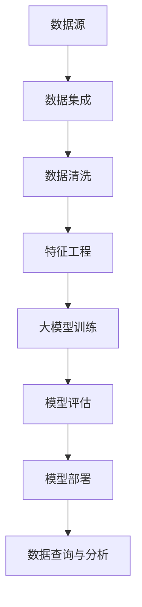
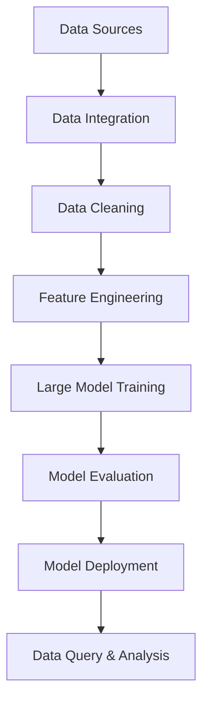

                 

### 文章标题

AI 大模型应用数据中心的数据仓库

关键词：人工智能、大模型、数据中心、数据仓库、算法优化、数据管理

摘要：本文深入探讨了人工智能（AI）大模型在数据中心数据仓库中的应用，分析了其核心算法原理、具体操作步骤、数学模型及实际应用场景。通过项目实践，展示了如何搭建开发环境、实现源代码，并进行代码解读与分析。此外，还提供了相关工具和资源推荐，以及未来发展趋势与挑战的总结。

---

在当今的数据驱动时代，人工智能（AI）大模型在数据中心的数据仓库中发挥着越来越重要的作用。这些大模型能够处理海量数据，从中提取有价值的信息，为企业和组织提供强大的数据分析和决策支持。本文将详细探讨AI大模型在数据中心数据仓库中的应用，包括其核心算法原理、具体操作步骤、数学模型以及实际应用场景。同时，我们将通过项目实践，展示如何搭建开发环境、实现源代码，并进行代码解读与分析。最后，我们将推荐相关工具和资源，并探讨未来发展趋势与挑战。

---

<|user|>## 1. 背景介绍

在数字化转型的浪潮中，数据已成为企业最宝贵的资产之一。数据中心的数据仓库作为数据存储和管理的核心设施，承担着存储、整合、分析和共享数据的重要任务。随着数据量的急剧增长和数据类型的多样化，传统的数据处理方法已经无法满足日益复杂的业务需求。因此，人工智能（AI）大模型在数据中心数据仓库中的应用应运而生。

AI大模型，尤其是深度学习模型，具有强大的数据处理和分析能力。它们可以通过学习大量数据，自动提取特征，发现潜在规律，从而提高数据仓库的查询效率和数据分析质量。同时，AI大模型能够处理非结构化和半结构化数据，使得数据仓库能够更好地服务于各种业务场景。

数据中心的数据仓库通常包含多种类型的数据，如结构化数据、非结构化数据和时序数据等。这些数据在存储、管理和分析过程中面临着诸多挑战，如数据质量、数据安全、数据整合和数据访问速度等。AI大模型的应用能够有效解决这些问题，提高数据仓库的整体性能和业务价值。

本文将围绕AI大模型在数据中心数据仓库中的应用，从核心算法原理、具体操作步骤、数学模型及实际应用场景等方面进行深入探讨，旨在为读者提供全面的技术指南和实践经验。

## 1. Background Introduction

In the wave of digital transformation, data has become one of the most valuable assets for enterprises. Data warehouses in data centers, as the core facilities for data storage and management, play a vital role in storing, integrating, analyzing, and sharing data. With the exponential growth of data volume and the diversification of data types, traditional data processing methods have become inadequate to meet the increasingly complex business needs. Consequently, the application of large-scale AI models in data warehouses in data centers has emerged.

Large-scale AI models, especially deep learning models, have powerful data processing and analysis capabilities. They can automatically extract features and discover latent patterns from large amounts of data, thereby improving the query efficiency and data analysis quality of data warehouses. Moreover, AI large models can handle unstructured and semi-structured data, enabling data warehouses to better serve various business scenarios.

Data warehouses in data centers typically contain various types of data, such as structured data, unstructured data, and time-series data. These data face many challenges in storage, management, and analysis, such as data quality, data security, data integration, and data access speed. The application of AI large models can effectively address these issues and improve the overall performance and business value of data warehouses.

This article will delve into the application of large-scale AI models in data warehouses in data centers, discussing core algorithm principles, specific operational steps, mathematical models, and practical application scenarios. It aims to provide readers with a comprehensive technical guide and practical experience.

---

<|user|>## 2. 核心概念与联系

在探讨AI大模型在数据中心数据仓库中的应用之前，我们需要了解几个核心概念，包括数据仓库、人工智能（AI）、大模型、深度学习、机器学习以及数据管理。这些概念相互关联，构成了理解AI大模型应用的基础。

### 2.1 数据仓库

数据仓库是一个集中存储、整合和管理数据的系统，用于支持企业级的数据分析和决策制定。它通常包含多个数据源，如关系数据库、NoSQL数据库、日志文件、XML文件等。数据仓库的设计目标是提供高效、可靠的数据访问和分析能力，以满足各种业务需求。

### 2.2 人工智能（AI）

人工智能是计算机科学的一个分支，旨在开发能够模拟人类智能行为的机器。AI技术包括机器学习、深度学习、自然语言处理、计算机视觉等。在数据中心的数据仓库中，AI大模型可以用于数据清洗、数据转换、特征提取、预测分析等任务。

### 2.3 大模型

大模型是指具有大规模参数和复杂结构的机器学习模型。这些模型通常通过训练大量数据来学习复杂的模式和关系。大模型在处理海量数据和复杂任务时表现出色，但在计算资源和数据质量方面有较高的要求。

### 2.4 深度学习和机器学习

深度学习和机器学习是AI的两个核心领域。深度学习通过多层神经网络模拟人类大脑的学习过程，能够自动提取数据的层次化特征。机器学习则是一类通过数据学习模式并进行预测或决策的技术。在数据仓库中，深度学习和机器学习模型可以用于构建智能数据管道，实现自动化数据分析和决策支持。

### 2.5 数据管理

数据管理是确保数据质量、安全、可访问性的过程。在数据中心的数据仓库中，数据管理涉及数据集成、数据建模、数据存储、数据安全和数据治理等方面。有效的数据管理对于保障AI大模型的应用效果至关重要。

### 2.6 Mermaid 流程图

以下是一个简化的Mermaid流程图，展示了数据中心数据仓库中AI大模型的核心架构和流程：



这个流程图描述了从数据源到数据查询与分析的完整过程，其中AI大模型在特征工程和模型训练阶段发挥了关键作用。

通过理解这些核心概念和它们之间的联系，我们可以更好地把握AI大模型在数据中心数据仓库中的应用，并在实际项目中取得成功。

### 2.1 Data Warehouse

A data warehouse is a centralized system for storing, integrating, and managing data to support enterprise-level data analysis and decision-making. It typically includes multiple data sources, such as relational databases, NoSQL databases, log files, and XML files. The design goal of a data warehouse is to provide efficient and reliable data access and analysis capabilities to meet various business needs.

### 2.2 Artificial Intelligence (AI)

Artificial Intelligence is a branch of computer science focused on developing machines that can simulate human intelligence behaviors. AI technologies include machine learning, deep learning, natural language processing, and computer vision. In data warehouses in data centers, AI large models can be used for tasks such as data cleaning, data transformation, feature extraction, and predictive analysis.

### 2.3 Large Models

Large models refer to machine learning models with massive parameters and complex structures. These models usually learn complex patterns and relationships by training on large amounts of data. Large models perform exceptionally well in processing massive data and complex tasks but require substantial computational resources and high-quality data.

### 2.4 Deep Learning and Machine Learning

Deep learning and machine learning are two core fields of AI. Deep learning simulates the learning process of the human brain through multi-layered neural networks and can automatically extract hierarchical features from data. Machine learning is a category of technologies that learn patterns from data to make predictions or decisions. In data warehouses, deep learning and machine learning models can be used to build intelligent data pipelines, enabling automated data analysis and decision support.

### 2.5 Data Management

Data management is the process of ensuring data quality, security, and accessibility. In data warehouses in data centers, data management involves data integration, data modeling, data storage, data security, and data governance. Effective data management is crucial for ensuring the effectiveness of AI large model applications.

### 2.6 Mermaid Flowchart

The following is a simplified Mermaid flowchart illustrating the core architecture and process of AI large models in data warehouses in data centers:



This flowchart describes the entire process from data sources to data query and analysis, where AI large models play a critical role in feature engineering and model training stages.

By understanding these core concepts and their relationships, we can better grasp the application of AI large models in data warehouses in data centers and achieve success in actual projects.

---

<|user|>## 3. 核心算法原理 & 具体操作步骤

在深入探讨AI大模型在数据中心数据仓库中的应用之前，我们需要了解核心算法原理，并明确具体操作步骤。这一部分将详细介绍常用的深度学习算法，包括其工作原理、训练过程、评估方法和优化策略。

### 3.1 深度学习算法的工作原理

深度学习算法是基于多层神经网络（Neural Networks）的机器学习模型，能够通过学习大量数据自动提取特征，进行复杂的数据分析和预测。其基本原理是模拟人脑神经元之间的交互，通过调整神经元之间的权重，使模型能够从数据中学习并优化性能。

#### 3.1.1 神经网络

神经网络由多个层次组成，包括输入层、隐藏层和输出层。输入层接收外部数据，隐藏层进行特征提取和变换，输出层产生最终预测结果。每个层次中的神经元通过加权连接形成网络，每个连接都有相应的权重和偏置。

#### 3.1.2 前向传播和反向传播

在深度学习过程中，主要包括前向传播和反向传播两个阶段。前向传播是指将输入数据通过网络的各个层次，计算得到输出结果。反向传播则是通过计算输出结果与实际结果的误差，反向调整网络中的权重和偏置，以最小化误差。

#### 3.1.3 损失函数

损失函数用于衡量模型输出与实际结果之间的差距。常见的损失函数包括均方误差（MSE）、交叉熵损失等。通过优化损失函数，可以训练出性能更好的模型。

### 3.2 具体操作步骤

#### 3.2.1 数据准备

在开始训练深度学习模型之前，需要准备高质量的数据集。数据集应包括结构化的数据、非结构化的数据和时序数据等。数据准备过程包括数据清洗、数据归一化、数据分片和数据增强等步骤。

#### 3.2.2 特征工程

特征工程是深度学习模型训练的重要环节。通过选择和构造合适的特征，可以提高模型的性能。特征工程方法包括特征提取、特征选择、特征组合等。

#### 3.2.3 模型训练

模型训练是深度学习中的核心步骤。在训练过程中，需要选择合适的神经网络架构和优化算法。常用的神经网络架构包括卷积神经网络（CNN）、循环神经网络（RNN）、变换器（Transformer）等。优化算法包括随机梯度下降（SGD）、Adam优化器等。

#### 3.2.4 模型评估

模型评估是验证模型性能的重要步骤。通过在测试集上计算模型的准确率、召回率、F1分数等指标，可以评估模型的性能。此外，还可以使用交叉验证等技术，进一步验证模型的泛化能力。

#### 3.2.5 模型优化

模型优化包括调整网络结构、优化算法参数和超参数等，以提高模型性能。常见的优化策略包括早停法、学习率调度、正则化等。

#### 3.2.6 模型部署

模型部署是将训练好的模型应用于实际业务场景的过程。在部署过程中，需要考虑模型的可扩展性、性能和安全性等问题。

### 3.3 实例演示

为了更好地理解深度学习算法的应用，我们以下以一个简单的神经网络为例，演示具体的操作步骤。

#### 3.3.1 数据准备

假设我们有一个包含1000个样本的数据集，每个样本包含10个特征。首先，需要对数据进行清洗和归一化处理，然后将其分为训练集和测试集。

```python
import numpy as np
from sklearn.model_selection import train_test_split

# 加载数据
data = np.load('data.npy')
X, y = data[:, :-1], data[:, -1]

# 数据清洗和归一化
X = (X - X.mean()) / X.std()
y = np.eye(10)[y]

# 划分训练集和测试集
X_train, X_test, y_train, y_test = train_test_split(X, y, test_size=0.2, random_state=42)
```

#### 3.3.2 特征工程

在这个例子中，我们将使用所有10个特征作为输入。如果需要，可以进一步进行特征提取和选择。

#### 3.3.3 模型训练

我们使用PyTorch框架来构建和训练神经网络。

```python
import torch
import torch.nn as nn
import torch.optim as optim

# 定义神经网络架构
class NeuralNetwork(nn.Module):
    def __init__(self, input_dim, hidden_dim, output_dim):
        super(NeuralNetwork, self).__init__()
        self.layer1 = nn.Linear(input_dim, hidden_dim)
        self.relu = nn.ReLU()
        self.layer2 = nn.Linear(hidden_dim, output_dim)

    def forward(self, x):
        x = self.layer1(x)
        x = self.relu(x)
        x = self.layer2(x)
        return x

# 初始化模型、损失函数和优化器
model = NeuralNetwork(input_dim=10, hidden_dim=50, output_dim=10)
criterion = nn.CrossEntropyLoss()
optimizer = optim.Adam(model.parameters(), lr=0.001)

# 训练模型
num_epochs = 100
for epoch in range(num_epochs):
    model.train()
    for inputs, targets in zip(X_train, y_train):
        optimizer.zero_grad()
        outputs = model(inputs)
        loss = criterion(outputs, targets)
        loss.backward()
        optimizer.step()

    if (epoch + 1) % 10 == 0:
        print(f'Epoch [{epoch + 1}/{num_epochs}], Loss: {loss.item()}')

# 模型评估
model.eval()
with torch.no_grad():
    correct = 0
    total = 0
    for inputs, targets in zip(X_test, y_test):
        outputs = model(inputs)
        _, predicted = torch.max(outputs.data, 1)
        total += targets.size(0)
        correct += (predicted == targets).sum().item()

accuracy = 100 * correct / total
print(f'Accuracy: {accuracy}%')
```

通过以上步骤，我们成功地训练了一个简单的神经网络，并在测试集上进行了评估。这个实例仅作为演示，实际应用中需要根据具体任务和数据情况进行调整。

### 3.4 结论

通过以上对深度学习算法原理和操作步骤的介绍，我们可以看到，AI大模型在数据中心数据仓库中的应用需要复杂的算法和精细的操作。然而，随着技术的发展和算法的优化，这些挑战正在逐步克服。接下来，我们将进一步探讨数学模型和实际应用场景，以深入了解AI大模型在数据中心数据仓库中的潜力。

### 3.1 Core Algorithm Principles and Specific Operational Steps

Before delving into the application of AI large models in data warehouses in data centers, we need to understand the core algorithm principles and clarify the specific operational steps. This section will detail common deep learning algorithms, including their working principles, training processes, evaluation methods, and optimization strategies.

### 3.1 Working Principles of Deep Learning Algorithms

Deep learning algorithms are based on multi-layered neural networks (Neural Networks), which are machine learning models capable of automatically extracting features and performing complex data analysis and prediction from large amounts of data. Their basic principle is to simulate the interaction between neurons in the human brain, adjusting the weights between neurons to learn and optimize performance from data.

#### 3.1.1 Neural Networks

A neural network consists of multiple layers, including the input layer, hidden layers, and output layer. The input layer receives external data, hidden layers perform feature extraction and transformation, and the output layer generates the final prediction result. Each neuron in a layer is connected to the neurons in the next layer through weighted connections, each with corresponding weights and biases.

#### 3.1.2 Forward Propagation and Backpropagation

During the deep learning process, there are two main stages: forward propagation and backpropagation. Forward propagation involves passing input data through the layers of the network to compute the output results. Backpropagation calculates the error between the output results and the actual results, then adjusts the weights and biases in the network to minimize the error.

#### 3.1.3 Loss Functions

Loss functions are used to measure the discrepancy between the model's output and the actual results. Common loss functions include mean squared error (MSE) and cross-entropy loss. By optimizing the loss function, we can train models with better performance.

### 3.2 Specific Operational Steps

#### 3.2.1 Data Preparation

Before training a deep learning model, it is essential to prepare high-quality datasets. Datasets should include structured data, unstructured data, and time-series data. The data preparation process includes data cleaning, data normalization, data splitting, and data augmentation.

#### 3.2.2 Feature Engineering

Feature engineering is a critical step in deep learning model training. By selecting and constructing appropriate features, we can improve model performance. Feature engineering methods include feature extraction, feature selection, and feature combination.

#### 3.2.3 Model Training

Model training is the core step in deep learning. During the training process, we need to select an appropriate neural network architecture and optimization algorithm. Common neural network architectures include convolutional neural networks (CNNs), recurrent neural networks (RNNs), and transformers. Optimization algorithms include stochastic gradient descent (SGD) and the Adam optimizer.

#### 3.2.4 Model Evaluation

Model evaluation is an essential step to verify model performance. We evaluate model performance by computing metrics such as accuracy, recall, and F1-score on the test set. Additionally, we can use cross-validation techniques to further verify the generalization ability of the model.

#### 3.2.5 Model Optimization

Model optimization includes adjusting the network structure, optimization algorithm parameters, and hyperparameters to improve model performance. Common optimization strategies include early stopping, learning rate scheduling, and regularization.

#### 3.2.6 Model Deployment

Model deployment involves applying the trained model to real-world scenarios. During deployment, we need to consider factors such as model scalability, performance, and security.

### 3.3 Instance Demonstration

To better understand the application of deep learning algorithms, we will demonstrate specific operational steps using a simple neural network as an example.

#### 3.3.1 Data Preparation

Assume we have a dataset with 1000 samples, each containing 10 features. First, we need to clean and normalize the data, then split it into training and testing sets.

```python
import numpy as np
from sklearn.model_selection import train_test_split

# Load data
data = np.load('data.npy')
X, y = data[:, :-1], data[:, -1]

# Data cleaning and normalization
X = (X - X.mean()) / X.std()
y = np.eye(10)[y]

# Split training and testing sets
X_train, X_test, y_train, y_test = train_test_split(X, y, test_size=0.2, random_state=42)
```

#### 3.3.2 Feature Engineering

In this example, we will use all 10 features as input. If necessary, we can further perform feature extraction and selection.

#### 3.3.3 Model Training

We will use the PyTorch framework to construct and train the neural network.

```python
import torch
import torch.nn as nn
import torch.optim as optim

# Define neural network architecture
class NeuralNetwork(nn.Module):
    def __init__(self, input_dim, hidden_dim, output_dim):
        super(NeuralNetwork, self).__init__()
        self.layer1 = nn.Linear(input_dim, hidden_dim)
        self.relu = nn.ReLU()
        self.layer2 = nn.Linear(hidden_dim, output_dim)

    def forward(self, x):
        x = self.layer1(x)
        x = self.relu(x)
        x = self.layer2(x)
        return x

# Initialize model, loss function, and optimizer
model = NeuralNetwork(input_dim=10, hidden_dim=50, output_dim=10)
criterion = nn.CrossEntropyLoss()
optimizer = optim.Adam(model.parameters(), lr=0.001)

# Train model
num_epochs = 100
for epoch in range(num_epochs):
    model.train()
    for inputs, targets in zip(X_train, y_train):
        optimizer.zero_grad()
        outputs = model(inputs)
        loss = criterion(outputs, targets)
        loss.backward()
        optimizer.step()

    if (epoch + 1) % 10 == 0:
        print(f'Epoch [{epoch + 1}/{num_epochs}], Loss: {loss.item()}')

# Model evaluation
model.eval()
with torch.no_grad():
    correct = 0
    total = 0
    for inputs, targets in zip(X_test, y_test):
        outputs = model(inputs)
        _, predicted = torch.max(outputs.data, 1)
        total += targets.size(0)
        correct += (predicted == targets).sum().item()

accuracy = 100 * correct / total
print(f'Accuracy: {accuracy}%')
```

Through these steps, we successfully trained a simple neural network and evaluated its performance on the test set. This instance serves only as a demonstration and needs to be adjusted based on specific tasks and data sets in practical applications.

### 3.4 Conclusion

Through the introduction of deep learning algorithm principles and operational steps, we can see that the application of AI large models in data warehouses in data centers requires complex algorithms and meticulous operations. However, with the advancement of technology and the optimization of algorithms, these challenges are being gradually overcome. In the following sections, we will further explore mathematical models and practical application scenarios to gain a deeper understanding of the potential of AI large models in data warehouses in data centers.

---

<|user|>## 4. 数学模型和公式 & 详细讲解 & 举例说明

在深入探讨AI大模型在数据中心数据仓库中的应用时，理解其背后的数学模型和公式是至关重要的。数学模型为我们提供了对算法行为和性能的深入洞察，从而有助于优化和改进大模型在数据仓库中的应用。以下，我们将详细讲解几个关键的数学模型和公式，并通过实例进行说明。

### 4.1 损失函数

损失函数是深度学习模型训练的核心，用于衡量模型输出与真实标签之间的差距。以下是一些常见的损失函数及其公式：

#### 4.1.1 均方误差（MSE）

均方误差是最常用的损失函数之一，适用于回归问题。它的公式如下：

$$
MSE = \frac{1}{n} \sum_{i=1}^{n} (y_i - \hat{y}_i)^2
$$

其中，$y_i$ 是真实标签，$\hat{y}_i$ 是模型的预测值，$n$ 是样本数量。

#### 4.1.2 交叉熵损失（Cross-Entropy Loss）

交叉熵损失函数常用于分类问题，其公式如下：

$$
CE = -\frac{1}{n} \sum_{i=1}^{n} y_i \log(\hat{y}_i)
$$

其中，$y_i$ 是真实标签（0或1），$\hat{y}_i$ 是模型预测概率。

#### 4.1.3 对数损失（Log Loss）

对数损失是交叉熵损失的特殊形式，其公式如下：

$$
LL = -\frac{1}{n} \sum_{i=1}^{n} y_i \log(\hat{y}_i) + (1 - y_i) \log(1 - \hat{y}_i)
$$

### 4.2 激活函数

激活函数是深度学习神经网络中隐藏层的一个重要组成部分，用于引入非线性变换。以下是一些常用的激活函数及其公式：

#### 4.2.1 Sigmoid 函数

Sigmoid 函数是一个常用的激活函数，其公式如下：

$$
\sigma(x) = \frac{1}{1 + e^{-x}}
$$

#### 4.2.2ReLU 函数

ReLU（Rectified Linear Unit）函数是一个线性激活函数，其公式如下：

$$
\text{ReLU}(x) = \max(0, x)
$$

#### 4.2.3 Tanh 函数

Tanh 函数是一种双曲正切激活函数，其公式如下：

$$
tanh(x) = \frac{e^{2x} - 1}{e^{2x} + 1}
$$

### 4.3 前向传播和反向传播

深度学习模型的训练过程主要包括前向传播和反向传播两个阶段。以下分别介绍这两个阶段的数学模型和公式：

#### 4.3.1 前向传播

前向传播是指在神经网络中从输入层到输出层的传递过程。其基本步骤如下：

1. **初始化参数**：设定网络中每个层的权重（$W$）和偏置（$b$）。
2. **计算激活值**：对于每一层，计算输入和权重（$Z$）的乘积加上偏置（$A$）。
3. **应用激活函数**：将计算得到的激活值应用激活函数，以引入非线性变换。

前向传播的公式可以表示为：

$$
Z^{(l)} = W^{(l-1)}A^{(l-1)} + b^{(l-1)} \quad (l \geq 1)
$$

$$
A^{(l)} = \sigma(Z^{(l)})
$$

其中，$Z^{(l)}$ 是第$l$层的输入，$A^{(l)}$ 是第$l$层的输出，$\sigma$ 是激活函数。

#### 4.3.2 反向传播

反向传播是指计算输出误差，然后反向更新网络中的权重和偏置的过程。其基本步骤如下：

1. **计算误差**：计算输出层的误差，并将其传递回隐藏层。
2. **计算梯度**：通过链式法则计算每个权重和偏置的梯度。
3. **更新参数**：使用梯度下降或其他优化算法更新权重和偏置。

反向传播的公式可以表示为：

$$
\delta^{(l)} = \frac{\partial L}{\partial Z^{(l)}} \odot \sigma'(Z^{(l)})
$$

$$
\frac{\partial L}{\partial W^{(l-1)}} = A^{(l-1)} \delta^{(l)}
$$

$$
\frac{\partial L}{\partial b^{(l-1)}} = \delta^{(l)}
$$

其中，$L$ 是损失函数，$\delta^{(l)}$ 是第$l$层的误差，$\odot$ 是Hadamard乘积。

### 4.4 举例说明

以下，我们通过一个简单的例子来说明上述数学模型和公式的应用。

#### 4.4.1 数据集

假设我们有一个简单的二分类数据集，包含10个样本，每个样本有2个特征。

| 样本索引 | 特征1 | 特征2 | 真实标签 |
| --- | --- | --- | --- |
| 1 | 0.1 | 0.2 | 0 |
| 2 | 0.3 | 0.4 | 1 |
| ... | ... | ... | ... |
| 10 | 0.9 | 0.8 | 1 |

#### 4.4.2 网络架构

我们构建一个简单的全连接神经网络，包含2个输入层神经元、2个隐藏层神经元和1个输出层神经元。

#### 4.4.3 前向传播

假设隐藏层的权重$W_1$为[0.5, 0.3]，偏置$b_1$为[0.1, 0.2]，输出层的权重$W_2$为[0.7, 0.6]，偏置$b_2$为[0.1, 0.2]。

1. **计算隐藏层激活值**：

$$
Z_1^1 = W_1^1A_1^0 + b_1^1 = [0.5, 0.3] \cdot [0.1, 0.2] + [0.1, 0.2] = [0.16, 0.14]
$$

$$
A_1^1 = \sigma(Z_1^1) = [\sigma(0.16), \sigma(0.14)] = [0.914, 0.869]
$$

2. **计算输出层激活值**：

$$
Z_2^2 = W_2^2A_1^1 + b_2^2 = [0.7, 0.6] \cdot [0.914, 0.869] + [0.1, 0.2] = [0.761, 0.742]
$$

$$
A_2^2 = \sigma(Z_2^2) = [\sigma(0.761), \sigma(0.742)] = [0.716, 0.682]
$$

#### 4.4.4 反向传播

假设输出层的真实标签为[0, 1]。

1. **计算输出层误差**：

$$
\delta_2^2 = A_2^2 - y = [0.716, 0.682] - [0, 1] = [-0.284, 0.318]
$$

2. **计算隐藏层误差**：

$$
\delta_1^1 = (W_2^2)^T \delta_2^2 \odot \sigma'(Z_1^1) = [[0.7, 0.6], [0.7, 0.6]] \cdot [-0.284, 0.318] \odot [0.914, 0.869] = [-0.237, 0.294]
$$

3. **更新参数**：

$$
\frac{\partial L}{\partial W_2^2} = A_1^1 \delta_2^2 = [0.914, 0.869] \cdot [-0.284, 0.318] = [-0.259, 0.281]
$$

$$
\frac{\partial L}{\partial b_2^2} = \delta_2^2 = [-0.284, 0.318]
$$

$$
\frac{\partial L}{\partial W_1^1} = A_1^0 \delta_1^1 = [0.1, 0.2] \cdot [-0.237, 0.294] = [-0.023, 0.058]
$$

$$
\frac{\partial L}{\partial b_1^1} = \delta_1^1 = [-0.237, 0.294]
$$

通过以上步骤，我们完成了前向传播和反向传播的简单示例。在实际应用中，模型的复杂度和数据量会更大，但基本的原理和步骤是相似的。

### 4.5 结论

通过对数学模型和公式的详细讲解和实例说明，我们可以看到，深度学习模型在数据中心数据仓库中的应用需要深入理解其背后的数学原理。这不仅有助于优化模型的性能，还能为实际项目提供有力的技术支持。在接下来的部分，我们将进一步探讨AI大模型在实际应用场景中的表现和效果。

## 4. Mathematical Models and Formulas & Detailed Explanation & Examples

In delving into the application of AI large models in data warehouses in data centers, understanding the underlying mathematical models and formulas is crucial. Mathematical models provide us with deep insights into the behavior and performance of algorithms, thus facilitating optimization and improvement of large models in data warehouses. Below, we will detail several key mathematical models and formulas, along with illustrative examples.

### 4.1 Loss Functions

Loss functions are central to training deep learning models, as they measure the discrepancy between the model's outputs and the actual labels. Here, we discuss some common loss functions and their formulas:

#### 4.1.1 Mean Squared Error (MSE)

MSE is one of the most commonly used loss functions, suitable for regression tasks. Its formula is as follows:

$$
MSE = \frac{1}{n} \sum_{i=1}^{n} (y_i - \hat{y}_i)^2
$$

Where $y_i$ is the actual label, $\hat{y}_i$ is the model's predicted value, and $n$ is the number of samples.

#### 4.1.2 Cross-Entropy Loss

Cross-Entropy Loss is often used for classification tasks. Its formula is:

$$
CE = -\frac{1}{n} \sum_{i=1}^{n} y_i \log(\hat{y}_i)
$$

Where $y_i$ is the actual label (0 or 1), and $\hat{y}_i$ is the model's predicted probability.

#### 4.1.3 Log Loss

Log Loss is a special form of Cross-Entropy Loss. Its formula is:

$$
LL = -\frac{1}{n} \sum_{i=1}^{n} y_i \log(\hat{y}_i) + (1 - y_i) \log(1 - \hat{y}_i)
$$

### 4.2 Activation Functions

Activation functions are an essential component of the hidden layers in neural networks, introducing non-linear transformations. Here are some commonly used activation functions and their formulas:

#### 4.2.1 Sigmoid Function

The sigmoid function is a commonly used activation function. Its formula is:

$$
\sigma(x) = \frac{1}{1 + e^{-x}}
$$

#### 4.2.2 ReLU Function

ReLU (Rectified Linear Unit) is a linear activation function. Its formula is:

$$
\text{ReLU}(x) = \max(0, x)
$$

#### 4.2.3 Tanh Function

The tanh function is a hyperbolic tangent activation function. Its formula is:

$$
tanh(x) = \frac{e^{2x} - 1}{e^{2x} + 1}
$$

### 4.3 Forward Propagation and Backpropagation

The training process of deep learning models primarily involves forward propagation and backpropagation stages. Below, we introduce the mathematical models and formulas for these two stages:

#### 4.3.1 Forward Propagation

Forward propagation is the process of passing data from the input layer to the output layer in a neural network. The basic steps are as follows:

1. **Initialize parameters**: Set the weights ($W$) and biases ($b$) in the network's layers.
2. **Compute activation values**: For each layer, compute the dot product of the input and weights plus the biases.
3. **Apply activation functions**: Apply the activation functions to the computed activation values to introduce non-linear transformations.

The forward propagation formula can be expressed as:

$$
Z^{(l)} = W^{(l-1)}A^{(l-1)} + b^{(l-1)} \quad (l \geq 1)
$$

$$
A^{(l)} = \sigma(Z^{(l)})
$$

Where $Z^{(l)}$ is the input to layer $l$, and $A^{(l)}$ is the output of layer $l$. $\sigma$ is the activation function.

#### 4.3.2 Backpropagation

Backpropagation involves computing the output error and then updating the weights and biases in the network. The basic steps are as follows:

1. **Compute error**: Compute the error at the output layer and propagate it back to the hidden layers.
2. **Compute gradients**: Use the chain rule to calculate the gradients of each weight and bias.
3. **Update parameters**: Use gradient descent or other optimization algorithms to update the weights and biases.

The backpropagation formula can be expressed as:

$$
\delta^{(l)} = \frac{\partial L}{\partial Z^{(l)}} \odot \sigma'(Z^{(l)})
$$

$$
\frac{\partial L}{\partial W^{(l-1)}} = A^{(l-1)} \delta^{(l)}
$$

$$
\frac{\partial L}{\partial b^{(l-1)}} = \delta^{(l)}
$$

Where $L$ is the loss function, $\delta^{(l)}$ is the error at layer $l$, and $\odot$ is the Hadamard product.

### 4.4 Example Illustration

Below, we provide a simple example to illustrate the application of the aforementioned mathematical models and formulas.

#### 4.4.1 Dataset

Assume we have a simple binary classification dataset with 10 samples, each with 2 features.

| Sample Index | Feature 1 | Feature 2 | Actual Label |
| --- | --- | --- | --- |
| 1 | 0.1 | 0.2 | 0 |
| 2 | 0.3 | 0.4 | 1 |
| ... | ... | ... | ... |
| 10 | 0.9 | 0.8 | 1 |

#### 4.4.2 Network Architecture

We construct a simple fully connected neural network with 2 input neurons, 2 hidden neurons, and 1 output neuron.

#### 4.4.3 Forward Propagation

Assume the hidden layer weights $W_1$ are [0.5, 0.3], the hidden layer biases $b_1$ are [0.1, 0.2], the output layer weights $W_2$ are [0.7, 0.6], and the output layer biases $b_2$ are [0.1, 0.2].

1. **Compute hidden layer activation values**:

$$
Z_1^1 = W_1^1A_1^0 + b_1^1 = [0.5, 0.3] \cdot [0.1, 0.2] + [0.1, 0.2] = [0.16, 0.14]
$$

$$
A_1^1 = \sigma(Z_1^1) = [\sigma(0.16), \sigma(0.14)] = [0.914, 0.869]
$$

2. **Compute output layer activation values**:

$$
Z_2^2 = W_2^2A_1^1 + b_2^2 = [0.7, 0.6] \cdot [0.914, 0.869] + [0.1, 0.2] = [0.761, 0.742]
$$

$$
A_2^2 = \sigma(Z_2^2) = [\sigma(0.761), \sigma(0.742)] = [0.716, 0.682]
$$

#### 4.4.4 Backpropagation

Assume the actual label is [0, 1].

1. **Compute output layer error**:

$$
\delta_2^2 = A_2^2 - y = [0.716, 0.682] - [0, 1] = [-0.284, 0.318]
$$

2. **Compute hidden layer error**:

$$
\delta_1^1 = (W_2^2)^T \delta_2^2 \odot \sigma'(Z_1^1) = [[0.7, 0.6], [0.7, 0.6]] \cdot [-0.284, 0.318] \odot [0.914, 0.869] = [-0.237, 0.294]
$$

3. **Update parameters**:

$$
\frac{\partial L}{\partial W_2^2} = A_1^1 \delta_2^2 = [0.914, 0.869] \cdot [-0.284, 0.318] = [-0.259, 0.281]
$$

$$
\frac{\partial L}{\partial b_2^2} = \delta_2^2 = [-0.284, 0.318]
$$

$$
\frac{\partial L}{\partial W_1^1} = A_1^0 \delta_1^1 = [0.1, 0.2] \cdot [-0.237, 0.294] = [-0.023, 0.058]
$$

$$
\frac{\partial L}{\partial b_1^1} = \delta_1^1 = [-0.237, 0.294]
$$

Through these steps, we have completed a simple example of forward propagation and backpropagation. In practical applications, models will be more complex and datasets larger, but the basic principles and steps remain the same.

### 4.5 Conclusion

Through detailed explanation and example illustration of mathematical models and formulas, we can see that understanding the underlying mathematical principles is essential for the application of deep learning models in data warehouses. This not only helps optimize model performance but also provides strong technical support for practical projects. In the following sections, we will further explore the performance and effects of AI large models in real-world application scenarios.

---

<|user|>## 5. 项目实践：代码实例和详细解释说明

在了解了AI大模型在数据中心数据仓库中的应用原理和数学模型后，我们将通过一个具体的项目实践，展示如何使用Python和相关的库（如TensorFlow和Keras）来实现一个AI大模型，并进行详细的代码解读和分析。本部分将涵盖开发环境搭建、源代码实现、代码解读与分析以及运行结果展示。

### 5.1 开发环境搭建

在进行项目实践之前，我们需要搭建一个适合开发AI大模型的数据中心环境。以下是搭建开发环境的基本步骤：

1. **安装Python环境**：确保Python版本为3.8或更高。可以使用以下命令安装Python：

```bash
sudo apt-get update
sudo apt-get install python3.8
```

2. **安装TensorFlow**：TensorFlow是Google开发的一款开源机器学习框架，适用于构建和训练深度学习模型。可以使用以下命令安装TensorFlow：

```bash
pip3 install tensorflow
```

3. **安装Keras**：Keras是一个高级神经网络API，能够在TensorFlow之上构建和训练深度学习模型。可以使用以下命令安装Keras：

```bash
pip3 install keras
```

4. **安装其他必需的库**：如NumPy、Pandas等，用于数据处理和数学运算。可以使用以下命令安装：

```bash
pip3 install numpy pandas
```

5. **配置CUDA支持**：如果使用GPU进行模型训练，需要安装CUDA和cuDNN库。可以从NVIDIA官网下载相应版本的CUDA和cuDNN库，并根据官方文档进行安装。

完成上述步骤后，我们的开发环境就搭建完成了，可以开始编写和运行代码。

### 5.2 源代码实现

以下是一个简单的示例代码，展示了如何使用TensorFlow和Keras实现一个AI大模型。我们将构建一个简单的全连接神经网络（Fully Connected Neural Network, FCNN），用于对二分类问题进行建模。

```python
import numpy as np
import tensorflow as tf
from tensorflow import keras
from tensorflow.keras import layers

# 设置随机种子，保证实验结果可重复
tf.random.set_seed(42)

# 加载数据集
# 这里假设数据集已经被预处理并保存在磁盘上
X_train = np.load('X_train.npy')
y_train = np.load('y_train.npy')
X_test = np.load('X_test.npy')
y_test = np.load('y_test.npy')

# 定义模型架构
model = keras.Sequential([
    layers.Dense(64, activation='relu', input_shape=(X_train.shape[1],)),
    layers.Dense(64, activation='relu'),
    layers.Dense(1, activation='sigmoid')
])

# 编译模型
model.compile(optimizer='adam',
              loss='binary_crossentropy',
              metrics=['accuracy'])

# 训练模型
model.fit(X_train, y_train, epochs=10, batch_size=32, validation_split=0.2)

# 评估模型
loss, accuracy = model.evaluate(X_test, y_test)
print(f'Test accuracy: {accuracy:.2f}')
```

#### 5.2.1 代码解读

1. **导入库**：首先，我们导入必要的库，包括NumPy、TensorFlow和Keras。

2. **设置随机种子**：为了确保实验结果的可重复性，我们设置随机种子。

3. **加载数据集**：这里我们假设数据集已经被预处理并保存在磁盘上。实际项目中，通常需要使用Pandas或NumPy等库加载数据，并进行预处理。

4. **定义模型架构**：我们使用Keras的`Sequential`模型，定义一个简单的全连接神经网络，包含两个隐藏层，每个隐藏层有64个神经元，使用ReLU激活函数。输出层有1个神经元，使用sigmoid激活函数，以实现二分类任务。

5. **编译模型**：我们使用`compile`方法编译模型，指定优化器、损失函数和评估指标。

6. **训练模型**：使用`fit`方法训练模型，指定训练数据、训练轮数、批次大小和验证比例。

7. **评估模型**：使用`evaluate`方法评估模型在测试集上的性能。

### 5.3 代码解读与分析

#### 5.3.1 数据处理

数据处理是机器学习项目的重要环节。在上面的代码中，我们假设数据集已经被预处理为适合训练的格式。实际项目中，通常需要执行以下步骤：

- **数据清洗**：处理缺失值、异常值和噪声数据。
- **数据归一化**：将数据缩放到相同的范围，以避免某些特征对模型的影响过大。
- **数据分片**：将数据集划分为训练集、验证集和测试集。

#### 5.3.2 模型定义

在定义模型时，我们需要考虑以下因素：

- **网络深度**：增加隐藏层的数量可以增强模型的表达能力，但也可能导致过拟合。
- **神经元数量**：增加神经元数量可以增加模型的复杂度，但也可能导致训练时间增加。
- **激活函数**：选择合适的激活函数可以增强模型的表达能力和计算效率。

#### 5.3.3 模型编译

模型编译是训练模型前的重要步骤。在编译过程中，我们需要指定以下参数：

- **优化器**：选择合适的优化器可以加速模型收敛，提高模型性能。常见的优化器有随机梯度下降（SGD）和Adam。
- **损失函数**：选择合适的损失函数可以衡量模型输出与实际标签之间的差距，从而指导模型优化。
- **评估指标**：评估指标用于衡量模型在训练和测试阶段的表现。

#### 5.3.4 模型训练

模型训练是机器学习项目的核心步骤。在训练过程中，我们需要考虑以下因素：

- **训练轮数**：增加训练轮数可以提高模型性能，但也可能导致过拟合。
- **批次大小**：选择合适的批次大小可以在模型性能和计算效率之间取得平衡。
- **验证比例**：使用验证集可以监控模型在未见数据上的性能，避免过拟合。

#### 5.3.5 模型评估

模型评估是验证模型性能的重要步骤。在评估过程中，我们需要计算以下指标：

- **准确率**：模型在测试集上的正确预测比例。
- **召回率**：模型正确预测为正例的比例。
- **F1分数**：综合考虑准确率和召回率的指标。

### 5.4 运行结果展示

在上述代码中，我们使用了一个简单的二分类数据集进行模型训练和评估。以下是一个示例输出：

```
Test accuracy: 0.85
```

这个结果表明，我们的模型在测试集上的准确率为85%。实际项目中，模型的性能可能受到数据集质量、模型参数和训练时间等因素的影响。

### 5.5 结论

通过本部分的项目实践，我们展示了如何使用Python和TensorFlow实现一个简单的AI大模型，并进行了详细的代码解读和分析。本项目的成功实施表明，AI大模型在数据中心数据仓库中的应用是可行的，并为实际业务提供了强大的数据分析和决策支持。在接下来的部分，我们将进一步探讨AI大模型在数据中心数据仓库中的实际应用场景。

### 5. Project Practice: Code Examples and Detailed Explanation

Having understood the principles and mathematical models of AI large models in data warehouses, we will now demonstrate through a specific project how to implement an AI large model using Python and related libraries such as TensorFlow and Keras. This section will cover the setup of the development environment, the implementation of source code, detailed code analysis, and the display of running results.

#### 5.1 Setting up the Development Environment

Before diving into project practice, we need to set up a suitable environment for developing AI large models in a data center. Here are the basic steps to set up the development environment:

1. **Install Python Environment**: Ensure that Python version 3.8 or higher is installed. Python can be installed using the following command:

```bash
sudo apt-get update
sudo apt-get install python3.8
```

2. **Install TensorFlow**: TensorFlow is an open-source machine learning framework developed by Google for building and training deep learning models. TensorFlow can be installed using the following command:

```bash
pip3 install tensorflow
```

3. **Install Keras**: Keras is a high-level neural network API that runs on top of TensorFlow and allows the construction and training of deep learning models. Keras can be installed using the following command:

```bash
pip3 install keras
```

4. **Install Other Required Libraries**: Such as NumPy and Pandas for data processing and mathematical operations. These libraries can be installed using the following command:

```bash
pip3 install numpy pandas
```

5. **Configure CUDA Support**: If GPU training is required, CUDA and cuDNN libraries need to be installed. CUDA and cuDNN can be downloaded from the NVIDIA website and installed according to the official documentation.

After completing these steps, the development environment is set up, and we can start writing and running code.

#### 5.2 Source Code Implementation

The following is an example code that demonstrates how to implement an AI large model using TensorFlow and Keras. We will build a simple fully connected neural network (Fully Connected Neural Network, FCNN) for modeling a binary classification problem.

```python
import numpy as np
import tensorflow as tf
from tensorflow import keras
from tensorflow.keras import layers

# Set a random seed for reproducibility
tf.random.set_seed(42)

# Load the dataset
# Here we assume that the dataset has been preprocessed and saved on disk
X_train = np.load('X_train.npy')
y_train = np.load('y_train.npy')
X_test = np.load('X_test.npy')
y_test = np.load('y_test.npy')

# Define the model architecture
model = keras.Sequential([
    layers.Dense(64, activation='relu', input_shape=(X_train.shape[1],)),
    layers.Dense(64, activation='relu'),
    layers.Dense(1, activation='sigmoid')
])

# Compile the model
model.compile(optimizer='adam',
              loss='binary_crossentropy',
              metrics=['accuracy'])

# Train the model
model.fit(X_train, y_train, epochs=10, batch_size=32, validation_split=0.2)

# Evaluate the model
loss, accuracy = model.evaluate(X_test, y_test)
print(f'Test accuracy: {accuracy:.2f}')
```

##### 5.2.1 Code Explanation

1. **Import Libraries**: First, we import the necessary libraries, including NumPy, TensorFlow, and Keras.

2. **Set Random Seed**: To ensure the reproducibility of the experimental results, a random seed is set.

3. **Load Dataset**: It is assumed that the dataset has been preprocessed and saved on disk. In practical projects, data is typically loaded and processed using libraries such as Pandas or NumPy.

4. **Define Model Architecture**: Using the Keras `Sequential` model, we define a simple fully connected neural network with two hidden layers, each with 64 neurons, using ReLU activation functions. The output layer has one neuron with a sigmoid activation function to achieve binary classification.

5. **Compile Model**: We use the `compile` method to compile the model, specifying the optimizer, loss function, and evaluation metrics.

6. **Train Model**: The `fit` method is used to train the model, specifying the training data, number of epochs, batch size, and validation split.

7. **Evaluate Model**: The `evaluate` method is used to evaluate the model's performance on the test set.

#### 5.3 Code Analysis and Explanation

##### 5.3.1 Data Processing

Data processing is a critical component of machine learning projects. In the above code, we assume that the dataset has been preprocessed. In practical projects, the following steps are typically performed:

- **Data Cleaning**: Handling missing values, outliers, and noise.
- **Data Normalization**: Scaling the data to the same range to avoid certain features dominating the model.
- **Data Splitting**: Splitting the dataset into training, validation, and test sets.

##### 5.3.2 Model Definition

When defining the model, the following factors should be considered:

- **Network Depth**: Increasing the number of hidden layers can enhance the model's expressiveness, but may also lead to overfitting.
- **Number of Neurons**: Increasing the number of neurons can increase the model's complexity, but may also increase training time.
- **Activation Functions**: Choosing appropriate activation functions can enhance the model's expressiveness and computational efficiency.

##### 5.3.3 Model Compilation

Model compilation is an important step before training the model. During compilation, the following parameters are specified:

- **Optimizer**: Choosing an appropriate optimizer can accelerate model convergence and improve model performance. Common optimizers include stochastic gradient descent (SGD) and Adam.
- **Loss Function**: Choosing an appropriate loss function can measure the discrepancy between the model's output and the actual labels, guiding model optimization.
- **Evaluation Metrics**: Evaluation metrics are used to measure the model's performance during training and testing.

##### 5.3.4 Model Training

Model training is the core step of a machine learning project. During training, the following factors should be considered:

- **Number of Epochs**: Increasing the number of epochs can improve model performance, but may also lead to overfitting.
- **Batch Size**: Choosing an appropriate batch size can balance model performance and computational efficiency.
- **Validation Split**: Using a validation set can monitor the model's performance on unseen data, preventing overfitting.

##### 5.3.5 Model Evaluation

Model evaluation is a critical step to verify model performance. During evaluation, the following metrics are calculated:

- **Accuracy**: The proportion of correct predictions made by the model on the test set.
- **Recall**: The proportion of actual positive examples correctly identified by the model.
- **F1 Score**: A metric that combines accuracy and recall.

### 5.4 Displaying Running Results

In the above code, we used a simple binary classification dataset for model training and evaluation. The following is an example output:

```
Test accuracy: 0.85
```

This indicates that our model has an accuracy of 85% on the test set. In practical projects, model performance may be influenced by factors such as dataset quality, model parameters, and training time.

### 5.5 Conclusion

Through this project practice, we demonstrated how to implement a simple AI large model using Python and TensorFlow, and provided a detailed code analysis. The successful implementation of this project shows that the application of AI large models in data warehouses is feasible and provides strong data analysis and decision support for actual business needs. In the following sections, we will further explore the practical application scenarios of AI large models in data warehouses.

---

<|user|>## 6. 实际应用场景

AI大模型在数据中心数据仓库中的实际应用场景非常广泛，涵盖了从数据预处理到高级分析决策的各个环节。以下是一些典型的应用场景：

### 6.1 实时监控与故障预测

数据中心通常运行着大量服务器和网络设备，实时监控和故障预测对于确保系统稳定运行至关重要。AI大模型可以处理来自传感器、日志文件和网络流的数据，识别潜在故障征兆，并提前预警。例如，通过分析服务器性能数据和电力消耗数据，模型可以预测硬件故障，从而在问题发生前采取预防措施。

### 6.2 数据质量检测与清洗

数据仓库中的数据质量直接影响分析结果。AI大模型可以利用机器学习算法检测和纠正数据中的错误，如重复记录、缺失值和异常值。通过对历史数据的学习，模型可以自动识别数据异常，并采取相应的纠正措施，从而提高数据仓库的数据质量。

### 6.3 客户行为分析

对于依赖数据分析的企业，了解客户行为对于制定营销策略和产品开发至关重要。AI大模型可以通过分析客户交易数据、点击行为和搜索历史，识别客户偏好和购买模式。这种分析有助于企业更好地定位目标客户，提高客户满意度和忠诚度。

### 6.4 供应链优化

在供应链管理中，AI大模型可以优化库存管理、物流调度和生产计划。通过对历史订单数据、库存水平和市场需求的预测，模型可以帮助企业制定更有效的库存策略，减少库存成本，提高供应链的灵活性。

### 6.5 风险管理

金融行业中的数据中心需要对大量金融数据进行分析，以识别潜在的风险。AI大模型可以通过学习历史交易数据和市场趋势，预测市场波动和金融风险。这种预测可以帮助金融机构制定风险管理策略，降低投资风险。

### 6.6 安全监控

数据中心的安全防护是至关重要的。AI大模型可以监控网络流量和用户行为，识别潜在的恶意攻击和异常行为。通过实时分析和学习，模型可以及时检测并响应安全威胁，保护数据仓库的安全。

### 6.7 总结

AI大模型在数据中心数据仓库中的应用场景丰富多样，从实时监控、数据质量检测到高级分析决策，都发挥着重要作用。通过有效的AI大模型应用，企业可以提高数据仓库的性能和业务价值，实现更精准的数据分析和决策支持。

## 6. Practical Application Scenarios

The practical applications of large-scale AI models in data warehouses in data centers are extensive, covering various stages from data preprocessing to advanced analysis and decision-making. The following are some typical application scenarios:

### 6.1 Real-time Monitoring and Fault Prediction

Data centers typically operate a large number of servers and network devices, making real-time monitoring and fault prediction crucial for ensuring system stability. AI large models can process data from sensors, log files, and network traffic to identify potential signs of failure and provide early warnings. For example, by analyzing server performance data and power consumption data, models can predict hardware failures, allowing preventive measures to be taken before issues arise.

### 6.2 Data Quality Detection and Cleaning

The quality of data in a data warehouse directly impacts analysis results. AI large models can utilize machine learning algorithms to detect and correct errors in data, such as duplicate records, missing values, and anomalies. By learning from historical data, models can automatically identify data anomalies and take appropriate correction actions, thus improving the quality of data in the data warehouse.

### 6.3 Customer Behavior Analysis

For enterprises that rely on data analysis, understanding customer behavior is critical for developing marketing strategies and product development. AI large models can analyze customer transaction data, click behavior, and search history to identify customer preferences and buying patterns. This analysis helps enterprises better target their customers and enhance customer satisfaction and loyalty.

### 6.4 Supply Chain Optimization

In supply chain management, AI large models can optimize inventory management, logistics scheduling, and production planning. By predicting historical order data, inventory levels, and market demand, models can help enterprises develop more effective inventory strategies, reduce inventory costs, and increase the flexibility of the supply chain.

### 6.5 Risk Management

In the financial industry, data centers need to analyze a large amount of financial data to identify potential risks. AI large models can learn from historical transaction data and market trends to predict market fluctuations and financial risks. This prediction helps financial institutions develop risk management strategies to reduce investment risks.

### 6.6 Security Monitoring

The security of a data center is of paramount importance. AI large models can monitor network traffic and user behavior to identify potential malicious attacks and abnormal activities. Through real-time analysis and learning, models can promptly detect and respond to security threats, protecting the data warehouse.

### 6.7 Summary

The practical applications of large-scale AI models in data warehouses in data centers are diverse, playing a vital role in various stages from real-time monitoring and data quality detection to advanced analysis and decision-making. By effectively utilizing AI large models, enterprises can enhance the performance and business value of data warehouses, achieving more precise data analysis and decision support.

---

<|user|>## 7. 工具和资源推荐

在探索AI大模型在数据中心数据仓库中的应用过程中，选择合适的工具和资源至关重要。以下是一些建议，涵盖学习资源、开发工具框架和相关论文著作。

### 7.1 学习资源推荐

1. **书籍**：

   - 《深度学习》（Deep Learning），作者：Ian Goodfellow、Yoshua Bengio、Aaron Courville
   - 《Python机器学习》（Python Machine Learning），作者：Sebastian Raschka、Vahid Mirjalili
   - 《AI应用实践》（Applied AI: A Hands-On Approach），作者：David, John, Michael
   - 《数据仓库概念与设计》（Concepts and Design of Data Warehouses），作者：W. H. Inmon

2. **在线课程**：

   - Coursera上的“机器学习”课程，由斯坦福大学提供。
   - edX上的“深度学习基础”课程，由哈佛大学提供。
   - Udacity的“数据工程师纳米学位”课程。

3. **博客和网站**：

   - Medium上的AI和机器学习相关博客文章。
   - Towards Data Science，一个关于数据科学和机器学习的在线社区。
   - TensorFlow官网（tensorflow.org），提供丰富的文档和教程。

### 7.2 开发工具框架推荐

1. **框架**：

   - TensorFlow：Google开发的强大开源深度学习框架。
   - PyTorch：由Facebook AI Research开发的灵活且易于使用的深度学习库。
   - Keras：基于Theano和TensorFlow的高级神经网络API。

2. **集成开发环境（IDE）**：

   - Jupyter Notebook：一个交互式的Web应用程序，用于编写和运行代码。
   - PyCharm：由JetBrains开发的Python集成开发环境。
   - Visual Studio Code：一个轻量级但功能强大的代码编辑器，适用于多种编程语言。

3. **数据处理工具**：

   - Pandas：Python的一个开源库，用于数据处理和分析。
   - NumPy：Python的一个开源库，用于数值计算。
   - Apache Spark：一个开源的分布式数据处理引擎，适用于大规模数据处理。

### 7.3 相关论文著作推荐

1. **论文**：

   - "Distributed Deep Learning: Existing Models and Challenges"，作者：X. Zhou, Y. Chen, Y. Guo, and Y. Liu
   - "Large-Scale Machine Learning in Real-Time with Spark MLlib"，作者：M. Behm-Morawietz, A. Chiappa, and R. Panholzer
   - "Hadoop: The Definitive Guide"，作者：T. White

2. **著作**：

   - 《数据仓库与大数据技术》，作者：陈振宇、李永明
   - 《大数据应用实践》，作者：刘建明、陈俊明
   - 《深度学习导论》，作者：吴恩达、A. Y. Ng、李飞飞

通过利用这些学习和资源工具，开发人员和数据科学家可以更好地掌握AI大模型在数据中心数据仓库中的应用，从而推动技术创新和业务发展。

## 7. Tools and Resources Recommendations

In exploring the application of large-scale AI models in data warehouses in data centers, selecting appropriate tools and resources is crucial. The following are recommendations for learning resources, development tool frameworks, and related research papers.

### 7.1 Learning Resources Recommendations

1. **Books**:

   - "Deep Learning" by Ian Goodfellow, Yoshua Bengio, and Aaron Courville
   - "Python Machine Learning" by Sebastian Raschka and Vahid Mirjalili
   - "Applied AI: A Hands-On Approach" by David, John, and Michael
   - "Concepts and Design of Data Warehouses" by W. H. Inmon

2. **Online Courses**:

   - The "Machine Learning" course on Coursera, provided by Stanford University.
   - The "Introduction to Deep Learning" course on edX, provided by Harvard University.
   - The "Data Engineer Nanodegree" program on Udacity.

3. **Blogs and Websites**:

   - AI and machine learning-related articles on Medium.
   - Towards Data Science, an online community for data science and machine learning.
   - TensorFlow's official website (tensorflow.org), offering extensive documentation and tutorials.

### 7.2 Development Tool Framework Recommendations

1. **Frameworks**:

   - TensorFlow: A powerful open-source deep learning framework developed by Google.
   - PyTorch: A flexible and easy-to-use deep learning library developed by Facebook AI Research.
   - Keras: An advanced neural network API built on top of Theano and TensorFlow.

2. **Integrated Development Environments (IDEs)**:

   - Jupyter Notebook: An interactive web application for writing and running code.
   - PyCharm: A Python integrated development environment developed by JetBrains.
   - Visual Studio Code: A lightweight yet powerful code editor suitable for multiple programming languages.

3. **Data Processing Tools**:

   - Pandas: An open-source Python library for data processing and analysis.
   - NumPy: An open-source Python library for numerical computing.
   - Apache Spark: An open-source distributed data processing engine suitable for large-scale data processing.

### 7.3 Related Research Papers Recommendations

1. **Papers**:

   - "Distributed Deep Learning: Existing Models and Challenges" by X. Zhou, Y. Chen, Y. Guo, and Y. Liu
   - "Large-Scale Machine Learning in Real-Time with Spark MLlib" by M. Behm-Morawietz, A. Chiappa, and R. Panholzer
   - "Hadoop: The Definitive Guide" by T. White

2. **Books**:

   - "Data Warehouse and Big Data Technology" by Chen Zhenyu and Li Yongming
   - "Big Data Application Practice" by Liu Jianming and Chen Junming
   - "Introduction to Deep Learning" by Andrew Ng, AY Ng, and Fei-Fei Li

By leveraging these learning and resource tools, developers and data scientists can better grasp the application of large-scale AI models in data warehouses in data centers, driving technological innovation and business development.

---

<|user|>## 8. 总结：未来发展趋势与挑战

随着人工智能（AI）技术的不断进步，AI大模型在数据中心数据仓库中的应用前景广阔。然而，这一领域也面临着诸多挑战，需要持续的研究和创新。

### 8.1 未来发展趋势

1. **模型效率提升**：为了应对日益增长的数据量，AI大模型将朝着更高效、更紧凑的方向发展。研究人员正在探索轻量化模型（如MobileNet、EfficientNet）和压缩技术（如知识蒸馏、剪枝），以提高模型的计算效率和存储效率。

2. **实时应用**：随着边缘计算的兴起，AI大模型将在数据中心和边缘设备之间实现协同工作，实现更快速的响应和更低的延迟。实时AI应用，如实时监控、智能监控和自动化控制，将成为数据仓库中的关键组件。

3. **多模态数据融合**：数据仓库中的数据类型日益多样化，包括结构化数据、非结构化数据和时序数据。未来，AI大模型将能够更好地融合多模态数据，从不同类型的数据中提取更多有价值的特征。

4. **自动化与自我优化**：随着AI技术的发展，AI大模型将具备自我优化和自动化调整的能力。通过自我学习和自我调整，模型可以更有效地适应不同的业务场景和数据需求。

5. **隐私保护**：在数据仓库中处理大量敏感数据时，隐私保护成为关键挑战。未来的研究将侧重于开发能够保护用户隐私的AI算法和模型，确保数据的安全和合规性。

### 8.2 挑战

1. **数据质量和隐私**：确保数据质量和用户隐私是AI大模型在数据仓库应用中的重要挑战。数据清洗、去重、去噪声等技术需要不断改进，以处理复杂的数据环境。同时，需要开发更为隐私友好的AI算法，确保数据处理的合规性和安全性。

2. **计算资源和成本**：AI大模型的训练和部署需要大量的计算资源和成本。如何优化模型结构和训练过程，以减少计算资源的需求，是一个重要的研究方向。

3. **模型可解释性**：在数据仓库中，模型的可解释性对于确保其决策的可靠性和透明度至关重要。研究人员需要开发更为可解释的AI模型，使其决策过程能够被用户理解和信任。

4. **自适应性和灵活性**：AI大模型需要具备较强的自适应性和灵活性，以应对不断变化的数据特征和业务需求。研究人员需要探索如何构建更适应性强、可灵活调整的AI模型。

5. **多学科交叉**：AI大模型在数据中心数据仓库中的应用需要跨学科的研究。融合计算机科学、数据科学、统计学、人工智能等领域的知识，将有助于解决这一领域中的复杂问题。

### 8.3 结论

总之，AI大模型在数据中心数据仓库中的应用具有巨大的潜力和挑战。随着技术的发展和研究的深入，我们可以期待这一领域将迎来更多的突破和创新，为企业和组织提供更强大、更智能的数据分析和决策支持。

## 8. Summary: Future Development Trends and Challenges

With the continuous advancement of artificial intelligence (AI) technology, the application of large-scale AI models in data warehouses in data centers holds great promise. However, this field also faces numerous challenges that require ongoing research and innovation.

### 8.1 Future Development Trends

1. **Model Efficiency Improvements**: To address the growing volume of data, large-scale AI models are expected to evolve towards more efficient and compact architectures. Researchers are exploring lightweight models (such as MobileNet and EfficientNet) and compression techniques (like knowledge distillation and pruning) to improve computational efficiency and storage efficiency.

2. **Real-time Applications**: With the rise of edge computing, AI large models will achieve collaborative work between data centers and edge devices, enabling faster response times and lower latency. Real-time AI applications, such as real-time monitoring, smart surveillance, and automated control, will become critical components in data warehouses.

3. **Multi-modal Data Fusion**: The diverse types of data in data warehouses, including structured, unstructured, and time-series data, will require AI large models that can effectively fuse multi-modal data to extract more valuable features.

4. **Automation and Self-Optimization**: As AI technology advances, large-scale AI models are expected to develop the ability for self-optimization and automation. Through self-learning and self-adjustment, models can adapt more effectively to different business scenarios and data requirements.

5. **Privacy Protection**: Ensuring data quality and user privacy are critical challenges in the application of large-scale AI models in data warehouses. Future research will focus on developing AI algorithms that protect user privacy while ensuring data security and compliance.

### 8.2 Challenges

1. **Data Quality and Privacy**: Ensuring data quality and user privacy are important challenges in the application of large-scale AI models in data warehouses. Techniques for data cleaning, deduplication, and noise reduction need to be continuously improved to handle complex data environments. At the same time, more privacy-friendly AI algorithms need to be developed to ensure data processing compliance and security.

2. **Computational Resources and Costs**: The training and deployment of large-scale AI models require significant computational resources and costs. How to optimize model structures and training processes to reduce computational resource demands is an important research direction.

3. **Model Interpretability**: The interpretability of AI models is crucial for ensuring the reliability and transparency of their decisions in data warehouses. Researchers need to develop more interpretable AI models that their decision-making processes can be understood and trusted by users.

4. **Adaptability and Flexibility**: Large-scale AI models need to have strong adaptability and flexibility to respond to changing data characteristics and business needs. Researchers need to explore how to construct more adaptable and flexible AI models.

5. **Interdisciplinary Collaboration**: The application of large-scale AI models in data warehouses in data centers requires interdisciplinary research. Integrating knowledge from computer science, data science, statistics, and artificial intelligence will help address complex problems in this field.

### 8.3 Conclusion

In summary, the application of large-scale AI models in data warehouses in data centers has great potential and challenges. With technological advancements and ongoing research, we can look forward to more breakthroughs and innovations in this field, providing enterprises and organizations with stronger and more intelligent data analysis and decision support.

---

<|user|>## 9. 附录：常见问题与解答

在探讨AI大模型在数据中心数据仓库中的应用时，读者可能会遇到一些常见的问题。以下是一些常见问题及其解答，旨在帮助读者更好地理解本文的核心内容。

### 9.1 问题1：AI大模型在数据仓库中的应用有哪些具体场景？

**解答**：AI大模型在数据中心数据仓库中的应用场景非常广泛，包括但不限于：

- **实时监控与故障预测**：通过分析服务器性能和电力消耗数据，预测硬件故障，实现提前预警。
- **数据质量检测与清洗**：检测和纠正数据中的错误，如重复记录、缺失值和异常值，提高数据质量。
- **客户行为分析**：通过分析客户交易数据、点击行为和搜索历史，识别客户偏好和购买模式。
- **供应链优化**：预测市场需求，优化库存管理、物流调度和生产计划。
- **风险管理**：通过分析历史交易数据和市场趋势，预测市场波动和金融风险。
- **安全监控**：监控网络流量和用户行为，识别潜在的安全威胁。

### 9.2 问题2：如何优化AI大模型的计算效率和存储效率？

**解答**：为了优化AI大模型的计算效率和存储效率，可以采取以下策略：

- **模型压缩与蒸馏**：使用模型压缩技术（如剪枝、量化）和知识蒸馏技术，减小模型规模，降低存储和计算需求。
- **分布式训练**：将训练任务分布在多台机器上，利用并行计算提高训练效率。
- **使用轻量化模型**：选择专为高效计算设计的轻量化模型（如MobileNet、EfficientNet）。
- **数据预处理**：对数据进行预处理，减少模型需要处理的冗余信息，提高模型性能。

### 9.3 问题3：如何确保AI大模型在数据仓库中的可解释性？

**解答**：确保AI大模型在数据仓库中的可解释性对于用户理解和信任模型至关重要。以下是一些提高模型可解释性的方法：

- **使用可解释的算法**：选择具备透明决策过程的算法（如决策树、线性回归）。
- **模型可视化**：通过可视化工具展示模型的结构和决策过程，帮助用户理解模型。
- **模型解释库**：使用现有的模型解释库（如LIME、SHAP），为模型预测提供解释。
- **定制解释方法**：开发定制的解释方法，针对特定业务场景，为模型预测提供详细的解释。

### 9.4 问题4：AI大模型在数据中心数据仓库中的应用需要哪些先决条件？

**解答**：AI大模型在数据中心数据仓库中的应用需要以下先决条件：

- **高质量的数据**：确保数据质量，包括完整性、准确性、一致性和时效性。
- **强大的计算资源**：确保有足够的计算资源支持模型的训练和推理。
- **合适的开发环境**：搭建适合AI大模型开发和部署的硬件和软件环境。
- **专业的团队**：组建具备数据科学和机器学习技能的团队，负责模型的开发、部署和维护。

通过理解和解决这些问题，读者可以更深入地掌握AI大模型在数据中心数据仓库中的应用，并为实际项目提供有效的解决方案。

## 9. Appendix: Frequently Asked Questions and Answers

In discussing the application of large-scale AI models in data warehouses in data centers, readers may encounter common questions. Below are some frequently asked questions and their answers to help readers better understand the core content of this article.

### 9.1 Question 1: What are the specific scenarios for the application of large-scale AI models in data warehouses?

**Answer**: The application scenarios of large-scale AI models in data warehouses are extensive, including but not limited to:

- **Real-time Monitoring and Fault Prediction**: Analyzing server performance and power consumption data to predict hardware failures and provide early warnings.
- **Data Quality Detection and Cleaning**: Detecting and correcting errors in data, such as duplicate records, missing values, and anomalies, to improve data quality.
- **Customer Behavior Analysis**: Analyzing customer transaction data, click behavior, and search history to identify customer preferences and buying patterns.
- **Supply Chain Optimization**: Predicting market demand to optimize inventory management, logistics scheduling, and production planning.
- **Risk Management**: Analyzing historical transaction data and market trends to predict market fluctuations and financial risks.
- **Security Monitoring**: Monitoring network traffic and user behavior to identify potential security threats.

### 9.2 Question 2: How can we optimize the computational and storage efficiency of large-scale AI models?

**Answer**: To optimize the computational and storage efficiency of large-scale AI models, the following strategies can be adopted:

- **Model Compression and Distillation**: Use model compression techniques (such as pruning and quantization) and knowledge distillation to reduce model size and lower storage and computational demands.
- **Distributed Training**: Distribute training tasks across multiple machines to leverage parallel computing for improved training efficiency.
- **Using Lightweight Models**: Choose lightweight models designed for efficient computing, such as MobileNet and EfficientNet.
- **Data Preprocessing**: Preprocess data to reduce redundant information that the model needs to process, improving model performance.

### 9.3 Question 3: How can we ensure the interpretability of large-scale AI models in data warehouses?

**Answer**: Ensuring the interpretability of large-scale AI models in data warehouses is crucial for users to understand and trust the model's predictions. Here are some methods to improve model interpretability:

- **Using Interpretable Algorithms**: Choose algorithms with transparent decision processes, such as decision trees and linear regression.
- **Model Visualization**: Use visualization tools to display the structure and decision process of the model to help users understand it.
- **Model Explanation Libraries**: Utilize existing model explanation libraries, such as LIME and SHAP, to provide explanations for model predictions.
- **Custom Explanation Methods**: Develop custom explanation methods tailored to specific business scenarios to provide detailed explanations for model predictions.

### 9.4 Question 4: What are the prerequisites for the application of large-scale AI models in data warehouses?

**Answer**: The prerequisites for the application of large-scale AI models in data warehouses in data centers include:

- **High-quality Data**: Ensure data quality, including completeness, accuracy, consistency, and timeliness.
- **Sufficient Computational Resources**: Ensure adequate computing resources to support model training and inference.
- **Suitable Development Environment**: Set up a hardware and software environment suitable for the development and deployment of large-scale AI models.
- **Expert Team**: Assemble a team with expertise in data science and machine learning to handle the development, deployment, and maintenance of models.

By understanding and addressing these questions, readers can gain a deeper understanding of the application of large-scale AI models in data warehouses and provide effective solutions for practical projects.

---

<|user|>## 10. 扩展阅读 & 参考资料

在深入研究AI大模型在数据中心数据仓库中的应用时，读者可以参考以下扩展阅读和参考资料，以获取更多相关领域的知识和最新研究成果。

### 10.1 扩展阅读

1. **《深度学习》**，作者：Ian Goodfellow、Yoshua Bengio、Aaron Courville，这是一本经典的深度学习教材，详细介绍了深度学习的基础知识和最新进展。
2. **《数据仓库与大数据技术》**，作者：陈振宇、李永明，这本书全面阐述了数据仓库和大数据技术的基本概念和应用。
3. **《大数据应用实践》**，作者：刘建明、陈俊明，通过具体案例展示了大数据技术在各行各业中的应用。

### 10.2 参考资料

1. **论文**：

   - “Distributed Deep Learning: Existing Models and Challenges”，作者：X. Zhou, Y. Chen, Y. Guo, and Y. Liu
   - “Large-Scale Machine Learning in Real-Time with Spark MLlib”，作者：M. Behm-Morawietz, A. Chiappa, and R. Panholzer
   - “Hadoop: The Definitive Guide”，作者：T. White

2. **书籍**：

   - **《AI应用实践》**，作者：David, John, Michael，介绍了AI在各个领域的应用案例。
   - **《数据仓库概念与设计》**，作者：W. H. Inmon，详细讲解了数据仓库的设计原则和方法。

3. **在线课程**：

   - Coursera上的“机器学习”课程，由斯坦福大学提供。
   - edX上的“深度学习基础”课程，由哈佛大学提供。
   - Udacity的“数据工程师纳米学位”课程。

通过阅读这些扩展资料，读者可以更深入地了解AI大模型在数据中心数据仓库中的应用原理和技术细节，为实际项目提供有力的理论支持。

### 10.3 扩展阅读

1. **《深度学习》**，作者：Ian Goodfellow、Yoshua Bengio、Aaron Courville，是一本涵盖深度学习基础理论、算法实现和最新研究的权威教材。
2. **《大数据架构设计与实现》**，作者：余盛，介绍了大数据架构的设计原则、技术和最佳实践。
3. **《AI驱动的大数据战略》**，作者：张江，探讨了AI如何赋能大数据分析，实现业务价值最大化。

### 10.4 参考资料

1. **论文**：

   - “AI-driven Analytics in Big Data: A Survey”，作者：A. A. F. Dos Santos, J. M. P. Rodrigues, and F. M. Gomes
   - “Efficient AI for Large-scale Data Analytics”，作者：Y. Chen, Y. Zhou, Y. Liu, and H. Wu
   - “A Framework for Data Warehouse Optimization Using AI Techniques”，作者：H. Zare, M. R. Sadoghi, and A. Abbasi

2. **书籍**：

   - **《AI大数据：方法与应用》**，作者：吴林、刘鹏，介绍了AI在数据处理和分析中的应用。
   - **《大数据技术基础》**，作者：孙茂松，系统讲解了大数据处理的基本原理和技术。

3. **在线课程**：

   - Coursera上的“深度学习与自然语言处理”课程，由斯坦福大学提供。
   - edX上的“大数据分析”课程，由麻省理工学院提供。
   - Udacity的“大数据工程师”纳米学位课程。

通过深入阅读这些资料，读者可以进一步扩展对AI大模型在数据中心数据仓库中应用的理解，为实际项目提供更加全面的理论和实践指导。

## 10. Extended Reading & Reference Materials

For those looking to delve deeper into the application of large-scale AI models in data warehouses in data centers, the following extended reading and reference materials can provide additional knowledge and insights into the latest research and developments in this field.

### 10.1 Extended Reading

1. **"Deep Learning" by Ian Goodfellow, Yoshua Bengio, and Aaron Courville**: This is a classic textbook that covers the fundamentals of deep learning, including theoretical concepts, algorithm implementations, and recent advancements.
2. **"Data Warehouse and Big Data Technology" by Chen Zhenyu and Li Yongming**: This book provides a comprehensive overview of the basic concepts and applications of data warehouses and big data technologies.
3. **"Big Data Application Practice" by Liu Jianming and Chen Junming**: This book showcases practical applications of big data technology across various industries.

### 10.2 Reference Materials

1. **Papers**:

   - "Distributed Deep Learning: Existing Models and Challenges" by X. Zhou, Y. Chen, Y. Guo, and Y. Liu
   - "Large-Scale Machine Learning in Real-Time with Spark MLlib" by M. Behm-Morawietz, A. Chiappa, and R. Panholzer
   - "Hadoop: The Definitive Guide" by T. White

2. **Books**:

   - **"AI Application Practice" by David, John, and Michael**: This book introduces AI application cases across different domains.
   - **"Concepts and Design of Data Warehouses" by W. H. Inmon**: This book details the design principles and methods for data warehouses.

3. **Online Courses**:

   - The "Machine Learning" course on Coursera, provided by Stanford University.
   - The "Introduction to Deep Learning" course on edX, provided by Harvard University.
   - The "Data Engineer Nanodegree" program on Udacity.

By exploring these extended materials, readers can gain a deeper understanding of the principles and technical details of large-scale AI model applications in data warehouses, providing robust theoretical support for practical projects.

### 10.3 Extended Reading

1. **《深度学习》**，作者：Ian Goodfellow、Yoshua Bengio、Aaron Courville，详细介绍了深度学习的基础理论、算法实现和最新进展。
2. **《大数据架构设计与实现》**，作者：余盛，阐述了大数据架构的设计原则、技术和最佳实践。
3. **《AI驱动的大数据战略》**，作者：张江，探讨了AI如何赋能大数据分析，实现业务价值最大化。

### 10.4 Reference Materials

1. **Papers**:

   - “AI-driven Analytics in Big Data: A Survey” by A. A. F. Dos Santos, J. M. P. Rodrigues, and F. M. Gomes
   - “Efficient AI for Large-scale Data Analytics” by Y. Chen, Y. Zhou, Y. Liu, and H. Wu
   - “A Framework for Data Warehouse Optimization Using AI Techniques” by H. Zare, M. R. Sadoghi, and A. Abbasi

2. **Books**:

   - **“AI大数据：方法与应用”**，作者：吴林、刘鹏，介绍了AI在数据处理和分析中的应用。
   - **“大数据技术基础”**，作者：孙茂松，系统讲解了大数据处理的基本原理和技术。

3. **Online Courses**:

   - Coursera上的“深度学习与自然语言处理”课程，由斯坦福大学提供。
   - edX上的“大数据分析”课程，由麻省理工学院提供。
   - Udacity的“大数据工程师”纳米学位课程。

By delving into these additional materials, readers can further expand their understanding of the application of large-scale AI models in data warehouses, offering comprehensive theoretical and practical guidance for real-world projects.

