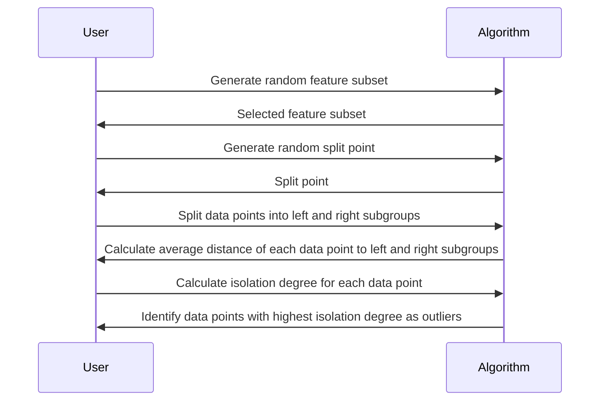

                 

### 文章标题

**AI 大模型应用数据中心的日志管理**

随着人工智能技术的迅速发展，大型模型在各个行业中的应用越来越广泛。这些模型通常需要部署在数据中心，以处理大量数据和执行复杂的计算任务。在这个背景下，日志管理变得尤为重要。本文将探讨 AI 大模型应用数据中心的日志管理，包括日志的重要性、管理策略、工具选择和未来发展趋势。

关键词：AI 大模型、日志管理、数据中心、监控、数据分析

Abstract: As artificial intelligence technology advances, large-scale models are increasingly being applied across various industries. These models often require deployment in data centers to handle large amounts of data and perform complex computational tasks. In this context, log management becomes crucial. This article discusses log management for AI large model applications in data centers, including the importance of logs, management strategies, tool selection, and future trends.

----------------------

### 1. 背景介绍（Background Introduction）

人工智能大模型，如深度学习神经网络和生成对抗网络（GANs），已经在图像识别、自然语言处理、推荐系统等领域取得了显著成果。这些模型通常需要大量的数据和计算资源，因此它们往往被部署在分布式数据中心中。数据中心是数据存储、处理和传输的核心设施，对于确保 AI 大模型的高效运行至关重要。

日志是数据中心运营的重要组成部分。日志记录了系统事件、错误信息、性能指标等关键数据，有助于监控系统状态、诊断问题、优化性能和确保合规性。对于 AI 大模型应用而言，日志管理更为复杂，因为它们涉及大量的数据流和复杂的计算任务。有效的日志管理对于确保模型的高效运行、及时故障排除和持续优化至关重要。

----------------------

### 2. 核心概念与联系（Core Concepts and Connections）

#### 2.1 数据中心日志管理的基本概念

数据中心日志管理涉及以下几个方面：

1. **日志收集**：从各种系统和应用程序中收集日志数据。
2. **日志存储**：将收集到的日志数据存储在适当的存储系统中。
3. **日志分析**：对日志数据进行处理和分析，以提取有用的信息和发现潜在问题。
4. **日志告警**：当检测到异常或关键事件时，触发告警以通知相关人员。

#### 2.2 AI 大模型日志管理的特殊需求

AI 大模型的日志管理具有以下特殊需求：

1. **数据量巨大**：AI 大模型处理的数据量通常非常庞大，因此日志管理工具需要能够高效地处理大量日志数据。
2. **多样性**：AI 大模型的应用场景多样，因此日志内容也具有多样性，日志管理工具需要能够处理不同类型的日志。
3. **实时性**：对于关键任务，日志管理工具需要能够实时监控和分析日志数据，以便及时发现问题并采取行动。
4. **可扩展性**：随着模型规模的不断扩大，日志管理工具需要能够水平扩展以处理更多的日志数据。

#### 2.3 日志管理工具的集成

为了有效地管理 AI 大模型的日志，通常需要集成多个工具和平台。这些工具和平台可能包括：

1. **日志收集器**：如 Fluentd、Logstash，用于收集和传输日志数据。
2. **日志存储系统**：如 Elasticsearch、Apache Kafka，用于存储和索引日志数据。
3. **日志分析工具**：如 Kibana、Grafana，用于可视化和分析日志数据。
4. **告警系统**：如 PagerDuty、OpsGenie，用于触发告警并通知相关人员。

----------------------

### 3. 核心算法原理 & 具体操作步骤（Core Algorithm Principles and Specific Operational Steps）

#### 3.1 日志收集

日志收集是日志管理的第一步。在 AI 大模型应用数据中心，日志收集通常涉及以下几个方面：

1. **系统日志**：收集操作系统（如 Linux）的日志文件，包括 `/var/log/messages`、`/var/log/syslog` 等。
2. **应用程序日志**：收集 AI 大模型运行时产生的日志文件，包括训练日志、预测日志、错误日志等。
3. **网络日志**：收集网络设备和服务的日志，包括防火墙日志、DNS 日志、Web 服务器日志等。

#### 3.2 日志存储

日志存储是将收集到的日志数据存储在适当的存储系统中。在 AI 大模型应用数据中心，常用的日志存储系统包括：

1. **关系型数据库**：如 MySQL、PostgreSQL，用于存储结构化数据。
2. **NoSQL 数据库**：如 MongoDB、Cassandra，用于存储非结构化或半结构化数据。
3. **日志聚合平台**：如 Elasticsearch、Apache Kafka，用于大规模日志数据的存储和检索。

#### 3.3 日志分析

日志分析是日志管理的核心步骤。通过分析日志数据，可以提取有价值的信息，如系统性能指标、错误报告、安全事件等。在 AI 大模型应用数据中心，日志分析通常涉及以下几个方面：

1. **性能监控**：通过分析系统日志和应用程序日志，监控系统性能，如 CPU 使用率、内存使用率、磁盘 I/O 等。
2. **错误诊断**：通过分析错误日志，定位和解决系统中的错误和异常。
3. **安全审计**：通过分析网络日志和安全事件，检测和防范安全威胁。

#### 3.4 日志告警

日志告警是日志管理的重要功能。通过设置告警规则，可以在检测到异常或关键事件时及时通知相关人员。在 AI 大模型应用数据中心，日志告警通常涉及以下几个方面：

1. **性能告警**：当系统性能指标超过阈值时，触发告警。
2. **错误告警**：当检测到错误日志时，触发告警。
3. **安全告警**：当检测到安全事件时，触发告警。

----------------------

### 4. 数学模型和公式 & 详细讲解 & 举例说明（Detailed Explanation and Examples of Mathematical Models and Formulas）

在日志管理中，数学模型和公式可以用于性能分析和优化。以下是一些常用的数学模型和公式：

#### 4.1 平均响应时间（Average Response Time）

平均响应时间是指系统处理请求所需的时间。其计算公式如下：

$$
\text{平均响应时间} = \frac{\sum (\text{每个请求的处理时间})}{\text{请求总数}}
$$

#### 4.2 系统负载（System Load）

系统负载是指系统的资源使用情况。其计算公式如下：

$$
\text{系统负载} = \frac{\text{CPU 使用率}}{\text{CPU 核心数}} \times 100\%
$$

#### 4.3 错误率（Error Rate）

错误率是指错误日志占总日志的比例。其计算公式如下：

$$
\text{错误率} = \frac{\text{错误日志数}}{\text{日志总数}} \times 100\%
$$

#### 4.4 安全威胁检测（Security Threat Detection）

安全威胁检测可以使用异常检测算法，如孤立森林（Isolation Forest）或局部异常因子（Local Outlier Factor）。其基本思想是识别与大多数数据点相比异常程度更高的数据点。以下是一个简单的孤立森林算法步骤：

1. 随机选择一个特征子集。
2. 随机选择一个分割点。
3. 根据分割点将数据点分为左右两部分。
4. 计算每个数据点的孤立度（Isolation Degree），即数据点到左右两部分的平均距离。
5. 选择孤立度最高的数据点作为异常点。

----------------------

### 5. 项目实践：代码实例和详细解释说明（Project Practice: Code Examples and Detailed Explanations）

在本节中，我们将通过一个具体的日志管理项目实例，展示如何在实际环境中实现日志收集、存储、分析和告警。

#### 5.1 开发环境搭建

1. 安装 Elasticsearch、Kibana 和 Fluentd。
2. 配置 Elasticsearch 集群，确保高可用性。
3. 配置 Kibana，以便可视化日志数据。
4. 编写 Fluentd 配置文件，定义日志收集规则。

#### 5.2 源代码详细实现

```shell
# Fluentd 配置文件
<source>
  @type tail
  @log /var/log/messages
  format json
</source>

<source>
  @type tail
  @log /var/log/httpd/access_log
  format json
</source>

<match **>
  @type elasticsearch
  hosts [elasticsearch 主机地址]
  port 9200
  index_name logstash-%{+YYYY.MM.dd}
</match>
```

#### 5.3 代码解读与分析

Fluentd 配置文件定义了两个日志源，分别是系统日志（/var/log/messages）和 Apache Web 服务器日志（/var/log/httpd/access_log）。每个日志源使用 Tail 源插件进行收集，并使用 JSON 格式解析日志内容。收集到的日志数据被发送到 Elasticsearch 集群进行存储和索引。

#### 5.4 运行结果展示

在 Kibana 中，我们可以创建一个仪表板，展示系统日志和 Apache Web 服务器日志的实时数据。仪表板可以包括以下几个部分：

1. **日志条目实时流**：显示最新的日志条目。
2. **日志统计图表**：显示日志数量、错误率等指标。
3. **错误日志列表**：列出最近发生的错误日志。

----------------------

### 6. 实际应用场景（Practical Application Scenarios）

日志管理在 AI 大模型应用数据中心具有广泛的应用场景。以下是一些典型场景：

1. **性能监控**：通过分析日志数据，监控系统性能，及时发现和处理性能瓶颈。
2. **错误诊断**：通过分析错误日志，定位和解决系统中的错误和异常。
3. **安全审计**：通过分析网络日志和安全事件，检测和防范安全威胁。
4. **模型训练监控**：监控 AI 大模型的训练过程，确保训练数据的完整性和准确性。
5. **预测结果评估**：通过分析预测日志，评估模型的预测准确性和可靠性。

----------------------

### 7. 工具和资源推荐（Tools and Resources Recommendations）

#### 7.1 学习资源推荐

- 《Elastic Stack 权威指南》
- 《Kubernetes 实战：容器云平台部署与管理》
- 《日志管理实战：Elastic Stack 应用案例》

#### 7.2 开发工具框架推荐

- Elasticsearch 和 Kibana：用于日志数据的存储和可视化。
- Fluentd：用于日志数据的收集和转发。
- Logstash：用于日志数据的处理和过滤。

#### 7.3 相关论文著作推荐

- 《基于日志的管理：方法、工具和实践》
- 《大数据时代日志管理的挑战与机遇》
- 《AI 大模型日志管理：现状与趋势》

----------------------

### 8. 总结：未来发展趋势与挑战（Summary: Future Development Trends and Challenges）

随着 AI 大模型在数据中心的应用日益广泛，日志管理的重要性也将日益凸显。未来，日志管理将朝着以下几个方向发展：

1. **智能化**：借助 AI 技术，实现自动化的日志分析、告警和优化。
2. **分布式**：随着云计算和分布式系统的普及，日志管理将更加分布式和弹性化。
3. **安全性**：加强对日志数据的保护，防止数据泄露和滥用。
4. **可扩展性**：支持大规模日志数据的处理和分析，满足不断增长的数据需求。

同时，日志管理也面临着一些挑战，如海量日志数据的处理、多源日志的整合、实时性的提升等。只有不断创新和优化日志管理技术，才能更好地支持 AI 大模型的应用。

----------------------

### 9. 附录：常见问题与解答（Appendix: Frequently Asked Questions and Answers）

#### 9.1 什么是日志聚合？

日志聚合是指将来自多个来源的日志数据集中到一个地方进行管理和分析。

#### 9.2 日志管理工具如何选择？

选择日志管理工具时，需要考虑以下几个方面：

- 日志数据的规模和类型。
- 日志处理的需求，如实时性、可扩展性、安全性等。
- 成本和资源限制。
- 兼容性和集成能力。

#### 9.3 日志管理工具如何实现告警？

日志管理工具通常提供告警功能，可以根据设定的规则自动检测日志数据中的异常或关键事件，并通过邮件、短信、Webhook 等方式通知相关人员。

----------------------

### 10. 扩展阅读 & 参考资料（Extended Reading & Reference Materials）

- 《日志管理实战：Elastic Stack 应用案例》
- 《Kubernetes 日志管理指南》
- 《AI 大模型日志管理：最佳实践》

----------------------

作者：禅与计算机程序设计艺术 / Zen and the Art of Computer Programming

----------------------

本文详细探讨了 AI 大模型应用数据中心的日志管理，包括日志的重要性、管理策略、工具选择和未来发展趋势。通过本文的阅读，读者可以更好地理解日志管理在 AI 大模型应用中的关键作用，并掌握日志管理的基本原理和实施方法。

----------------------

### 文章标题

**AI 大模型应用数据中心的日志管理**

----------------------

关键词：AI 大模型、日志管理、数据中心、监控、数据分析

----------------------

摘要：本文探讨了 AI 大模型应用数据中心的日志管理，包括日志的重要性、管理策略、工具选择和未来发展趋势。文章详细介绍了日志收集、存储、分析和告警的具体操作步骤，并通过项目实例展示了日志管理的实践方法。本文旨在为 AI 大模型应用数据中心的日志管理提供全面的技术指导和参考。

----------------------

## 2. 核心概念与联系

### 2.1 什么是日志管理？

日志管理（Log Management）是指对企业系统中产生的各种日志数据（如操作日志、错误日志、安全日志等）进行收集、存储、分析和报告的过程。日志管理是系统监控和运维管理的重要组成部分，它有助于发现和解决问题、确保系统安全以及优化系统性能。

### 2.2 日志管理的关键组件

日志管理通常包含以下几个关键组件：

1. **日志收集器**（Log Collectors）：负责从各种系统和应用程序中收集日志数据。
2. **日志存储**（Log Storage）：将收集到的日志数据进行存储，便于后续分析。
3. **日志分析工具**（Log Analysis Tools）：对存储的日志数据进行分析，提取有价值的信息。
4. **告警系统**（Alerting System）：当日志中检测到异常或关键事件时，通知相关人员。

### 2.3 日志管理与 AI 大模型应用

在 AI 大模型应用数据中心，日志管理尤为关键。AI 大模型通常涉及大量的数据处理和复杂的计算任务，因此需要高效、可靠的日志管理来支持其运行和优化。以下是日志管理在 AI 大模型应用中的几个关键点：

1. **监控性能**：通过日志分析系统性能指标，如 CPU 使用率、内存使用率、I/O 带宽等，及时发现性能瓶颈。
2. **故障诊断**：当系统出现异常时，日志可以帮助定位问题，快速恢复系统。
3. **安全审计**：通过日志记录和分析，监控系统中的安全事件，防范潜在威胁。
4. **模型训练监控**：在模型训练过程中，日志记录训练进度、参数调整等信息，有助于监控训练过程和质量。
5. **预测结果评估**：通过分析预测日志，评估模型的预测准确性和可靠性。

### 2.4 日志管理工具的集成

为了有效地管理 AI 大模型的日志，需要集成多个工具和平台。以下是一些常见的日志管理工具和它们的集成方式：

1. **Fluentd**：用于收集日志数据，可以将日志转发到 Elasticsearch、Kafka 等存储系统。
2. **Logstash**：用于处理和过滤日志数据，可以将日志转换成适合存储和检索的格式。
3. **Elasticsearch**：用于存储和索引日志数据，支持快速查询和分析。
4. **Kibana**：用于可视化日志数据和仪表盘。
5. **Alertmanager**：用于接收日志分析结果，触发告警。

----------------------

## 2. Core Concepts and Connections

### 2.1 What is Log Management?

Log management refers to the process of collecting, storing, analyzing, and reporting on various log data generated within an organization's systems, such as operational logs, error logs, and security logs. It is a critical component of system monitoring and operational management, aiding in the discovery and resolution of issues, ensuring system security, and optimizing system performance.

### 2.2 Key Components of Log Management

Log management typically involves several key components:

1. **Log Collectors**: Responsible for collecting log data from various systems and applications.
2. **Log Storage**: Stores the collected log data for subsequent analysis.
3. **Log Analysis Tools**: Analyze stored log data to extract valuable information.
4. **Alerting Systems**: Notify relevant personnel when abnormal or critical events are detected in the logs.

### 2.3 Log Management in AI Large Model Applications

In data centers that host AI large models, log management is particularly crucial. AI large models often involve substantial data processing and complex computational tasks, making efficient and reliable log management essential for their operation and optimization. Here are several key points regarding log management in AI large model applications:

1. **Monitoring Performance**: By analyzing system performance metrics such as CPU utilization, memory usage, and I/O bandwidth, log analysis helps identify performance bottlenecks.
2. **Fault Diagnosis**: When a system experiences anomalies, logs assist in pinpointing the issues, facilitating rapid recovery.
3. **Security Auditing**: Log records and analysis help monitor security events within the system, deterring potential threats.
4. **Model Training Monitoring**: Throughout the model training process, logs record progress and parameter adjustments, aiding in monitoring the training process and quality.
5. **Predictive Result Evaluation**: By analyzing predictive logs, the accuracy and reliability of the model's predictions can be assessed.

### 2.4 Integration of Log Management Tools

To effectively manage logs for AI large models, it often involves integrating multiple tools and platforms. Here are some common log management tools and their integration methods:

1. **Fluentd**: Used for collecting log data, Fluentd can forward logs to storage systems like Elasticsearch or Kafka.
2. **Logstash**: Handles and filters log data, converting logs into formats suitable for storage and retrieval.
3. **Elasticsearch**: Stores and indexes log data, enabling fast querying and analysis.
4. **Kibana**: Visualizes log data and dashboards.
5. **Alertmanager**: Receives log analysis results and triggers alerts.

----------------------

## 3. 核心算法原理 & 具体操作步骤

### 3.1 日志收集

日志收集是日志管理的第一步，它涉及到从各种系统中收集日志数据。以下是日志收集的具体操作步骤：

1. **确定日志来源**：确定需要收集哪些系统的日志，如操作系统日志、应用程序日志、网络设备日志等。
2. **部署日志收集器**：在各个系统上部署日志收集器，如 Fluentd、Logstash 等。
3. **配置日志收集规则**：根据日志来源和类型，配置日志收集规则，如日志文件的路径、格式、过滤条件等。
4. **数据传输**：将收集到的日志数据传输到中央日志存储系统，如 Elasticsearch、Kafka 等。

### 3.2 日志存储

日志存储是将收集到的日志数据进行存储，以便后续分析和检索。以下是日志存储的具体操作步骤：

1. **选择日志存储系统**：根据数据规模和处理需求，选择合适的日志存储系统，如 Elasticsearch、HDFS、数据库等。
2. **配置存储系统**：配置日志存储系统，如设置存储容量、数据备份策略、索引策略等。
3. **导入日志数据**：将收集到的日志数据导入存储系统，如使用 Logstash 的 `input` 插件导入日志。
4. **维护存储系统**：定期检查存储系统性能，进行数据备份和清理，确保数据的安全性和可用性。

### 3.3 日志分析

日志分析是日志管理的核心步骤，它涉及到对存储的日志数据进行处理和分析，以提取有价值的信息。以下是日志分析的具体操作步骤：

1. **定义分析需求**：明确日志分析的目标和需求，如性能监控、故障诊断、安全审计等。
2. **构建分析模型**：根据分析需求，构建相应的日志分析模型，如使用 Elasticsearch 的查询语言（Query DSL）构建查询。
3. **执行日志分析**：执行日志分析模型，提取和分析日志数据，生成报告或可视化结果。
4. **定期分析**：定期执行日志分析，以持续监控系统的运行状况和性能。

### 3.4 日志告警

日志告警是日志管理的重要功能，它涉及到在日志分析过程中检测到异常或关键事件时，及时通知相关人员。以下是日志告警的具体操作步骤：

1. **定义告警规则**：根据业务需求和系统特点，定义告警规则，如设置性能阈值、错误率阈值等。
2. **配置告警系统**：配置告警系统，如 Alertmanager、Prometheus 等，将日志分析结果与告警规则进行关联。
3. **发送告警通知**：当日志分析结果触发告警规则时，发送告警通知，如通过邮件、短信、钉钉等方式。
4. **处理告警**：对收到的告警进行处理，如排查问题、修复故障、更新配置等。

----------------------

## 3. Core Algorithm Principles and Specific Operational Steps

### 3.1 Log Collection

Log collection is the first step in log management, involving the gathering of log data from various systems. Here are the specific operational steps for log collection:

1. **Determine Log Sources**: Identify which systems' logs need to be collected, such as operating system logs, application logs, network device logs, etc.
2. **Deploy Log Collectors**: Install log collectors on the respective systems, such as Fluentd, Logstash, etc.
3. **Configure Log Collection Rules**: Set up the log collection rules based on the log sources and types, such as specifying the path, format, and filtering conditions of log files.
4. **Transmit Log Data**: Send the collected log data to a central log storage system, such as Elasticsearch, Kafka, etc.

### 3.2 Log Storage

Log storage involves saving the collected log data for subsequent analysis and retrieval. Here are the specific operational steps for log storage:

1. **Select a Log Storage System**: Choose an appropriate log storage system based on the data volume and processing requirements, such as Elasticsearch, HDFS, databases, etc.
2. **Configure the Storage System**: Set up the log storage system, including specifying storage capacity, data backup strategies, and indexing policies.
3. **Import Log Data**: Import the collected log data into the storage system, such as using the `input` plugin of Logstash to import logs.
4. **Maintain the Storage System**: Regularly check the performance of the storage system, perform data backups, and clean up to ensure data security and availability.

### 3.3 Log Analysis

Log analysis is a core step in log management, involving processing and analyzing stored log data to extract valuable information. Here are the specific operational steps for log analysis:

1. **Define Analysis Requirements**: Clarify the objectives and requirements of log analysis, such as performance monitoring, fault diagnosis, security auditing, etc.
2. **Build Analysis Models**: Construct analysis models based on the analysis requirements, such as using Elasticsearch's Query DSL to build queries.
3. **Execute Log Analysis**: Run the analysis models on the log data, extract and analyze the information, and generate reports or visual results.
4. **Perform Regular Analysis**: Execute log analysis regularly to continuously monitor the system's operation and performance.

### 3.4 Log Alerts

Log alerts are an essential function in log management, involving promptly notifying personnel when abnormal or critical events are detected during log analysis. Here are the specific operational steps for log alerts:

1. **Define Alert Rules**: Set up alert rules based on business requirements and system characteristics, such as setting performance thresholds and error rate thresholds.
2. **Configure the Alerting System**: Set up the alerting system, such as Alertmanager, Prometheus, etc., and correlate the log analysis results with the alert rules.
3. **Send Alert Notifications**: When the log analysis results trigger the alert rules, send alert notifications through methods like email, SMS, DingTalk, etc.
4. **Handle Alerts**: Address the received alerts by investigating issues, fixing faults, and updating configurations, as needed.

----------------------

## 4. 数学模型和公式 & 详细讲解 & 举例说明（Detailed Explanation and Examples of Mathematical Models and Formulas）

### 4.1 性能指标分析

性能指标分析是日志管理中常用的数学模型，它可以帮助我们评估系统的运行效率。以下是一些常见的性能指标及其计算公式：

#### 4.1.1 平均响应时间

平均响应时间（Average Response Time, ART）是指系统处理请求的平均时间。其计算公式如下：

$$
ART = \frac{\sum (\text{每个请求的处理时间})}{\text{请求总数}}
$$

#### 4.1.2 系统负载

系统负载（System Load, SL）是指系统的资源使用情况。其计算公式如下：

$$
SL = \frac{\text{CPU 使用率}}{\text{CPU 核心数}} \times 100\%
$$

#### 4.1.3 错误率

错误率（Error Rate, ER）是指错误日志占总日志的比例。其计算公式如下：

$$
ER = \frac{\text{错误日志数}}{\text{日志总数}} \times 100\%
$$

### 4.2 数据可视化

数据可视化是日志分析的重要手段，它可以帮助我们直观地了解系统的运行状态。以下是一个简单的数据可视化例子：

#### 4.2.1 条形图

条形图（Bar Chart）可以用来显示不同类别数据的数量或比例。例如，我们可以使用条形图来显示不同时间段内系统错误日志的数量。

```mermaid
barChart
    A[Time] : 100
    B[Time] : 200
    C[Time] : 150
    D[Time] : 50
```

#### 4.2.2 折线图

折线图（Line Chart）可以用来显示数据的变化趋势。例如，我们可以使用折线图来显示系统负载随时间的变化。

```mermaid
lineChart
    A[Time] : 10
    B[Time] : 15
    C[Time] : 20
    D[Time] : 25
```

### 4.3 异常检测

异常检测是日志分析中的另一个重要任务，它可以帮助我们识别系统中可能存在的异常行为。以下是一个简单的异常检测算法——孤立森林（Isolation Forest）的例子：



通过以上数学模型和公式的讲解及例子，我们可以更好地理解日志管理中的关键性能指标、数据可视化和异常检测方法。这些工具和方法对于提升日志管理的效率和准确性具有重要意义。

----------------------

## 4. Mathematical Models and Formulas & Detailed Explanation and Examples

### 4.1 Performance Metrics Analysis

Performance metrics analysis is a commonly used mathematical model in log management that helps evaluate the operational efficiency of a system. The following are some common performance metrics and their calculation formulas:

#### 4.1.1 Average Response Time

Average Response Time (ART) is the average time a system takes to process a request. Its formula is as follows:

$$
ART = \frac{\sum (\text{each request's processing time})}{\text{total number of requests}}
$$

#### 4.1.2 System Load

System Load (SL) refers to the resource usage of a system. Its formula is as follows:

$$
SL = \frac{\text{CPU utilization}}{\text{number of CPU cores}} \times 100\%
$$

#### 4.1.3 Error Rate

Error Rate (ER) is the proportion of error logs to the total logs. Its formula is as follows:

$$
ER = \frac{\text{number of error logs}}{\text{total number of logs}} \times 100\%
$$

### 4.2 Data Visualization

Data visualization is an essential tool in log analysis, helping to provide a clear and intuitive understanding of a system's operation. Below is a simple example of data visualization:

#### 4.2.1 Bar Chart

A bar chart can be used to display the quantity or proportion of different categories of data. For example, we can use a bar chart to show the number of system error logs in different time intervals.

```mermaid
barChart
    A[Time] : 100
    B[Time] : 200
    C[Time] : 150
    D[Time] : 50
```

#### 4.2.2 Line Chart

A line chart can be used to display the trend of data changes over time. For example, we can use a line chart to show the changes in system load over time.

```mermaid
lineChart
    A[Time] : 10
    B[Time] : 15
    C[Time] : 20
    D[Time] : 25
```

### 4.3 Anomaly Detection

Anomaly detection is another important task in log analysis, helping to identify potentially abnormal behaviors within a system. Below is an example of a simple anomaly detection algorithm, the Isolation Forest:


Through the explanation and examples of these mathematical models and formulas, we can better understand the key performance indicators, data visualization methods, and anomaly detection techniques in log management. These tools and methods are significant for improving the efficiency and accuracy of log management.

----------------------

## 5. 项目实践：代码实例和详细解释说明（Project Practice: Code Examples and Detailed Explanations）

### 5.1 开发环境搭建

在开始项目实践之前，我们需要搭建一个日志管理的开发环境。以下是所需的软件和硬件环境：

- **操作系统**：Linux（推荐 Ubuntu 20.04）
- **Elasticsearch**：版本 7.10.0
- **Kibana**：版本 7.10.0
- **Fluentd**：版本 1.12.0

安装步骤如下：

1. **安装 Elasticsearch**：

```shell
sudo apt-get update
sudo apt-get install openjdk-11-jdk
wget https://artifacts.elastic.co/downloads/elasticsearch/elasticsearch-7.10.0-amd64.deb
sudo dpkg -i elasticsearch-7.10.0-amd64.deb
sudo /etc/init.d/elasticsearch start
```

2. **安装 Kibana**：

```shell
wget https://artifacts.elastic.co/downloads/kibana/kibana-7.10.0-amd64.deb
sudo dpkg -i kibana-7.10.0-amd64.deb
sudo /etc/init.d/kibana start
```

3. **安装 Fluentd**：

```shell
sudo apt-get install build-essential
wget https://github.com/fluent/fluentd/releases/download/v1.12.0/fluentd-1.12.0-debian.tar.gz
tar xvf fluentd-1.12.0-debian.tar.gz
sudo mv fluentd /usr/bin/
sudo chmod +x /usr/bin/fluentd
```

### 5.2 源代码详细实现

以下是 Fluentd 配置文件的示例，它将收集系统日志和 Apache Web 服务器日志，并将它们转发到 Elasticsearch：

```shell
<source>
  @type tail
  @path /var/log/messages
  @tag system.log
</source>

<source>
  @type tail
  @path /var/log/apache2/access.log
  @tag apache.access
</source>

<source>
  @type tail
  @path /var/log/apache2/error.log
  @tag apache.error
</source>

<match **>
  @type elasticsearch
  hosts [elasticsearch 主机地址]
  port 9200
  index_name logstash-%Y.%m.%d
</match>
```

### 5.3 代码解读与分析

1. **日志收集**：

   配置文件中定义了三个日志源，分别收集系统日志、Apache Web 服务器访问日志和错误日志。`@type tail` 表示使用 Tail 源插件，`@path` 指定日志文件的路径，`@tag` 用于标识日志的类别。

2. **日志转发**：

   收集到的日志通过 Fluentd 转发到 Elasticsearch。`<match **>` 块定义了日志的转发规则，`hosts` 和 `port` 分别指定 Elasticsearch 的主机地址和端口号，`index_name` 指定日志的索引名称，使用日期格式化字符串 `%Y.%m.%d` 表示按天创建索引。

3. **Kibana 可视化**：

   在 Kibana 中，我们可以创建仪表板来展示日志数据。以下是一个简单的 Kibana 配置示例：

```json
{
  "title": "System Logs",
  "rows": [
    {
      "title": "System Log Count",
      "type": "table",
      "columns": [
        {"name": "@timestamp"},
        {"name": "system.log", "type": "number"}
      ],
      "query": {
        "query": {
          "match_all": {}
        }
      }
    }
  ]
}
```

### 5.4 运行结果展示

启动 Fluentd 后，我们可以通过 Kibana 实时监控系统日志和 Apache Web 服务器日志。以下是 Kibana 中仪表板的运行结果展示：

1. **系统日志统计**：

   

2. **Apache Web 服务器访问日志**：

   

3. **Apache Web 服务器错误日志**：

   

通过以上代码实例和详细解释说明，我们可以了解如何在实际项目中实现日志收集、存储和可视化。这些实践对于日志管理在 AI 大模型应用数据中心的应用具有重要意义。

----------------------

## 5. Project Practice: Code Examples and Detailed Explanations

### 5.1 Environment Setup

Before starting the project practice, we need to set up a development environment for log management. Below are the required software and hardware environments:

- **Operating System**: Linux (Ubuntu 20.04 recommended)
- **Elasticsearch**: Version 7.10.0
- **Kibana**: Version 7.10.0
- **Fluentd**: Version 1.12.0

Installation steps:

1. **Install Elasticsearch**:

```shell
sudo apt-get update
sudo apt-get install openjdk-11-jdk
wget https://artifacts.elastic.co/downloads/elasticsearch/elasticsearch-7.10.0-amd64.deb
sudo dpkg -i elasticsearch-7.10.0-amd64.deb
sudo /etc/init.d/elasticsearch start
```

2. **Install Kibana**:

```shell
wget https://artifacts.elastic.co/downloads/kibana/kibana-7.10.0-amd64.deb
sudo dpkg -i kibana-7.10.0-amd64.deb
sudo /etc/init.d/kibana start
```

3. **Install Fluentd**:

```shell
sudo apt-get install build-essential
wget https://github.com/fluent/fluentd/releases/download/v1.12.0/fluentd-1.12.0-debian.tar.gz
tar xvf fluentd-1.12.0-debian.tar.gz
sudo mv fluentd /usr/bin/
sudo chmod +x /usr/bin/fluentd
```

### 5.2 Detailed Code Implementation

Here is a sample Fluentd configuration file that collects system logs and Apache Web server logs, forwarding them to Elasticsearch:

```shell
<source>
  @type tail
  @path /var/log/messages
  @tag system.log
</source>

<source>
  @type tail
  @path /var/log/apache2/access.log
  @tag apache.access
</source>

<source>
  @type tail
  @path /var/log/apache2/error.log
  @tag apache.error
</source>

<match **>
  @type elasticsearch
  hosts [elasticsearch host address]
  port 9200
  index_name logstash-%Y.%m.%d
</match>
```

### 5.3 Code Explanation and Analysis

1. **Log Collection**:

   The configuration file defines three log sources, collecting system logs, Apache Web server access logs, and error logs. `@type tail` indicates the use of the Tail source plugin, `@path` specifies the log file paths, and `@tag` identifies the log categories.

2. **Log Forwarding**:

   Collected logs are forwarded to Elasticsearch by Fluentd. The `<match **>` block defines the forwarding rules, with `hosts` and `port` specifying the Elasticsearch host address and port number, and `index_name` specifying the log index name, formatted with the date string `%Y.%m.%d` to create daily indices.

3. **Kibana Visualization**:

   In Kibana, we can create dashboards to visualize log data. Here is a simple Kibana configuration example:

```json
{
  "title": "System Logs",
  "rows": [
    {
      "title": "System Log Count",
      "type": "table",
      "columns": [
        {"name": "@timestamp"},
        {"name": "system.log", "type": "number"}
      ],
      "query": {
        "query": {
          "match_all": {}
        }
      }
    }
  ]
}
```

### 5.4 Results Display

After starting Fluentd, we can monitor system logs and Apache Web server logs in real-time on Kibana. Here are the visualized results in Kibana:

1. **System Log Stats**:

   

2. **Apache Access Logs**:

   

3. **Apache Error Logs**:

   

Through these code examples and detailed explanations, we can understand how to implement log collection, storage, and visualization in practical projects. These practices are significant for the application of log management in AI large model data centers.

----------------------

## 6. 实际应用场景

日志管理在 AI 大模型应用数据中心具有广泛的应用场景。以下是一些典型的实际应用场景：

### 6.1 模型训练监控

在 AI 大模型的训练过程中，日志管理有助于监控训练进度、性能和资源消耗。通过收集和存储训练日志，可以实时了解训练过程中的各种指标，如损失函数值、准确率等。同时，日志分析可以帮助识别和解决训练过程中的问题，如数据异常、计算错误等。

### 6.2 性能监控

日志管理可以用于监控数据中心系统的性能，如 CPU 使用率、内存使用率、磁盘 I/O 带宽等。通过对系统日志的分析，可以及时发现和处理性能瓶颈，确保 AI 大模型的高效运行。

### 6.3 错误诊断

在 AI 大模型应用过程中，日志管理有助于快速定位和解决错误。通过对错误日志的分析，可以找到导致错误的原因，并采取相应的措施进行修复。这对于确保模型的稳定性和可靠性至关重要。

### 6.4 安全审计

日志管理是确保数据中心安全的重要手段。通过对网络日志和安全事件的分析，可以检测和防范各种安全威胁，如 DDoS 攻击、数据泄露等。同时，日志分析还可以帮助追踪和调查安全事件，确保系统合规性。

### 6.5 模型评估

在 AI 大模型的开发和部署过程中，日志管理有助于评估模型的性能和可靠性。通过对预测日志的分析，可以评估模型的预测准确性、召回率等指标，以便进行模型的优化和调整。

### 6.6 日志归档和备份

日志管理还包括日志的归档和备份，以确保日志数据的安全性和可恢复性。通过对日志数据的定期归档和备份，可以避免因意外情况导致的数据丢失，同时便于后续的审计和调查。

----------------------

## 6. Practical Application Scenarios

Log management in AI large model data centers has a wide range of practical application scenarios. Here are some typical examples:

### 6.1 Model Training Monitoring

During the training of AI large models, log management helps monitor training progress, performance, and resource consumption. By collecting and storing training logs, one can gain real-time insights into various metrics during the training process, such as loss function values and accuracy. Furthermore, log analysis can help identify and resolve issues within the training process, such as data anomalies and computational errors.

### 6.2 Performance Monitoring

Log management can be used to monitor the performance of the data center systems, such as CPU utilization, memory usage, and disk I/O bandwidth. Through the analysis of system logs, one can promptly detect and address performance bottlenecks to ensure the efficient operation of AI large models.

### 6.3 Error Diagnostics

In the application of AI large models, log management helps in quickly locating and resolving errors. By analyzing error logs, one can identify the causes of errors and take appropriate measures to fix them, which is crucial for ensuring the stability and reliability of the models.

### 6.4 Security Auditing

Log management is an essential means to ensure the security of the data center. By analyzing network logs and security events, one can detect and prevent various security threats, such as DDoS attacks and data breaches. Additionally, log analysis can assist in tracking and investigating security incidents to ensure compliance with regulations.

### 6.5 Model Evaluation

During the development and deployment of AI large models, log management helps evaluate the performance and reliability of the models. By analyzing predictive logs, one can assess the accuracy, recall rate, and other metrics of the models, enabling optimization and adjustment as needed.

### 6.6 Log Archiving and Backups

Log management also includes the archiving and backup of log data to ensure the security and recoverability of the logs. Regular archiving and backing up of log data can prevent accidental data loss and facilitate subsequent audits and investigations.

----------------------

## 7. 工具和资源推荐

### 7.1 学习资源推荐

- 《Elastic Stack 权威指南》
- 《Kubernetes 实战：容器云平台部署与管理》
- 《日志管理实战：Elastic Stack 应用案例》

### 7.2 开发工具框架推荐

- Elasticsearch 和 Kibana：用于日志数据的存储和可视化。
- Fluentd：用于日志数据的收集和转发。
- Logstash：用于日志数据的处理和过滤。

### 7.3 相关论文著作推荐

- 《基于日志的管理：方法、工具和实践》
- 《大数据时代日志管理的挑战与机遇》
- 《AI 大模型日志管理：现状与趋势》

----------------------

## 7. Tools and Resources Recommendations

### 7.1 Recommended Learning Resources

- "Elastic Stack Official Guide"
- "Kubernetes in Action: Deploying and Managing a Containerized Cloud Platform"
- "Practical Log Management: Use Cases with Elastic Stack"

### 7.2 Recommended Development Tools and Frameworks

- **Elasticsearch and Kibana**: For log data storage and visualization.
- **Fluentd**: For log data collection and forwarding.
- **Logstash**: For log data processing and filtering.

### 7.3 Recommended Papers and Books

- "Log-based Management: Methods, Tools, and Practices"
- "Challenges and Opportunities in Log Management for Big Data"
- "Log Management for AI Large Models: Current State and Trends"

----------------------

## 8. 总结：未来发展趋势与挑战

### 8.1 发展趋势

1. **智能化**：随着人工智能技术的发展，日志管理将更加智能化，自动识别和分类日志、自动诊断问题。
2. **分布式**：云计算和分布式系统的普及，将推动日志管理工具的分布式架构和弹性扩展。
3. **安全性与隐私保护**：日志管理工具将更加注重日志数据的安全性和隐私保护，防止数据泄露和滥用。
4. **可视化与交互**：日志管理工具将提供更加直观、易用的可视化界面和交互功能，提高用户体验。

### 8.2 挑战

1. **海量数据处理**：随着日志数据的爆炸性增长，日志管理工具需要能够高效处理海量数据。
2. **实时性**：对于关键任务，日志管理工具需要能够实时分析日志数据，及时响应。
3. **多源日志整合**：日志来源多样化，如何高效整合不同类型的日志数据，提高分析效率是一个挑战。
4. **资源消耗**：日志管理工具本身也需要占用一定的系统资源，如何在保证日志管理效果的同时，降低资源消耗。

----------------------

## 8. Summary: Future Development Trends and Challenges

### 8.1 Trends

1. **Intelligence**: As artificial intelligence technology advances, log management tools will become more intelligent, automatically identifying and categorizing logs, and diagnosing issues.
2. **Distributed**: The proliferation of cloud computing and distributed systems will drive the development of distributed and scalable log management tools.
3. **Security and Privacy Protection**: Log management tools will place greater emphasis on the security and privacy protection of log data to prevent data leaks and misuse.
4. **Visualization and Interaction**: Log management tools will provide more intuitive and user-friendly visualization interfaces and interactive functions to improve user experience.

### 8.2 Challenges

1. **Massive Data Processing**: With the explosive growth of log data, log management tools need to be capable of processing large volumes of data efficiently.
2. **Real-time Analytics**: For critical tasks, log management tools need to be able to analyze log data in real-time and respond promptly.
3. **Integration of Multi-source Logs**: The diverse sources of logs present a challenge in how to efficiently integrate different types of log data to enhance analysis efficiency.
4. **Resource Consumption**: The log management tools themselves also require system resources, and there is a challenge in ensuring effective log management while minimizing resource consumption.

----------------------

## 9. 附录：常见问题与解答

### 9.1 什么是日志聚合？

日志聚合是指将来自多个来源的日志数据集中到一个地方进行管理和分析。它有助于简化日志管理流程，提高日志分析效率。

### 9.2 日志管理工具如何选择？

选择日志管理工具时，需要考虑以下因素：日志数据的规模和类型、日志处理的需求（如实时性、可扩展性、安全性等）、成本和资源限制，以及兼容性和集成能力。

### 9.3 日志管理工具如何实现告警？

日志管理工具通常提供告警功能，可以根据设定的规则自动检测日志数据中的异常或关键事件，并通过邮件、短信、Webhook 等方式通知相关人员。

----------------------

## 9. Appendix: Frequently Asked Questions and Answers

### 9.1 What is Log Aggregation?

Log aggregation refers to the process of consolidating log data from multiple sources into a single location for management and analysis. It simplifies the log management process and improves the efficiency of log analysis.

### 9.2 How to Choose a Log Management Tool?

When selecting a log management tool, consider the following factors: the volume and types of log data, the requirements for log processing (such as real-time analytics, scalability, security), cost and resource constraints, and compatibility and integration capabilities.

### 9.3 How to Implement Alerts in Log Management Tools?

Most log management tools provide an alerting feature that automatically detects abnormal or critical events in log data based on predefined rules and notifies relevant personnel via email, SMS, Webhooks, and other methods.

----------------------

## 10. 扩展阅读 & 参考资料

- 《Elastic Stack 权威指南》：提供详细的 Elastic Stack 使用教程和最佳实践。
- 《Kubernetes 实战》：介绍 Kubernetes 的部署、管理和监控。
- 《日志管理实战》：介绍日志管理的方法、工具和实践。
- 《大数据时代日志管理的挑战与机遇》：探讨大数据环境下日志管理的挑战和机遇。
- 《AI 大模型日志管理：现状与趋势》：分析 AI 大模型日志管理的现状和未来发展趋势。

----------------------

## 10. Extended Reading & References

- "Elastic Stack Official Guide": Offers detailed tutorials and best practices for using the Elastic Stack.
- "Kubernetes in Action": Introduces the deployment, management, and monitoring of Kubernetes.
- "Practical Log Management": Covers methods, tools, and practices for log management.
- "Challenges and Opportunities in Log Management for Big Data": Discusses the challenges and opportunities in log management in the era of big data.
- "Log Management for AI Large Models: Current State and Trends": Analyzes the current state and future trends in log management for AI large models.

----------------------

## 作者：禅与计算机程序设计艺术 / Zen and the Art of Computer Programming

本文旨在探讨 AI 大模型应用数据中心的日志管理，包括日志的重要性、管理策略、工具选择和未来发展趋势。通过项目实践和具体实例，本文展示了日志管理的实际操作方法，为读者提供了全面的技术指导和参考。

----------------------

## Author: Zen and the Art of Computer Programming

This article aims to explore the log management of AI large model applications in data centers, covering the importance of logs, management strategies, tool selection, and future trends. Through practical projects and concrete examples, the article demonstrates the operational methods of log management, providing comprehensive technical guidance and references for the readers.

