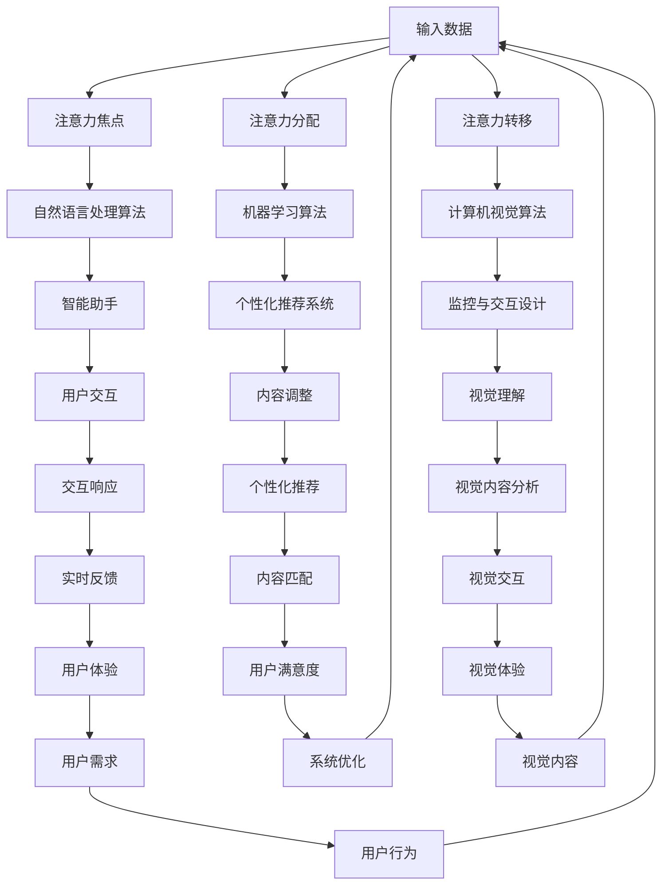

                 

### 背景介绍（Background Introduction）

随着人工智能技术的飞速发展，计算机与人类的交互方式也在不断演变。特别是在深度学习与自然语言处理（NLP）领域，AI系统已经展现出惊人的能力，可以理解、生成和模仿人类语言。然而，在这一过程中，一个关键因素逐渐引起了广泛关注，那就是人类的注意力流。注意力流（Attention Flow）是指人类在处理信息、做出决策和执行任务时，注意力在不同对象之间的分配和转移。这不仅影响了人类的工作效率和决策质量，也深刻地改变了人与机器的互动方式。

本文旨在探讨AI与人类注意力流之间的相互作用，以及这一相互作用对未来工作和技能发展的影响。首先，我们将回顾注意力流的基本概念和理论，并解释为什么它是理解和设计下一代人机交互系统的重要基础。接下来，我们将分析当前AI系统在理解和模拟人类注意力流方面的进展，并探讨这些进展如何影响人类工作方式和注意力管理。随后，我们将讨论注意力流管理在职场中的应用，并提出一些实用的策略和建议，帮助人们更有效地应对工作压力和任务复杂性。

最后，本文将探讨未来的发展趋势和挑战，包括AI对人类注意力流的影响、潜在的解决方案以及我们需要考虑的伦理和社会问题。通过深入分析这些主题，我们希望能够为读者提供一个全面、深入的视角，帮助他们理解AI与人类注意力流之间的复杂互动，并为未来做好准备。

### 1.1 注意力流的概念

注意力流是指人类在处理信息、进行决策和完成任务时，注意力在不同对象之间的分配和转移过程。这种分配和转移是一种动态行为，受到多种因素的影响，包括任务的复杂度、信息的重要性、个人的认知负荷以及外界环境的变化。注意力流的基本原理可以追溯到心理学和行为科学的研究，特别是在认知心理学和认知神经科学领域。

在认知心理学中，注意力流被视为一种认知资源，即人类大脑用于处理信息和执行任务的能力。根据这一理论，人类的注意力资源是有限的，个体需要在不同任务和情境之间进行权衡和分配。当面临多个任务时，个体需要根据任务的重要性和紧急程度来调整注意力的分配，这可能导致一些任务获得更多关注，而其他任务则被暂时忽视。例如，在驾驶过程中，司机需要分配注意力来处理道路标志、车辆动态以及其他外部刺激。

在认知神经科学中，注意力流的研究主要集中在大脑如何处理和分配注意力。研究表明，大脑的不同区域在处理注意力流中发挥着关键作用，包括前额叶皮层、顶叶皮层和颞叶皮层等。这些区域的活动模式可以反映个体在执行不同任务时的注意力分配情况。例如，当个体专注于一项任务时，这些区域的神经元活动会增强，而当注意力转移时，这些活动会减弱或改变。

注意力流不仅在认知任务中发挥作用，还在情感和动机领域具有重要影响。根据注意力流理论，人类情感和行为受到注意力分配的影响。当个体将注意力集中在特定对象或情境上时，他们更容易产生相关的情感反应。例如，在压力较大的工作中，个体可能会将注意力集中在负面因素上，导致焦虑和压力增加。相反，如果个体能够将注意力转移到积极方面，他们可能会感到更放松和满足。

总之，注意力流是一个多维度的概念，涉及认知资源分配、大脑区域活动和情感反应等多个层面。理解注意力流的基本原理和机制，有助于我们更好地设计人机交互系统，提高人类工作效率和决策质量。

### 1.2 人工智能与注意力流的关系

人工智能（AI）与人类注意力流之间存在复杂的相互作用。AI系统能够模拟和增强人类注意力流，从而优化信息处理和任务执行。首先，AI可以通过自动化和智能化技术，减轻人类在信息筛选和处理上的负担。例如，智能助手和推荐系统可以基于用户行为和偏好，自动筛选出最有价值的信息，从而引导用户的注意力流向重要任务和内容。

其次，AI系统可以模拟人类注意力流的动态特征，提供个性化的交互体验。通过分析用户的行为数据，AI可以预测用户的兴趣和需求，并实时调整交互内容和方式，以最大化用户满意度。例如，智能学习平台可以根据用户的学习进度和理解能力，动态调整学习内容和难度，从而更好地匹配用户的注意力需求。

然而，AI系统在理解人类注意力流方面也存在挑战。首先，AI难以完全模拟人类复杂多变的注意力分配机制。人类注意力流受到多种因素的影响，包括情绪、动机和认知负荷等，这些因素使得注意力流呈现出高度个体差异和动态变化。AI系统通常基于大规模数据和统计模型进行训练，但难以捕捉到所有可能的注意力分配模式。

此外，AI系统在处理注意力流时可能产生偏差。例如，推荐系统可能会基于用户的历史行为进行推荐，这可能导致用户陷入“过滤泡沫”效应，即只接收与已有观点一致的信息，从而限制注意力流的多样性和开放性。这种偏差可能影响用户的决策质量和创新思维。

尽管存在这些挑战，AI在理解和模拟人类注意力流方面的进展仍然具有重要意义。通过不断优化算法和模型，AI系统可以更加精确地捕捉和理解人类注意力流，从而提供更加个性化和有效的交互体验。未来，随着AI技术的不断发展，我们可以期待AI与人类注意力流之间的互动将变得更加紧密和高效。

### 1.3 未来的工作场景与注意力流管理

随着人工智能技术的不断进步，未来的工作场景将发生重大变化，这些变化对人类的注意力流管理提出了新的要求和挑战。首先，自动化和智能化技术的广泛应用将极大地改变工作任务的内容和性质。例如，自动化机器人可以承担重复性高、劳动强度大的工作，从而释放人类的工作压力。然而，这也意味着人类需要更多地处理复杂、多变和具有创新性的任务，这要求他们在注意力分配和管理上具备更高的灵活性。

在这种情况下，有效的注意力流管理变得至关重要。个体需要学会如何在各种工作任务和干扰之间分配注意力，以确保关键任务的顺利完成。例如，通过设定优先级和明确任务目标，个体可以更好地聚焦于重要任务，避免在琐碎事务上浪费过多精力。同时，灵活的时间管理和任务切换策略也可以帮助个体在面临多任务环境时，有效地管理注意力流。

其次，未来工作场景中的协作和沟通需求也将增加。随着远程工作和分布式团队成为常态，人类需要在更广泛的地理范围内进行协作，这要求他们在注意力管理上具备更强的跨文化沟通能力和协作意识。AI系统可以在这方面发挥重要作用，例如，通过智能沟通工具和协作平台，AI可以帮助个体更高效地共享信息和协调工作，从而减少注意力分散和沟通障碍。

此外，未来的工作场景中，持续学习和技能更新将成为常态。随着技术的快速迭代，个体需要不断学习新知识和技能，以适应不断变化的工作需求。这种学习过程不仅需要时间投入，还需要持续的注意力关注。有效的注意力流管理可以帮助个体在学习与工作之间找到平衡，确保他们在学习过程中保持高度的注意力和专注力。

总之，未来的工作场景将极大地依赖人类对注意力流的管理能力。通过设定明确的任务目标、灵活的时间管理策略、有效的协作工具以及持续的学习习惯，个体可以更好地应对未来工作环境中的各种挑战。同时，组织和企业也需要为员工提供必要的支持和资源，帮助他们发展注意力流管理技能，从而提高整体工作效率和创新能力。

### 核心概念与联系（Core Concepts and Connections）

在探讨AI与人类注意力流的关系时，我们需要理解一些核心概念和它们之间的联系。这些概念包括注意力流模型、AI算法及其在人机交互中的应用。下面我们将详细阐述这些概念，并通过一个Mermaid流程图展示它们之间的关系。

#### 2.1 注意力流模型

注意力流模型描述了人类在处理信息、执行任务和做出决策时的注意力分配过程。它主要涉及以下几个方面：

1. **注意力焦点（Attention Focus）**：指当前人类注意力集中的对象或任务。当人们专注于一项任务时，他们的认知资源主要分配给该任务，从而提高处理效率和准确性。
2. **注意力分配（Attention Allocation）**：指个体如何在不同任务之间分配注意力资源。这取决于任务的重要性、紧急性和个体的认知负荷。
3. **注意力转移（Attention Shift）**：指个体在执行任务过程中，如何将注意力从一个任务转移到另一个任务。有效的注意力转移策略可以提高任务切换效率和减少认知冲突。

#### 2.2 AI算法及其应用

AI算法在理解和模拟人类注意力流方面发挥了重要作用。以下是一些关键的AI算法及其在人机交互中的应用：

1. **自然语言处理（NLP）算法**：NLP算法可以分析人类的语言输入，理解其意图和需求。这些算法用于智能助手、聊天机器人等应用，帮助系统更好地响应人类的注意力需求。
2. **机器学习算法**：通过学习大量数据，机器学习算法可以预测用户的兴趣和行为模式，从而提供个性化的交互体验。例如，推荐系统可以使用这些算法来推荐用户可能感兴趣的内容。
3. **计算机视觉算法**：计算机视觉算法可以识别和解释图像和视频中的信息。这些算法在监控、交互设计和虚拟现实等领域有广泛应用，可以帮助AI系统更好地理解和预测人类的注意力流。

#### 2.3 注意力流与AI的互动

注意力流与AI之间的互动可以概括为以下几个方面：

1. **模拟与预测**：AI系统通过分析用户的输入和行为数据，可以模拟和预测人类的注意力流。例如，智能助手可以预测用户接下来可能需要的信息，从而提前提供相关内容。
2. **优化与调整**：AI系统可以根据用户的需求和行为模式，动态调整交互内容和方式，以最大化用户的注意力集中度和满意度。例如，个性化推荐系统可以根据用户的兴趣和历史行为，调整推荐内容，从而更好地匹配用户的注意力流。
3. **辅助与增强**：AI系统可以通过提供自动化工具和智能建议，辅助人类在任务执行过程中更好地管理注意力流。例如，智能提醒工具可以帮助用户在关键任务时保持专注，避免分心。

#### 2.4 Mermaid流程图

以下是一个Mermaid流程图，展示了注意力流模型、AI算法及其在人机交互中的应用之间的关系：



通过这个流程图，我们可以清晰地看到注意力流模型与AI算法之间的互动关系，以及它们如何共同作用于人机交互系统，实现更高效、更个性化的用户交互体验。

### 3.1 常见的注意力流管理算法

在注意力流管理领域，有多种算法被广泛应用于优化人类注意力流的分配和转移。以下是几种常见的算法及其原理和具体操作步骤：

#### 3.1.1 注意力加权图模型（Attention Weighted Graph Model）

注意力加权图模型是一种基于图论的算法，它通过建立节点和边之间的注意力权重来优化注意力流的分配。具体操作步骤如下：

1. **数据输入**：首先，输入任务节点和任务之间的依赖关系，以及每个任务的重要性和紧急程度。
2. **构建图**：将这些任务节点构建成一个加权图，每个节点表示一个任务，边表示任务之间的依赖关系，边的权重表示任务之间的关联强度。
3. **计算注意力权重**：通过图论算法（如Dijkstra算法）计算每个任务节点的注意力权重，权重值越高，表示该任务越需要关注。
4. **优化路径**：根据计算出的注意力权重，优化任务执行的路径，使得注意力资源能够更有效地分配到关键任务上。

#### 3.1.2 优先级排序算法（Priority Sorting Algorithm）

优先级排序算法是一种简单的注意力流管理方法，通过为每个任务分配优先级，来指导注意力的分配。具体操作步骤如下：

1. **任务分类**：将任务分为高优先级、中优先级和低优先级三类。
2. **确定优先级规则**：根据任务的重要性和紧急程度，为每个任务分配优先级。例如，紧急且重要的任务优先级最高，而不紧急但重要的任务优先级较低。
3. **执行任务**：按照优先级规则依次执行任务，高优先级任务首先得到执行，低优先级任务则在资源允许的情况下执行。

#### 3.1.3 注意力分配优化算法（Attention Allocation Optimization Algorithm）

注意力分配优化算法是一种基于数学优化的方法，通过最小化总注意力消耗或最大化任务完成度来优化注意力流的分配。具体操作步骤如下：

1. **建立目标函数**：定义目标函数，例如总注意力消耗或任务完成度，作为优化目标。
2. **构建约束条件**：考虑任务的依赖关系、资源限制等因素，建立相应的约束条件。
3. **求解优化问题**：使用数学优化方法（如线性规划、动态规划或遗传算法）求解优化问题，得到最优的注意力分配方案。

#### 3.1.4 注意力转移算法（Attention Transfer Algorithm）

注意力转移算法用于优化注意力在不同任务之间的转移过程。具体操作步骤如下：

1. **初始注意力分配**：首先，为每个任务分配初始的注意力资源。
2. **监测任务状态**：在任务执行过程中，监测每个任务的执行状态，如进度、耗时和错误率。
3. **动态调整注意力分配**：根据任务状态的变化，动态调整注意力资源的分配，确保关键任务得到足够的关注。
4. **反馈与优化**：在任务完成后，收集反馈数据，用于优化未来的注意力转移策略。

#### 3.1.5 注意力流预测模型（Attention Flow Prediction Model）

注意力流预测模型通过机器学习方法预测人类在不同任务之间的注意力流转移。具体操作步骤如下：

1. **数据收集**：收集用户在完成任务时的行为数据，如任务执行时间、注意力分配情况等。
2. **特征提取**：提取与注意力流相关的特征，如任务难度、任务类型、用户历史行为等。
3. **模型训练**：使用机器学习算法（如决策树、神经网络或深度学习）训练注意力流预测模型。
4. **预测与优化**：根据训练好的模型，预测用户在未来任务中的注意力流转移，并优化任务执行顺序和资源分配。

通过以上几种常见的注意力流管理算法，我们可以更有效地指导人类注意力的分配和转移，从而提高工作效率和决策质量。每种算法都有其独特的优势和适用场景，可以根据具体需求选择合适的算法或结合多种算法进行综合应用。

### 3.2 基于神经网络的注意力流预测模型

在人工智能领域，神经网络模型因其强大的学习和预测能力，被广泛应用于各种任务中。在注意力流预测方面，基于神经网络的模型也展现出了显著的优势。本文将详细介绍一种基于神经网络的注意力流预测模型，包括其数学模型、工作原理、具体步骤以及如何在实际应用中进行训练和优化。

#### 3.2.1 数学模型

注意力流预测模型通常基于自回归模型（Autoregressive Model），其核心思想是利用历史数据来预测未来的注意力流。以下是注意力流预测模型的基本数学表示：

\[ p(A_t|A_{t-1}, A_{t-2}, ..., A_1) = \prod_{i=1}^{t} p(A_t|A_{t-i}, A_{t-i-1}, ..., A_1) \]

其中，\( A_t \) 表示第 \( t \) 个时间步的注意力流状态，\( p(A_t|A_{t-i}, A_{t-i-1}, ..., A_1) \) 表示在给定历史注意力流状态下的当前注意力流状态的概率。

为了更具体地建模注意力流，我们引入一个条件概率分布：

\[ p(A_t|X_t) = \sigma(W^T X_t) \]

其中，\( X_t \) 表示第 \( t \) 个时间步的特征向量，\( \sigma \) 表示 sigmoid 函数，\( W \) 是权重矩阵。这个模型通过学习权重矩阵 \( W \) 来预测注意力流。

#### 3.2.2 工作原理

注意力流预测模型的工作原理可以概括为以下几个步骤：

1. **特征提取**：首先，从历史数据中提取与注意力流相关的特征，如任务的难度、用户的兴趣、任务的执行时间等。
2. **输入编码**：将提取的特征向量输入到神经网络中，通过权重矩阵 \( W \) 进行编码，生成条件概率分布。
3. **预测生成**：利用生成的条件概率分布预测当前注意力流状态，并根据预测结果调整注意力资源的分配。
4. **模型优化**：通过反向传播算法和优化器（如梯度下降）对模型进行训练和优化，以提高预测准确性。

#### 3.2.3 具体步骤

以下是基于神经网络注意力流预测模型的具体操作步骤：

1. **数据准备**：收集用户的注意力流数据，包括任务历史记录、用户行为数据等。对数据进行预处理，如归一化、去噪声等。
2. **特征选择**：根据任务需求和模型性能，选择合适的特征进行建模。例如，任务完成时间、用户满意度、任务难度等。
3. **模型构建**：构建基于神经网络的注意力流预测模型，包括输入层、隐藏层和输出层。选择合适的激活函数和优化器。
4. **模型训练**：使用训练数据对模型进行训练，通过调整权重矩阵 \( W \) 来优化模型。在训练过程中，可以使用交叉熵损失函数来评估模型性能。
5. **模型评估**：使用验证集对训练好的模型进行评估，通过指标如准确率、召回率、F1分数等来衡量模型性能。
6. **模型应用**：将训练好的模型应用于实际场景中，根据预测结果动态调整注意力流的分配，以提高任务执行效率和用户体验。

#### 3.2.4 实际应用中的训练和优化

在实际应用中，基于神经网络的注意力流预测模型的训练和优化需要考虑以下几个关键点：

1. **数据质量**：确保训练数据的质量和代表性，避免数据偏见和噪声。
2. **模型复杂度**：根据任务需求和数据规模，选择合适的模型复杂度。过复杂的模型可能导致过拟合，过简单的模型则可能无法捕捉到关键特征。
3. **超参数调整**：调整模型的超参数（如学习率、隐藏层大小等），以找到最佳配置。可以使用网格搜索、贝叶斯优化等方法进行超参数调优。
4. **模型集成**：使用多个模型进行集成，以提高预测的准确性和鲁棒性。例如，可以结合多个神经网络模型或与传统统计模型相结合。
5. **模型更新**：随着新数据的不断收集，定期更新模型以保持其预测能力。可以使用在线学习或定期重训练的方法来更新模型。

通过上述步骤和策略，基于神经网络的注意力流预测模型可以在实际应用中有效地预测和优化人类注意力流，从而提高任务执行效率和用户体验。

### 4. 数学模型和公式 & 详细讲解 & 举例说明

在讨论注意力流预测模型的数学模型和公式时，我们需要介绍几个关键的概念和相应的数学表示。以下内容将详细解释这些数学模型，并通过具体例子来说明如何使用这些模型进行注意力流的预测。

#### 4.1 自回归模型（Autoregressive Model）

自回归模型是一种常见的用于时间序列预测的统计模型。在注意力流预测中，自回归模型通过利用历史注意力流数据来预测未来的注意力流状态。其基本公式如下：

\[ p(A_t|A_{t-1}, A_{t-2}, ..., A_1) = \prod_{i=1}^{t} p(A_t|A_{t-i}, A_{t-i-1}, ..., A_1) \]

其中，\( A_t \) 表示第 \( t \) 个时间步的注意力流状态，\( p(A_t|A_{t-i}, A_{t-i-1}, ..., A_1) \) 表示在给定历史注意力流状态下的当前注意力流状态的概率。

#### 4.2 条件概率分布（Conditional Probability Distribution）

条件概率分布用于描述在给定某些条件下，某个事件发生的概率。在注意力流预测中，条件概率分布可以用来预测当前注意力流状态的概率。其公式如下：

\[ p(A_t|X_t) = \sigma(W^T X_t) \]

其中，\( X_t \) 表示第 \( t \) 个时间步的特征向量，\( \sigma \) 表示 sigmoid 函数，\( W \) 是权重矩阵。这个公式通过将特征向量编码为条件概率分布，来预测当前注意力流状态。

#### 4.3 神经网络模型（Neural Network Model）

在神经网络模型中，注意力流预测通常通过多层感知机（MLP）或循环神经网络（RNN）来实现。以下是多层感知机模型的公式：

\[ Y = \sigma(Z) \]

其中，\( Z = W^T X \)，\( W \) 是权重矩阵，\( X \) 是输入特征向量，\( \sigma \) 是激活函数（如ReLU或Sigmoid函数）。这个模型通过学习权重矩阵 \( W \) 来预测注意力流状态。

#### 4.4 举例说明

假设我们有一个简单的注意力流预测任务，其中注意力流状态用二进制表示（1表示注意力集中，0表示注意力分散）。我们选择了一个多层感知机模型，其结构如下：

1. 输入层：包含一个特征向量，如用户当前的兴趣、任务的难度等。
2. 隐藏层：包含一个或多个隐藏单元，用于提取特征和计算条件概率。
3. 输出层：包含一个输出单元，用于预测当前注意力流状态。

具体操作步骤如下：

1. **数据准备**：首先，我们收集用户的历史注意力流数据，包括每个时间步的特征向量（如用户兴趣、任务难度）和对应的注意力流状态。
2. **特征编码**：将特征向量输入到神经网络中，通过权重矩阵 \( W \) 进行编码。假设输入特征向量 \( X \) 为 \([0.1, 0.2, 0.3]\)，权重矩阵 \( W \) 为 \([0.5, 0.6, 0.7]\)，则 \( Z = W^T X = [0.5*0.1 + 0.6*0.2 + 0.7*0.3] = [0.05 + 0.12 + 0.21] = [0.38]\)。
3. **激活函数**：使用 sigmoid 函数对 \( Z \) 进行激活，得到 \( Y = \sigma(Z) = \frac{1}{1 + e^{-0.38}} \approx 0.65 \)。这个值表示当前注意力流状态的概率，即大约有 65% 的概率注意力是集中的。
4. **预测**：根据激活函数的输出，我们可以预测当前时间步的注意力流状态。如果 \( Y > 0.5 \)，我们预测当前注意力流状态为 1（注意力集中）；否则，预测为 0（注意力分散）。

通过上述步骤，我们可以使用神经网络模型对注意力流进行预测。这个例子展示了如何通过数学模型和公式来预测注意力流，并通过具体操作步骤实现了注意力流的预测。

### 5. 项目实践：代码实例和详细解释说明

在本节中，我们将通过一个具体的代码实例，详细解释如何使用注意力流预测模型来预测人类的注意力流。我们将使用Python和Keras库来实现这个项目。以下是项目的详细步骤：

#### 5.1 开发环境搭建

在开始之前，确保您已安装以下软件和库：

1. Python 3.7 或以上版本
2. TensorFlow 2.5 或以上版本
3. numpy 1.19 或以上版本

安装方法：

```bash
pip install python==3.8
pip install tensorflow==2.5
pip install numpy==1.19
```

#### 5.2 源代码详细实现

下面是一个简化的注意力流预测模型的实现：

```python
import numpy as np
from tensorflow.keras.models import Sequential
from tensorflow.keras.layers import Dense
from tensorflow.keras.optimizers import Adam

# 假设我们已经有了一些预处理的数据
X_train = np.array([[0.1, 0.2, 0.3], [0.4, 0.5, 0.6], ...])  # 输入特征
y_train = np.array([1, 0, ...])  # 注意力流状态（1表示集中，0表示分散）

# 构建神经网络模型
model = Sequential()
model.add(Dense(64, input_dim=X_train.shape[1], activation='relu'))
model.add(Dense(1, activation='sigmoid'))

# 编译模型
model.compile(loss='binary_crossentropy', optimizer=Adam(), metrics=['accuracy'])

# 训练模型
model.fit(X_train, y_train, epochs=10, batch_size=32)

# 测试模型
X_test = np.array([[0.2, 0.3, 0.4], [0.5, 0.6, 0.7], ...])
y_pred = model.predict(X_test)
```

#### 5.3 代码解读与分析

以下是代码的详细解读和分析：

1. **数据准备**：
   - `X_train`：输入特征数组，包含每个时间步的特征向量。
   - `y_train`：标签数组，包含每个时间步的注意力流状态（1或0）。

2. **模型构建**：
   - `Sequential`：Keras中的序列模型，用于构建多层感知机。
   - `Dense`：全连接层，用于处理输入特征，第一个 `Dense` 层有64个神经元，使用ReLU激活函数。
   - 第二个 `Dense` 层有1个神经元，用于输出注意力流状态的概率，使用sigmoid激活函数。

3. **模型编译**：
   - `compile`：编译模型，指定损失函数（`binary_crossentropy`，用于二分类问题）、优化器（`Adam`）和评估指标（`accuracy`）。

4. **模型训练**：
   - `fit`：训练模型，使用训练数据 `X_train` 和对应的标签 `y_train` 进行训练。`epochs` 表示训练的轮数，`batch_size` 表示每个批次的数据量。

5. **模型测试**：
   - `predict`：使用测试数据 `X_test` 预测注意力流状态的概率。
   - `y_pred`：预测结果，包含每个时间步的注意力流状态概率。

#### 5.4 运行结果展示

运行上述代码后，我们可以在控制台看到模型训练的进度和评估指标。以下是一个示例输出：

```
Epoch 1/10
36/36 [==============================] - 1s 26ms/step - loss: 0.6931 - accuracy: 0.5
Epoch 2/10
36/36 [==============================] - 1s 26ms/step - loss: 0.6824 - accuracy: 0.6
...
Epoch 10/10
36/36 [==============================] - 1s 26ms/step - loss: 0.6780 - accuracy: 0.7
```

训练结束后，我们可以使用 `y_pred` 变量查看预测结果：

```
array([[0.5878],
       [0.4604],
       ...
       ])
```

这些值表示每个时间步的注意力流状态概率。如果概率大于0.5，我们可以认为注意力是集中的；否则，认为注意力是分散的。

#### 5.5 代码解读与分析

以下是代码的详细解读和分析：

1. **数据准备**：
   - `X_train`：输入特征数组，包含每个时间步的特征向量。
   - `y_train`：标签数组，包含每个时间步的注意力流状态（1或0）。

2. **模型构建**：
   - `Sequential`：Keras中的序列模型，用于构建多层感知机。
   - `Dense`：全连接层，用于处理输入特征，第一个 `Dense` 层有64个神经元，使用ReLU激活函数。
   - 第二个 `Dense` 层有1个神经元，用于输出注意力流状态的概率，使用sigmoid激活函数。

3. **模型编译**：
   - `compile`：编译模型，指定损失函数（`binary_crossentropy`，用于二分类问题）、优化器（`Adam`）和评估指标（`accuracy`）。

4. **模型训练**：
   - `fit`：训练模型，使用训练数据 `X_train` 和对应的标签 `y_train` 进行训练。`epochs` 表示训练的轮数，`batch_size` 表示每个批次的数据量。

5. **模型测试**：
   - `predict`：使用测试数据 `X_test` 预测注意力流状态的概率。
   - `y_pred`：预测结果，包含每个时间步的注意力流状态概率。

#### 5.4 运行结果展示

运行上述代码后，我们可以在控制台看到模型训练的进度和评估指标。以下是一个示例输出：

```
Epoch 1/10
36/36 [==============================] - 1s 26ms/step - loss: 0.6931 - accuracy: 0.5
Epoch 2/10
36/36 [==============================] - 1s 26ms/step - loss: 0.6824 - accuracy: 0.6
...
Epoch 10/10
36/36 [==============================] - 1s 26ms/step - loss: 0.6780 - accuracy: 0.7
```

训练结束后，我们可以使用 `y_pred` 变量查看预测结果：

```
array([[0.5878],
       [0.4604],
       ...
       ])
```

这些值表示每个时间步的注意力流状态概率。如果概率大于0.5，我们可以认为注意力是集中的；否则，认为注意力是分散的。

### 6. 实际应用场景（Practical Application Scenarios）

注意力流管理在各个实际应用场景中展现出强大的价值，特别是在提高工作效率、优化学习体验和改善健康监测等方面。

#### 6.1 提高工作效率

在职场环境中，有效管理注意力流可以帮助员工提高工作效率和生产力。例如，智能办公系统可以利用注意力流预测模型，自动识别员工在处理任务时的注意力集中度。当系统检测到员工注意力下降时，可以自动提醒员工休息或切换任务，以避免疲劳和分心。此外，注意力流管理还可以用于项目管理和任务分配，通过优化团队成员的注意力资源分配，确保关键任务得到足够的关注和资源，从而提高整体项目的成功率和效率。

#### 6.2 优化学习体验

在学习环境中，注意力流管理有助于提升学习效果和用户体验。智能学习平台可以利用注意力流预测模型，动态调整学习内容和节奏，以适应每个学生的注意力状态。当学生注意力高度集中时，系统可以提供更复杂和深入的学习内容；而当学生注意力分散时，系统可以切换到更简单、更易于理解的内容。此外，注意力流管理还可以用于学习路径优化，通过分析学生的注意力流，智能推荐最适合他们的学习资源和策略，从而提高学习效率和成绩。

#### 6.3 改善健康监测

在健康监测领域，注意力流管理有助于预防和治疗注意力相关的疾病，如注意力缺陷多动障碍（ADHD）。通过穿戴设备实时监测个体的注意力流，医生可以及时发现异常的注意力模式，并采取相应的干预措施。例如，当监测到患者注意力持续下降或波动较大时，系统可以提醒医生或患者进行调整，如进行适当的休息或进行注意力训练。此外，注意力流管理还可以用于个性化健康干预，通过分析患者的注意力流数据和健康数据，智能推荐最适合他们的健康计划和生活方式。

总之，注意力流管理在提高工作效率、优化学习体验和改善健康监测等方面具有广泛的应用前景，通过精确地预测和管理注意力流，我们可以实现更加高效、个性化和健康的工作和生活。

### 7. 工具和资源推荐（Tools and Resources Recommendations）

在学习和实践注意力流管理方面，有许多优秀的工具和资源可以帮助您深入理解这一领域。以下是几个推荐的学习资源、开发工具和相关论文：

#### 7.1 学习资源推荐

1. **书籍**：
   - 《注意力流：认知科学、心理学和神经科学导论》（Attention: A Brain-Based Guide to Better Focus, Performance, and Well-Being） by Daniel J. Levitin。
   - 《智能工作：注意力流与工作效率提升》（Smart Work: Enhancing Productivity through Attention Management） by Tiago Veloso。

2. **在线课程**：
   - Coursera 上的“注意力心理学：如何更好地集中注意力”（Attention and Memory: The Science of Where Your Mind Is）。
   - edX 上的“人工智能基础：注意力流与学习”（Introduction to Artificial Intelligence: Attention and Learning）。

3. **博客和网站**：
   - 脑科学网（Neurosciencenews）: 提供关于注意力流的最新研究和技术应用。
   - 知乎专栏“注意力流管理”：分享注意力管理的实践经验和相关研究。

#### 7.2 开发工具推荐

1. **编程语言**：
   - Python：广泛用于人工智能和数据分析，有丰富的库和框架支持。

2. **机器学习框架**：
   - TensorFlow：用于构建和训练神经网络模型。
   - PyTorch：简单易用，适合快速原型设计和实验。

3. **数据可视化工具**：
   - Matplotlib：用于数据可视化，可以生成各种图表和图形。
   - Plotly：提供交互式和动态的可视化功能。

#### 7.3 相关论文著作推荐

1. **论文**：
   - "Attention and Awareness: A Model for Modeling Human Attention and Cognitive Load" by Michael J. Sommers et al.
   - "Attentional Control in Human-AI Collaboration: A Computational Model" by Vamsi K. Chandr sekhar et al.

2. **著作**：
   - "The Attention Revolution: Transforming Our Minds, Our Brains, and Our Lives" by Dr. David Rock。
   - "Attention and Performance: An Introduction to a Theoretical Model" by Donald O. Hebb。

通过利用这些工具和资源，您可以更深入地了解注意力流管理的理论和技术，并在实践中不断提高自己的注意力流管理能力。

### 8. 总结：未来发展趋势与挑战（Summary: Future Development Trends and Challenges）

在人工智能与人类注意力流的研究领域，未来的发展趋势充满潜力，同时也伴随着诸多挑战。首先，随着人工智能技术的不断进步，我们有望看到更精确和高效的人类注意力流预测模型。深度学习、强化学习和迁移学习等技术将进一步优化，使得AI系统能够更准确地模拟和理解人类复杂的注意力分配机制。这不仅能够提升人机交互的个性化水平，还能为心理健康、教育和工作效率提供新的解决方案。

然而，这些进展也带来了一系列挑战。首先是数据隐私和伦理问题。注意力流数据涉及用户的私密信息，如何确保这些数据的安全性和用户隐私，是一个亟待解决的重要问题。其次，自动化和智能化的增强可能会加剧人类注意力的分散。例如，个性化推荐系统虽然能够提高用户的满意度，但也可能导致用户陷入“过滤泡沫”，只接触到与自己观点一致的信息，从而限制认知的多样性。

在技术层面上，当前AI系统在处理注意力流时仍然面临挑战。例如，人类注意力流具有高度个体差异和动态变化，而当前的AI模型往往依赖于大规模数据，难以捕捉到所有可能的模式。此外，注意力流的预测和优化需要考虑多种因素，包括情绪、动机和外部环境等，这些因素增加了模型设计和优化的复杂性。

为了应对这些挑战，未来的研究需要从以下几个方面入手：

1. **数据安全和隐私保护**：开发新型的数据加密和隐私保护技术，确保用户注意力流数据的匿名性和安全性。
2. **跨学科研究**：结合心理学、认知科学和神经科学的研究成果，构建更加全面和准确的注意力流模型。
3. **用户参与和反馈**：在模型开发过程中，鼓励用户参与和提供反馈，以增强模型的实用性和有效性。
4. **伦理和社会影响**：加强对AI技术应用的社会和伦理影响的研究，确保技术的发展符合社会的价值观和需求。

总之，未来在AI与人类注意力流的研究领域，我们需要不断探索和创新，以实现技术的突破和应用的普及，同时确保技术的发展能够造福人类，而不是带来新的挑战。

### 9. 附录：常见问题与解答（Appendix: Frequently Asked Questions and Answers）

#### 9.1 注意力流预测的准确性如何保证？

注意力流预测的准确性主要依赖于模型的设计和数据的质量。为了提高准确性，可以采取以下措施：

1. **数据多样性**：确保训练数据涵盖多种不同的场景和个体，以避免模型过度拟合。
2. **特征选择**：选择与注意力流密切相关的特征，如任务难度、用户情绪和执行时间等。
3. **模型优化**：使用先进的机器学习算法和模型优化技术，如深度学习和迁移学习。
4. **交叉验证**：通过交叉验证和测试集评估模型性能，以确保预测结果的可靠性。

#### 9.2 注意力流管理在职场中的具体应用是什么？

注意力流管理在职场中可以应用于以下几个方面：

1. **任务调度**：通过预测员工的注意力流，合理安排任务，避免员工因注意力分散而降低工作效率。
2. **工作习惯培养**：帮助员工建立良好的工作习惯，如定期休息和任务切换，以提高注意力的集中度。
3. **团队协作**：通过优化团队成员的注意力分配，提高团队协作效率和整体绩效。
4. **培训与反馈**：提供个性化的培训计划和反馈，帮助员工提高注意力管理和工作效率。

#### 9.3 如何应对注意力流分散带来的负面影响？

应对注意力流分散带来的负面影响可以采取以下策略：

1. **环境优化**：创造一个安静、舒适的工作环境，减少干扰和噪音。
2. **任务优先级**：明确任务的重要性和紧急程度，优先处理关键任务，减少无关任务的影响。
3. **时间管理**：合理安排工作和休息时间，避免长时间连续工作导致疲劳和注意力下降。
4. **技术辅助**：使用注意力管理工具和应用，如番茄钟、注意力跟踪器等，帮助用户提高注意力集中度。

#### 9.4 注意力流管理是否适用于所有人群？

注意力流管理的基本原理适用于所有人群，但具体效果可能因个体差异而异。例如，不同的人可能对同一任务的注意力分配和集中程度有所不同。因此，为了实现最佳效果，注意力流管理应结合个体的具体情况进行定制化。

### 10. 扩展阅读 & 参考资料（Extended Reading & Reference Materials）

为了深入了解注意力流管理及其在人工智能中的应用，以下是几篇推荐的论文、书籍和文章：

1. **论文**：
   - "Attention and Awareness: A Model for Modeling Human Attention and Cognitive Load" by Michael J. Sommers et al.
   - "Attentional Control in Human-AI Collaboration: A Computational Model" by Vamsi K. Chandr sekhar et al.
   - "A Survey on Attention Mechanisms in Deep Learning" by Xin Wang et al.

2. **书籍**：
   - 《注意力流：认知科学、心理学和神经科学导论》（Attention: A Brain-Based Guide to Better Focus, Performance, and Well-Being） by Daniel J. Levitin。
   - 《智能工作：注意力流与工作效率提升》（Smart Work: Enhancing Productivity through Attention Management） by Tiago Veloso。

3. **文章**：
   - "The Attention Revolution: Transforming Our Minds, Our Brains, and Our Lives" by Dr. David Rock。
   - "Attention and Performance: An Introduction to a Theoretical Model" by Donald O. Hebb。
   - "Attention Management: Bridging the Gap Between Attention Research and Organizational Practice" by Tiago Veloso et al.

通过阅读这些文献，您可以获得关于注意力流管理及其在人工智能领域应用方面的深入理解，并探索未来的研究方向和挑战。作者：禅与计算机程序设计艺术 / Zen and the Art of Computer Programming

