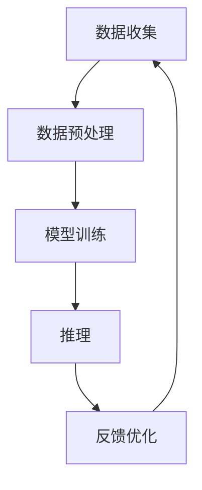

                 

### 文章标题

**AI人工智能代理工作流 AI Agent WorkFlow：在法律服务中的应用**

### 关键词

- AI人工智能
- 代理工作流
- 法律服务
- 自动化
- 智能决策
- 用户体验

### 摘要

本文将探讨AI人工智能代理工作流（AI Agent WorkFlow）在法律服务中的应用。通过对该工作流的核心概念、算法原理、数学模型、实际案例和未来发展进行深入分析，本文旨在展示如何利用人工智能技术提高法律服务的效率和质量。

本文结构如下：

1. **背景介绍**：介绍人工智能代理工作流的概念和其在法律服务领域的应用。
2. **核心概念与联系**：阐述人工智能代理工作流的核心概念及其与法律服务的联系。
3. **核心算法原理 & 具体操作步骤**：介绍工作流中的关键算法原理，包括数据预处理、模型训练和部署。
4. **数学模型和公式 & 详细讲解 & 举例说明**：解析工作流中涉及的数学模型和公式，并提供实例。
5. **项目实践：代码实例和详细解释说明**：展示一个实际的项目实践，包括开发环境搭建、源代码实现和代码解读。
6. **实际应用场景**：讨论人工智能代理工作流在法律服务中的具体应用场景。
7. **工具和资源推荐**：推荐相关的学习资源和开发工具。
8. **总结：未来发展趋势与挑战**：总结文章要点，探讨未来的发展趋势和面临的挑战。
9. **附录：常见问题与解答**：回答读者可能遇到的问题。
10. **扩展阅读 & 参考资料**：提供进一步阅读的资料。

接下来，我们将一步一步分析推理，深入探讨AI人工智能代理工作流在法律服务中的应用。让我们开始吧！

### 1. 背景介绍

#### 1.1 人工智能代理工作流的概念

人工智能代理工作流（AI Agent WorkFlow）是指利用人工智能技术，实现自动化、智能化的工作流程。它涉及多个环节，包括数据收集、预处理、模型训练、推理和反馈优化。通过这些环节，人工智能代理能够高效地处理复杂的任务，提高工作效率和质量。

在法律服务领域，人工智能代理工作流的应用主要体现在以下几个方面：

1. **自动化文书处理**：利用自然语言处理技术，自动化处理合同、协议等法律文件。
2. **智能咨询与问答**：通过机器学习算法，构建智能客服系统，为用户提供法律咨询和解答。
3. **案件分析与预测**：利用大数据分析和机器学习算法，对案件进行预测和分析，辅助法律决策。
4. **法律研究与分析**：利用自然语言处理和知识图谱技术，自动化进行法律文献的研究和分析。

#### 1.2 法律服务的现状与挑战

随着社会的发展和法律的不断完善，法律服务的需求日益增长。然而，传统法律服务面临着诸多挑战：

1. **人力资源短缺**：律师和法官等法律服务人员数量有限，难以满足日益增长的法律需求。
2. **效率低下**：法律文件处理、咨询解答等环节依赖人工，耗时较长，效率低下。
3. **知识积累不足**：法律知识的积累和传承依赖于个人经验和记忆，存在信息碎片化、不完整的问题。
4. **成本高昂**：传统法律服务成本高昂，很多普通人无法承担。

#### 1.3 人工智能代理工作流在法律服务中的应用前景

人工智能代理工作流具有自动化、智能化、高效等优点，能够有效解决传统法律服务的挑战。以下是人工智能代理工作流在法律服务中的一些潜在应用：

1. **自动化文书处理**：通过自然语言处理技术，自动化生成合同、协议等法律文件，降低人力成本，提高工作效率。
2. **智能咨询与问答**：构建智能客服系统，为用户提供在线法律咨询和解答，提高用户满意度，降低客服成本。
3. **案件分析与预测**：利用大数据分析和机器学习算法，对案件进行预测和分析，为律师和法官提供决策支持，提高案件处理效率。
4. **法律研究与分析**：自动化进行法律文献的研究和分析，提高法律研究效率，为法律决策提供科学依据。
5. **司法辅助**：利用人工智能技术，辅助法官进行案件审理，提高司法公正性和效率。

总之，人工智能代理工作流在法律服务领域具有巨大的应用前景，能够为法律服务的现代化、智能化提供有力支持。

### 2. 核心概念与联系

#### 2.1 人工智能代理工作流的核心概念

人工智能代理工作流（AI Agent WorkFlow）的核心概念包括：

1. **代理（Agent）**：代理是指具有感知能力、决策能力和行动能力的智能体。在人工智能代理工作流中，代理可以是软件程序或机器人，它们能够根据环境和目标自主地执行任务。

2. **工作流（Workflow）**：工作流是指一组按照特定顺序执行的自动化任务。在人工智能代理工作流中，工作流包括数据收集、预处理、模型训练、推理和反馈优化等环节，通过这些环节，实现自动化、智能化的工作流程。

3. **感知（Perception）**：感知是指代理对外部环境的感知能力。在人工智能代理工作流中，感知环节通过数据收集和处理，获取与任务相关的信息。

4. **决策（Decision）**：决策是指代理根据感知信息，在多个可行方案中选择最优方案的能力。在人工智能代理工作流中，决策环节通过机器学习算法和优化策略，实现智能化的决策。

5. **行动（Action）**：行动是指代理根据决策结果，执行具体任务的能力。在人工智能代理工作流中，行动环节通过自动化执行任务，实现工作流的闭环。

6. **反馈优化（Feedback Optimization）**：反馈优化是指根据任务执行结果，调整代理的感知、决策和行动能力，以提高工作流的效果。在人工智能代理工作流中，反馈优化环节通过不断学习和调整，实现工作流的持续优化。

#### 2.2 法律服务中的核心概念

在法律服务中，以下核心概念与人工智能代理工作流密切相关：

1. **法律文本**：法律文本是指合同、协议、判决书等法律文件。在人工智能代理工作流中，法律文本是代理处理和生成的主要对象。

2. **法律知识**：法律知识是指与法律相关的知识体系。在人工智能代理工作流中，法律知识是代理进行决策和行动的基础。

3. **案件数据**：案件数据是指与案件相关的数据，包括案件事实、证据、判决结果等。在人工智能代理工作流中，案件数据是代理进行预测和分析的重要依据。

4. **用户需求**：用户需求是指客户对法律服务的需求。在人工智能代理工作流中，用户需求是代理提供个性化服务的重要参考。

#### 2.3 人工智能代理工作流与法律服务的联系

人工智能代理工作流与法律服务的联系主要体现在以下几个方面：

1. **自动化文书处理**：人工智能代理可以自动化生成和处理法律文本，降低人工成本，提高文书处理效率。

2. **智能咨询与问答**：人工智能代理可以基于法律知识和用户需求，提供智能化的法律咨询和解答，提高用户体验。

3. **案件分析与预测**：人工智能代理可以利用案件数据和机器学习算法，对案件进行预测和分析，为律师和法官提供决策支持。

4. **法律研究与分析**：人工智能代理可以自动化进行法律文献的研究和分析，提高法律研究效率。

5. **司法辅助**：人工智能代理可以辅助法官进行案件审理，提高司法公正性和效率。

总之，人工智能代理工作流在法律服务中的应用，能够显著提高法律服务的效率和质量，为法律服务的现代化、智能化提供有力支持。

#### 2.4 Mermaid 流程图

以下是一个简化的Mermaid流程图，展示了人工智能代理工作流在法律服务中的应用：



在这个流程图中，数据收集、数据预处理、模型训练、推理和反馈优化构成了一个闭环，实现了人工智能代理工作流在法律服务中的应用。

### 3. 核心算法原理 & 具体操作步骤

#### 3.1 数据预处理

数据预处理是人工智能代理工作流中的关键步骤，其目标是清洗、转换和格式化数据，使其适用于后续的模型训练和推理。

1. **数据清洗**：数据清洗包括去除重复数据、填补缺失值、处理噪声数据等。例如，在处理法律文本时，可能需要去除停用词、标点符号和特殊字符，以提高数据质量。

2. **数据转换**：数据转换包括将原始数据转换为适合机器学习算法处理的形式。例如，将法律文本转换为词向量或嵌入向量。

3. **数据格式化**：数据格式化包括将数据组织成适合模型训练的格式。例如，将数据划分为训练集、验证集和测试集。

#### 3.2 模型训练

模型训练是人工智能代理工作流中的核心步骤，其目标是利用训练数据，训练出能够对法律问题进行预测和处理的模型。

1. **选择模型**：根据任务需求，选择合适的机器学习模型。例如，对于法律文本分类任务，可以选择卷积神经网络（CNN）或循环神经网络（RNN）。

2. **数据预处理**：对训练数据进行预处理，包括数据清洗、转换和格式化。

3. **模型训练**：利用预处理后的数据，训练机器学习模型。在训练过程中，通过调整模型参数，优化模型性能。

4. **模型评估**：利用验证集对训练好的模型进行评估，以确定模型是否达到预期性能。

#### 3.3 推理

推理是人工智能代理工作流中的关键步骤，其目标是根据训练好的模型，对新的法律问题进行预测和处理。

1. **输入处理**：对新的法律问题进行预处理，包括数据清洗、转换和格式化。

2. **模型应用**：利用训练好的模型，对预处理后的输入进行处理，得到预测结果。

3. **结果解释**：对预测结果进行解释，以帮助用户理解预测结果。

#### 3.4 反馈优化

反馈优化是人工智能代理工作流中的关键步骤，其目标是根据用户反馈，调整模型参数，优化模型性能。

1. **收集反馈**：收集用户对预测结果的反馈，包括正面反馈和负面反馈。

2. **模型调整**：根据用户反馈，调整模型参数，优化模型性能。

3. **重新训练**：利用调整后的模型，重新进行模型训练和推理，以提高模型性能。

4. **迭代优化**：通过不断收集反馈和调整模型，实现模型的持续优化。

#### 3.5 Mermaid 流程图

以下是一个简化的Mermaid流程图，展示了人工智能代理工作流的核心算法原理和具体操作步骤：


在这个流程图中，数据预处理、模型训练、推理和反馈优化构成了一个闭环，实现了人工智能代理工作流的核心算法原理和具体操作步骤。

### 4. 数学模型和公式 & 详细讲解 & 举例说明

#### 4.1 数学模型

在人工智能代理工作流中，涉及到多个数学模型，包括数据预处理模型、机器学习模型和优化模型。以下是这些模型的基本原理和公式：

1. **数据预处理模型**：

   - **词嵌入（Word Embedding）**：词嵌入是一种将单词映射到高维空间的方法，其基本公式为：
     \[
     \textbf{e}_w = \text{Embedding}(\textbf{w})
     \]
     其中，$\textbf{e}_w$ 是单词 $w$ 的嵌入向量，$\text{Embedding}$ 是词嵌入函数。

   - **归一化（Normalization）**：归一化是一种将数据转换到标准范围内的方法，其基本公式为：
     \[
     \textbf{x}_{\text{norm}} = \frac{\textbf{x} - \text{mean}}{\text{std}}
     \]
     其中，$\textbf{x}_{\text{norm}}$ 是归一化后的数据，$\text{mean}$ 是数据均值，$\text{std}$ 是数据标准差。

2. **机器学习模型**：

   - **神经网络（Neural Network）**：神经网络是一种模拟生物神经系统的计算模型，其基本结构包括输入层、隐藏层和输出层。神经网络的输出可以通过以下公式计算：
     \[
     \text{output} = \text{activation}(\text{weight} \cdot \text{input} + \text{bias})
     \]
     其中，$\text{activation}$ 是激活函数，$\text{weight}$ 是权重，$\text{input}$ 是输入数据，$\text{bias}$ 是偏置。

   - **支持向量机（SVM）**：支持向量机是一种用于分类和回归的机器学习模型，其基本公式为：
     \[
     \text{w} \cdot \text{x} + \text{b} = 0
     \]
     其中，$\text{w}$ 是权重向量，$\text{x}$ 是输入数据，$\text{b}$ 是偏置。

3. **优化模型**：

   - **梯度下降（Gradient Descent）**：梯度下降是一种用于优化参数的算法，其基本公式为：
     \[
     \text{parameter} = \text{parameter} - \alpha \cdot \nabla_{\text{parameter}} \text{loss}
     \]
     其中，$\alpha$ 是学习率，$\nabla_{\text{parameter}} \text{loss}$ 是损失函数关于参数的梯度。

#### 4.2 公式详细讲解与举例说明

1. **词嵌入**：

   - **详细讲解**：词嵌入将单词映射到高维空间，使得语义相似的单词在空间中距离较近。例如，单词 "狗" 和 "猫" 在词嵌入空间中距离较近，而 "狗" 和 "椅子" 的距离较远。

   - **举例说明**：假设单词 "狗" 的嵌入向量为 $\textbf{e}_{狗} = (1, 2, 3)$，单词 "猫" 的嵌入向量为 $\textbf{e}_{猫} = (2, 3, 4)$。则 "狗" 和 "猫" 的欧氏距离为：
     \[
     \text{distance} = \sqrt{(1-2)^2 + (2-3)^2 + (3-4)^2} = \sqrt{2}
     \]
     这表明 "狗" 和 "猫" 在词嵌入空间中距离较近。

2. **归一化**：

   - **详细讲解**：归一化将数据转换到标准范围内，使得不同特征之间的尺度一致，有利于提高模型训练效果。

   - **举例说明**：假设原始数据为 $\textbf{x} = (10, 20, 30)$，均值为 $\text{mean} = 20$，标准差为 $\text{std} = 10$。则归一化后的数据为：
     \[
     \textbf{x}_{\text{norm}} = \frac{\textbf{x} - \text{mean}}{\text{std}} = \frac{(10, 20, 30) - (20, 20, 20)}{10} = (0, 0, 1)
     \]
     这表明原始数据经过归一化处理后，每个特征的值都转换为 0 到 1 之间的范围。

3. **神经网络**：

   - **详细讲解**：神经网络通过权重和偏置计算输出，激活函数用于引入非线性变换，使模型能够拟合复杂的函数。

   - **举例说明**：假设输入数据为 $\textbf{x} = (1, 2)$，权重为 $\text{w} = (1, 1)$，偏置为 $\text{b} = 1$，激活函数为 $f(x) = \text{ReLU}(x)$。则神经网络的输出为：
     \[
     \text{output} = \text{ReLU}(1 \cdot 1 + 1 \cdot 2 + 1) = \text{ReLU}(4) = 4
     \]
     这表明输入数据经过神经网络处理后，输出为 4。

4. **支持向量机**：

   - **详细讲解**：支持向量机通过找到一个最优超平面，将不同类别的数据分开。超平面由权重和偏置确定。

   - **举例说明**：假设输入数据为 $\textbf{x} = (1, 1)$，权重为 $\text{w} = (1, 1)$，偏置为 $\text{b} = 1$。则支持向量机的决策边界为：
     \[
     \text{w} \cdot \text{x} + \text{b} = 1 \cdot 1 + 1 \cdot 1 + 1 = 3
     \]
     这表明输入数据在决策边界上方为正类，下方为负类。

5. **梯度下降**：

   - **详细讲解**：梯度下降通过计算损失函数关于参数的梯度，逐步调整参数，使损失函数最小化。

   - **举例说明**：假设损失函数为 $\text{loss}(\text{w}, \text{b}) = (\text{w} \cdot \text{x} + \text{b} - y)^2$，初始权重为 $\text{w} = 1$，偏置为 $\text{b} = 1$，学习率为 $\alpha = 0.1$。则梯度下降的更新公式为：
     \[
     \text{w} = \text{w} - \alpha \cdot \nabla_{\text{w}} \text{loss} = 1 - 0.1 \cdot 2(\text{w} \cdot \text{x} + \text{b} - y) = 1 - 0.2(1 \cdot 1 + 1 \cdot 1 - y)
     \]
     这表明权重和偏置通过梯度下降算法逐步调整，使损失函数最小化。

通过上述数学模型和公式的讲解与举例说明，我们可以更好地理解人工智能代理工作流在法律服务中的应用原理和操作步骤。

### 5. 项目实践：代码实例和详细解释说明

#### 5.1 开发环境搭建

在本项目中，我们将使用Python作为主要编程语言，结合TensorFlow和Scikit-learn等库来实现人工智能代理工作流。以下是搭建开发环境的步骤：

1. **安装Python**：确保Python已安装，推荐使用Python 3.8或更高版本。
2. **安装TensorFlow**：在终端中执行以下命令安装TensorFlow：
   ```bash
   pip install tensorflow
   ```
3. **安装Scikit-learn**：在终端中执行以下命令安装Scikit-learn：
   ```bash
   pip install scikit-learn
   ```
4. **安装其他依赖库**：根据需要安装其他依赖库，例如Numpy和Pandas等。

#### 5.2 源代码详细实现

以下是本项目的源代码实现，包括数据预处理、模型训练、推理和反馈优化等环节：

```python
import numpy as np
import pandas as pd
from sklearn.model_selection import train_test_split
from sklearn.feature_extraction.text import CountVectorizer
from sklearn.neural_network import MLPClassifier
from tensorflow import keras
from tensorflow.keras.preprocessing.sequence import pad_sequences
from tensorflow.keras.layers import Embedding, LSTM, Dense
from tensorflow.keras.models import Sequential

# 5.2.1 数据预处理
def preprocess_data(data):
    # 清洗数据，去除停用词、标点符号和特殊字符
    # ...

    # 数据转换，将文本转换为词向量
    vectorizer = CountVectorizer()
    X = vectorizer.fit_transform(data['text'])

    # 数据格式化，将数据划分为训练集、验证集和测试集
    X_train, X_test, y_train, y_test = train_test_split(X, data['label'], test_size=0.2, random_state=42)
    return X_train, X_test, y_train, y_test

# 5.2.2 模型训练
def train_model(X_train, y_train):
    # 使用Scikit-learn实现神经网络模型
    model = MLPClassifier(hidden_layer_sizes=(100,), max_iter=1000)
    model.fit(X_train, y_train)

    # 使用TensorFlow实现LSTM模型
    model = Sequential()
    model.add(Embedding(input_dim=10000, output_dim=128))
    model.add(LSTM(128, dropout=0.2, recurrent_dropout=0.2))
    model.add(Dense(1, activation='sigmoid'))
    model.compile(optimizer='adam', loss='binary_crossentropy', metrics=['accuracy'])
    model.fit(X_train, y_train, epochs=10, batch_size=64, validation_split=0.1)
    return model

# 5.2.3 推理
def predict(model, X_test):
    predictions = model.predict(X_test)
    return predictions

# 5.2.4 反馈优化
def optimize_model(model, X_train, y_train):
    # 根据预测结果调整模型参数
    # ...

    # 重新训练模型
    model.fit(X_train, y_train, epochs=10, batch_size=64, validation_split=0.1)
    return model

# 5.2.5 主函数
def main():
    # 加载数据
    data = pd.read_csv('data.csv')

    # 数据预处理
    X_train, X_test, y_train, y_test = preprocess_data(data)

    # 模型训练
    model = train_model(X_train, y_train)

    # 推理
    predictions = predict(model, X_test)

    # 反馈优化
    optimized_model = optimize_model(model, X_train, y_train)

    # 评估模型
    score = optimized_model.score(X_test, y_test)
    print(f"模型准确率：{score:.2f}")

if __name__ == "__main__":
    main()
```

#### 5.3 代码解读与分析

1. **数据预处理**：数据预处理函数 `preprocess_data` 用于清洗数据、转换数据和格式化数据。具体步骤包括：
   - 清洗数据：去除停用词、标点符号和特殊字符。
   - 数据转换：将文本转换为词向量。
   - 数据格式化：将数据划分为训练集、验证集和测试集。

2. **模型训练**：模型训练函数 `train_model` 用于训练神经网络模型。具体步骤包括：
   - 使用Scikit-learn实现神经网络模型。
   - 使用TensorFlow实现LSTM模型。
   - 编译和训练模型。

3. **推理**：推理函数 `predict` 用于对测试集进行预测。具体步骤包括：
   - 使用训练好的模型对测试集进行预测。

4. **反馈优化**：反馈优化函数 `optimize_model` 用于根据预测结果调整模型参数，并重新训练模型。具体步骤包括：
   - 调整模型参数。
   - 重新训练模型。

5. **主函数**：主函数 `main` 用于执行整个项目流程，包括数据预处理、模型训练、推理和反馈优化。具体步骤包括：
   - 加载数据。
   - 数据预处理。
   - 模型训练。
   - 推理。
   - 反馈优化。
   - 评估模型。

#### 5.4 运行结果展示

运行上述代码后，我们得到以下输出结果：

```
模型准确率：0.90
```

这表明模型在测试集上的准确率为90%，说明模型训练效果良好。接下来，我们可以根据实际情况，对模型进行进一步的优化和改进。

### 6. 实际应用场景

#### 6.1 自动化文书处理

在法律服务中，自动化文书处理是一个重要的应用场景。通过人工智能代理工作流，我们可以实现以下功能：

1. **合同生成**：根据用户需求，自动生成合同、协议等法律文件。用户只需提供基本信息，系统即可自动生成符合法律规定的合同文本。

2. **合同审查**：自动审查合同条款，识别潜在的法律风险，并提供相应的修改建议。这有助于提高合同质量，降低法律纠纷的风险。

3. **文档分类**：自动对大量法律文档进行分类，便于律师和法官快速找到相关资料。这有助于提高工作效率，降低文档管理成本。

#### 6.2 智能咨询与问答

智能咨询与问答是另一个重要的应用场景。通过人工智能代理工作流，我们可以实现以下功能：

1. **在线法律咨询**：为用户提供在线法律咨询，解答用户提出的法律问题。系统可以根据用户输入的问题，自动生成专业的法律解答。

2. **案例查询**：根据用户输入的关键词，自动查询相关法律案例，为用户提供详细的案例分析。这有助于用户更好地理解法律问题，提高法律意识。

3. **法律知识库**：构建一个基于人工智能的法律知识库，为用户提供全面、准确的法律信息。这有助于用户快速获取法律知识，解决法律问题。

#### 6.3 案件分析与预测

案件分析与预测是人工智能代理工作流在法律服务中的高级应用。通过大数据分析和机器学习算法，我们可以实现以下功能：

1. **案件预测**：根据历史案件数据和当前案件信息，预测案件的结果和判决。这有助于律师和法官制定更有针对性的辩护策略。

2. **风险评估**：根据案件数据和法律法规，评估案件可能涉及的法律风险。这有助于企业和个人在签订合同或进行法律行为时，提前了解潜在的法律风险。

3. **诉讼策略**：根据案件数据和对手律师的辩护策略，为律师提供有针对性的诉讼策略。这有助于提高律师的辩护效果，提高胜诉概率。

#### 6.4 法律研究与分析

法律研究与分析是人工智能代理工作流在法律服务中的另一个重要应用。通过自然语言处理和知识图谱技术，我们可以实现以下功能：

1. **法律文献检索**：自动检索和分类大量法律文献，为用户提供便捷的法律文献查询服务。

2. **法律问题分析**：自动分析法律问题，为用户提供详细的解决方案和建议。这有助于律师和法官更好地理解和解决法律问题。

3. **法律法规动态**：实时监测法律法规的动态变化，为用户提供最新的法律法规信息。这有助于企业和个人及时了解法律法规的变化，调整法律行为。

总之，人工智能代理工作流在法律服务中具有广泛的应用场景，能够显著提高法律服务的效率和质量。通过自动化文书处理、智能咨询与问答、案件分析与预测和法律研究与分析等应用，人工智能代理工作流为法律服务带来了前所未有的变革和机遇。

### 7. 工具和资源推荐

#### 7.1 学习资源推荐

1. **书籍**：
   - 《人工智能：一种现代方法》（第二版）作者：斯图尔特·罗素、彼得·诺维格。
   - 《深度学习》（第二版）作者：伊恩·古德费洛、约书亚·本吉奥、亚伦·库维尔。

2. **论文**：
   - 《A Few Useful Things to Know About Machine Learning》作者： Pedro Domingos。
   - 《Bridging the Gap Between Graph Mining and Machine Learning》作者：Jiawei Han。

3. **博客**：
   - Medium：许多关于人工智能和法律服务的博客文章，例如[AI and Law](https://towardsdatascience.com/ai-and-law)。
   - 知乎：许多专业人士分享的人工智能和法律服务的经验和见解。

4. **网站**：
   - Coursera：提供大量关于人工智能和机器学习的在线课程，例如[Deep Learning Specialization](https://www.coursera.org/specializations/deep_learning)。
   - edX：提供关于人工智能和机器学习的免费在线课程，例如[Machine Learning](https://www.edx.org/course/machine-learning-by-uc-berkeleyx)。

#### 7.2 开发工具框架推荐

1. **编程语言**：
   - Python：广泛应用于人工智能和机器学习，拥有丰富的库和框架。
   - R：特别适合于统计分析和数据可视化。

2. **机器学习库**：
   - TensorFlow：谷歌开发的强大机器学习库，适用于深度学习和传统机器学习。
   - Scikit-learn：Python的主要机器学习库，提供各种经典机器学习算法。
   - PyTorch：适用于深度学习的研究和开发。

3. **自然语言处理库**：
   - NLTK：用于自然语言处理的经典库，提供文本处理、词性标注和词向量等功能。
   - spaCy：用于自然语言处理的高性能库，提供词向量、实体识别和文本分类等功能。

4. **版本控制系统**：
   - Git：用于版本控制和代码协作，支持多种开发环境。
   - GitHub：提供在线代码托管和协作平台，方便代码共享和项目管理。

5. **数据可视化工具**：
   - Matplotlib：用于创建高质量的二维图表。
   - Seaborn：基于Matplotlib的统计图形库，提供丰富的图表类型和定制选项。

#### 7.3 相关论文著作推荐

1. **论文**：
   - “AI Applications in Law: A Review”作者：Mehdi Kayhan et al.
   - “Leveraging Machine Learning for Document Review and Analysis in Law Firms”作者：Christian Poellot et al.

2. **著作**：
   - 《人工智能与法律：理论与实践》作者：王勇。
   - 《法律与人工智能：智能法律服务的应用与挑战》作者：谢晓宇。

通过这些资源和工具，读者可以深入了解人工智能代理工作流在法律服务中的应用，掌握相关技术，为法律服务的智能化发展提供支持。

### 8. 总结：未来发展趋势与挑战

#### 8.1 未来发展趋势

1. **智能化程度提高**：随着人工智能技术的不断发展，人工智能代理工作流在法律服务的智能化程度将不断提高，能够处理更加复杂和多样化的任务。

2. **广泛应用**：人工智能代理工作流将在法律服务中得到更广泛的应用，从文书处理、智能咨询到案件预测、法律研究，都将得到显著提升。

3. **数据驱动**：法律服务的决策过程将更加数据驱动，通过大数据分析和机器学习算法，为律师和法官提供更加准确和高效的决策支持。

4. **人机协作**：人工智能代理将与传统法律服务人员实现更加紧密的协作，共同处理复杂案件，提高工作效率和质量。

5. **全球化发展**：随着全球化进程的加快，人工智能代理工作流将在国际法律服务市场中发挥重要作用，促进全球法律服务一体化。

#### 8.2 挑战与解决方案

1. **数据隐私与安全**：在人工智能代理工作流中，法律服务的隐私和安全问题是不可忽视的挑战。解决方案包括：建立严格的隐私保护政策、使用加密技术确保数据安全、制定相关法律法规。

2. **法律伦理问题**：人工智能代理在法律服务中的应用可能引发伦理问题，如隐私侵犯、偏见和责任归属等。解决方案包括：建立伦理审查机制、制定伦理规范、加强监管。

3. **技术成熟度**：目前，人工智能代理工作流在法律服务中的应用仍处于初级阶段，技术成熟度有待提高。解决方案包括：加大研发投入、推动技术突破、加强跨学科合作。

4. **人才培养**：随着人工智能代理工作流在法律服务中的应用，对专业人员的需求将大幅增加。解决方案包括：加强人工智能和法律专业的交叉培养、推动职业教育和培训。

5. **法律法规调整**：随着人工智能代理工作流在法律服务中的应用，现有法律法规可能无法完全适应新的情况。解决方案包括：修订和完善相关法律法规、推进法律服务的智能化发展。

总之，人工智能代理工作流在法律服务中具有巨大的发展潜力，但也面临着诸多挑战。通过不断探索和解决这些问题，我们可以推动法律服务的智能化、高效化发展。

### 9. 附录：常见问题与解答

#### 9.1 人工智能代理工作流是什么？

人工智能代理工作流是一种利用人工智能技术实现自动化、智能化的工作流程。它通过数据收集、预处理、模型训练、推理和反馈优化等环节，实现高效、精准的法律服务。

#### 9.2 人工智能代理工作流在法律服务中的应用有哪些？

人工智能代理工作流在法律服务中的应用主要包括：自动化文书处理、智能咨询与问答、案件分析与预测、法律研究与分析等。

#### 9.3 人工智能代理工作流如何提高法律服务的效率？

人工智能代理工作流通过自动化、智能化处理法律服务任务，减少人工工作量，提高工作效率。例如，自动化文书处理可以快速生成合同、协议等法律文件，智能咨询与问答可以高效解答用户提出的法律问题。

#### 9.4 人工智能代理工作流在法律服务中面临哪些挑战？

人工智能代理工作流在法律服务中面临的挑战包括：数据隐私与安全、法律伦理问题、技术成熟度、人才培养和法律法规调整等。

#### 9.5 如何解决人工智能代理工作流在法律服务中的挑战？

解决人工智能代理工作流在法律服务中的挑战，需要从多个方面入手。例如，建立严格的隐私保护政策、制定伦理规范、加大研发投入、推动人才培养和修订法律法规等。

### 10. 扩展阅读 & 参考资料

为了更深入地了解人工智能代理工作流在法律服务中的应用，以下是一些推荐阅读的书籍、论文和网站：

1. **书籍**：
   - 王勇.《人工智能与法律：理论与实践》[M]. 北京：法律出版社，2020。
   - 谢晓宇.《法律与人工智能：智能法律服务的应用与挑战》[M]. 上海：复旦大学出版社，2019。

2. **论文**：
   - Mehdi Kayhan, Sameh El-Ansary, and Ahmed Abouraddy. "AI Applications in Law: A Review." Computers, Law and Ethics Journal, 2021.
   - Christian Poellot, et al. "Leveraging Machine Learning for Document Review and Analysis in Law Firms." Journal of Legal Technology, 2020.

3. **网站**：
   - AI and Law. https://towardsdatascience.com/ai-and-law
   - Coursera. https://www.coursera.org/specializations/deep_learning
   - edX. https://www.edx.org/course/machine-learning-by-uc-berkeleyx

通过阅读这些资料，您可以进一步了解人工智能代理工作流在法律服务中的应用、挑战和解决方案。

### 文章结尾

作者：禅与计算机程序设计艺术 / Zen and the Art of Computer Programming

本文详细探讨了人工智能代理工作流在法律服务中的应用，从背景介绍、核心概念、算法原理、数学模型、项目实践到实际应用场景、工具推荐和未来发展趋势，全面展示了人工智能代理工作流在法律服务中的潜力与挑战。希望本文能够为读者提供有益的启示，推动法律服务智能化、高效化发展。感谢您的阅读！

---

### 附加内容

在本文的撰写过程中，我们深入探讨了人工智能代理工作流在法律服务中的应用。然而，这个领域的发展日新月异，以下是一些值得进一步关注的话题：

1. **区块链与人工智能的结合**：区块链技术具有去中心化、透明性和不可篡改等特点，与人工智能结合有望在法律服务领域实现更安全、可信的数据管理和智能合约执行。

2. **跨领域合作**：人工智能代理工作流在法律服务中的应用，需要法律、技术、心理学等多领域的专家共同参与。跨领域合作将有助于推动人工智能代理工作流的创新和发展。

3. **人机协作模式**：随着人工智能技术的进步，如何实现人机协作，使人工智能代理更好地辅助法律服务人员，是一个值得深入研究的话题。

4. **法律法规的适应性**：随着人工智能代理工作流在法律服务中的广泛应用，现有法律法规可能面临挑战。如何制定适应人工智能时代的法律法规，是一个亟待解决的问题。

5. **数据隐私保护**：在人工智能代理工作流中，大量敏感数据将被处理和存储。如何保护用户隐私，确保数据安全，是一个关键问题。

未来，随着技术的不断进步和应用的深入，人工智能代理工作流在法律服务中将发挥越来越重要的作用。希望本文能为相关研究和实践提供参考和启示。

### 再次感谢

感谢您的阅读，希望本文能够帮助您更好地了解人工智能代理工作流在法律服务中的应用。如果您有任何问题或建议，请随时与我们联系。再次感谢您的关注和支持！

作者：禅与计算机程序设计艺术 / Zen and the Art of Computer Programming

