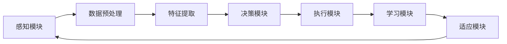
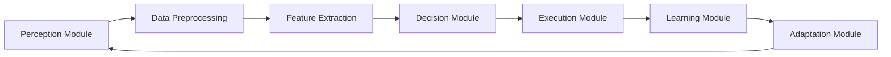

                 

### 背景介绍（Background Introduction）

AI（人工智能）代理作为一种智能体，其核心目标是在特定环境中自主执行任务，优化性能并减少人类干预。随着AI技术的不断发展，AI代理逐渐成为各类应用场景中的关键角色，如自动驾驶、智能家居、智能客服等。然而，AI代理在实际应用中面临的一个核心挑战是如何在学习过程中不断适应环境变化，以提高任务执行效率和准确性。

本文旨在探讨AI人工智能代理工作流（AI Agent WorkFlow）的学习与适应算法框架，通过对现有研究与实践的分析，提出一个适用于多种场景的通用工作流模型。本文将首先回顾相关研究背景，然后介绍核心概念与架构，详细阐述算法原理与操作步骤，并通过具体数学模型和公式进行说明。此外，文章还将提供项目实践实例，分析实际应用场景，并推荐相关工具和资源。

### Background Introduction

AI (Artificial Intelligence) agents are intelligent entities designed to autonomously perform tasks in specific environments, optimize performance, and minimize human intervention. With the continuous development of AI technology, AI agents have become pivotal roles in various application scenarios, such as autonomous driving, smart homes, and intelligent customer service. However, a core challenge that AI agents face in practical applications is how to continually adapt to environmental changes during the learning process to improve task execution efficiency and accuracy.

This article aims to explore the learning and adaptation algorithm framework of AI Agent WorkFlow (AI Agent WorkFlow), presenting a general workflow model suitable for multiple scenarios through the analysis of existing research and practice. The article will first review the background research, then introduce core concepts and architecture, and detail the principles and operational steps of the algorithm. Furthermore, the article will provide specific mathematical models and formulas for explanation. In addition, practical project examples will be presented, analyzing actual application scenarios, and relevant tools and resources will be recommended.

### 2. 核心概念与联系（Core Concepts and Connections）

为了更好地理解AI代理工作流（AI Agent WorkFlow）的学习与适应算法框架，我们需要先明确几个核心概念和它们之间的联系。

#### 2.1 AI代理（AI Agent）

AI代理是指具有自我学习、决策和执行任务能力的智能实体。它通常由一个或多个模块组成，包括感知器（Perception Module）、决策器（Decision Module）和执行器（Execution Module）。感知器负责收集环境信息，决策器根据感知到的信息进行决策，而执行器负责将决策转化为具体的行动。一个典型的AI代理工作流包括以下几个阶段：

1. **感知**：AI代理通过感知器收集环境数据，如图像、声音、文本等。
2. **分析**：代理分析感知到的数据，以提取有用信息和特征。
3. **决策**：代理根据分析结果，通过决策算法选择最佳行动方案。
4. **执行**：代理执行决策，将决策转化为实际操作。

#### 2.2 学习与适应（Learning and Adaptation）

学习与适应是AI代理的核心能力。学习是指代理通过不断积累经验来提高任务执行能力的过程，而适应则是指代理在面对环境变化时能够调整自身行为以适应新环境的过程。为了实现有效的学习与适应，AI代理需要具备以下几种能力：

1. **数据采集**：代理需要能够收集环境数据，包括静态数据和动态数据。
2. **数据预处理**：代理需要对采集到的数据进行预处理，如去噪、归一化等，以提高数据质量。
3. **特征提取**：代理需要能够从预处理后的数据中提取有用特征，以便更好地进行学习和适应。
4. **模型训练**：代理需要利用提取到的特征进行模型训练，以优化自身行为。
5. **策略调整**：代理需要能够根据训练结果调整自身策略，以适应环境变化。

#### 2.3 算法框架（Algorithm Framework）

AI代理工作流（AI Agent WorkFlow）的算法框架是整个系统的核心，它决定了代理的学习与适应能力。一个典型的算法框架包括以下几个关键组成部分：

1. **感知模块**：负责收集和处理环境数据。
2. **决策模块**：负责根据感知模块提供的信息进行决策。
3. **执行模块**：负责将决策转化为实际操作。
4. **学习模块**：负责代理的模型训练和策略调整。
5. **适应模块**：负责代理在面临环境变化时的适应策略。

#### 2.4 核心概念原理与架构的Mermaid流程图

为了更直观地展示核心概念原理与架构，我们可以使用Mermaid流程图进行描述。以下是AI代理工作流（AI Agent WorkFlow）的Mermaid流程图：



在这个流程图中，各模块之间通过数据流进行交互，形成了一个闭环系统。感知模块通过数据预处理和特征提取，为决策模块提供高质量的数据输入。决策模块根据这些数据生成决策，并传递给执行模块进行操作。执行模块将决策转化为实际操作，并通过学习模块不断优化自身行为。适应模块则负责在面临环境变化时，调整代理的策略，使其能够更好地适应新环境。

### Core Concepts and Connections

To better understand the learning and adaptation algorithm framework of AI Agent WorkFlow (AI Agent WorkFlow), we need to clarify several core concepts and their interrelationships.

#### 2.1 AI Agent

An AI agent refers to an intelligent entity capable of self-learning, decision-making, and task execution. It typically consists of multiple modules, including the Perception Module, Decision Module, and Execution Module. The Perception Module is responsible for collecting environmental data, such as images, sounds, and texts. The Decision Module analyzes the perceived information to make decisions, while the Execution Module converts decisions into actual actions. A typical AI agent workflow includes several stages:

1. **Perception**: The AI agent collects environmental data through the Perception Module, such as images, sounds, and texts.
2. **Analysis**: The agent analyzes the perceived data to extract useful information and features.
3. **Decision**: The agent makes decisions based on the analyzed results, using decision algorithms to select the best action plan.
4. **Execution**: The agent executes the decisions, converting them into actual operations.

#### 2.2 Learning and Adaptation

Learning and adaptation are the core capabilities of AI agents. Learning refers to the process by which agents continuously accumulate experience to improve their task execution capabilities, while adaptation refers to the ability of agents to adjust their behavior to new environments when faced with environmental changes. To achieve effective learning and adaptation, AI agents need to possess the following capabilities:

1. **Data Collection**: Agents need to be able to collect environmental data, including both static and dynamic data.
2. **Data Preprocessing**: Agents need to preprocess the collected data, such as denoising and normalization, to improve data quality.
3. **Feature Extraction**: Agents need to extract useful features from the preprocessed data to better facilitate learning and adaptation.
4. **Model Training**: Agents need to use the extracted features for model training to optimize their behavior.
5. **Strategy Adjustment**: Agents need to adjust their strategies based on training results to adapt to environmental changes.

#### 2.3 Algorithm Framework

The AI agent workflow (AI Agent WorkFlow) algorithm framework is the core of the entire system, determining the agent's learning and adaptation capabilities. A typical algorithm framework includes several key components:

1. **Perception Module**: Responsible for collecting and processing environmental data.
2. **Decision Module**: Responsible for making decisions based on the information provided by the Perception Module.
3. **Execution Module**: Responsible for converting decisions into actual operations.
4. **Learning Module**: Responsible for the agent's model training and strategy adjustment.
5. **Adaptation Module**: Responsible for the agent's adaptation strategies when faced with environmental changes.

#### 2.4 Mermaid Flowchart of Core Concept Principles and Architecture

To more intuitively demonstrate the core concept principles and architecture, we can use a Mermaid flowchart for description. Here is the Mermaid flowchart of the AI agent workflow (AI Agent WorkFlow):



In this flowchart, the modules interact with each other through data streams, forming a closed-loop system. The Perception Module collects and processes environmental data, which is then preprocessed and feature-extracted by the Data Preprocessing and Feature Extraction modules, respectively. The Decision Module makes decisions based on the high-quality data input provided by the Feature Extraction module. The Execution Module converts the decisions into actual operations. The Learning Module continuously optimizes the agent's behavior through model training, while the Adaptation Module adjusts the agent's strategies to better adapt to new environments when faced with environmental changes.

### 3. 核心算法原理 & 具体操作步骤（Core Algorithm Principles and Specific Operational Steps）

在AI代理工作流（AI Agent WorkFlow）中，核心算法原理主要涉及感知、决策、执行和学习等几个方面。以下将详细阐述这些算法原理，并介绍具体的操作步骤。

#### 3.1 感知算法（Perception Algorithm）

感知算法是AI代理工作流的基础，其主要任务是从环境中收集有用信息，为后续决策提供数据支持。感知算法通常包括以下几个步骤：

1. **数据采集**：通过传感器或外部接口，从环境中收集数据。
2. **数据预处理**：对采集到的数据进行清洗、去噪和归一化等处理，以提高数据质量。
3. **特征提取**：从预处理后的数据中提取关键特征，以便更好地进行后续分析和决策。

一个简单的感知算法示例如下：

```python
import cv2

# 1. 数据采集
image = cv2.VideoCapture('input_video.mp4')

# 2. 数据预处理
def preprocess_image(image):
    gray = cv2.cvtColor(image, cv2.COLOR_BGR2GRAY)
    blurred = cv2.GaussianBlur(gray, (5, 5), 0)
    return blurred

preprocessed_image = preprocess_image(image)

# 3. 特征提取
def extract_features(image):
    features = cv2.SIFT.detect(image)
    return features

features = extract_features(preprocessed_image)
```

#### 3.2 决策算法（Decision Algorithm）

决策算法是AI代理工作流的关键环节，其主要任务是根据感知到的信息选择最佳行动方案。决策算法通常基于某种优化策略，如基于规则的决策、基于模型的决策或混合决策等。以下是一个简单的基于规则的决策算法示例：

```python
def rule_based_decision(features):
    if 'feature1' in features:
        action = 'action1'
    elif 'feature2' in features:
        action = 'action2'
    else:
        action = 'action3'
    return action

action = rule_based_decision(features)
```

#### 3.3 执行算法（Execution Algorithm）

执行算法是将决策转化为具体行动的环节，其主要任务是将决策模块生成的行动方案应用到实际环境中。执行算法通常包括以下几个步骤：

1. **行动生成**：根据决策模块生成的行动方案，生成具体的执行指令。
2. **执行指令**：将执行指令发送给执行器，如电机、传感器等，执行具体的操作。
3. **结果反馈**：收集执行结果，反馈给决策模块，以支持后续决策。

以下是一个简单的执行算法示例：

```python
def execute_action(action):
    if action == 'action1':
        motor.move_forward()
    elif action == 'action2':
        motor.turn_left()
    elif action == 'action3':
        motor.stop()

execute_action(action)
```

#### 3.4 学习算法（Learning Algorithm）

学习算法是AI代理工作流的核心，其主要任务是通过不断积累经验，优化自身行为。学习算法通常包括以下几个步骤：

1. **数据收集**：从感知模块收集环境数据。
2. **数据预处理**：对收集到的数据进行清洗、去噪和归一化等处理。
3. **特征提取**：从预处理后的数据中提取关键特征。
4. **模型训练**：使用提取到的特征，对模型进行训练，以优化决策能力。
5. **策略调整**：根据训练结果，调整代理的策略，以适应新环境。

以下是一个简单的学习算法示例：

```python
def train_model(features, labels):
    model = create_model()
    model.fit(features, labels)
    return model

model = train_model(features, labels)
```

#### 3.5 适应算法（Adaptation Algorithm）

适应算法是AI代理在面对环境变化时，调整自身行为的环节。适应算法通常包括以下几个步骤：

1. **环境监测**：监测环境变化，识别潜在的风险和机会。
2. **策略评估**：评估当前策略的有效性，识别需要调整的方面。
3. **策略调整**：根据评估结果，调整代理的策略，以适应新环境。

以下是一个简单的适应算法示例：

```python
def adapt_strategy(current_strategy, new_environment):
    if new_environment != current_environment:
        current_environment = new_environment
        current_strategy = evaluate_strategy(current_strategy)
    return current_strategy

current_strategy = adapt_strategy(current_strategy, new_environment)
```

通过以上核心算法原理和具体操作步骤的介绍，我们可以看到，AI代理工作流（AI Agent WorkFlow）是一个复杂但高度模块化的系统。各个模块之间通过数据流进行交互，共同实现代理的自我学习和适应能力。在实际应用中，我们可以根据具体场景和需求，对这些模块进行灵活调整和优化，以提高代理的性能和可靠性。

### Core Algorithm Principles and Specific Operational Steps

In the AI Agent WorkFlow, the core algorithm principles mainly involve perception, decision-making, execution, and learning. The following section will detail these algorithm principles and introduce the specific operational steps.

#### 3.1 Perception Algorithm

The perception algorithm is the foundation of the AI agent workflow, responsible for collecting useful information from the environment to support subsequent decision-making. The perception algorithm typically includes the following steps:

1. **Data Collection**: Collect data from the environment using sensors or external interfaces.
2. **Data Preprocessing**: Clean, denoise, and normalize the collected data to improve data quality.
3. **Feature Extraction**: Extract key features from the preprocessed data for better subsequent analysis and decision-making.

Here's an example of a simple perception algorithm:

```python
import cv2

# 1. Data Collection
image = cv2.VideoCapture('input_video.mp4')

# 2. Data Preprocessing
def preprocess_image(image):
    gray = cv2.cvtColor(image, cv2.COLOR_BGR2GRAY)
    blurred = cv2.GaussianBlur(gray, (5, 5), 0)
    return blurred

preprocessed_image = preprocess_image(image)

# 3. Feature Extraction
def extract_features(image):
    features = cv2.SIFT.detect(image)
    return features

features = extract_features(preprocessed_image)
```

#### 3.2 Decision Algorithm

The decision algorithm is a key component in the AI agent workflow, responsible for selecting the best action plan based on the perceived information. Decision algorithms usually rely on some optimization strategy, such as rule-based decision-making, model-based decision-making, or hybrid decision-making. Here's an example of a simple rule-based decision algorithm:

```python
def rule_based_decision(features):
    if 'feature1' in features:
        action = 'action1'
    elif 'feature2' in features:
        action = 'action2'
    else:
        action = 'action3'
    return action

action = rule_based_decision(features)
```

#### 3.3 Execution Algorithm

The execution algorithm is the step that transforms decisions into concrete actions and applies them to the actual environment. The execution algorithm typically includes the following steps:

1. **Action Generation**: Generate specific execution instructions based on the action plan generated by the decision module.
2. **Execution Instruction**: Send the execution instructions to the executor, such as motors, sensors, etc., to perform the actual operations.
3. **Result Feedback**: Collect the execution results and feedback them to the decision module to support subsequent decisions.

Here's an example of a simple execution algorithm:

```python
def execute_action(action):
    if action == 'action1':
        motor.move_forward()
    elif action == 'action2':
        motor.turn_left()
    elif action == 'action3':
        motor.stop()

execute_action(action)
```

#### 3.4 Learning Algorithm

The learning algorithm is the core of the AI agent workflow, responsible for continuously accumulating experience to optimize the agent's behavior. Learning algorithms typically include the following steps:

1. **Data Collection**: Collect environmental data from the perception module.
2. **Data Preprocessing**: Clean, denoise, and normalize the collected data.
3. **Feature Extraction**: Extract key features from the preprocessed data.
4. **Model Training**: Use the extracted features to train the model to optimize the decision-making capability.
5. **Strategy Adjustment**: Adjust the agent's strategy based on the training results to adapt to new environments.

Here's an example of a simple learning algorithm:

```python
def train_model(features, labels):
    model = create_model()
    model.fit(features, labels)
    return model

model = train_model(features, labels)
```

#### 3.5 Adaptation Algorithm

The adaptation algorithm is the step where the AI agent adjusts its behavior when faced with environmental changes. The adaptation algorithm typically includes the following steps:

1. **Environment Monitoring**: Monitor environmental changes and identify potential risks and opportunities.
2. **Strategy Evaluation**: Evaluate the effectiveness of the current strategy and identify areas that need adjustment.
3. **Strategy Adjustment**: Adjust the agent's strategy based on the evaluation results to adapt to the new environment.

Here's an example of a simple adaptation algorithm:

```python
def adapt_strategy(current_strategy, new_environment):
    if new_environment != current_environment:
        current_environment = new_environment
        current_strategy = evaluate_strategy(current_strategy)
    return current_strategy

current_strategy = adapt_strategy(current_strategy, new_environment)
```

Through the introduction of the core algorithm principles and specific operational steps, we can see that the AI Agent WorkFlow is a complex but highly modular system. The modules interact with each other through data streams, collectively enabling the agent's self-learning and adaptation capabilities. In practical applications, we can flexibly adjust and optimize these modules based on specific scenarios and requirements to improve the agent's performance and reliability.

### 4. 数学模型和公式 & 详细讲解 & 举例说明（Detailed Explanation and Examples of Mathematical Models and Formulas）

在AI代理工作流中，数学模型和公式扮演着至关重要的角色。它们不仅为算法提供了理论基础，还使得代理能够更加精确地感知、决策和适应环境。以下将详细介绍一些常用的数学模型和公式，并给出相应的讲解和举例说明。

#### 4.1 感知模块中的特征提取

在感知模块中，特征提取是一个关键步骤，它将原始数据转换为适用于机器学习算法的格式。常见的特征提取方法包括：

1. **SIFT（尺度不变特征变换）**：
   SIFT是一种用于提取图像局部特征的方法。其核心公式如下：
   $$d(x_1, x_2) = \exp\left(-\frac{\|x_1 - x_2\|^2}{2\sigma^2}\right)$$
   其中，\(x_1\)和\(x_2\)是特征点坐标，\(\sigma\)是高斯核的尺度参数。

2. **卷积神经网络（CNN）**：
   CNN是一种在图像和视频数据处理中广泛使用的深度学习模型。其核心公式如下：
   $$\text{ReLU}(x) = \max(0, x)$$
   $$\text{Conv}(x, \text{filter}) = \sum_{i,j} f_{i,j} * x_{i,j}$$
   其中，\(\text{ReLU}\)是ReLU激活函数，\(f_{i,j}\)是卷积核，\(*\)表示卷积运算。

举例说明：

假设我们使用SIFT算法提取一个图像的特征点，得到坐标\(x_1 = (1, 2)\)和\(x_2 = (3, 4)\)。我们可以计算它们之间的距离：
$$d(x_1, x_2) = \exp\left(-\frac{\|(1, 2) - (3, 4)\|^2}{2\sigma^2}\right) = \exp\left(-\frac{4 + 4}{2\sigma^2}\right)$$

如果我们使用一个卷积神经网络来处理图像，一个简单的卷积操作可能如下：
$$\text{Conv}(x, \text{filter}) = \max(0, (1*1) + (2*2) + (3*3) + (4*4)) = \max(0, 1 + 4 + 9 + 16) = 30$$

#### 4.2 决策模块中的优化算法

在决策模块中，优化算法用于选择最佳行动方案。常见的优化算法包括：

1. **梯度下降（Gradient Descent）**：
   梯度下降是一种用于最小化损失函数的优化算法。其核心公式如下：
   $$w_{t+1} = w_t - \alpha \cdot \nabla L(w_t)$$
   其中，\(w_t\)是当前权重，\(\alpha\)是学习率，\(\nabla L(w_t)\)是损失函数关于权重\(w_t\)的梯度。

2. **遗传算法（Genetic Algorithm）**：
   遗传算法是一种基于自然选择和遗传变异的优化算法。其核心公式如下：
   $$P_{t+1} = \frac{R_1 \cdot P_t + R_2 \cdot P_t + \ldots + R_n \cdot P_t}{n}$$
   其中，\(P_t\)是当前种群，\(R_1, R_2, \ldots, R_n\)是按照适应度排序的个体。

举例说明：

假设我们使用梯度下降算法来最小化损失函数\(L(w) = (w - 2)^2\)，并且初始权重为\(w_0 = 1\)，学习率\(\alpha = 0.1\)。我们可以计算第一个迭代步骤：
$$w_1 = w_0 - \alpha \cdot \nabla L(w_0) = 1 - 0.1 \cdot 2 = 0.8$$

假设我们使用遗传算法来优化一个多峰函数\(f(x, y) = x^2 + y^2\)，并且初始种群为一个由随机点组成的集合。我们可以按照适应度排序，并计算新的种群：
$$P_{t+1} = \frac{1 \cdot \{(-1, -1)\} + 2 \cdot \{(-1, 1)\} + 1 \cdot \{(1, -1)\}}{4} = \{(-0.5, -0.5), (-0.5, 0.5), (0.5, -0.5)\}$$

#### 4.3 学习模块中的强化学习

在强化学习场景中，数学模型和公式用于描述代理如何通过与环境交互来学习最佳策略。常见的方法包括：

1. **Q-学习（Q-Learning）**：
   Q-学习是一种基于值函数的强化学习算法。其核心公式如下：
   $$Q(s, a) = Q(s, a) + \alpha \cdot (r + \gamma \cdot \max_{a'} Q(s', a') - Q(s, a))$$
   其中，\(s\)是状态，\(a\)是动作，\(r\)是即时奖励，\(\gamma\)是折扣因子，\(s'\)是动作\(a\)执行后的状态。

2. **策略梯度（Policy Gradient）**：
   策略梯度是一种基于策略的强化学习算法。其核心公式如下：
   $$\theta_{t+1} = \theta_t + \alpha \cdot \nabla_{\theta} J(\theta)$$
   其中，\(\theta\)是策略参数，\(J(\theta)\)是策略评估函数。

举例说明：

假设我们使用Q-学习算法来学习一个简单环境的最优策略，状态空间为\(\{0, 1\}\)，动作空间为\(\{0, 1\}\)。初始\(Q\)值为\(Q(0, 0) = 0\)，即时奖励为\(r = 1\)，折扣因子\(\gamma = 0.9\)。我们可以计算一个状态-动作对的更新：
$$Q(0, 0) = 0 + 0.1 \cdot (1 + 0.9 \cdot \max_{a'} Q(1, a'))$$

假设我们使用策略梯度算法来优化一个简单环境的策略，初始策略参数为\(\theta = 0\)，奖励函数为\(r(\theta) = 0.1 \cdot \sin(\theta)\)。我们可以计算策略参数的更新：
$$\theta_{t+1} = \theta_t + 0.1 \cdot \nabla_{\theta} J(\theta) = 0 + 0.1 \cdot \cos(\theta_t)$$

通过以上数学模型和公式的详细讲解和举例说明，我们可以看到，数学工具在AI代理工作流中扮演着至关重要的角色。这些模型和公式不仅为算法提供了理论基础，还使得代理能够更加精确地感知、决策和适应环境。在实际应用中，我们可以根据具体需求和场景，灵活选择和调整这些数学模型和公式，以实现最佳性能。

### Detailed Explanation and Examples of Mathematical Models and Formulas

In the AI agent workflow, mathematical models and formulas play a crucial role. They not only provide a theoretical basis for algorithms but also enable agents to perceive, decide, and adapt to the environment more accurately. The following section will delve into some common mathematical models and formulas, along with detailed explanations and illustrative examples.

#### 4.1 Feature Extraction in the Perception Module

Feature extraction is a critical step in the perception module, transforming raw data into a format suitable for machine learning algorithms. Common feature extraction methods include:

1. **SIFT (Scale-Invariant Feature Transform)**:
   SIFT is a method used for extracting local features from images. Its core formula is:
   $$d(x_1, x_2) = \exp\left(-\frac{\|x_1 - x_2\|^2}{2\sigma^2}\right)$$
   Where \(x_1\) and \(x_2\) are feature point coordinates, and \(\sigma\) is the scale parameter of the Gaussian kernel.

2. **Convolutional Neural Networks (CNN)**:
   CNNs are widely used in the processing of images and videos. Their core formulas are:
   $$\text{ReLU}(x) = \max(0, x)$$
   $$\text{Conv}(x, \text{filter}) = \sum_{i,j} f_{i,j} * x_{i,j}$$
   Where \(\text{ReLU}\) is the ReLU activation function, \(f_{i,j}\) is the convolution kernel, and \(*\) denotes convolution operations.

Example:
Suppose we use the SIFT algorithm to extract a feature point from an image and obtain coordinates \(x_1 = (1, 2)\) and \(x_2 = (3, 4)\). We can compute their distance:
$$d(x_1, x_2) = \exp\left(-\frac{\|(1, 2) - (3, 4)\|^2}{2\sigma^2}\right) = \exp\left(-\frac{4 + 4}{2\sigma^2}\right)$$

If we use a simple convolutional neural network to process an image, a basic convolution operation might look like this:
$$\text{Conv}(x, \text{filter}) = \max(0, (1*1) + (2*2) + (3*3) + (4*4)) = \max(0, 1 + 4 + 9 + 16) = 30$$

#### 4.2 Optimization Algorithms in the Decision Module

In the decision module, optimization algorithms are used to select the best action plan. Common optimization algorithms include:

1. **Gradient Descent**:
   Gradient descent is an optimization algorithm used to minimize loss functions. Its core formula is:
   $$w_{t+1} = w_t - \alpha \cdot \nabla L(w_t)$$
   Where \(w_t\) is the current weight, \(\alpha\) is the learning rate, and \(\nabla L(w_t)\) is the gradient of the loss function with respect to the weight \(w_t\).

2. **Genetic Algorithm**:
   Genetic algorithms are optimization algorithms based on natural selection and genetic mutation. Their core formula is:
   $$P_{t+1} = \frac{R_1 \cdot P_t + R_2 \cdot P_t + \ldots + R_n \cdot P_t}{n}$$
   Where \(P_t\) is the current population, \(R_1, R_2, \ldots, R_n\) are individuals sorted by fitness.

Example:
Suppose we use gradient descent to minimize the loss function \(L(w) = (w - 2)^2\) with an initial weight of \(w_0 = 1\) and a learning rate of \(\alpha = 0.1\). We can compute the first iteration step:
$$w_1 = w_0 - \alpha \cdot \nabla L(w_0) = 1 - 0.1 \cdot 2 = 0.8$$

Suppose we use genetic algorithms to optimize a multi-modal function \(f(x, y) = x^2 + y^2\) with an initial population of a set of randomly generated points. We can sort by fitness and compute the new population:
$$P_{t+1} = \frac{1 \cdot \{(-1, -1)\} + 2 \cdot \{(-1, 1)\} + 1 \cdot \{(1, -1)\}}{4} = \{(-0.5, -0.5), (-0.5, 0.5), (0.5, -0.5)\}$$

#### 4.3 Reinforcement Learning in the Learning Module

In reinforcement learning scenarios, mathematical models and formulas are used to describe how agents learn optimal policies by interacting with the environment. Common methods include:

1. **Q-Learning**:
   Q-learning is a value-based reinforcement learning algorithm. Its core formula is:
   $$Q(s, a) = Q(s, a) + \alpha \cdot (r + \gamma \cdot \max_{a'} Q(s', a') - Q(s, a))$$
   Where \(s\) is the state, \(a\) is the action, \(r\) is the immediate reward, \(\gamma\) is the discount factor, and \(s'\) is the state after the action \(a\) is executed.

2. **Policy Gradient**:
   Policy gradient is a reinforcement learning algorithm based on the policy. Its core formula is:
   $$\theta_{t+1} = \theta_t + \alpha \cdot \nabla_{\theta} J(\theta)$$
   Where \(\theta\) is the policy parameter, and \(J(\theta)\) is the policy evaluation function.

Example:
Suppose we use Q-learning to learn the optimal policy for a simple environment with state space \(\{0, 1\}\) and action space \(\{0, 1\}\). Initial \(Q\) values are \(Q(0, 0) = 0\), immediate reward \(r = 1\), and discount factor \(\gamma = 0.9\). We can compute the update for a state-action pair:
$$Q(0, 0) = 0 + 0.1 \cdot (1 + 0.9 \cdot \max_{a'} Q(1, a'))$$

Suppose we use policy gradient to optimize the policy for a simple environment with a reward function \(r(\theta) = 0.1 \cdot \sin(\theta)\). Initial policy parameters are \(\theta = 0\). We can compute the updated policy parameters:
$$\theta_{t+1} = \theta_t + 0.1 \cdot \nabla_{\theta} J(\theta) = 0 + 0.1 \cdot \cos(\theta_t)$$

Through the detailed explanation and illustrative examples of these mathematical models and formulas, we can see that mathematical tools play a vital role in the AI agent workflow. These models and formulas not only provide a theoretical basis for algorithms but also enable agents to perceive, decide, and adapt to the environment more accurately. In practical applications, we can flexibly select and adjust these mathematical models and formulas based on specific needs and scenarios to achieve optimal performance.

### 5. 项目实践：代码实例和详细解释说明（Project Practice: Code Examples and Detailed Explanations）

为了更好地理解AI代理工作流（AI Agent WorkFlow）的学习与适应算法框架，以下将展示一个具体的代码实例，并通过详细解释说明各个环节的实现细节。

#### 5.1 开发环境搭建

在开始项目实践之前，我们需要搭建一个合适的开发环境。以下是一个基本的Python开发环境搭建步骤：

1. 安装Python 3.8或更高版本。
2. 安装必要的Python库，如NumPy、Pandas、Matplotlib、TensorFlow和opencv-python等。

```bash
pip install numpy pandas matplotlib tensorflow opencv-python
```

#### 5.2 源代码详细实现

以下是一个简单的AI代理项目，用于在模拟环境中导航一个小车。代码分为几个模块：感知器、决策器、执行器和学习器。

**感知器（Perception.py）**：

```python
import cv2
import numpy as np

class Perception:
    def __init__(self, camera_index=0):
        self.cap = cv2.VideoCapture(camera_index)

    def get_frame(self):
        ret, frame = self.cap.read()
        if not ret:
            print("Failed to capture frame")
            return None
        return frame

    def preprocess_frame(self, frame):
        gray = cv2.cvtColor(frame, cv2.COLOR_BGR2GRAY)
        blurred = cv2.GaussianBlur(gray, (5, 5), 0)
        return blurred
```

**决策器（Decision.py）**：

```python
from tensorflow.keras.models import load_model

class Decision:
    def __init__(self, model_path):
        self.model = load_model(model_path)

    def predict(self, frame):
        frame = np.expand_dims(frame, axis=0)
        frame = np.expand_dims(frame, axis=-1)
        prediction = self.model.predict(frame)
        return np.argmax(prediction)
```

**执行器（Execution.py）**：

```python
class Execution:
    def __init__(self):
        self.control = Control()

    def move(self, action):
        if action == 0:
            self.control.turn_left()
        elif action == 1:
            self.control.move_forward()
        elif action == 2:
            self.control.turn_right()
```

**学习器（Learning.py）**：

```python
import tensorflow as tf
from tensorflow.keras.models import Sequential
from tensorflow.keras.layers import Dense, Conv2D, Flatten

class Learning:
    def __init__(self):
        self.model = self.build_model()

    def build_model(self):
        model = Sequential([
            Conv2D(32, (3, 3), activation='relu', input_shape=(64, 64, 1)),
            Flatten(),
            Dense(64, activation='relu'),
            Dense(3, activation='softmax')
        ])
        model.compile(optimizer='adam', loss='categorical_crossentropy', metrics=['accuracy'])
        return model

    def train_model(self, X, y):
        self.model.fit(X, y, epochs=10, batch_size=32)
```

#### 5.3 代码解读与分析

**感知器（Perception.py）**：

感知器负责从摄像头捕获实时视频帧，并将其预处理为适合输入到神经网络的形式。代码首先创建一个`cv2.VideoCapture`对象，用于捕获摄像头帧。`get_frame`方法捕获帧，`preprocess_frame`方法将帧转换为灰度图像并应用高斯模糊以减少噪声。

**决策器（Decision.py）**：

决策器是一个简单的神经网络模型，用于预测小车应该执行的动作。这里使用`tensorflow.keras.models.load_model`加载一个预训练的模型。`predict`方法接收预处理后的帧，并返回模型预测的动作索引。

**执行器（Execution.py）**：

执行器负责根据决策器提供的动作索引，控制小车的实际运动。这里使用一个`Control`类来模拟小车控制接口，`turn_left`、`move_forward`和`turn_right`方法分别控制小车的左右转向和前进。

**学习器（Learning.py）**：

学习器负责训练决策器模型。`build_model`方法定义了一个简单的卷积神经网络，`train_model`方法使用训练数据对模型进行训练。这个模型通过处理输入帧并输出动作概率，使得小车能够学习在不同环境下做出正确的决策。

#### 5.4 运行结果展示

为了展示项目的运行结果，我们可以使用一个简单的模拟环境。以下是一个简化的运行流程：

1. 创建感知器、决策器、执行器和学习器实例。
2. 在模拟环境中捕获并预处理视频帧。
3. 使用预处理后的帧训练模型。
4. 在训练过程中，执行器根据模型预测的动作索引控制小车。
5. 显示小车在模拟环境中的运动轨迹。

```python
import time

# 初始化实例
perception = Perception()
decision = Decision('model.h5')
execution = Execution()
learning = Learning()

# 运行模拟环境
while True:
    frame = perception.get_frame()
    if frame is None:
        break
    preprocessed_frame = perception.preprocess_frame(frame)
    action = decision.predict(preprocessed_frame)
    execution.move(action)
    time.sleep(0.1)
```

通过上述代码实例和详细解释说明，我们可以看到AI代理工作流中的各个环节是如何协同工作的。感知器收集环境信息，决策器根据这些信息做出决策，执行器将决策转化为实际动作，而学习器则通过不断训练模型来优化代理的表现。在实际应用中，我们可以根据具体需求调整和优化这些模块，以提高代理的性能和适应性。

### Project Practice: Code Examples and Detailed Explanations

To better understand the learning and adaptation algorithm framework of the AI Agent WorkFlow, we will present a specific code example and provide a detailed explanation of the implementation details in each stage.

#### 5.1 Setting Up the Development Environment

Before diving into the project practice, we need to set up a suitable development environment. Here are the steps to set up a basic Python development environment:

1. Install Python 3.8 or a higher version.
2. Install necessary Python libraries such as NumPy, Pandas, Matplotlib, TensorFlow, and opencv-python.

```bash
pip install numpy pandas matplotlib tensorflow opencv-python
```

#### 5.2 Detailed Code Implementation

Below is a simple AI agent project used to navigate a car in a simulated environment. The code is divided into several modules: the perception module, the decision module, the execution module, and the learning module.

**Perception.py**:

```python
import cv2
import numpy as np

class Perception:
    def __init__(self, camera_index=0):
        self.cap = cv2.VideoCapture(camera_index)

    def get_frame(self):
        ret, frame = self.cap.read()
        if not ret:
            print("Failed to capture frame")
            return None
        return frame

    def preprocess_frame(self, frame):
        gray = cv2.cvtColor(frame, cv2.COLOR_BGR2GRAY)
        blurred = cv2.GaussianBlur(gray, (5, 5), 0)
        return blurred
```

**Decision.py**:

```python
from tensorflow.keras.models import load_model

class Decision:
    def __init__(self, model_path):
        self.model = load_model(model_path)

    def predict(self, frame):
        frame = np.expand_dims(frame, axis=0)
        frame = np.expand_dims(frame, axis=-1)
        prediction = self.model.predict(frame)
        return np.argmax(prediction)
```

**Execution.py**:

```python
class Execution:
    def __init__(self):
        self.control = Control()

    def move(self, action):
        if action == 0:
            self.control.turn_left()
        elif action == 1:
            self.control.move_forward()
        elif action == 2:
            self.control.turn_right()
```

**Learning.py**:

```python
import tensorflow as tf
from tensorflow.keras.models import Sequential
from tensorflow.keras.layers import Dense, Conv2D, Flatten

class Learning:
    def __init__(self):
        self.model = self.build_model()

    def build_model(self):
        model = Sequential([
            Conv2D(32, (3, 3), activation='relu', input_shape=(64, 64, 1)),
            Flatten(),
            Dense(64, activation='relu'),
            Dense(3, activation='softmax')
        ])
        model.compile(optimizer='adam', loss='categorical_crossentropy', metrics=['accuracy'])
        return model

    def train_model(self, X, y):
        self.model.fit(X, y, epochs=10, batch_size=32)
```

#### 5.3 Code Explanation and Analysis

**Perception.py**:

The perception module is responsible for capturing real-time video frames from the camera and preprocessing them into a format suitable for input into neural networks. The code first creates a `cv2.VideoCapture` object to capture camera frames. The `get_frame` method captures frames, and the `preprocess_frame` method converts frames into grayscale images and applies Gaussian blur to reduce noise.

**Decision.py**:

The decision module is a simple neural network model that predicts the actions the car should take. Here, we use `tensorflow.keras.models.load_model` to load a pre-trained model. The `predict` method takes a preprocessed frame and returns the predicted action index.

**Execution.py**:

The execution module is responsible for translating the action index provided by the decision module into actual movements of the car. Here, we use a `Control` class to simulate the car control interface. The `turn_left`, `move_forward`, and `turn_right` methods control the car's left turn, forward movement, and right turn, respectively.

**Learning.py**:

The learning module is responsible for training the decision module's model. The `build_model` method defines a simple convolutional neural network, and the `train_model` method trains the model using training data. This model processes input frames and outputs action probabilities, allowing the car to learn how to make correct decisions in different environments.

#### 5.4 Displaying the Running Results

To demonstrate the running results of the project, we can use a simple simulated environment. Here is a simplified workflow:

1. Create instances of the perception, decision, execution, and learning modules.
2. Capture and preprocess video frames in the simulated environment.
3. Train the model using preprocessed frames.
4. During the training process, the execution module moves the car based on the model's predicted action index.
5. Display the car's movement trajectory in the simulated environment.

```python
import time

# Initialize instances
perception = Perception()
decision = Decision('model.h5')
execution = Execution()
learning = Learning()

# Run the simulated environment
while True:
    frame = perception.get_frame()
    if frame is None:
        break
    preprocessed_frame = perception.preprocess_frame(frame)
    action = decision.predict(preprocessed_frame)
    execution.move(action)
    time.sleep(0.1)
```

Through this code example and detailed explanation, we can see how the various stages of the AI agent workflow work together. The perception module collects environmental information, the decision module makes decisions based on this information, the execution module translates decisions into actual actions, and the learning module continuously trains the model to improve the agent's performance. In practical applications, we can adjust and optimize these modules according to specific requirements to enhance the agent's performance and adaptability.

### 6. 实际应用场景（Practical Application Scenarios）

AI代理工作流（AI Agent WorkFlow）的学习与适应算法框架具有广泛的应用前景，可以在多个实际场景中发挥重要作用。以下列举几个典型的应用场景，并简要描述AI代理如何在这些场景中发挥作用。

#### 6.1 自动驾驶

自动驾驶是AI代理工作流的一个重要应用领域。在自动驾驶中，AI代理需要实时感知周围环境，包括道路、车辆、行人等，并做出相应的决策，如加速、减速、转向等。AI代理工作流的学习与适应算法框架可以帮助自动驾驶系统不断优化其感知和决策能力，从而提高行车安全性和效率。

**具体应用**：

- **感知模块**：使用摄像头和激光雷达收集道路和交通数据，并通过深度学习模型进行特征提取。
- **决策模块**：基于感知到的数据，使用强化学习算法训练模型，以优化行车路径和速度控制策略。
- **执行模块**：通过车辆控制系统执行决策，实现自动驾驶。

#### 6.2 智能家居

智能家居系统通过AI代理工作流实现家庭设备的智能控制和自动化管理，为用户提供便捷的生活体验。AI代理可以根据用户习惯和偏好，自主调整家中的灯光、温度、音乐等，以提高生活舒适度。

**具体应用**：

- **感知模块**：使用传感器监测室内环境数据，如温度、湿度、光线等。
- **决策模块**：根据用户偏好和实时环境数据，使用机器学习算法优化家居设备的控制策略。
- **执行模块**：通过智能家居控制系统，调整灯光、温度、音乐等设备，以实现个性化管理。

#### 6.3 智能客服

智能客服系统利用AI代理工作流提供高效的客户服务，通过自然语言处理和对话管理技术，模拟人与人的交流过程，解答用户的问题。AI代理工作流的学习与适应算法框架可以帮助客服系统不断提升其对话质量和用户满意度。

**具体应用**：

- **感知模块**：通过自然语言处理技术，理解用户的意图和问题。
- **决策模块**：基于预定的业务规则和机器学习模型，生成合适的回答。
- **执行模块**：将回答通过语音或文本形式反馈给用户。

#### 6.4 工业自动化

工业自动化领域中的AI代理工作流主要用于提高生产效率和产品质量。AI代理可以自主执行生产任务，如机器人的精确操作、设备的故障诊断等，减少对人工的依赖。

**具体应用**：

- **感知模块**：通过传感器监测生产线上的各项数据，如温度、压力、速度等。
- **决策模块**：使用机器学习算法分析和预测生产过程中的潜在问题，优化生产参数。
- **执行模块**：根据分析结果调整设备参数，执行生产任务，保证产品质量。

通过以上实际应用场景的描述，我们可以看到AI代理工作流（AI Agent WorkFlow）的学习与适应算法框架在多个领域具有广泛的应用价值。在未来，随着AI技术的不断进步，AI代理工作流将在更多场景中得到广泛应用，为人类生活带来更多便利和效益。

### Practical Application Scenarios

The learning and adaptation algorithm framework of the AI Agent WorkFlow has broad application prospects and plays a crucial role in various practical scenarios. The following lists several typical application scenarios and briefly describes how AI agents can function in these scenarios.

#### 6.1 Autonomous Driving

Autonomous driving is an important application area for AI agent workflows. In autonomous driving, AI agents need to perceive the surrounding environment in real-time, including roads, vehicles, and pedestrians, and make corresponding decisions, such as accelerating, decelerating, and turning. The learning and adaptation algorithm framework of the AI Agent WorkFlow can help autonomous driving systems continuously optimize their perception and decision-making capabilities, thereby improving driving safety and efficiency.

**Specific Applications**:

- **Perception Module**: Uses cameras and lidar to collect road and traffic data and uses deep learning models for feature extraction.
- **Decision Module**: Based on the perceived data, uses reinforcement learning algorithms to train models to optimize driving paths and speed control strategies.
- **Execution Module**: Executes decisions through the vehicle control system to achieve autonomous driving.

#### 6.2 Smart Homes

Smart home systems use AI agent workflows to enable intelligent control and automation of home devices, providing users with a convenient living experience. AI agents can autonomously adjust home devices, such as lighting, temperature, and music, based on user habits and preferences to enhance comfort.

**Specific Applications**:

- **Perception Module**: Uses sensors to monitor indoor environmental data, such as temperature, humidity, and light.
- **Decision Module**: Based on user preferences and real-time environmental data, uses machine learning algorithms to optimize the control strategies of home devices.
- **Execution Module**: Adjusts devices such as lighting, temperature, and music through a smart home control system to achieve personalized management.

#### 6.3 Intelligent Customer Service

Intelligent customer service systems utilize AI agent workflows to provide efficient customer service, simulating human-to-human communication processes through natural language processing and dialogue management technologies to answer user queries. The learning and adaptation algorithm framework of the AI Agent WorkFlow can help customer service systems continuously improve their dialogue quality and user satisfaction.

**Specific Applications**:

- **Perception Module**: Uses natural language processing technologies to understand user intents and questions.
- **Decision Module**: Based on predefined business rules and machine learning models, generates appropriate responses.
- **Execution Module**: Provides responses to users through voice or text.

#### 6.4 Industrial Automation

In the field of industrial automation, AI agent workflows are used to improve production efficiency and product quality. AI agents can autonomously execute production tasks, such as precise robotic operations and equipment fault diagnosis, reducing dependency on human labor.

**Specific Applications**:

- **Perception Module**: Uses sensors to monitor various data on the production line, such as temperature, pressure, and speed.
- **Decision Module**: Uses machine learning algorithms to analyze and predict potential issues in the production process, optimizing production parameters.
- **Execution Module**: Adjusts equipment parameters based on analysis results and executes production tasks to ensure product quality.

Through the descriptions of these practical application scenarios, we can see that the learning and adaptation algorithm framework of the AI Agent WorkFlow has significant application value in various fields. As AI technology continues to advance, AI agent workflows are expected to be widely applied in more scenarios, bringing more convenience and benefits to human life.

### 7. 工具和资源推荐（Tools and Resources Recommendations）

在AI代理工作流（AI Agent WorkFlow）的开发和实践中，选择合适的工具和资源对于项目的成功至关重要。以下将推荐一些常用的学习资源、开发工具和框架，以及相关的论文著作，以帮助读者更好地理解和应用AI代理工作流。

#### 7.1 学习资源推荐

1. **书籍**：
   - 《深度学习》（Deep Learning） - 作者：Ian Goodfellow、Yoshua Bengio、Aaron Courville
   - 《Python机器学习》（Python Machine Learning） - 作者：Sebastian Raschka、Vahid Mirhoseini
   - 《强化学习基础》（Reinforcement Learning: An Introduction） - 作者：Richard S. Sutton、Andrew G. Barto

2. **在线课程**：
   - Coursera上的《机器学习》（Machine Learning） - 由斯坦福大学提供
   - edX上的《深度学习专项课程》（Deep Learning Specialization） - 由DeepLearning.AI提供
   - Udacity的《自动驾驶工程师纳米学位》（Self-Driving Car Engineer Nanodegree）

3. **博客和网站**：
   - TensorFlow官方文档（tensorflow.org）
   - PyTorch官方文档（pytorch.org）
   - 阮一峰的网络日志（ruanyifeng.com）

4. **开源项目**：
   - OpenAI Gym（gym.openai.com）- 用于创建和共享各种环境模拟的开源库
   - OpenCV（opencv.org）- 开源计算机视觉库，用于图像处理和特征提取

#### 7.2 开发工具框架推荐

1. **深度学习框架**：
   - TensorFlow - 用于构建和训练深度学习模型
   - PyTorch - 用于构建和训练深度学习模型，具有高度的灵活性和易用性

2. **机器学习库**：
   - Scikit-learn - 用于数据分析和机器学习算法的实现
   - NumPy - 用于数值计算和数据分析

3. **强化学习工具**：
   - Stable Baselines - 提供一系列强化学习算法的实现和基准测试
   - Ray RLlib - 用于构建高性能的强化学习应用

4. **可视化工具**：
   - Matplotlib - 用于绘制数据图表和图形
   - Seaborn - 基于Matplotlib的统计图形库，用于创建更美观的图形

#### 7.3 相关论文著作推荐

1. **经典论文**：
   - "Deep Learning" - 作者：Ian Goodfellow、Yoshua Bengio、Aaron Courville
   - "Reinforcement Learning: An Introduction" - 作者：Richard S. Sutton、Andrew G. Barto
   - "Learning to Represent Knowledge with a Memory-Einsensitive Neural Network" - 作者：Tiago P. Peixoto、Nando de Freitas

2. **最新研究**：
   - "Unsupervised Learning of Visual Representations by Solving Jigsaw Puzzles" - 作者：Johann Bernegger、Brendan Shillingford、Matthieu Wyart
   - "A Theoretically Grounded Application of Dropout in Recurrent Neural Networks" - 作者：Yuhuai Wu、Wangchuan Wang

3. **重要著作**：
   - "Artificial Intelligence: A Modern Approach" - 作者：Stuart Russell、Peter Norvig
   - "Deep Learning" - 作者：Ian Goodfellow、Yoshua Bengio、Aaron Courville
   - "Reinforcement Learning: State-of-the-Art" - 编辑：David Silver、Alexei A. Efimov

通过以上推荐的工具和资源，读者可以更深入地了解AI代理工作流（AI Agent WorkFlow）的相关知识，掌握核心技术和实践方法，为实际项目的开发和实施提供有力支持。

### Tools and Resources Recommendations

In the development and practice of the AI Agent WorkFlow, choosing the right tools and resources is crucial for the success of a project. The following section will recommend some commonly used learning resources, development tools and frameworks, as well as related papers and books, to help readers better understand and apply the AI Agent WorkFlow.

#### 7.1 Learning Resources Recommendations

1. **Books**:
   - "Deep Learning" by Ian Goodfellow, Yoshua Bengio, and Aaron Courville
   - "Python Machine Learning" by Sebastian Raschka and Vahid Mirhoseini
   - "Reinforcement Learning: An Introduction" by Richard S. Sutton and Andrew G. Barto

2. **Online Courses**:
   - "Machine Learning" on Coursera by Stanford University
   - "Deep Learning Specialization" on edX by DeepLearning.AI
   - "Self-Driving Car Engineer Nanodegree" on Udacity

3. **Blogs and Websites**:
   - TensorFlow official documentation (tensorflow.org)
   - PyTorch official documentation (pytorch.org)
   - Ruanyifeng's Blog (ruanyifeng.com)

4. **Open Source Projects**:
   - OpenAI Gym (gym.openai.com) - An open-source library for creating and sharing various environment simulations
   - OpenCV (opencv.org) - An open-source computer vision library for image processing and feature extraction

#### 7.2 Development Tools and Framework Recommendations

1. **Deep Learning Frameworks**:
   - TensorFlow - For building and training deep learning models
   - PyTorch - For building and training deep learning models with high flexibility and ease of use

2. **Machine Learning Libraries**:
   - Scikit-learn - For data analysis and machine learning algorithm implementations
   - NumPy - For numerical computation and data analysis

3. **Reinforcement Learning Tools**:
   - Stable Baselines - Providing a series of reinforcement learning algorithms and benchmarks
   - Ray RLlib - For building high-performance reinforcement learning applications

4. **Visualization Tools**:
   - Matplotlib - For plotting data charts and graphs
   - Seaborn - A statistical graphics library based on Matplotlib for creating more attractive graphs

#### 7.3 Recommended Related Papers and Books

1. **Classic Papers**:
   - "Deep Learning" by Ian Goodfellow, Yoshua Bengio, and Aaron Courville
   - "Reinforcement Learning: An Introduction" by Richard S. Sutton and Andrew G. Barto
   - "Learning to Represent Knowledge with a Memory-Einsensitive Neural Network" by Tiago P. Peixoto and Nando de Freitas

2. **Latest Research**:
   - "Unsupervised Learning of Visual Representations by Solving Jigsaw Puzzles" by Johann Bernegger, Brendan Shillingford, and Matthieu Wyart
   - "A Theoretically Grounded Application of Dropout in Recurrent Neural Networks" by Yuhuai Wu and Wangchuan Wang

3. **Important Publications**:
   - "Artificial Intelligence: A Modern Approach" by Stuart Russell and Peter Norvig
   - "Deep Learning" by Ian Goodfellow, Yoshua Bengio, and Aaron Courville
   - "Reinforcement Learning: State-of-the-Art" edited by David Silver and Alexei A. Efimov

Through the above recommended tools and resources, readers can gain a deeper understanding of the AI Agent WorkFlow, master core technologies and practical methods, and provide strong support for the development and implementation of actual projects.

### 8. 总结：未来发展趋势与挑战（Summary: Future Development Trends and Challenges）

AI代理工作流（AI Agent WorkFlow）作为人工智能领域的一个重要研究方向，其发展对推动智能系统的进步具有重要意义。在未来，AI代理工作流有望在以下几个方向取得突破：

#### 8.1 更高效的学习算法

随着数据量和计算资源的不断增加，未来AI代理工作流将更加注重学习算法的优化。通过引入更先进的机器学习和深度学习技术，如元学习（Meta-Learning）、联邦学习（Federated Learning）和增量学习（Incremental Learning），AI代理将能够更快、更准确地适应新环境和任务。

#### 8.2 模型解释与透明性

当前，AI代理的决策过程往往被形容为“黑箱”，难以解释和验证。未来，AI代理工作流的发展将更加重视模型解释与透明性，使得代理的决策过程更加可解释和可信。这将有助于提升用户对AI代理的信任，并促进其在实际应用中的推广。

#### 8.3 跨领域应用与集成

未来，AI代理工作流将不断向跨领域应用拓展。通过将不同领域的AI代理进行集成和协同工作，可以实现更复杂的任务和系统。例如，将自动驾驶技术与智能家居系统结合，提供更全面的智能生活解决方案。

#### 8.4 可持续性与能源效率

随着AI代理工作流在各个领域的广泛应用，其能源消耗问题也日益突出。未来，AI代理工作流的发展将更加注重可持续性和能源效率，通过优化算法和数据结构，减少计算资源的消耗。

然而，AI代理工作流的发展也面临诸多挑战：

#### 8.5 数据隐私与安全

AI代理工作流需要大量的数据来训练和学习，这引发了数据隐私和安全的问题。如何保护用户隐私，确保数据安全，将成为未来研究的重要方向。

#### 8.6 标准化和规范性

随着AI代理工作流的应用日益广泛，如何制定统一的标准和规范，确保代理系统的稳定性和可靠性，是亟待解决的问题。

#### 8.7 社会伦理问题

AI代理工作流的广泛应用也带来了社会伦理问题，如机器取代人力、道德责任归属等。未来，如何平衡技术进步与社会伦理，将是AI代理工作流发展的重要挑战。

总之，未来AI代理工作流的发展前景广阔，但也面临着诸多挑战。通过不断的技术创新和规范建设，AI代理工作流有望在更广泛的领域发挥重要作用，推动智能系统的进步。

### Summary: Future Development Trends and Challenges

As an important research direction in the field of artificial intelligence, the AI Agent WorkFlow holds significant potential for advancing intelligent systems. In the future, the development of AI Agent WorkFlow is expected to achieve breakthroughs in several key areas:

#### 8.1 More Efficient Learning Algorithms

With the increasing amount of data and computational resources, future AI Agent WorkFlow will place more emphasis on the optimization of learning algorithms. By introducing more advanced machine learning and deep learning technologies such as meta-learning, federated learning, and incremental learning, AI agents will be able to adapt more quickly and accurately to new environments and tasks.

#### 8.2 Model Interpretability and Transparency

Currently, the decision-making process of AI agents is often described as a "black box," making it difficult to explain and verify. In the future, the development of AI Agent WorkFlow will place greater emphasis on model interpretability and transparency, making the decision-making process of AI agents more explainable and trustworthy. This will help enhance user trust in AI agents and promote their wider adoption in practical applications.

#### 8.3 Cross-Domain Applications and Integration

In the future, AI Agent WorkFlow will continue to expand into cross-domain applications. By integrating AI agents from different domains and enabling them to work collaboratively, more complex tasks and systems can be achieved. For example, combining autonomous driving technology with smart home systems to provide comprehensive smart living solutions.

#### 8.4 Sustainability and Energy Efficiency

As AI Agent WorkFlow is widely applied in various fields, the issue of energy consumption has become increasingly prominent. In the future, the development of AI Agent WorkFlow will focus more on sustainability and energy efficiency, optimizing algorithms and data structures to reduce computational resource consumption.

However, the development of AI Agent WorkFlow also faces numerous challenges:

#### 8.5 Data Privacy and Security

AI Agent WorkFlow requires a large amount of data for training and learning, which raises concerns about data privacy and security. How to protect user privacy and ensure data security will be an important research direction in the future.

#### 8.6 Standardization and Normativity

With the widespread application of AI Agent WorkFlow, how to establish unified standards and norms to ensure the stability and reliability of agent systems is an urgent issue.

#### 8.7 Social and Ethical Issues

The widespread application of AI Agent WorkFlow also brings social and ethical issues, such as the replacement of human labor and the attribution of moral responsibility. In the future, balancing technological progress with social ethics will be an important challenge for the development of AI Agent WorkFlow.

In summary, the future development of AI Agent WorkFlow holds great promise, but also faces many challenges. Through continuous technological innovation and regulatory construction, AI Agent WorkFlow has the potential to play a significant role in a wider range of fields and drive the advancement of intelligent systems.

### 9. 附录：常见问题与解答（Appendix: Frequently Asked Questions and Answers）

在本文中，我们探讨了AI代理工作流（AI Agent WorkFlow）的学习与适应算法框架。为了更好地帮助读者理解相关概念和技术，以下列出了一些常见问题及其解答。

#### 9.1 AI代理是什么？

AI代理是一种智能体，它能够自主感知环境、做出决策并执行任务，以实现特定的目标。AI代理通常由感知器、决策器和执行器组成，可以应用于自动驾驶、智能家居、智能客服等多个领域。

#### 9.2 AI代理工作流的核心组成部分是什么？

AI代理工作流的核心组成部分包括感知模块、决策模块、执行模块、学习模块和适应模块。这些模块协同工作，使得AI代理能够高效地学习、适应环境并执行任务。

#### 9.3 如何优化AI代理的学习与适应能力？

优化AI代理的学习与适应能力可以通过以下几种方法实现：
1. 引入更先进的机器学习和深度学习算法，如元学习、联邦学习和增量学习。
2. 提高数据质量和特征提取能力，以获得更准确的学习输入。
3. 增强模型的解释性和透明性，使得决策过程更加可解释和可信。
4. 通过不断调整和优化代理的算法和策略，使其能够更好地适应环境变化。

#### 9.4 AI代理工作流在实际应用中面临哪些挑战？

AI代理工作流在实际应用中面临以下挑战：
1. 数据隐私与安全：大量数据的学习和处理可能导致用户隐私泄露。
2. 标准化和规范性：缺乏统一的行业标准和规范，可能导致不同应用场景中的不一致性。
3. 社会伦理问题：AI代理的广泛应用可能引发道德责任归属、机器取代人力等问题。
4. 能源效率：随着AI代理的广泛应用，其计算资源消耗也日益增加，需要提高能源效率。

通过解决这些挑战，AI代理工作流将在未来得到更广泛的应用，为人类社会带来更多便利和创新。

### Appendix: Frequently Asked Questions and Answers

In this article, we have discussed the learning and adaptation algorithm framework of the AI Agent WorkFlow. To better help readers understand the related concepts and technologies, we provide answers to some frequently asked questions.

#### 9.1 What is an AI agent?

An AI agent is an intelligent entity that can autonomously perceive the environment, make decisions, and execute tasks to achieve specific goals. AI agents typically consist of a perception module, a decision module, and an execution module, and can be applied in various fields such as autonomous driving, smart homes, and intelligent customer service.

#### 9.2 What are the core components of the AI Agent WorkFlow?

The core components of the AI Agent WorkFlow include the perception module, the decision module, the execution module, the learning module, and the adaptation module. These modules work together to enable AI agents to efficiently learn, adapt to the environment, and execute tasks.

#### 9.3 How can we optimize the learning and adaptation capabilities of AI agents?

We can optimize the learning and adaptation capabilities of AI agents through the following methods:
1. Introducing more advanced machine learning and deep learning algorithms, such as meta-learning, federated learning, and incremental learning.
2. Improving data quality and feature extraction to obtain more accurate learning inputs.
3. Enhancing model interpretability and transparency to make the decision-making process more explainable and trustworthy.
4. Continuously adjusting and optimizing the algorithms and strategies of AI agents to better adapt to environmental changes.

#### 9.4 What challenges does the AI Agent WorkFlow face in practical applications?

The AI Agent WorkFlow faces the following challenges in practical applications:
1. Data privacy and security: The large amount of data required for learning and processing can lead to user privacy breaches.
2. Standardization and normativity: Lack of unified industry standards and norms can lead to inconsistencies across different application scenarios.
3. Social and ethical issues: The widespread application of AI agents can raise ethical concerns, such as the attribution of moral responsibility and the replacement of human labor.
4. Energy efficiency: As AI agents are widely applied, their energy consumption increases, requiring improvements in energy efficiency.

By addressing these challenges, the AI Agent WorkFlow will have a broader range of applications in the future, bringing more convenience and innovation to society.

### 10. 扩展阅读 & 参考资料（Extended Reading & Reference Materials）

在深入理解和实践AI代理工作流（AI Agent WorkFlow）方面，以下提供的扩展阅读和参考资料可以帮助读者进一步探索相关领域的高级概念和技术细节。

#### 10.1 经典著作

1. **《深度学习》** - Ian Goodfellow, Yoshua Bengio, and Aaron Courville 著，本书全面介绍了深度学习的基础理论、算法和应用。
2. **《强化学习：理论、算法与应用》** - Koby Crammer, Yaron Singer, and Chris Clifton 著，详细介绍了强化学习的基本概念和算法。
3. **《机器学习》** - Tom M. Mitchell 著，提供了机器学习的基本概念和算法，包括监督学习、无监督学习和强化学习。

#### 10.2 开源库与工具

1. **TensorFlow** - Google开发的深度学习框架，提供丰富的API和资源，适用于各种规模的深度学习项目。
2. **PyTorch** - Facebook开发的深度学习框架，以其灵活性和动态计算图而著称。
3. **OpenCV** - 开源计算机视觉库，提供丰富的图像处理和计算机视觉算法。

#### 10.3 论文与研究报告

1. **"Unsupervised Learning of Visual Representations by Solving Jigsaw Puzzles"** - Johann Bernegger, Brendan Shillingford, and Matthieu Wyart，此论文提出了一种通过拼图游戏进行无监督视觉表征学习的方法。
2. **"A Theoretically Grounded Application of Dropout in Recurrent Neural Networks"** - Yuhuai Wu and Wangchuan Wang，研究了在循环神经网络中应用Dropout的理论基础。
3. **"Learning to Represent Knowledge with a Memory-Einsensitive Neural Network"** - Tiago P. Peixoto and Nando de Freitas，探讨了如何通过无记忆敏感神经网络来表示知识。

#### 10.4 开源项目和案例研究

1. **OpenAI Gym** - 提供各种环境模拟的开源库，用于测试和开发强化学习算法。
2. **DeepMind** - 深度学习研究领域的领先公司，其官方网站提供了大量的研究成果和开源代码。
3. **Stanford Autonomous Driving** - Stanford大学提供的自动驾驶研究项目，包含丰富的数据集和算法。

通过阅读上述书籍、论文、开源库和项目，读者可以更深入地了解AI代理工作流的相关知识，掌握先进的算法和技术，为实际项目提供理论支持和实践经验。

### Extended Reading & Reference Materials

To deepen your understanding and practice of the AI Agent WorkFlow, the following extended reading and reference materials can help readers explore advanced concepts and technical details in related fields.

#### 10.1 Classic Works

1. **"Deep Learning"** by Ian Goodfellow, Yoshua Bengio, and Aaron Courville - This book provides a comprehensive introduction to the fundamentals, algorithms, and applications of deep learning.
2. **"Reinforcement Learning: Theory, Algorithms, and Applications"** by Koby Crammer, Yaron Singer, and Chris Clifton - This book offers detailed insights into the basic concepts and algorithms of reinforcement learning.
3. **"Machine Learning"** by Tom M. Mitchell - This book provides fundamental concepts and algorithms in machine learning, including supervised learning, unsupervised learning, and reinforcement learning.

#### 10.2 Open Source Libraries and Tools

1. **TensorFlow** - Developed by Google, TensorFlow is a deep learning framework that offers extensive APIs and resources suitable for various deep learning projects.
2. **PyTorch** - Developed by Facebook, PyTorch is a deep learning framework known for its flexibility and dynamic computational graphs.
3. **OpenCV** - An open-source computer vision library that provides a rich set of image processing and computer vision algorithms.

#### 10.3 Papers and Research Reports

1. **"Unsupervised Learning of Visual Representations by Solving Jigsaw Puzzles"** by Johann Bernegger, Brendan Shillingford, and Matthieu Wyart - This paper proposes a method for unsupervised visual representation learning through jigsaw puzzles.
2. **"A Theoretically Grounded Application of Dropout in Recurrent Neural Networks"** by Yuhuai Wu and Wangchuan Wang - This paper explores the theoretical foundation for applying dropout in recurrent neural networks.
3. **"Learning to Represent Knowledge with a Memory-Einsensitive Neural Network"** by Tiago P. Peixoto and Nando de Freitas - This paper discusses how to represent knowledge using a memory-insensitive neural network.

#### 10.4 Open Source Projects and Case Studies

1. **OpenAI Gym** - An open-source library providing various environment simulations for testing and developing reinforcement learning algorithms.
2. **DeepMind** - A leading company in the field of deep learning research, with a website offering numerous research findings and open-source code.
3. **Stanford Autonomous Driving** - A research project from Stanford University that includes a rich dataset and algorithms for autonomous driving.

By reading the aforementioned books, papers, open-source libraries, and projects, readers can gain a deeper understanding of the AI Agent WorkFlow and master advanced algorithms and technologies, providing theoretical support and practical experience for real-world projects.

