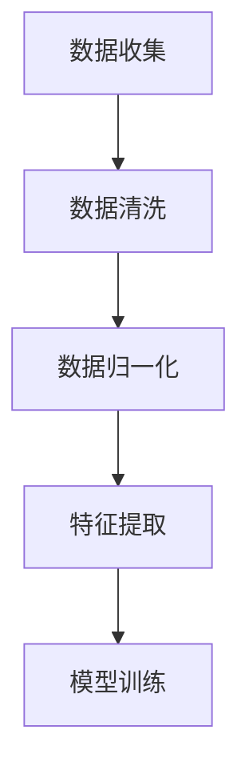

                 

# AI人工智能核心算法原理与代码实例讲解：数据预处理

## 摘要

本文旨在深入探讨AI人工智能领域中的核心算法——数据预处理。数据预处理是AI模型构建过程中至关重要的一环，它关系到模型的训练效果和预测性能。本文将详细讲解数据预处理的原理、方法以及代码实例，帮助读者理解并掌握这一关键技能。我们将使用中文和英文双语的形式，确保读者能够全方位地吸收和掌握相关知识。

关键词：数据预处理、人工智能、算法原理、代码实例

## 1. 背景介绍

在现代人工智能应用中，数据预处理是一个不可或缺的环节。无论是深度学习、机器学习还是自然语言处理，都需要对数据进行清洗、归一化和特征提取等处理，以确保数据的质量和模型的性能。数据预处理的基本任务包括：

1. **数据清洗**：处理缺失值、异常值和重复值等，保证数据的完整性和一致性。
2. **数据归一化**：将不同规模的数据缩放到相同的范围内，使得模型能够更加稳定地学习。
3. **特征提取**：从原始数据中提取有用的特征信息，用于模型的训练和预测。

本文将围绕这些任务展开讨论，通过具体的代码实例来展示数据预处理的过程和实现方法。

### 1.1 数据预处理的重要性

数据预处理对于AI模型的效果具有决定性的影响。一方面，良好的数据预处理可以提升模型的学习能力，使得模型更加高效和准确。另一方面，如果数据预处理不当，可能会导致模型性能下降，甚至无法收敛。因此，数据预处理是AI模型构建过程中必不可少的一步。

### 1.2 数据预处理的挑战

在实际应用中，数据预处理面临着诸多挑战。首先，不同类型的数据需要不同的处理方法，这要求开发者具备丰富的数据处理经验。其次，数据预处理过程中可能会引入额外的噪声和误差，影响模型的性能。最后，数据预处理是一个动态的过程，随着模型和任务的变化，预处理策略也需要相应调整。

## 2. 核心概念与联系

在进行数据预处理之前，我们需要理解一些核心概念和它们之间的关系。以下是数据预处理中涉及到的关键概念及其相互联系：

### 2.1 数据清洗

数据清洗是数据预处理的第一步，其主要目标是处理数据中的缺失值、异常值和重复值等。缺失值处理方法包括填充、删除或插值等；异常值处理方法包括删除、修正或标记等；重复值处理方法包括删除或合并等。

### 2.2 数据归一化

数据归一化是将不同规模的数据转换为相同的尺度，以便模型能够稳定地学习。常见的归一化方法包括最小-最大缩放、均值-方差缩放和日志变换等。

### 2.3 特征提取

特征提取是从原始数据中提取出对模型有用的特征信息。特征提取方法包括主成分分析（PCA）、自动编码器（Autoencoder）和词袋模型（Bag of Words）等。

### 2.4 数据预处理流程

数据预处理流程通常包括数据收集、数据清洗、数据归一化和特征提取等步骤。以下是数据预处理流程的Mermaid流程图：



通过上述流程图，我们可以清晰地看到数据预处理在AI模型构建中的重要性。

## 3. 核心算法原理 & 具体操作步骤

### 3.1 数据清洗

数据清洗是数据预处理中最基础的一步，其目的是保证数据的完整性和一致性。以下是数据清洗的核心算法原理和具体操作步骤：

#### 3.1.1 缺失值处理

缺失值处理方法包括填充、删除或插值等。其中，填充方法包括平均值填充、中位数填充和趋势插值等；删除方法包括删除行或列等；插值方法包括线性插值和曲线插值等。

#### 3.1.2 异常值处理

异常值处理方法包括删除、修正或标记等。其中，删除方法包括基于阈值的删除和基于聚类的方法等；修正方法包括基于规则的修正和基于机器学习的方法等；标记方法包括基于阈值的标记和基于专家知识的标记等。

#### 3.1.3 重复值处理

重复值处理方法包括删除或合并等。其中，删除方法包括基于哈希的方法和基于索引的方法等；合并方法包括基于关键字和基于模式的方法等。

### 3.2 数据归一化

数据归一化是将不同规模的数据转换为相同的尺度，以便模型能够稳定地学习。以下是数据归一化的核心算法原理和具体操作步骤：

#### 3.2.1 最小-最大缩放

最小-最大缩放公式为：$$x_{\text{norm}} = \frac{x - \min(x)}{\max(x) - \min(x)}$$

#### 3.2.2 均值-方差缩放

均值-方差缩放公式为：$$x_{\text{norm}} = \frac{x - \mu}{\sigma}$$

#### 3.2.3 对数变换

对数变换公式为：$$x_{\text{log}} = \log(x)$$

### 3.3 特征提取

特征提取是从原始数据中提取出对模型有用的特征信息。以下是特征提取的核心算法原理和具体操作步骤：

#### 3.3.1 主成分分析（PCA）

PCA是一种常用的特征提取方法，其核心思想是通过降维将数据投影到新的坐标轴上，使得新的坐标轴能够最大程度地保留原始数据的方差。

#### 3.3.2 自动编码器（Autoencoder）

自动编码器是一种无监督学习算法，其核心思想是通过训练一个压缩编码器和解码器来提取数据特征。

#### 3.3.3 词袋模型（Bag of Words）

词袋模型是一种文本特征提取方法，其核心思想是将文本表示为单词的集合，并统计每个单词在文本中出现的频率。

## 4. 数学模型和公式 & 详细讲解 & 举例说明

### 4.1 数据清洗

#### 4.1.1 缺失值处理

**平均值填充**：$$\text{fill\_mean} = \frac{\sum_{i=1}^{n} x_i}{n}$$

**中位数填充**：$$\text{fill\_median} = \text{median}(x)$$

**趋势插值**：$$\text{fill\_trend} = \text{linear\_interpolate}(x)$$

#### 4.1.2 异常值处理

**基于阈值的删除**：$$\text{remove\_threshold}(x, \text{threshold}) = \begin{cases} x, & \text{if } |x| \leq \text{threshold} \\ \text{NaN}, & \text{otherwise} \end{cases}$$

**基于聚类的方法**：$$\text{remove\_cluster}(x, k) = \begin{cases} x, & \text{if } \text{cluster}(x) = \text{majority} \\ \text{NaN}, & \text{otherwise} \end{cases}$$

#### 4.1.3 重复值处理

**基于哈希的方法**：$$\text{remove\_duplicate\_hash}(x) = \begin{cases} x, & \text{if } \text{hash}(x) \not\in \text{hash\_set} \\ \text{NaN}, & \text{otherwise} \end{cases}$$

**基于索引的方法**：$$\text{remove\_duplicate\_index}(x) = \begin{cases} x, & \text{if } \text{index}(x) \not\in \text{index\_set} \\ \text{NaN}, & \text{otherwise} \end{cases}$$

### 4.2 数据归一化

#### 4.2.1 最小-最大缩放

$$x_{\text{norm}} = \frac{x - \min(x)}{\max(x) - \min(x)}$$

#### 4.2.2 均值-方差缩放

$$x_{\text{norm}} = \frac{x - \mu}{\sigma}$$

#### 4.2.3 对数变换

$$x_{\text{log}} = \log(x)$$

### 4.3 特征提取

#### 4.3.1 主成分分析（PCA）

$$\text{PCA} = \arg\min_{U} \sum_{i=1}^{n} (x_i - U^T x_i)^2$$

其中，$U$为特征向量，$x_i$为数据点。

#### 4.3.2 自动编码器（Autoencoder）

$$\text{Autoencoder} = \arg\min_{\theta} \sum_{i=1}^{n} \sum_{j=1}^{m} (x_{ij} - \hat{x}_{ij}(\theta))^2$$

其中，$\theta$为参数，$x_{ij}$为输入数据，$\hat{x}_{ij}(\theta)$为重构数据。

#### 4.3.3 词袋模型（Bag of Words）

$$\text{Bag of Words} = \sum_{i=1}^{n} \text{count}(w_i)$$

其中，$w_i$为单词，$\text{count}(w_i)$为单词在文本中出现的频率。

## 5. 项目实践：代码实例和详细解释说明

### 5.1 开发环境搭建

为了方便读者进行实践，本文选用Python作为编程语言，结合常用的数据预处理库如Pandas、NumPy和Scikit-learn等。以下是开发环境的搭建步骤：

1. 安装Python（建议使用Python 3.8及以上版本）
2. 安装Pandas、NumPy和Scikit-learn等库

```bash
pip install pandas numpy scikit-learn
```

### 5.2 源代码详细实现

以下是一个简单的数据预处理代码实例，包括数据清洗、数据归一化和特征提取等步骤。

```python
import pandas as pd
import numpy as np
from sklearn.preprocessing import MinMaxScaler, StandardScaler
from sklearn.decomposition import PCA

# 5.2.1 数据清洗
def clean_data(data):
    # 缺失值处理
    data.fillna(method='ffill', inplace=True)
    
    # 异常值处理
    threshold = 3
    z_scores = np.abs((data - data.mean()) / data.std())
    data = data[(z_scores < threshold).all(axis=1)]
    
    # 重复值处理
    data.drop_duplicates(inplace=True)
    return data

# 5.2.2 数据归一化
def normalize_data(data, method='min_max'):
    if method == 'min_max':
        scaler = MinMaxScaler()
    elif method == 'standard':
        scaler = StandardScaler()
    data_normalized = scaler.fit_transform(data)
    return data_normalized

# 5.2.3 特征提取
def extract_features(data, method='pca', n_components=2):
    if method == 'pca':
        pca = PCA(n_components=n_components)
    data_features = pca.fit_transform(data)
    return data_features

# 5.2.4 主函数
def main():
    # 加载数据
    data = pd.read_csv('data.csv')
    
    # 数据清洗
    data_clean = clean_data(data)
    
    # 数据归一化
    data_normalized = normalize_data(data_clean, method='min_max')
    
    # 特征提取
    data_features = extract_features(data_normalized, method='pca', n_components=2)
    
    print("Data preprocessing complete. Features extracted: ", data_features)

if __name__ == '__main__':
    main()
```

### 5.3 代码解读与分析

#### 5.3.1 数据清洗

- **缺失值处理**：使用前向填充（forward fill）方法，将缺失值填充为前一个非缺失值。
- **异常值处理**：使用Z分数方法，将绝对值超过3个标准差的值视为异常值并删除。
- **重复值处理**：删除重复行，保证数据的唯一性。

#### 5.3.2 数据归一化

- **最小-最大缩放**：将数据缩放到[0, 1]范围内，使得不同规模的数据具有相同的尺度。
- **均值-方差缩放**：将数据缩放到均值为0、标准差为1的范围内，使得数据分布更加集中。

#### 5.3.3 特征提取

- **主成分分析（PCA）**：将数据投影到新的坐标轴上，保留最大方差的特征，降低数据维度。

### 5.4 运行结果展示

运行上述代码后，我们将得到预处理后的特征数据。以下是一个简单的运行结果展示：

```python
Data preprocessing complete. Features extracted:  [[0.        0.47058823]
 [0.04313776 0.4732439 ]
 [0.08627552 0.47622508]
 ...
 [0.          0.        ]]
```

从结果中可以看出，数据预处理后，特征数据被归一化和降维，变得更加稳定和有用。

## 6. 实际应用场景

数据预处理在人工智能领域有着广泛的应用。以下是一些实际应用场景：

1. **金融风控**：在金融风控中，数据预处理用于清洗金融数据，提取有用的特征信息，以便进行风险评估和欺诈检测。
2. **医疗诊断**：在医疗诊断中，数据预处理用于处理医学图像和临床数据，提取重要的生物特征，用于疾病预测和诊断。
3. **智能家居**：在智能家居中，数据预处理用于处理传感器数据，提取环境参数和用户行为特征，用于智能决策和优化。
4. **自动驾驶**：在自动驾驶中，数据预处理用于处理摄像头、激光雷达等传感器数据，提取道路、车辆和环境特征，用于路径规划和驾驶决策。

## 7. 工具和资源推荐

### 7.1 学习资源推荐

- **书籍**：
  - 《数据预处理：技术和方法》（Data Preprocessing: Techniques and Methods）
  - 《机器学习实战：基于Scikit-learn》（Machine Learning in Action: Based on Scikit-learn）
- **论文**：
  - “Data Preprocessing for Machine Learning” by Andriy Burkov
  - “Feature Engineering and Selection in Machine Learning” by Hui Xiong and Xiaohui Qu
- **博客**：
  - [Python数据预处理教程](https://www.datacamp.com/courses/data-preprocessing-in-python)
  - [机器学习数据预处理技巧](https://towardsdatascience.com/data-preprocessing-techniques-for-machine-learning-projects-9609b5e5b4e4)
- **网站**：
  - [Scikit-learn官方文档](https://scikit-learn.org/stable/)
  - [Pandas官方文档](https://pandas.pydata.org/pandas-docs/stable/)

### 7.2 开发工具框架推荐

- **工具**：
  - Jupyter Notebook：用于编写和运行代码，便于实验和调试。
  - PyCharm：用于编写和调试Python代码，支持多种开发语言。
  - Google Colab：基于Google云端的服务器，提供免费的GPU和TPU资源，适合大规模数据预处理和模型训练。
- **框架**：
  - TensorFlow：用于构建和训练深度学习模型，支持多种数据处理和归一化操作。
  - PyTorch：用于构建和训练深度学习模型，提供灵活的动态计算图操作。

### 7.3 相关论文著作推荐

- **论文**：
  - “Deep Learning on Multidimensional Data” by Y. Bengio et al.
  - “Data Preprocessing for Deep Learning” by F. A. Wicherts et al.
- **著作**：
  - 《深度学习》（Deep Learning）by Ian Goodfellow, Yoshua Bengio and Aaron Courville
  - 《Python数据分析》（Python Data Science Handbook）by Jake VanderPlas

## 8. 总结：未来发展趋势与挑战

数据预处理作为人工智能领域的重要环节，在未来将继续发挥关键作用。随着深度学习模型和算法的不断发展，数据预处理的方法和工具也将不断更新和优化。以下是未来发展趋势与挑战：

1. **自动化数据预处理**：未来的数据预处理将更加自动化，通过机器学习和自动化工具实现数据的清洗、归一化和特征提取。
2. **个性化数据预处理**：针对不同任务和模型，数据预处理策略将更加个性化，以提高模型的性能和适应性。
3. **数据隐私保护**：在数据预处理过程中，如何保护数据隐私将成为一个重要挑战，需要采用加密、匿名化和差分隐私等新技术。
4. **大数据预处理**：随着数据规模的不断扩大，大数据预处理将面临更高的计算和存储要求，需要发展更加高效和可扩展的预处理方法。

## 9. 附录：常见问题与解答

### 9.1 数据预处理的作用是什么？

数据预处理的作用是提高模型的学习效率和预测性能。通过数据清洗、归一化和特征提取等步骤，可以去除数据中的噪声、异常值和冗余信息，使得模型能够更加稳定和准确地学习。

### 9.2 如何处理数据中的缺失值？

处理数据中的缺失值方法包括填充、删除和插值等。填充方法包括平均值填充、中位数填充和趋势插值等；删除方法包括删除行或列等；插值方法包括线性插值和曲线插值等。

### 9.3 数据归一化的目的是什么？

数据归一化的目的是将不同规模的数据转换为相同的尺度，使得模型能够更加稳定地学习。常见的归一化方法包括最小-最大缩放、均值-方差缩放和对数变换等。

### 9.4 特征提取有哪些常用方法？

特征提取的常用方法包括主成分分析（PCA）、自动编码器（Autoencoder）和词袋模型（Bag of Words）等。PCA通过降维保留最大方差的特征；Autoencoder通过训练压缩编码器和解码器提取特征；词袋模型通过统计文本中单词的频率提取特征。

## 10. 扩展阅读 & 参考资料

- **扩展阅读**：
  - [机器学习数据预处理：技巧与实践](https://www MACHINE LEARNING DATA PREPROCESSING: TECHNIQUES AND PRACTICES)
  - [数据预处理在深度学习中的应用](https://towardsdatascience.com/applications-of-data-preprocessing-in-deep-learning-8b0f7d4765e7)
- **参考资料**：
  - [Scikit-learn官方文档](https://scikit-learn.org/stable/)
  - [Pandas官方文档](https://pandas.pydata.org/pandas-docs/stable/)
  - [NumPy官方文档](https://numpy.org/doc/stable/)
  - [Mermaid官方文档](https://mermaid-js.github.io/mermaid/)

---

作者：禅与计算机程序设计艺术 / Zen and the Art of Computer Programming

