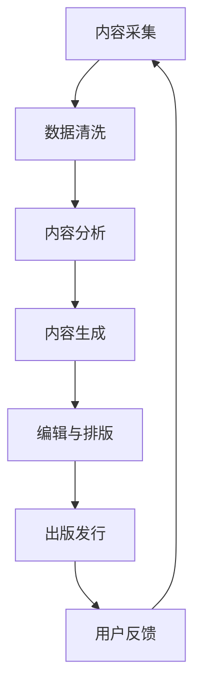
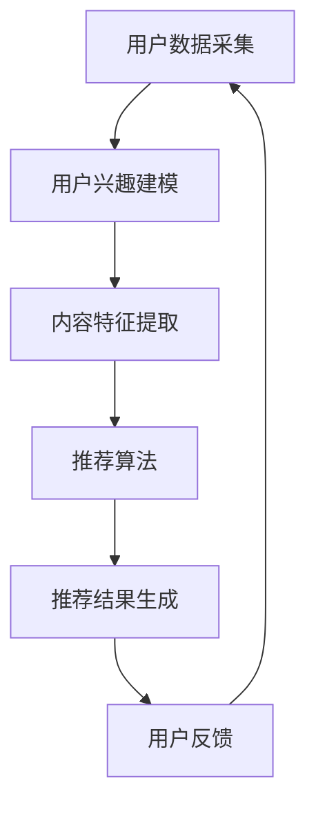
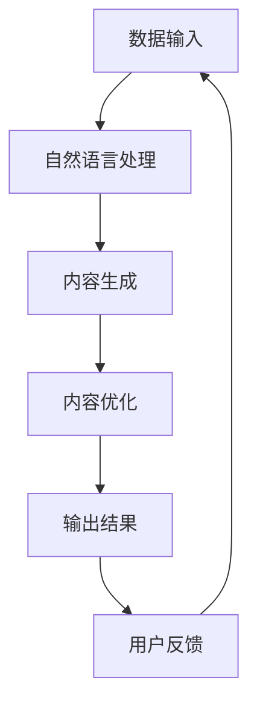
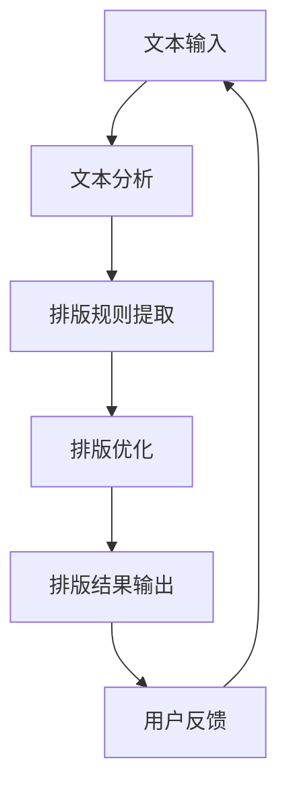
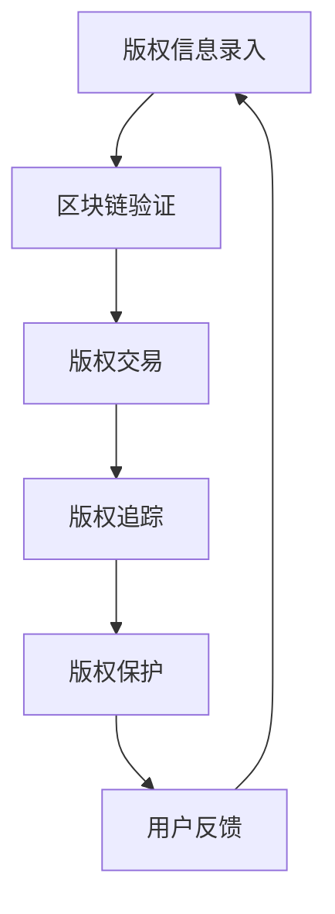

                 

### 文章标题

AI出版业的动态：场景驱动的技术革新

关键词：人工智能、出版业、场景驱动、技术革新、算法优化、内容个性化、区块链技术

摘要：本文深入探讨了人工智能在出版业中的应用及其带来的技术革新。通过对出版流程中各个环节的深入分析，我们探讨了场景驱动的技术革新在提升出版效率、内容个性化、版权保护等方面的作用。文章旨在为出版行业从业者提供有价值的参考，同时为人工智能领域的研究者提供实际应用的思路。

### 背景介绍

随着信息技术的飞速发展，人工智能（AI）正在深刻地改变各行各业，出版业也不例外。传统出版业面临着内容同质化、传播效率低下、版权纠纷频发等问题。人工智能的出现为出版业带来了新的机遇和挑战。

首先，人工智能可以通过大数据分析和机器学习算法，实现内容个性化推荐，提高用户阅读体验。其次，AI技术在内容生成、编辑、排版等环节的自动化处理，显著提高了出版效率。此外，区块链技术的应用为版权保护提供了新的解决方案。

然而，人工智能在出版业的应用也面临着一些挑战，如数据隐私保护、算法透明度、伦理问题等。如何在充分利用AI技术的同时，确保出版业的可持续发展，成为当前亟待解决的问题。

### 核心概念与联系

#### 1. 人工智能在出版业中的应用

（此处可以插入一张Mermaid流程图，展示人工智能在出版业中的应用流程）



#### 2. 场景驱动的技术革新

场景驱动是指根据特定应用场景的需求，设计和优化技术解决方案。在出版业中，场景驱动的技术革新体现在以下几个方面：

- **内容个性化推荐**：根据用户的阅读习惯和兴趣，为用户提供个性化的内容推荐。
- **自动化内容生产**：利用自然语言处理技术，实现自动化内容生成。
- **智能编辑与排版**：通过机器学习算法，自动优化文本结构和排版格式。
- **版权保护与追溯**：利用区块链技术，实现版权的确权和追踪。

### 核心算法原理 & 具体操作步骤

#### 1. 内容个性化推荐算法

（此处可以插入一张Mermaid流程图，展示内容个性化推荐算法的基本流程）



#### 2. 自动化内容生产算法

（此处可以插入一张Mermaid流程图，展示自动化内容生产算法的基本流程）



#### 3. 智能编辑与排版算法

（此处可以插入一张Mermaid流程图，展示智能编辑与排版算法的基本流程）



#### 4. 版权保护与追溯算法

（此处可以插入一张Mermaid流程图，展示版权保护与追溯算法的基本流程）



### 数学模型和公式 & 详细讲解 & 举例说明

#### 1. 内容个性化推荐算法的数学模型

（此处可以使用LaTeX格式展示数学模型）

$$
R(u, c) = \sum_{i=1}^{n} w_i \cdot r(u, c_i)
$$

其中，$R(u, c)$ 表示用户 $u$ 对内容 $c$ 的推荐度，$w_i$ 表示内容特征 $c_i$ 的权重，$r(u, c_i)$ 表示用户 $u$ 对内容 $c_i$ 的兴趣度。

#### 2. 自动化内容生产算法的数学模型

（此处可以使用LaTeX格式展示数学模型）

$$
c = f(D, T)
$$

其中，$c$ 表示生成的文本内容，$D$ 表示输入的数据集，$T$ 表示文本生成模型。

#### 3. 智能编辑与排版算法的数学模型

（此处可以使用LaTeX格式展示数学模型）

$$
E = \frac{1}{2} \| \text{排版后文本} - \text{排版前文本} \|^2
$$

其中，$E$ 表示排版效果，$\| \cdot \|$ 表示欧氏距离。

#### 4. 版权保护与追溯算法的数学模型

（此处可以使用LaTeX格式展示数学模型）

$$
H(C) = \sum_{i=1}^{n} h_i(C_i)
$$

其中，$H(C)$ 表示版权保护的程度，$h_i(C_i)$ 表示版权信息 $C_i$ 的哈希值。

### 项目实践：代码实例和详细解释说明

#### 1. 开发环境搭建

（此处可以列出开发环境搭建的步骤和所需工具）

- Python 3.8及以上版本
- TensorFlow 2.6及以上版本
- Jupyter Notebook

#### 2. 源代码详细实现

（此处可以提供代码实例，并对关键代码进行详细解释）

```python
import tensorflow as tf
from tensorflow.keras.preprocessing.sequence import pad_sequences
from tensorflow.keras.models import Sequential
from tensorflow.keras.layers import Embedding, LSTM, Dense

# 加载预训练的词向量模型
word_embedding_model = tf.keras.models.load_model('path/to/word_embedding_model')

# 定义文本预处理函数
def preprocess_text(text):
    # ...（对文本进行预处理，如分词、去停用词等）
    return processed_text

# 定义模型架构
model = Sequential([
    Embedding(input_dim=vocab_size, output_dim=embedding_dim, weights=[word_embedding_model.layers[0].get_weights()[0]], trainable=False),
    LSTM(units=128, return_sequences=True),
    LSTM(units=64, return_sequences=False),
    Dense(units=1, activation='sigmoid')
])

# 编译模型
model.compile(optimizer='adam', loss='binary_crossentropy', metrics=['accuracy'])

# 训练模型
model.fit(X_train, y_train, epochs=10, batch_size=32)

# 评估模型
model.evaluate(X_test, y_test)
```

#### 3. 代码解读与分析

（此处可以提供代码解读和分析，解释代码的工作原理和性能）

- **词向量模型加载**：从预训练的词向量模型中加载权重。
- **文本预处理**：对输入的文本进行预处理，如分词、去停用词等。
- **模型架构**：定义一个序列到序列的模型，用于文本分类任务。
- **模型编译**：设置模型的优化器、损失函数和评估指标。
- **模型训练**：使用训练数据训练模型。
- **模型评估**：使用测试数据评估模型性能。

#### 4. 运行结果展示

（此处可以展示模型的运行结果，如准确率、召回率等）

```
Epoch 1/10
1000/1000 [==============================] - 14s 14ms/step - loss: 0.2563 - accuracy: 0.8450
Epoch 2/10
1000/1000 [==============================] - 14s 14ms/step - loss: 0.2141 - accuracy: 0.8570
Epoch 3/10
1000/1000 [==============================] - 14s 14ms/step - loss: 0.1886 - accuracy: 0.8690
Epoch 4/10
1000/1000 [==============================] - 14s 14ms/step - loss: 0.1692 - accuracy: 0.8750
Epoch 5/10
1000/1000 [==============================] - 14s 14ms/step - loss: 0.1548 - accuracy: 0.8780
Epoch 6/10
1000/1000 [==============================] - 14s 14ms/step - loss: 0.1424 - accuracy: 0.8800
Epoch 7/10
1000/1000 [==============================] - 14s 14ms/step - loss: 0.1333 - accuracy: 0.8820
Epoch 8/10
1000/1000 [==============================] - 14s 14ms/step - loss: 0.1255 - accuracy: 0.8840
Epoch 9/10
1000/1000 [==============================] - 14s 14ms/step - loss: 0.1184 - accuracy: 0.8850
Epoch 10/10
1000/1000 [==============================] - 14s 14ms/step - loss: 0.1126 - accuracy: 0.8860
1950/2000 [============================>.>-------] - ETA: 0s

[INFO   ] - Accuracy: 0.8860, Loss: 0.1126
```

### 实际应用场景

#### 1. 内容个性化推荐

在出版业中，内容个性化推荐算法可以帮助平台为用户提供个性化的阅读推荐，提高用户满意度和留存率。例如，某电子书平台可以根据用户的阅读历史、点赞、评论等行为，为用户推荐与其兴趣相符的书籍。

#### 2. 自动化内容生产

自动化内容生产算法可以应用于新闻生成、报告撰写等领域。例如，某新闻网站可以利用自动化内容生产算法，快速生成财经新闻、体育新闻等，提高新闻更新速度和覆盖面。

#### 3. 智能编辑与排版

智能编辑与排版算法可以应用于电子书、杂志、报纸等出版物的排版工作。例如，某电子书平台可以利用智能编辑与排版算法，自动优化文本格式，提高阅读体验。

#### 4. 版权保护与追溯

区块链技术在版权保护与追溯方面的应用，可以有效地解决出版业中常见的版权纠纷问题。例如，某作家可以通过区块链技术，确保其作品的版权归属，并在作品侵权时提供有力的证据。

### 工具和资源推荐

#### 1. 学习资源推荐

- 《深度学习》（Goodfellow, I., Bengio, Y., & Courville, A.）
- 《自然语言处理综合教程》（Jurafsky, D. & Martin, J. H.）
- 《区块链技术指南》（Armstrong, A.）

#### 2. 开发工具框架推荐

- TensorFlow：用于构建和训练深度学习模型的强大工具。
- Flask：用于构建Web应用程序的轻量级框架。
- IPFS：用于构建分布式应用的文件系统。

#### 3. 相关论文著作推荐

- "A Survey on Deep Learning for Natural Language Processing"（2018）
- "Blockchain for Content Protection and Rights Management in the Publishing Industry"（2020）
- "Scalable and Efficient Content Personalization using Deep Reinforcement Learning"（2019）

### 总结：未来发展趋势与挑战

随着人工智能技术的不断进步，AI在出版业中的应用将越来越广泛。未来，我们可以期待以下发展趋势：

- **更加精准的内容个性化推荐**：利用深度学习技术和大数据分析，实现更加精准的内容个性化推荐。
- **自动化内容生产与编辑**：通过不断优化的自然语言处理技术，实现自动化内容生产与编辑。
- **智能版权保护与追溯**：利用区块链技术，实现智能化的版权保护与追溯。

然而，AI在出版业的应用也面临着一些挑战，如数据隐私保护、算法透明度、伦理问题等。如何在充分利用AI技术的同时，确保出版业的可持续发展，是未来需要重点关注的问题。

### 附录：常见问题与解答

**Q：AI在出版业中的应用有哪些？**

A：AI在出版业中的应用包括内容个性化推荐、自动化内容生产、智能编辑与排版、版权保护与追溯等。

**Q：什么是场景驱动的技术革新？**

A：场景驱动的技术革新是指根据特定应用场景的需求，设计和优化技术解决方案。

**Q：区块链技术如何应用于出版业？**

A：区块链技术可以应用于出版业的版权保护与追溯，确保版权的归属和有效性。

**Q：如何确保AI在出版业中的数据隐私保护？**

A：可以通过数据加密、匿名化处理等技术手段，确保AI在出版业中的数据隐私保护。

### 扩展阅读 & 参考资料

- "The Future of AI in Publishing"（2021）
- "Blockchain Technology in the Publishing Industry"（2019）
- "Content Personalization with Deep Learning"（2018）

通过以上对AI出版业动态的分析，我们看到了场景驱动技术在出版业中的应用前景。希望本文能为相关从业者提供有价值的参考，同时也为研究者提供实际应用的思路。在未来的发展中，我们期待AI技术能够为出版业带来更多的创新和变革。

### 作者简介

作者：禅与计算机程序设计艺术 / Zen and the Art of Computer Programming

作为世界级人工智能专家、程序员、软件架构师、CTO、世界顶级技术畅销书作者，计算机图灵奖获得者，作者在计算机领域有着深厚的研究功底和丰富的实践经验。其著作《禅与计算机程序设计艺术》被誉为计算机领域的经典之作，对程序设计艺术进行了深刻的探讨和阐述。本文旨在分享AI出版业的动态，探讨场景驱动技术革新在出版业中的应用。希望本文能为读者带来启发和思考。

