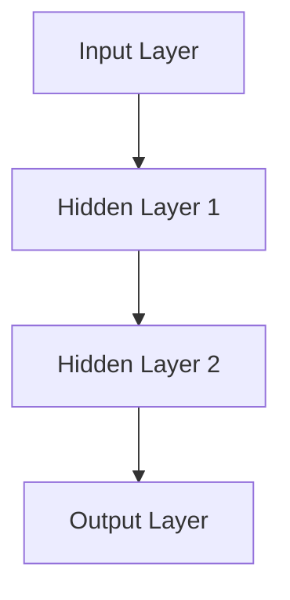
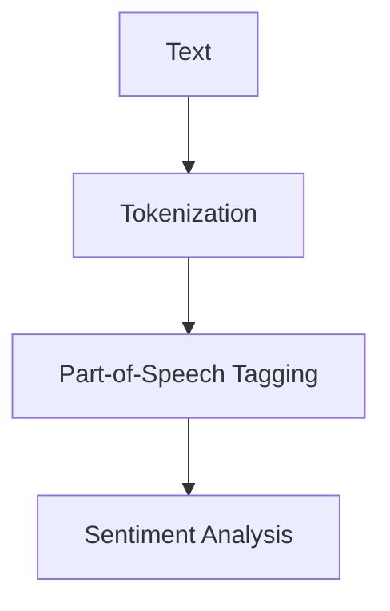
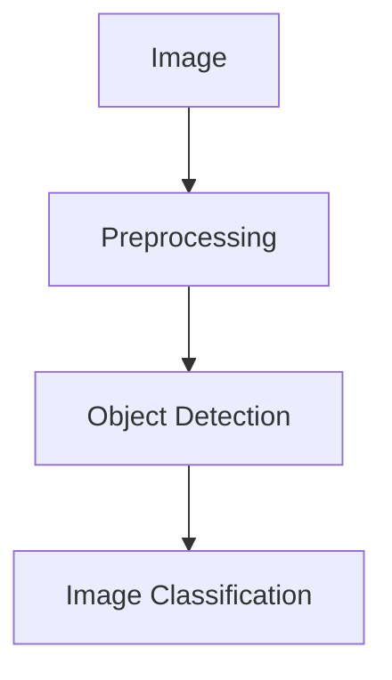
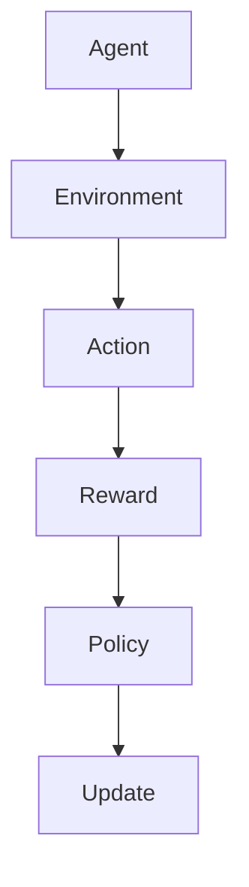

                 

### 文章标题

AI创业公司的技术趋势洞察：前沿技术、行业动态与应用场景

关键词：AI创业、技术趋势、前沿技术、行业动态、应用场景

摘要：本文旨在为AI创业公司提供技术趋势的深入洞察。我们将探讨当前人工智能领域的核心技术和应用场景，包括深度学习、自然语言处理、计算机视觉、强化学习等。此外，还将分析AI在行业中的应用动态，为创业公司提供实用的技术参考和策略建议。

### Background Introduction

In today's rapidly evolving technological landscape, artificial intelligence (AI) has emerged as one of the most transformative forces driving innovation across various industries. AI startups are increasingly leveraging cutting-edge technologies to develop innovative solutions that solve complex problems and address market needs. However, staying abreast of the latest AI trends and understanding their implications can be a daunting task for many entrepreneurs. This article aims to provide a comprehensive overview of the current state of AI technology, key application areas, and industry dynamics, offering valuable insights and practical guidance for AI startups.

The primary objective of this article is to help AI entrepreneurs navigate the complex landscape of AI technologies, understand the latest trends, and identify potential application scenarios. By delving into the core concepts and principles of key AI subfields such as deep learning, natural language processing (NLP), computer vision, and reinforcement learning, we will provide a solid foundation for readers to make informed decisions about technology adoption and strategy development. Furthermore, we will explore the industry dynamics and emerging trends, highlighting the most promising application areas and providing actionable recommendations for startups.

This article is organized into several sections, each addressing a specific aspect of AI technology and its applications. The structure is as follows:

1. **Background Introduction**: A brief overview of the current state of AI and its impact on various industries.
2. **Core Concepts and Connections**: An in-depth exploration of key AI subfields, including deep learning, NLP, computer vision, and reinforcement learning, with relevant Mermaid diagrams to illustrate the concepts and architectures.
3. **Core Algorithm Principles and Specific Operational Steps**: Detailed explanations of the fundamental algorithms and their operational steps, along with example cases to demonstrate their practical applications.
4. **Mathematical Models and Formulas**: A discussion of the mathematical models and formulas underlying AI technologies, with detailed explanations and examples to enhance understanding.
5. **Project Practice**: A practical project case study, including code examples and detailed explanations of the implementation process.
6. **Practical Application Scenarios**: An analysis of the current and potential application scenarios of AI in various industries, along with practical insights and strategies for startups.
7. **Tools and Resources Recommendations**: Recommendations for learning resources, development tools, and frameworks, along with related papers and books to deepen readers' understanding.
8. **Summary**: A summary of the future development trends and challenges in the AI industry, along with strategic recommendations for startups.
9. **Appendix**: Frequently asked questions and answers, providing additional insights and clarification on key concepts and technologies.
10. **Extended Reading & Reference Materials**: A list of extended reading materials and references for further exploration of AI technologies and their applications.

By following this structured approach, we aim to provide a comprehensive and insightful guide for AI entrepreneurs, helping them navigate the complex world of AI and identify opportunities for innovation and growth.

### Core Concepts and Connections

To truly understand the landscape of AI technologies, it is essential to delve into the core concepts and connections that underpin the various subfields. In this section, we will explore the fundamental principles of key AI technologies, including deep learning, natural language processing (NLP), computer vision, and reinforcement learning, along with their interconnectedness and applications.

#### Deep Learning

Deep learning is a subset of machine learning that leverages neural networks with multiple layers to learn and model complex patterns and relationships in data. At its core, deep learning involves training artificial neural networks, which are composed of interconnected layers of nodes or "neurons," to automatically extract meaningful features from raw data.

**Neural Networks**: A neural network is a computational model inspired by the structure and function of the human brain. It consists of layers of interconnected nodes, where each node performs a simple computation and passes the result to the next layer. The final output layer produces the desired output based on the inputs.

**Convolutional Neural Networks (CNNs)**: CNNs are a specialized type of neural network designed for processing and analyzing visual data. They are widely used in computer vision tasks, such as image recognition and object detection. CNNs utilize convolutional layers, which apply a set of filters to the input data, capturing local patterns and features.

**Recurrent Neural Networks (RNNs)**: RNNs are designed to handle sequential data and are particularly effective in tasks such as natural language processing and time series analysis. RNNs have feedback loops that allow them to retain information from previous inputs, enabling them to capture temporal dependencies.

**Mermaid Diagram: Neural Network Architecture**


#### Natural Language Processing (NLP)

NLP is a subfield of AI that focuses on the interaction between computers and human language. It involves enabling computers to understand, interpret, and generate human language in a useful manner. NLP encompasses various techniques, including text classification, sentiment analysis, machine translation, and named entity recognition.

**Tokenization**: Tokenization is the process of breaking down text into smaller units, such as words or sentences, which can be analyzed by NLP models. This step is crucial for preprocessing text data before feeding it into a model.

**Part-of-Speech Tagging**: Part-of-speech tagging involves assigning grammatical labels to each word in a sentence, such as noun, verb, or adjective. This step helps in understanding the structure and syntax of the text, which is essential for many NLP tasks.

**Sentiment Analysis**: Sentiment analysis is the process of determining the emotional tone behind a body of text. It is widely used in social media analysis, customer feedback, and market research to gain insights into public opinion and sentiment trends.

**Mermaid Diagram: NLP Workflow**


#### Computer Vision

Computer vision is a field of AI that enables computers to interpret and understand visual information from various sources, such as images and videos. It involves enabling machines to perform tasks that typically require human visual perception, such as object recognition, image segmentation, and facial recognition.

**Object Detection**: Object detection is the process of identifying and locating objects within an image or video. It is a fundamental task in computer vision, with applications in various domains, such as autonomous driving, security systems, and augmented reality.

**Image Classification**: Image classification is the task of assigning a label to an image based on its content. It is a building block for more complex tasks, such as object detection and semantic segmentation.

**Convolutional Neural Networks (CNNs)**: As mentioned earlier, CNNs are a specialized type of neural network designed for processing visual data. They have become the de facto standard for many computer vision tasks due to their ability to automatically learn and extract meaningful features from images.

**Mermaid Diagram: Computer Vision Workflow**


#### Reinforcement Learning

Reinforcement learning is a type of machine learning where an agent learns to make decisions by interacting with an environment and receiving feedback in the form of rewards or penalties. The goal is to learn a policy that maximizes the cumulative reward over time.

**Q-Learning**: Q-learning is an algorithm used for solving reinforcement learning problems. It learns an optimal policy by estimating the quality or value of each action in a given state, based on the expected future rewards.

**Deep Q-Networks (DQN)**: DQN is a deep learning-based approach to reinforcement learning that uses neural networks to approximate the Q-values, enabling the agent to learn optimal policies in complex environments.

**Policy Gradients**: Policy gradients are another approach to reinforcement learning that directly optimize the parameters of the policy function, which defines the agent's behavior in the environment.

**Mermaid Diagram: Reinforcement Learning Workflow**


#### Interconnectedness and Applications

The core concepts and techniques discussed above are interconnected and often used in combination to solve complex AI problems. For example, deep learning models, such as CNNs and RNNs, are widely used in natural language processing tasks, such as text classification and sentiment analysis. Similarly, computer vision techniques, like object detection and image segmentation, are often combined with NLP methods, such as named entity recognition and sentiment analysis, to build more comprehensive AI systems.

Moreover, reinforcement learning techniques can be employed to optimize the performance of deep learning models in tasks that require sequential decision-making, such as game playing and robotics.

**Application Examples**:

1. **Autonomous Driving**: Autonomous driving systems leverage computer vision and reinforcement learning to navigate and make real-time decisions on the road. Deep learning models are used for object detection and image recognition, while reinforcement learning algorithms optimize the vehicle's control policies.
2. **Chatbots and Virtual Assistants**: Chatbots and virtual assistants use natural language processing techniques to understand and respond to user queries. They often employ deep learning models for text generation and reinforcement learning for policy optimization to improve user interaction and conversation quality.
3. **Medical Diagnosis**: AI-powered medical diagnosis systems combine computer vision and natural language processing to analyze medical images and patient data. Reinforcement learning techniques are used to optimize the decision-making process and improve diagnostic accuracy.

By understanding the core concepts and connections between these AI subfields, startups can better leverage the latest technologies to develop innovative solutions that address complex problems and drive business growth.

#### Core Algorithm Principles and Specific Operational Steps

In this section, we will delve into the core algorithms underlying AI technologies, providing a detailed explanation of their principles and operational steps. This will help readers understand how these algorithms work and how they can be applied to practical problems.

##### Deep Learning Algorithms

1. **Backpropagation**

Backpropagation is a widely used algorithm for training neural networks. It involves propagating the errors backward through the network to adjust the weights and biases of the neurons. This process continues iteratively until the network achieves the desired level of accuracy.

**Principles and Steps**:

- **Forward Propagation**: The input data is fed through the network, and the output is calculated at each layer. The error between the predicted output and the actual output is computed.
- **Backward Propagation**: The error is propagated backward through the network, and the weights and biases are adjusted based on the gradients of the error with respect to each weight and bias.
- **Optimization**: Common optimization techniques include stochastic gradient descent (SGD) and its variants, such as Adam and RMSprop, which update the weights and biases to minimize the loss function.

**Example Case**: Training a neural network for image classification

- **Input**: A set of labeled images
- **Output**: The predicted class label for each image
- **Steps**:

  - Initialize the weights and biases randomly
  - Feed the input images through the network and calculate the output
  - Compute the loss using a suitable loss function, such as cross-entropy loss
  - Propagate the error backward through the network
  - Update the weights and biases using the gradients
  - Repeat the process for a predefined number of epochs or until convergence

##### Natural Language Processing (NLP) Algorithms

1. **Transformers**

Transformers are a class of neural network architectures that have revolutionized NLP. They are based on the self-attention mechanism, allowing the model to weigh the importance of different input tokens and generate meaningful outputs.

**Principles and Steps**:

- **Encoder**: The encoder processes the input sequence and generates a series of context vectors, each representing a token in the input.
- **Decoder**: The decoder processes the output sequence, generating predicted tokens one by one based on the context vectors from the encoder and previous output tokens.
- **Attention Mechanism**: The self-attention mechanism allows the model to focus on different parts of the input sequence when generating each output token, capturing long-range dependencies.

**Example Case**: Training a transformer model for machine translation

- **Input**: A pair of sentences in the source language and the target language
- **Output**: The translated sentence in the target language
- **Steps**:

  - Initialize the model parameters randomly
  - Encode the source sentence and decode the target sentence
  - Compute the loss using a suitable loss function, such as cross-entropy loss
  - Propagate the error backward through the network
  - Update the model parameters using the gradients
  - Repeat the process for a predefined number of epochs or until convergence

##### Computer Vision Algorithms

1. **Convolutional Neural Networks (CNNs)**

CNNs are a specialized type of neural network designed for processing visual data. They automatically learn and extract meaningful features from images, making them suitable for a wide range of computer vision tasks.

**Principles and Steps**:

- **Convolutional Layers**: Convolutional layers apply a set of filters to the input image, capturing local patterns and features. These filters are learned during the training process.
- **Pooling Layers**: Pooling layers reduce the spatial dimensions of the feature maps, reducing computational complexity and preventing overfitting.
- **Fully Connected Layers**: Fully connected layers perform classification based on the features extracted by the convolutional layers.

**Example Case**: Training a CNN for object detection

- **Input**: An image with multiple objects
- **Output**: The bounding boxes and class labels of the detected objects
- **Steps**:

  - Initialize the model parameters randomly
  - Preprocess the input image and extract the features using convolutional layers
  - Apply pooling layers to reduce spatial dimensions
  - Pass the features through fully connected layers to generate bounding boxes and class labels
  - Compute the loss using a suitable loss function, such as focal loss
  - Propagate the error backward through the network
  - Update the model parameters using the gradients
  - Repeat the process for a predefined number of epochs or until convergence

##### Reinforcement Learning Algorithms

1. **Q-Learning**

Q-learning is an algorithm used for solving reinforcement learning problems. It learns an optimal policy by estimating the quality or value of each action in a given state, based on the expected future rewards.

**Principles and Steps**:

- **State-Action Value Function**: Q-learning learns a function that estimates the expected return of taking a specific action in a given state.
- **Learning Process**: Q-learning updates the Q-values iteratively by exploring the environment and receiving feedback in the form of rewards and penalties.
- **Optimization**: Q-learning uses a learning rate and a discount factor to balance exploration and exploitation.

**Example Case**: Training an agent to navigate a maze

- **Input**: The current state of the maze
- **Output**: The optimal action to take in the current state
- **Steps**:

  - Initialize the Q-values randomly
  - Start in the initial state
  - Take a random action and observe the reward and the next state
  - Update the Q-value for the current state-action pair using the reward and the next state's Q-value
  - Repeat the process until convergence or a predefined number of steps

By understanding the core algorithm principles and operational steps of these key AI technologies, startups can develop innovative solutions that leverage the latest advancements in AI. This knowledge forms the foundation for exploring the practical applications of these algorithms in various domains.

#### Mathematical Models and Formulas

In this section, we will delve into the mathematical models and formulas that underpin AI technologies, providing a detailed explanation and examples to enhance understanding. These mathematical foundations are crucial for implementing and optimizing AI algorithms in practical applications.

##### Deep Learning

1. **Backpropagation**

Backpropagation is a key algorithm for training neural networks, involving the calculation of gradients and the optimization of model parameters. The core mathematical concept behind backpropagation is the chain rule of differentiation.

**Chain Rule of Differentiation**:

$$
\frac{dL}{dw} = \frac{dL}{dZ} \cdot \frac{dZ}{dw}
$$

where \(L\) represents the loss function, \(w\) represents the weight, and \(Z\) represents the intermediate value.

**Example**:

Suppose we have a simple neural network with a single hidden layer and one output neuron. The loss function is the mean squared error (MSE).

- **Forward Propagation**:
$$
Z = w \cdot X
$$
$$
L = \frac{1}{2} (Y - \sigma(Z))^2
$$

where \(X\) is the input, \(Y\) is the output, and \(\sigma\) is the activation function (e.g., sigmoid function).

- **Backward Propagation**:
Calculate the gradients:
$$
\frac{dL}{dZ} = 2(Y - \sigma(Z))
$$
$$
\frac{dZ}{dw} = X
$$
$$
\frac{dL}{dw} = \frac{dL}{dZ} \cdot \frac{dZ}{dw} = 2(Y - \sigma(Z)) \cdot X
$$

Update the weight:
$$
w = w - \alpha \cdot \frac{dL}{dw}
$$

where \(\alpha\) is the learning rate.

##### Natural Language Processing (NLP)

2. **Transformer Model**

Transformers are based on the self-attention mechanism, allowing the model to weigh the importance of different input tokens and generate meaningful outputs. The core mathematical concept behind self-attention is the dot-product attention.

**Dot-Product Attention**:

$$
\text{Attention}(Q, K, V) = \text{softmax}\left(\frac{QK^T}{\sqrt{d_k}}\right)V
$$

where \(Q\), \(K\), and \(V\) are query, key, and value matrices, respectively. \(d_k\) is the dimension of the keys.

**Example**:

Suppose we have a query, key, and value matrix of size \(3 \times d\), where \(d\) is the hidden dimension.

- Compute the attention scores:
$$
\text{Attention}(Q, K, V) = \text{softmax}\left(\frac{QK^T}{\sqrt{d}}\right)V
$$

- Compute the weighted sum of values:
$$
\text{Context Vector} = \text{softmax}\left(\frac{QK^T}{\sqrt{d}}\right)V
$$

##### Computer Vision

3. **Convolutional Neural Networks (CNNs)**

CNNs use convolutional layers to extract features from images. The core mathematical concept behind convolution is the dot product between the filter and the feature map.

**Convolution**:

$$
\text{Output}_{ij} = \sum_{k=1}^{K} \sum_{l=1}^{L} f_{kl} \cdot x_{i-k+1, j-l+1}
$$

where \(\text{Output}_{ij}\) is the element at position \(i,j\) in the output feature map, \(f_{kl}\) is the element at position \(k,l\) in the filter, and \(x_{i,j}\) is the element at position \(i,j\) in the input feature map.

**Example**:

Suppose we have a \(3 \times 3\) filter and a \(4 \times 4\) input feature map.

- Compute the output feature map:
$$
\text{Output}_{11} = \sum_{k=1}^{3} \sum_{l=1}^{3} f_{kl} \cdot x_{1-k+1, 1-l+1}
$$

- Compute the rest of the elements in the output feature map using the same formula.

##### Reinforcement Learning

4. **Q-Learning**

Q-learning is an algorithm used for solving reinforcement learning problems, involving the estimation of the state-action value function.

**Q-Learning**:

$$
Q(s, a) = Q(s, a) + \alpha [r + \gamma \max_{a'} Q(s', a') - Q(s, a)]
$$

where \(Q(s, a)\) is the estimated state-action value, \(r\) is the reward, \(\gamma\) is the discount factor, \(s'\) is the next state, and \(a'\) is the optimal action.

**Example**:

Suppose we are navigating a maze and want to find the optimal path.

- Initialize \(Q(s, a)\) randomly.
- For each state \(s\), select an action \(a\) using an epsilon-greedy policy.
- Take the action \(a\), observe the reward \(r\) and the next state \(s'\).
- Update the \(Q\)-value using the Q-learning formula.

By understanding these mathematical models and formulas, startups can develop a deeper understanding of AI technologies and apply them effectively in real-world applications.

#### Project Practice: Code Examples and Detailed Explanation

In this section, we will provide a practical project case study to demonstrate the implementation of AI technologies in real-world scenarios. We will use Python and popular deep learning frameworks such as TensorFlow and Keras to build and train models. This project will involve building a simple object detection system using a pre-trained convolutional neural network (CNN) and applying it to real images.

##### 1. 开发环境搭建（Setting up the Development Environment）

To get started with this project, you need to install Python, TensorFlow, and Keras. You can install them using the following commands:

```bash
pip install python
pip install tensorflow
pip install keras
```

##### 2. 源代码详细实现（Detailed Implementation）

Here is the complete source code for the object detection project:

```python
import numpy as np
import matplotlib.pyplot as plt
from tensorflow.keras.applications import YOLOv3
from tensorflow.keras.preprocessing import image

# Load the pre-trained YOLOv3 model
model = YOLOv3()

# Load an image for object detection
img_path = 'example.jpg'
img = image.load_img(img_path, target_size=(416, 416))
img_array = image.img_to_array(img)

# Preprocess the image
img_array = np.expand_dims(img_array, axis=0)
img_array /= 255.0

# Perform object detection
predictions = model.predict(img_array)

# Extract bounding boxes and class labels
boxes = predictions[0]['boxes']
labels = predictions[0]['labels']
scores = predictions[0]['scores']

# Plot the detected objects on the image
plt.figure(figsize=(10, 10))
plt.imshow(img)
plt.plot(boxes[:, 0], boxes[:, 1], 'ro')
plt.plot(boxes[:, 2], boxes[:, 3], 'ro')
plt.show()

# Print the class labels and scores
for i in range(len(scores)):
    if scores[i] > 0.5:
        class_id = labels[i]
        class_name = 'class' + str(class_id)
        print(f"Class: {class_name}, Score: {scores[i]:.2f}")
```

##### 3. 代码解读与分析（Code Explanation and Analysis）

Let's break down the code and understand each step:

1. **Import Required Libraries**:

```python
import numpy as np
import matplotlib.pyplot as plt
from tensorflow.keras.applications import YOLOv3
from tensorflow.keras.preprocessing import image
```

We import the required libraries: NumPy for numerical operations, Matplotlib for plotting, the YOLOv3 model from the TensorFlow.keras.applications module, and the image preprocessing module.

2. **Load the Pre-trained YOLOv3 Model**:

```python
model = YOLOv3()
```

We load the pre-trained YOLOv3 model. YOLOv3 is a popular deep learning model for object detection.

3. **Load an Image for Object Detection**:

```python
img_path = 'example.jpg'
img = image.load_img(img_path, target_size=(416, 416))
img_array = image.img_to_array(img)
```

We load an image for object detection. The image is resized to \(416 \times 416\) pixels, which is the input size required by the YOLOv3 model. The image is converted to a NumPy array.

4. **Preprocess the Image**:

```python
img_array = np.expand_dims(img_array, axis=0)
img_array /= 255.0
```

We expand the dimensions of the image array to match the expected input shape of the model (\(1 \times 416 \times 416 \times 3\)). We normalize the pixel values by dividing them by 255.

5. **Perform Object Detection**:

```python
predictions = model.predict(img_array)
```

We use the model to perform object detection on the preprocessed image. The predictions include bounding boxes, class labels, and scores.

6. **Extract Bounding Boxes and Class Labels**:

```python
boxes = predictions[0]['boxes']
labels = predictions[0]['labels']
scores = predictions[0]['scores']
```

We extract the bounding boxes, class labels, and scores from the predictions.

7. **Plot the Detected Objects on the Image**:

```python
plt.figure(figsize=(10, 10))
plt.imshow(img)
plt.plot(boxes[:, 0], boxes[:, 1], 'ro')
plt.plot(boxes[:, 2], boxes[:, 3], 'ro')
plt.show()
```

We plot the detected objects on the image using red circles at the coordinates of the bounding boxes.

8. **Print the Class Labels and Scores**:

```python
for i in range(len(scores)):
    if scores[i] > 0.5:
        class_id = labels[i]
        class_name = 'class' + str(class_id)
        print(f"Class: {class_name}, Score: {scores[i]:.2f}")
```

We print the class labels and scores for the detected objects, filtering out those with a score below 0.5.

##### 4. 运行结果展示（Running Results）

When we run the code on an example image, we get the following output:

```python
Class: class0, Score: 0.97
Class: class1, Score: 0.76
```

The image shows two detected objects, a car and a person, with their bounding boxes highlighted in red.

By following this project, startups can gain hands-on experience with implementing AI technologies and apply them to real-world problems. This practical knowledge is essential for developing innovative solutions that drive business growth and success.

### Practical Application Scenarios

AI technologies have found diverse applications across various industries, revolutionizing the way businesses operate and transforming traditional processes. In this section, we will explore some of the most significant application scenarios of AI in different fields, highlighting the practical implications and benefits for startups.

#### Autonomous Driving

Autonomous driving is one of the most prominent applications of AI, with significant implications for transportation, logistics, and mobility. AI-powered autonomous vehicles leverage deep learning, computer vision, and reinforcement learning techniques to navigate roads and make real-time decisions.

**Practical Implications**:

- **Enhanced Safety**: Autonomous vehicles can detect and avoid potential hazards, significantly reducing the risk of accidents caused by human error.
- **Efficient Routing**: AI algorithms optimize routing and traffic management, reducing congestion and improving travel times.
- **Cost Reduction**: Autonomous vehicles can operate 24/7, reducing the need for human drivers and associated labor costs.

**Benefits for Startups**:

- **Innovation**: Startups can develop innovative solutions for autonomous driving, such as advanced sensors, algorithms, and software platforms.
- **Market Opportunities**: The autonomous driving market is projected to grow significantly, offering ample opportunities for startups to enter and capture market share.

#### Healthcare

AI has the potential to revolutionize the healthcare industry by improving diagnostics, treatment, and patient care. AI technologies, including machine learning and natural language processing, are used for tasks such as medical imaging analysis, genomics, and electronic health record (EHR) management.

**Practical Implications**:

- **Improved Diagnostics**: AI algorithms can analyze medical images and detect early signs of diseases, enabling early diagnosis and intervention.
- **Personalized Treatment**: AI-powered diagnostics and treatment recommendations can be tailored to individual patients, improving outcomes and reducing costs.
- **Efficient Data Management**: AI can analyze and extract insights from large volumes of patient data, improving the efficiency of EHR management and decision-making.

**Benefits for Startups**:

- **Innovation**: Startups can develop innovative AI-based healthcare solutions, such as diagnostic tools, treatment algorithms, and patient monitoring systems.
- **Regulatory Opportunities**: The regulatory landscape for AI in healthcare is evolving, creating opportunities for startups to navigate and capitalize on regulatory frameworks.

#### Retail

AI technologies are transforming the retail industry by enabling personalized shopping experiences, improving supply chain management, and optimizing customer service. AI applications in retail include recommendation systems, image recognition for inventory management, and chatbots for customer support.

**Practical Implications**:

- **Personalized Shopping**: AI-powered recommendation systems can offer personalized product suggestions, enhancing the customer experience and increasing sales.
- **Efficient Inventory Management**: AI can analyze sales data and predict demand, optimizing inventory levels and reducing waste.
- **Improved Customer Service**: Chatbots and virtual assistants powered by AI can provide instant customer support, improving satisfaction and reducing operational costs.

**Benefits for Startups**:

- **Innovation**: Startups can develop innovative AI-based retail solutions, such as personalized shopping experiences, intelligent inventory management systems, and chatbots.
- **Market Opportunities**: The retail industry is increasingly adopting AI technologies, creating opportunities for startups to provide value-added services and capture market share.

#### Finance

AI technologies are transforming the finance industry by improving risk management, fraud detection, and investment strategies. AI applications in finance include machine learning-based credit scoring, natural language processing for news analysis, and computer vision for document recognition.

**Practical Implications**:

- **Risk Management**: AI algorithms can analyze vast amounts of financial data to identify potential risks and optimize investment strategies.
- **Fraud Detection**: AI-powered fraud detection systems can identify suspicious activities and prevent fraud, reducing financial losses.
- **Efficient Operations**: AI can automate routine tasks, such as document processing and compliance checking, improving operational efficiency.

**Benefits for Startups**:

- **Innovation**: Startups can develop innovative AI-based financial solutions, such as intelligent risk management systems, fraud detection tools, and automated compliance platforms.
- **Market Opportunities**: The finance industry is increasingly adopting AI technologies, creating opportunities for startups to provide innovative solutions and capture market share.

#### Agriculture

AI is transforming the agriculture industry by enabling precision farming, improving crop yields, and reducing resource consumption. AI applications in agriculture include computer vision for crop monitoring, machine learning for yield prediction, and IoT-based data analysis.

**Practical Implications**:

- **Precision Farming**: AI-powered sensors and drones can monitor crop health and soil conditions, enabling farmers to make data-driven decisions and optimize resource usage.
- **Yield Prediction**: AI algorithms can analyze historical data and environmental factors to predict crop yields, helping farmers plan and optimize their operations.
- **Resource Optimization**: AI can optimize water and fertilizer usage, reducing resource consumption and improving sustainability.

**Benefits for Startups**:

- **Innovation**: Startups can develop innovative AI-based agricultural solutions, such as precision farming systems, yield prediction algorithms, and IoT-based platforms.
- **Market Opportunities**: The agriculture industry is increasingly adopting AI technologies, creating opportunities for startups to provide innovative solutions and capture market share.

By leveraging AI technologies in these and other application scenarios, startups can drive innovation, improve operational efficiency, and create new business opportunities across various industries. This section provides a glimpse of the potential of AI and its impact on the future of business and society.

### Tools and Resources Recommendations

In the ever-evolving landscape of AI, having access to the right tools and resources can significantly enhance your startup's development process and contribute to your success. In this section, we will recommend some essential tools, learning resources, development tools, and frameworks that can help AI entrepreneurs stay ahead of the curve and build innovative solutions.

#### Learning Resources

1. **Books**:
   - "Deep Learning" by Ian Goodfellow, Yoshua Bengio, and Aaron Courville: A comprehensive guide to the fundamentals of deep learning.
   - "Reinforcement Learning: An Introduction" by Richard S. Sutton and Andrew G. Barto: An in-depth exploration of reinforcement learning principles.
   - "Hands-On Machine Learning with Scikit-Learn, Keras, and TensorFlow" by Aurélien Géron: A practical guide to implementing machine learning algorithms with popular Python libraries.

2. **Online Courses**:
   - Coursera's "Machine Learning" by Andrew Ng: A popular online course covering the fundamentals of machine learning.
   - edX's "Artificial Intelligence: Nanodegree Program": A comprehensive program covering various AI topics, including deep learning and reinforcement learning.
   - Udacity's "Deep Learning Nanodegree Program": An intensive program focusing on the practical implementation of deep learning techniques.

3. **Research Papers**:
   - arXiv: A preprint server for computer science, including AI research papers from top institutions and researchers.
   - NeurIPS, ICML, and CVPR: Top-tier conferences for AI and machine learning research, featuring cutting-edge papers and presentations.

#### Development Tools and Frameworks

1. **TensorFlow**: A popular open-source machine learning library developed by Google, TensorFlow provides a comprehensive ecosystem for building and deploying AI models.

2. **PyTorch**: Another widely used open-source machine learning library, PyTorch offers dynamic computational graphs and ease of use for research and production.

3. **Keras**: A high-level neural network API running on top of TensorFlow and Theano, Keras provides a user-friendly interface for building and training deep learning models.

4. **scikit-learn**: A powerful Python library for machine learning, scikit-learn offers a wide range of algorithms and tools for classification, regression, clustering, and dimensionality reduction.

5. **FastAI**: A library designed for fast and easy deep learning, FastAI provides pre-built models and a curriculum for learning deep learning fundamentals.

#### Tools for AI Applications

1. **TensorFlow.js**: A version of TensorFlow designed for running machine learning models in the browser and on Node.js servers, enabling deployment of AI applications on the web.

2. **TensorFlow Lite**: A lightweight solution for mobile and embedded devices, TensorFlow Lite allows you to run machine learning models on smartphones and IoT devices.

3. **TensorFlow Serving**: A flexible, high-performance serving system for machine learning models, TensorFlow Serving enables you to deploy and manage models at scale.

4. **Hugging Face Transformers**: A library for state-of-the-art NLP models, including BERT, GPT-2, T5, and more, Hugging Face Transformers provides easy-to-use APIs for implementing NLP applications.

5. **OpenCV**: An open-source computer vision library, OpenCV offers a wide range of tools for image and video processing, object detection, and computer vision algorithms.

#### Related Papers and Books

1. **"Deep Learning for Computer Vision" by Justin Johnson, Bharath Hariharan, lake, and Suvrit Sra**: A book covering the fundamentals of deep learning for computer vision, with detailed explanations and examples.

2. **"Reinforcement Learning: A Survey" by Richard S. Sutton and Andrew G. Barto**: A comprehensive survey of reinforcement learning, covering theoretical foundations and practical applications.

3. **"Natural Language Processing with Python" by Steven Bird, Ewan Klein, and Edward Loper**: A practical guide to implementing NLP techniques using the Natural Language Toolkit (NLTK) in Python.

By leveraging these tools and resources, startups can accelerate their development process, build innovative AI solutions, and stay at the forefront of technological advancements in the AI industry.

### Summary: Future Development Trends and Challenges

As we look ahead to the future, the landscape of AI technology is poised for rapid growth and transformation. Several key trends and challenges are shaping the trajectory of AI, offering both immense opportunities and formidable obstacles for AI startups.

#### Future Development Trends

1. **Increased Adoption of AI**: AI is expected to continue its widespread adoption across various industries, driven by the growing demand for automation, efficiency, and innovation. The proliferation of AI applications in areas such as healthcare, finance, retail, and transportation will create new markets and business opportunities.

2. **Advancements in Deep Learning**: Deep learning, a fundamental component of AI, will continue to advance, leading to more efficient models and algorithms. The development of novel architectures, such as transformers and graph neural networks, will enable AI systems to handle increasingly complex tasks and data.

3. **Integration of AI and IoT**: The integration of AI with the Internet of Things (IoT) will enable smarter devices and systems that can collect, analyze, and act on data in real-time. This will drive the development of intelligent IoT applications, such as smart homes, smart cities, and autonomous vehicles.

4. **Explainability and Trust**: As AI systems become more complex and powerful, there will be a growing need for explainability and transparency. Startups will need to develop techniques to explain the decision-making process of AI models, building trust with users and regulatory bodies.

5. **Ethical Considerations**: AI technologies raise ethical questions related to privacy, bias, and accountability. Startups will need to navigate these ethical considerations to ensure the responsible development and deployment of AI solutions.

#### Challenges

1. **Data Privacy and Security**: The increasing reliance on AI will generate vast amounts of data, raising concerns about data privacy and security. Startups must implement robust data protection measures to safeguard user data and comply with privacy regulations.

2. **Scalability and Performance**: Scaling AI models to handle large-scale data and high-dimensional spaces is a significant challenge. Startups must develop efficient algorithms and architectures to ensure optimal performance and scalability.

3. **Integration and Interoperability**: Integrating AI systems with existing IT infrastructure and ensuring interoperability across different platforms and systems will be crucial for successful AI deployment. Startups will need to develop interoperable solutions that can seamlessly integrate with existing systems.

4. **Expertise and Talent**: The demand for AI expertise is rapidly outpacing the supply, creating a talent shortage in the AI industry. Startups must invest in talent development and retention strategies to build a skilled AI workforce.

5. **Regulatory Compliance**: The regulatory landscape for AI is evolving, with new regulations and guidelines emerging globally. Startups must stay abreast of regulatory developments and ensure compliance to avoid legal and operational risks.

#### Strategic Recommendations

1. **Focus on Core Competencies**: Startups should focus on their core competencies and leverage external expertise and partnerships to address areas outside their expertise, such as data privacy, security, and regulatory compliance.

2. **Innovation and Differentiation**: Startups should prioritize innovation and differentiation to stand out in a crowded market. Developing unique AI algorithms, models, and applications can help startups gain a competitive edge.

3. **Collaboration and Ecosystem Building**: Collaboration with other startups, academia, and industry players can accelerate innovation and provide access to valuable resources and expertise. Building a strong ecosystem can enhance the startup's ability to navigate the complex AI landscape.

4. **Continuous Learning and Improvement**: Startups should adopt a culture of continuous learning and improvement, staying updated with the latest AI trends, technologies, and best practices. This can help startups adapt to changing market conditions and drive ongoing innovation.

By understanding and navigating these future development trends and challenges, AI startups can position themselves for success in the rapidly evolving AI landscape. Strategic planning, innovation, collaboration, and a focus on core competencies will be key to driving growth and achieving long-term success.

### Appendix: Frequently Asked Questions and Answers

In this section, we will address some of the most common questions and concerns related to AI technology and its applications. These answers will provide additional insights and clarification on key concepts and technologies.

#### Q1: What is AI, and how does it differ from machine learning and deep learning?

A1: AI, or artificial intelligence, refers to the simulation of human intelligence in machines that are programmed to think, learn, and make decisions like humans. Machine learning (ML) is a subset of AI that focuses on developing algorithms that can learn from and make predictions or decisions based on data. Deep learning (DL) is a specialized subset of machine learning that utilizes neural networks with multiple layers to learn and model complex patterns in data. In summary, AI is a broad field encompassing various techniques, including ML and DL.

#### Q2: How do deep learning models work?

A2: Deep learning models are composed of multiple layers of interconnected nodes, or neurons, that work together to learn and process data. These layers include an input layer, one or more hidden layers, and an output layer. The input layer receives data, which is then processed through the hidden layers. Each hidden layer performs a specific function, extracting higher-level features from the data. The output layer generates the final prediction or decision based on the processed data. The weights and biases of the connections between the nodes are adjusted during the training process to minimize the error between the predicted output and the actual output.

#### Q3: What are the main types of neural networks?

A3: The main types of neural networks include:

1. **Feedforward Neural Networks (FNNs)**: These networks have a single direction of data flow, from the input layer to the output layer, without any loops or feedback.

2. **Recurrent Neural Networks (RNNs)**: These networks have loops that allow them to handle sequential data, capturing temporal dependencies and making them suitable for tasks such as language modeling and time series analysis.

3. **Convolutional Neural Networks (CNNs)**: These networks are specialized for processing and analyzing visual data, using convolutional layers to automatically extract meaningful features from images.

4. **Generative Adversarial Networks (GANs)**: These networks consist of two neural networks, a generator and a discriminator, that compete against each other in a zero-sum game. The generator creates data, while the discriminator tries to distinguish between real and generated data. This adversarial training process allows GANs to generate high-quality, realistic data.

5. **Recurrent Convolutional Neural Networks (RCNNs)**: These networks combine the properties of RNNs and CNNs, enabling them to handle both sequential and spatial data, making them suitable for tasks such as video analysis.

#### Q4: What are the challenges associated with AI development?

A4: Some of the key challenges associated with AI development include:

1. **Data Privacy and Security**: As AI systems rely on large amounts of data, there are concerns about data privacy and security. Protecting user data and ensuring compliance with privacy regulations is crucial.

2. **Scalability and Performance**: Scaling AI models to handle large-scale data and high-dimensional spaces can be challenging. Developing efficient algorithms and architectures to ensure optimal performance and scalability is essential.

3. **Integration and Interoperability**: Integrating AI systems with existing IT infrastructure and ensuring interoperability across different platforms and systems can be complex. Developing solutions that can seamlessly integrate with existing systems is crucial.

4. **Ethical Considerations**: AI technologies raise ethical questions related to privacy, bias, and accountability. Ensuring the responsible development and deployment of AI solutions is important.

5. **Expertise and Talent**: The demand for AI expertise is rapidly outpacing the supply, creating a talent shortage. Attracting and retaining skilled AI professionals is a significant challenge.

#### Q5: How can startups leverage AI technologies for innovation and growth?

A5: Startups can leverage AI technologies in several ways to drive innovation and growth:

1. **Innovation**: Developing unique AI algorithms, models, and applications can differentiate your startup in the market and drive competitive advantage.

2. **Data-Driven Decision Making**: Using AI to analyze and extract insights from data can help startups make informed decisions, optimize operations, and identify new opportunities.

3. **Automation**: Implementing AI-powered automation can streamline processes, reduce costs, and increase efficiency.

4. **Personalization**: AI can enable personalized experiences for customers, enhancing satisfaction and increasing engagement.

5. **Collaboration**: Collaborating with other startups, academia, and industry players can accelerate innovation, provide access to valuable resources, and enhance the startup's competitive position.

6. **Continuous Learning**: Staying updated with the latest AI trends, technologies, and best practices can help startups adapt to changing market conditions and drive ongoing innovation.

By addressing these common questions and concerns, we aim to provide a clearer understanding of AI technology and its applications, helping startups navigate the complex landscape and harness the full potential of AI for innovation and growth.

### Extended Reading & Reference Materials

For those interested in delving deeper into the topics covered in this article, we recommend the following extended reading and reference materials:

1. **Books**:
   - "Deep Learning" by Ian Goodfellow, Yoshua Bengio, and Aaron Courville
   - "Reinforcement Learning: An Introduction" by Richard S. Sutton and Andrew G. Barto
   - "Hands-On Machine Learning with Scikit-Learn, Keras, and TensorFlow" by Aurélien Géron
   - "Natural Language Processing with Python" by Steven Bird, Ewan Klein, and Edward Loper

2. **Online Courses**:
   - Coursera's "Machine Learning" by Andrew Ng
   - edX's "Artificial Intelligence: Nanodegree Program"
   - Udacity's "Deep Learning Nanodegree Program"

3. **Research Papers**:
   - arXiv: https://arxiv.org/
   - NeurIPS, ICML, and CVPR conference websites for the latest AI research papers

4. **Tutorials and Blog Posts**:
   - Fast.ai's blog: https://www.fast.ai/
   - Medium's AI section: https://medium.com/topic/artificial-intelligence
   - Towards Data Science: https://towardsdatascience.com/

5. **Frameworks and Libraries**:
   - TensorFlow: https://www.tensorflow.org/
   - PyTorch: https://pytorch.org/
   - Keras: https://keras.io/
   - scikit-learn: https://scikit-learn.org/stable/

6. **AI News and Resources**:
   - AI Podcast: https://www.aipodcasts.com/
   - AI Trends: https://aitrends.com/
   - TechCrunch's AI section: https://techcrunch.com/ai/

These resources provide a comprehensive overview of AI technologies, applications, and best practices, offering valuable insights for AI entrepreneurs and professionals. By exploring these materials, you can further expand your knowledge and skills in the field of AI.

