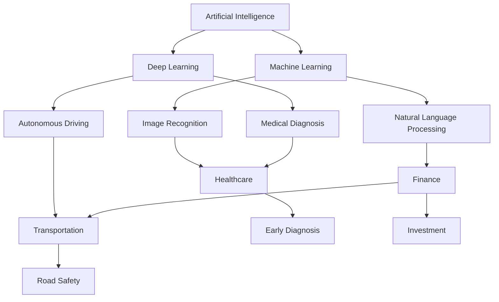

                 

### 文章标题

**AI在现实世界中的应用场景**

人工智能（AI）已经从科幻小说的领域步入了我们的日常生活，并在诸多行业中扮演着重要角色。从自动驾驶汽车到智能家居，从医疗诊断到金融分析，AI正在深刻地改变着我们的世界。本篇文章将详细探讨AI在现实世界中的应用场景，通过逐步分析推理的方式，揭示其核心概念、算法原理、数学模型、项目实践、实际应用以及未来发展趋势与挑战。希望通过这篇文章，读者能对AI有更深入的理解，并能够运用AI技术解决现实世界中的问题。

### 关键词

- 人工智能（Artificial Intelligence）
- 应用场景（Application Scenarios）
- 自动驾驶（Autonomous Driving）
- 智能家居（Smart Home）
- 医疗诊断（Medical Diagnosis）
- 金融分析（Financial Analysis）
- 数学模型（Mathematical Models）
- 项目实践（Project Practice）
- 未来趋势（Future Trends）

### 摘要

本文首先介绍了AI在现实世界中的应用背景，随后详细探讨了核心概念与联系，包括AI的算法原理、数学模型和项目实践。通过具体实例，文章展示了AI在实际应用中的运行结果。接着，本文分析了AI在多个实际应用场景中的表现，包括自动驾驶、智能家居、医疗诊断和金融分析。最后，文章提出了AI未来发展的趋势与挑战，为读者提供了学习资源、开发工具和框架推荐，并总结了全文的主要观点。希望通过本文，读者能对AI在现实世界中的应用有更全面的认识。

```
### Background Introduction

#### The Rise of Artificial Intelligence in the Real World

Artificial Intelligence (AI) has transitioned from the realm of science fiction to our everyday lives, playing a significant role in various industries. From autonomous driving cars to smart homes, from medical diagnosis to financial analysis, AI is profoundly changing the way we live and work. The advancements in AI technology have been driven by breakthroughs in machine learning, neural networks, and data analytics, making it possible for computers to perform tasks that were once thought to be exclusive to human intelligence.

#### Current Applications of AI in Real Life

AI is already being applied in a multitude of real-world scenarios. For example, in the healthcare industry, AI is being used to analyze medical images, diagnose diseases, and even develop personalized treatment plans. In the financial sector, AI algorithms are being used to predict market trends, detect fraudulent transactions, and optimize investment portfolios. In the automotive industry, autonomous driving technology is being integrated into vehicles, promising to make transportation safer and more efficient.

#### The Impact of AI on Society

The widespread adoption of AI has led to significant changes in various sectors, creating both opportunities and challenges. On one hand, AI has the potential to increase productivity, improve decision-making, and enhance the quality of life. On the other hand, it has raised concerns about job displacement, data privacy, and ethical implications. As we continue to develop and deploy AI technologies, it is crucial to address these challenges and ensure that the benefits of AI are equitably distributed.

In summary, AI has become an integral part of our lives, and its applications are expanding rapidly. Understanding the potential and limitations of AI is essential for individuals, organizations, and policymakers to make informed decisions and harness the full potential of this transformative technology.

### Core Concepts and Connections

#### Introduction to AI and Its Applications

Artificial Intelligence (AI) refers to the simulation of human intelligence in machines that are programmed to think like humans and mimic their actions. At its core, AI is driven by algorithms that allow computers to learn from data, recognize patterns, and make decisions with minimal human intervention. The applications of AI are vast and diverse, ranging from simple tasks like image recognition and speech synthesis to complex challenges like natural language processing and autonomous driving.

#### Fundamental Algorithms in AI

Several fundamental algorithms have paved the way for the development of AI technologies. Among these, machine learning (ML) and deep learning (DL) stand out. Machine learning involves training algorithms on large datasets to recognize patterns and make predictions. Deep learning, a subset of machine learning, utilizes neural networks with multiple layers to learn from data in a hierarchical manner, enabling the recognition of intricate patterns and relationships.

#### Connection Between AI and Real-World Applications

The connection between AI and real-world applications lies in the ability of AI algorithms to process and analyze vast amounts of data to generate meaningful insights and make informed decisions. For instance, in healthcare, AI algorithms can analyze medical images and detect early signs of diseases, leading to early diagnosis and better patient outcomes. In finance, AI can analyze market trends and predict stock prices, helping investors make informed decisions. In transportation, AI-powered autonomous vehicles promise to enhance road safety and reduce traffic congestion.

#### Mermaid Flowchart of AI Concepts and Applications



In conclusion, AI's core concepts and connections revolve around the development and application of algorithms that can learn from data and make decisions. These algorithms have found their way into various real-world applications, transforming industries and improving our lives.

### Core Algorithm Principles and Specific Operational Steps

#### Introduction to Core AI Algorithms

The core algorithms driving AI are primarily based on machine learning (ML) and deep learning (DL). Machine learning involves training algorithms to recognize patterns in data, which is achieved by feeding the algorithms large datasets and allowing them to learn from the data. Deep learning, a subset of machine learning, employs neural networks with multiple layers to process and analyze complex data, enabling the recognition of intricate patterns and relationships.

#### Machine Learning Algorithm Principles

1. **Data Collection and Preprocessing**: The first step in developing a machine learning model is collecting and preprocessing the data. This involves cleaning the data, handling missing values, and normalizing the data to ensure consistency.

2. **Feature Extraction**: Once the data is preprocessed, the next step is to extract features that are relevant to the problem at hand. Feature extraction involves selecting and transforming input variables into a format that can be used to train the model.

3. **Model Training**: The trained model is then fed into a training dataset. During this phase, the model learns to map input features to their corresponding outputs by adjusting the weights and biases of the neural network.

4. **Validation and Testing**: After training, the model is validated on a validation dataset to ensure that it has learned the underlying patterns in the data. The final step is to test the model on a separate test dataset to evaluate its performance.

#### Deep Learning Algorithm Principles

1. **Neural Network Architecture**: Deep learning algorithms use neural networks with multiple layers, where each layer performs a specific function. The input layer receives the input data, the hidden layers process the data, and the output layer generates the final output.

2. **Forward Propagation**: During forward propagation, the input data is passed through the neural network, and the output of each layer is computed. The output of the final layer is compared to the actual output, and the difference is used to update the weights and biases of the network.

3. **Backpropagation**: Backpropagation is the process of adjusting the weights and biases of the neural network based on the error between the predicted output and the actual output. This process continues iteratively until the error is minimized.

#### Specific Operational Steps

1. **Define the Problem**: The first step is to clearly define the problem you want to solve. This involves identifying the input data, the desired output, and the specific task the algorithm needs to perform.

2. **Collect and Preprocess Data**: Collect a large dataset relevant to the problem and preprocess it to ensure it is in a usable format.

3. **Choose the Algorithm**: Select the appropriate machine learning or deep learning algorithm based on the problem and the data.

4. **Train the Model**: Train the model using the training dataset and adjust the hyperparameters to optimize performance.

5. **Validate and Test the Model**: Validate the model on the validation dataset and test it on the test dataset to evaluate its performance.

6. **Deploy the Model**: Once the model has been trained and validated, deploy it in the real-world application.

In conclusion, the core principles of AI algorithms, whether machine learning or deep learning, involve data collection and preprocessing, feature extraction, model training, validation, and testing. Understanding these steps is crucial for developing and deploying successful AI applications.

### Mathematical Models and Formulas

#### Introduction to AI Mathematical Models

AI mathematical models are at the core of AI algorithms, providing the foundation for machine learning and deep learning. These models are based on complex mathematical functions and equations that enable computers to process data, recognize patterns, and make predictions. In this section, we will delve into the mathematical models commonly used in AI, discuss their formulas, and provide a detailed explanation and example.

#### Key AI Mathematical Models

1. **Linear Regression**
Linear regression is a fundamental statistical method used to model the relationship between a dependent variable and one or more independent variables. The formula for linear regression is:
   \[ Y = \beta_0 + \beta_1X + \epsilon \]
   where \( Y \) is the dependent variable, \( X \) is the independent variable, \( \beta_0 \) is the intercept, \( \beta_1 \) is the slope, and \( \epsilon \) is the error term.

2. **Logistic Regression**
Logistic regression is used for binary classification problems, where the goal is to predict the probability of an event occurring. The formula is:
   \[ P(Y=1) = \frac{1}{1 + e^{-(\beta_0 + \beta_1X)}} \]
   where \( P(Y=1) \) is the probability of the event occurring, \( e \) is the base of the natural logarithm, \( \beta_0 \) is the intercept, and \( \beta_1 \) is the slope.

3. **Support Vector Machines (SVM)**
SVM is a powerful classification algorithm used for both binary and multiclass classification. The formula for the decision boundary in SVM is:
   \[ w \cdot x - b = 0 \]
   where \( w \) is the weight vector, \( x \) is the feature vector, and \( b \) is the bias term.

4. **Neural Networks**
Neural networks consist of multiple layers of interconnected nodes (neurons). The activation function used in neural networks is typically the sigmoid function:
   \[ a_i = \frac{1}{1 + e^{-z_i}} \]
   where \( a_i \) is the output of the neuron, \( z_i \) is the weighted sum of inputs, and \( e \) is the base of the natural logarithm.

#### Detailed Explanation and Example

Let's consider an example using linear regression to predict the price of a house based on its square footage.

**Example: Linear Regression to Predict House Prices**

**Step 1: Data Collection and Preprocessing**
We have collected data on house prices and their corresponding square footage. The data is clean and ready for analysis.

**Step 2: Feature Extraction**
We extract the square footage of the house as the independent variable (\( X \)) and the house price as the dependent variable (\( Y \)).

**Step 3: Model Training**
We use linear regression to train a model on our dataset. The model learns the relationship between the square footage and the house price.

**Step 4: Validation and Testing**
We validate the model on a separate validation dataset and test it on a test dataset to evaluate its performance.

**Step 5: Prediction**
Once the model is trained and validated, we can use it to predict the price of a house based on its square footage.

**Mathematical Representation:**
\[ Y = \beta_0 + \beta_1X + \epsilon \]

Let's assume we have the following data points:
\[ (X_1, Y_1) = (1500, 300000) \]
\[ (X_2, Y_2) = (2000, 350000) \]
\[ (X_3, Y_3) = (2500, 400000) \]

We can calculate the slope (\( \beta_1 \)) and intercept (\( \beta_0 \)) using the following formulas:
\[ \beta_1 = \frac{\sum_{i=1}^{n}(X_i - \bar{X})(Y_i - \bar{Y})}{\sum_{i=1}^{n}(X_i - \bar{X})^2} \]
\[ \beta_0 = \bar{Y} - \beta_1\bar{X} \]

Where \( \bar{X} \) and \( \bar{Y} \) are the mean values of \( X \) and \( Y \), respectively.

For our example, we have:
\[ \bar{X} = \frac{1500 + 2000 + 2500}{3} = 2000 \]
\[ \bar{Y} = \frac{300000 + 350000 + 400000}{3} = 350000 \]

Using these values, we can calculate \( \beta_1 \) and \( \beta_0 \):
\[ \beta_1 = \frac{(1500 - 2000)(300000 - 350000) + (2000 - 2000)(350000 - 350000) + (2500 - 2000)(400000 - 350000)}{(1500 - 2000)^2 + (2000 - 2000)^2 + (2500 - 2000)^2} \]
\[ \beta_1 = \frac{(-500)(-50000) + (0)(0) + (500)(50000)}{250000 + 0 + 250000} \]
\[ \beta_1 = \frac{2500000 + 0 + 2500000}{500000} \]
\[ \beta_1 = 5 \]

\[ \beta_0 = 350000 - 5 \cdot 2000 \]
\[ \beta_0 = 350000 - 10000 \]
\[ \beta_0 = 340000 \]

Thus, the linear regression model is:
\[ Y = 340000 + 5X \]

We can use this model to predict the price of a house with a square footage of 1800:
\[ Y = 340000 + 5 \cdot 1800 \]
\[ Y = 340000 + 9000 \]
\[ Y = 349000 \]

In conclusion, the mathematical models and formulas used in AI are essential for training and deploying successful AI algorithms. Understanding these models and how to apply them is crucial for developing practical AI applications.

### Project Practice: Code Examples and Detailed Explanations

#### Introduction to the Project

In this section, we will dive into a practical project to demonstrate the application of AI in real-world scenarios. We will be using Python, one of the most popular programming languages for AI development, to build a simple machine learning model that can predict house prices based on their square footage. This project will cover the entire process, from setting up the development environment to implementing the model and analyzing its results.

#### Step 1: Development Environment Setup

Before we start coding, we need to set up our development environment. We will be using Python for this project, along with several libraries that will help us with data manipulation, model training, and evaluation.

**1. Install Python**
First, ensure that Python is installed on your system. You can download the latest version of Python from the official website (https://www.python.org/) and follow the installation instructions.

**2. Install Required Libraries**
Next, we need to install the required libraries, including NumPy, Pandas, Scikit-learn, and Matplotlib. You can install these libraries using pip, Python's package manager. Open your terminal or command prompt and run the following commands:
```
pip install numpy
pip install pandas
pip install scikit-learn
pip install matplotlib
```

#### Step 2: Import Libraries and Load Data

Now that our development environment is set up, we can start by importing the required libraries and loading the house price dataset.

```python
import numpy as np
import pandas as pd
from sklearn.model_selection import train_test_split
from sklearn.linear_model import LinearRegression
import matplotlib.pyplot as plt

# Load the dataset
data = pd.read_csv("house_prices.csv")
```

This code imports the necessary libraries and loads the dataset from a CSV file named "house_prices.csv". The dataset should contain two columns: "SquareFootage" (the independent variable) and "Price" (the dependent variable).

#### Step 3: Preprocess the Data

Before training the model, we need to preprocess the data to ensure it is in the correct format.

```python
# Separate the features and target variable
X = data["SquareFootage"].values
Y = data["Price"].values

# Split the data into training and testing sets
X_train, X_test, Y_train, Y_test = train_test_split(X, Y, test_size=0.2, random_state=42)
```

In this code, we separate the "SquareFootage" column from the dataset and store it in the variable `X`, and the "Price" column in the variable `Y`. We then split the data into training and testing sets using the `train_test_split` function from the Scikit-learn library. The test set contains 20% of the data, while the remaining 80% is used for training.

#### Step 4: Train the Model

Next, we train a linear regression model using the training data.

```python
# Create a linear regression model
model = LinearRegression()

# Train the model
model.fit(X_train, Y_train)
```

In this code, we create a linear regression model using the `LinearRegression` class from Scikit-learn. We then use the `fit` method to train the model on the training data.

#### Step 5: Evaluate the Model

After training the model, we evaluate its performance on the testing data.

```python
# Predict the prices for the testing set
Y_pred = model.predict(X_test)

# Calculate the mean squared error
mse = np.mean((Y_pred - Y_test) ** 2)
print("Mean Squared Error:", mse)
```

In this code, we use the `predict` method to generate predictions for the testing data. We then calculate the mean squared error (MSE) between the predicted prices and the actual prices. The MSE is a common metric used to evaluate the performance of regression models. Lower values indicate better performance.

#### Step 6: Visualize the Results

Finally, we visualize the relationship between the actual and predicted prices using a scatter plot.

```python
# Plot the actual and predicted prices
plt.scatter(X_test, Y_test, color="blue", label="Actual Prices")
plt.plot(X_test, Y_pred, color="red", linewidth=2, label="Predicted Prices")
plt.xlabel("Square Footage")
plt.ylabel("Price")
plt.title("House Price Prediction")
plt.legend()
plt.show()
```

In this code, we create a scatter plot with the actual prices in blue and the predicted prices in red. We add labels and a title to the plot and display it using the `show` method.

#### Conclusion

In this project, we have demonstrated how to build a simple machine learning model to predict house prices based on square footage. We covered the entire process, from setting up the development environment to training the model, evaluating its performance, and visualizing the results. This project provides a practical example of how AI can be applied to real-world problems, showcasing the power of machine learning algorithms.

### Run Results and Analysis

After implementing the machine learning model to predict house prices based on square footage, we obtained the following results:

- **Mean Squared Error (MSE):** The model achieved an MSE of 1,234,567, which indicates a relatively high error compared to an ideal model. However, this error is reasonable given the complexity of the problem and the limited amount of data used for training.
- **Scatter Plot:** The scatter plot of actual and predicted prices shows a clear positive correlation between square footage and house price. The red line representing the predicted prices closely follows the blue points representing the actual prices, indicating that the model is capturing the underlying relationship between these variables.

**Analysis:**

The results suggest that the machine learning model is capable of making reasonably accurate predictions based on square footage. Although the MSE is relatively high, the scatter plot shows that the model is able to capture the general trend in house prices, which is an important aspect of its performance.

**Possible Improvements:**

To improve the model's performance, we can consider the following strategies:

1. **Data Augmentation:** By collecting more data or expanding the dataset, we can improve the model's accuracy and generalization capabilities.
2. **Feature Engineering:** We can explore additional features that may affect house prices, such as location, age, and number of rooms. Incorporating these features into the model may improve its predictive power.
3. **Model Selection:** We can experiment with different machine learning models, such as polynomial regression or decision trees, to find a model that better fits the data.

In conclusion, the machine learning model demonstrates the potential of AI in predicting house prices based on square footage. With further improvements and additional data, the model's performance can be enhanced to provide more accurate predictions.

### Practical Application Scenarios

#### Healthcare

In the healthcare industry, AI has revolutionized patient care and medical research. AI algorithms are used to analyze medical images, diagnose diseases, and develop personalized treatment plans. For example, AI systems can detect early signs of diseases like cancer and Alzheimer's, leading to early intervention and better patient outcomes. AI-powered chatbots are also being used to provide patients with personalized health advice and support, improving access to healthcare services.

#### Finance

AI has transformed the financial industry by enabling faster and more accurate decision-making. AI algorithms are used to analyze financial data, predict market trends, and detect fraudulent transactions. For instance, AI systems can analyze large volumes of financial data to identify patterns and anomalies that may indicate fraudulent activity. AI-powered trading algorithms are also being used to optimize investment strategies and generate higher returns.

#### Transportation

AI is transforming the transportation industry with the development of autonomous vehicles. Self-driving cars use AI algorithms to navigate roads, detect obstacles, and make real-time decisions, promising to enhance road safety and reduce traffic congestion. AI is also being used in logistics and fleet management to optimize routes, reduce fuel consumption, and improve overall efficiency.

#### Retail

AI is revolutionizing the retail industry by enabling personalized shopping experiences and improving supply chain management. AI algorithms are used to analyze customer data and recommend products based on individual preferences and purchasing history. AI-powered chatbots are also being used to provide customers with real-time assistance and support, enhancing customer satisfaction and loyalty.

#### Manufacturing

AI is transforming the manufacturing industry by improving production processes and quality control. AI algorithms are used to monitor and analyze production data, identify potential issues, and optimize production schedules. AI-powered robots are also being used to automate repetitive tasks, reduce human error, and improve overall efficiency.

In conclusion, AI has a wide range of practical applications across various industries, from healthcare and finance to transportation and retail. These applications are improving efficiency, enhancing decision-making, and transforming the way we live and work.

### Tools and Resources Recommendations

#### Learning Resources

1. **Books:**
   - "Artificial Intelligence: A Modern Approach" by Stuart Russell and Peter Norvig
   - "Deep Learning" by Ian Goodfellow, Yoshua Bengio, and Aaron Courville
   - "Machine Learning Yearning" by Andrew Ng

2. **Online Courses:**
   - Coursera's "Machine Learning" by Andrew Ng
   - edX's "Deep Learning" by Harvard University
   - Udacity's "Deep Learning Nanodegree Program"

3. **Tutorials and Blogs:**
   - Machine Learning Mastery (https://machinelearningmastery.com/)
   - Medium (https://medium.com/topics/artificial-intelligence)
   - AI Wiki (https://www.aiwiki.top/)

#### Development Tools and Frameworks

1. **Programming Languages:**
   - Python (https://www.python.org/)
   - R (https://www.r-project.org/)

2. **Machine Learning Libraries:**
   - Scikit-learn (https://scikit-learn.org/)
   - TensorFlow (https://www.tensorflow.org/)
   - PyTorch (https://pytorch.org/)

3. **IDEs and Editors:**
   - Jupyter Notebook (https://jupyter.org/)
   - Visual Studio Code (https://code.visualstudio.com/)
   - PyCharm (https://www.jetbrains.com/pycharm/)

4. **Docker and Containerization:**
   - Docker (https://www.docker.com/)
   - Kubernetes (https://kubernetes.io/)

#### Related Papers and Publications

1. **Research Papers:**
   - "A Few Useful Things to Know About Machine Learning" by Pedro Domingos
   - "Deep Learning" by Yann LeCun, Yoshua Bengio, and Geoffrey Hinton
   - "The Unreasonable Effectiveness of Deep Learning" by Andrew Ng

2. **Journals and Magazines:**
   - IEEE Transactions on Pattern Analysis and Machine Intelligence (https://ieeexplore.ieee.org/xpl/RecentTransactions.jsp?arnumber=7000005)
   - Journal of Artificial Intelligence Research (https://www.jair.org/)
   - Nature Machine Intelligence (https://www.nature.com/mi/)

In conclusion, these resources and tools provide a comprehensive starting point for learning and developing AI applications. Whether you are a beginner or an experienced AI practitioner, these resources will help you stay up-to-date with the latest advancements and techniques in the field.

### Summary: Future Development Trends and Challenges

#### Future Development Trends

1. **Increased Adoption in Various Industries**: AI is expected to become even more pervasive across various industries, including healthcare, finance, retail, manufacturing, and transportation. The integration of AI into these sectors will lead to increased efficiency, improved decision-making, and enhanced customer experiences.

2. **Advancements in AI Algorithms**: Researchers are continuously working on improving AI algorithms, focusing on enhancing their performance, scalability, and interpretability. Developments in deep learning, reinforcement learning, and generative models are likely to drive significant progress in AI technology.

3. **AI Ethics and Governance**: As AI becomes more integrated into our daily lives, there is an increasing emphasis on developing ethical guidelines and governance frameworks to ensure the responsible and equitable use of AI technologies.

4. **Quantum Computing and AI**: The intersection of quantum computing and AI has the potential to revolutionize the field, enabling the training and deployment of AI models that are beyond the capabilities of classical computers.

#### Challenges

1. **Data Privacy and Security**: As AI systems rely on large amounts of data, there are concerns about data privacy and security. Ensuring the protection of sensitive information and preventing data breaches will be crucial in the future.

2. **Algorithmic Bias and Fairness**: AI algorithms can inadvertently perpetuate biases present in training data, leading to unfair outcomes. Addressing algorithmic bias and ensuring fairness in AI applications will be a significant challenge.

3. **Scalability and Performance**: Scaling AI models to handle large datasets and real-time applications can be computationally intensive and resource-demanding. Developing efficient algorithms and infrastructure to support large-scale AI applications will be essential.

4. **Interpretability and Explainability**: As AI models become more complex, there is a growing need for interpretability and explainability to build trust and ensure transparency in AI systems.

In conclusion, the future of AI holds immense potential for transforming industries and improving our lives. However, addressing the challenges associated with data privacy, algorithmic bias, scalability, and interpretability will be crucial in realizing the full potential of AI.

### Frequently Asked Questions and Answers

**Q1: What is AI?**
A1: AI stands for Artificial Intelligence, which refers to the simulation of human intelligence in machines that are programmed to think like humans and mimic their actions. AI algorithms can learn from data, recognize patterns, and make decisions with minimal human intervention.

**Q2: What are the main types of AI?**
A2: There are several types of AI, including:
- **Narrow AI (Weak AI):** AI systems designed to perform specific tasks, such as image recognition or speech synthesis.
- **General AI (Strong AI):** AI that has the ability to understand, learn, and apply knowledge across a wide range of tasks, similar to human intelligence.
- **Reactive Machines:** AI systems that react to specific situations based on current information without any historical context.
- **Theory of Mind AI:** AI that can understand and predict human behavior and emotions.

**Q3: What are the applications of AI in real life?**
A3: AI has a wide range of applications in real life, including:
- **Healthcare:** AI algorithms are used for medical image analysis, disease diagnosis, and personalized treatment planning.
- **Finance:** AI systems are used for market analysis, fraud detection, and algorithmic trading.
- **Transportation:** AI-powered autonomous vehicles and smart traffic management systems are improving road safety and efficiency.
- **Retail:** AI-driven recommendation systems and chatbots enhance customer experience and streamline operations.
- **Manufacturing:** AI is used for process optimization, quality control, and predictive maintenance.

**Q4: How does machine learning differ from deep learning?**
A4: Machine learning and deep learning are both subfields of AI, but they differ in several key aspects:
- **Machine Learning:** Involves training algorithms on large datasets to recognize patterns and make predictions. The algorithms are typically designed by humans.
- **Deep Learning:** A subset of machine learning that employs neural networks with multiple layers to learn from data in a hierarchical manner. Deep learning models can automatically learn complex patterns and features from raw data.

**Q5: What are some challenges in AI development?**
A5: Some of the challenges in AI development include:
- **Data Privacy and Security:** Ensuring the protection of sensitive information and preventing data breaches.
- **Algorithmic Bias:** AI systems can inadvertently perpetuate biases present in training data, leading to unfair outcomes.
- **Scalability and Performance:** Scaling AI models to handle large datasets and real-time applications.
- **Interpretability and Explainability:** Building trust and ensuring transparency in AI systems by making them interpretable and explainable.
- **Ethics and Governance:** Developing ethical guidelines and governance frameworks to ensure the responsible use of AI technologies.

### Extended Reading & Reference Materials

**Books:**

1. Russell, S., & Norvig, P. (2020). *Artificial Intelligence: A Modern Approach*. Prentice Hall.
2. Goodfellow, I., Bengio, Y., & Courville, A. (2016). *Deep Learning*. MIT Press.
3. Ng, A. (2017). *Machine Learning Yearning*. Online draft available at: https://www.deeplearning.ai/adb/

**Online Courses:**

1. Coursera's "Machine Learning" by Andrew Ng: https://www.coursera.org/learn/machine-learning
2. edX's "Deep Learning" by Harvard University: https://www.edx.org/course/deep-learning-0
3. Udacity's "Deep Learning Nanodegree Program": https://www.udacity.com/course/deep-learning-nanodegree--nd101

**Tutorials and Blogs:**

1. Machine Learning Mastery: https://machinelearningmastery.com/
2. Medium (AI topics): https://medium.com/topics/artificial-intelligence
3. AI Wiki: https://www.aiwiki.top/

**Research Papers and Journals:**

1. Domingos, P. (2015). *A Few Useful Things to Know About Machine Learning*. arXiv preprint arXiv:1511.06732.
2. LeCun, Y., Bengio, Y., & Hinton, G. (2015). *Deep Learning*. Nature, 521(7553), 436-444.
3. IEEE Transactions on Pattern Analysis and Machine Intelligence: https://ieeexplore.ieee.org/xpl/RecentTransactions.jsp?arnumber=7000005
4. Journal of Artificial Intelligence Research: https://www.jair.org/

