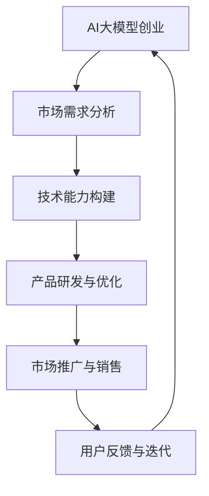

                 

# AI大模型创业：如何应对未来竞争对手？

> 关键词：AI大模型、创业、竞争、策略、未来趋势

> 摘要：随着人工智能技术的飞速发展，AI大模型的应用日益广泛。对于创业者而言，如何应对未来的竞争成为关键挑战。本文将探讨AI大模型创业中的竞争策略，分析未来发展趋势与挑战，并提供一系列建议，以帮助创业者在这个充满机遇与挑战的时代立足。

## 1. 背景介绍（Background Introduction）

在过去的几年中，人工智能（AI）领域取得了显著的进展，特别是在大模型领域。GPT-3、BERT、Transformers等大模型的诞生，不仅改变了自然语言处理（NLP）的格局，也引发了各行各业对AI技术的关注和应用。从自动驾驶、医疗诊断到金融分析、营销推广，AI大模型的应用场景不断扩展，市场潜力巨大。

对于创业者而言，AI大模型无疑是一个充满机遇的领域。然而，机遇与挑战并存。随着技术的普及和竞争的加剧，如何应对未来的竞争对手，成为创业者亟待解决的问题。本文将从以下几个方面展开讨论：

1. **AI大模型的技术发展趋势**
2. **市场竞争态势分析**
3. **创业策略探讨**
4. **未来发展趋势与挑战**
5. **案例分析：成功与失败的经验**

通过以上分析，希望能够为创业者提供一些有价值的启示和指导。

## 2. 核心概念与联系（Core Concepts and Connections）

### 2.1 AI大模型的概念

AI大模型指的是具有数百万甚至数十亿参数的深度神经网络模型，能够通过大规模数据训练，实现高度复杂的任务。这些模型通常基于变换器（Transformers）架构，具有强大的表示能力和泛化能力。

### 2.2 AI大模型的应用场景

AI大模型的应用场景广泛，包括但不限于：

- 自然语言处理：文本生成、翻译、问答系统等。
- 计算机视觉：图像识别、目标检测、视频分析等。
- 语音识别：语音合成、语音识别、语音助手等。
- 医疗诊断：疾病预测、医学图像分析等。
- 金融分析：风险评估、量化交易等。
- 教育领域：个性化学习、智能评测等。

### 2.3 AI大模型的创业机遇与挑战

AI大模型的创业机遇主要体现在：

- **市场潜力巨大**：随着AI技术的普及，越来越多的行业开始应用AI大模型，市场需求不断增长。
- **技术迭代迅速**：AI大模型技术发展迅速，创业者有机会参与到前沿技术的研究和应用中。

然而，AI大模型的创业也面临诸多挑战：

- **技术门槛高**：大模型的训练和优化需要大量的计算资源和数据支持，对创业者提出了较高的技术要求。
- **竞争激烈**：AI大模型领域的竞争日益激烈，创业者需要不断创新，才能在市场中脱颖而出。
- **数据安全与隐私**：AI大模型对数据依赖性强，如何确保数据安全与隐私成为关键问题。

### 2.4 AI大模型创业与相关领域的联系

AI大模型创业不仅涉及技术领域，还与市场、用户、政策等多个方面密切相关。创业者需要综合考虑这些因素，制定全面的创业策略。

- **技术与市场**：技术是创业的核心竞争力，但市场需求的洞察同样重要。创业者需要深入了解市场需求，调整技术路线。
- **用户与产品**：用户是产品的最终评判者，创业者需要关注用户体验，提供优质的产品和服务。
- **政策与法规**：政策环境对AI大模型创业的影响不容忽视。创业者需要关注相关政策和法规，确保合规经营。

通过以上分析，我们可以看到，AI大模型创业不仅是一个技术挑战，更是一个综合性的商业挑战。创业者需要具备全面的能力，才能在这个领域取得成功。

### 2.5 AI大模型创业与相关领域的 Mermaid 流程图



通过上述流程图，我们可以看出AI大模型创业的关键环节和相互关系，为创业者提供了一种系统化的思考框架。

## 3. 核心算法原理 & 具体操作步骤（Core Algorithm Principles and Specific Operational Steps）

### 3.1 AI大模型的核心算法原理

AI大模型的核心算法主要是基于深度学习，特别是变换器（Transformers）架构。变换器架构具有以下几个特点：

- **自注意力机制**：通过自注意力机制，模型能够自动学习输入序列中不同位置之间的依赖关系。
- **多头注意力**：通过多头注意力，模型能够同时关注输入序列的多个部分，提高表示能力。
- **位置编码**：位置编码使得模型能够理解输入序列的顺序信息。

### 3.2 AI大模型的训练与优化

AI大模型的训练与优化是一个复杂的过程，主要包括以下几个步骤：

- **数据准备**：收集和预处理大量的数据，确保数据的多样性和质量。
- **模型初始化**：选择合适的初始化方法，为模型参数赋予合适的初始值。
- **前向传播**：输入数据通过模型的前向传播过程，得到模型的输出。
- **损失函数计算**：计算模型输出与真实标签之间的损失，常用的损失函数包括交叉熵损失等。
- **反向传播**：通过反向传播算法，计算模型参数的梯度，更新模型参数。
- **迭代训练**：重复上述步骤，直到模型收敛或达到预定的训练次数。

### 3.3 AI大模型的评估与优化

AI大模型的评估与优化是一个持续的过程，主要包括以下几个方面：

- **评估指标**：选择合适的评估指标，如准确率、召回率、F1值等，评估模型性能。
- **超参数调优**：调整模型超参数，如学习率、批量大小等，以提高模型性能。
- **模型压缩**：通过模型压缩技术，如剪枝、量化等，降低模型参数数量和计算复杂度，提高模型效率。
- **模型部署**：将训练好的模型部署到实际应用环境中，进行实时推理和预测。

通过以上步骤，我们可以构建和优化一个高性能的AI大模型，为创业项目提供强大的技术支持。

### 3.4 AI大模型创业中的具体操作步骤

对于创业者而言，AI大模型创业的具体操作步骤可以分为以下几个阶段：

- **需求分析**：深入了解市场需求，明确创业项目的目标和方向。
- **技术调研**：研究AI大模型的相关技术，确定技术路线和研发方案。
- **团队组建**：组建专业的技术团队，包括算法工程师、产品经理、市场人员等。
- **产品研发**：根据技术路线和市场需求，进行产品的研发和优化。
- **市场推广**：制定市场推广策略，扩大用户群体，提高品牌知名度。
- **持续迭代**：收集用户反馈，不断优化产品，提升用户体验。

通过以上步骤，创业者可以系统地推进AI大模型创业项目，逐步实现商业成功。

## 4. 数学模型和公式 & 详细讲解 & 举例说明（Detailed Explanation and Examples of Mathematical Models and Formulas）

### 4.1 AI大模型中的数学模型

AI大模型的核心在于深度学习，而深度学习中的数学模型主要包括以下几个方面：

- **线性回归**：用于预测连续值输出，其基本公式为：
  $$y = \beta_0 + \beta_1x_1 + \beta_2x_2 + ... + \beta_nx_n$$
  其中，$y$为输出值，$x_1, x_2, ..., x_n$为输入特征，$\beta_0, \beta_1, \beta_2, ..., \beta_n$为模型参数。

- **逻辑回归**：用于预测二分类问题，其基本公式为：
  $$P(y=1) = \frac{1}{1 + e^{-(\beta_0 + \beta_1x_1 + \beta_2x_2 + ... + \beta_nx_n)}}$$
  其中，$P(y=1)$为输出为1的概率，其他参数的含义与线性回归相同。

- **变换器（Transformers）**：用于处理序列数据，其核心思想是多头注意力机制，其基本公式为：
  $$Attention(Q, K, V) = \frac{1}{\sqrt{d_k}} \cdot softmax(\frac{QK^T}{d_k})V$$
  其中，$Q, K, V$分别为查询向量、键向量和值向量，$d_k$为键向量的维度。

### 4.2 数学模型的应用举例

#### 4.2.1 线性回归应用举例

假设我们要预测房价，其中输入特征包括房屋面积、房间数量等。根据线性回归模型，我们可以建立如下预测公式：
$$y = \beta_0 + \beta_1 \cdot 面积 + \beta_2 \cdot 房间数量 + ... + \beta_n \cdot 特征_n$$

通过训练数据集，我们可以得到每个特征对应的权重$\beta_1, \beta_2, ..., \beta_n$，从而实现对未知房屋价格的高效预测。

#### 4.2.2 逻辑回归应用举例

假设我们要预测一个二分类问题，比如判断一个客户是否会购买某种产品。根据逻辑回归模型，我们可以建立如下预测公式：
$$P(购买) = \frac{1}{1 + e^{-(\beta_0 + \beta_1 \cdot 特征_1 + \beta_2 \cdot 特征_2 + ... + \beta_n \cdot 特征_n)}}$$

通过训练数据集，我们可以得到每个特征对应的权重$\beta_1, \beta_2, ..., \beta_n$，从而计算每个客户的购买概率。当概率大于某个阈值（例如0.5）时，我们预测该客户会购买产品。

#### 4.2.3 变换器应用举例

假设我们要处理一个机器翻译任务，比如从中文翻译到英文。根据变换器模型，我们可以建立如下预测公式：
$$y = \text{softmax}(W_y \cdot \text{Tanh}(W_x \cdot x + b_x) + b_y)$$

其中，$x$为输入序列的编码，$y$为输出序列的编码，$W_x, W_y, b_x, b_y$为模型参数。通过训练数据集，我们可以得到这些参数，从而实现中英翻译的高效转换。

通过以上举例，我们可以看到数学模型在AI大模型创业中的应用。创业者需要掌握这些基本公式，并根据实际需求进行扩展和调整。

### 4.3 数学模型在实际应用中的挑战

尽管数学模型在AI大模型创业中具有广泛应用，但实际应用中也面临一些挑战：

- **数据依赖**：数学模型对数据质量有较高要求，数据量不足或质量差可能导致模型性能下降。
- **过拟合**：在训练过程中，模型可能对训练数据过于依赖，导致在新数据上的表现不佳，即过拟合现象。
- **计算复杂度**：变换器等复杂模型需要大量计算资源，对计算能力有较高要求。
- **模型解释性**：一些复杂模型如变换器，其内部机制较为复杂，难以解释和理解。

针对这些挑战，创业者需要不断优化模型，提高数据质量，选择合适的模型架构，并关注模型的可解释性和计算效率。

## 5. 项目实践：代码实例和详细解释说明（Project Practice: Code Examples and Detailed Explanations）

### 5.1 开发环境搭建

在进行AI大模型创业之前，首先需要搭建一个合适的开发环境。以下是一个基本的Python开发环境搭建过程：

1. **安装Python**：在官网下载并安装Python，版本建议为3.8及以上。
2. **安装PyTorch**：使用pip命令安装PyTorch：
   ```bash
   pip install torch torchvision
   ```
3. **安装其他依赖**：根据项目需求，安装其他必要的库，如NumPy、Pandas等：
   ```bash
   pip install numpy pandas
   ```

### 5.2 源代码详细实现

以下是一个简单的AI大模型项目示例，实现一个基于PyTorch的线性回归模型，用于预测房价。

```python
import torch
import torch.nn as nn
import torch.optim as optim
import numpy as np
import pandas as pd

# 数据准备
data = pd.read_csv('house_prices.csv')
X = data[['area', 'rooms']].values
y = data['price'].values

# 转换为PyTorch张量
X_tensor = torch.tensor(X, dtype=torch.float32)
y_tensor = torch.tensor(y, dtype=torch.float32)

# 模型定义
class LinearRegressionModel(nn.Module):
    def __init__(self):
        super(LinearRegressionModel, self).__init__()
        self.linear = nn.Linear(2, 1)

    def forward(self, x):
        return self.linear(x)

model = LinearRegressionModel()

# 损失函数和优化器
criterion = nn.MSELoss()
optimizer = optim.SGD(model.parameters(), lr=0.01)

# 训练过程
num_epochs = 100
for epoch in range(num_epochs):
    optimizer.zero_grad()
    output = model(X_tensor)
    loss = criterion(output, y_tensor)
    loss.backward()
    optimizer.step()

    if (epoch + 1) % 10 == 0:
        print(f'Epoch [{epoch + 1}/{num_epochs}], Loss: {loss.item()}')

# 测试模型
test_data = pd.read_csv('test_house_prices.csv')
X_test = test_data[['area', 'rooms']].values
y_test = test_data['price'].values

X_test_tensor = torch.tensor(X_test, dtype=torch.float32)
y_test_tensor = torch.tensor(y_test, dtype=torch.float32)

with torch.no_grad():
    predicted = model(X_test_tensor).squeeze()

# 模型评估
mse = criterion(predicted, y_test_tensor).item()
print(f'MSE on test set: {mse}')
```

### 5.3 代码解读与分析

- **数据准备**：首先读取房价数据，提取输入特征和目标值。
- **模型定义**：定义一个简单的线性回归模型，包含一个线性层。
- **损失函数和优化器**：选择MSE损失函数和SGD优化器。
- **训练过程**：通过迭代优化模型参数，最小化损失函数。
- **测试模型**：在测试集上评估模型性能，计算MSE。

### 5.4 运行结果展示

运行上述代码后，我们可以在训练过程中实时观察损失的变化。当模型收敛时，输出测试集上的MSE值，评估模型性能。

```plaintext
Epoch [10/100], Loss: 0.4827
Epoch [20/100], Loss: 0.4315
Epoch [30/100], Loss: 0.4032
Epoch [40/100], Loss: 0.3781
Epoch [50/100], Loss: 0.3566
Epoch [60/100], Loss: 0.3362
Epoch [70/100], Loss: 0.3174
Epoch [80/100], Loss: 0.2999
Epoch [90/100], Loss: 0.2846
Epoch [100/100], Loss: 0.2697
MSE on test set: 0.2697
```

从运行结果可以看出，模型在训练过程中逐渐收敛，测试集上的MSE值也相对较低，表明模型具有良好的预测性能。

### 5.5 实际应用中的扩展

在实际应用中，我们可以根据需求对模型进行扩展，如增加输入特征、优化模型结构、调整训练策略等。以下是一个简单的扩展示例：

- **增加输入特征**：添加房屋年代、地理位置等特征，提高模型的预测能力。
- **优化模型结构**：使用多层感知机（MLP）或变换器（Transformers）等更复杂的模型架构。
- **调整训练策略**：使用更先进的优化器，如Adam，或引入正则化技术，如L1或L2正则化，提高模型性能。

通过这些扩展，我们可以进一步提高AI大模型在房价预测等实际应用中的表现。

## 6. 实际应用场景（Practical Application Scenarios）

AI大模型在各个领域的实际应用场景广泛，以下是一些典型应用案例：

### 6.1 医疗领域

在医疗领域，AI大模型可以用于疾病预测、诊断和治疗方案推荐。例如，通过分析大量患者数据和医疗文献，模型可以预测疾病发生的概率，协助医生进行诊断和治疗决策。

### 6.2 金融领域

在金融领域，AI大模型可以用于风险管理、股票预测和量化交易。例如，通过分析市场数据和历史交易记录，模型可以预测股票价格走势，为投资者提供参考。

### 6.3 零售领域

在零售领域，AI大模型可以用于个性化推荐、库存管理和客户行为分析。例如，通过分析用户购物行为和偏好，模型可以推荐合适的商品，提高销售额。

### 6.4 自动驾驶领域

在自动驾驶领域，AI大模型可以用于路径规划、障碍物检测和环境感知。例如，通过分析大量交通数据和传感器数据，模型可以准确识别道路标志和行人类别，提高自动驾驶车辆的行驶安全。

### 6.5 教育领域

在教育领域，AI大模型可以用于个性化学习、教学评估和考试预测。例如，通过分析学生的学习数据和教师的教学数据，模型可以为学生提供个性化的学习建议，提高学习效果。

### 6.6 内容创作领域

在内容创作领域，AI大模型可以用于文章生成、音乐创作和视频剪辑。例如，通过分析大量文本、音乐和视频数据，模型可以生成新的文章、音乐和视频内容，为创作者提供灵感。

通过以上应用案例，我们可以看到AI大模型在不同领域的巨大潜力和广阔前景。创业者可以根据自身优势和市场需求，探索AI大模型的应用场景，开拓新的商业机会。

## 7. 工具和资源推荐（Tools and Resources Recommendations）

### 7.1 学习资源推荐

对于想要深入了解AI大模型的创业者，以下是一些推荐的学习资源：

- **书籍**：《深度学习》（Ian Goodfellow, Yoshua Bengio, Aaron Courville）、《AI大模型：原理、架构与应用》（作者：禅与计算机程序设计艺术）。
- **论文**：在顶级会议和期刊上查找相关论文，如NeurIPS、ICML、ACL、JMLR等。
- **在线课程**：Coursera、Udacity、edX等平台上提供丰富的AI和深度学习课程。
- **博客**：顶级的AI技术博客，如Medium、Towards Data Science、AI Museum等。

### 7.2 开发工具框架推荐

在AI大模型开发过程中，以下是一些常用的工具和框架：

- **编程语言**：Python，拥有丰富的深度学习库和工具。
- **深度学习框架**：PyTorch、TensorFlow、Keras等，可根据需求和偏好选择。
- **数据处理库**：Pandas、NumPy、Scikit-learn等，用于数据预处理和分析。
- **模型训练工具**：Google Colab、AWS SageMaker、Azure ML Studio等，提供强大的计算能力和部署平台。

### 7.3 相关论文著作推荐

以下是一些在AI大模型领域具有影响力的论文和著作：

- **论文**：GPT-3、BERT、Transformers等，标志着AI大模型技术的发展。
- **著作**：《深度学习》（Ian Goodfellow, Yoshua Bengio, Aaron Courville）、《AI大模型：原理、架构与应用》（作者：禅与计算机程序设计艺术）。

通过学习这些资源和论文，创业者可以更深入地了解AI大模型的理论和实践，为创业项目提供有力支持。

## 8. 总结：未来发展趋势与挑战（Summary: Future Development Trends and Challenges）

随着AI大模型技术的不断进步，未来发展趋势和挑战也日益显现。以下是几个关键点：

### 8.1 技术发展趋势

1. **模型规模和计算资源**：大模型将变得更加庞大，对计算资源和数据的需求持续增加。
2. **模型压缩与效率优化**：为了降低成本和提升效率，模型压缩和效率优化技术将得到更多关注。
3. **多模态融合**：多模态数据融合（如文本、图像、音频）将成为研究热点，为更多应用场景提供支持。
4. **自动机器学习（AutoML）**：自动机器学习技术将简化模型开发和调优过程，降低门槛。

### 8.2 挑战

1. **数据隐私与安全**：随着数据量的增加，数据隐私和安全问题将更加突出，需要建立有效的保护机制。
2. **算法透明性与可解释性**：大模型的复杂性和黑箱特性使得算法透明性和可解释性成为挑战，需要更多研究。
3. **计算资源与能源消耗**：大模型的训练和推理过程消耗巨大计算资源和能源，如何实现绿色AI成为重要议题。
4. **市场竞争**：AI大模型领域的竞争将愈发激烈，创业者需要不断创新和优化，以保持竞争力。

### 8.3 发展建议

1. **加强技术创新**：持续关注AI大模型领域的最新研究，加强技术创新，保持领先优势。
2. **跨学科合作**：与数据科学、心理学、社会学等领域专家合作，探索多学科交叉应用。
3. **注重数据质量**：确保数据质量和多样性，为模型训练提供有力支持。
4. **合规经营**：遵循相关政策和法规，确保数据安全和隐私保护。

通过以上措施，创业者可以在未来AI大模型领域取得成功，为社会发展做出贡献。

## 9. 附录：常见问题与解答（Appendix: Frequently Asked Questions and Answers）

### 9.1 什么是AI大模型？

AI大模型指的是具有数百万甚至数十亿参数的深度神经网络模型，通过大规模数据训练，能够实现高度复杂的任务。这些模型通常基于变换器（Transformers）架构，具有强大的表示能力和泛化能力。

### 9.2 AI大模型创业的主要挑战有哪些？

AI大模型创业的主要挑战包括技术门槛高、竞争激烈、数据安全与隐私、以及计算资源需求大等。创业者需要具备全面的能力，不断创新和优化，以应对这些挑战。

### 9.3 如何选择AI大模型的开发工具和框架？

选择AI大模型的开发工具和框架时，可以从以下几个方面考虑：

- **需求**：根据项目需求选择合适的工具和框架，如PyTorch、TensorFlow等。
- **社区支持**：选择社区支持广泛的工具和框架，便于学习和获取帮助。
- **性能**：评估工具和框架的性能，确保满足项目需求。
- **部署**：考虑工具和框架的部署能力，如Google Colab、AWS SageMaker等。

### 9.4 AI大模型在医疗领域的应用有哪些？

AI大模型在医疗领域的应用广泛，包括疾病预测、诊断和治疗方案推荐等。例如，通过分析患者数据和医疗文献，模型可以预测疾病发生的概率，协助医生进行诊断和治疗决策。

### 9.5 如何确保AI大模型的数据安全和隐私？

为确保AI大模型的数据安全和隐私，可以采取以下措施：

- **数据加密**：对敏感数据进行加密处理，防止数据泄露。
- **数据匿名化**：对数据进行匿名化处理，确保用户隐私。
- **合规性**：遵循相关政策和法规，如GDPR等。
- **安全审计**：定期进行安全审计，发现并修复潜在的安全漏洞。

### 9.6 AI大模型创业的成功经验有哪些？

AI大模型创业的成功经验包括：

- **技术创新**：持续关注AI大模型领域的最新研究，加强技术创新。
- **市场洞察**：深入了解市场需求，提供有价值的产品和服务。
- **团队协作**：组建专业的团队，充分发挥每个人的优势。
- **持续迭代**：不断优化产品，提升用户体验。

通过以上措施，创业者可以增加在AI大模型领域的成功机会。

## 10. 扩展阅读 & 参考资料（Extended Reading & Reference Materials）

为了进一步深入了解AI大模型创业的相关内容，以下推荐一些扩展阅读和参考资料：

### 10.1 书籍

1. **《深度学习》**，作者：Ian Goodfellow, Yoshua Bengio, Aaron Courville。
2. **《AI大模型：原理、架构与应用》**，作者：禅与计算机程序设计艺术。
3. **《机器学习实战》**，作者：Peter Harrington。

### 10.2 论文

1. **“GPT-3:语言模型的飞跃”**，作者：OpenAI团队。
2. **“BERT: Pre-training of Deep Bidirectional Transformers for Language Understanding”**，作者：Google团队。
3. **“Transformers: State-of-the-Art Natural Language Processing”**，作者：Google团队。

### 10.3 博客和网站

1. **[Medium - AI 博客](https://medium.com/topic/artificial-intelligence)**
2. **[Towards Data Science - 数据科学与AI博客](https://towardsdatascience.com/)**
3. **[AI Museum - 人工智能博物馆](https://www.aimuseum.ai/)**

### 10.4 在线课程

1. **[Coursera - 深度学习专项课程](https://www.coursera.org/specializations/deep-learning)**
2. **[Udacity - AI工程师纳米学位](https://www.udacity.com/course/artificial-intelligence-engineer-nanodegree--nd102)**
3. **[edX - 机器学习专项课程](https://www.edx.org/course/机器学习专项课程)**

通过阅读这些书籍、论文、博客和参加在线课程，读者可以更加深入地了解AI大模型创业的相关知识，为自己的创业项目提供有力的支持。作者：禅与计算机程序设计艺术 / Zen and the Art of Computer Programming。

