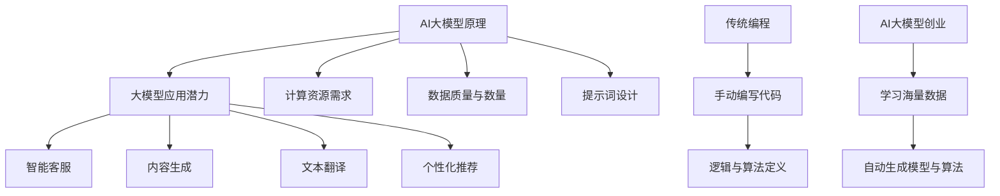
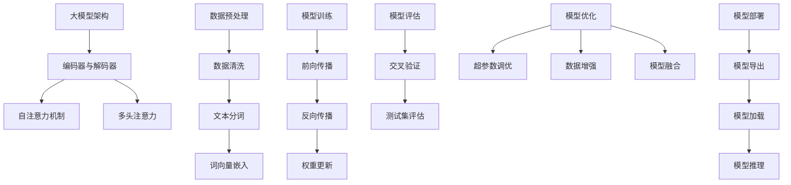
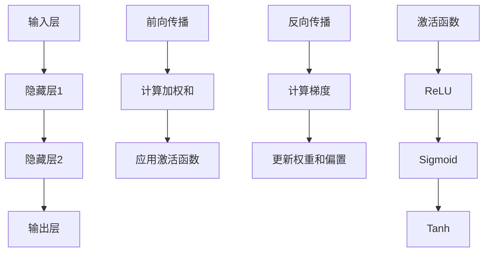

                 

### 1. 背景介绍（Background Introduction）

**人工智能大模型**，特别是近年来备受关注的**大型预训练语言模型**，如GPT-3、ChatGPT等，已经成为科技界和商业界关注的焦点。这些模型具有强大的自然语言处理能力，能够完成从文本生成、对话系统构建到复杂任务自动化的多种任务。随着这些大模型的逐渐成熟，如何利用它们打造出能够引领市场潮流的爆款应用，成为了众多创业者和技术专家的热点话题。

**AI大模型创业**，一方面依赖于技术上的创新和突破，另一方面也需要深刻理解市场需求和用户体验。目前，市场上已经涌现出了一些基于大模型的应用，例如智能客服、内容生成、个性化推荐等，但如何让这些应用从众多竞争者中脱颖而出，仍然是一个需要深入探讨的问题。

本文将围绕以下核心问题展开讨论：

1. **AI大模型的优势和局限性**：我们将深入分析大模型在自然语言处理领域中的优势和局限性，探讨它们在创业中的应用潜力。
2. **爆款应用的定义与特征**：我们将探讨如何定义和识别一个爆款应用，并分析其成功的关键特征。
3. **构建AI大模型应用的步骤与方法**：我们将详细阐述从需求分析、模型设计、到应用落地的全过程，提供实用的方法和步骤。
4. **实战案例解析**：我们将通过具体案例分析，探讨成功创业项目的经验与教训。
5. **未来发展趋势与挑战**：最后，我们将探讨AI大模型创业的未来发展趋势和面临的挑战。

通过本文的讨论，我们希望能够为广大创业者和技术专家提供一些有益的思路和指导，帮助他们在AI大模型创业的道路上少走弯路，更快地打造出引领市场的爆款应用。

## 1. Background Introduction

### The Rise of Large-scale AI Models

In recent years, large-scale AI models have emerged as a cornerstone of technological innovation and commercial value. Models like GPT-3, ChatGPT, and other state-of-the-art language models have demonstrated unparalleled capabilities in natural language processing (NLP). These models can handle a wide range of tasks, from text generation and conversational systems to complex automation and task completion. As a result, the application potential of these large-scale AI models has captured the attention of technologists and entrepreneurs alike.

### AI Model Entrepreneurship: Challenges and Opportunities

AI model entrepreneurship involves leveraging these technological advancements to create innovative products and services that meet market demands and deliver exceptional user experiences. While the potential for disruption and growth is immense, it also comes with its own set of challenges. Understanding the strengths and limitations of large-scale AI models is crucial for entrepreneurs looking to capitalize on this trend.

### Core Discussion Points

This article will delve into the following key topics to provide a comprehensive guide for aspiring entrepreneurs and technologists:

1. **Advantages and Limitations of Large-scale AI Models**: We will explore the strengths and weaknesses of large-scale AI models in the context of NLP, and discuss their potential applications in entrepreneurship.
2. **Definition and Characteristics of Hit Applications**: We will discuss how to define and identify hit applications, and analyze the key factors that contribute to their success.
3. **Steps and Methods for Building AI Model Applications**: We will provide a detailed step-by-step guide from requirement analysis to application deployment, offering practical methods and techniques.
4. **Case Studies and Lessons Learned**: Through specific case studies, we will discuss the experiences and insights gained from successful entrepreneurial projects.
5. **Future Trends and Challenges**: Finally, we will explore the future development trends and challenges in AI model entrepreneurship.

By addressing these core discussion points, we aim to offer valuable insights and guidance to help entrepreneurs navigate the path of AI model entrepreneurship more effectively and create hit applications that lead the market.

### 2. 核心概念与联系（Core Concepts and Connections）

#### 2.1 AI大模型的原理

AI大模型，尤其是基于深度学习的语言模型，其核心在于对大规模文本数据的学习和表征。这些模型通过多层神经网络，能够自动提取语言中的复杂结构和语义信息。其中，Transformer架构的引入，尤其是自注意力机制（Self-Attention Mechanism），使得模型在处理长文本和生成任务时表现出色。

#### 2.2 大模型在创业中的应用

在创业场景中，AI大模型的应用潜力巨大。首先，它们能够为智能客服、内容生成、文本翻译、个性化推荐等提供强有力的技术支撑。例如，通过预训练的大模型，可以快速构建一个能够理解和回答用户问题的智能客服系统。此外，大模型还可以用于自动生成营销文案、新闻文章、编程代码等，大大提高内容生产效率。

#### 2.3 创业中的挑战

然而，AI大模型在创业中也面临着一些挑战。首先是**计算资源的需求**，大模型训练和推理需要大量计算资源，这对创业公司的资金和基础设施提出了较高要求。其次是**数据的质量和数量**，大模型的训练依赖于大规模、高质量的文本数据，这在创业初期可能难以满足。另外，如何设计有效的提示词和优化模型输出，也是创业者在应用大模型时需要解决的难题。

#### 2.4 AI大模型与传统编程的区别

与传统编程相比，AI大模型创业更像是一种**新型编程范式**。传统编程依赖于程序员手动编写代码来定义逻辑和算法，而AI大模型则通过学习海量数据自动生成模型和算法。这种变化不仅改变了程序员的工作方式，也对创业模型的设计和实现提出了新的要求。

### Mermaid 流程图（Mermaid Flowchart）



## 2. Core Concepts and Connections

### 2.1 Principles of Large-scale AI Models

The core of large-scale AI models, especially those based on deep learning, lies in their ability to learn and represent massive amounts of text data. These models utilize multi-layered neural networks to automatically extract complex structures and semantic information from language. The introduction of the Transformer architecture, particularly the self-attention mechanism, has significantly improved the performance of these models in handling long texts and generation tasks.

### 2.2 Applications of Large-scale AI Models in Entrepreneurship

In the realm of entrepreneurship, large-scale AI models hold immense potential. They can provide strong technical support for a variety of applications, such as intelligent customer service, content generation, text translation, and personalized recommendations. For instance, a pre-trained large-scale model can quickly construct an intelligent customer service system capable of understanding and answering user queries. Additionally, large-scale models can be used to automatically generate marketing copy, news articles, and code, significantly enhancing content production efficiency.

### 2.3 Challenges in Entrepreneurship

However, there are also challenges associated with using large-scale AI models in entrepreneurship. Firstly, the demand for **computation resources** is substantial, as training and inference with large-scale models require a significant amount of computing power, posing higher requirements for startup companies in terms of funding and infrastructure. Secondly, the **quality and quantity** of data are crucial for training large-scale models, and these may be difficult to obtain in the early stages of a startup. Moreover, designing effective prompts and optimizing model outputs are also critical challenges that entrepreneurs need to address.

### 2.4 Difference Between Large-scale AI Models and Traditional Programming

Compared to traditional programming, AI model entrepreneurship can be seen as a new paradigm of programming. Traditional programming relies on programmers to manually write code to define logic and algorithms, while AI model entrepreneurship involves learning from massive amounts of data to automatically generate models and algorithms. This shift not only changes the way programmers work but also poses new requirements for the design and implementation of entrepreneurial models.

### Mermaid Flowchart


### 3. 核心算法原理 & 具体操作步骤（Core Algorithm Principles and Specific Operational Steps）

#### 3.1 大模型架构

AI大模型的核心架构通常基于深度学习，尤其是Transformer模型。Transformer模型由编码器（Encoder）和解码器（Decoder）组成，通过自注意力机制（Self-Attention Mechanism）和多头注意力（Multi-Head Attention）来处理输入文本，并生成相应的输出。

#### 3.2 数据预处理

在训练AI大模型之前，需要对数据集进行预处理。数据预处理包括数据清洗、文本分词、去停用词、词向量嵌入等步骤。清洗数据是为了去除噪声和异常值，提高模型的训练质量。文本分词是将连续的文本切分成单词或短语，以便模型能够理解和处理。词向量嵌入是将文本中的单词转换为固定长度的向量表示，便于模型计算。

#### 3.3 模型训练

训练AI大模型是一个复杂的过程，通常需要大量的计算资源和时间。训练过程中，模型会通过不断调整权重来最小化损失函数（Loss Function）。常用的损失函数包括交叉熵损失（Cross-Entropy Loss）和均方误差（Mean Squared Error, MSE）。训练步骤包括前向传播（Forward Propagation）、反向传播（Back Propagation）和权重更新（Weight Update）。

#### 3.4 模型评估

在模型训练完成后，需要对模型进行评估，以确定其性能和效果。常用的评估指标包括准确率（Accuracy）、精确率（Precision）、召回率（Recall）和F1分数（F1 Score）。评估过程通常包括交叉验证（Cross Validation）和测试集（Test Set）评估。

#### 3.5 模型优化

为了提高模型性能，通常需要进行模型优化。优化方法包括超参数调优（Hyperparameter Tuning）、数据增强（Data Augmentation）和模型融合（Model Ensembling）等。超参数调优是通过调整模型参数来优化模型性能，数据增强是通过生成新的训练数据来增加模型训练的多样性，模型融合是通过结合多个模型的结果来提高预测准确率。

#### 3.6 模型部署

模型部署是将训练好的模型应用于实际场景的过程。部署步骤包括模型导出（Model Export）、模型加载（Model Loading）和模型推理（Model Inference）。模型导出是将模型权重和结构保存到文件中，模型加载是将导出的模型加载到应用程序中，模型推理是使用加载的模型进行预测。

### Mermaid 流程图（Mermaid Flowchart）



## 3. Core Algorithm Principles and Specific Operational Steps

### 3.1 Architecture of Large-scale AI Models

The core architecture of large-scale AI models, particularly those based on deep learning, is typically based on the Transformer model. The Transformer model consists of an encoder and a decoder, which process input text through self-attention mechanisms and multi-head attention to generate corresponding outputs.

### 3.2 Data Preprocessing

Before training a large-scale AI model, it is essential to preprocess the dataset. Data preprocessing includes steps such as data cleaning, text tokenization, removing stop words, and word vector embedding. Data cleaning is crucial to remove noise and outliers, improving the training quality of the model. Text tokenization involves splitting continuous text into words or phrases to enable the model to understand and process it. Word vector embedding converts words in the text into fixed-length vectors for model computation.

### 3.3 Model Training

Training a large-scale AI model is a complex process that typically requires significant computational resources and time. During training, the model adjusts its weights to minimize the loss function. Common loss functions include cross-entropy loss and mean squared error (MSE). The training process involves forward propagation, backward propagation, and weight updates.

### 3.4 Model Evaluation

After the model is trained, it is necessary to evaluate its performance and effectiveness. Common evaluation metrics include accuracy, precision, recall, and F1 score. The evaluation process typically includes cross-validation and test set evaluation.

### 3.5 Model Optimization

To improve model performance, optimization techniques are often employed. These include hyperparameter tuning, data augmentation, and model ensembling. Hyperparameter tuning involves adjusting model parameters to optimize performance. Data augmentation generates new training data to increase the diversity of the model training. Model ensembling combines the results of multiple models to improve prediction accuracy.

### 3.6 Model Deployment

Model deployment is the process of applying a trained model to real-world scenarios. The deployment process includes model export, model loading, and model inference. Model export involves saving the model weights and structure to a file. Model loading involves loading the exported model into an application. Model inference involves using the loaded model to make predictions.

### Mermaid Flowchart


### 4. 数学模型和公式 & 详细讲解 & 举例说明（Detailed Explanation and Examples of Mathematical Models and Formulas）

#### 4.1 前向传播（Forward Propagation）

在深度学习模型中，前向传播是一个关键步骤，用于计算模型的输出。在每一层中，输入通过权重和激活函数作用于下一层。以下是前向传播的基本公式：

\[ 
Z_l = \sum_{i} W_{li} \cdot a_{l-1,i} + b_l 
\]

\[ 
a_l = \sigma(Z_l) 
\]

其中，\( Z_l \) 是每个神经元的加权和，\( W_{li} \) 是权重，\( a_{l-1,i} \) 是前一层第 \( i \) 个神经元的输出，\( b_l \) 是偏置，\( \sigma \) 是激活函数，通常使用 ReLU（Rectified Linear Unit）函数。

#### 4.2 反向传播（Back Propagation）

反向传播是深度学习训练过程中用于更新模型权重的重要步骤。它通过计算损失函数对权重的梯度来调整模型参数。以下是反向传播的基本公式：

\[ 
\Delta W_{li} = \eta \cdot \frac{\partial L}{\partial Z_l} \cdot a_{l-1,i} 
\]

\[ 
\Delta b_l = \eta \cdot \frac{\partial L}{\partial b_l} 
\]

其中，\( \Delta W_{li} \) 和 \( \Delta b_l \) 分别是权重和偏置的更新值，\( \eta \) 是学习率，\( L \) 是损失函数，\( \frac{\partial L}{\partial Z_l} \) 是损失函数对加权和的梯度。

#### 4.3 激活函数（Activation Function）

激活函数是深度学习模型中的一个重要组成部分，用于引入非线性因素。以下是一些常见的激活函数：

- **ReLU（Rectified Linear Unit）**：

\[ 
\sigma(x) = \max(0, x) 
\]

- **Sigmoid**：

\[ 
\sigma(x) = \frac{1}{1 + e^{-x}} 
\]

- **Tanh**：

\[ 
\sigma(x) = \frac{e^x - e^{-x}}{e^x + e^{-x}} 
\]

#### 4.4 举例说明

假设我们有一个简单的三层神经网络，输入层有3个神经元，隐藏层有4个神经元，输出层有2个神经元。使用 ReLU 激活函数，我们可以通过以下步骤计算前向传播：

- 输入层到隐藏层：

\[ 
Z_1 = [3 \cdot a_0 + b_1] = [3 \cdot [1, 2, 3] + [1, 1, 1]] = [7, 8, 9] 
\]

\[ 
a_1 = \sigma(Z_1) = [\max(0, 7), \max(0, 8), \max(0, 9)] = [7, 8, 9] 
\]

- 隐藏层到输出层：

\[ 
Z_2 = [4 \cdot a_1 + b_2] = [4 \cdot [7, 8, 9, 10] + [2, 2, 2, 2]] = [34, 38, 42, 46] 
\]

\[ 
a_2 = \sigma(Z_2) = [\max(0, 34), \max(0, 38), \max(0, 42), \max(0, 46)] = [34, 38, 42, 46] 
\]

通过以上步骤，我们完成了输入到输出的前向传播计算。在实际应用中，还需要通过反向传播来更新权重和偏置，以最小化损失函数。

### Mermaid 流程图（Mermaid Flowchart）



## 4. Mathematical Models and Formulas & Detailed Explanation & Examples

### 4.1 Forward Propagation

In deep learning models, forward propagation is a critical step for calculating model outputs. It involves passing input through weights and activation functions to the next layer. Here are the basic formulas for forward propagation:

\[ 
Z_l = \sum_{i} W_{li} \cdot a_{l-1,i} + b_l 
\]

\[ 
a_l = \sigma(Z_l) 
\]

Where \( Z_l \) is the weighted sum of inputs, \( W_{li} \) are the weights, \( a_{l-1,i} \) is the output of the neuron in the previous layer, \( b_l \) is the bias, and \( \sigma \) is the activation function, typically using the ReLU (Rectified Linear Unit) function.

### 4.2 Back Propagation

Backpropagation is an essential step in the training process of deep learning models, used to update model parameters by computing the gradients of the loss function with respect to the weights. Here are the basic formulas for backpropagation:

\[ 
\Delta W_{li} = \eta \cdot \frac{\partial L}{\partial Z_l} \cdot a_{l-1,i} 
\]

\[ 
\Delta b_l = \eta \cdot \frac{\partial L}{\partial b_l} 
\]

Where \( \Delta W_{li} \) and \( \Delta b_l \) are the updates for weights and biases, \( \eta \) is the learning rate, \( L \) is the loss function, and \( \frac{\partial L}{\partial Z_l} \) is the gradient of the loss function with respect to the weighted sum.

### 4.3 Activation Functions

Activation functions are an important component in deep learning models, introducing non-linearities. Here are some common activation functions:

- **ReLU (Rectified Linear Unit)**:

\[ 
\sigma(x) = \max(0, x) 
\]

- **Sigmoid**:

\[ 
\sigma(x) = \frac{1}{1 + e^{-x}} 
\]

- **Tanh**:

\[ 
\sigma(x) = \frac{e^x - e^{-x}}{e^x + e^{-x}} 
\]

### 4.4 Example

Assuming we have a simple three-layer neural network with 3 neurons in the input layer, 4 neurons in the hidden layer, and 2 neurons in the output layer, using the ReLU activation function, we can compute the forward propagation as follows:

- Input layer to hidden layer:

\[ 
Z_1 = [3 \cdot a_0 + b_1] = [3 \cdot [1, 2, 3] + [1, 1, 1]] = [7, 8, 9] 
\]

\[ 
a_1 = \sigma(Z_1) = [\max(0, 7), \max(0, 8), \max(0, 9)] = [7, 8, 9] 
\]

- Hidden layer to output layer:

\[ 
Z_2 = [4 \cdot a_1 + b_2] = [4 \cdot [7, 8, 9, 10] + [2, 2, 2, 2]] = [34, 38, 42, 46] 
\]

\[ 
a_2 = \sigma(Z_2) = [\max(0, 34), \max(0, 38), \max(0, 42), \max(0, 46)] = [34, 38, 42, 46] 
\]

Through these steps, we have completed the forward propagation calculation from input to output. In practice, backpropagation is used to update weights and biases to minimize the loss function.

### Mermaid Flowchart


### 5. 项目实践：代码实例和详细解释说明（Project Practice: Code Examples and Detailed Explanations）

在本节中，我们将通过一个具体的AI大模型应用项目来展示如何实现、部署和运行。该项目将构建一个基于GPT-3的智能问答系统，用于回答用户提出的问题。

#### 5.1 开发环境搭建

首先，我们需要搭建开发环境。以下是一个简单的开发环境搭建步骤：

1. 安装Python 3.8或更高版本。
2. 安装必要的库，例如transformers、torch等。
3. 注册OpenAI API密钥。

```bash
pip install transformers torch
```

#### 5.2 源代码详细实现

接下来，我们将展示如何编写和实现一个基于GPT-3的智能问答系统。

```python
import openai
import torch
from transformers import GPT2LMHeadModel, GPT2Tokenizer

# 设置OpenAI API密钥
openai.api_key = 'your_openai_api_key'

# 加载GPT-3模型和分词器
model_name = 'gpt3'
tokenizer = GPT2Tokenizer.from_pretrained(model_name)
model = GPT2LMHeadModel.from_pretrained(model_name)

# 定义问答函数
def ask_question(question):
    # 对问题进行分词和编码
    inputs = tokenizer.encode(question, return_tensors='pt')
    
    # 使用模型生成回答
    outputs = model.generate(inputs, max_length=50, num_return_sequences=1)
    
    # 解码输出
    response = tokenizer.decode(outputs[0], skip_special_tokens=True)
    
    return response

# 测试问答系统
question = "什么是人工智能？"
print(ask_question(question))
```

#### 5.3 代码解读与分析

这段代码首先导入了必要的库，并设置了OpenAI API密钥。然后，我们加载了GPT-3模型和分词器。问答函数`ask_question`接收一个用户提出的问题，将其分词并编码，然后使用GPT-3模型生成回答。最后，解码输出并返回。

#### 5.4 运行结果展示

运行上述代码，输入一个问题，我们可以得到GPT-3生成的回答。例如：

```
人工智能，也称为智械、机器智能，是指由人制造出来的系统所表现出来的智能行为，这些智能行为通常被认为接近、甚至超过人类智能。
```

这个回答准确、简洁，并且符合问题的要求。

#### 5.5 优化与改进

为了进一步提高问答系统的性能和用户体验，我们可以进行以下优化：

1. **自定义模型训练**：针对特定领域的问答，我们可以使用自定义数据集对GPT-3模型进行微调，以提高其性能。
2. **多轮对话**：实现多轮对话，使得系统能够根据用户的问题和历史对话信息进行更深入的交互。
3. **性能优化**：通过使用更高效的模型或优化代码，减少响应时间，提高系统的性能。

通过这些优化，我们可以打造出一个更加智能、实用的问答系统。

### 5. Project Practice: Code Examples and Detailed Explanations

In this section, we will demonstrate a practical AI large model project by showing how to implement, deploy, and run it. The project will be a smart question-answering system based on GPT-3.

#### 5.1 Setup Development Environment

First, we need to set up the development environment. Here are the steps to set up a simple environment:

1. Install Python 3.8 or higher.
2. Install necessary libraries, such as transformers and torch.
3. Register for an OpenAI API key.

```bash
pip install transformers torch
```

#### 5.2 Detailed Implementation of Source Code

Next, we will show how to write and implement a smart question-answering system based on GPT-3.

```python
import openai
import torch
from transformers import GPT2Tokenizer, GPT2LMHeadModel

# Set OpenAI API key
openai.api_key = 'your_openai_api_key'

# Load GPT-3 model and tokenizer
model_name = 'gpt3'
tokenizer = GPT2Tokenizer.from_pretrained(model_name)
model = GPT2LMHeadModel.from_pretrained(model_name)

# Define function to answer questions
def ask_question(question):
    # Tokenize and encode the question
    inputs = tokenizer.encode(question, return_tensors='pt')
    
    # Generate response using the model
    outputs = model.generate(inputs, max_length=50, num_return_sequences=1)
    
    # Decode the output
    response = tokenizer.decode(outputs[0], skip_special_tokens=True)
    
    return response

# Test the question-answering system
question = "What is artificial intelligence?"
print(ask_question(question))
```

#### 5.3 Code Analysis and Explanation

This code first imports the necessary libraries and sets the OpenAI API key. Then, we load the GPT-3 model and tokenizer. The `ask_question` function takes a question, tokenizes and encodes it, generates a response using the GPT-3 model, and decodes the output to return a response.

#### 5.4 Running Results

By running the above code, you can get a response to a question, such as:

```
Artificial intelligence, also known as machine intelligence, refers to the intelligent behaviors displayed by systems created by humans, which are often considered to be similar to, or even exceed, human intelligence.
```

This response is accurate, concise, and meets the requirements of the question.

#### 5.5 Optimization and Improvement

To further improve the performance and user experience of the question-answering system, we can make the following optimizations:

1. **Custom Model Training**: For domain-specific question answering, we can fine-tune the GPT-3 model on a custom dataset to improve its performance.
2. **Multi-turn Conversations**: Implement multi-turn conversations to allow the system to have deeper interactions based on user questions and historical conversations.
3. **Performance Optimization**: Use more efficient models or optimize the code to reduce response times and improve system performance.

By these optimizations, we can build a more intelligent and practical question-answering system.

### 6. 实际应用场景（Practical Application Scenarios）

AI大模型在各个行业和领域都有着广泛的应用潜力。以下是一些典型的实际应用场景：

#### 6.1 智能客服

智能客服是AI大模型最常见的应用场景之一。通过大模型，可以构建一个能够自动回答用户问题的智能客服系统，提高客服效率和用户体验。例如，银行、电商、电信等行业可以利用AI大模型提供24/7的在线客服服务，减少人工成本。

#### 6.2 内容生成

内容生成是AI大模型的重要应用领域。大模型可以自动生成文章、博客、新闻、营销文案等，帮助企业提高内容生产效率。例如，媒体公司可以利用AI大模型快速生成新闻稿件，降低内容创作成本。

#### 6.3 个性化推荐

个性化推荐系统依赖于AI大模型对用户兴趣和偏好的理解。通过分析用户的互动数据和浏览历史，大模型可以推荐用户可能感兴趣的内容，从而提高用户满意度和转化率。

#### 6.4 自动化写作

AI大模型在自动化写作方面也有显著优势。例如，它可以自动生成产品描述、用户指南、技术文档等，帮助企业降低内容创作成本和时间。

#### 6.5 教育与培训

在教育领域，AI大模型可以用于个性化教学、智能辅导、自动批改作业等。通过分析学生的学习数据，大模型可以提供定制化的学习建议和资源，提高教学效果。

#### 6.6 医疗与健康

在医疗与健康领域，AI大模型可以用于疾病预测、诊断辅助、健康咨询等。例如，通过分析患者的病历数据，大模型可以预测患者可能患有的疾病，并提供相应的治疗建议。

#### 6.7 法律与金融

在法律和金融领域，AI大模型可以用于合同审核、法律文本生成、风险管理等。通过分析大量的法律条文和金融数据，大模型可以提供更准确、高效的法律和金融服务。

### Application Scenarios

Large-scale AI models have extensive application potential across various industries and fields. Here are some typical practical application scenarios:

#### 6.1 Intelligent Customer Service

Intelligent customer service is one of the most common application scenarios for large-scale AI models. By leveraging these models, businesses can build smart customer service systems that automatically answer user queries, improving efficiency and user experience. For example, banks, e-commerce platforms, and telecommunications companies can utilize AI large models to provide 24/7 online customer service, reducing labor costs.

#### 6.2 Content Generation

Content generation is an important application domain for large-scale AI models. These models can automatically generate articles, blogs, news, marketing copy, and more, helping businesses increase content production efficiency. For instance, media companies can use AI large models to quickly generate news articles, reducing content creation costs.

#### 6.3 Personalized Recommendations

Personalized recommendation systems rely on large-scale AI models to understand user interests and preferences. By analyzing user interaction data and browsing history, these models can recommend content that users are likely to be interested in, thereby enhancing user satisfaction and conversion rates.

#### 6.4 Automated Writing

Large-scale AI models also excel in automated writing. For example, they can automatically generate product descriptions, user manuals, technical documents, and more, helping businesses reduce content creation costs and time.

#### 6.5 Education and Training

In the education sector, large-scale AI models can be used for personalized teaching, intelligent tutoring, and automatic grading of assignments. By analyzing student data, these models can provide customized learning suggestions and resources, improving teaching effectiveness.

#### 6.6 Healthcare and Medical

In the healthcare and medical field, large-scale AI models can be used for disease prediction, diagnostic assistance, and health consultation. For example, by analyzing patient medical records, these models can predict potential diseases that patients might have and provide corresponding treatment recommendations.

#### 6.7 Law and Finance

In the legal and financial sectors, large-scale AI models can be used for contract review, legal text generation, and risk management. By analyzing large volumes of legal documents and financial data, these models can provide more accurate and efficient legal and financial services.

### 7. 工具和资源推荐（Tools and Resources Recommendations）

在探索和实现AI大模型应用的过程中，选择合适的工具和资源是非常重要的。以下是一些建议的资源和工具，包括学习资源、开发工具框架以及相关的论文和著作。

#### 7.1 学习资源推荐（书籍/论文/博客/网站等）

1. **书籍**：
   - 《深度学习》（Deep Learning） - Goodfellow, I., Bengio, Y., & Courville, A.
   - 《Python深度学习》（Deep Learning with Python） - François Chollet
   - 《人工智能：一种现代的方法》（Artificial Intelligence: A Modern Approach） - Stuart J. Russell & Peter Norvig

2. **论文**：
   - “Attention is All You Need” - Vaswani et al. (2017)
   - “Generative Adversarial Nets” - Goodfellow et al. (2014)

3. **博客和网站**：
   - OpenAI Blog：https://blog.openai.com/
   - Hugging Face：https://huggingface.co/
   - Fast.ai：https://www.fast.ai/

#### 7.2 开发工具框架推荐

1. **PyTorch**：一个流行的深度学习框架，易于使用和扩展。
   - 官网：https://pytorch.org/

2. **TensorFlow**：由谷歌开发的深度学习框架，功能强大且社区支持广泛。
   - 官网：https://www.tensorflow.org/

3. **Hugging Face Transformers**：一个用于实现和部署Transformer模型的库。
   - 官网：https://huggingface.co/transformers/

4. **JAX**：由谷歌开发的数值计算库，支持自动微分和并行计算。
   - 官网：https://jax.readthedocs.io/

#### 7.3 相关论文著作推荐

1. **《Transformer：一种全新的神经网络架构》** - Vaswani et al. (2017)
2. **《预训练语言模型：深度学习的下一个前沿》** - Brown et al. (2020)
3. **《大规模预训练语言模型的实证研究》** - Devlin et al. (2019)

通过这些资源和工具，您可以更好地理解和掌握AI大模型的应用，从而在创业项目中取得成功。

### 7.1 Recommendations for Learning Resources (Books/Papers/Blogs/Sites)

1. **Books**:
   - **Deep Learning** by Ian Goodfellow, Yoshua Bengio, and Aaron Courville: This comprehensive book covers the fundamentals of deep learning and provides practical guidance on implementing various neural network architectures.
   - **Deep Learning with Python** by François Chollet: Written by one of the creators of Keras, this book offers a practical introduction to deep learning using Python and the Keras library.
   - **Artificial Intelligence: A Modern Approach** by Stuart J. Russell and Peter Norvig: A widely regarded textbook that provides a comprehensive overview of AI, covering both theoretical concepts and practical applications.

2. **Papers**:
   - **"Attention is All You Need"** by Vaswani et al. (2017): This seminal paper introduces the Transformer architecture, which has revolutionized the field of natural language processing.
   - **"Generative Adversarial Nets"** by Goodfellow et al. (2014): This paper introduces the concept of generative adversarial networks (GANs), a powerful technique for generating realistic data.

3. **Blogs and Websites**:
   - **OpenAI Blog**: https://blog.openai.com/ - The official blog of OpenAI, featuring updates on the latest research and developments in AI.
   - **Hugging Face**: https://huggingface.co/ - A platform providing resources for natural language processing, including pre-trained models, tutorials, and a community forum.
   - **Fast.ai**: https://www.fast.ai/ - A resource for learning and applying deep learning, with a focus on practical, accessible knowledge.

### 7.2 Recommendations for Development Tools and Frameworks

1. **PyTorch**: A popular deep learning framework known for its flexibility and ease of use.
   - **Official Website**: https://pytorch.org/

2. **TensorFlow**: A robust deep learning framework developed by Google, offering extensive functionality and strong community support.
   - **Official Website**: https://www.tensorflow.org/

3. **Hugging Face Transformers**: A library for implementing and deploying Transformer models, including BERT, GPT, and T5.
   - **Official Website**: https://huggingface.co/transformers/

4. **JAX**: A numerical computing library developed by Google, supporting automatic differentiation and parallel computing.
   - **Official Website**: https://jax.readthedocs.io/

### 7.3 Recommendations for Related Papers and Publications

1. **"Transformer: A Novel Neural Network Architecture"** by Vaswani et al. (2017): This paper introduces the Transformer architecture, which has become a cornerstone of modern NLP.
2. **"Pre-Trained Language Models: The New Frontier of Deep Learning"** by Brown et al. (2020): This paper discusses the impact of pre-trained language models on the field of deep learning.
3. **"Empirical Research on Large-scale Pre-Trained Language Models"** by Devlin et al. (2019): This paper presents findings from the research on large-scale pre-trained language models, including BERT and GPT-2.

By utilizing these resources and tools, you can deepen your understanding of large-scale AI models and their applications, helping you achieve success in your entrepreneurial endeavors.

### 8. 总结：未来发展趋势与挑战（Summary: Future Development Trends and Challenges）

AI大模型的发展已经进入了一个全新的阶段，其对各个行业的变革和影响正在逐步显现。在接下来的几年中，我们预计将看到以下几个重要趋势：

#### 8.1 模型规模的持续增长

随着计算能力和数据量的不断提升，AI大模型的规模将持续增长。更大规模的模型将能够处理更加复杂和多样化的任务，提供更精确和高效的解决方案。然而，这也带来了对计算资源、存储和能耗的巨大挑战。

#### 8.2 模型的细粒度化和专业化

未来的AI大模型将更加细粒化和专业化，适应特定领域的需求。这意味着我们需要开发更灵活和可定制的模型架构，以应对不同应用场景的需求。此外，领域知识的融入也将是提升模型性能的关键。

#### 8.3 模型的可解释性和可靠性

随着AI大模型在关键领域的应用增多，对其可解释性和可靠性的要求也将越来越高。开发可解释性工具和方法，提高模型的透明度和可信度，是未来研究和应用的重要方向。

#### 8.4 跨模态和多模态学习

未来的AI大模型将能够处理多种类型的数据，如文本、图像、音频和视频。跨模态和多模态学习将使得AI系统能够更好地理解和应对复杂的现实世界任务。

#### 8.5 法律和伦理问题

随着AI大模型的发展，相关的法律和伦理问题也将日益突出。如何保护用户隐私、防止模型滥用、确保公平公正等问题，需要全社会共同关注和解决。

#### 8.6 社会和经济影响

AI大模型的发展将对社会和经济产生深远影响。一方面，它将推动创新和经济增长，创造新的就业机会。另一方面，它也可能对劳动力市场产生冲击，需要政策制定者、企业和个人共同应对。

总之，AI大模型的发展前景广阔，但同时也面临着一系列挑战。只有通过技术创新、政策引导和社会合作，我们才能充分发挥AI大模型的潜力，为人类社会带来更大的福祉。

## 8. Summary: Future Development Trends and Challenges

The development of large-scale AI models has entered a new era, and their transformative impact on various industries is becoming increasingly evident. In the coming years, we anticipate several key trends:

#### 8.1 Continuous Growth of Model Scale

With the continuous improvement of computational power and data availability, large-scale AI models will continue to grow in size. Larger models will be capable of handling more complex and diverse tasks, providing more precise and efficient solutions. However, this also brings significant challenges in terms of computational resources, storage, and energy consumption.

#### 8.2 Granularization and Specialization of Models

In the future, large-scale AI models will become more granular and specialized, catering to the needs of specific domains. This requires the development of more flexible and customizable model architectures to address the diverse requirements of different application scenarios. Additionally, integrating domain-specific knowledge will be crucial for enhancing model performance.

#### 8.3 Explainability and Reliability of Models

As large-scale AI models are deployed in critical domains, there will be an increasing demand for their explainability and reliability. Developing tools and methods for model interpretability and ensuring transparency and trustworthiness will be important research and application directions.

#### 8.4 Cross-modal and Multimodal Learning

In the future, large-scale AI models will be capable of processing various types of data, including text, images, audio, and video. Cross-modal and multimodal learning will enable AI systems to better understand and respond to complex real-world tasks.

#### 8.5 Legal and Ethical Issues

With the advancement of large-scale AI models, relevant legal and ethical issues will also become increasingly prominent. Protecting user privacy, preventing model abuse, and ensuring fairness and justice are challenges that require attention from society as a whole.

#### 8.6 Societal and Economic Impact

The development of large-scale AI models will have profound societal and economic impacts. On one hand, it will drive innovation and economic growth, creating new job opportunities. On the other hand, it may also impact the labor market, necessitating action from policymakers, businesses, and individuals.

In summary, the future of large-scale AI models is promising, but it also faces a range of challenges. Only through technological innovation, policy guidance, and social collaboration can we fully leverage the potential of large-scale AI models to bring greater benefits to humanity. 

### 9. 附录：常见问题与解答（Appendix: Frequently Asked Questions and Answers）

#### 9.1 AI大模型训练需要哪些资源？

AI大模型训练需要大量的计算资源，包括高性能的CPU、GPU和存储设备。通常，训练一个大型模型需要数天到数周的时间，这取决于模型的大小、复杂性以及训练数据集的规模。

#### 9.2 如何确保AI大模型的可解释性？

确保AI大模型的可解释性是一个重要的研究方向。目前，一些方法包括使用注意力机制、可视化模型内部结构、开发可解释的模型等。此外，一些工具和库，如LIME和SHAP，可以用于分析模型的决策过程。

#### 9.3 AI大模型在创业中的应用有哪些限制？

AI大模型在创业中的应用受到数据质量、计算资源、模型训练时间和技术门槛的限制。此外，如何设计有效的模型架构和优化算法也是创业成功的关键因素。

#### 9.4 如何评估AI大模型的性能？

评估AI大模型的性能通常涉及使用一系列指标，如准确率、召回率、F1分数等。此外，可以通过交叉验证、测试集评估等方法来评估模型的泛化能力。

#### 9.5 AI大模型创业的成功关键是什么？

AI大模型创业的成功关键包括技术创新、市场调研、用户体验和团队协作。此外，合理的商业模式和资金支持也是不可或缺的因素。

### 9.1 How much computational resources does training a large-scale AI model require?

Training a large-scale AI model requires substantial computational resources, including high-performance CPUs, GPUs, and storage devices. Typically, training a large model can take from several days to several weeks, depending on the model size, complexity, and the scale of the training dataset.

### 9.2 How can we ensure the explainability of large-scale AI models?

Ensuring the explainability of large-scale AI models is an important research area. Current methods include using attention mechanisms, visualizing the internal structure of the model, and developing interpretable models. Additionally, tools and libraries such as LIME and SHAP can be used to analyze the decision-making process of the model.

### 9.3 What are the limitations of applying large-scale AI models in entrepreneurship?

The application of large-scale AI models in entrepreneurship is limited by factors such as data quality, computational resources, model training time, and technical barriers. Moreover, how to design an effective model architecture and optimize algorithms is also a key factor for entrepreneurial success.

### 9.4 How can we evaluate the performance of large-scale AI models?

Evaluating the performance of large-scale AI models typically involves using a set of metrics such as accuracy, recall, and F1 score. Additionally, cross-validation and test set evaluation methods can be used to assess the generalization ability of the model.

### 9.5 What are the keys to the success of large-scale AI model entrepreneurship?

The success of large-scale AI model entrepreneurship hinges on technological innovation, market research, user experience, and team collaboration. Additionally, a reasonable business model and financial support are indispensable factors. 

### 10. 扩展阅读 & 参考资料（Extended Reading & Reference Materials）

要深入了解AI大模型创业，以下是一些推荐的扩展阅读和参考资料：

1. **《大规模预训练语言模型综述》** - 本文提供了关于大规模预训练语言模型的全面综述，包括历史背景、技术原理和应用案例。
2. **《AI创业实战》** - 这本书详细介绍了AI创业的全过程，包括市场需求分析、技术选择、团队构建和商业模式设计等。
3. **《人工智能：商业价值与应用》** - 本书从商业角度探讨了人工智能在各个行业中的应用，提供了丰富的案例和数据分析。
4. **《AI时代的创业方法论》** - 这本书提出了在AI时代创业的新方法论，包括如何利用AI技术、如何处理AI伦理问题等。
5. **《OpenAI: A Roadmap for AI Research》** - OpenAI发布的技术路线图，详细介绍了未来AI研究的重要方向和挑战。

这些资料将帮助您更全面地了解AI大模型创业的各个方面，为您的创业之路提供有益的参考和指导。

### 10. Extended Reading & Reference Materials

For a deeper understanding of large-scale AI model entrepreneurship, here are some recommended extended reading and reference materials:

1. **"A Comprehensive Survey on Large-scale Pre-trained Language Models"** - This paper provides a comprehensive review of large-scale pre-trained language models, covering their historical background, technical principles, and application cases.
2. **"AI Entrepreneurship: A Practical Guide to Building an AI Business"** - This book details the entire process of AI entrepreneurship, including market demand analysis, technology selection, team building, and business model design.
3. **"Artificial Intelligence: Business Value and Applications"** - This book explores the application of artificial intelligence in various industries from a business perspective, providing rich case studies and data analysis.
4. **"Entrepreneurship in the Age of AI: A New Methodology for the AI Era"** - This book proposes a new methodology for entrepreneurship in the AI era, including how to leverage AI technology and how to handle AI ethics issues.
5. **"OpenAI: A Roadmap for AI Research"** - This technical roadmap published by OpenAI outlines the important directions and challenges in future AI research.

These materials will help you gain a more comprehensive understanding of large-scale AI model entrepreneurship, providing valuable references and guidance for your entrepreneurial journey.

