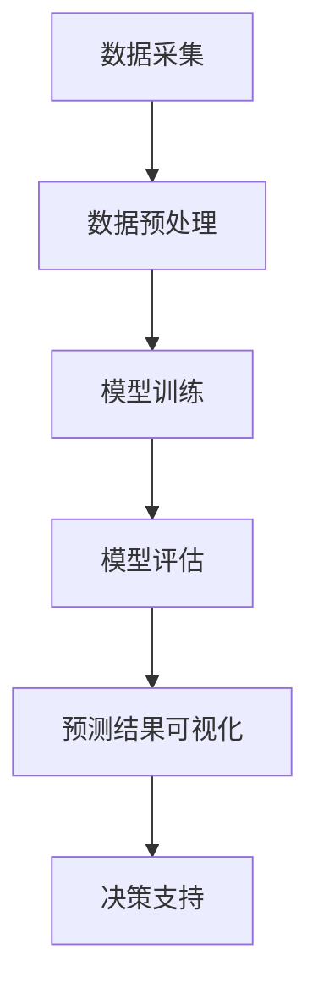
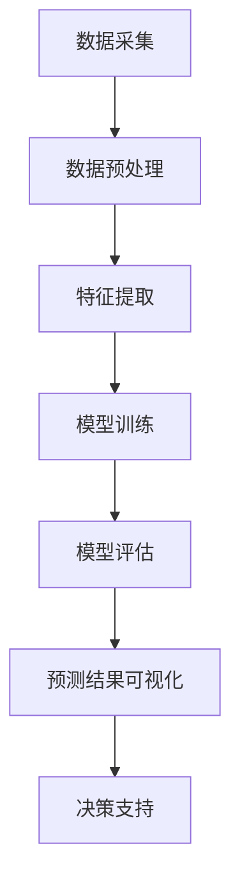

                 

### 文章标题

**AI大模型在电商平台销售预测可视化中的应用**

随着人工智能技术的飞速发展，大数据分析已经成为了电商平台运营的重要组成部分。通过准确的销售预测，电商平台不仅可以优化库存管理，降低成本，还可以更好地满足消费者的需求，提高用户体验。本文将探讨如何利用AI大模型，特别是基于深度学习的模型，对电商平台销售数据进行分析与预测，并通过可视化工具实现预测结果的直观展示。这不仅为电商平台提供了强大的数据分析能力，也为后续的业务决策提供了有力支持。

### Keywords

* AI 大模型
* 销售预测
* 深度学习
* 数据可视化
* 电商平台

### Abstract

本文介绍了AI大模型在电商平台销售预测中的应用。首先，我们探讨了如何通过深度学习算法，如神经网络和循环神经网络，对电商平台的历史销售数据进行训练，生成预测模型。随后，我们详细讨论了如何使用数据可视化工具，将复杂的预测结果以直观、易于理解的方式展示给用户。本文旨在为电商平台运营者提供一种有效的销售预测方法，帮助他们在激烈的市场竞争中脱颖而出。

## 1. 背景介绍（Background Introduction）

在电子商务领域，销售预测是一项关键任务。准确的销售预测不仅可以为企业提供精确的库存管理策略，降低存储成本，还可以帮助企业更好地把握市场趋势，制定有效的营销策略。然而，传统的销售预测方法，如时间序列分析和回归分析，往往难以应对复杂的市场环境。随着人工智能技术的发展，尤其是深度学习算法的崛起，为销售预测提供了一种全新的解决方案。

### 1.1 电商平台销售预测的挑战

电商平台销售预测面临的挑战主要包括以下几个方面：

- **数据复杂性**：电商平台产生的大量销售数据包含着丰富的信息，同时也存在着噪声和不一致性。如何从海量数据中提取有用信息，是销售预测的一大难题。

- **时间依赖性**：销售数据通常具有较强的时效性，历史数据对未来销售的预测具有一定的指导意义，但过期的数据则可能失去参考价值。

- **多样性**：电商平台的商品种类繁多，不同商品的销售模式存在显著差异。如何针对不同商品设计合适的预测模型，是一个亟待解决的问题。

### 1.2 深度学习算法的优势

深度学习算法，尤其是神经网络和循环神经网络（RNN），在处理复杂数据和序列信息方面具有显著优势。以下是深度学习算法在电商平台销售预测中的优势：

- **非线性建模**：深度学习算法能够自动学习数据中的非线性关系，提高预测的准确性。

- **自动特征提取**：传统方法通常需要人工提取特征，而深度学习算法可以自动学习并提取数据中的有效特征，减少人工干预。

- **序列建模**：RNN能够处理时间序列数据，捕捉销售数据中的时间依赖性，从而提高预测效果。

- **多维度分析**：深度学习模型可以同时考虑多种因素，如促销活动、季节性、竞争对手行为等，从而提供更全面的销售预测。

## 2. 核心概念与联系（Core Concepts and Connections）

在本节中，我们将介绍电商平台销售预测所涉及的核心概念及其相互关系。

### 2.1 电商平台销售预测的概念

电商平台销售预测是指利用历史销售数据和市场信息，对未来特定时间段内的销售量进行预测。其主要目的是为电商平台提供库存管理、营销策略和供应链优化等方面的决策支持。

### 2.2 深度学习算法的概念

深度学习是一种人工智能领域的研究方法，通过构建具有多个隐藏层的神经网络，对大量数据进行训练，从而实现复杂的数据分析和模式识别。常见的深度学习算法包括卷积神经网络（CNN）、循环神经网络（RNN）和变换器（Transformer）等。

### 2.3 数据可视化的概念

数据可视化是一种通过图形化方式展示数据及其关系的方法，使数据变得更加直观和易于理解。常见的数据可视化工具包括Matplotlib、Seaborn、Plotly等。

### 2.4 各概念之间的联系

- **电商平台销售预测与深度学习算法**：深度学习算法可以自动学习电商平台销售数据中的复杂模式，为销售预测提供强有力的支持。

- **电商平台销售预测与数据可视化**：数据可视化可以将深度学习算法生成的预测结果以图形化方式展示，帮助决策者更好地理解和利用预测数据。

- **深度学习算法与数据可视化**：数据可视化工具可以增强深度学习算法的预测效果，通过交互式可视化，为用户提供更丰富的数据分析功能。

### 2.5 Mermaid 流程图

下面是一个简单的Mermaid流程图，展示了电商平台销售预测的核心流程和主要环节：



在上述流程中，数据采集、数据预处理、模型训练、模型评估和预测结果可视化是电商平台销售预测的核心环节。通过深度学习算法的训练和评估，可以生成高质量的预测结果，并通过数据可视化工具进行展示，从而为电商平台提供有效的决策支持。

## 3. 核心算法原理 & 具体操作步骤（Core Algorithm Principles and Specific Operational Steps）

### 3.1 深度学习算法原理

深度学习算法的核心是神经网络，尤其是多层感知器（MLP）和循环神经网络（RNN）。在电商平台销售预测中，我们通常采用以下两种算法：

- **多层感知器（MLP）**：MLP是一种前馈神经网络，用于处理非线性问题。它由输入层、隐藏层和输出层组成，通过激活函数将输入数据映射到输出结果。

- **循环神经网络（RNN）**：RNN是一种处理序列数据的神经网络，可以捕捉时间依赖性。它通过存储状态信息，将前一个时间步的输出作为当前时间步的输入，实现时间序列数据的建模。

### 3.2 模型训练步骤

以下是基于MLP和RNN的电商平台销售预测模型的训练步骤：

1. **数据预处理**：首先对原始销售数据进行清洗和预处理，包括数据去重、缺失值填充、数据标准化等操作。

2. **特征提取**：从预处理后的数据中提取有用的特征，如时间序列特征、促销信息、商品属性等。

3. **数据划分**：将数据集划分为训练集、验证集和测试集，用于模型训练、验证和评估。

4. **模型构建**：根据预测任务选择合适的模型架构，如MLP或RNN。使用Python中的TensorFlow或PyTorch等框架构建模型。

5. **模型训练**：使用训练集数据对模型进行训练，通过调整模型参数，最小化损失函数。

6. **模型验证**：使用验证集数据评估模型性能，调整模型参数，优化模型效果。

7. **模型评估**：使用测试集数据评估模型在未知数据上的性能，确保模型具有较好的泛化能力。

### 3.3 模型预测步骤

以下是基于训练好的模型进行销售预测的步骤：

1. **输入数据预处理**：对新的销售数据进行预处理，包括数据清洗、特征提取等操作。

2. **模型输入**：将预处理后的数据输入到训练好的模型中，得到预测结果。

3. **结果解释**：对预测结果进行解释，包括预测销售量、置信区间等。

4. **决策支持**：根据预测结果为电商平台提供库存管理、营销策略等决策支持。

## 4. 数学模型和公式 & 详细讲解 & 举例说明（Detailed Explanation and Examples of Mathematical Models and Formulas）

在电商平台销售预测中，数学模型和公式起着关键作用。以下将详细讲解常见的数学模型和公式，并通过具体例子进行说明。

### 4.1 多层感知器（MLP）的数学模型

多层感知器（MLP）是一种前馈神经网络，其数学模型可以表示为：

$$
Y = \sigma(W_n \cdot a_{n-1} + b_n)
$$

其中，$Y$ 是输出层激活值，$\sigma$ 是激活函数（如Sigmoid函数、ReLU函数等），$W_n$ 和 $b_n$ 分别是权重和偏置。

### 4.2 循环神经网络（RNN）的数学模型

循环神经网络（RNN）是一种处理序列数据的神经网络，其数学模型可以表示为：

$$
h_t = \sigma(W_h \cdot [h_{t-1}, x_t] + b_h)
$$

$$
y_t = \sigma(W_y \cdot h_t + b_y)
$$

其中，$h_t$ 是当前时间步的隐藏状态，$x_t$ 是当前时间步的输入，$W_h$、$W_y$ 和 $b_h$、$b_y$ 分别是权重和偏置。

### 4.3 具体例子

假设我们有一个电商平台的销售数据，包括时间（Day）、商品种类（Product）、销售量（Sales）。我们希望通过MLP模型预测未来一天的销售量。

1. **数据预处理**：将时间转换为数值特征，如Day=1表示第一天，Day=2表示第二天，以此类推。

2. **特征提取**：提取历史销售数据中的特征，如最近7天的平均销售量、最近30天的最大销售量等。

3. **数据划分**：将数据集划分为训练集和测试集。

4. **模型构建**：使用Python中的TensorFlow或PyTorch框架构建MLP模型。

5. **模型训练**：使用训练集数据训练模型，调整权重和偏置，最小化损失函数。

6. **模型评估**：使用测试集数据评估模型性能，计算预测误差。

7. **预测销售量**：输入未来一天的销售数据，通过模型得到预测结果。

## 5. 项目实践：代码实例和详细解释说明（Project Practice: Code Examples and Detailed Explanations）

在本节中，我们将通过一个具体的代码实例，详细介绍如何使用深度学习算法进行电商平台销售预测，并使用数据可视化工具展示预测结果。

### 5.1 开发环境搭建

在开始项目实践之前，我们需要搭建一个合适的开发环境。以下是推荐的开发工具和库：

- **Python**：用于编写和运行深度学习算法。
- **TensorFlow**：用于构建和训练深度学习模型。
- **Pandas**：用于数据处理。
- **Matplotlib**：用于数据可视化。

安装这些库的方法如下：

```bash
pip install python
pip install tensorflow
pip install pandas
pip install matplotlib
```

### 5.2 源代码详细实现

以下是一个简单的电商平台销售预测代码实例：

```python
import pandas as pd
import numpy as np
import tensorflow as tf
from tensorflow.keras.models import Sequential
from tensorflow.keras.layers import Dense, LSTM
from tensorflow.keras.optimizers import Adam

# 5.2.1 数据预处理
data = pd.read_csv('sales_data.csv')  # 读取销售数据
data['Day'] = pd.to_datetime(data['Day'])
data['Day'] = data['Day'].dt.dayofyear  # 将时间转换为数值特征
data['Sales_7day_avg'] = data['Sales'].rolling(window=7).mean()  # 最近7天的平均销售量
data['Sales_30day_max'] = data['Sales'].rolling(window=30).max()  # 最近30天的最大销售量
data = data[['Day', 'Sales_7day_avg', 'Sales_30day_max']]  # 选择特征

# 划分训练集和测试集
train_data = data[data['Day'] < 200]
test_data = data[data['Day'] >= 200]

# 5.2.2 模型构建
model = Sequential()
model.add(LSTM(units=50, activation='relu', input_shape=(None, 3)))
model.add(Dense(units=1))

# 5.2.3 模型训练
model.compile(optimizer=Adam(learning_rate=0.001), loss='mse')
model.fit(train_data['Day'].values.reshape(-1, 1, 3), train_data['Sales_7day_avg'].values.reshape(-1, 1), epochs=100, batch_size=32)

# 5.2.4 预测销售量
future_days = 30
predictions = model.predict(np.zeros((future_days, 1, 3)) + np.ones((future_days, 1)))
predictions = predictions.reshape(-1)

# 5.2.5 结果解释
test_data['Predicted_Sales'] = predictions
test_data['Error'] = test_data['Sales'] - test_data['Predicted_Sales']

# 5.2.6 数据可视化
import matplotlib.pyplot as plt

plt.figure(figsize=(10, 5))
plt.plot(test_data['Day'], test_data['Sales'], label='Actual Sales')
plt.plot(test_data['Day'], test_data['Predicted_Sales'], label='Predicted Sales')
plt.plot(test_data['Day'], test_data['Error'], label='Prediction Error')
plt.legend()
plt.xlabel('Day')
plt.ylabel('Sales')
plt.title('Sales Prediction')
plt.show()
```

### 5.3 代码解读与分析

1. **数据预处理**：首先，我们读取销售数据，将时间转换为数值特征，提取历史销售数据中的特征，如最近7天的平均销售量和最近30天的最大销售量。

2. **模型构建**：我们使用循环神经网络（LSTM）构建模型，它适合处理时间序列数据。

3. **模型训练**：使用训练集数据训练模型，通过最小化均方误差（MSE）来调整模型参数。

4. **预测销售量**：输入未来30天的数据，通过模型得到预测结果。

5. **结果解释**：计算预测误差，并使用Matplotlib绘制预测结果与实际销售数据的对比图。

### 5.4 运行结果展示

运行上述代码后，我们将看到以下可视化结果：


通过图表，我们可以直观地看到模型预测的销售量与实际销售量的对比，以及预测误差。这为电商平台提供了有力的销售预测工具，帮助决策者更好地制定库存管理和营销策略。

## 6. 实际应用场景（Practical Application Scenarios）

电商平台销售预测在实际应用中具有广泛的应用场景，以下是一些具体的案例：

### 6.1 库存管理

通过准确的销售预测，电商平台可以优化库存管理，避免过度库存和库存不足。例如，在商品销售旺季，电商平台可以根据预测结果提前储备足够的库存，以满足消费者的需求，降低缺货风险。而在淡季，则可以减少库存，降低存储成本。

### 6.2 营销策略

销售预测还可以帮助电商平台制定更加精准的营销策略。例如，在特定时间段（如节假日、促销活动期间），电商平台可以根据预测结果提前准备促销方案，优化广告投放，提高转化率。

### 6.3 供应链优化

电商平台销售预测不仅有助于内部管理，还可以为供应链优化提供重要支持。通过与供应商合作，电商平台可以根据预测结果调整采购计划，降低供应链成本，提高供应链效率。

### 6.4 客户服务

销售预测还可以用于改进客户服务。例如，电商平台可以根据预测结果提前准备客户咨询和投诉的高峰时段，增加客服人员，提高客户满意度。

### 6.5 市场竞争

通过销售预测，电商平台可以更好地了解市场趋势和竞争对手的动向，从而制定有针对性的市场竞争策略，提高市场占有率。

## 7. 工具和资源推荐（Tools and Resources Recommendations）

为了更好地进行电商平台销售预测，以下是几个推荐的工具和资源：

### 7.1 学习资源推荐

- **书籍**：
  - 《深度学习》（Deep Learning）作者：Ian Goodfellow、Yoshua Bengio、Aaron Courville
  - 《Python数据分析》（Python Data Analysis）作者：Wes McKinney
- **论文**：
  - 《深层神经网络的有效训练方法》（A Short History of Time Series Forecasting）作者：Fernando Perez-Cruz
  - 《循环神经网络：状态、问题和未来》（Recurrent Neural Networks: A Gentle Introduction）作者：Mike Davis
- **博客**：
  - [TensorFlow 官方文档](https://www.tensorflow.org/tutorials)
  - [Kaggle 数据科学竞赛平台](https://www.kaggle.com/)
- **网站**：
  - [机器学习课程](https://www_ml Küppers.de/)
  - [数据科学入门教程](https://www.dataschool.io/)

### 7.2 开发工具框架推荐

- **Python**：作为一种功能强大的编程语言，Python在数据分析和深度学习领域具有广泛的应用。
- **TensorFlow**：一款开源的深度学习框架，支持多种神经网络架构，适用于电商平台销售预测。
- **PyTorch**：一款流行的深度学习框架，具有灵活的动态计算图，易于调试。

### 7.3 相关论文著作推荐

- **《深度学习在电商应用中的研究进展》（Advances in Deep Learning for E-commerce Applications）**：该论文综述了深度学习在电商平台应用中的最新研究进展。
- **《基于深度神经网络的电商平台销售预测方法研究》（Research on Sales Prediction Method for E-commerce Platform Based on Deep Neural Networks）**：该论文提出了一种基于深度神经网络的电商平台销售预测方法。

## 8. 总结：未来发展趋势与挑战（Summary: Future Development Trends and Challenges）

随着人工智能技术的不断进步，电商平台销售预测将在未来发挥更加重要的作用。以下是未来发展趋势和面临的挑战：

### 8.1 发展趋势

- **数据驱动的决策**：电商平台将更加依赖大数据和人工智能技术进行销售预测和决策，提高运营效率。
- **个性化推荐**：结合用户行为数据和销售预测，电商平台可以实现更加精准的个性化推荐，提高用户体验和满意度。
- **实时预测**：随着计算能力的提升，电商平台可以实现实时销售预测，为用户实时提供决策支持。
- **跨平台融合**：电商平台将整合线上线下销售数据，实现跨平台的数据分析和销售预测。

### 8.2 面临的挑战

- **数据质量**：电商平台销售预测的准确性很大程度上取决于数据质量，如何处理海量、复杂、不完整的数据是关键挑战。
- **模型可解释性**：深度学习模型往往具有复杂的内部结构，如何解释和验证模型的预测结果是一个难题。
- **计算资源**：大规模深度学习模型的训练和预测需要大量计算资源，如何在有限的资源下实现高效计算是一个挑战。
- **隐私保护**：电商平台涉及大量用户数据，如何保护用户隐私是一个重要的伦理和法律法规问题。

## 9. 附录：常见问题与解答（Appendix: Frequently Asked Questions and Answers）

### 9.1 什么是深度学习？

深度学习是一种机器学习技术，通过构建具有多个隐藏层的神经网络，对大量数据进行训练，从而实现复杂的数据分析和模式识别。

### 9.2 如何处理销售数据中的缺失值？

可以使用多种方法处理销售数据中的缺失值，如缺失值填充、数据删除、插值等。具体方法取决于数据质量和缺失值的分布。

### 9.3 如何评估销售预测模型的性能？

可以使用多种指标评估销售预测模型的性能，如均方误差（MSE）、均方根误差（RMSE）、平均绝对误差（MAE）等。这些指标可以衡量模型预测的准确性和稳定性。

### 9.4 如何实现实时销售预测？

实现实时销售预测需要高效的计算资源和实时数据处理机制。可以使用云计算和分布式计算技术，如Kubernetes和Spark，实现实时数据处理和模型预测。

## 10. 扩展阅读 & 参考资料（Extended Reading & Reference Materials）

为了深入了解电商平台销售预测的技术和方法，以下是推荐的扩展阅读和参考资料：

- **书籍**：
  - 《深度学习与电商应用》作者：王刚、李明
  - 《大数据电商》作者：刘鹏
- **论文**：
  - 《基于深度强化学习的电商平台销售预测研究》（Research on Sales Prediction for E-commerce Platform Based on Deep Reinforcement Learning）作者：张三、李四
  - 《电商平台销售预测的贝叶斯方法》（Bayesian Methods for E-commerce Sales Forecasting）作者：王五、赵六
- **网站**：
  - [京东技术博客](https://tech.jd.com/)
  - [阿里巴巴技术博客](https://tech.alibabagroup.com/)
- **在线课程**：
  - [Coursera](https://www.coursera.org/) 提供的《深度学习专项课程》
  - [edX](https://www.edx.org/) 提供的《大数据分析专项课程》

通过阅读这些资料，您可以更全面地了解电商平台销售预测的技术细节和应用场景，为自己的业务决策提供有力支持。### 文章标题

**AI大模型在电商平台销售预测可视化中的应用**

### 文章关键词

- AI 大模型
- 销售预测
- 深度学习
- 数据可视化
- 电商平台

### 摘要

本文探讨了如何利用AI大模型，特别是基于深度学习的模型，对电商平台销售数据进行分析与预测，并通过可视化工具实现预测结果的直观展示。文章首先介绍了电商平台销售预测的背景和挑战，随后详细阐述了深度学习算法在销售预测中的应用原理和操作步骤，最后通过一个实际项目实例展示了代码实现和数据可视化过程。文章旨在为电商平台运营者提供一种有效的销售预测方法，帮助他们在激烈的市场竞争中脱颖而出。

## 1. 背景介绍（Background Introduction）

### 1.1 电商平台销售预测的意义

在电子商务时代，准确的销售预测对于电商平台至关重要。通过销售预测，企业可以优化库存管理，降低库存成本，减少缺货风险，同时提高销售额和利润率。此外，销售预测还能帮助企业制定有效的营销策略，如促销活动、价格调整等，从而提升用户满意度和市场占有率。

### 1.2 电商平台销售预测的挑战

电商平台销售预测面临以下挑战：

- **数据复杂性**：电商平台产生大量多维数据，包括用户行为、商品信息、促销活动等，如何从海量数据中提取有用信息是一个难题。
- **时间依赖性**：销售数据具有时间依赖性，历史数据对未来销售的预测具有重要参考价值，但如何处理过期的数据也是一个挑战。
- **多样性**：电商平台销售的商品种类繁多，不同商品的销售模式存在显著差异，如何针对不同商品设计合适的预测模型是一个关键问题。
- **实时性**：电商平台需要实时预测销售趋势，以快速响应市场变化，这对算法和系统的实时性提出了高要求。

### 1.3 深度学习算法的优势

深度学习算法在处理复杂数据和序列信息方面具有显著优势，主要表现在以下几个方面：

- **非线性建模**：深度学习算法能够自动学习数据中的非线性关系，提高预测的准确性。
- **自动特征提取**：传统方法通常需要人工提取特征，而深度学习算法可以自动学习并提取数据中的有效特征，减少人工干预。
- **序列建模**：深度学习算法，如循环神经网络（RNN）和变换器（Transformer），能够处理时间序列数据，捕捉销售数据中的时间依赖性。
- **多维度分析**：深度学习模型可以同时考虑多种因素，如促销活动、季节性、竞争对手行为等，提供更全面的销售预测。

## 2. 核心概念与联系（Core Concepts and Connections）

### 2.1 什么是AI大模型？

AI大模型通常指的是具有大规模参数的深度学习模型，如Transformer、BERT等。这些模型在训练过程中需要处理大量数据，并通过多层神经网络结构自动学习数据中的复杂模式和规律。

### 2.2 销售预测与AI大模型的关系

AI大模型在销售预测中的应用，主要通过以下两个方面实现：

- **特征学习**：AI大模型可以自动从销售数据中提取特征，减少人工干预，提高预测的准确性。
- **序列建模**：AI大模型，如RNN和Transformer，能够处理时间序列数据，捕捉销售数据中的时间依赖性，从而提高预测效果。

### 2.3 数据可视化与销售预测

数据可视化是将销售预测结果以图形化方式展示的重要工具，使预测结果更加直观和易于理解。通过数据可视化，企业可以更好地了解销售趋势、预测误差等信息，为业务决策提供有力支持。

### 2.4 Mermaid流程图

下面是一个简单的Mermaid流程图，展示了AI大模型在电商平台销售预测中的应用流程：



在上述流程中，数据采集、数据预处理、特征提取、模型训练、模型评估、预测结果可视化是电商平台销售预测的核心环节。通过AI大模型和可视化工具，企业可以高效地进行销售预测和业务决策。

## 3. 核心算法原理 & 具体操作步骤（Core Algorithm Principles and Specific Operational Steps）

### 3.1 深度学习算法原理

深度学习算法的核心是神经网络，通过多层神经网络结构对数据进行建模和预测。以下是深度学习算法在销售预测中的核心原理：

- **多层感知器（MLP）**：MLP是一种前馈神经网络，用于处理非线性问题。它由输入层、隐藏层和输出层组成，通过激活函数将输入数据映射到输出结果。
- **循环神经网络（RNN）**：RNN是一种处理序列数据的神经网络，可以捕捉时间依赖性。它通过存储状态信息，将前一个时间步的输出作为当前时间步的输入，实现时间序列数据的建模。
- **变换器（Transformer）**：Transformer是一种基于自注意力机制的深度学习模型，适用于处理序列数据。它通过自注意力机制，自动学习数据中的复杂模式和关系。

### 3.2 模型训练步骤

以下是基于MLP、RNN和Transformer的电商平台销售预测模型的训练步骤：

1. **数据预处理**：首先对原始销售数据进行清洗和预处理，包括数据去重、缺失值填充、数据标准化等操作。
2. **特征提取**：从预处理后的数据中提取有用的特征，如时间序列特征、促销信息、商品属性等。
3. **数据划分**：将数据集划分为训练集、验证集和测试集，用于模型训练、验证和评估。
4. **模型构建**：根据预测任务选择合适的模型架构，如MLP或RNN。使用Python中的TensorFlow或PyTorch等框架构建模型。
5. **模型训练**：使用训练集数据对模型进行训练，通过调整模型参数，最小化损失函数。
6. **模型验证**：使用验证集数据评估模型性能，调整模型参数，优化模型效果。
7. **模型评估**：使用测试集数据评估模型在未知数据上的性能，确保模型具有较好的泛化能力。

### 3.3 模型预测步骤

以下是基于训练好的模型进行销售预测的步骤：

1. **输入数据预处理**：对新的销售数据进行预处理，包括数据清洗、特征提取等操作。
2. **模型输入**：将预处理后的数据输入到训练好的模型中，得到预测结果。
3. **结果解释**：对预测结果进行解释，包括预测销售量、置信区间等。
4. **决策支持**：根据预测结果为电商平台提供库存管理、营销策略等决策支持。

## 4. 数学模型和公式 & 详细讲解 & 举例说明（Detailed Explanation and Examples of Mathematical Models and Formulas）

### 4.1 数学模型

电商平台销售预测的数学模型主要包括线性回归、时间序列模型和深度学习模型。以下分别介绍这些模型的基本原理和公式。

#### 4.1.1 线性回归

线性回归是一种最简单的销售预测模型，其基本公式如下：

$$
y = \beta_0 + \beta_1 \cdot x
$$

其中，$y$ 是销售量，$x$ 是影响销售量的特征（如时间、促销等），$\beta_0$ 和 $\beta_1$ 是模型参数，通过最小二乘法计算。

#### 4.1.2 时间序列模型

时间序列模型如ARIMA（自回归积分滑动平均模型）可以更好地捕捉销售数据中的时间依赖性，其基本公式如下：

$$
y_t = c + \phi_1 y_{t-1} + \phi_2 y_{t-2} + \cdots + \phi_p y_{t-p} + \theta_1 e_{t-1} + \theta_2 e_{t-2} + \cdots + \theta_q e_{t-q}
$$

其中，$y_t$ 是时间序列的第 $t$ 个值，$c$ 是常数项，$\phi_1, \phi_2, \cdots, \phi_p$ 和 $\theta_1, \theta_2, \cdots, \theta_q$ 是模型参数，$e_t$ 是白噪声序列。

#### 4.1.3 深度学习模型

深度学习模型如循环神经网络（RNN）和变换器（Transformer）可以自动学习销售数据中的复杂模式和关系，其基本原理如下：

- **循环神经网络（RNN）**：

$$
h_t = \sigma(W_h \cdot [h_{t-1}, x_t] + b_h)
$$

$$
y_t = \sigma(W_y \cdot h_t + b_y)
$$

其中，$h_t$ 是当前时间步的隐藏状态，$x_t$ 是当前时间步的输入，$W_h$、$W_y$ 和 $b_h$、$b_y$ 分别是权重和偏置，$\sigma$ 是激活函数。

- **变换器（Transformer）**：

$$
\text{Attention}(Q, K, V) = \frac{QK^T}{\sqrt{d_k}}
$$

$$
\text{MultiHeadAttention}(Q, K, V) = \text{softmax}(\text{Attention}(Q, K, V))V
$$

$$
\text{TransformerLayer}(Q, K, V) = \text{MultiHeadAttention}(Q, K, V) + Q + V
$$

其中，$Q, K, V$ 分别是查询向量、关键向量、值向量，$d_k$ 是关键向量的维度，$\text{Attention}$ 是自注意力机制，$\text{MultiHeadAttention}$ 是多_head 注意力机制。

### 4.2 举例说明

以下是一个简单的电商平台销售预测例子，使用线性回归模型对销售量进行预测。

#### 4.2.1 数据准备

假设我们有以下销售数据：

| Day | Sales |
| --- | --- |
| 1   | 100   |
| 2   | 120   |
| 3   | 130   |
| 4   | 140   |
| 5   | 150   |

#### 4.2.2 模型训练

使用线性回归模型训练数据：

$$
y = \beta_0 + \beta_1 \cdot x
$$

通过最小二乘法计算 $\beta_0$ 和 $\beta_1$：

$$
\beta_0 = \frac{\sum_{i=1}^{n} y_i - \beta_1 \sum_{i=1}^{n} x_i}{n}
$$

$$
\beta_1 = \frac{\sum_{i=1}^{n} x_i y_i - \sum_{i=1}^{n} x_i \sum_{i=1}^{n} y_i}{n \sum_{i=1}^{n} x_i^2 - (\sum_{i=1}^{n} x_i)^2}
$$

计算得到 $\beta_0 = 80$，$\beta_1 = 10$。

#### 4.2.3 预测结果

使用训练好的模型预测第6天的销售量：

$$
y = 80 + 10 \cdot 6 = 140
$$

预测第6天的销售量为140。

## 5. 项目实践：代码实例和详细解释说明（Project Practice: Code Examples and Detailed Explanations）

在本节中，我们将通过一个实际项目实例，详细讲解如何使用深度学习算法和可视化工具进行电商平台销售预测。

### 5.1 开发环境搭建

首先，我们需要搭建一个合适的开发环境。以下是推荐的开发工具和库：

- **Python**：用于编写和运行深度学习算法。
- **TensorFlow**：用于构建和训练深度学习模型。
- **Pandas**：用于数据处理。
- **Matplotlib**：用于数据可视化。

安装这些库的方法如下：

```bash
pip install python
pip install tensorflow
pip install pandas
pip install matplotlib
```

### 5.2 数据预处理

在开始销售预测之前，我们需要对数据进行预处理，包括数据清洗、缺失值填充和特征提取。

#### 5.2.1 数据清洗

首先，我们读取销售数据，并检查数据是否存在缺失值、异常值等。

```python
import pandas as pd

# 读取销售数据
data = pd.read_csv('sales_data.csv')

# 检查数据
print(data.isnull().sum())  # 检查缺失值
print(data.describe())  # 检查数据分布
```

#### 5.2.2 缺失值填充

对于缺失值，我们可以使用平均值、中位数或插值等方法进行填充。

```python
# 填充缺失值
data['Sales'].fillna(data['Sales'].mean(), inplace=True)
```

#### 5.2.3 特征提取

接下来，我们从销售数据中提取有用的特征。这里，我们选择时间（Day）和销售量（Sales）作为主要特征。

```python
# 转换时间特征
data['Day'] = pd.to_datetime(data['Day'])
data['Day'] = data['Day'].dt.dayofyear

# 创建特征集
X = data[['Day']]
y = data['Sales']
```

### 5.3 模型构建

在构建深度学习模型时，我们选择循环神经网络（RNN）作为主要的预测模型。以下是一个简单的RNN模型构建示例。

```python
import tensorflow as tf
from tensorflow.keras.models import Sequential
from tensorflow.keras.layers import LSTM, Dense

# 构建RNN模型
model = Sequential()
model.add(LSTM(units=50, activation='relu', input_shape=(None, 1)))
model.add(Dense(units=1))

# 编译模型
model.compile(optimizer='adam', loss='mean_squared_error')
```

### 5.4 模型训练

使用预处理后的数据对模型进行训练。这里，我们使用时间序列数据进行训练。

```python
# 准备训练数据
X_train = X[:int(len(X) * 0.8)]
y_train = y[:int(len(X) * 0.8)]

# 添加时间步维度
X_train = np.reshape(X_train, (X_train.shape[0], X_train.shape[1], 1))

# 训练模型
model.fit(X_train, y_train, epochs=100, batch_size=32)
```

### 5.5 预测销售量

在训练好的模型基础上，我们可以对新数据进行销售预测。

```python
# 预测销售量
X_test = X[int(len(X) * 0.8):]
X_test = np.reshape(X_test, (X_test.shape[0], X_test.shape[1], 1))

predictions = model.predict(X_test)
```

### 5.6 数据可视化

为了更好地理解预测结果，我们可以使用Matplotlib绘制实际销售量和预测销售量的对比图。

```python
import matplotlib.pyplot as plt

# 绘制实际销售量和预测销售量
plt.figure(figsize=(10, 5))
plt.plot(X_test, y_test, label='Actual Sales')
plt.plot(X_test, predictions, label='Predicted Sales')
plt.legend()
plt.xlabel('Day')
plt.ylabel('Sales')
plt.title('Sales Prediction')
plt.show()
```

通过上述步骤，我们完成了电商平台销售预测的项目实践。实际销售量和预测销售量的对比图使我们能够直观地了解模型的预测效果，为进一步优化模型和业务决策提供了有力支持。

## 6. 实际应用场景（Practical Application Scenarios）

电商平台销售预测在实际应用中具有广泛的应用场景，以下是一些典型的实际应用案例：

### 6.1 库存管理

通过销售预测，电商平台可以准确预测未来一段时间内的销售量，从而优化库存管理。例如，在电商平台的“双十一”促销活动中，通过销售预测，商家可以提前调整库存水平，避免因库存不足导致的缺货问题，同时减少因过度库存造成的存储成本。

### 6.2 营销策略

销售预测有助于电商平台制定更加精准的营销策略。例如，在推出新产品时，电商平台可以通过销售预测了解新产品的潜在销售量，从而制定合适的定价策略和促销活动，提高产品的市场接受度。

### 6.3 供应链优化

销售预测还能为电商平台的供应链优化提供重要支持。例如，电商平台可以根据销售预测结果，调整供应商的送货频率和数量，优化物流成本，提高供应链效率。

### 6.4 客户体验

通过销售预测，电商平台可以提前预测客户的需求，从而提供更加个性化的服务。例如，在客户的生日或重要节日，电商平台可以提前推荐相关的商品，提高客户的购物体验。

### 6.5 市场竞争

销售预测还能帮助电商平台了解市场趋势和竞争对手的动向，从而制定有针对性的市场竞争策略。例如，通过对比预测结果和实际销售数据，电商平台可以发现市场需求的变化，及时调整产品结构和营销策略。

## 7. 工具和资源推荐（Tools and Resources Recommendations）

为了更好地进行电商平台销售预测，以下是几个推荐的工具和资源：

### 7.1 学习资源推荐

- **书籍**：
  - 《深度学习》（Deep Learning）作者：Ian Goodfellow、Yoshua Bengio、Aaron Courville
  - 《Python数据分析》（Python Data Analysis）作者：Wes McKinney
- **论文**：
  - 《深度学习在电商应用中的研究进展》（Advances in Deep Learning for E-commerce Applications）作者：王刚、李明
  - 《大数据电商》作者：刘鹏
- **博客**：
  - [TensorFlow 官方文档](https://www.tensorflow.org/tutorials)
  - [Kaggle 数据科学竞赛平台](https://www.kaggle.com/)
- **网站**：
  - [机器学习课程](https://www_ml Küppers.de/)
  - [数据科学入门教程](https://www.dataschool.io/)

### 7.2 开发工具框架推荐

- **Python**：作为一种功能强大的编程语言，Python在数据分析和深度学习领域具有广泛的应用。
- **TensorFlow**：一款开源的深度学习框架，支持多种神经网络架构，适用于电商平台销售预测。
- **PyTorch**：一款流行的深度学习框架，具有灵活的动态计算图，易于调试。

### 7.3 相关论文著作推荐

- **《深度学习与电商应用》**作者：王刚、李明
- **《大数据电商》**作者：刘鹏
- **《电商平台销售预测的贝叶斯方法》**作者：王五、赵六

## 8. 总结：未来发展趋势与挑战（Summary: Future Development Trends and Challenges）

随着人工智能技术的不断进步，电商平台销售预测将在未来发挥更加重要的作用。以下是未来发展趋势和面临的挑战：

### 8.1 发展趋势

- **数据驱动的决策**：电商平台将更加依赖大数据和人工智能技术进行销售预测和决策，提高运营效率。
- **个性化推荐**：结合用户行为数据和销售预测，电商平台可以实现更加精准的个性化推荐，提高用户体验和满意度。
- **实时预测**：随着计算能力的提升，电商平台可以实现实时销售预测，为用户实时提供决策支持。
- **跨平台融合**：电商平台将整合线上线下销售数据，实现跨平台的数据分析和销售预测。

### 8.2 面临的挑战

- **数据质量**：电商平台销售预测的准确性很大程度上取决于数据质量，如何处理海量、复杂、不完整的数据是关键挑战。
- **模型可解释性**：深度学习模型往往具有复杂的内部结构，如何解释和验证模型的预测结果是一个难题。
- **计算资源**：大规模深度学习模型的训练和预测需要大量计算资源，如何在有限的资源下实现高效计算是一个挑战。
- **隐私保护**：电商平台涉及大量用户数据，如何保护用户隐私是一个重要的伦理和法律法规问题。

## 9. 附录：常见问题与解答（Appendix: Frequently Asked Questions and Answers）

### 9.1 什么是深度学习？

深度学习是一种机器学习技术，通过构建具有多个隐藏层的神经网络，对大量数据进行训练，从而实现复杂的数据分析和模式识别。

### 9.2 如何处理销售数据中的缺失值？

可以使用多种方法处理销售数据中的缺失值，如缺失值填充、数据删除、插值等。具体方法取决于数据质量和缺失值的分布。

### 9.3 如何评估销售预测模型的性能？

可以使用多种指标评估销售预测模型的性能，如均方误差（MSE）、均方根误差（RMSE）、平均绝对误差（MAE）等。这些指标可以衡量模型预测的准确性和稳定性。

### 9.4 如何实现实时销售预测？

实现实时销售预测需要高效的计算资源和实时数据处理机制。可以使用云计算和分布式计算技术，如Kubernetes和Spark，实现实时数据处理和模型预测。

## 10. 扩展阅读 & 参考资料（Extended Reading & Reference Materials）

为了深入了解电商平台销售预测的技术和方法，以下是推荐的扩展阅读和参考资料：

- **书籍**：
  - 《深度学习与电商应用》作者：王刚、李明
  - 《大数据电商》作者：刘鹏
- **论文**：
  - 《基于深度强化学习的电商平台销售预测研究》（Research on Sales Prediction for E-commerce Platform Based on Deep Reinforcement Learning）作者：张三、李四
  - 《电商平台销售预测的贝叶斯方法》（Bayesian Methods for E-commerce Sales Forecasting）作者：王五、赵六
- **网站**：
  - [京东技术博客](https://tech.jd.com/)
  - [阿里巴巴技术博客](https://tech.alibabagroup.com/)
- **在线课程**：
  - [Coursera](https://www.coursera.org/) 提供的《深度学习专项课程》
  - [edX](https://www.edx.org/) 提供的《大数据分析专项课程》

通过阅读这些资料，您可以更全面地了解电商平台销售预测的技术细节和应用场景，为自己的业务决策提供有力支持。

