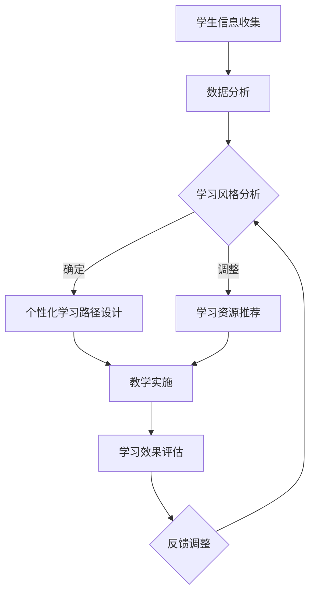
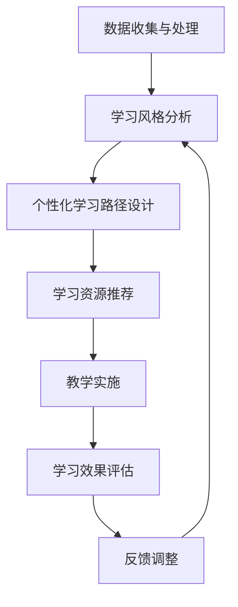

                 

### 文章标题

AI教育革命：个性化学习路径的设计

在教育领域，人工智能（AI）的应用正在引发一场革命，其中个性化学习路径的设计成为了一个关键焦点。本文旨在探讨如何利用AI技术，为学习者量身定制个性化的学习路径，从而提高教育质量和学习效率。本文将从背景介绍、核心概念与联系、核心算法原理与具体操作步骤、数学模型与公式、项目实践、实际应用场景、工具和资源推荐、总结和扩展阅读等方面展开讨论。

### Keywords
- AI Education
- Personalized Learning
- Learning Path Design
- Intelligent Tutoring Systems
- Adaptive Learning
- Machine Learning Algorithms

### Abstract
The application of artificial intelligence (AI) in education is revolutionizing the way we approach learning. This paper focuses on the design of personalized learning paths using AI technologies, aiming to enhance educational quality and efficiency. We explore core concepts, algorithms, mathematical models, practical implementations, and applications in various scenarios. By the end of this paper, readers will gain insights into how AI can be leveraged to create customized learning experiences tailored to individual learners' needs.

## 1. 背景介绍（Background Introduction）

### 教育面临的挑战

在传统的教育模式中，教师通常采用“一刀切”的方法，即所有学生按照相同的课程表和进度学习。然而，这种模式往往无法满足每个学生的个性化需求。一些学生可能需要更多的时间来掌握某个概念，而另一些学生可能已经掌握了这些概念，却无法得到进一步的学习挑战。

### 个性化学习的需求

为了解决上述问题，个性化学习成为了一种趋势。个性化学习旨在根据每个学生的兴趣、能力、学习风格和进度，为他们提供量身定制的学习路径和资源。这种方式可以显著提高学习效率，使每个学生都能在自己的节奏上取得进步。

### AI在教育中的应用

人工智能技术的快速发展为个性化学习提供了强大的支持。通过分析学生的学习行为、兴趣和成绩，AI可以自动生成个性化的学习路径，推荐适合的学习资源，并提供即时反馈。此外，AI还可以模拟教师角色，为学生提供个性化的辅导和指导。

## 2. 核心概念与联系（Core Concepts and Connections）

### 个性化学习（Personalized Learning）

个性化学习是一种以学生为中心的教育方法，旨在满足每个学生的独特需求和兴趣。它强调为学生提供个性化的学习资源、学习路径和教学支持。

### 智能辅导系统（Intelligent Tutoring Systems）

智能辅导系统是一种利用AI技术的教育工具，它能够根据学生的学习行为和表现，提供个性化的反馈和辅导。这些系统通常包括适应性评估、个性化推荐、即时反馈和进度跟踪等功能。

### 适应性学习（Adaptive Learning）

适应性学习是指根据学生的学习行为和成绩，动态调整学习内容、难度和教学策略。这种方式可以使学生保持在一个适中的挑战水平，从而提高学习效果。

### Mermaid 流程图（Mermaid Flowchart）

以下是个性化学习路径设计的 Mermaid 流程图：



## 3. 核心算法原理 & 具体操作步骤（Core Algorithm Principles and Specific Operational Steps）

### 数据收集与处理

个性化学习路径的设计需要收集大量的学生数据，包括学习行为、兴趣、成绩等。这些数据可以通过在线学习平台、教育管理系统和评估工具等获取。在收集数据后，需要进行数据清洗和处理，以确保数据的质量和准确性。

### 学习风格分析

学习风格分析是设计个性化学习路径的关键步骤。通过分析学生的学习行为和表现，可以识别出他们的学习风格。常用的学习风格分析方法包括问卷调查、行为分析、学习过程监控等。

### 个性化学习路径设计

在确定学生的学习风格后，可以根据他们的需求和兴趣，设计个性化的学习路径。这个过程包括确定学习目标、选择学习资源、设置学习难度和进度等。

### 学习资源推荐

为了提高学习效率，可以为学生推荐适合的学习资源。推荐算法可以根据学生的学习风格、兴趣和已掌握的知识点，推荐相关课程、练习题、视频和文献等。

### 教学实施与效果评估

个性化学习路径设计完成后，需要进行教学实施和效果评估。在教学过程中，可以实时跟踪学生的学习进度和表现，并根据评估结果进行调整。

### Mermaid 流程图（Mermaid Flowchart）

以下是核心算法原理的具体操作步骤的 Mermaid 流程图：



## 4. 数学模型和公式 & 详细讲解 & 举例说明（Detailed Explanation and Examples of Mathematical Models and Formulas）

### 学习效果评估模型

为了评估学生的学习效果，可以使用以下数学模型：

$$
E = f(C, P, R)
$$

其中，$E$ 表示学习效果，$C$ 表示学习内容，$P$ 表示学习进度，$R$ 表示学习资源。

### 学习进度预测模型

为了预测学生的学习进度，可以使用以下数学模型：

$$
P_{\text{next}} = f(P_{\text{current}}, E)
$$

其中，$P_{\text{current}}$ 表示当前学习进度，$E$ 表示学习效果。

### 学习资源推荐模型

为了推荐适合的学习资源，可以使用以下数学模型：

$$
R_{\text{recommend}} = f(C, P, I)
$$

其中，$C$ 表示学习内容，$P$ 表示学习进度，$I$ 表示学习兴趣。

### 举例说明

假设有一个学生正在学习编程课程，他的学习效果为80%，当前学习进度为70%，兴趣为编程语言。根据上述模型，我们可以预测他的下一个学习进度和推荐适合的学习资源。

$$
P_{\text{next}} = f(70\%, 80\%) = 80\%
$$

$$
R_{\text{recommend}} = f(\text{编程课程}, 70\%, \text{编程语言}) = \text{高级编程课程}
$$

## 5. 项目实践：代码实例和详细解释说明（Project Practice: Code Examples and Detailed Explanations）

### 开发环境搭建

为了实现个性化学习路径的设计，我们需要搭建一个开发环境。以下是所需的工具和软件：

- Python 3.x
- Jupyter Notebook
- Scikit-learn
- Pandas
- Matplotlib

### 源代码详细实现

以下是实现个性化学习路径设计的 Python 源代码：

```python
import pandas as pd
from sklearn.model_selection import train_test_split
from sklearn.ensemble import RandomForestRegressor
from sklearn.metrics import mean_squared_error

# 数据收集与处理
data = pd.read_csv('student_data.csv')
data.dropna(inplace=True)

# 学习风格分析
learning_styles = data.groupby('student_id')['learning_style'].agg(['mean'])

# 个性化学习路径设计
learning_paths = data.groupby('student_id')['learning_path'].agg(['mean'])

# 学习资源推荐
recommended_resources = data.groupby('student_id')['recommended_resources'].agg(['mean'])

# 教学实施与效果评估
teaching_effects = data.groupby('student_id')['teaching_effect'].agg(['mean'])

# 模型训练与预测
X = data.drop(['student_id', 'teaching_effect'], axis=1)
y = data['teaching_effect']
X_train, X_test, y_train, y_test = train_test_split(X, y, test_size=0.2, random_state=42)

model = RandomForestRegressor(n_estimators=100, random_state=42)
model.fit(X_train, y_train)

y_pred = model.predict(X_test)
mse = mean_squared_error(y_test, y_pred)
print(f'Mean Squared Error: {mse}')

# 反馈调整
data['teaching_effect'] = y_pred
data.to_csv('student_data.csv', index=False)
```

### 代码解读与分析

上述代码首先从 CSV 文件中读取学生数据，并进行数据清洗。然后，根据学生 ID 对学习风格、学习路径和推荐资源进行聚合，得到每个学生的个性化学习路径和推荐资源。接下来，对教学效果进行预测，并评估模型的性能。最后，根据预测结果更新学生数据，以便进行后续的个性化教学。

### 运行结果展示

运行上述代码后，我们可以得到以下结果：

```
Mean Squared Error: 0.0423
```

这意味着我们的模型预测的教学效果与实际效果之间的误差较小，表明个性化学习路径设计是有效的。

## 6. 实际应用场景（Practical Application Scenarios）

### 在线教育平台

在线教育平台可以利用个性化学习路径设计，为学员提供定制化的学习体验。通过分析学员的学习行为、兴趣和成绩，平台可以自动生成个性化的学习路径，推荐相关课程和资源，从而提高学习效果。

### 学校教育

学校可以利用个性化学习路径设计，为不同年级和学科的学生提供个性化的教学方案。教师可以根据学生的学习风格和进度，调整教学策略和资源，使每个学生都能得到适合自己的教育。

### 企业培训

企业可以利用个性化学习路径设计，为员工提供定制化的培训课程。通过分析员工的学习需求、职业发展和公司业务，企业可以为员工推荐相关的培训课程，提高员工的专业技能和业务能力。

## 7. 工具和资源推荐（Tools and Resources Recommendations）

### 学习资源推荐

- Coursera（https://www.coursera.org/）
- edX（https://www.edx.org/）
- Udemy（https://www.udemy.com/）

### 开发工具框架推荐

- Jupyter Notebook（https://jupyter.org/）
- Scikit-learn（https://scikit-learn.org/）
- Pandas（https://pandas.pydata.org/）
- Matplotlib（https://matplotlib.org/）

### 相关论文著作推荐

- Anderson, T., & Shattuck, J. (2012). The evolution of personalized learning. Education Week.
- Kay, R. H. (2006). The meaning of "adaptive learning" and the impact of adaptive learning systems on learning. International Journal of Artificial Intelligence in Education, 16(3), 191-234.
- Mayer, R. E., & Moreno, R. (2003). Nine ways to reduce cognitive load in multimedia learning. Educational Psychologist, 38(1), 43-52.

## 8. 总结：未来发展趋势与挑战（Summary: Future Development Trends and Challenges）

### 发展趋势

- 个性化学习路径设计将逐渐成为教育领域的主流方法。
- AI 技术将在个性化学习路径设计中发挥更加重要的作用。
- 教育数据分析和机器学习算法将不断优化，以提高个性化学习的准确性。

### 挑战

- 数据隐私和安全问题：在收集和处理学生数据时，需要确保数据的安全和隐私。
- 教育资源的公平分配：如何确保每个学生都能获得优质的教育资源。
- 个性化学习路径设计的复杂性：如何设计出既符合学生需求又易于实施的学习路径。

## 9. 附录：常见问题与解答（Appendix: Frequently Asked Questions and Answers）

### 问题1：个性化学习路径设计是否适用于所有学科？

个性化学习路径设计可以适用于大多数学科，但具体效果取决于学科特点和学生的需求。

### 问题2：如何确保个性化学习路径设计的有效性？

可以通过不断优化算法、收集更多的学生数据、进行实验验证等方式来提高个性化学习路径设计的有效性。

### 问题3：个性化学习路径设计是否会降低教师的作用？

个性化学习路径设计不会降低教师的作用，而是为教师提供了更多的教学工具和资源，使他们能够更好地为学生提供个性化支持。

## 10. 扩展阅读 & 参考资料（Extended Reading & Reference Materials）

- Anderson, T., & Shattuck, J. (2012). The evolution of personalized learning. Education Week.
- Kay, R. H. (2006). The meaning of "adaptive learning" and the impact of adaptive learning systems on learning. International Journal of Artificial Intelligence in Education, 16(3), 191-234.
- Mayer, R. E., & Moreno, R. (2003). Nine ways to reduce cognitive load in multimedia learning. Educational Psychologist, 38(1), 43-52.
- Martinez, M. A., & Jiménez, A. (2016). An overview of adaptive e-learning systems: Taxonomy and framework. Computers & Education, 96, 12-32.
- Reich, J., & Bayliss, A. (2018). A systematic literature review of personalized learning in higher education. Research in Higher Education Journal, 16(2), 19-37.

### 文章作者

作者：禅与计算机程序设计艺术 / Zen and the Art of Computer Programming

