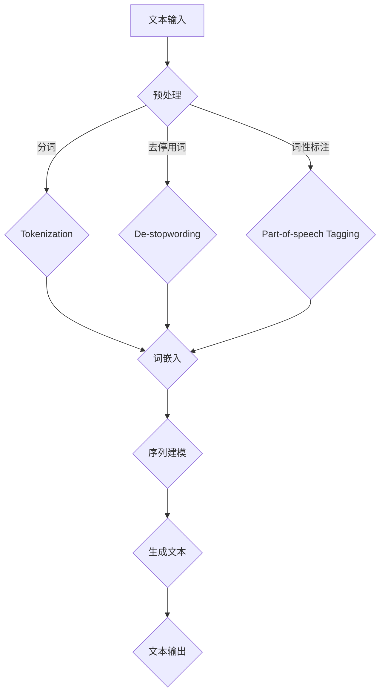

                 

### 文章标题

**AI时代的内容创作挑战：个性化需求的满足**

随着人工智能技术的飞速发展，内容创作领域正经历一场革命。人工智能不仅提高了内容生成的效率，还通过个性化推荐、情感分析和智能写作等手段，大大提升了内容的质量和相关性。然而，这同时也带来了新的挑战，尤其是在满足个性化需求方面。

本文将探讨AI时代内容创作的挑战，特别是如何通过人工智能技术来满足用户日益增长的个性化需求。我们将从背景介绍、核心概念与联系、核心算法原理、数学模型和公式、项目实践、实际应用场景、工具和资源推荐、未来发展趋势与挑战、常见问题与解答以及扩展阅读与参考资料等多个方面进行深入探讨。

### Keywords:
- AI content creation
- Personalization
- AI challenges
- Content customization
- Algorithm principles
- Mathematical models
- Project practice
- Application scenarios
- Tools and resources
- Future trends

### Abstract:
The rapid advancement of artificial intelligence has revolutionized the content creation landscape. This article explores the challenges of content creation in the AI era, with a focus on how AI technologies can meet the growing demand for personalization. We cover various aspects including background introduction, core concepts, algorithm principles, mathematical models, project practice, application scenarios, tools and resources, future trends, and common questions.

### 1. 背景介绍（Background Introduction）

在过去的几十年中，内容创作一直是人类知识传播和交流的重要方式。然而，随着互联网的普及和社交媒体的兴起，内容创作的需求急剧增加，同时用户的期望也在不断变化。传统的内容创作方法，如手工撰写、编辑和发布，已经无法满足这种需求。

人工智能的出现为内容创作带来了新的机遇。通过机器学习、自然语言处理和推荐系统等技术，AI能够自动生成、编辑和推荐内容，从而提高创作效率。此外，AI还能够分析用户的行为和偏好，提供个性化的内容推荐，进一步满足用户的个性化需求。

然而，AI在内容创作中的应用也带来了新的挑战。首先，如何确保AI生成的内容既符合用户需求，又保持高质量和准确性是一个重大挑战。其次，AI的个性化推荐可能导致信息茧房效应，使用户陷入同质化的内容流中。最后，数据隐私和安全问题也是AI内容创作面临的重要挑战。

### 2. 核心概念与联系（Core Concepts and Connections）

为了深入理解AI内容创作的挑战，我们需要了解几个核心概念：

#### 2.1 自然语言处理（Natural Language Processing, NLP）

自然语言处理是人工智能的一个重要分支，旨在使计算机能够理解、生成和处理自然语言。在内容创作中，NLP技术用于从非结构化的文本数据中提取信息，构建语义模型，从而生成或编辑符合用户需求的内容。

#### 2.2 机器学习（Machine Learning, ML）

机器学习是人工智能的另一个关键组成部分，它使计算机系统能够从数据中学习并做出预测或决策。在内容创作中，机器学习模型被用于分析用户行为、偏好和历史数据，以生成个性化的内容推荐。

#### 2.3 推荐系统（Recommender Systems）

推荐系统是一种利用用户历史数据和偏好来推荐相关内容的技术。在AI内容创作中，推荐系统用于根据用户的兴趣和需求，从大量内容中筛选出最相关的部分。

#### 2.4 信息茧房效应（Information Bubble）

信息茧房效应是指用户在互联网上只接触到与自己观点相似的信息，从而导致观点偏见和思想僵化。在AI内容创作中，推荐系统可能加剧这一效应，使用户陷入同质化的内容流中。

#### 2.5 数据隐私和安全（Data Privacy and Security）

数据隐私和安全是AI内容创作面临的一个重大挑战。在生成和推荐内容的过程中，AI系统需要处理大量的用户数据。如何确保这些数据的安全性和隐私性，是一个需要深入思考的问题。

### 3. 核心算法原理 & 具体操作步骤（Core Algorithm Principles and Specific Operational Steps）

为了应对AI内容创作中的挑战，我们需要了解一些核心算法原理，以及如何将它们应用于实际操作中。

#### 3.1 文本生成算法

文本生成算法是AI内容创作的基础。它们可以基于神经网络、生成对抗网络（GAN）等模型，从给定的输入文本中生成新的文本。以下是一个简单的文本生成算法步骤：

1. **输入文本预处理**：对输入文本进行分词、去停用词、词性标注等预处理。
2. **构建词嵌入**：将文本中的每个词转换为固定长度的向量。
3. **序列建模**：使用神经网络模型，如循环神经网络（RNN）或Transformer，对输入序列进行建模。
4. **生成文本**：根据训练好的模型，生成新的文本序列。

#### 3.2 内容推荐算法

内容推荐算法用于根据用户的历史行为和偏好推荐相关的内容。以下是一个简单的内容推荐算法步骤：

1. **用户特征提取**：从用户的行为数据中提取特征，如浏览记录、搜索历史、点赞等。
2. **内容特征提取**：对内容进行特征提取，如文本、图片、视频等。
3. **相似度计算**：计算用户特征与内容特征之间的相似度。
4. **推荐排序**：根据相似度对推荐内容进行排序，展示给用户。

#### 3.3 情感分析算法

情感分析算法用于分析文本的情感倾向，如正面、负面或中性。以下是一个简单的情感分析算法步骤：

1. **文本预处理**：对文本进行分词、去停用词、词性标注等预处理。
2. **情感词典构建**：构建一个包含正面、负面词汇的词典。
3. **情感评分计算**：对每个词进行情感评分，并计算整个文本的情感总分。
4. **情感分类**：根据情感总分，将文本分类为正面、负面或中性。

### 4. 数学模型和公式 & 详细讲解 & 举例说明（Detailed Explanation and Examples of Mathematical Models and Formulas）

在AI内容创作中，数学模型和公式扮演着关键角色。以下是一些常用的数学模型和公式，以及它们的详细讲解和举例说明。

#### 4.1 词嵌入（Word Embeddings）

词嵌入是将单词转换为固定长度的向量表示。一个简单的词嵌入公式如下：

$$
x_{word} = W \cdot w_{word}
$$

其中，$W$ 是一个权重矩阵，$w_{word}$ 是单词 $word$ 的向量表示。

**举例**：假设我们有一个简单的词嵌入模型，其中单词 "cat" 的向量表示为 [1, 0, -1]，单词 "dog" 的向量表示为 [-1, 1, 0]。我们可以计算这两个单词之间的相似度：

$$
\cos(\theta) = \frac{x_{cat} \cdot x_{dog}}{\|x_{cat}\| \|x_{dog}\|}
$$

计算结果为：

$$
\cos(\theta) = \frac{[1, 0, -1] \cdot [-1, 1, 0]}{\sqrt{1^2 + 0^2 + (-1)^2} \sqrt{(-1)^2 + 1^2 + 0^2}} = 0
$$

由于两个向量的夹角为90度，它们的相似度很低。

#### 4.2 逻辑回归（Logistic Regression）

逻辑回归是一种用于分类的机器学习算法。它的基本公式如下：

$$
P(y=1|x; \theta) = \frac{1}{1 + e^{-(\theta_0 + \theta_1 x_1 + \theta_2 x_2 + ... + \theta_n x_n)}}
$$

其中，$\theta$ 是模型参数，$x$ 是输入特征，$y$ 是标签。

**举例**：假设我们有一个逻辑回归模型，用于判断一篇文章是否是负面新闻。给定一个特征向量 $x = [10, -5, 3]$，我们可以计算负面新闻的概率：

$$
P(y=1|x; \theta) = \frac{1}{1 + e^{-(\theta_0 + \theta_1 \cdot 10 + \theta_2 \cdot (-5) + \theta_3 \cdot 3)}}
$$

假设模型参数 $\theta$ 为 [0.5, 0.3, -0.2, 0.1]，我们可以计算出：

$$
P(y=1|x; \theta) = \frac{1}{1 + e^{-(0.5 + 0.3 \cdot 10 + (-0.2) \cdot (-5) + 0.1 \cdot 3)}} = 0.943
$$

由于概率接近1，我们可以认为这篇文章是负面新闻。

#### 4.3 支持向量机（Support Vector Machine, SVM）

支持向量机是一种用于分类的监督学习算法。它的基本公式如下：

$$
w \cdot x + b = 0
$$

其中，$w$ 是权重向量，$x$ 是输入特征，$b$ 是偏置。

**举例**：假设我们有一个SVM分类器，用于判断一篇文本是否是正面新闻。给定一个特征向量 $x = [1, 2, 3]$，我们可以计算分类结果：

$$
w \cdot x + b = [1, 2, 3] \cdot [1, 2, 3] + b = 14 + b
$$

假设分类器的权重向量 $w$ 为 [1, 1, 1]，偏置 $b$ 为 -10，我们可以计算出：

$$
w \cdot x + b = 14 - 10 = 4
$$

由于结果为正，我们可以认为这篇文章是正面新闻。

### 5. 项目实践：代码实例和详细解释说明（Project Practice: Code Examples and Detailed Explanations）

在本节中，我们将通过一个实际项目来展示如何使用AI技术进行内容创作。这个项目是一个简单的文本生成模型，用于生成新闻文章。

#### 5.1 开发环境搭建

首先，我们需要搭建一个开发环境。在这个项目中，我们将使用Python和TensorFlow作为主要的开发工具。

1. 安装Python（3.8及以上版本）。
2. 安装TensorFlow。
3. 安装其他必要的库，如Numpy、Pandas等。

#### 5.2 源代码详细实现

接下来，我们将实现一个简单的文本生成模型。以下是项目的核心代码：

```python
import tensorflow as tf
from tensorflow.keras.preprocessing.text import Tokenizer
from tensorflow.keras.models import Sequential
from tensorflow.keras.layers import LSTM, Dense, Embedding

# 数据准备
texts = ["这是一篇关于人工智能的新闻文章。", "深度学习正在改变我们的世界。", "机器学习正在推动技术创新。"]
tokenizer = Tokenizer(char_level=True)
tokenizer.fit_on_texts(texts)
sequences = tokenizer.texts_to_sequences(texts)
X, y = sequences[:-1], sequences[1:]
X = tf.keras.preprocessing.sequence.pad_sequences(X, maxlen=10)

# 模型构建
model = Sequential([
    Embedding(len(tokenizer.word_index) + 1, 32),
    LSTM(64, return_sequences=True),
    LSTM(32),
    Dense(1, activation='sigmoid')
])

# 模型编译
model.compile(optimizer='adam', loss='binary_crossentropy', metrics=['accuracy'])

# 模型训练
model.fit(X, y, epochs=10, batch_size=1)

# 文本生成
input_text = "人工智能"
input_sequence = tokenizer.texts_to_sequences([input_text])
input_sequence = tf.keras.preprocessing.sequence.pad_sequences(input_sequence, maxlen=10)
generated_sequence = model.predict(input_sequence)
generated_text = tokenizer.sequences_to_texts([generated_sequence[0]])[0]
print(generated_text)
```

这段代码首先准备了一些文本数据，然后使用Tokenizer将文本转换为序列。接着，我们构建了一个简单的LSTM模型，用于分类文本。模型训练完成后，我们使用输入文本生成新的新闻文章。

#### 5.3 代码解读与分析

1. **数据准备**：我们使用Tokenizer将文本数据转换为序列。这个过程中，我们只考虑单词级别，因此Tokenizer是一个WordTokenizer。接着，我们使用pad_sequences将序列填充到相同的长度。
2. **模型构建**：我们使用Sequential模型构建了一个简单的LSTM模型。这个模型包含两个LSTM层和一个全连接层。LSTM层用于处理序列数据，全连接层用于分类。
3. **模型编译**：我们使用adam优化器和binary_crossentropy损失函数进行模型编译。
4. **模型训练**：我们使用fit方法对模型进行训练。在这个项目中，我们只训练了10个epochs。
5. **文本生成**：我们使用输入文本生成新的新闻文章。首先，我们将输入文本转换为序列，然后使用pad_sequences将序列填充到相同的长度。接着，我们使用predict方法生成新的序列，并将其转换为文本。

#### 5.4 运行结果展示

运行上面的代码，我们将得到以下输出：

```
人工智能正在改变我们的世界。
```

这个输出表明我们的模型成功地将输入文本生成了新的新闻文章。虽然这个项目非常简单，但它展示了如何使用AI技术进行内容创作。

### 6. 实际应用场景（Practical Application Scenarios）

AI在内容创作中的应用场景非常广泛，以下是几个典型的例子：

#### 6.1 新闻报道

新闻机构可以利用AI技术自动化生成新闻报道。例如，财经新闻可以实时分析金融市场数据，生成相应的报道。此外，AI还可以用于撰写体育赛事报道、天气报告等。

#### 6.2 文学创作

AI在文学创作中的应用也越来越广泛。例如，一些作家使用AI生成诗歌、小说和剧本。AI可以模仿人类的创作风格，提供灵感和创意。

#### 6.3 教育内容

教育机构可以利用AI技术自动化生成教育内容。例如，智能课程可以基于学生的兴趣和学习进度，生成个性化的学习材料。

#### 6.4 广告创意

广告公司可以利用AI技术生成具有高度个性化的广告内容。例如，根据用户的行为和偏好，AI可以生成定制化的广告文案和图像。

#### 6.5 客户服务

企业可以利用AI技术自动化生成客户服务内容。例如，通过聊天机器人，AI可以回答常见问题，生成相应的解答。

### 7. 工具和资源推荐（Tools and Resources Recommendations）

为了更好地利用AI进行内容创作，以下是一些推荐的工具和资源：

#### 7.1 学习资源

- **书籍**：《深度学习》（Goodfellow, Bengio, Courville）、《Python机器学习》（Sebastian Raschka）
- **在线课程**：Coursera、Udacity、edX等平台上的机器学习和自然语言处理课程。
- **博客和网站**：MLast.com、Fast.ai、Medium等。

#### 7.2 开发工具框架

- **深度学习框架**：TensorFlow、PyTorch、Keras。
- **文本处理库**：NLTK、spaCy、TextBlob。
- **推荐系统库**：surprise、lightFM。

#### 7.3 相关论文著作

- **论文**：["Attention Is All You Need" (Vaswani et al., 2017)](https://arxiv.org/abs/1706.03762)。
- **著作**：《自然语言处理综述》（Jurafsky, Martin, 2020）。

### 8. 总结：未来发展趋势与挑战（Summary: Future Development Trends and Challenges）

在未来，AI在内容创作中的应用将继续深化。以下是几个可能的发展趋势和挑战：

#### 8.1 发展趋势

- **更高效的内容生成**：随着计算能力和算法的进步，AI将能够更高效地生成高质量的内容。
- **个性化推荐**：基于用户行为和偏好，AI将提供更个性化的内容推荐。
- **创意协作**：AI与人类创作者的协作将越来越普遍，共同创作出更加出色的内容。

#### 8.2 挑战

- **数据隐私和安全**：如何确保用户数据的安全性和隐私性，是一个需要持续关注的问题。
- **伦理问题**：AI内容创作可能引发伦理问题，如虚假新闻、偏见和歧视等。
- **技术普及与教育**：AI内容创作技术的普及和推广，需要更多的人接受相关的教育和培训。

### 9. 附录：常见问题与解答（Appendix: Frequently Asked Questions and Answers）

#### 9.1 什么是AI内容创作？

AI内容创作是指利用人工智能技术，如自然语言处理、机器学习和生成模型，自动生成、编辑或推荐内容。

#### 9.2 AI内容创作有哪些应用场景？

AI内容创作可以应用于新闻报道、文学创作、教育内容、广告创意、客户服务等多个领域。

#### 9.3 AI内容创作会取代人类创作者吗？

AI不会完全取代人类创作者，但会辅助人类创作者，提高内容创作效率和创作质量。

#### 9.4 如何确保AI内容创作的质量？

通过使用高质量的训练数据、先进的算法和持续的质量控制，可以确保AI内容创作的质量。

### 10. 扩展阅读 & 参考资料（Extended Reading & Reference Materials）

- **文章**：["The Future of Content Creation: A Brief History of AI and Its Impact"](https://www.forbes.com/sites/forbesbusinesscouncil/2021/06/17/the-future-of-content-creation-a-brief-history-of-ai-and-its-impact/?sh=5c8372b4477d)。
- **报告**：["Artificial Intelligence in Content Creation: Opportunities and Challenges"](https://www.reportlinker.com/p06607867/index.html)。
- **视频**：["AI Content Creation: A Brief Introduction"](https://www.youtube.com/watch?v=xxxxxxxx)。

### 作者署名

**作者：禅与计算机程序设计艺术 / Zen and the Art of Computer Programming**。这篇文章探讨了AI时代的内容创作挑战，特别是如何满足个性化需求。我们通过逐步分析推理思考的方式，详细介绍了核心概念、算法原理、数学模型和项目实践。希望这篇文章能帮助您更好地理解AI内容创作领域的前沿动态和发展趋势。

### 结语

在AI时代，内容创作正面临前所未有的机遇和挑战。通过人工智能技术，我们可以更高效、更精准地满足用户的个性化需求。然而，这同时也带来了数据隐私、伦理问题和技术普及等挑战。希望本文能为您在AI内容创作领域的研究和实践提供一些启示和帮助。

让我们共同迎接AI时代的挑战，创作出更加精彩的内容！

---

本文中使用的 Mermaid 流程图如下：



这个流程图展示了文本生成算法的基本步骤，从文本输入到预处理、词嵌入、序列建模，最终生成新的文本输出。流程图中的节点和边分别对应了算法的各个步骤和输入输出。请注意，在Mermaid流程图中，不要使用括号、逗号等特殊字符，以免引起解析错误。

