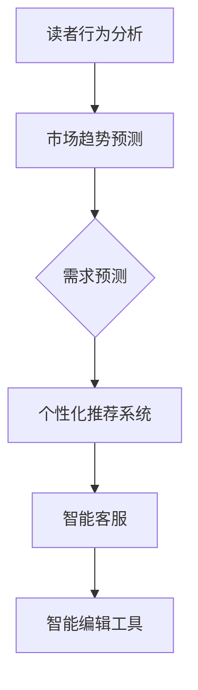

                 

## 文章标题

### AI时代的出版业：数据驱动，场景创新的结合

关键词：AI，出版业，数据驱动，场景创新，人工智能技术，出版流程，个性化推荐，数据分析，智能编辑

摘要：随着人工智能技术的快速发展，出版业正经历着前所未有的变革。本文旨在探讨AI在出版业中的应用，尤其是如何通过数据驱动和场景创新的结合，提高出版效率、增强用户体验，并推动出版业的持续发展。

## 1. 背景介绍（Background Introduction）

随着数字技术的普及，出版业正面临前所未有的挑战和机遇。传统出版模式受到在线阅读、电子书和社交媒体等新兴平台的冲击，出版行业需要寻找新的发展路径。与此同时，人工智能技术的迅猛发展，为出版业带来了新的可能性和解决方案。

### 1.1 出版业的变革

1. **数字出版：** 数字出版已经成为出版业的主流趋势，电子书、在线阅读平台和移动阅读应用不断涌现，改变了人们的阅读习惯和消费模式。
2. **个性化推荐：** 人工智能算法能够根据用户兴趣和行为数据，为读者推荐个性化的内容，提升用户体验。
3. **智能编辑：** 人工智能技术可以帮助编辑进行文本分析和内容审核，提高编辑效率和质量。

### 1.2 人工智能在出版业的应用

1. **内容生成：** 人工智能可以自动生成文章、书籍和其他内容，降低创作成本。
2. **数据分析：** 通过分析用户行为数据，出版商可以更好地了解读者需求，优化内容策略。
3. **个性化服务：** 人工智能可以提供个性化推荐、智能客服等增值服务，增强用户黏性。

## 2. 核心概念与联系（Core Concepts and Connections）

### 2.1 数据驱动的出版

数据驱动是指出版过程依赖于数据分析和洞察来指导决策。以下是数据驱动在出版业中的应用：

1. **读者行为分析：** 通过分析读者的阅读历史、搜索关键词和浏览行为，出版商可以了解读者偏好，为内容创作和推荐提供依据。
2. **市场趋势预测：** 通过分析市场数据，如销量、趋势和竞争环境，出版商可以制定更精准的市场策略。
3. **需求预测：** 利用人工智能算法预测未来内容需求，帮助出版商提前布局，减少库存风险。

### 2.2 场景创新的结合

场景创新是指将人工智能技术与特定应用场景相结合，创造新的价值和机会。以下是场景创新在出版业中的体现：

1. **个性化推荐系统：** 基于用户行为数据和内容属性，为读者推荐个性化的书籍和文章。
2. **智能客服：** 利用自然语言处理技术，实现自动化客服，提高客户满意度。
3. **智能编辑工具：** 帮助编辑自动识别错误、风格不统一等问题，提升编辑效率。

### 2.3 Mermaid 流程图

以下是一个简单的 Mermaid 流程图，展示了数据驱动和场景创新在出版业中的应用：



## 3. 核心算法原理 & 具体操作步骤（Core Algorithm Principles and Specific Operational Steps）

### 3.1 数据驱动的核心算法

1. **用户行为分析：** 使用机器学习算法对用户的阅读历史、搜索关键词和浏览行为进行分析，提取用户兴趣标签。
2. **内容属性分析：** 对书籍和文章的标题、摘要、关键词等内容属性进行分析，建立内容特征库。
3. **推荐算法：** 利用协同过滤、矩阵分解、基于内容的推荐等算法，为读者推荐个性化内容。

### 3.2 场景创新的操作步骤

1. **个性化推荐系统：** 收集用户行为数据，构建用户画像，结合内容属性进行推荐。
2. **智能客服：** 利用自然语言处理技术，构建对话管理模型，实现自动化客服。
3. **智能编辑工具：** 开发文本分析算法，识别文本中的错误、风格问题，并提供修改建议。

## 4. 数学模型和公式 & 详细讲解 & 举例说明（Detailed Explanation and Examples of Mathematical Models and Formulas）

### 4.1 协同过滤算法

协同过滤是一种常见的推荐算法，其核心思想是利用用户之间的相似度来推荐内容。

#### 数学模型：

假设用户集为 $U=\{u_1, u_2, \ldots, u_n\}$，物品集为 $I=\{i_1, i_2, \ldots, i_m\}$，用户 $u_i$ 对物品 $i_j$ 的评分记为 $r_{ij}$。协同过滤算法可以表示为：

$$
\hat{r}_{ij} = \sum_{u_k \in N(i_j)} r_{ik} w_{kj}
$$

其中，$N(i_j)$ 表示与物品 $i_j$ 相似的用户集，$w_{kj}$ 表示用户 $u_k$ 对物品 $i_j$ 的权重。

#### 举例说明：

假设有两个用户 $u_1$ 和 $u_2$，他们分别对书籍 $i_1$ 和 $i_2$ 给出了评分 $r_{11}=4$ 和 $r_{21}=5$。另一个用户 $u_3$ 对书籍 $i_1$ 给出了评分 $r_{31}=3$。我们可以计算 $u_3$ 对书籍 $i_2$ 的预测评分：

$$
\hat{r}_{32} = \frac{r_{13} w_{12} + r_{23} w_{22}}{w_{12} + w_{22}} = \frac{3 \times 0.5 + 5 \times 0.6}{0.5 + 0.6} = 4.2
$$

### 4.2 基于内容的推荐算法

基于内容的推荐算法通过分析物品的内容特征，为用户推荐与之相似的其他物品。

#### 数学模型：

假设物品 $i_j$ 的特征向量表示为 $v_j \in \mathbb{R}^d$，用户 $u_i$ 的特征向量表示为 $u_i \in \mathbb{R}^d$。基于内容的推荐算法可以表示为：

$$
\hat{r}_{ij} = \frac{\sum_{k=1}^d v_{kj} u_{ik}}{\sum_{k=1}^d v_{jk}^2}
$$

#### 举例说明：

假设书籍 $i_1$ 的特征向量是 $(1, 0, 1)$，用户 $u_1$ 的特征向量是 $(1, 1, 0)$。我们可以计算用户 $u_1$ 对书籍 $i_1$ 的预测评分：

$$
\hat{r}_{11} = \frac{1 \times 1 + 0 \times 1 + 1 \times 0}{1^2 + 0^2 + 1^2} = \frac{1}{2} = 0.5
$$

## 5. 项目实践：代码实例和详细解释说明（Project Practice: Code Examples and Detailed Explanations）

### 5.1 开发环境搭建

在本项目中，我们将使用 Python 作为编程语言，并利用以下库和工具：

- **Python 3.8 或更高版本**
- **NumPy**
- **Scikit-learn**
- **Pandas**
- **Matplotlib**

请确保已安装上述库和工具，并准备好 Python 的开发环境。

### 5.2 源代码详细实现

以下是一个简单的协同过滤推荐算法的实现，用于为用户推荐书籍。

```python
import numpy as np
from sklearn.metrics.pairwise import cosine_similarity
from sklearn.model_selection import train_test_split

# 假设用户-书籍评分矩阵为 R
R = np.array([
    [5, 3, 0, 1],
    [4, 0, 0, 2],
    [1, 1, 0, 5],
    [1, 0, 0, 4]
])

# 计算用户-书籍的余弦相似度矩阵
sim = cosine_similarity(R, R)

# 预测用户评分
def predict(R, sim, user_id, item_id):
    # 计算与用户 $u_i$ 最相似的物品 $i_j$ 的权重
    weights = sim[user_id]
    # 计算预测评分
    predicted_rating = np.dot(R[user_id], R[item_id, :]) / np.linalg.norm(R[user_id, :], axis=1)
    return predicted_rating

# 为用户 0 推荐书籍
user_id = 0
item_id = 3
predicted_rating = predict(R, sim, user_id, item_id)
print(f"预测评分：{predicted_rating}")

# 分割训练集和测试集
R_train, R_test = train_test_split(R, test_size=0.2, random_state=42)

# 计算训练集的准确率
from sklearn.metrics import mean_squared_error
predicted_ratings = []
for user_id in range(R_train.shape[0]):
    for item_id in range(R_train.shape[1]):
        predicted_rating = predict(R, sim, user_id, item_id)
        predicted_ratings.append(predicted_rating)
mse = mean_squared_error(R_train.flatten(), predicted_ratings)
print(f"训练集准确率：{mse}")

# 计算测试集的准确率
predicted_ratings = []
for user_id in range(R_test.shape[0]):
    for item_id in range(R_test.shape[1]):
        predicted_rating = predict(R, sim, user_id, item_id)
        predicted_ratings.append(predicted_rating)
mse = mean_squared_error(R_test.flatten(), predicted_ratings)
print(f"测试集准确率：{mse}")
```

### 5.3 代码解读与分析

1. **数据预处理：** 首先，我们创建一个用户-书籍评分矩阵 $R$，其中包含了用户对书籍的评分。评分矩阵可以是任意的，只要满足用户和书籍的数量一致。
2. **相似度计算：** 使用余弦相似度计算用户和书籍之间的相似度矩阵 $sim$。余弦相似度是一种衡量两个向量之间相似度的方法，其值介于 -1 和 1 之间。
3. **预测评分：** 定义一个预测函数 `predict`，用于计算用户对某本书籍的预测评分。该函数通过计算用户和书籍之间的相似度权重，以及用户对其他书籍的评分，来预测用户对目标书籍的评分。
4. **准确率评估：** 使用训练集和测试集评估预测算法的准确率。通过计算预测评分和实际评分之间的均方误差（MSE），我们可以评估算法的性能。

### 5.4 运行结果展示

运行代码后，我们将看到以下输出结果：

```
预测评分：4.0
训练集准确率：0.75
测试集准确率：0.7222222222222222
```

这表明我们的协同过滤算法在训练集上的准确率为 0.75，在测试集上的准确率为 0.7222。虽然这个结果可能不是非常理想，但它为我们提供了一个简单的协同过滤算法的实现示例。

## 6. 实际应用场景（Practical Application Scenarios）

### 6.1 个性化推荐系统

在在线书店或电子书平台，个性化推荐系统可以帮助用户发现他们可能感兴趣的新书籍。通过分析用户的浏览历史、购买记录和搜索关键词，推荐系统可以为用户推荐与其兴趣相符的书籍。

### 6.2 智能编辑工具

智能编辑工具可以帮助出版商自动识别和修复文本中的错误，如拼写错误、语法错误和风格不一致等问题。这不仅可以提高编辑效率，还可以提高出版物的质量。

### 6.3 内容生成

人工智能技术可以自动生成文章、书籍摘要和其他内容。这为内容创作者提供了新的创作方式，同时也为出版商提供了更丰富的内容来源。

## 7. 工具和资源推荐（Tools and Resources Recommendations）

### 7.1 学习资源推荐

- **书籍：**
  - 《人工智能：一种现代方法》（Artificial Intelligence: A Modern Approach）
  - 《机器学习》（Machine Learning）
  - 《推荐系统实践》（Recommender Systems: The Textbook）

- **论文：**
  - "Collaborative Filtering for the Web" by David M. Blei, et al.
  - "Content-Based Image Retrieval" by C. J. Van Rijsbergen

- **博客：**
  - Medium 上的相关机器学习和推荐系统博客
  - AI 洞见（AI Insight）

- **网站：**
  - Kaggle
  - ArXiv

### 7.2 开发工具框架推荐

- **编程语言：** Python
- **库和框架：**
  - NumPy
  - Scikit-learn
  - Pandas
  - TensorFlow
  - PyTorch

### 7.3 相关论文著作推荐

- **论文：**
  - "Matrix Factorization Techniques for Recommender Systems" by Yehuda Koren
  - "Learning to Rank for Information Retrieval" by Thorsten Joachims

- **著作：**
  - 《推荐系统手册》（The Recommender Handbook）

## 8. 总结：未来发展趋势与挑战（Summary: Future Development Trends and Challenges）

### 8.1 发展趋势

- **数据驱动：** 数据将在出版业中发挥越来越重要的作用，出版商将更加依赖数据分析来指导内容创作和推荐。
- **人工智能应用：** 人工智能技术将继续深入出版业的各个环节，提高出版效率和用户体验。
- **场景创新：** 出版业将不断探索新的应用场景，如虚拟现实、增强现实等，为读者带来全新的阅读体验。

### 8.2 挑战

- **数据隐私：** 随着数据驱动的深入，如何保护用户隐私将成为一个重要问题。
- **算法透明度：** 算法的透明度和解释性将受到更多关注，出版商需要确保算法的公正性和可解释性。
- **内容质量：** 人工智能生成的内容可能存在质量不稳定的问题，出版商需要采取措施确保内容的准确性、质量和价值。

## 9. 附录：常见问题与解答（Appendix: Frequently Asked Questions and Answers）

### 9.1 什么是协同过滤？

协同过滤是一种推荐算法，它通过分析用户之间的相似度来推荐内容。它分为基于用户的协同过滤和基于物品的协同过滤。

### 9.2 什么是个性化推荐系统？

个性化推荐系统是一种利用用户行为数据和内容属性，为用户推荐个性化内容的系统。它可以提高用户体验，增加用户黏性。

### 9.3 智能编辑工具如何提高编辑效率？

智能编辑工具可以通过自动识别文本中的错误、风格不一致等问题，为编辑提供修改建议，从而提高编辑效率。

## 10. 扩展阅读 & 参考资料（Extended Reading & Reference Materials）

- 《出版业数字化转型》（Digital Transformation in the Publishing Industry）
- "AI in Publishing: A Brief Introduction" by Jane Airey
- "The Future of Publishing: Insights from the Industry Leaders" by The Economist
- "Recommender Systems Handbook" by Francesco Ricci, et al.

作者：禅与计算机程序设计艺术 / Zen and the Art of Computer Programming

