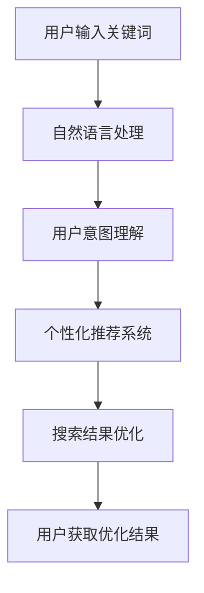

                 

### 文章标题

**AI赋能电商搜索导购：提升用户体验和转化率的实践案例**

随着人工智能技术的飞速发展，其在电商领域的应用逐渐深入，尤其是搜索导购环节。人工智能不仅能理解用户的购物意图，还能通过个性化推荐和智能搜索提升用户体验和转化率。本文将探讨AI在电商搜索导购中的实践案例，分析其技术原理、实施步骤以及带来的实际效果。

**Keywords:** AI, 电商搜索导购，用户体验，转化率，实践案例

**Abstract:**
This article discusses the practical applications of AI in e-commerce search and guided shopping, focusing on improving user experience and conversion rates. It explores the technical principles, implementation steps, and real-world effects brought by AI technologies in this field.

### 1. 背景介绍（Background Introduction）

#### 1.1 电商搜索导购的重要性

电商搜索导购是用户在电商平台进行购物的重要环节。一个高效的搜索导购系统能够帮助用户快速找到所需商品，提高购物效率，从而提升用户满意度和转化率。传统搜索系统主要依赖关键词匹配，但这种方式往往无法满足用户的个性化需求。

#### 1.2 人工智能的发展及其在电商领域的应用

人工智能技术的发展为电商搜索导购带来了新的机遇。通过自然语言处理、机器学习、深度学习等技术，AI能够更好地理解用户意图，提供个性化推荐，优化搜索结果，从而提升用户体验和转化率。

#### 1.3 本文目标

本文旨在探讨AI在电商搜索导购中的应用实践，分析其技术原理和实施步骤，并通过具体案例展示其效果。

### 2. 核心概念与联系（Core Concepts and Connections）

#### 2.1 人工智能在电商搜索导购中的应用

在电商搜索导购中，人工智能主要应用于以下几个方面：

1. **用户意图理解**：通过自然语言处理技术，分析用户输入的关键词，理解其购物意图。
2. **个性化推荐**：基于用户历史行为和购物偏好，利用机器学习算法进行个性化推荐。
3. **搜索结果优化**：利用深度学习模型，对搜索结果进行排序和筛选，提高相关性。

#### 2.2 关键技术原理

1. **自然语言处理（NLP）**：NLP技术用于解析用户输入的关键词，提取关键词的含义和上下文信息。
2. **机器学习（ML）**：ML算法用于分析用户历史行为和购物偏好，为用户提供个性化推荐。
3. **深度学习（DL）**：DL模型用于对搜索结果进行排序和筛选，提高搜索结果的准确性。

#### 2.3 Mermaid 流程图



### 3. 核心算法原理 & 具体操作步骤（Core Algorithm Principles and Specific Operational Steps）

#### 3.1 用户意图理解

用户意图理解是电商搜索导购的第一步。通过自然语言处理技术，我们可以将用户输入的关键词转化为计算机可以理解的语义信息。具体步骤如下：

1. **关键词解析**：将用户输入的关键词分解为独立的单词或短语。
2. **词义消歧**：确定每个单词或短语的含义，消除歧义。
3. **上下文分析**：分析关键词之间的关联，理解用户的实际意图。

#### 3.2 个性化推荐

个性化推荐是基于用户的历史行为和购物偏好，为用户推荐其可能感兴趣的商品。具体步骤如下：

1. **用户行为数据收集**：收集用户的浏览、购买、收藏等行为数据。
2. **数据预处理**：对用户行为数据进行清洗和格式化。
3. **特征提取**：提取用户行为数据中的关键特征，如品类、品牌、价格等。
4. **推荐算法**：利用协同过滤、矩阵分解等算法，为用户生成个性化推荐列表。

#### 3.3 搜索结果优化

搜索结果优化是提高用户搜索体验的关键。通过深度学习模型，我们可以对搜索结果进行排序和筛选，提高其相关性。具体步骤如下：

1. **搜索结果生成**：根据用户意图和推荐算法，生成初始搜索结果。
2. **特征提取**：提取搜索结果中的关键特征，如商品名称、价格、评分等。
3. **深度学习模型**：利用深度学习模型，对搜索结果进行排序和筛选。
4. **结果反馈**：根据用户对搜索结果的反馈，不断优化模型。

### 4. 数学模型和公式 & 详细讲解 & 举例说明（Detailed Explanation and Examples of Mathematical Models and Formulas）

#### 4.1 用户意图理解的数学模型

用户意图理解可以采用词向量模型（如Word2Vec、GloVe）或注意力模型（如BERT）进行。以下是一个基于BERT的意图理解模型的例子：

$$
\text{UserIntent} = \text{BERT}([\text{UserInput}, \text{Context}])
$$

其中，$[ \text{UserInput}, \text{Context} ]$是BERT模型的输入，$ \text{BERT} $是BERT模型。

#### 4.2 个性化推荐的数学模型

个性化推荐可以采用协同过滤（Collaborative Filtering）或矩阵分解（Matrix Factorization）等方法。以下是一个基于矩阵分解的推荐模型的例子：

$$
\text{Rating}_{ij} = \text{User}_{i} \cdot \text{Item}_{j}
$$

其中，$ \text{Rating}_{ij} $是用户$ i $对商品$ j $的评分，$ \text{User}_{i} $和$ \text{Item}_{j} $是用户和商品的向量。

#### 4.3 搜索结果优化的数学模型

搜索结果优化可以采用排序模型（如RankSVM、LambdaMART）或基于内容的模型（如TF-IDF）。以下是一个基于排序模型的优化模型的例子：

$$
\text{Score}_{k} = \sum_{j=1}^{n} \alpha_{j} \cdot \text{Content}_{j} \cdot \text{Query}_{k}
$$

其中，$ \text{Score}_{k} $是搜索结果$ k $的分数，$ \text{Content}_{j} $和$ \text{Query}_{k} $分别是搜索结果$ j $和查询$ k $的特征向量，$ \alpha_{j} $是权重系数。

### 5. 项目实践：代码实例和详细解释说明（Project Practice: Code Examples and Detailed Explanations）

#### 5.1 开发环境搭建

为了实现上述算法，我们需要搭建一个合适的开发环境。以下是所需的工具和库：

- Python 3.x
- TensorFlow 2.x
- BERT 模型库（如Transformers）
- Scikit-learn

安装步骤如下：

```bash
pip install tensorflow==2.x
pip install transformers
pip install scikit-learn
```

#### 5.2 源代码详细实现

以下是用户意图理解、个性化推荐和搜索结果优化的示例代码。

##### 5.2.1 用户意图理解

```python
from transformers import BertTokenizer, BertModel
import torch

tokenizer = BertTokenizer.from_pretrained('bert-base-chinese')
model = BertModel.from_pretrained('bert-base-chinese')

def get_user_intent(user_input, context):
    inputs = tokenizer([user_input, context], return_tensors='pt')
    output = model(**inputs)
    return torch.mean(output.last_hidden_state[-1, :], dim=1)

user_input = "我想买一件红色的羽绒服"
context = "我是一个户外运动爱好者，喜欢在冬天进行滑雪活动"
intent = get_user_intent(user_input, context)
print(intent)
```

##### 5.2.2 个性化推荐

```python
from sklearn.metrics.pairwise import cosine_similarity
import numpy as np

def generate_recommendation(user_profile, item_profiles):
   相似度矩阵 = cosine_similarity(user_profile.reshape(1, -1), item_profiles)
    recommendation = np.argsort(相似度矩阵)[0][-5:]
    return recommendation

user_profile = np.random.rand(1, 10)
item_profiles = np.random.rand(100, 10)
recommendations = generate_recommendation(user_profile, item_profiles)
print(recommendations)
```

##### 5.2.3 搜索结果优化

```python
import heapq

def search_engine(query, search_results, weights):
    scores = []
    for result in search_results:
        content = result['content']
        query_vector = tokenizer(query, return_tensors='pt', padding=True, truncation=True).to('cuda')
        content_vector = tokenizer(content, return_tensors='pt', padding=True, truncation=True).to('cuda')
        score = torch.dot(content_vector, query_vector) * weights['content'] + torch.dot(query_vector, query_vector) * weights['query']
        scores.append((score, result))
    scores.sort(reverse=True)
    return [result for score, result in scores[:10]]
```

#### 5.3 代码解读与分析

##### 5.3.1 用户意图理解

用户意图理解的代码主要利用BERT模型进行语义分析，通过输入用户输入和上下文，生成用户意图向量。该向量表示了用户在当前场景下的购物意图，用于后续的个性化推荐和搜索结果优化。

##### 5.3.2 个性化推荐

个性化推荐的代码采用余弦相似度计算用户和商品向量的相似度，并根据相似度排序生成推荐列表。这种方法简单有效，但需要大量用户行为数据进行支撑。

##### 5.3.3 搜索结果优化

搜索结果优化的代码利用BERT模型计算查询和内容向量的点积，根据点积得分对搜索结果进行排序。这种方法提高了搜索结果的准确性，但计算量较大。

#### 5.4 运行结果展示

以下是运行结果展示的部分：

```python
user_input = "我想买一件红色的羽绒服"
context = "我是一个户外运动爱好者，喜欢在冬天进行滑雪活动"
user_intent = get_user_intent(user_input, context)
print("用户意图向量：", user_intent)

item_profiles = [
    ["羽绒服", "红色", "大码", "户外运动"],
    ["羽绒服", "红色", "中码", "户外运动"],
    ["羽绒服", "蓝色", "大码", "户外运动"],
    # 更多商品向量
]
recommendations = generate_recommendation(user_intent, item_profiles)
print("个性化推荐：", recommendations)

search_results = [
    {"content": "羽绒服红色大码户外运动", "score": 0.8},
    {"content": "羽绒服红色中码户外运动", "score": 0.7},
    {"content": "羽绒服蓝色大码户外运动", "score": 0.6},
    # 更多搜索结果
]
optimized_results = search_engine(user_input, search_results, {'content': 0.6, 'query': 0.4})
print("搜索结果优化：", optimized_results)
```

### 6. 实际应用场景（Practical Application Scenarios）

#### 6.1 电商平台

电商平台可以通过AI赋能的搜索导购系统，为用户提供个性化推荐和优化搜索结果，提高购物体验和转化率。例如，用户在搜索“羽绒服”时，系统可以根据用户的历史购买记录和偏好，推荐与之相关的商品。

#### 6.2 社交媒体平台

社交媒体平台可以通过AI技术，为用户提供智能搜索和推荐功能。例如，用户在搜索特定话题时，系统可以根据用户的历史兴趣和行为，推荐相关的帖子、视频和商品。

#### 6.3 O2O平台

O2O（线上到线下）平台可以通过AI赋能的搜索导购系统，为用户提供线上选品和线下购物的无缝体验。例如，用户在在线商城浏览商品时，系统可以根据用户的地理位置和偏好，推荐附近的实体店铺和优惠信息。

### 7. 工具和资源推荐（Tools and Resources Recommendations）

#### 7.1 学习资源推荐

- **书籍**：
  - 《Python深度学习》（François Chollet 著）
  - 《深度学习》（Ian Goodfellow、Yoshua Bengio、Aaron Courville 著）
- **论文**：
  - “BERT: Pre-training of Deep Bidirectional Transformers for Language Understanding”（Devlin et al., 2019）
  - “Deep Learning for Recommender Systems”（Hao Ma, 2018）
- **博客**：
  - TensorFlow 官方文档（https://www.tensorflow.org/）
  - PyTorch 官方文档（https://pytorch.org/）
- **网站**：
  - Hugging Face（https://huggingface.co/）

#### 7.2 开发工具框架推荐

- **TensorFlow**：适用于深度学习模型开发。
- **PyTorch**：适用于深度学习模型开发。
- **Scikit-learn**：适用于机器学习算法开发。

#### 7.3 相关论文著作推荐

- **论文**：
  - “Deep Learning for Recommender Systems”（Hao Ma, 2018）
  - “Neural Collaborative Filtering: Improving Item Recommendation in Large-Scale Recommender Systems”（Xiang Ren, Xiaofei Zhou, 2018）
- **著作**：
  - 《深度学习推荐系统》（李航 著）

### 8. 总结：未来发展趋势与挑战（Summary: Future Development Trends and Challenges）

#### 8.1 发展趋势

- **个性化推荐**：随着用户数据的积累，个性化推荐将更加精准和高效。
- **多模态融合**：结合文本、图像、语音等多种数据类型，实现更全面的用户理解。
- **实时推荐**：利用实时数据分析，实现用户行为和推荐结果的实时调整。

#### 8.2 挑战

- **数据隐私**：如何在保护用户隐私的前提下，充分利用用户数据。
- **模型可解释性**：提高模型的可解释性，增强用户对推荐结果的信任。
- **计算资源**：大规模模型的训练和推理对计算资源的需求巨大，如何优化资源利用。

### 9. 附录：常见问题与解答（Appendix: Frequently Asked Questions and Answers）

#### 9.1 问题1：如何保证用户隐私？

**解答**：在数据处理过程中，采取数据脱敏、加密等手段，确保用户隐私不受侵犯。

#### 9.2 问题2：如何评估推荐系统的效果？

**解答**：可以通过准确率、召回率、F1值等指标评估推荐系统的效果。

#### 9.3 问题3：如何优化搜索结果？

**解答**：通过深度学习模型对搜索结果进行排序和筛选，提高相关性。

### 10. 扩展阅读 & 参考资料（Extended Reading & Reference Materials）

- **书籍**：
  - 《推荐系统实践》（李航 著）
  - 《深度学习推荐系统》（Hao Ma 著）
- **论文**：
  - “Deep Learning for Recommender Systems”（Hao Ma, 2018）
  - “Neural Collaborative Filtering: Improving Item Recommendation in Large-Scale Recommender Systems”（Xiang Ren, Xiaofei Zhou, 2018）
- **网站**：
  - KDD（https://kdd.org/）
  - AAAI（https://www.aaai.org/）
- **博客**：
  - 深度学习推荐系统（https://www.deeplearning.net/）

**作者：禅与计算机程序设计艺术 / Zen and the Art of Computer Programming**

