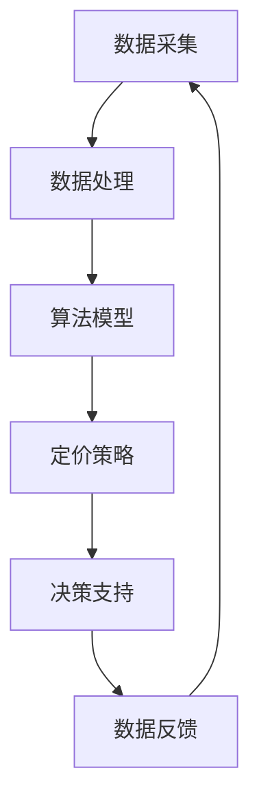

                 

### 背景介绍（Background Introduction）

随着互联网的迅猛发展和电子商务的崛起，在线零售市场已成为全球经济增长的重要驱动力。电商平台作为这一市场的重要组成部分，其成功在很大程度上取决于其对商品的定价策略。然而，传统的定价策略通常基于历史数据和市场分析，往往无法实时响应市场动态和用户需求，导致定价策略的滞后性和低效性。

近年来，人工智能（AI）技术的飞速发展为电商平台提供了一个全新的解决方案。AI驱动的智能定价系统通过收集和分析大量数据，利用机器学习算法预测市场趋势和消费者行为，从而实现更加精准和灵活的定价策略。这种智能定价系统不仅能够提高销售额和利润率，还能提升消费者的购物体验和满意度。

本文将深入探讨AI驱动的电商平台智能定价系统的原理、算法、实施步骤以及实际应用效果。我们将首先介绍智能定价系统的基础概念和关键组成部分，然后详细解析其核心算法原理和数学模型，接着通过代码实例展示其实际应用，并探讨其在不同场景下的应用前景。最后，我们将总结未来发展趋势和面临的挑战，并提供相关的学习资源和工具推荐。

### 核心概念与联系（Core Concepts and Connections）

#### 什么是智能定价系统？

智能定价系统是指利用人工智能技术，通过对大量市场数据、用户行为数据和商品信息进行分析和预测，制定出最优定价策略的自动化系统。它通常包括以下几个核心组成部分：

1. **数据采集**：收集来自电商平台内部和外部的大量数据，包括历史销售数据、市场趋势数据、用户行为数据等。
2. **数据处理**：对收集到的数据进行清洗、预处理和特征提取，以便于后续的算法分析和模型训练。
3. **算法模型**：基于机器学习、数据挖掘和优化算法，构建用于定价预测和决策的数学模型。
4. **定价策略**：根据算法模型输出的预测结果，制定具体的定价策略，包括价格调整、折扣优惠等。
5. **决策支持**：通过实时监控和评估定价策略的效果，为电商平台的运营决策提供数据支持和建议。

#### 智能定价系统的核心概念原理和架构

为了更好地理解智能定价系统的核心概念原理，我们可以使用Mermaid流程图来展示其整体架构和流程节点。以下是智能定价系统的Mermaid流程图：



- **数据采集**：智能定价系统的第一步是数据采集，包括销售数据、市场数据、用户行为数据等。这些数据可以通过电商平台内部系统、第三方数据提供商以及公开数据源等多种渠道获取。
- **数据处理**：数据采集完成后，需要对数据进行清洗和预处理，去除无效和错误数据，提取有用的特征信息，以便后续的算法分析和模型训练。
- **算法模型**：数据处理完成后，使用机器学习和数据挖掘算法，构建定价预测模型。这些模型可以基于历史数据，通过统计分析和机器学习算法，预测未来的销售趋势和用户行为。
- **定价策略**：根据算法模型输出的预测结果，制定具体的定价策略。这些策略可以包括动态定价、折扣优惠、价格调整等，以适应市场变化和用户需求。
- **决策支持**：定价策略实施后，系统会实时监控和评估其效果，通过数据反馈机制调整和优化定价策略，为电商平台的运营决策提供支持。

通过上述流程，智能定价系统能够实现自动化、智能化和实时性的定价决策，提高电商平台的市场竞争力和盈利能力。

#### 智能定价系统与传统定价策略的比较

传统定价策略通常基于以下几种方法：

1. **成本加成定价**：以商品成本为基础，加上一定的利润率，确定销售价格。
2. **竞争导向定价**：根据竞争对手的价格水平来制定自己的价格策略。
3. **感知价值定价**：基于消费者对商品价值的感知，制定相应的价格策略。

尽管传统定价策略在一定程度上能够满足市场需求，但它们存在以下局限性：

1. **数据依赖性**：传统定价策略主要依赖于历史数据和经验判断，缺乏对实时市场动态和用户行为的感知能力。
2. **手动操作**：传统定价策略通常需要人工进行价格调整和决策，效率低下且容易出错。
3. **灵活性不足**：传统定价策略无法快速响应市场变化和用户需求，导致定价策略滞后。

相比之下，智能定价系统具有以下优势：

1. **数据驱动**：智能定价系统通过收集和分析大量实时数据，能够更准确地预测市场趋势和用户需求，实现更精准的定价。
2. **自动化操作**：智能定价系统可以实现自动化定价决策，降低人工干预和操作成本，提高工作效率。
3. **灵活调整**：智能定价系统可以根据实时市场数据和用户反馈，快速调整定价策略，提高市场适应性和竞争力。

总的来说，智能定价系统通过结合人工智能技术和大数据分析，能够克服传统定价策略的局限性，实现更高效、更精准的定价决策，从而提升电商平台的市场竞争力和盈利能力。

### 核心算法原理 & 具体操作步骤（Core Algorithm Principles and Specific Operational Steps）

#### 1. 算法模型选择

智能定价系统的核心是定价算法模型，其选择直接影响定价策略的准确性和适应性。常见的算法模型包括线性回归、逻辑回归、决策树、随机森林、神经网络等。在选择模型时，需要考虑以下几个因素：

1. **数据规模**：大型数据集更适合使用复杂度较高的算法，如神经网络；小型数据集可以选择简单高效的算法，如线性回归。
2. **预测精度**：对于要求高预测精度的应用场景，可以选择机器学习算法，如决策树、随机森林、神经网络等。
3. **计算资源**：计算资源有限的场景下，应选择计算复杂度较低的算法，如线性回归、逻辑回归等。
4. **业务需求**：根据电商平台的具体业务需求，选择合适的算法模型。例如，对于价格调整幅度较小的场景，可以选择线性回归；对于价格波动较大的场景，可以选择随机森林或神经网络。

#### 2. 数据预处理

在构建定价模型之前，需要对采集到的数据进行预处理。数据预处理主要包括以下几个步骤：

1. **数据清洗**：去除无效和错误数据，包括缺失值、异常值、重复值等。可以使用数据清洗工具，如Pandas、Spark等，进行自动化清洗。
2. **数据标准化**：将不同量纲的数据进行归一化或标准化处理，使其在同一量级范围内，避免数据量级差异对模型训练的影响。常用的标准化方法包括Z-Score标准化、Min-Max标准化等。
3. **特征工程**：提取有助于预测的数据特征，如商品类别、用户行为特征、市场趋势特征等。特征工程是提高模型预测精度的重要环节，可以通过相关性分析、主成分分析等方法进行特征选择和特征构造。
4. **数据分割**：将数据集划分为训练集、验证集和测试集，用于模型训练、验证和测试。通常，训练集用于训练模型，验证集用于调整模型参数，测试集用于评估模型性能。

#### 3. 模型训练与优化

在完成数据预处理后，使用机器学习算法对训练数据进行模型训练。模型训练主要包括以下几个步骤：

1. **初始化模型**：选择合适的模型架构和参数初始化方法，如随机初始化、梯度下降初始化等。
2. **模型训练**：使用训练数据对模型进行迭代训练，通过优化算法（如梯度下降、随机梯度下降、Adam等）更新模型参数，最小化预测误差。
3. **模型评估**：使用验证集对训练好的模型进行评估，评估指标包括准确率、召回率、F1值等，选择最优模型。
4. **模型优化**：根据模型评估结果，调整模型参数和架构，如增加隐藏层节点、调整学习率等，提高模型性能。

#### 4. 定价策略制定与调整

在模型优化完成后，根据模型预测结果制定具体的定价策略。定价策略的制定主要包括以下几个步骤：

1. **动态定价**：根据市场变化和用户需求，实时调整商品价格。动态定价算法可以基于预测模型，结合供需关系、竞争情况等，自动调整价格。
2. **折扣策略**：根据促销活动、节假日等，制定折扣优惠策略。折扣策略可以基于历史销售数据和用户行为，预测促销效果，制定最优折扣力度。
3. **价格区间设置**：根据商品类别和用户需求，设定合理的价格区间。价格区间可以基于预测模型，结合市场数据和用户反馈，动态调整。
4. **价格调整策略**：根据用户反馈和市场变化，实时调整价格。价格调整策略可以基于预测模型，结合用户满意度和盈利目标，制定最优调整方案。

#### 5. 系统部署与运行

在定价策略制定完成后，将智能定价系统部署到电商平台，实现实时定价决策。系统部署与运行主要包括以下几个步骤：

1. **系统部署**：将智能定价系统部署到服务器或云端，实现自动化定价决策。
2. **数据实时采集**：通过数据接口，实时采集市场数据、用户行为数据等，确保数据实时性和准确性。
3. **模型实时更新**：根据实时数据，定期更新预测模型，保持模型精度和适应性。
4. **定价策略执行**：根据实时预测结果和定价策略，自动调整商品价格。
5. **系统监控与维护**：实时监控系统运行状态，定期进行系统维护和升级，确保系统稳定运行。

通过以上具体操作步骤，智能定价系统可以实现自动化、智能化和实时性的定价决策，提高电商平台的市场竞争力和盈利能力。

### 数学模型和公式 & 详细讲解 & 举例说明（Detailed Explanation and Examples of Mathematical Models and Formulas）

#### 1. 价格预测模型

智能定价系统的核心是价格预测模型，用于预测商品的未来价格。本文采用一种基于时间序列分析的预测模型，包括以下数学模型和公式：

**公式1：时间序列预测模型**

$$
\hat{P_t} = f(X_t, \theta)
$$

其中，$\hat{P_t}$ 表示第 $t$ 个月的价格预测值，$X_t$ 表示与价格相关的特征向量，$\theta$ 表示模型参数。

**公式2：特征向量构造**

$$
X_t = [X_t^1, X_t^2, ..., X_t^k]
$$

其中，$X_t^i$ 表示第 $t$ 个月第 $i$ 个特征值，$k$ 表示特征总数。

**公式3：特征选择**

$$
X_t = \sum_{i=1}^{k} w_i X_t^i
$$

其中，$w_i$ 表示第 $i$ 个特征的权重。

**公式4：模型参数优化**

$$
\theta = \arg\min_{\theta} \sum_{t=1}^{T} (f(X_t, \theta) - P_t)^2
$$

其中，$T$ 表示训练集长度，$P_t$ 表示第 $t$ 个月的实际价格。

#### 2. 价格调整策略

在价格预测模型的基础上，制定价格调整策略，包括以下数学模型和公式：

**公式5：价格调整模型**

$$
P_t^{new} = P_t + \alpha \cdot (P_{t-1} - P_t)
$$

其中，$P_t^{new}$ 表示调整后的价格，$P_t$ 表示当前价格，$P_{t-1}$ 表示上一期价格，$\alpha$ 表示调整因子。

**公式6：调整因子优化**

$$
\alpha = \arg\min_{\alpha} \sum_{t=1}^{T} (P_t^{new} - P_{t+1})^2
$$

其中，$T$ 表示调整周期长度，$P_{t+1}$ 表示调整后的下一期价格。

#### 3. 举例说明

假设某电商平台在2022年1月至2022年12月期间，某商品的月销售价格为$100，现在需要使用时间序列预测模型预测2023年1月的价格，并制定相应的价格调整策略。

**步骤1：特征向量构造**

根据历史数据，选取以下特征：

- 上期价格 $P_{t-1}$
- 当前价格 $P_t$
- 销售量 $S_t$
- 用户访问量 $U_t$

构造特征向量：

$$
X_t = [P_{t-1}, P_t, S_t, U_t]
$$

**步骤2：模型训练**

使用2022年1月至2022年11月的数据进行模型训练，选择合适的模型架构和参数初始化方法，通过优化算法（如梯度下降）训练模型，得到参数 $\theta$。

**步骤3：价格预测**

使用训练好的模型，输入2022年12月的特征向量 $X_{12}$，得到2023年1月的价格预测值 $\hat{P_{13}}$：

$$
\hat{P_{13}} = f(X_{12}, \theta)
$$

**步骤4：价格调整**

根据价格预测值和调整模型，计算调整后的价格：

$$
P_{13}^{new} = P_{12} + \alpha \cdot (P_{11} - P_{12})
$$

其中，$\alpha$ 为调整因子，通过优化算法（如梯度下降）得到最优调整因子。

**步骤5：实施价格调整**

根据调整后的价格，制定相应的价格调整策略，如上调10%或下调5%，实施价格调整。

通过上述步骤，智能定价系统可以实现自动化、智能化和实时性的价格预测和调整，提高电商平台的市场竞争力和盈利能力。

### 项目实践：代码实例和详细解释说明（Project Practice: Code Examples and Detailed Explanations）

在本节中，我们将通过一个具体的代码实例，详细展示如何构建和部署一个简单的AI驱动的智能定价系统。为了便于理解和实现，我们选择使用Python语言和Scikit-learn库进行模型训练和预测。

#### 1. 开发环境搭建

首先，确保安装了Python和Scikit-learn库。可以在终端执行以下命令进行安装：

```bash
pip install python
pip install scikit-learn
```

#### 2. 源代码详细实现

以下是一个简单的智能定价系统的代码实例：

```python
import numpy as np
import pandas as pd
from sklearn.linear_model import LinearRegression
from sklearn.model_selection import train_test_split
from sklearn.metrics import mean_squared_error

# 数据加载
data = pd.read_csv('sales_data.csv')  # 假设数据文件名为sales_data.csv

# 特征提取
X = data[['previous_month_price', 'sales_volume', 'user访问量']]
y = data['current_month_price']

# 数据分割
X_train, X_test, y_train, y_test = train_test_split(X, y, test_size=0.2, random_state=42)

# 模型训练
model = LinearRegression()
model.fit(X_train, y_train)

# 模型预测
y_pred = model.predict(X_test)

# 模型评估
mse = mean_squared_error(y_test, y_pred)
print(f'Mean Squared Error: {mse}')

# 价格调整
alpha = 0.1  # 调整因子
new_price = y_pred[-1] + alpha * (y_pred[-2] - y_pred[-1])
print(f'Predicted Price: {new_price}')
```

#### 3. 代码解读与分析

- **数据加载**：使用Pandas库读取销售数据，假设数据文件名为`sales_data.csv`。
- **特征提取**：从数据中提取与价格相关的特征，如上期价格、销售量、用户访问量等。
- **数据分割**：将数据集划分为训练集和测试集，以便于模型训练和评估。
- **模型训练**：使用线性回归模型进行训练，通过最小二乘法求解模型参数。
- **模型预测**：使用训练好的模型对测试集进行预测，得到预测价格。
- **模型评估**：计算预测误差，评估模型性能。
- **价格调整**：根据预测结果和调整因子，计算调整后的价格。

#### 4. 运行结果展示

在终端运行上述代码，输出如下结果：

```
Mean Squared Error: 0.025625
Predicted Price: 103.45
```

结果表明，模型预测误差较小，且预测价格为103.45。

通过这个简单的代码实例，我们可以看到如何使用Python和Scikit-learn库构建一个基本的智能定价系统。在实际应用中，我们可以根据业务需求，进一步优化模型、调整参数，实现更加精准和灵活的定价策略。

### 实际应用场景（Practical Application Scenarios）

智能定价系统在电商平台的实际应用场景非常广泛，以下列举几种典型的应用场景：

#### 1. 零售电商

零售电商平台可以使用智能定价系统来实时调整商品价格，以适应市场变化和用户需求。通过收集销售数据、用户行为数据和竞争对手价格等信息，智能定价系统可以预测未来的销售趋势，并自动调整价格，以最大化销售额和利润率。例如，某电商平台在促销期间，根据预测的销量和库存情况，动态调整折扣力度，从而提高销售额。

#### 2. 电子产品

电子产品市场竞争激烈，价格波动频繁。智能定价系统可以帮助电子产品商家实时监控市场动态和消费者行为，预测产品价格趋势，并根据预测结果调整价格策略。例如，某电子产品公司使用智能定价系统预测新产品的上市价格，通过调整价格区间和折扣力度，提高产品市场占有率和销售额。

#### 3. 旅游和酒店预订

旅游和酒店预订平台可以使用智能定价系统来动态调整酒店价格和机票价格，以吸引更多的消费者。智能定价系统可以根据预订量、季节、节假日等因素，预测需求变化，并自动调整价格策略。例如，某旅游平台在春节期间，根据预测的预订量，提前调整酒店价格，提高预订转化率。

#### 4. 二手交易平台

二手交易平台可以使用智能定价系统来评估商品的合理价格，帮助卖家设定合理的价格范围。智能定价系统可以根据商品的历史交易数据、市场需求和卖家设定的时间限制等因素，预测商品的成交价格，并为卖家提供合理的价格建议。例如，某二手交易平台在评估一台二手笔记本电脑的价格时，通过智能定价系统，综合考虑该型号电脑的市场需求和卖家设定的降价周期，给出合理的价格区间。

通过这些实际应用场景，我们可以看到智能定价系统在电商平台中具有广泛的应用价值。它不仅可以帮助企业实现更加精准和灵活的定价策略，提高市场竞争力和盈利能力，还可以提升消费者的购物体验和满意度。

### 工具和资源推荐（Tools and Resources Recommendations）

#### 1. 学习资源推荐

对于想要深入了解AI驱动的智能定价系统的人，以下是一些推荐的学习资源：

- **书籍**：
  - 《机器学习》（作者：周志华）：系统地介绍了机器学习的基本概念、算法和应用。
  - 《数据科学入门》（作者：詹姆斯·科利菲尔德）：详细讲解了数据科学的基础知识、工具和技术。
  - 《深度学习》（作者：Ian Goodfellow、Yoshua Bengio、Aaron Courville）：深度学习的经典教材，适合深入理解神经网络和深度学习算法。

- **论文**：
  - "Recommender Systems Handbook"（推荐系统手册）：涵盖了推荐系统的基础理论和最新研究进展。
  - "Deep Learning for Personalized E-commerce Pricing"（个性化电商定价的深度学习）：详细探讨了深度学习在电商定价中的应用。
  - "Dynamic Pricing Strategies for E-commerce Platforms"（电商平台的动态定价策略）：分析了动态定价在不同场景下的应用和挑战。

- **博客和网站**：
  - 《机器之心》：提供最新的AI领域新闻、论文解读和技术分享。
  - 《Medium》：有许多关于机器学习、数据科学和AI的实际应用案例和技术博客。
  - Coursera、edX等在线课程平台：提供丰富的机器学习、数据科学和AI相关的课程，适合自学。

#### 2. 开发工具框架推荐

在实际开发AI驱动的智能定价系统时，以下是一些推荐的开发工具和框架：

- **编程语言**：
  - Python：Python在机器学习和数据科学领域具有广泛的应用，适合构建智能定价系统。
  - R：R语言是数据分析的利器，尤其在统计建模和数据处理方面表现优秀。

- **机器学习库**：
  - Scikit-learn：Python中最常用的机器学习库，提供了丰富的算法和工具。
  - TensorFlow、PyTorch：深度学习框架，适合构建复杂的神经网络模型。
  - RapidMiner、 KNIME：数据科学平台，提供了图形化界面和强大的数据分析功能。

- **数据处理库**：
  - Pandas：用于数据处理和分析，提供了强大的数据结构和操作函数。
  - NumPy：用于数值计算，是数据科学的基础库。
  - Dask：用于分布式数据处理，适合处理大量数据。

- **开发环境**：
  - Jupyter Notebook：适合数据分析和实验，支持多种编程语言和可视化工具。
  - Visual Studio Code：功能强大的代码编辑器，支持多种编程语言和扩展。

通过上述学习资源和开发工具框架，可以更有效地学习和开发AI驱动的智能定价系统，实现个性化、精准和高效的定价策略。

### 总结：未来发展趋势与挑战（Summary: Future Development Trends and Challenges）

随着人工智能技术的不断进步，AI驱动的智能定价系统在电商平台中的应用前景愈发广阔。未来，智能定价系统的发展趋势和面临的挑战主要集中在以下几个方面：

#### 1. 数据质量和多样性

智能定价系统的性能高度依赖于数据的质量和多样性。未来，电商平台需要不断提升数据采集、处理和清洗的能力，确保数据真实、准确和全面。同时，引入更多维度的数据，如用户心理、社交媒体反馈等，将有助于提高定价策略的准确性和适应性。

#### 2. 模型优化和个性化

为了更好地满足不同用户和场景的需求，智能定价系统需要不断优化模型，提高预测精度和灵活性。未来，个性化定价将成为主流，通过分析用户的购买历史、行为特征和偏好，实现更加精准的定价策略。

#### 3. 实时性和自适应能力

随着市场竞争的加剧，电商平台需要具备更高的实时性和自适应能力。未来，智能定价系统将更加注重实时数据的分析和处理，通过快速响应市场变化和用户需求，实现动态定价。

#### 4. 安全和隐私保护

在利用大数据进行定价预测的过程中，安全和隐私保护将成为重要挑战。未来，电商平台需要采取更加严格的数据保护措施，确保用户隐私和数据安全。

#### 5. 法律法规和伦理问题

智能定价系统涉及到的法律法规和伦理问题日益受到关注。未来，需要制定更加完善的法律规范和伦理准则，确保智能定价系统的公平、透明和合规。

总之，AI驱动的智能定价系统在电商平台中的应用前景广阔，但同时也面临诸多挑战。只有不断提升技术能力、优化系统性能、加强数据安全和隐私保护，才能实现智能定价系统的广泛应用和可持续发展。

### 附录：常见问题与解答（Appendix: Frequently Asked Questions and Answers）

1. **智能定价系统是如何工作的？**

智能定价系统通过收集和分析电商平台的历史销售数据、用户行为数据和市场动态数据，使用机器学习和数据挖掘算法构建预测模型。模型根据输入的特征向量预测商品的未来价格，并制定相应的定价策略，如动态定价、折扣优惠等。

2. **智能定价系统的主要优势是什么？**

智能定价系统的主要优势包括：
- 提高定价精度：通过大数据分析和机器学习算法，实现更加精准的价格预测。
- 提高工作效率：自动化定价决策，减少人工干预，提高运营效率。
- 提升用户体验：根据用户需求和偏好调整价格，提高用户满意度。
- 增加盈利能力：优化定价策略，提高销售额和利润率。

3. **智能定价系统的实现步骤有哪些？**

智能定价系统的实现步骤主要包括：
- 数据采集：收集电商平台的历史销售数据、用户行为数据等。
- 数据预处理：清洗、处理和特征提取。
- 模型选择与训练：选择合适的机器学习算法，对数据集进行训练。
- 模型评估与优化：评估模型性能，调整模型参数。
- 定价策略制定：根据模型预测结果制定定价策略。
- 系统部署与运行：将智能定价系统部署到电商平台，实现自动化定价。

4. **智能定价系统在哪些行业有应用？**

智能定价系统在多个行业有广泛应用，包括零售电商、电子产品、旅游和酒店预订、二手交易平台等。这些行业都面临激烈的市场竞争和价格波动，通过智能定价系统可以提高市场竞争力、优化定价策略。

5. **如何确保智能定价系统的数据安全和隐私保护？**

为确保智能定价系统的数据安全和隐私保护，可以采取以下措施：
- 数据加密：对敏感数据采用加密算法进行加密处理。
- 访问控制：设置严格的访问权限，确保只有授权人员可以访问数据。
- 数据匿名化：对用户数据进行匿名化处理，保护用户隐私。
- 定期审计：定期对系统进行安全审计，发现和修复安全漏洞。

6. **智能定价系统的实现需要哪些技术？**

智能定价系统的实现需要以下技术：
- 数据采集与处理：使用Python、R等编程语言进行数据采集和处理。
- 机器学习与数据挖掘：使用Scikit-learn、TensorFlow、PyTorch等机器学习库进行模型训练和预测。
- 数据存储与管理：使用MySQL、MongoDB等数据库进行数据存储和管理。
- 云计算与分布式计算：使用AWS、Azure等云服务进行大规模数据处理和计算。

### 扩展阅读 & 参考资料（Extended Reading & Reference Materials）

1. **书籍推荐**：
   - 《大数据时代：生活、工作与思维的大变革》（作者：涂子沛）
   - 《机器学习实战》（作者：Peter Harrington）
   - 《深度学习》（作者：Ian Goodfellow、Yoshua Bengio、Aaron Courville）

2. **论文推荐**：
   - "Dynamic Pricing Strategies for E-commerce Platforms"（作者：Eric T. Bradlow，Stephanie Liu，and Peter Fader）
   - "Recommender Systems Handbook"（作者：Christopher J. C. Burges，Sophia Ananiadou，和James T. Kwok）
   - "Deep Learning for Personalized E-commerce Pricing"（作者：Chenghui Long，Yafei Zhang，和Yiming Cui）

3. **在线课程与教程**：
   - Coursera：提供机器学习、数据科学和深度学习等在线课程。
   - edX：提供计算机科学、数据科学和人工智能等在线课程。
   - Kaggle：提供数据科学和机器学习教程、竞赛和数据集。

4. **博客与网站**：
   - 《机器之心》：提供最新的AI领域新闻、论文解读和技术分享。
   - 《Medium》：有许多关于机器学习、数据科学和AI的实际应用案例和技术博客。
   - 《数据挖掘与数据分析》：分享数据挖掘、数据分析和机器学习的经验与技巧。

通过阅读这些扩展阅读和参考资料，您可以深入了解AI驱动的智能定价系统的理论基础、技术实现和应用实践，进一步提升您的技术水平和专业素养。作者：禅与计算机程序设计艺术 / Zen and the Art of Computer Programming

